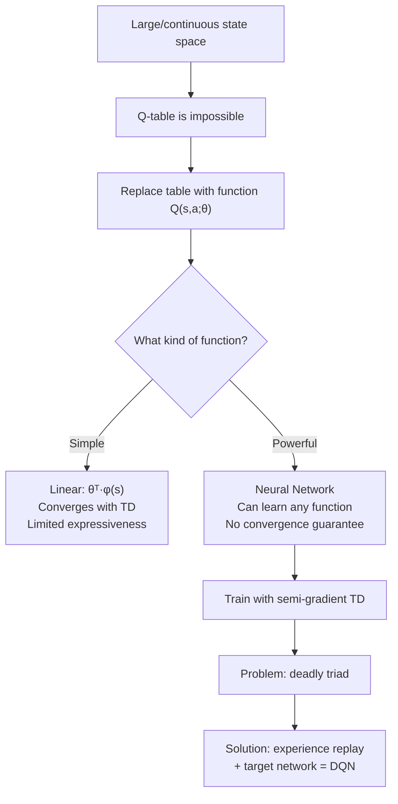

# Function Approximation — Interview Deep Dive

> **What this file covers**
> - 🎯 Why tables fail and how neural networks replace them
> - 🧮 Semi-gradient TD update rule with full derivation
> - ⚠️ The deadly triad: function approximation + bootstrapping + off-policy
> - 📊 Parameter count vs table size: concrete comparisons
> - 💡 Linear vs nonlinear approximators: convergence guarantees and trade-offs
> - 🏭 From tabular to DQN: the exact changes needed for production deep RL

## Brief Restatement

Function approximation replaces the Q-table with a parameterized function — typically a neural network — that maps states to Q-values. Instead of storing one value per state-action pair, the network uses a fixed number of parameters (weights and biases) that generalize across similar states. This makes RL feasible in large or continuous state spaces, but introduces new instabilities: the deadly triad of function approximation, bootstrapping, and off-policy learning can cause training to diverge.

---

## 🧮 Full Mathematical Treatment

### From Table to Function

In tabular Q-learning, Q(s, a) is stored in a table. The update nudges one entry:

    Q(s, a) ← Q(s, a) + α · [ r + γ · max_{a'} Q(s', a') - Q(s, a) ]

With function approximation, we replace the table with a parameterized function Q(s, a; θ), where θ is a vector of learnable parameters (for a neural network, θ is all the weights and biases).

The key difference: updating θ to improve Q(s, a; θ) for one state also changes Q-values for every other state, because all states share the same parameters. In a table, each entry is independent.

### The Semi-Gradient TD Update

We want to minimize the mean squared TD error:

    L(θ) = E[ (y - Q(s, a; θ))² ]

Where the TD target is:

    y = r + γ · max_{a'} Q(s', a'; θ)

Taking the gradient with respect to θ:

    ∇_θ L = -2 · E[ (y - Q(s, a; θ)) · ∇_θ Q(s, a; θ) ]

The update rule is:

    θ ← θ + α · (y - Q(s, a; θ)) · ∇_θ Q(s, a; θ)

This is called "semi-gradient" because we treat y as a constant — we do not differentiate through the target. The target also depends on θ, but we ignore that dependency. This is intentional: differentiating through the target makes the update unstable.

### Why Semi-Gradient, Not Full Gradient?

The full gradient would include the derivative of the target with respect to θ:

    Full gradient: ∇_θ L = -2 · (y - Q(s,a;θ)) · [∇_θ Q(s,a;θ) - γ · ∇_θ max_{a'} Q(s',a';θ)]

This double-sample problem requires two independent samples of s' for the same (s, a), which is generally unavailable. Semi-gradient methods use a single sample and ignore the target's dependence on θ. This works well in practice and is what DQN uses.

### Worked Example: Linear Function Approximation

Suppose the state has two features: s = [s₁, s₂]. We use a linear approximator with parameters θ = [θ₁, θ₂, θ_bias]:

    Q(s, a; θ) = θ₁ · s₁ + θ₂ · s₂ + θ_bias

For a transition (s=[1, 2], a, r=5, s'=[2, 3], done=False), γ = 0.9:

    Current prediction: Q(s, a; θ) = θ₁·1 + θ₂·2 + θ_bias

    Suppose θ = [1.0, 0.5, 0.0]:
    Q(s, a) = 1.0×1 + 0.5×2 + 0.0 = 2.0

    For next state s' = [2, 3]:
    Q(s', a'; θ) = 1.0×2 + 0.5×3 + 0.0 = 3.5

    Target: y = 5 + 0.9 × 3.5 = 8.15
    TD error: δ = 8.15 - 2.0 = 6.15

    Gradient: ∇_θ Q = [s₁, s₂, 1] = [1, 2, 1]

    Update (α = 0.01):
    θ₁ ← 1.0 + 0.01 × 6.15 × 1 = 1.0615
    θ₂ ← 0.5 + 0.01 × 6.15 × 2 = 0.623
    θ_bias ← 0.0 + 0.01 × 6.15 × 1 = 0.0615

Each parameter moves in proportion to how much it contributed to the prediction (its gradient).

### Neural Network as Q-Function

For a neural network with L layers:

    h₀ = s                                          (input)
    h_l = activation(W_l · h_{l-1} + b_l)           (hidden layers)
    Q(s, ·; θ) = W_L · h_{L-1} + b_L                (output, no activation)

Where:
- θ = {W₁, b₁, W₂, b₂, ..., W_L, b_L} — all weights and biases
- activation is typically ReLU: f(x) = max(0, x)
- The output layer has no activation because Q-values can be any real number

The network takes a state as input and outputs one Q-value per action. For CartPole with 4 state dimensions and 2 actions, using hidden layers of size 64:

    Parameters in layer 1: 4 × 64 + 64 = 320
    Parameters in layer 2: 64 × 64 + 64 = 4,160
    Parameters in output: 64 × 2 + 2 = 130
    Total: 4,610 parameters

A Q-table for the same problem (discretized into 10 bins per dimension) would need 10⁴ × 2 = 20,000 entries. The network is smaller and handles continuous states.

---

## 🗺️ Concept Flow

---

## ⚠️ Failure Modes and Edge Cases

### 1. The Deadly Triad — Divergence

The combination of three elements can cause Q-values to grow without bound:

1. **Function approximation** — updating θ for one state changes Q-values everywhere. An increase for state s can accidentally inflate Q-values for state s', which then inflates targets for state s, creating a positive feedback loop.

2. **Bootstrapping** — the target r + γ max Q(s', a'; θ) depends on the current parameters. If Q-values are overestimated, the targets become inflated, which pushes Q-values even higher.

3. **Off-policy learning** — the agent learns about a policy (the greedy policy) different from the one generating data (the exploratory policy). The distribution of training data does not match the distribution the learned policy would visit, creating extrapolation errors.

Remove any one element and convergence is possible. Linear TD with on-policy data converges. Tabular off-policy Q-learning converges. Monte Carlo with a neural network converges (no bootstrapping). The danger is specifically the combination of all three.

**How to detect:** monitor Q-value statistics during training. If the mean or max Q-value grows monotonically across episodes without plateauing, the triad is likely causing divergence.

### 2. Catastrophic Forgetting

When the agent trains on experiences from one part of the state space, it can forget what it learned about other parts. This happens because all states share parameters. Updating weights to handle state A well can move Q-values for state B in the wrong direction.

**How it manifests:** the agent performs well in one region, then suddenly performs poorly in regions it had previously mastered. Performance oscillates instead of improving monotonically.

**Mitigation:** experience replay (training on a diverse mix of old and new experiences) is the primary defense.

### 3. Extrapolation Error

The neural network produces Q-values for states it has never seen. These extrapolated values can be wildly wrong, especially for states far from the training distribution. When these wrong values appear in the max of a TD target, they can corrupt learning.

**Example:** if the agent has only seen cart positions in [-2, 2] but the cart drifts to position 5, the network's Q-values at position 5 are meaningless — just whatever the randomly initialized weights produce.

**Mitigation:** ensure the replay buffer covers the relevant state space. Use soft updates (Polyak averaging) to prevent sudden jumps in the target.

### 4. Feature Sensitivity in Linear Approximation

Linear function approximation Q(s, a) = θᵀ · φ(s, a) depends entirely on the feature vector φ. Bad features make learning impossible regardless of the algorithm.

**Example:** if the true Q-function is Q(s) = s₁², but φ(s) = [s₁, s₂], no linear combination of s₁ and s₂ can represent a quadratic. The best linear fit will have permanent residual error.

**Mitigation:** use nonlinear approximators (neural networks) or manually design features that capture the relevant structure. Neural networks learn their own features, which is their main advantage.

---

## 📊 Complexity Analysis

| Metric | Q-Table | Linear FA | Neural Network FA |
|--------|---------|-----------|-------------------|
| **Memory** | O(\|S\| × \|A\|) | O(d × \|A\|) | O(Σ n_l × n_{l+1}) |
| **Forward pass** | O(1) lookup | O(d) multiply | O(Σ n_l × n_{l+1}) |
| **Backward pass** | O(1) update | O(d) gradient | O(Σ n_l × n_{l+1}) |
| **Generalization** | None | Linear | Universal |
| **Convergence guarantee** | Yes (with conditions) | Yes (on-policy TD) | No |

Where:
- \|S\| = number of states, \|A\| = number of actions
- d = feature dimension for linear approximation
- n_l = neurons in layer l

**Concrete example for CartPole:**
- Q-Table (10 bins per dim): 10⁴ × 2 = 20,000 entries, 160 KB
- Linear FA (4 features): 4 × 2 + 2 = 10 parameters, <1 KB
- Neural network (64-64): 4,610 parameters, ~18 KB

**Concrete example for Atari (84×84×4 input):**
- Q-Table: impossible (256^{28224} states)
- Linear FA: 28,224 × 18 + 18 = 508,050 parameters, but cannot capture spatial structure
- CNN (DQN architecture): ~1.7 million parameters, 6.5 MB — and it works

---

## 💡 Design Trade-offs

| | Linear FA | Shallow NN (1–2 layers) | Deep NN (3+ layers) |
|---|---|---|---|
| **Expressiveness** | Limited to linear functions of features | Can approximate any continuous function (universal approx theorem) | Same theoretical power, easier to learn hierarchical features |
| **Convergence** | Guaranteed for on-policy TD | No guarantee | No guarantee |
| **Feature engineering** | Required — must hand-design φ(s) | Partially automated — network learns some features | Fully automated — network learns all features |
| **Training stability** | Most stable | Moderate | Least stable without tricks |
| **Sample efficiency** | High (few parameters) | Moderate | Low (many parameters, but can use replay) |
| **When to use** | Small state spaces with known structure | Medium problems, when you can iterate quickly | Large/visual inputs where feature engineering is impossible |

### Feature Representation Choices

| Approach | Description | Trade-off |
|----------|-------------|-----------|
| Raw state | Feed raw observation directly | Simple, but may need more network capacity |
| Tile coding | Divide state space into overlapping tiles | Good for linear FA, but manual design needed |
| Fourier basis | Use sinusoidal features | Good approximation properties, but fixed resolution |
| Learned features (NN) | Let the network discover features | Most flexible, but hardest to train |

---

## 🏭 Production and Scaling Considerations

### GPU Utilization

Neural network Q-functions benefit from GPU acceleration. A single forward pass through a DQN CNN takes ~0.1ms on GPU vs ~5ms on CPU. With batched training (32 transitions per update), the GPU processes all 32 simultaneously.

### Batch Size Selection

Larger batches give more stable gradients but slower per-step updates. Standard choices:

| Problem | Typical Batch Size | Reason |
|---------|-------------------|--------|
| CartPole | 32–64 | Small network, fast training |
| Atari | 32 | Original DQN paper; larger batches not tested |
| Continuous control | 256 | SAC/TD3 work better with larger batches |

### Network Architecture Heuristics

- For vector states (CartPole, MuJoCo): fully connected, 2 hidden layers, 64–256 units each
- For image states (Atari): CNN with 3 conv layers (the DQN architecture), then 1–2 FC layers
- ReLU activation is standard. Tanh or ELU sometimes used in actor-critic methods
- No activation on the output layer — Q-values are unbounded real numbers

### When Linear FA Is Sufficient

Linear function approximation with good features can outperform neural networks on small problems. Mountain Car with tile coding + linear TD converges faster and more reliably than a neural network. The crossover point where neural networks become necessary is roughly when the state space has more than ~10 relevant dimensions or when the value function has nonlinear structure that cannot be captured by hand-designed features.

---

## 🎯 Staff/Principal Interview Depth

### Q1: Why does combining function approximation with bootstrapping and off-policy learning cause instability? What specifically goes wrong?

---
**No Hire**
*Interviewee:* "Function approximation is less accurate than a table, so the values are noisy and learning is harder."
*Interviewer:* This misses the mechanism entirely. The issue is not accuracy — it is systematic instability. The candidate does not distinguish between noise and divergence.
*Criteria — Met:* none / *Missing:* mechanism of divergence, role of each triad element, how they interact

**Weak Hire**
*Interviewee:* "The deadly triad can cause Q-values to diverge. Function approximation means updating one state affects others. Bootstrapping means errors propagate. Off-policy means the data distribution does not match what the policy would visit."
*Interviewer:* Correct identification of all three elements and their individual effects. Missing the specific interaction mechanism — how exactly do they combine to create a positive feedback loop?
*Criteria — Met:* identifies all three elements, describes individual effects / *Missing:* interaction mechanism, concrete example of divergence, mitigation strategies

**Hire**
*Interviewee:* "The three elements create a positive feedback loop. Function approximation means Q(s, a; θ) shares parameters across states — updating for one state changes values everywhere. Bootstrapping means the target r + γ max Q(s') depends on these same parameters. Off-policy means we train on data from an exploratory policy but evaluate under the greedy policy, creating distribution mismatch. The feedback loop: overestimated Q-values produce inflated targets, which push Q-values higher, which inflate targets further. In tabular, each entry is independent so this cannot happen. With on-policy data, the distribution stays consistent so extrapolation errors are bounded. With Monte Carlo (no bootstrapping), targets are independent of parameters. You need all three for the loop."
*Interviewer:* Precise description of the feedback mechanism. Clear understanding of why removing any element breaks the loop. Would push to Strong Hire with a concrete example or connection to practical mitigation.
*Criteria — Met:* feedback mechanism, role of each element, why removing one helps / *Missing:* concrete divergence example, quantitative analysis of error propagation

**Strong Hire**
*Interviewee:* "The core issue is error amplification through a cycle: function approximation creates correlated errors across states (parameter sharing), bootstrapping propagates these errors forward in time (target depends on Q(s')), and off-policy learning creates distribution mismatch so the errors are not self-correcting.

Concretely: suppose Q(s₁; θ) is accidentally overestimated. Because s₂ is nearby in feature space, Q(s₂; θ) is also overestimated. Now when we compute the target for s₃ using max Q(s₂), the target is inflated. We train on this inflated target, which increases Q(s₃; θ), which shares parameters with s₁, pushing it even higher.

With on-policy data, the agent would visit states in proportion to their true importance, so overestimated states would get corrected by actual experience. Off-policy breaks this self-correction. The Baird counterexample (1995) demonstrates divergence even with linear FA + TD + off-policy. Tsitsiklis and Van Roy (1997) proved convergence for linear TD with on-policy data — specifically, the projection onto the representable space is a contraction in the on-policy distribution norm but not in other norms.

DQN addresses this with experience replay (breaks temporal correlation, approximates on-policy distribution) and target networks (breaks the feedback cycle by fixing the target for N steps). Neither fully solves the triad — DQN can still diverge in theory — but together they make it rare enough for practical use."
*Interviewer:* Exceptional depth. Traces the exact mechanism, provides a concrete example, cites the relevant theory, and connects to practical solutions. The mention of Baird's counterexample and the projection contraction result shows real understanding of the theoretical landscape.
*Criteria — Met:* complete mechanism, concrete example, theoretical grounding, practical connection, historical context
---

### Q2: Compare linear function approximation with neural network function approximation. When would you choose each?

---
**No Hire**
*Interviewee:* "Neural networks are always better because they are more powerful."
*Interviewer:* This shows no understanding of the convergence–expressiveness trade-off. Ignores that linear FA has convergence guarantees that neural networks lack.
*Criteria — Met:* none / *Missing:* trade-off analysis, convergence properties, practical considerations

**Weak Hire**
*Interviewee:* "Linear FA is simpler and converges, but neural networks are more expressive. For small problems use linear, for big problems use neural networks."
*Interviewer:* Correct at a high level but no detail on convergence conditions, no discussion of feature engineering, no concrete examples.
*Criteria — Met:* basic trade-off / *Missing:* convergence conditions, feature engineering discussion, concrete examples, sample efficiency comparison

**Hire**
*Interviewee:* "Linear FA: Q(s,a) = θᵀ · φ(s,a) is guaranteed to converge under on-policy TD learning (Tsitsiklis and Van Roy, 1997) as long as the features are fixed. It is fast, sample-efficient, and interpretable. The drawback is that all expressiveness comes from the feature vector φ — if your features miss important structure, no amount of training helps.

Neural networks learn their own features, so they can approximate any continuous function (universal approximation). But they have no convergence guarantee with bootstrapping. They need more data and are harder to debug.

I would use linear FA when the state space is small enough to design good features manually — for example, Mountain Car with tile coding, or robot control with known physics. I would use neural networks when the state is high-dimensional or visual, where feature engineering is impossible — Atari, complex robotics, or any problem with pixel input."
*Interviewer:* Solid analysis with specific conditions and examples. Would push to Strong Hire with discussion of sample efficiency trade-offs and hybrid approaches.
*Criteria — Met:* convergence properties, feature engineering trade-off, concrete examples / *Missing:* sample efficiency quantification, hybrid approaches, production considerations

**Strong Hire**
*Interviewee:* "The key trade-off is convergence guarantee vs expressiveness. Linear FA with fixed features converges under on-policy TD because the projected Bellman operator is a contraction in the d_μ-weighted norm (where μ is the on-policy state distribution). The fixed point is the best linear approximation of the true value function within the feature space. The error bound is: ||V_θ - V*||_μ ≤ 1/(1-γ) · ||V* - Π V*||_μ, where Π is the projection onto the linear subspace.

Neural networks do not have this guarantee because the projection is nonlinear and non-convex. SGD can get stuck in local minima or diverge. But they learn their own features, which eliminates the feature engineering bottleneck. In practice, neural networks with experience replay and target networks work reliably on problems where linear FA with hand-designed features would also work — they just need more data.

The crossover point is roughly 10–20 state dimensions. Below that, tile coding or Fourier basis features with linear TD is often faster to implement and more reliable. Above that, or with image input, neural networks are the only practical option.

A hybrid approach: use a neural network as a feature extractor and a linear layer on top. This is exactly what DQN does — the CNN layers learn features, the final linear layer maps features to Q-values. You get learned features with a linear output, which can help stability."
*Interviewer:* Outstanding depth. Cites the error bound for linear FA, understands the non-contractiveness issue for nonlinear, gives a concrete crossover heuristic, and identifies the hybrid approach used in practice.
*Criteria — Met:* error bounds, convergence theory, practical heuristics, hybrid approaches, production insight
---

### Q3: What is catastrophic interference in the context of RL with function approximation, and how does experience replay address it?

---
**No Hire**
*Interviewee:* "Catastrophic interference is when the model forgets things. Replay helps by storing old data."
*Interviewer:* Superficially correct but no mechanism. Does not explain why forgetting happens with shared parameters or how random sampling specifically helps.
*Criteria — Met:* vague definition / *Missing:* mechanism, connection to parameter sharing, why random sampling helps, limitations of replay

**Weak Hire**
*Interviewee:* "When the agent trains on recent experiences, updating the network for those states changes Q-values for other states too, because all states share the same weights. The network forgets how to handle older states. Experience replay stores past experiences in a buffer and samples randomly, so the network trains on a mix of old and new data."
*Interviewer:* Correct mechanism and solution. Missing quantification of the problem, connection to i.i.d. assumption, and limitations.
*Criteria — Met:* mechanism, solution / *Missing:* i.i.d. connection, quantification, limitations of replay

**Hire**
*Interviewee:* "Catastrophic interference occurs because neural networks use shared parameters. Updating θ to improve Q(s₁, a₁) changes Q(s₂, a₂) as a side effect, since the same weights contribute to both predictions. When the agent explores one region of state space for many consecutive steps, the network becomes very good at that region but the gradient updates degrade predictions elsewhere.

Experience replay addresses this by storing transitions in a buffer and sampling random mini-batches for training. Random sampling has two effects: (1) it breaks temporal correlation — consecutive experiences are not used consecutively for training, which prevents overfitting to the current region; (2) it approximates the i.i.d. assumption that SGD requires — each mini-batch looks like an independent sample from the distribution of all visited states.

Replay does not fully solve catastrophic interference. If the agent stops visiting a region entirely, those experiences eventually age out of the buffer. And replay introduces its own problem: the buffer contains data from old policies, so the distribution in the buffer does not match the current policy's distribution. This is the off-policy aspect of the deadly triad."
*Interviewer:* Thorough treatment. Identifies both the mechanism and the two effects of replay (decorrelation and i.i.d. approximation). Notes the limitation about buffer aging and the off-policy issue.
*Criteria — Met:* mechanism, both effects of replay, limitations / *Missing:* prioritized replay, relationship to continual learning literature

**Strong Hire**
*Interviewee:* "Catastrophic interference is the fundamental tension between plasticity and stability in neural networks. When weights update to fit recent data, old knowledge stored in the same weights is overwritten. In RL, this is especially severe because the data distribution is non-stationary — the agent's policy changes, so the states it visits change, so the training distribution shifts.

Experience replay converts the non-stationary, correlated data stream into something closer to an i.i.d. sample. Each mini-batch contains transitions from different episodes, different time steps, and different parts of state space. The effective training distribution is approximately uniform over the buffer rather than concentrated on recent experiences.

Prioritized experience replay (Schaul et al., 2016) improves on this by sampling transitions with probability proportional to |TD error|^α. Transitions with high surprise are replayed more often, which focuses learning on the most informative experiences. But this introduces bias (non-uniform sampling changes the expected gradient), which must be corrected with importance sampling weights β.

The broader connection is to continual learning — catastrophic forgetting is a major open problem in machine learning. RL is a natural continual learning setting because the task distribution shifts as the policy improves. Methods like EWC (elastic weight consolidation) and progressive neural networks have been explored but experience replay remains the dominant practical solution in deep RL."
*Interviewer:* Exceptional breadth and depth. Connects to continual learning, discusses prioritized replay with the bias correction detail, and frames the problem in the broader context. Staff-level thinking.
*Criteria — Met:* full mechanism, i.i.d. analysis, prioritized replay, importance sampling correction, continual learning connection
---

### Q4: Walk me through the exact computation in one training step of a Q-network. What happens to the parameters?

---
**No Hire**
*Interviewee:* "You compute the loss and do backpropagation to update the weights."
*Interviewer:* This is a description of supervised learning, not specific to RL. No mention of TD target construction, semi-gradient, or the specific loss function.
*Criteria — Met:* none / *Missing:* TD target, semi-gradient, loss function, gradient computation

**Weak Hire**
*Interviewee:* "Sample a transition (s, a, r, s'). Compute the target y = r + γ max Q(s'). Compute the prediction Q(s, a). Loss is (y - Q(s,a))². Backpropagate and update weights."
*Interviewer:* Correct steps but no detail on semi-gradient, no mention of detaching the target, no shapes or dimensions.
*Criteria — Met:* correct steps / *Missing:* semi-gradient explanation, implementation detail (detach), shapes, worked example

**Hire**
*Interviewee:* "Given a mini-batch of N transitions {(sᵢ, aᵢ, rᵢ, s'ᵢ, doneᵢ)}:

1. Forward pass on states: Q(sᵢ, ·; θ) gives Q-values for all actions. Shape: (N, |A|).
2. Select Q(sᵢ, aᵢ; θ) using the actions taken. Shape: (N,).
3. Forward pass on next states: Q(s'ᵢ, ·; θ). Take max over actions: max_{a'} Q(s'ᵢ, a'). Shape: (N,).
4. Compute targets: yᵢ = rᵢ + γ · (1 - doneᵢ) · max_{a'} Q(s'ᵢ, a'; θ). Detach from computation graph — no gradient flows through the target.
5. Loss: L = (1/N) Σ (yᵢ - Q(sᵢ, aᵢ; θ))²
6. Backward pass: compute ∇_θ L
7. Optimizer step: θ ← θ - α · ∇_θ L (or Adam equivalent)

The critical detail is step 4: the target is detached (torch.no_grad() or .detach()). This makes it a semi-gradient method. If we differentiated through the target, we would need ∇_θ max Q(s'), which creates the full Bellman residual gradient — this has higher variance and is not used in practice."
*Interviewer:* Thorough walkthrough with shapes and the critical detach detail. Clear understanding of semi-gradient vs full gradient.
*Criteria — Met:* complete procedure, shapes, semi-gradient explanation / *Missing:* specific optimizer details, gradient clipping, connection to target network

**Strong Hire**
*Interviewee:* [All of Hire, plus:]

"In practice, three additional details matter:

First, gradient clipping. DQN clips gradients to [-1, 1] (equivalently, uses Huber loss instead of MSE). This prevents large TD errors from causing huge parameter updates that destabilize training.

Second, the target network. Steps 3-4 use a separate frozen copy θ⁻ instead of θ: yᵢ = rᵢ + γ · (1 - doneᵢ) · max_{a'} Q(s'ᵢ, a'; θ⁻). This further stabilizes the target because θ⁻ only changes every N steps.

Third, the optimizer. Adam is standard because it adapts the learning rate per-parameter. The effective update for each weight is: θⱼ ← θⱼ - α · m̂ⱼ / (√v̂ⱼ + ε), where m̂ and v̂ are bias-corrected estimates of the first and second moments of the gradient. This handles the fact that different parameters see very different gradient magnitudes — weights in early CNN layers have small gradients, while later FC layers have larger ones.

One subtle point: the (1 - done) term in the target is essential. For terminal states, the target is just rᵢ — there is no future value. Forgetting this term causes the agent to plan beyond the end of the episode, which corrupts learning."
*Interviewer:* Production-quality understanding. Identifies gradient clipping, target network interaction, optimizer choice, and the terminal state handling detail. This is the level of understanding needed to debug real training issues.
*Criteria — Met:* complete procedure, implementation details, gradient clipping, target network connection, optimizer insight, terminal state handling
---

---

## Key Takeaways

🎯 1. Function approximation replaces the Q-table with a parameterized function — typically a neural network — enabling RL in large or continuous state spaces
   2. The semi-gradient TD update treats the target as a constant: θ ← θ + α · δ · ∇_θ Q(s,a;θ), where δ is the TD error
🎯 3. The deadly triad (function approximation + bootstrapping + off-policy) can cause divergence — DQN addresses this with experience replay and target networks
   4. Linear FA with good features converges under on-policy TD; neural networks have no convergence guarantee but learn features automatically
⚠️ 5. Catastrophic interference — updating parameters for one state corrupts Q-values for others — is the core instability that experience replay mitigates
   6. Parameter count: a DQN with ~5K parameters handles problems where a Q-table would need millions of entries
   7. The critical implementation detail: always detach the target from the computation graph (semi-gradient, not full gradient)
🎯 8. Neural networks become necessary at roughly 10+ state dimensions or with image/sensor input where feature engineering is impossible
