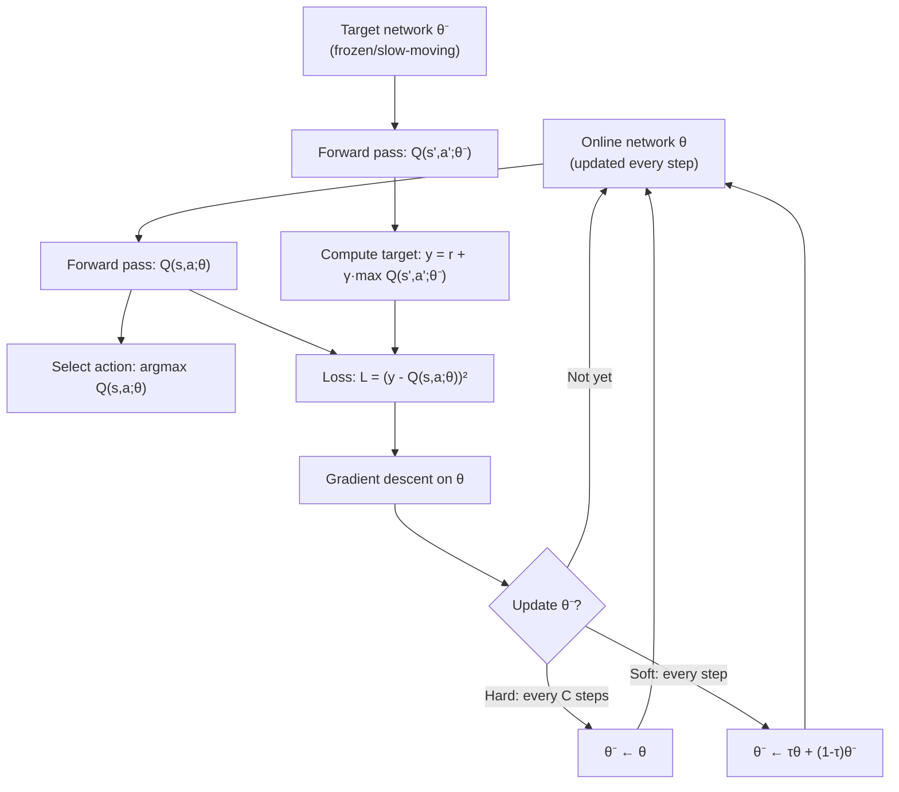

# Target Networks — Interview Deep Dive

> **What this file covers**
> - 🎯 Why a frozen copy of the Q-network stabilizes training
> - 🧮 Hard updates vs soft (Polyak) updates — math, lag analysis, and stability conditions
> - ⚠️ Staleness, discontinuity artifacts, and interaction with other DQN components
> - 📊 Update frequency sensitivity and computational overhead
> - 💡 Hard vs soft updates: convergence properties and algorithm preferences
> - 🏭 Target networks in modern algorithms: SAC, TD3, DDPG

## Brief Restatement

The target network is a frozen copy of the Q-network used only for computing TD targets. Without it, the target r + γ max Q(s'; θ) changes every time the online network θ is updated, creating a positive feedback loop: overestimated Q-values produce inflated targets, which push Q-values higher. The target network θ⁻ breaks this loop by providing a stable target for many training steps before being updated. Hard updates copy θ to θ⁻ every C steps. Soft (Polyak) updates blend θ into θ⁻ every step with a small mixing factor τ.

---

## 🧮 Full Mathematical Treatment

### The Moving Target Problem

Without a target network, the TD target for transition (s, a, r, s') is:

    y = r + γ · max_{a'} Q(s', a'; θ)

The loss function is:

    L(θ) = E[ (y - Q(s, a; θ))² ]
         = E[ (r + γ · max_{a'} Q(s', a'; θ) - Q(s, a; θ))² ]

The problem: both the prediction Q(s, a; θ) and the target Q(s', a'; θ) depend on the same parameters θ. When we compute ∇_θ L and update θ, both terms change simultaneously. This is analogous to solving x = f(x) where f changes every time you evaluate it.

### Target Network Fix

With a target network, the target uses frozen parameters θ⁻:

    y = r + γ · max_{a'} Q(s', a'; θ⁻)

Now y is a constant with respect to θ (as long as θ⁻ does not change). Minimizing L(θ) = E[(y - Q(s,a;θ))²] is a standard supervised learning problem with fixed targets. The online network can converge to the targets before they change.

### Hard Update

Every C steps, copy all parameters:

    θ⁻ ← θ    (every C steps)

Between copies, θ⁻ is completely frozen. The target is a piecewise-constant function of training time.

**Effective lag:** at the moment of copy, lag = 0. Just before the next copy, lag = C gradient steps. Average lag = C/2 gradient steps.

### Soft Update (Polyak Averaging)

Every step, blend a small fraction of the online weights into the target:

    θ⁻ ← τ · θ + (1 - τ) · θ⁻    (every step)

Where τ ∈ (0, 1) is the mixing coefficient. Typically τ = 0.001 to 0.01.

**Exponential moving average interpretation:** after k steps, the target network weights are:

    θ⁻_k = τ · θ_k + τ(1-τ) · θ_{k-1} + τ(1-τ)² · θ_{k-2} + ...

The weight of θ_{k-j} decays as (1-τ)^j. The effective window is approximately 1/τ steps. For τ = 0.005, the target reflects what the online network was approximately 200 steps ago.

**Half-life:** the weight on past parameters halves every ln(2)/ln(1/(1-τ)) ≈ ln(2)/τ steps. For τ = 0.005: half-life ≈ 139 steps.

### Stability Condition

For the system to be stable, the online network must be able to converge to the current target before the target changes significantly. Informally:

    Rate of learning >> Rate of target change

For hard updates: the online network has C steps to converge. With learning rate α, the online network changes by approximately α × C per cycle. The target changes by 1 "copy" per cycle. Stability requires that the online network has converged to the target by the time the next copy happens.

For soft updates: at each step, the target changes by τ × (θ - θ⁻). The online network changes by α × gradient. Stability requires α >> τ (the learning step should dominate the target movement).

In practice, this holds: typical α = 1e-4, typical τ = 5e-3, so α/τ ≈ 0.02, meaning the target moves ~50x slower than the learning. The target is effectively a slowly drifting reference point.

### Worked Example: Hard Update

Step 0: θ = θ⁻ = [1.0, 0.5, -0.2] (3 parameters for illustration).

Steps 1–999: θ is updated by gradient descent.
After 999 steps: θ = [1.8, 0.3, 0.1]. θ⁻ = [1.0, 0.5, -0.2] (unchanged).

Step 1000 (copy): θ⁻ ← θ = [1.8, 0.3, 0.1].

All targets instantly shift. Q_target(s') for every state changes in one step.

### Worked Example: Soft Update

Step 0: θ = [1.0, 0.5, -0.2], θ⁻ = [1.0, 0.5, -0.2], τ = 0.01.

After step 1, θ = [1.02, 0.49, -0.18] (from gradient):
    θ⁻ ← 0.01 × [1.02, 0.49, -0.18] + 0.99 × [1.0, 0.5, -0.2]
        = [0.0102, 0.0049, -0.0018] + [0.99, 0.495, -0.198]
        = [1.0002, 0.4999, -0.1998]

The target network barely moved — a change of ~0.0002 per parameter vs ~0.02 for the online network. Over 100 steps, the target gradually drifts toward the online network without any sudden jumps.

---

## 🗺️ Concept Flow

---

## ⚠️ Failure Modes and Edge Cases

### 1. Target Staleness (C Too Large)

When the target network is updated infrequently, it produces Q-values based on very old weights. These Q-values may be systematically wrong in a direction that does not match the current learned Q-function.

**Symptoms:** the online Q-values improve (loss decreases), but episode performance does not improve or degrades. The targets are so stale that learning toward them pushes the online network in the wrong direction.

**Example:** after 50,000 steps of training, the agent has learned that entering state X is bad. But the target network (last updated 20,000 steps ago) still assigns a high Q-value to state X. The target for states leading to X is inflated, causing the online network to overvalue transitions into X.

**Fix:** decrease C or switch to soft updates.

### 2. Target Discontinuity (Hard Update Artifact)

With hard updates, the target function Q(s'; θ⁻) changes discontinuously at every copy step. At step 999, the target is based on θ⁻_old. At step 1000, the target is based on θ⁻_new = θ, which may be very different. This creates a spike in the loss at every copy step.

**Symptoms:** the loss curve shows periodic spikes every C steps, followed by rapid recovery. Training is effective but noisy.

**Fix:** soft updates eliminate this discontinuity entirely. If hard updates are preferred, smaller C reduces the magnitude of the jump.

### 3. τ Too Large (Soft Update)

If τ is too large (e.g., τ = 0.1), the target network tracks the online network too closely, and the stabilization effect is lost. In the extreme (τ = 1.0), it is equivalent to no target network — every step copies the online weights fully.

**Symptoms:** same instability as having no target network — Q-values grow without bound, training diverges.

**Typical range:** τ = 0.001 to 0.01. τ = 0.005 is the most common default (SAC, TD3).

### 4. Interaction with Learning Rate

The target network's effectiveness depends on the learning rate α. If α is very large, the online network changes dramatically between target updates, and the target becomes stale quickly. If α is very small, the online network changes slowly and the target is always approximately fresh — but learning is slow.

**The ratio α/C (for hard updates) or α/τ (for soft updates) is what matters.** If this ratio is too small, the target is always fresh but learning is slow. If too large, the target is stale.

### 5. Double Counting with Experience Replay

The target network and experience replay both address aspects of the deadly triad, but they can interact in unexpected ways. If the buffer contains transitions from a time when the target network was very different, the targets computed for those transitions may be doubly stale — the transition came from an old policy AND the target network has since been updated.

**In practice:** this is not a major issue because the target network changes slowly (that is its purpose). The transition's state and reward are still valid; only the target computation uses the current θ⁻, which is close to recent θ.

---

## 📊 Complexity Analysis

| Metric | No Target Network | Hard Update | Soft Update |
|--------|-------------------|-------------|-------------|
| **Extra memory** | None | 1× model size | 1× model size |
| **Extra compute per step** | None | Forward pass through θ⁻ | Forward pass through θ⁻ + O(\|θ\|) blend |
| **Copy overhead** | None | O(\|θ\|) every C steps | O(\|θ\|) every step |
| **Target stability** | None — changes every step | Stable for C steps, then jumps | Smooth, gradual change |
| **Effective lag** | 0 (always current) | Average C/2 steps | ~1/τ steps |

**Concrete overhead for DQN (1.7M parameters):**
- Extra memory: 1.7M × 4 bytes = 6.8 MB (negligible vs buffer)
- Forward pass through θ⁻: same cost as through θ (both are the same architecture)
- Soft update blend: 1.7M multiplications per step — <0.1ms on GPU

The target network approximately doubles the forward pass compute (two networks instead of one) but adds negligible memory relative to the replay buffer.

---

## 💡 Design Trade-offs

| | Hard Update (DQN) | Soft Update (SAC/TD3) | No Target Network |
|---|---|---|---|
| **Stability** | High between copies, jump at copy | Consistently smooth | Unstable — can diverge |
| **Target freshness** | Stale on average (lag = C/2) | Always recent (lag ≈ 1/τ) | Always current (lag = 0) |
| **Implementation** | Simple — periodic copy | Simple — EMA per step | N/A |
| **Hyperparameter** | C (discrete, typically 1K–10K) | τ (continuous, typically 0.001–0.01) | None |
| **Used in** | DQN, Rainbow | SAC, TD3, DDPG | PPO (on-policy, no target net needed) |

### Why PPO Does Not Use a Target Network

PPO is on-policy: it collects data with the current policy, trains on it for a few epochs, then discards it. There is no bootstrapping from a separate network in the typical PPO setup. Instead, PPO uses a clipped surrogate objective that limits how much the policy can change in one update — achieving a similar goal (prevent large, destabilizing updates) through a different mechanism.

### Target Network in Actor-Critic Architectures

In actor-critic methods (SAC, TD3, DDPG), there are two networks: the actor (policy) and the critic (Q-function). The target network is applied to the critic only — the actor does not need a target because it is not bootstrapping. The critic's target network provides stable Q-value estimates for the actor's policy gradient.

TD3 adds a twist: it maintains two critics, each with its own target network (4 networks total). The target is the minimum of the two target critics' Q-values, which reduces overestimation (similar to Double DQN's idea applied to actor-critic).

---

## 🏭 Production and Scaling Considerations

### Hard Update Frequency Selection

A systematic approach to choosing C:

1. Start with C = 1,000 and monitor Q-value stability.
2. If Q-values oscillate or diverge, increase C (stabilize more).
3. If learning is very slow, decrease C (fresher targets).
4. Rule of thumb: C should be roughly 10x the number of gradient steps needed for the loss to plateau after a target update. If the loss plateaus in ~100 steps, C = 1,000 is reasonable.

### Soft Update τ Selection

τ is the fraction of online weights mixed into the target each step:

- τ = 0.001: very slow tracking, high stability. Good for complex tasks with many states.
- τ = 0.005: standard default for SAC and TD3. Balances stability and freshness.
- τ = 0.01: faster tracking, less stable. Good for simple tasks where the online network does not change much per step.

### Multi-Network Architectures

Modern algorithms may have multiple target networks:

| Algorithm | Networks | Target Networks | Total |
|-----------|----------|-----------------|-------|
| DQN | 1 Q-net | 1 target Q-net | 2 |
| DDPG | 1 actor + 1 critic | 1 target critic | 3 |
| TD3 | 1 actor + 2 critics | 2 target critics | 5 |
| SAC | 1 actor + 2 critics | 2 target critics | 5 |

Each target network doubles the memory for that component but adds only a small computational overhead.

### Initialization Matters

Both the online and target networks must be initialized identically: θ⁻ = θ at step 0. If they start with different random weights, the target produces arbitrary Q-values that do not relate to the online network's predictions. The initial TD errors will be dominated by the random disagreement between the two networks, not by the actual environment dynamics.

---

## 🎯 Staff/Principal Interview Depth

### Q1: Explain the positive feedback loop that occurs without a target network, and how the target network breaks it.

---
**No Hire**
*Interviewee:* "Without a target network, the targets keep changing, which makes training unstable."
*Interviewer:* Vague description with no mechanism. Does not explain what "changing" means or why it causes instability rather than just noise.
*Criteria — Met:* knows target stability is the issue / *Missing:* feedback loop mechanism, positive feedback direction, parameter sharing role, mathematical detail

**Weak Hire**
*Interviewee:* "The target y = r + γ max Q(s'; θ) uses the same network being updated. When we update θ to increase Q(s, a), this can also increase Q(s') because they share parameters. A higher Q(s') means a higher target, which pushes Q(s) even higher. This is a positive feedback loop. The target network uses separate weights θ⁻ that don't change, breaking the loop."
*Interviewer:* Correctly identifies the feedback mechanism through parameter sharing. Missing the mathematical detail and comparison with the stable case.
*Criteria — Met:* feedback mechanism, parameter sharing role / *Missing:* mathematical formulation, stability condition, hard vs soft comparison

**Hire**
*Interviewee:* "The positive feedback loop has three steps:

1. The online network overestimates Q(s₁; θ) due to noise or max bias.
2. Because Q(s₂; θ) shares parameters with Q(s₁; θ), nearby states s₂ are also overestimated.
3. When s₂ appears in a target computation y = r + γ max Q(s₂; θ), the target is inflated.
4. Training on this inflated target increases the network's overall Q-values, returning to step 1.

The target network breaks the loop at step 3. With θ⁻ frozen, the target y = r + γ max Q(s₂; θ⁻) does not increase when θ is updated. The online network can converge to the fixed targets. When θ⁻ is eventually updated to θ, the targets shift but the new targets reflect the improved (converged) online network, not the unstable intermediate values.

The key mathematical insight: with a fixed target, L(θ) = (y - Q(s,a;θ))² is a standard least-squares problem. Gradient descent on a convex (or nearly convex for neural networks) loss with fixed targets converges. Without fixed targets, the optimization landscape changes at every step — the network is chasing a moving goal."
*Interviewer:* Thorough explanation of the four-step loop, why the target network breaks it at step 3, and the mathematical framing as a fixed-target least-squares problem.
*Criteria — Met:* loop mechanism, how target network breaks it, mathematical framing / *Missing:* comparison of hard vs soft, stability condition, empirical evidence

**Strong Hire**
*Interviewee:* [All of Hire, plus:]

"There are two ways to view the stability condition.

View 1 — contraction mapping: in tabular Q-learning, the Bellman optimality operator T*Q = r + γ max Q(s') is a contraction in the max-norm with factor γ. Repeated application converges to Q*. With function approximation, the update includes a projection onto the representable function class, and Π T* is not guaranteed to be a contraction. The target network reduces the problem to a supervised regression (fit Q(s,a;θ) to a fixed y), sidestepping the contraction issue temporarily.

View 2 — dynamical systems: the coupled system (θ changes → targets change → θ changes) is a two-timescale stochastic approximation. If the target changes on a slower timescale than the learning (the 'slow' process), the fast process (learning) can approximately converge to the fixed point for each frozen target. Then the slow process moves the target, and the fast process re-converges. This is exactly what the target network implements: θ moves fast (every step), θ⁻ moves slow (every C steps or with rate τ).

The two-timescale theory (Borkar, 2008) provides conditions under which this converges: the fast timescale must be infinitely faster than the slow one in the limit. In practice, the ratio α/τ ≈ 0.02 (or α×C ≈ 0.1×10000 = 1000 updates between copies) provides enough separation. This is also why actor-critic methods use soft target updates on the critic but no target on the actor — the critic (slow timescale) provides stable values for the actor's (fast timescale) policy gradient."
*Interviewer:* Exceptional theoretical depth. The two-timescale stochastic approximation framing is exactly the right theoretical lens. Connection to actor-critic timescale separation shows deep structural understanding.
*Criteria — Met:* contraction mapping view, two-timescale theory, practical stability condition, actor-critic connection
---

### Q2: Compare hard and soft target updates. Which would you recommend for a new project, and why?

---
**No Hire**
*Interviewee:* "Hard updates copy the weights every few thousand steps. Soft updates blend them gradually. Both work."
*Interviewer:* Mechanical description only. No trade-off analysis or recommendation.
*Criteria — Met:* knows both exist / *Missing:* trade-off analysis, recommendation with reasoning, mathematical properties

**Weak Hire**
*Interviewee:* "Hard updates are simpler — just copy θ to θ⁻ every C steps. Soft updates blend continuously using θ⁻ ← τθ + (1-τ)θ⁻. Soft updates are smoother because there is no sudden jump. I would recommend soft updates because they are used in more modern algorithms."
*Interviewer:* Correct mechanics and a reasonable recommendation. Missing quantitative analysis, the lag interpretation, and specific scenarios where one is better.
*Criteria — Met:* mechanics, recommendation / *Missing:* lag analysis, scenarios, hyperparameter sensitivity, mathematical comparison

**Hire**
*Interviewee:* "Hard updates: θ⁻ ← θ every C steps. Simple, one hyperparameter (C). Target is piecewise constant — stable for C steps, then jumps. The jump causes a loss spike because all targets shift simultaneously. Average lag: C/2 steps.

Soft updates: θ⁻ ← τθ + (1-τ)θ⁻ every step. Target drifts continuously, no jumps. Effective lag: approximately 1/τ steps. For τ = 0.005, the target reflects the network from ~200 steps ago.

I would recommend soft updates for a new project because:
1. No loss spikes — smoother training curves, easier to diagnose problems.
2. Continuous control of the stability-freshness trade-off via τ.
3. Standard in modern algorithms (SAC, TD3), so more community support and tested hyperparameters.

I would use hard updates only if I needed to reproduce the original DQN paper or if the problem is known to work well with hard updates and I do not want to retune."
*Interviewer:* Strong comparison with specific reasoning for the recommendation. Would push to Strong Hire with mathematical equivalence analysis and edge cases.
*Criteria — Met:* detailed comparison, lag analysis, clear recommendation with reasoning / *Missing:* mathematical equivalence, edge cases, algorithm-specific considerations

**Strong Hire**
*Interviewee:* [All of Hire, plus:]

"There is a mathematical correspondence: a hard update every C steps is roughly equivalent to a soft update with τ = 2/C. For DQN's C = 10,000: τ_equivalent ≈ 0.0002. But this equivalence is approximate — hard updates have zero variance in the target for C-1 steps then a large change, while soft updates have continuous small variance. The information-theoretic content is similar but the dynamics differ.

An important edge case: when the online network changes very rapidly (high learning rate, large gradient norms), soft updates can cause the target to drift too fast if τ is not decreased proportionally. This is less of a concern with hard updates because the target is exactly frozen between copies. In practice, gradient clipping (max norm = 10) keeps gradient norms bounded, preventing this issue.

Another consideration: in distributed training (Ape-X), hard updates have a synchronization advantage. The target network only needs to be synchronized across workers every C steps, not every step. This reduces communication overhead. Soft updates would require communicating the target network parameters every step, which is expensive with many workers.

For a new project: I would start with soft updates (τ = 0.005) unless I am doing distributed training, in which case hard updates (C = 8,000–10,000) are more practical. I would monitor the ratio of target network Q-values to online network Q-values as a diagnostic — if they diverge significantly, the update is too slow (decrease C or increase τ)."
*Interviewer:* Exceptional analysis including the mathematical equivalence, the edge case with gradient norms, the distributed training consideration, and a practical diagnostic. Staff-level systems thinking.
*Criteria — Met:* mathematical equivalence, edge cases, distributed consideration, practical diagnostic, comprehensive recommendation
---

### Q3: The target network and experience replay both address instability in DQN. Could you use one without the other? What would happen?

---
**No Hire**
*Interviewee:* "You need both. They both make training more stable."
*Interviewer:* No understanding of what each component specifically does or why both are needed.
*Criteria — Met:* knows both are needed / *Missing:* what each solves, what happens with only one, the specific interaction

**Weak Hire**
*Interviewee:* "Experience replay breaks correlation in the training data. The target network fixes the moving target problem. They solve different problems. Without replay, the network overfits to recent experiences. Without the target network, Q-values diverge."
*Interviewer:* Correct identification of separate purposes. Missing the experimental evidence and the interaction between them.
*Criteria — Met:* separate purposes / *Missing:* experimental evidence, interaction, residual instability

**Hire**
*Interviewee:* "They address orthogonal problems:

| Problem | Solution |
|---------|----------|
| Correlated training data | Experience replay: random mini-batches from buffer |
| Moving training target | Target network: frozen target computation |

Replay alone (no target network): training data is decorrelated, but the target still moves every step. The positive feedback loop (overestimation → inflated target → higher Q) is still active. Mnih et al. showed this causes instability on most Atari games.

Target network alone (no replay): the target is stable, but the training data is a correlated stream from the current trajectory. The network overfits to wherever the agent currently is and forgets other regions. Mnih et al. showed this also causes poor performance.

Both together: the replay buffer provides diverse, approximately i.i.d. mini-batches AND the target network provides stable targets. Neither alone is sufficient — they complement each other."
*Interviewer:* Clear separation of concerns with empirical evidence. Would push to Strong Hire with discussion of which is more critical and the residual instability.
*Criteria — Met:* orthogonal problems, each-alone analysis, empirical evidence / *Missing:* relative importance, residual instability, alternative solutions

**Strong Hire**
*Interviewee:* [All of Hire, plus:]

"Mnih et al.'s ablation gives an interesting ordering: DQN with both > DQN with replay only > DQN with target network only > DQN with neither. Replay alone helps more than the target network alone, suggesting that data correlation is a more severe problem than moving targets. This makes sense: correlated data causes catastrophic forgetting (a catastrophic failure), while moving targets cause slower convergence and potential divergence (a more gradual degradation).

Even with both, the deadly triad is not fully resolved. The combination tames the instability enough for practical use, but DQN can still diverge in theory (and occasionally in practice on very long training runs). The residual issues:

1. The replay buffer makes training off-policy (data from old policies), which is one vertex of the deadly triad.
2. The target network only delays the target update, not eliminate the dependency on the network's own parameters.
3. The max operator in the target still causes overestimation bias (addressed by Double DQN).

Alternative approaches to stability exist: Fitted Q-Iteration (FQI) performs offline batch updates — collect data, train to convergence, collect more data. This is like an extreme target network where θ⁻ is never updated during training. It avoids the moving target entirely but is very sample-inefficient. Conservative Q-Learning (CQL) adds a penalty that pushes down Q-values for unvisited actions, directly addressing overestimation. These show that the target network is one of several possible solutions, not the only one."
*Interviewer:* Outstanding analysis. The relative importance ordering from ablation, the residual instability analysis, and the connection to alternative approaches (FQI, CQL) show deep understanding of the design space.
*Criteria — Met:* relative importance, residual instability, three-vertex analysis, alternative approaches, design space understanding
---

---

## Key Takeaways

🎯 1. The target network breaks the positive feedback loop: Q overestimation → inflated target → higher Q → divergence
   2. Hard update (θ⁻ ← θ every C steps): stable between copies, but causes loss spikes at copy points. Average lag = C/2
🎯 3. Soft update (θ⁻ ← τθ + (1-τ)θ⁻ every step): smooth, no discontinuities, effective lag ≈ 1/τ steps. Preferred in modern algorithms
   4. Stability condition: the target must change much slower than the online network. For soft updates: τ << α
⚠️ 5. Too infrequent updates → stale targets → slow or incorrect learning. Too frequent updates → no stabilization benefit
   6. The target network doubles memory for the Q-function but adds minimal compute overhead
   7. Experience replay and target networks solve different problems (correlation vs moving target) — both are needed for DQN to work
🎯 8. Two-timescale interpretation: the online network (fast) converges to the target, then the target (slow) advances. This is the theoretical basis for actor-critic methods
