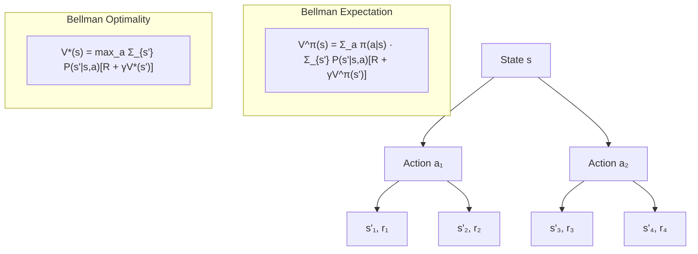

# Bellman Equations — Interview Deep Dive

> **What this file covers**
> - 🎯 Bellman expectation and optimality equations for V and Q
> - 🧮 Full derivations with worked examples
> - ⚠️ Convergence conditions, divergence risks, and the contraction property
> - 📊 Dynamic programming: value iteration and policy iteration complexity
> - 💡 Bellman backup vs sampling-based methods (TD, MC)
> - 🏭 Approximate dynamic programming and practical solvers

## Brief Restatement

The Bellman equation decomposes the value of a state into the immediate reward plus the discounted value of the next state. This recursive structure is the engine inside every RL algorithm. The expectation version evaluates a given policy; the optimality version finds the best policy.

---

## 🧮 Full Mathematical Treatment

### Bellman Expectation Equation for V^π

Starting from the definition:

    V^π(s) = E_π [ r_t + γ · G_{t+1} | s_t = s ]

Expanding the expectation over actions and next states:

    V^π(s) = Σ_a π(a|s) · Σ_{s'} P(s'|s,a) · [ R(s,a,s') + γ · V^π(s') ]

Where:
- π(a|s) is the probability of taking action a in state s under policy π
- P(s'|s,a) is the transition probability
- R(s,a,s') is the reward for the transition
- γ is the discount factor
- V^π(s') is the value of the next state under the same policy

In words: the value of a state is the weighted average (over actions and next states) of the immediate reward plus the discounted future value.

### Bellman Expectation Equation for Q^π

    Q^π(s,a) = Σ_{s'} P(s'|s,a) · [ R(s,a,s') + γ · Σ_{a'} π(a'|s') · Q^π(s',a') ]

Or equivalently:

    Q^π(s,a) = Σ_{s'} P(s'|s,a) · [ R(s,a,s') + γ · V^π(s') ]

### Bellman Optimality Equation for V*

The optimal value function V* satisfies:

    V*(s) = max_a Σ_{s'} P(s'|s,a) · [ R(s,a,s') + γ · V*(s') ]

The key difference from the expectation equation: instead of averaging over actions (weighted by π), we take the **max** over actions. The optimal policy always picks the best action.

### Bellman Optimality Equation for Q*

    Q*(s,a) = Σ_{s'} P(s'|s,a) · [ R(s,a,s') + γ · max_{a'} Q*(s',a') ]

Once you have Q*, the optimal policy is:

    π*(s) = argmax_a Q*(s,a)

### Worked Example

Consider a simple 2-state MDP:
- States: {A, B}
- Actions: {left, right}
- From A: left → stay at A (reward 0), right → go to B (reward 1)
- From B: any action → stay at B (reward 0)
- γ = 0.9
- Deterministic transitions

Bellman optimality for V*:

    V*(A) = max(R(A,left) + γ·V*(A), R(A,right) + γ·V*(B))
          = max(0 + 0.9·V*(A), 1 + 0.9·V*(B))

    V*(B) = max(0 + 0.9·V*(B), 0 + 0.9·V*(B))
          = 0.9·V*(B)

From V*(B) = 0.9·V*(B): V*(B) = 0

    V*(A) = max(0.9·V*(A), 1 + 0)
          = max(0.9·V*(A), 1)

If V*(A) = 0.9·V*(A), then V*(A) = 0. But then max(0, 1) = 1, contradiction.
So V*(A) = 1. Check: max(0.9·1, 1) = max(0.9, 1) = 1. ✅

The optimal policy: take action "right" in state A (to get the reward of 1 and reach state B).

---

## 🗺️ Bellman Backup Diagram

---

## ⚠️ Failure Modes and Edge Cases

### 1. Contraction Property Breakdown
- The Bellman optimality operator T is a contraction in the max-norm: ||TV - TV'||_∞ ≤ γ ||V - V'||_∞
- This guarantees that value iteration converges to a unique fixed point V*
- **But:** with function approximation, the projection step can break the contraction. The composed operator (project ∘ Bellman backup) is not necessarily a contraction in any norm.
- This is the theoretical root of the deadly triad

### 2. Curse of Dimensionality
- For large state spaces, exact Bellman backups require iterating over all states — O(|S|²·|A|) per iteration
- With |S| = 10^6, this is intractable
- Function approximation samples a few states per step but introduces approximation error
- The exact solution is only feasible for small, discrete MDPs

### 3. Model Requirement
- The Bellman equation uses P(s'|s,a) explicitly — this requires knowing the environment dynamics (model-based RL)
- Model-free methods (Q-learning, TD) replace the expectation with a sample: instead of Σ_{s'} P(s'|s,a)[...], they use a single observed transition (s, a, r, s')
- This introduces variance but removes the need for a model

### 4. Bootstrapping Bias
- When using an estimated V̂ in the Bellman backup, the target r + γV̂(s') is biased because V̂ is imperfect
- Monte Carlo methods avoid this by using the full return G_t (unbiased but high variance)
- TD methods bootstrap (biased but low variance)
- The bias-variance trade-off between these approaches is controlled by the number of steps (n-step TD)

---

## 📊 Dynamic Programming Algorithms

### Value Iteration

Repeatedly apply the Bellman optimality operator until convergence:

    V_{k+1}(s) = max_a Σ_{s'} P(s'|s,a) · [ R(s,a,s') + γ · V_k(s') ]

| Property | Value |
|----------|-------|
| Convergence | Guaranteed (contraction mapping theorem) |
| Rate | Linear, factor γ per iteration |
| Iterations needed | O(log(1/ε) / log(1/γ)) for ε-optimal |
| Per-iteration cost | O(\|S\|² · \|A\|) |
| Total cost | O(\|S\|² · \|A\| · log(1/ε) / (1-γ)) |

### Policy Iteration

Alternate between policy evaluation and policy improvement:

1. **Policy Evaluation:** Solve V^π(s) = Σ_a π(a|s) Σ_{s'} P(s'|s,a)[R + γV^π(s')] — a linear system in |S| unknowns
2. **Policy Improvement:** π'(s) = argmax_a Σ_{s'} P(s'|s,a)[R + γV^π(s')]

| Property | Value |
|----------|-------|
| Convergence | Guaranteed in finite steps |
| Evaluation cost | O(\|S\|³) per round (matrix inversion) or O(\|S\|²) iterative |
| Improvement cost | O(\|S\| · \|A\|) per round |
| Total rounds | At most \|A\|^{\|S\|} (number of deterministic policies), but usually much fewer |
| In practice | Often converges in < 10 rounds for moderate MDPs |

### Value Iteration vs Policy Iteration

| | Value Iteration | Policy Iteration |
|---|---|---|
| Per-iteration cost | O(\|S\|²·\|A\|) | O(\|S\|³ + \|S\|·\|A\|) |
| Number of iterations | O(1/(1-γ) · log(1/ε)) | O(\|S\|·\|A\|) worst case, ~10 practical |
| Better when | \|S\| is small, γ is small | \|S\| is moderate, γ is large |
| Finds | Optimal V directly | Optimal π directly |

---

## 💡 Design Trade-offs: Bellman Backup Methods

| Method | Backup Type | Uses Model? | Bias | Variance | Sample Efficiency |
|--------|-------------|-------------|------|----------|-------------------|
| Dynamic Programming | Full sweep over all states | Yes (P required) | None | None | N/A (no sampling) |
| Monte Carlo | Full episode return G_t | No | None | High | Low |
| TD(0) | One-step: r + γV̂(s') | No | Yes (bootstrap) | Low | Medium |
| n-step TD | n-step return | No | Medium | Medium | Medium |
| TD(λ) | Weighted average of n-step returns | No | Tunable via λ | Tunable via λ | Medium-High |

---

## 🏭 Production and Scaling Considerations

- **Approximate dynamic programming (ADP):** Use function approximation to represent V or Q, then apply Bellman backups to sampled states. This scales to large state spaces but loses convergence guarantees.
- **Fitted value iteration:** Train a neural network on {(s_i, target_i)} pairs where target_i = max_a [R + γV_θ(s')]. Used in batch RL and offline RL.
- **Prioritized sweeps:** In value iteration, update states where the Bellman error is largest first. This can dramatically reduce the number of updates needed. Prioritized experience replay applies the same idea to DQN.
- **Asynchronous DP:** Update states in any order (not full sweeps). Converges under the same conditions as synchronous DP, but can be faster in practice because it focuses computation on states that change most.
- **Real-time dynamic programming (RTDP):** Only update states the agent actually visits. Combined with heuristic initialization, this avoids computing values for unreachable states.

---

## Staff/Principal Interview Depth

### Q1: Derive the Bellman expectation equation for V^π and explain each term.

---
**No Hire**
*Interviewee:* "V(s) = R + γ·V(s'). It says the value is the reward plus the discounted next value."
*Interviewer:* Missing the expectation, the policy, and the transition model. This is a special case (deterministic), not the general equation.
*Criteria — Met:* rough intuition / *Missing:* full derivation, expectation over actions and states, precise notation

**Weak Hire**
*Interviewee:* "V^π(s) = Σ_a π(a|s) Σ_{s'} P(s'|s,a) [R(s,a,s') + γ·V^π(s')]. π(a|s) weights over actions according to the policy, P(s'|s,a) handles stochastic transitions, R is the immediate reward, and γ·V^π(s') is the discounted future value."
*Interviewer:* Correct formula with clear term-by-term explanation. Missing derivation from the definition of V^π.
*Criteria — Met:* formula, term explanation / *Missing:* derivation from G_t, connection to recursion, worked example

**Hire**
*Interviewee:* "Starting from V^π(s) = E_π[G_t|s_t=s] = E_π[r_t + γG_{t+1}|s_t=s]. The expectation is over the action a_t ~ π(·|s) and the next state s_{t+1} ~ P(·|s,a_t). Using the tower property of expectations: V^π(s) = E_{a~π}[E_{s'~P}[r + γ·E_π[G_{t+1}|s_{t+1}=s']]] = Σ_a π(a|s) Σ_{s'} P(s'|s,a)[R(s,a,s') + γ·V^π(s')]. The inner E_π[G_{t+1}|s_{t+1}=s'] = V^π(s') by definition. The recursion works because the Markov property ensures the future is independent of the past given the current state."
*Interviewer:* Clean derivation using the tower property, explains why recursion is valid via the Markov property.
*Criteria — Met:* derivation, tower property, Markov property role / *Missing:* matrix form, connection to fixed-point theory

**Strong Hire**
*Interviewee:* "The derivation the Hire gave is correct. In matrix form for finite MDPs: V^π = R^π + γ·P^π·V^π, where R^π is the expected reward vector and P^π is the policy-averaged transition matrix. This is a linear system with solution V^π = (I - γP^π)^{-1}·R^π. The matrix (I - γP^π) is always invertible because the spectral radius of γP^π is at most γ < 1 (P^π is a stochastic matrix with eigenvalues ≤ 1 in magnitude). This is why policy evaluation has a unique solution and can be computed exactly by matrix inversion in O(|S|³). For the optimality equation, the max operator makes it nonlinear, so matrix inversion does not work — we need iterative methods. The Bellman optimality operator T is a γ-contraction in the max-norm, guaranteeing convergence of value iteration at rate γ^k."
*Interviewer:* Matrix formulation, spectral radius argument, contraction mapping theory. Staff-level mathematical depth.
*Criteria — Met:* all — derivation, matrix form, invertibility proof, contraction mapping, value iteration convergence rate
---

### Q2: Compare value iteration and policy iteration. When is each preferred?

---
**No Hire**
*Interviewee:* "Value iteration updates V, policy iteration updates the policy. Both find the optimal policy."
*Interviewer:* Does not distinguish the mechanisms or trade-offs.
*Criteria — Met:* basic distinction / *Missing:* complexity analysis, convergence rates, practical guidance

**Weak Hire**
*Interviewee:* "Value iteration does one Bellman backup per state per iteration and needs many iterations. Policy iteration fully evaluates the current policy then improves it. Policy iteration converges in fewer iterations but each iteration is more expensive because evaluation requires solving a linear system."
*Interviewer:* Correct high-level comparison. Missing specific complexity and practical recommendations.
*Criteria — Met:* mechanism comparison / *Missing:* O-notation complexity, when to use each, modified PI

**Hire**
*Interviewee:* "Value iteration: O(|S|²|A|) per iteration, needs O(log(1/ε)/(1-γ)) iterations for ε-optimality. Policy iteration: O(|S|³) per evaluation (matrix solve) plus O(|S||A|) per improvement, converges in at most |A|^|S| rounds but typically < 10 in practice. Value iteration is preferred when |S| is small and γ is not too close to 1 (the iteration count scales with 1/(1-γ)). Policy iteration is preferred for larger problems with γ close to 1, because it converges in fewer rounds. Modified policy iteration combines both: do k < ∞ evaluation sweeps instead of solving exactly, then improve. This is the practical middle ground."
*Interviewer:* Strong quantitative comparison with modified PI. Good practical guidance.
*Criteria — Met:* complexity, convergence, practical guidance, modified PI / *Missing:* connection to modern algorithms, asynchronous variants

**Strong Hire**
*Interviewee:* "Everything the Hire said, plus: value iteration can be seen as a special case of modified policy iteration with k=1 evaluation sweep. Asynchronous variants of both exist — update only a subset of states per iteration, converge under mild conditions. The real insight is that modern RL algorithms are stochastic, approximate versions of these DP methods. Q-learning is sample-based value iteration. Actor-critic is sample-based policy iteration (critic = evaluation, actor = improvement). Understanding the DP foundations tells you what convergence properties to expect: Q-learning inherits value iteration's contraction guarantee (in the tabular case), while actor-critic inherits policy iteration's guarantee of monotonic improvement (under exact gradients). The gap between theory and practice is that function approximation breaks both guarantees, which is why DQN needs target networks and PPO needs clipping."
*Interviewer:* Connects classical DP to modern algorithms, explains what convergence properties transfer and what breaks. Staff-level synthesis.
*Criteria — Met:* all — complexity, modified PI, connection to modern RL, convergence transfer analysis, function approximation gap
---

### Q3: What is the contraction mapping theorem and why is it important for RL?

---
**No Hire**
*Interviewee:* "It proves that value iteration converges."
*Interviewer:* Correct conclusion but no understanding of the mechanism.
*Criteria — Met:* conclusion / *Missing:* definition, contraction factor, uniqueness, why it matters

**Weak Hire**
*Interviewee:* "A contraction mapping T satisfies ||T(x) - T(y)|| ≤ c||x - y|| for some c < 1. Applying T repeatedly brings any starting point closer to the fixed point. The Bellman optimality operator is a γ-contraction, so value iteration converges with factor γ per iteration."
*Interviewer:* Correct formal statement. Missing the proof sketch and implications for function approximation.
*Criteria — Met:* definition, Bellman contraction / *Missing:* proof, uniqueness, function approximation implications

**Hire**
*Interviewee:* "The Banach fixed-point theorem states: if T is a γ-contraction on a complete metric space, then T has a unique fixed point x*, and for any starting x_0, T^n(x_0) → x* with ||T^n(x_0) - x*|| ≤ γ^n ||x_0 - x*||. For the Bellman operator: T[V](s) = max_a Σ P(s'|s,a)[R + γV(s')]. To show it is a γ-contraction in the max-norm: |T[V](s) - T[V'](s)| = |max_a[R + γΣP·V(s')] - max_a[R + γΣP·V'(s')]| ≤ max_a γΣP|V(s') - V'(s')| ≤ γ||V - V'||_∞. This gives convergence rate: after k iterations, ||V_k - V*||_∞ ≤ γ^k ||V_0 - V*||_∞."
*Interviewer:* Full proof sketch with the key inequality. Strong mathematical depth.
*Criteria — Met:* theorem statement, proof sketch, convergence rate / *Missing:* function approximation implications, when contraction fails

**Strong Hire**
*Interviewee:* "The Hire's proof is correct for the tabular case. The critical issue is what happens with function approximation. The Bellman operator T is a γ-contraction, but the projection operator Π (projecting onto the function class) may expand distances. The composed operator ΠT is not guaranteed to be a contraction in the max-norm. For linear function approximation with on-policy distribution, Gordon (1995) showed that ΠT is a contraction in the weighted L2 norm with weights given by the stationary distribution. For nonlinear function approximation (neural networks), there is no such guarantee — this is the theoretical basis for the deadly triad. Practical fixes: target networks make the operator look closer to a contraction by slowing the target changes. Polyak averaging (soft target updates) interpolates between the current and target network. These are heuristics with no formal guarantees but work well in practice."
*Interviewer:* Extends the theory to function approximation, knows Gordon's result, connects to target networks. Staff-level theory-to-practice bridge.
*Criteria — Met:* all — proof, function approximation analysis, Gordon's result, practical fixes, theory-practice gap
---

---

## Key Takeaways

🎯 1. V^π(s) = Σ_a π(a|s) Σ_{s'} P(s'|s,a)[R + γV^π(s')] — the Bellman expectation equation decomposes value into one step + future
🎯 2. V*(s) = max_a Σ_{s'} P(s'|s,a)[R + γV*(s')] — the Bellman optimality equation replaces the policy average with a max
   3. The Bellman optimality operator is a γ-contraction in the max-norm — this guarantees value iteration converges
   4. Policy iteration converges in fewer rounds than value iteration but each round is more expensive (O(|S|³) vs O(|S|²|A|))
⚠️ 5. With function approximation, the projection step can break the contraction property — this is why DQN needs target networks
🎯 6. Modern RL algorithms are stochastic, approximate versions of DP: Q-learning ≈ value iteration, actor-critic ≈ policy iteration
   7. The Bellman equation's recursive structure — V(s) depends on V(s') — is what makes bootstrapping possible and is the foundation of TD learning
