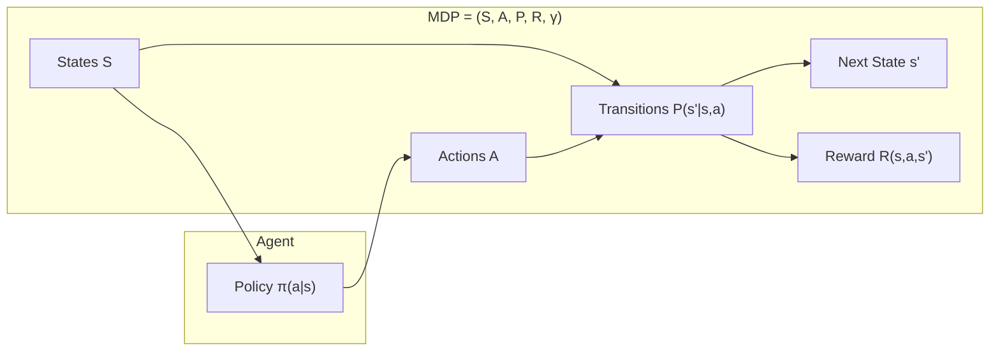

# Markov Decision Processes — Interview Deep Dive

> **What this file covers**
> - 🎯 Formal MDP definition: tuple (S, A, P, R, γ)
> - 🧮 Transition dynamics, reward functions, and the Markov property
> - ⚠️ When the Markov property is violated and workarounds (POMDPs, frame stacking)
> - 📊 State space complexity: tabular vs continuous
> - 💡 MDP design decisions: state representation, action space, reward shaping
> - 🏭 Formulating real-world problems as MDPs

## Brief Restatement

A Markov Decision Process (MDP) is the mathematical framework that formalizes sequential decision-making under uncertainty. It defines states, actions, transition probabilities, and rewards. The Markov property — the future depends only on the present state, not on the past — is what makes the problem tractable.

---

## 🧮 Full Mathematical Treatment

### Formal MDP Definition

An MDP is a 5-tuple (S, A, P, R, γ):

- **S** — a set of states (finite or infinite)
- **A** — a set of actions (finite or infinite)
- **P(s'|s, a)** — transition probability: the probability of moving to state s' given state s and action a
- **R(s, a, s')** — reward function: the reward received when transitioning from s to s' via action a
- **γ ∈ [0, 1)** — discount factor

### The Markov Property

A state s_t has the Markov property if:

    P(s_{t+1} | s_t, a_t) = P(s_{t+1} | s_0, a_0, s_1, a_1, ..., s_t, a_t)

In words: the next state depends only on the current state and action — the full history provides no additional information. This means the state is a sufficient statistic for the future.

### Transition Dynamics

For a finite MDP, the transition function is a matrix for each action:

    P_a[i, j] = P(s' = j | s = i, a)

Where:
- P_a has shape (|S| × |S|) for each action a
- Each row sums to 1: Σ_{s'} P(s'|s, a) = 1 for all s, a
- |S| is the number of states

Example with 3 states and 2 actions: P has shape (2 × 3 × 3) — two 3×3 matrices, one per action.

### Reward Function Variants

The reward can be defined in three ways:

    R(s, a, s')  — depends on current state, action, AND next state
    R(s, a)      — depends on current state and action only
    R(s)         — depends on current state only

All three are equivalent — you can convert between them by taking expectations. Most algorithms use R(s, a) for simplicity.

### Finite vs Infinite Horizon

- **Finite horizon:** episode has a fixed length T. Return = Σ_{t=0}^{T} r_t (no discounting needed, since the sum is bounded)
- **Infinite horizon:** episode can last forever. Return = Σ_{t=0}^{∞} γ^t r_t (discounting is required to keep the sum finite)
- **Episodic:** the environment has terminal states. Each episode ends when a terminal state is reached.
- **Continuing:** no terminal states. The agent runs forever.

---

## 🗺️ MDP Structure

---

## ⚠️ Failure Modes and Edge Cases

### 1. Markov Property Violations (POMDPs)
- In many real problems, the agent cannot observe the full state — it sees an **observation** that contains only partial information
- Example: a poker player cannot see the opponent's cards. The true state includes all cards, but the observation is only the player's own hand.
- Formally: this is a Partially Observable MDP (POMDP), not an MDP
- **Workarounds:** Frame stacking (use last N observations as the state), recurrent networks (LSTM/GRU learn to aggregate history), belief states (maintain a distribution over possible states)

### 2. State Representation Problems
- **Too little information:** violates Markov property. Example: using only the ball position in Pong without velocity — the agent cannot predict where the ball will go next
- **Too much information:** makes the state space unnecessarily large. Example: including irrelevant pixels in an Atari game
- **Non-Markov features:** including features that depend on history (running average, time since last event) can help but may not fully restore the Markov property

### 3. Reward Design Pitfalls
- **Sparse rewards:** reward only at the end of a long episode makes credit assignment extremely hard
- **Dense but misleading rewards:** intermediate rewards can create local optima. Example: rewarding a robot for moving toward the goal step-by-step can cause it to avoid necessary detours
- **Reward scale:** if rewards are too large, learning is unstable. If too small, the signal is lost in noise.

### 4. Large or Continuous State Spaces
- Tabular methods require storing values for every state — impossible when |S| is huge (e.g., Go has ~10^{170} states)
- Function approximation (neural networks) is required but introduces its own instabilities

---

## 📊 Complexity Analysis

| MDP Property | Impact on Complexity |
|---|---|
| |S| states | Tabular methods: O(|S|) memory for V, O(|S|·|A|) for Q |
| |A| actions | Per-state computation scales with |A| for argmax |
| Transition matrix P | Full model: O(|S|²·|A|) entries — impractical for large MDPs |
| Horizon T | Planning complexity scales with T for finite-horizon problems |
| Continuous S or A | Requires function approximation — complexity depends on model architecture |

### Dynamic Programming Complexity (if model is known)

- **Value Iteration:** O(|S|²·|A|) per iteration, typically needs O(1/(1-γ)) iterations
- **Policy Iteration:** O(|S|³) per evaluation step (matrix inversion), O(|S|·|A|) per improvement step, converges in finite steps

---

## 💡 Design Trade-offs

| Decision | Option A | Option B |
|----------|----------|----------|
| State representation | Raw observations (images) | Engineered features |
| | ✅ No feature engineering needed | ✅ Smaller state space, faster learning |
| | ❌ Huge input, needs deep networks | ❌ May lose important information |
| Action space | Discrete (finite choices) | Continuous (real-valued) |
| | ✅ Argmax is easy, Q-learning works | ✅ Smooth control, physical systems |
| | ❌ Cannot represent fine-grained control | ❌ Harder optimization, no simple argmax |
| Reward frequency | Dense (every step) | Sparse (only at goal) |
| | ✅ Fast learning, clear signal | ✅ No reward shaping needed, natural |
| | ❌ Risk of reward hacking | ❌ Extremely slow learning, credit assignment |

---

## 🏭 Production and Scaling Considerations

- **Problem formulation is the hardest part:** Deciding what the states, actions, and rewards are is often more important than choosing the algorithm
- **State engineering:** In practice, raw observations are preprocessed — cropping, downsampling, stacking frames, normalizing. This engineering determines whether the MDP is tractable
- **Action discretization:** Continuous action spaces are sometimes discretized for simplicity (e.g., steering angles into 5 bins). This trades resolution for algorithm simplicity
- **Reward shaping:** Adding intermediate rewards to guide learning. Must be potential-based to preserve the optimal policy (Ng, Harada & Russell, 1999)
- **Multi-agent MDPs:** When multiple agents interact, the standard MDP framework extends to Markov Games (stochastic games), where transition and reward depend on all agents' joint actions

---

## Staff/Principal Interview Depth

### Q1: What is the Markov property and when is it violated in practice?

---
**No Hire**
*Interviewee:* "The Markov property means the future only depends on the present. It is usually satisfied."
*Interviewer:* Correct definition but no depth. Does not discuss violations or implications.
*Criteria — Met:* definition / *Missing:* examples of violations, workarounds, practical implications

**Weak Hire**
*Interviewee:* "The Markov property states P(s_{t+1}|s_t, a_t) = P(s_{t+1}|s_0,...,s_t, a_t). It is violated when the agent has partial observability — for example, in poker where you cannot see the opponent's cards. The fix is to use a POMDP or stack observations."
*Interviewer:* Good formal statement and example. Missing discussion of how common violations are and the practical impact.
*Criteria — Met:* formal definition, POMDP mention, one example / *Missing:* frame stacking details, belief states, impact on algorithms

**Hire**
*Interviewee:* "The Markov property is almost never perfectly satisfied in practice. Any time the state representation is incomplete, it is violated. In Atari games, a single frame does not contain velocity information — DQN uses 4 stacked frames to approximate the Markov property. In robotics, sensor noise and hidden dynamics make the problem partially observable. Recurrent architectures (DRQN) can learn to aggregate history. The key insight is that the Markov property is a property of the state representation, not the environment — you can often restore it by enriching the state."
*Interviewer:* Strong practical understanding. Knows that Markov property depends on representation, not just the environment.
*Criteria — Met:* formal definition, practical violations, frame stacking, recurrent approach, key insight / *Missing:* belief states, computational cost analysis

**Strong Hire**
*Interviewee:* "The Markov property is about sufficient statistics — s_t is Markov if it captures all information needed to predict future states and rewards. In theory, the full history is always Markov (just define the state as the full history). The practical question is whether we can find a compact Markov representation. When we cannot, we are in a POMDP. The belief state — P(s_t|o_1,...,o_t) — is always Markov but may be intractable to compute. Practical approximations: frame stacking (O(k) memory, k frames), recurrent policies (O(h) hidden state that compresses arbitrary history), and transformers (attention over full trajectory). The choice involves a compute-memory-accuracy tradeoff. Frame stacking is cheapest but has a fixed window. Recurrent models can in principle capture arbitrary history but suffer from vanishing gradients. Transformers handle long contexts best but are expensive."
*Interviewer:* Connects belief states, sufficient statistics, and practical approximations with their trade-offs. Staff-level answer.
*Criteria — Met:* all — sufficient statistics framing, belief states, three practical approaches with trade-offs, computational analysis
---

### Q2: How do you formulate a real-world problem as an MDP?

---
**No Hire**
*Interviewee:* "You define the states, actions, and rewards based on the problem."
*Interviewer:* Too vague to be useful. No methodology or concrete considerations.
*Criteria — Met:* basic vocabulary / *Missing:* systematic approach, examples, design decisions

**Weak Hire**
*Interviewee:* "You need to identify what the agent observes (states), what it can do (actions), and what constitutes success (rewards). For example, for a self-driving car: state is camera images and sensor data, actions are steering and acceleration, reward is +1 for safe driving and -100 for collisions."
*Interviewer:* Reasonable example but does not address the hard design decisions — time step granularity, state representation choices, reward engineering.
*Criteria — Met:* concrete example / *Missing:* design decisions, time step analysis, Markov property considerations

**Hire**
*Interviewee:* "The formulation involves several non-obvious decisions. First, time step granularity — for a robot, do you act at 10Hz or 100Hz? Faster allows finer control but makes the horizon longer and credit assignment harder. Second, state representation — do you use raw sensor data or engineered features? Raw is more general but requires more data. Third, action space — continuous for physical systems, but sometimes discretizing is better for algorithm compatibility. Fourth, reward function — the hardest part. You want it to be dense enough for learning but not so shaped that it introduces unintended optima. Potential-based shaping preserves the optimal policy. Fifth, the Markov property — you must verify that your state representation contains enough information."
*Interviewer:* Systematic approach covering five key design decisions. Knows about potential-based shaping.
*Criteria — Met:* systematic approach, five design dimensions, shaping / *Missing:* multi-objective rewards, safety constraints, termination conditions

**Strong Hire**
*Interviewee:* "Beyond the five standard design decisions, I would also consider: termination conditions (what ends an episode — time limit, goal reached, failure?), multi-objective rewards (safety vs. performance — how to balance?), and whether the problem is truly sequential or can be decomposed into simpler sub-MDPs using options or hierarchical RL. In production, the biggest failure mode is reward misspecification — the agent optimizes the proxy reward instead of the true objective. I would start with the simplest possible formulation, verify it works in a toy version of the problem, then scale up. A concrete methodology: (1) define success criteria independent of RL, (2) choose the simplest state representation that satisfies the Markov property, (3) design a reward that correlates with success on held-out evaluation, (4) validate with a known-good baseline before deploying the RL agent."
*Interviewer:* Provides a concrete methodology, considers hierarchical decomposition, multi-objective rewards, and production failure modes. Staff-level systems thinking.
*Criteria — Met:* all — systematic methodology, hierarchical considerations, multi-objective, production awareness, validation strategy
---

### Q3: Compare finite and infinite horizon MDPs. When do you use each?

---
**No Hire**
*Interviewee:* "Finite horizon means the game ends. Infinite horizon means it goes forever."
*Interviewer:* Correct but superficial. No discussion of discounting, convergence, or practical implications.
*Criteria — Met:* basic distinction / *Missing:* discounting analysis, convergence, practical examples

**Weak Hire**
*Interviewee:* "In finite horizon MDPs, episodes have a fixed length T and you can use undiscounted returns. In infinite horizon, you need discounting with γ < 1 to keep the return finite. Most practical problems are episodic with finite horizons."
*Interviewer:* Correct technical distinction but missing the nuances of γ's role and continuing tasks.
*Criteria — Met:* discounting rationale / *Missing:* γ trade-offs, continuing tasks, effective horizon

**Hire**
*Interviewee:* "The choice between finite and infinite horizon affects the optimal policy. In finite horizon, the optimal policy is generally non-stationary — it depends on how many steps remain. In infinite horizon with discounting, the optimal policy is stationary — the same policy works regardless of when you apply it. The discount factor γ creates an effective horizon of 1/(1-γ): with γ=0.99, the agent effectively plans ~100 steps ahead. This is why γ is both a mathematical convenience (ensures convergence) and a design choice (controls how far-sighted the agent is). Continuing tasks like process control naturally fit infinite horizon. Episodic tasks like games naturally fit finite horizon but are often treated as infinite horizon with terminal states for algorithmic convenience."
*Interviewer:* Excellent understanding of stationarity implications and effective horizon. Good practical judgment.
*Criteria — Met:* stationarity, effective horizon, practical implications / *Missing:* average reward formulation, undiscounted continuing tasks

**Strong Hire**
*Interviewee:* "Everything the Hire said, plus: for continuing tasks, there is an alternative to discounting — the average reward formulation, where the objective is lim_{T→∞} (1/T) Σ r_t. This avoids the arbitrary choice of γ but requires differential value functions. In practice, discounting dominates because most algorithms assume it. The effective horizon 1/(1-γ) also determines sample complexity — longer horizons require exponentially more samples in the worst case. For finite horizon, dynamic programming runs backward from T, and the value function has an extra dimension (time remaining). Some algorithms like MCTS naturally handle finite horizon. The key practical consideration: if your natural task has a very long horizon (e.g., stock trading over years), you may need hierarchical decomposition rather than trying to set γ extremely close to 1, because the effective horizon creates numerical precision issues and very slow value propagation."
*Interviewer:* Covers average reward formulation, sample complexity implications, and practical guidance for long-horizon problems. Staff-level breadth.
*Criteria — Met:* all — average reward, sample complexity, numerical considerations, hierarchical RL connection, practical guidance
---

---

## Key Takeaways

🎯 1. An MDP is defined by (S, A, P, R, γ) — memorize this tuple and what each element means
🎯 2. The Markov property is about the state representation, not the environment — you can often restore it by enriching the state
   3. Transition matrices have shape (|S| × |S|) per action — O(|S|²·|A|) total, which is why tabular methods do not scale
⚠️ 4. Most real-world problems violate the Markov property — frame stacking, recurrent networks, and belief states are practical fixes
   5. Formulating the MDP (choosing S, A, R) is usually harder and more important than choosing the algorithm
🎯 6. The discount factor γ creates an effective horizon of 1/(1-γ) and controls how far-sighted the agent is
   7. Finite horizon → non-stationary optimal policy. Infinite horizon with discounting → stationary optimal policy
