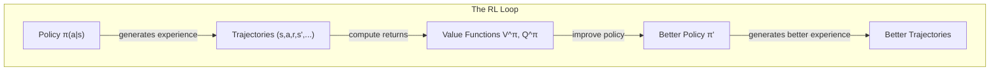

# Policies and Value Functions — Interview Deep Dive

> **What this file covers**
> - 🎯 Formal definitions of V(s), Q(s,a), and π(a|s)
> - 🧮 State-value vs action-value functions with derivations
> - ⚠️ Value estimation errors, overestimation bias, and dead policies
> - 📊 Complexity of exact vs approximate value computation
> - 💡 Value-based vs policy-based vs actor-critic trade-offs
> - 🏭 Function approximation for large state spaces

## Brief Restatement

A policy π maps states to actions (or distributions over actions). A value function measures the expected return from a state (V) or state-action pair (Q) under a given policy. Together, they define what the agent does and how good its strategy is. Learning good value functions or policies is the core task of RL.

---

## 🧮 Full Mathematical Treatment

### Policy Definition

A policy π defines the agent's behavior:

**Deterministic policy:**

    a = π(s)

Maps each state to a single action.

**Stochastic policy:**

    π(a|s) = P(a_t = a | s_t = s)

A probability distribution over actions given the current state.

Properties of a stochastic policy:
- π(a|s) ≥ 0 for all a, s
- Σ_a π(a|s) = 1 for all s

### State-Value Function V^π(s)

The value of state s under policy π is the expected return starting from s and following π:

    V^π(s) = E_π [ G_t | s_t = s ]
           = E_π [ Σ_{k=0}^{∞} γ^k · r_{t+k} | s_t = s ]

Where:
- E_π means expected value when actions are chosen according to π
- G_t is the discounted return from time t
- V^π(s) is a function mapping states to real numbers

### Action-Value Function Q^π(s, a)

The value of taking action a in state s, then following π:

    Q^π(s, a) = E_π [ G_t | s_t = s, a_t = a ]
              = E_π [ Σ_{k=0}^{∞} γ^k · r_{t+k} | s_t = s, a_t = a ]

### Relationship Between V and Q

V can be derived from Q by averaging over the policy:

    V^π(s) = Σ_a π(a|s) · Q^π(s, a)

Q can be derived from V using the transition model:

    Q^π(s, a) = Σ_{s'} P(s'|s,a) · [ R(s,a,s') + γ · V^π(s') ]

### Advantage Function A^π(s, a)

The advantage measures how much better action a is compared to the average action under π:

    A^π(s, a) = Q^π(s, a) - V^π(s)

Properties:
- A^π(s, a) > 0 means a is better than average
- A^π(s, a) < 0 means a is worse than average
- Σ_a π(a|s) · A^π(s, a) = 0 for any policy (the average advantage is zero)
- The advantage is central to policy gradient methods: it tells the agent which actions to reinforce

### Optimal Value Functions

The optimal state-value function:

    V*(s) = max_π V^π(s)

The optimal action-value function:

    Q*(s, a) = max_π Q^π(s, a)

The optimal policy can be derived from Q*:

    π*(s) = argmax_a Q*(s, a)

This is why knowing Q* immediately gives you the best policy — just pick the action with the highest Q-value in each state.

---

## 🗺️ Policy-Value Relationship

---

## ⚠️ Failure Modes and Edge Cases

### 1. Overestimation Bias in Q-Learning
- Using max_a Q(s', a) in the target systematically overestimates Q-values
- With noisy estimates, max picks the action with the highest noise, not the highest true value
- Over many updates, this bias compounds and can make the agent overconfident in bad actions
- **Fix:** Double Q-learning — use one network to select the best action, another to evaluate it

### 2. Dead Policies (Value Function Collapse)
- If the value function incorrectly assigns low value to all actions in some states, the policy becomes "dead" — it always picks the same (bad) action
- Once the agent stops visiting certain state-action pairs, their Q-values stop updating
- This is especially problematic with function approximation where updates to one state affect nearby states
- **Fix:** Ensure sufficient exploration (epsilon-greedy, entropy bonus)

### 3. Deterministic Policy Limitations
- A deterministic policy cannot handle stochastic environments optimally in some cases
- Example: rock-paper-scissors — the optimal policy is uniformly random. Any deterministic policy loses.
- Stochastic policies are strictly more expressive and necessary when aliased states exist (different states that look identical to the agent)

### 4. Value Function Approximation Errors
- Neural networks cannot represent arbitrary value functions perfectly
- Approximation errors in V or Q create errors in the derived policy
- The deadly triad (Sutton & Barto): function approximation + bootstrapping + off-policy learning can diverge
- **Mitigations:** Target networks, experience replay, gradient clipping

---

## 📊 Complexity Analysis

### Tabular Case

| Operation | Complexity | Notes |
|-----------|-----------|-------|
| Store V(s) | O(|S|) memory | One value per state |
| Store Q(s,a) | O(|S|·|A|) memory | One value per state-action pair |
| Policy evaluation (exact) | O(|S|³) per iteration | Solving a linear system |
| Policy evaluation (iterative) | O(|S|²·|A|) per sweep | Sweep over all states |
| Policy improvement | O(|S|·|A|) | Argmax over actions per state |
| Total (policy iteration) | O(|S|³ + |S|·|A|) per round | Converges in finite rounds |

### Function Approximation

| Operation | Complexity | Notes |
|-----------|-----------|-------|
| Store V_θ(s) | O(|θ|) memory | Number of neural network parameters |
| Forward pass | O(|θ|) | One evaluation of the network |
| Backward pass | O(|θ|) | One gradient computation |
| Batch update | O(B·|θ|) | B = batch size |

For DQN with a typical 3-layer network:
- Input: 84×84×4 (stacked frames) = 28,224 dimensions
- Parameters: ~1.7M
- Each Q-value computation: one forward pass through the network

---

## 💡 Design Trade-offs

| Approach | Learns | Strengths | Weaknesses |
|----------|--------|-----------|------------|
| **Value-based** | Q(s,a), derives π | Simple argmax policy, good sample efficiency | Cannot handle continuous actions, deterministic only |
| **Policy-based** | π(a|s) directly | Handles continuous actions, stochastic policies | High variance gradients, poor sample efficiency |
| **Actor-Critic** | Both π and V (or Q) | Balanced: lower variance than pure policy gradient, handles continuous actions | More complex, two networks to train, potential instability |

### V(s) vs Q(s,a)

| | V(s) | Q(s,a) |
|---|---|---|
| **What it tells you** | How good is this state? | How good is this action in this state? |
| **Derives policy?** | Needs transition model P(s'\|s,a) | Yes, directly: π(s) = argmax_a Q(s,a) |
| **Memory** | O(\|S\|) | O(\|S\|·\|A\|) |
| **Used by** | TD(0), policy evaluation, actor-critic (as critic) | Q-learning, DQN, SARSA |
| **Best for** | Environments with known dynamics | Model-free settings |

---

## 🏭 Production and Scaling Considerations

- **Function approximation is mandatory:** Real-world state spaces are too large for tables. Neural networks are the standard approximator, but they introduce instability.
- **Target networks:** Freeze a copy of Q to compute targets, update periodically. Prevents the moving target problem where Q is chasing itself.
- **Batch normalization and layer normalization:** Help stabilize value network training but can interfere with RL dynamics. Use with caution.
- **Multi-head Q-networks:** One output per action (common in DQN). For continuous actions, use a network that takes (s, a) as input and outputs a scalar.
- **Distributional RL:** Instead of learning E[G_t], learn the full distribution of returns. Provides richer signal and often improves performance (C51, QR-DQN, IQN).

---

## Staff/Principal Interview Depth

### Q1: Explain the relationship between V(s), Q(s,a), and the advantage function A(s,a).

---
**No Hire**
*Interviewee:* "V is the value of a state, Q is the value of a state-action pair, and A is the advantage."
*Interviewer:* Just restated the names without explaining the relationships or why they matter.
*Criteria — Met:* names / *Missing:* formulas, relationships, practical significance

**Weak Hire**
*Interviewee:* "V^π(s) is the expected return from state s under policy π. Q^π(s,a) is the expected return from taking action a in state s then following π. A^π(s,a) = Q^π(s,a) - V^π(s) measures how much better action a is than the average. V is the average of Q over the policy: V(s) = Σ_a π(a|s) Q(s,a)."
*Interviewer:* Correct definitions and the averaging relationship. Missing the practical significance and why advantage is used in algorithms.
*Criteria — Met:* definitions, V-Q relationship / *Missing:* why advantage matters for policy gradients, zero-mean property, practical usage

**Hire**
*Interviewee:* "The advantage function has a key property: E_π[A(s,a)] = 0 — the average advantage over the policy is zero. This is why it is preferred over Q in policy gradient methods: subtracting the baseline V(s) from Q(s,a) does not change the expected gradient but dramatically reduces variance. In actor-critic methods, the critic estimates V(s), and the advantage is computed as A = r + γV(s') - V(s) (the TD error). This avoids needing to estimate Q directly. In Dueling DQN, the network architecture explicitly separates V and A streams, which helps when many actions have similar values."
*Interviewer:* Strong understanding of why advantage matters and how it connects to algorithms. Mentions Dueling DQN architecture.
*Criteria — Met:* zero-mean property, variance reduction, TD error as advantage, Dueling DQN / *Missing:* GAE, formal variance reduction proof

**Strong Hire**
*Interviewee:* "Building on the Hire's answer: the variance reduction from using advantages can be quantified. The policy gradient with Q as the signal has variance proportional to Var(Q), while using A = Q - V has variance proportional to Var(Q - V). Since V is constant w.r.t. actions, this is always ≤ Var(Q). In practice, GAE extends this by computing exponentially-weighted advantages: A^GAE = Σ (γλ)^l δ_{t+l}, where δ = r + γV(s') - V(s). The parameter λ interpolates between A = δ (one-step, low variance, high bias) and A = G - V (Monte Carlo, high variance, low bias). The advantage also connects to natural policy gradients: the natural gradient F^{-1} ∇J is equivalent to updating proportional to advantages in certain parameterizations. This is the theoretical basis for TRPO and PPO."
*Interviewer:* Quantifies variance reduction, knows GAE formula with λ, connects to natural policy gradients. Staff-level depth.
*Criteria — Met:* all — variance analysis, GAE, natural gradient connection, TRPO/PPO theory
---

### Q2: When should you use a value-based method vs a policy-based method?

---
**No Hire**
*Interviewee:* "Value-based methods learn Q-values, policy-based methods learn the policy directly."
*Interviewer:* Definitional, no analysis of when to choose which.
*Criteria — Met:* definitions / *Missing:* trade-offs, action space considerations, sample efficiency

**Weak Hire**
*Interviewee:* "Value-based methods like DQN work well for discrete action spaces because you can take argmax over actions. Policy-based methods like REINFORCE can handle continuous actions. Actor-critic methods combine both."
*Interviewer:* Correct action space distinction. Missing deeper trade-offs.
*Criteria — Met:* action space distinction / *Missing:* sample efficiency, stability, stochastic vs deterministic, convergence properties

**Hire**
*Interviewee:* "The choice depends on several factors. Action space: value-based requires argmax, which is easy for discrete but hard for continuous — policy-based handles both. Sample efficiency: value-based methods (especially with replay buffers) are generally more sample-efficient because they reuse data, while policy-based methods (REINFORCE) must discard data after each update. Stability: value-based methods can diverge with function approximation (the deadly triad), while policy gradient methods have well-defined gradients but high variance. Stochasticity: value-based methods produce deterministic policies, which cannot represent optimal behavior in partially observable or adversarial settings."
*Interviewer:* Comprehensive comparison across four dimensions. Knows the deadly triad.
*Criteria — Met:* action space, sample efficiency, stability, stochasticity / *Missing:* specific algorithm recommendations for scenarios, actor-critic as the practical winner

**Strong Hire**
*Interviewee:* "In practice, the distinction has largely collapsed — actor-critic methods dominate both domains. PPO is the default for discrete and continuous actions, outperforming pure value-based and pure policy-based methods in most benchmarks. The theoretical distinctions remain important: value-based methods converge when the Bellman operator is a contraction (requires specific conditions with function approximation), while policy gradient convergence depends on the gradient estimation quality. SAC bridges both worlds for continuous control with its maximum entropy framework. The real practical choice today is: use PPO for most problems, use SAC for continuous control with off-policy requirements, and use DQN only for discrete actions with a large replay buffer. Pure REINFORCE is essentially never used in practice due to its variance."
*Interviewer:* Gives practical recommendations, understands that actor-critic dominates, knows where each algorithm fits. Staff-level practical knowledge.
*Criteria — Met:* all — theoretical analysis, practical recommendations, modern landscape, convergence properties
---

### Q3: What is the deadly triad and why does it matter?

---
**No Hire**
*Interviewee:* "I'm not sure what the deadly triad is."
*Interviewer:* Missing fundamental knowledge about a core RL concept.
*Criteria — Met:* none / *Missing:* definition, components, implications

**Weak Hire**
*Interviewee:* "The deadly triad is when you combine function approximation, bootstrapping, and off-policy learning. It can cause divergence."
*Interviewer:* Knows the three components. Does not explain why each contributes or how to mitigate.
*Criteria — Met:* three components / *Missing:* why each causes problems, mitigations, practical examples

**Hire**
*Interviewee:* "The deadly triad (Sutton & Barto, Chapter 11) describes three ingredients that together can cause value estimates to diverge to infinity. Function approximation: updates to one state affect nearby states, so errors propagate. Bootstrapping: the target depends on the current estimate, creating a feedback loop for errors. Off-policy: the data distribution differs from the target policy, so some states are under-represented and their values can grow unchecked. Remove any one component and the system is stable: tabular + bootstrapping + off-policy works (Q-learning). Function approximation + Monte Carlo + off-policy works. DQN mitigates with target networks (slows the feedback loop) and experience replay (reduces off-policy mismatch)."
*Interviewer:* Strong explanation of each component's role and DQN's mitigations.
*Criteria — Met:* three components explained, mitigations, DQN connection / *Missing:* formal conditions for stability, gradient correction methods

**Strong Hire**
*Interviewee:* "The Hire's analysis is correct. Adding formal depth: convergence of TD with function approximation requires the function class to be compatible with the Bellman operator — specifically, the projection of the Bellman update onto the function class must be a contraction. Linear function approximation with on-policy sampling satisfies this (TD converges under the on-policy distribution). Nonlinear function approximation breaks this guarantee. Off-policy correction methods like importance sampling, emphatic TD, and gradient-TD (GTD/GTD2/TDC) address the distribution mismatch but add variance. In practice, DQN's combination of target networks + replay buffer + reward clipping is a heuristic fix that works well empirically but has no convergence guarantee. Recent work on fitted Q-iteration provides some theoretical analysis but requires careful function class assumptions."
*Interviewer:* Connects to projection-contraction theory, knows gradient-TD methods, distinguishes empirical fixes from theoretical guarantees. Staff-level theoretical depth.
*Criteria — Met:* all — theoretical basis, correction methods, practical vs theoretical distinction, modern analysis
---

---

## Key Takeaways

🎯 1. V^π(s) = E_π[G_t|s_t=s] and Q^π(s,a) = E_π[G_t|s_t=s, a_t=a] — value functions measure expected return under a policy
🎯 2. A^π(s,a) = Q^π(s,a) - V^π(s) has zero mean under π — this property makes it ideal for reducing variance in policy gradients
   3. Knowing Q* gives you the optimal policy for free: π*(s) = argmax_a Q*(s,a)
⚠️ 4. The deadly triad (function approximation + bootstrapping + off-policy) can cause divergence — DQN mitigates with target networks and replay
   5. Value-based methods are sample-efficient but limited to discrete actions; policy-based handle continuous actions but have high variance
🎯 6. Actor-critic methods (PPO, SAC) combine both and dominate in practice
   7. Overestimation bias in Q-learning compounds over training — Double Q-learning and clipped critics are standard fixes
