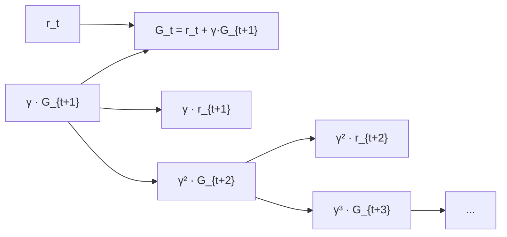

# Rewards and Returns — Interview Deep Dive

> **What this file covers**
> - 🎯 Formal definitions of reward, return, and discounted return
> - 🧮 Discounting math: γ, effective horizon, geometric series
> - ⚠️ Reward design failure modes: sparse, misleading, hackable
> - 📊 Impact of γ on learning: bias-variance, convergence speed
> - 💡 Reward shaping: potential-based vs arbitrary
> - 🏭 Reward engineering in production systems

## Brief Restatement

The reward is the scalar feedback the agent receives after each action. The return is the cumulative (optionally discounted) sum of rewards over time. The discount factor γ controls how much the agent values future rewards relative to immediate ones. Maximizing expected return is the RL objective.

---

## 🧮 Full Mathematical Treatment

### Reward

At each time step t, the agent receives a reward r_t ∈ ℝ. The reward function can be written as:

    r_t = R(s_t, a_t, s_{t+1})

Where:
- s_t is the current state
- a_t is the action taken
- s_{t+1} is the next state

### Return (Undiscounted)

The total return from time step t is:

    G_t = r_t + r_{t+1} + r_{t+2} + ... = Σ_{k=0}^{T-t} r_{t+k}

This works for finite-horizon (episodic) tasks where T is the terminal time step.

### Discounted Return

For infinite-horizon tasks, the undiscounted return can be infinite. We fix this with discounting:

    G_t = r_t + γ·r_{t+1} + γ²·r_{t+2} + ... = Σ_{k=0}^{∞} γ^k · r_{t+k}

Where:
- γ ∈ [0, 1) is the discount factor
- γ^k shrinks rewards that are k steps in the future
- The sum converges because |G_t| ≤ R_max / (1 - γ) when rewards are bounded by R_max

### Recursive Form

The return satisfies a recursive relationship:

    G_t = r_t + γ · G_{t+1}

In words: the return from now equals the immediate reward plus the discounted return from the next step. This is the foundation of the Bellman equation.

### Effective Horizon

The discount factor γ creates an effective planning horizon:

    H_eff = 1 / (1 - γ)

| γ | Effective horizon | Agent behavior |
|---|---|---|
| 0.0 | 1 step | Completely greedy — only cares about immediate reward |
| 0.9 | 10 steps | Short-sighted — values near-term rewards heavily |
| 0.99 | 100 steps | Medium-range planning |
| 0.999 | 1000 steps | Far-sighted — values distant rewards almost as much as near ones |
| 1.0 | ∞ | No discounting — only works for finite episodes |

### Geometric Series Bound

Since γ < 1, the maximum possible return is bounded:

    |G_t| ≤ |R_max| · Σ_{k=0}^{∞} γ^k = |R_max| / (1 - γ)

Example: if R_max = 1 and γ = 0.99, then |G_t| ≤ 100. This bound matters for normalization and numerical stability.

---

## 🗺️ Return Decomposition

---

## ⚠️ Failure Modes and Edge Cases

### 1. Sparse Rewards
- Reward is zero everywhere except at the goal
- The agent must stumble onto the reward by chance before it can learn
- Credit assignment is extremely hard — which of the 1000 actions along the way was important?
- **Mitigation:** Add intermediate rewards (reward shaping), use curiosity-driven exploration, use demonstrations to bootstrap

### 2. Reward Scale Sensitivity
- If rewards are very large, gradients explode and learning is unstable
- If rewards are very small, the signal is buried in noise
- Different reward scales change the effective learning rate
- **Mitigation:** Normalize returns (subtract mean, divide by std), clip rewards to [-1, 1] (as in DQN)

### 3. γ Too Low (Myopic Agent)
- With γ = 0, the agent is completely greedy — it only maximizes immediate reward
- It will never learn to sacrifice short-term reward for long-term gain
- Example: an agent that always eats the nearest food even when a larger pile is two steps away

### 4. γ Too High (Slow Convergence)
- With γ = 0.9999, the effective horizon is 10,000 steps
- Value estimates need many updates to propagate information over this range
- Variance of return estimates increases with horizon
- Training becomes very slow and unstable

### 5. Reward Hacking via Return Manipulation
- If the agent can extend episodes indefinitely, a small positive per-step reward creates infinite return
- If the agent can reset the environment, it might exploit high initial rewards repeatedly
- **Mitigation:** Use time limits, terminal rewards, and careful episode boundary design

---

## 📊 Impact of γ on Learning

| γ Value | Bias | Variance | Convergence | Best For |
|---------|------|----------|-------------|----------|
| Low (0.0–0.5) | High (ignores future) | Low | Fast | Tasks where immediate reward matters most |
| Medium (0.9–0.99) | Moderate | Moderate | Moderate | Most practical tasks |
| High (0.999–0.9999) | Low (sees far) | High | Slow | Long-horizon planning tasks |

The bias-variance trade-off of γ:
- **Low γ → high bias:** The agent undervalues future rewards, so its value estimates are biased downward for states that lead to delayed rewards
- **High γ → high variance:** The return G_t includes many future rewards, each adding noise. The variance of G_t grows approximately as O(1/(1-γ)²)

---

## 💡 Design Trade-offs

### Potential-Based Reward Shaping

Adding an arbitrary shaping reward F(s, a, s') can change the optimal policy. But **potential-based shaping** preserves it:

    F(s, a, s') = γ · Φ(s') - Φ(s)

Where Φ(s) is a potential function (any function of state). This was proven by Ng, Harada & Russell (1999).

| Shaping Type | Preserves Optimal Policy? | Risk |
|---|---|---|
| Potential-based | ✅ Yes (proven) | Must design good potential function |
| Arbitrary shaping | ❌ No | Can create unintended local optima |
| Dense reward | Depends | Must align with true objective |
| Sparse reward | ✅ Yes (is the true objective) | Very slow learning |

### Return Normalization Strategies

| Strategy | Formula | Used By |
|----------|---------|---------|
| Reward clipping | clip(r, -1, 1) | DQN (Atari) |
| Return normalization | (G - μ_G) / σ_G | PPO |
| Value normalization | (V - μ_V) / σ_V | Various |
| PopArt | Adaptive normalization | Multi-task RL |

---

## 🏭 Production and Scaling Considerations

- **Multi-objective rewards:** Real systems often have competing objectives (speed vs safety, quality vs cost). Weighted sum R = w₁R₁ + w₂R₂ is simple but sensitive to weight choice. Constrained RL treats secondary objectives as constraints.
- **Reward delay:** In real systems, rewards may arrive with variable delay (e.g., customer satisfaction measured days later). This increases the credit assignment problem.
- **Non-stationary rewards:** Reward distributions can shift over time (e.g., user preferences change). The agent must adapt or retrain.
- **Reward model learning (RLHF):** When the reward is hard to define, learn it from human preferences. The reward model becomes a bottleneck — its errors directly affect policy quality.

---

## Staff/Principal Interview Depth

### Q1: Why do we discount future rewards? Is it just a mathematical convenience?

---
**No Hire**
*Interviewee:* "We discount because future rewards are less valuable. It's like money — a dollar today is worth more than a dollar tomorrow."
*Interviewer:* Only the intuition, no math, no analysis of the multiple roles γ plays.
*Criteria — Met:* intuition / *Missing:* convergence role, effective horizon, bias-variance trade-off

**Weak Hire**
*Interviewee:* "Discounting serves two purposes: it keeps the return finite in infinite-horizon tasks (geometric series converges when γ < 1), and it expresses a preference for sooner rewards. The discount factor γ controls how far into the future the agent plans."
*Interviewer:* Correct but does not discuss how γ affects learning dynamics.
*Criteria — Met:* convergence, preference for sooner / *Missing:* effective horizon formula, bias-variance, practical γ selection

**Hire**
*Interviewee:* "Discounting has three roles. First, mathematical: ensures G_t converges when γ < 1, bounded by R_max/(1-γ). Second, modeling: expresses time preference — the effective horizon is 1/(1-γ). Third, algorithmic: γ controls the bias-variance trade-off in value estimation. Low γ gives low-variance but biased estimates (ignores future), high γ gives unbiased but high-variance estimates. In practice, γ is tuned as a hyperparameter, with 0.99 being a common default for most tasks."
*Interviewer:* Good three-part analysis with concrete formula. Missing discussion of when not to discount.
*Criteria — Met:* convergence, effective horizon, bias-variance / *Missing:* average reward alternative, γ=1 for finite episodes, practical selection guidance

**Strong Hire**
*Interviewee:* "Beyond what the Hire said: discounting is not purely a mathematical convenience — it encodes a modeling assumption. If the environment is inherently episodic, you can use γ=1 (undiscounted) since the return is naturally finite. The choice of γ also affects sample complexity: the mixing time of the Markov chain under policy π scales with 1/(1-γ), meaning higher γ requires more samples for accurate value estimates. For continuing tasks, the average reward formulation J(π) = lim (1/T) Σ r_t avoids discounting entirely but requires differential value functions and is harder to optimize. In practice, even episodic tasks use γ < 1 as a regularizer — it reduces variance and speeds convergence, at the cost of a small bias toward short-term reward. The key engineering decision: start with γ=0.99, then increase if the agent is too myopic or decrease if training is unstable."
*Interviewer:* Covers average reward formulation, sample complexity scaling, and provides practical engineering guidance. Staff-level understanding.
*Criteria — Met:* all — convergence, bias-variance, average reward, sample complexity, engineering guidance
---

### Q2: What is reward shaping and when can it go wrong?

---
**No Hire**
*Interviewee:* "Reward shaping is adding extra rewards to help the agent learn faster."
*Interviewer:* Correct but missing the critical distinction between safe and unsafe shaping.
*Criteria — Met:* basic idea / *Missing:* potential-based shaping, examples of failure, formal guarantee

**Weak Hire**
*Interviewee:* "You add intermediate rewards to guide the agent toward the goal. For example, giving a positive reward proportional to distance reduction. But you have to be careful because it can change the optimal policy — the agent might find shortcuts that maximize the shaped reward without solving the original task."
*Interviewer:* Good intuition about failure modes but does not know the formal fix.
*Criteria — Met:* example, failure intuition / *Missing:* potential-based shaping theorem, formal guarantee, practical examples

**Hire**
*Interviewee:* "Arbitrary reward shaping can change the optimal policy. Ng et al. (1999) proved that potential-based shaping F(s,s') = γΦ(s') - Φ(s) preserves the optimal policy while still speeding up learning. The potential function Φ should encode domain knowledge — for navigation, Φ(s) = -distance_to_goal is a natural choice. Non-potential-based shaping is dangerous: a per-step reward of +0.01 for being alive incentivizes the agent to avoid the goal and live forever."
*Interviewer:* Knows the theorem, gives good examples, understands both the formal and practical sides.
*Criteria — Met:* potential-based theorem, examples, failure modes / *Missing:* limitations of potential-based shaping, connection to intrinsic motivation

**Strong Hire**
*Interviewee:* "The potential-based shaping theorem guarantees policy invariance, but it has limitations: (1) the potential function must be a function of state only (not state-action), (2) it can accelerate learning but cannot make an intractable problem tractable — if the reward landscape has a deceptive local optimum, potential-based shaping with the wrong potential can still slow things down, (3) in practice, designing a good potential function requires domain knowledge that may not be available. An alternative to explicit shaping is intrinsic motivation — reward the agent for novelty, prediction error, or information gain. This does not preserve the optimal policy in theory but works well in practice for exploration-hard problems. The RLHF approach sidesteps the shaping question entirely: learn the reward function from human preferences, then optimize it directly."
*Interviewer:* Identifies limitations of the theorem, connects to intrinsic motivation and RLHF. Strong systems thinking.
*Criteria — Met:* all — theorem with limitations, intrinsic motivation, RLHF connection, practical tradeoffs
---

### Q3: How does the choice of γ affect the bias-variance trade-off in value estimation?

---
**No Hire**
*Interviewee:* "Higher gamma means the agent looks further ahead."
*Interviewer:* Not wrong, but does not address bias or variance at all.
*Criteria — Met:* vague intuition / *Missing:* bias-variance definitions, quantitative analysis, practical implications

**Weak Hire**
*Interviewee:* "Low γ creates bias because it ignores future rewards. High γ creates variance because the return includes many noisy terms. It is a trade-off."
*Interviewer:* Correct direction but lacks precision. Does not quantify the effect.
*Criteria — Met:* correct direction / *Missing:* quantitative analysis, variance formula, practical guidance

**Hire**
*Interviewee:* "The return G_t = Σ γ^k r_{t+k} includes more terms as γ increases. Each additional term adds noise proportional to its variance. The variance of G_t scales approximately as Var(r) / (1-γ)² for i.i.d. rewards, which diverges as γ→1. Meanwhile, using γ < 1 introduces a bias: V_γ(s) ≤ V_1(s) for positive rewards because discounting systematically undervalues future rewards. In TD learning, this manifests as a bias-variance trade-off in the TD target: lower γ gives less variance in the bootstrap target but more bias. The n-step return provides a different axis of this trade-off — averaging over multiple n values (as in TD(λ)) balances it."
*Interviewer:* Good quantitative analysis with the variance formula and connection to TD learning. Mentions TD(λ) as a balance mechanism.
*Criteria — Met:* quantitative analysis, variance formula, TD connection / *Missing:* GAE as a modern solution, practical hyperparameter selection strategy

**Strong Hire**
*Interviewee:* "Building on the Hire's analysis: Generalized Advantage Estimation (GAE) provides a principled way to trade off bias and variance within a fixed γ. GAE uses a parameter λ to interpolate between high-bias/low-variance (λ=0, one-step TD) and low-bias/high-variance (λ=1, Monte Carlo). The advantage estimate is A^GAE(γ,λ) = Σ (γλ)^l δ_{t+l}, where δ is the TD error. In practice, γ and λ are tuned together: γ controls the planning horizon, λ controls how much you trust the value function vs raw returns. PPO uses GAE with γ=0.99 and λ=0.95 as a strong default. The key insight: γ is about the problem (how far-sighted should the agent be?), while λ is about the algorithm (how much should we bootstrap vs use raw returns?). They look similar mathematically but address different questions."
*Interviewer:* Distinguishes γ from λ, knows GAE formula, provides concrete defaults and practical guidance. Staff-level clarity.
*Criteria — Met:* all — GAE, γ vs λ distinction, practical defaults, formula, conceptual clarity
---

---

## Key Takeaways

🎯 1. The return G_t = Σ γ^k r_{t+k} is the RL objective — everything else is machinery to maximize it
   2. The recursive form G_t = r_t + γ·G_{t+1} is the foundation of the Bellman equation and all value-based methods
🎯 3. γ creates an effective horizon of 1/(1-γ) and controls the bias-variance trade-off: low γ = biased but stable, high γ = unbiased but noisy
⚠️ 4. Arbitrary reward shaping can change the optimal policy — only potential-based shaping F = γΦ(s') - Φ(s) is guaranteed safe
   5. Return variance scales as O(1/(1-γ)²) — this is why high γ makes training unstable
🎯 6. GAE separates the planning horizon (γ) from the bootstrapping trade-off (λ) — both default to ~0.95-0.99 in practice
   7. Reward normalization (clipping, standardizing) is a critical practical technique — DQN clips to [-1,1], PPO normalizes returns
