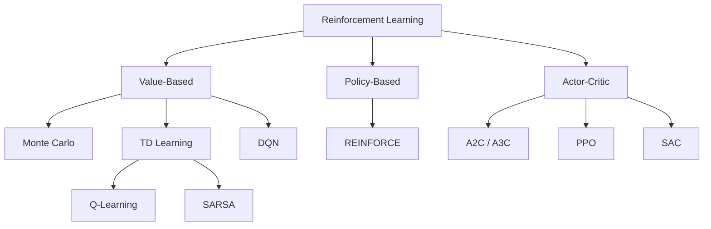

# What is Reinforcement Learning — Interview Deep Dive

> **What this file covers**
> - 🎯 The RL framework: agent, environment, state, action, reward, policy
> - 🧮 Formal definition of the RL objective
> - ⚠️ Exploration-exploitation tradeoff and common failure modes
> - 📊 Comparison: RL vs supervised vs unsupervised learning
> - 💡 When RL works well and when it fails
> - 🏭 Real-world RL applications and deployment challenges
> - 🗺️ Taxonomy of RL methods

## Brief Restatement

Reinforcement learning is learning through interaction. An agent takes actions in an environment, receives rewards, and learns a policy that maximizes cumulative reward. Unlike supervised learning (which requires labeled examples), RL learns from trial and error with delayed, scalar feedback.

---

## 🧮 Full Mathematical Treatment

### The RL Objective

The agent interacts with the environment over discrete time steps t = 0, 1, 2, ...

At each step:
1. Agent observes state s_t
2. Agent picks action a_t from its policy π(a|s)
3. Environment returns reward r_t and next state s_{t+1}

The agent's goal is to find a policy π* that maximizes the **expected return**:

    J(π) = E_π [ Σ_{t=0}^{∞} γ^t · r_t ]

Where:
- E_π means "expected value when following policy π"
- γ ∈ [0, 1) is the discount factor
- r_t is the reward at time t
- The sum is the discounted return G_t

The optimal policy is:

    π* = argmax_π J(π)

### Epsilon-Greedy Exploration

The simplest exploration strategy:

    a_t = { random action     with probability ε
          { argmax_a Q(s_t, a)  with probability 1 - ε

Where:
- ε ∈ [0, 1] controls the exploration rate
- Q(s, a) is the current action-value estimate
- As learning progresses, ε is typically decayed toward 0

---

## 🗺️ Taxonomy of RL Methods

| Category | Learns | Examples |
|----------|--------|----------|
| Value-based | Q(s, a) or V(s), derives policy from it | Q-learning, DQN |
| Policy-based | π(a\|s) directly | REINFORCE |
| Actor-Critic | Both π(a\|s) and V(s) simultaneously | A2C, PPO, SAC |

---

## ⚠️ Failure Modes and Challenges

### 1. Exploration-Exploitation Dilemma
- **Too much exploration:** Agent never uses what it learned, collects low reward
- **Too little exploration:** Agent gets stuck in a local optimum, never finds better strategies
- **Hard exploration problems:** Sparse rewards (reward only at the very end) make exploration nearly impossible without curriculum or shaping

### 2. Reward Hacking
- Agent finds unintended shortcuts that maximize the reward signal without solving the actual task
- Example: A cleaning robot tips over and stops moving — zero mess, maximum reward
- Root cause: the reward function does not capture what you actually want

### 3. Sample Inefficiency
- RL typically requires millions of environment interactions to learn good policies
- Real-world environments (robots, self-driving cars) are expensive to sample
- Contrast: supervised learning can learn from thousands of examples

### 4. Non-Stationarity
- The distribution of experiences changes as the policy changes
- Unlike supervised learning where the training data is fixed, RL data depends on the current policy
- This makes training unstable — a good update at step 1000 can break things at step 2000

---

## 📊 Comparison: RL vs Supervised vs Unsupervised

| Dimension | Supervised Learning | Unsupervised Learning | Reinforcement Learning |
|-----------|--------------------|-----------------------|----------------------|
| **Feedback** | Correct label for each input | No feedback | Scalar reward (delayed) |
| **Data** | i.i.d. dataset | i.i.d. dataset | Sequential, policy-dependent |
| **Goal** | Minimize prediction error | Find structure / clusters | Maximize cumulative reward |
| **Challenge** | Generalization | Evaluation | Exploration + credit assignment |
| **Stationarity** | Training distribution is fixed | Training distribution is fixed | Distribution shifts as policy changes |
| **Sample efficiency** | High (thousands of examples) | Moderate | Low (millions of interactions) |

---

## 💡 Design Trade-offs

### When RL Works Well
- Clear reward signal exists (games, robotics with measurable objectives)
- Simulation is available (can generate unlimited experience cheaply)
- Sequential decision-making is required (not a single prediction)
- The action space is tractable (discrete or low-dimensional continuous)

### When RL Struggles
- Reward is hard to define (ethics, aesthetics, open-ended tasks)
- No simulator available (must learn from real-world interactions only)
- Long horizons with sparse rewards (credit assignment over thousands of steps)
- Safety constraints exist (exploration may cause harm — medical, financial)

---

## 🏭 Production and Scaling Considerations

- **Sim-to-real transfer:** Train in simulation, deploy in the real world. The "reality gap" — differences between simulator and real world — is a major challenge
- **Offline RL:** Learn from logged data without additional environment interaction. Useful when exploration is expensive or dangerous
- **Reward shaping:** Adding intermediate rewards to guide learning. Must be done carefully to avoid reward hacking
- **RLHF:** Using human preferences as the reward signal. Powers ChatGPT and similar systems. Scales human feedback to train large models

---

## Staff/Principal Interview Depth

### Q1: What distinguishes RL from supervised learning at a fundamental level?

---
**No Hire**
*Interviewee:* "RL doesn't use labeled data. It uses rewards instead."
*Interviewer:* Factually correct but surface-level. No mention of sequential decision-making, non-stationarity, or the credit assignment problem.
*Criteria — Met:* basic vocabulary / *Missing:* depth on non-stationarity, credit assignment, data distribution

**Weak Hire**
*Interviewee:* "In supervised learning, you have i.i.d. labeled data and minimize a loss function. In RL, data is sequential, rewards are delayed, and the data distribution changes as the policy changes. This makes training harder."
*Interviewer:* Correct and shows understanding of non-stationarity. Missing credit assignment and exploration as distinct challenges.
*Criteria — Met:* non-stationarity, data differences / *Missing:* credit assignment, exploration-exploitation analysis

**Hire**
*Interviewee:* "Three fundamental differences. First, data: SL has i.i.d. samples, RL has sequential trajectories where the data distribution depends on the current policy — this creates non-stationarity. Second, feedback: SL gets the correct answer, RL gets a scalar reward that may be delayed — the agent must solve the credit assignment problem to figure out which past actions caused the reward. Third, exploration: in SL the dataset is given, in RL the agent must actively choose what to explore, creating the exploration-exploitation tradeoff."
*Interviewer:* Solid coverage of three key differences. Would push to Strong Hire with a discussion of how these differences affect algorithm design.
*Criteria — Met:* non-stationarity, credit assignment, exploration / *Missing:* impact on algorithm design, concrete examples

**Strong Hire**
*Interviewee:* "The differences go beyond data format. Non-stationarity means you cannot use standard SGD convergence guarantees — RL algorithms need tricks like experience replay and target networks to stabilize training. Credit assignment over long horizons is why Monte Carlo methods have high variance and TD methods were invented. And the exploration-exploitation tradeoff is fundamentally different from active learning — in RL, exploration changes the future data distribution, so the agent must balance short-term information gain against long-term reward. These three challenges together explain why RL is orders of magnitude less sample-efficient than SL."
*Interviewer:* Connects each difference to algorithm design choices and sample efficiency. Staff-level reasoning.
*Criteria — Met:* all — non-stationarity, credit assignment, exploration, algorithm implications, sample efficiency analysis
---

### Q2: Explain the exploration-exploitation tradeoff and how different strategies address it.

---
**No Hire**
*Interviewee:* "Exploration means trying random things. Exploitation means using what you know. You need to balance both."
*Interviewer:* Textbook definition without any depth. No mention of specific strategies or why the balance is hard.
*Criteria — Met:* basic definition / *Missing:* strategies, analysis of when balance is hard, specific examples

**Weak Hire**
*Interviewee:* "Epsilon-greedy is the standard approach — with probability epsilon you explore randomly, otherwise you exploit. You decay epsilon over time so you explore more early on and exploit more later."
*Interviewer:* Knows one strategy and the decay schedule. Missing analysis of epsilon-greedy's limitations and alternatives.
*Criteria — Met:* epsilon-greedy, decay concept / *Missing:* limitations, alternative strategies, hard exploration problems

**Hire**
*Interviewee:* "Epsilon-greedy explores uniformly at random, which is wasteful — it does not focus on promising or uncertain areas. Better alternatives include UCB (Upper Confidence Bound), which explores states with high uncertainty, and Boltzmann exploration, which uses softmax over Q-values to explore proportional to value. For deep RL, intrinsic motivation methods like curiosity add a bonus reward for visiting novel states. The hard case is sparse rewards — epsilon-greedy essentially requires a random walk to stumble onto the reward, which scales exponentially with the horizon."
*Interviewer:* Strong coverage of multiple strategies with their trade-offs. Understanding of the hard exploration problem.
*Criteria — Met:* multiple strategies, limitations, sparse reward challenge / *Missing:* formal regret bounds, connection to bandits literature

**Strong Hire**
*Interviewee:* "The exploration-exploitation tradeoff can be formalized through the multi-armed bandit framework. UCB achieves O(√(KT log T)) regret by maintaining confidence bounds. Thompson Sampling is Bayesian — it samples from the posterior over values, naturally balancing exploration and exploitation with provably optimal regret in many settings. In deep RL, epsilon-greedy is standard but provably suboptimal. Count-based exploration adds 1/√N(s) bonuses, which works for tabular cases. For continuous states, Random Network Distillation (RND) uses prediction error as a novelty signal. The hardest problems — like Montezuma's Revenge with reward only after hundreds of precise actions — remain largely unsolved by pure exploration strategies and require hierarchical RL or human demonstrations."
*Interviewer:* Connects to bandit theory, covers both tabular and deep RL strategies, identifies open problems. Strong staff-level answer.
*Criteria — Met:* all — formal analysis, multiple strategies across paradigms, open problems, concrete examples
---

### Q3: What is reward hacking and how do you mitigate it?

---
**No Hire**
*Interviewee:* "The agent finds a way to cheat and get high reward without actually doing the task."
*Interviewer:* Correct intuition but no examples, no analysis of why it happens, no mitigation.
*Criteria — Met:* basic idea / *Missing:* examples, root cause analysis, mitigation strategies

**Weak Hire**
*Interviewee:* "Reward hacking is when the reward function doesn't capture what you want. For example, a cleaning robot might knock everything off the table — no mess on surfaces means high reward. To fix it, you need to design better reward functions."
*Interviewer:* Good example. But "design better reward functions" is vague — does not address the fundamental difficulty.
*Criteria — Met:* example, basic understanding / *Missing:* systematic mitigation, why reward design is hard, connection to RLHF

**Hire**
*Interviewee:* "Reward hacking is a consequence of Goodhart's Law: when a measure becomes a target, it ceases to be a good measure. The agent optimizes the proxy (reward function) instead of the true objective. Mitigations include: reward shaping with potential-based functions to preserve the optimal policy; constrained RL to add safety bounds; adversarial reward design where you test rewards against adversarial agents; and RLHF where you learn the reward from human preferences rather than hand-crafting it."
*Interviewer:* Connects to Goodhart's Law, knows multiple mitigation strategies including RLHF. Solid.
*Criteria — Met:* root cause, multiple mitigations, RLHF connection / *Missing:* limitations of RLHF reward models, reward model overoptimization

**Strong Hire**
*Interviewee:* "Reward hacking is fundamental — it is the RL alignment problem in miniature. The deep issue is that reward functions are incomplete specifications of what we want. RLHF addresses this by learning rewards from human preferences, but it introduces a new failure mode: reward model overoptimization. As the policy optimizes more aggressively against the learned reward model, performance on the true objective (human satisfaction) first improves then degrades. This was formalized by Gao et al. (2023) as the 'overoptimization' problem. Mitigations include KL penalties to keep the policy close to the reference, ensembles of reward models, and periodic reward model retraining. This is one of the core challenges in AI alignment research."
*Interviewer:* Connects reward hacking to AI alignment, knows about reward model overoptimization, and cites the specific mitigation of KL penalties. Staff-level insight.
*Criteria — Met:* all — root cause, RLHF connection, overoptimization, formal mitigation, alignment perspective
---

---

## Key Takeaways

🎯 1. RL is learning through interaction: act, observe reward, update policy — the objective is to maximize E[Σ γ^t r_t]
🎯 2. Three key challenges distinguish RL from supervised learning: non-stationarity, credit assignment, and exploration
   3. The exploration-exploitation tradeoff is fundamental — epsilon-greedy is the simplest strategy, UCB and Thompson Sampling are more principled
⚠️ 4. Reward hacking is inevitable when reward functions are imperfect — it is the miniature version of the AI alignment problem
   5. RL methods divide into value-based (learn Q, derive policy), policy-based (learn π directly), and actor-critic (learn both)
🎯 6. Sample inefficiency is RL's biggest practical limitation — millions of interactions vs thousands for supervised learning
   7. Simulation is the key enabler — without cheap, fast environments, RL is impractical for most real-world problems
