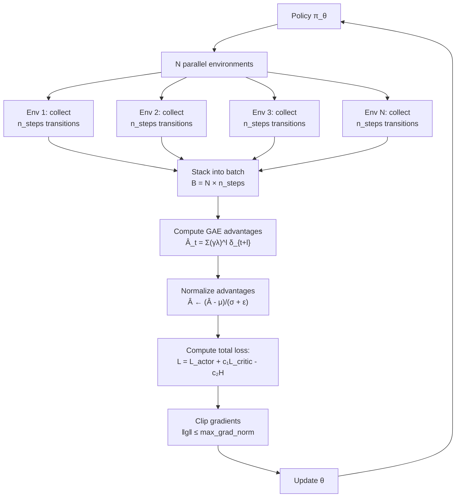

# A2C and A3C — Interview Deep Dive

> **What this file covers**
> - 🎯 A2C vs A3C — synchronous vs asynchronous and why A2C won
> - 🧮 GAE derivation — bias-variance control via λ
> - ⚠️ 4 failure modes: stale gradients, environment correlation, entropy collapse, vectorization overhead
> - 📊 Scaling analysis — linear speedup conditions and limits
> - 💡 A2C vs PPO — what PPO adds on top of A2C
> - 🏭 Production architecture: vectorized environments, gradient clipping, distributed training

---

## Brief restatement

A2C (Advantage Actor-Critic) and A3C (Asynchronous Advantage Actor-Critic) scale actor-critic to multiple parallel environments. A3C (2016) uses asynchronous workers with local parameter copies — designed for CPU parallelism. A2C uses synchronous batched updates — simpler, equally effective, and better suited to GPUs. Both use Generalized Advantage Estimation (GAE) with parameter λ to control the bias-variance trade-off. A2C is the standard today and the direct predecessor of PPO.

---

## 🧮 Full mathematical treatment

### A2C objective

**Step 1 — Words.** A2C collects experience from N parallel environments for n_steps each, then does one batched gradient update. The loss has three terms: the policy gradient (actor), value function error (critic), and entropy bonus (exploration).

**Step 2 — Formula.**

```
L_total = L_actor + c₁ × L_critic - c₂ × H[π]

Where:
  L_actor = -(1/B) Σ_{i=1}^{B} log π_θ(aᵢ|sᵢ) × Â_i
  L_critic = (1/B) Σ_{i=1}^{B} (V_w(sᵢ) - Gᵢ)²
  H[π] = -(1/B) Σ_{i=1}^{B} Σ_a π_θ(a|sᵢ) log π_θ(a|sᵢ)

  B = N × n_steps (total batch size)
  Â_i = GAE advantage estimate
  Gᵢ = Â_i + V_w(sᵢ) (target return)
  c₁ = value loss coefficient (typically 0.5)
  c₂ = entropy coefficient (typically 0.01)
```

**Step 3 — Worked example.** With N=4 environments, n_steps=5:

```
Batch size: B = 4 × 5 = 20 transitions

Each environment contributes 5 transitions:
  Env 1: (s₁₁,a₁₁,r₁₁), ..., (s₁₅,a₁₅,r₁₅)
  Env 2: (s₂₁,a₂₁,r₂₁), ..., (s₂₅,a₂₅,r₂₅)
  Env 3: (s₃₁,a₃₁,r₃₁), ..., (s₃₅,a₃₅,r₃₅)
  Env 4: (s₄₁,a₄₁,r₄₁), ..., (s₄₅,a₄₅,r₄₅)

All 20 transitions processed in one forward pass.
One gradient update on combined batch.
Then all 4 environments continue with updated policy.
```

### Generalized Advantage Estimation (GAE)

**Step 1 — Words.** GAE computes advantages as a weighted average of n-step advantages for all n. Short n-step estimates have low variance but high bias. Long n-step estimates have high variance but low bias. GAE uses parameter λ to control the weighting — closer steps get exponentially more weight.

**Step 2 — Formula.**

First, define the TD error at each step:

```
δ_t = r_t + γV(s_{t+1}) - V(s_t)
```

GAE advantage:

```
Â_t^{GAE(γ,λ)} = Σ_{l=0}^{T-t} (γλ)^l × δ_{t+l}

Equivalently, computed backward:
  Â_T = δ_T
  Â_t = δ_t + γλ × (1 - done_t) × Â_{t+1}
```

🧮 **Relationship to n-step returns:**

```
n-step advantage: Â_t^{(n)} = Σ_{k=0}^{n-1} γ^k r_{t+k} + γ^n V(s_{t+n}) - V(s_t)

GAE is the exponentially-weighted average:
  Â_t^{GAE} = (1-λ) × [Â_t^{(1)} + λÂ_t^{(2)} + λ²Â_t^{(3)} + ...]

Special cases:
  λ = 0: Â_t = δ_t = r + γV(s') - V(s)     (TD(0), low variance, more bias)
  λ = 1: Â_t = G_t - V(s_t)                 (MC, high variance, no bias)
  λ = 0.95: Standard compromise              (effective horizon ≈ 1/(1-γλ) steps)
```

**Step 3 — Worked example.** Computing GAE with γ=0.99, λ=0.95:

```
5-step episode:
  Rewards:  [1, 1, 1, 1, 10]
  Values:   [5, 5.5, 6, 6.5, 7]
  V(s_last) = 0 (terminal state, done=True)

TD errors:
  δ₄ = 10 + 0.99×0 - 7 = 3.0
  δ₃ = 1 + 0.99×7 - 6.5 = 1.43
  δ₂ = 1 + 0.99×6.5 - 6 = 1.44
  δ₁ = 1 + 0.99×6 - 5.5 = 1.44
  δ₀ = 1 + 0.99×5.5 - 5 = 1.45

GAE (backward):
  Â₄ = δ₄ = 3.0
  Â₃ = δ₃ + 0.99×0.95×Â₄ = 1.43 + 0.94×3.0 = 4.25
  Â₂ = δ₂ + 0.94×Â₃ = 1.44 + 0.94×4.25 = 5.44
  Â₁ = δ₁ + 0.94×Â₂ = 1.44 + 0.94×5.44 = 6.55
  Â₀ = δ₀ + 0.94×Â₁ = 1.45 + 0.94×6.55 = 7.61

With λ=0 (pure TD):
  Â = [1.45, 1.44, 1.44, 1.43, 3.0]

With λ=0.95 (GAE):
  Â = [7.61, 6.55, 5.44, 4.25, 3.0]

GAE propagates the large reward at t=4 backward, giving earlier actions credit.
TD does not — each step only sees its local surprise.
```

### A3C: asynchronous updates

**Step 1 — Words.** A3C runs K workers in separate threads, each with its own copy of the environment and model. Workers collect experience independently and update the shared global model asynchronously.

**Step 2 — Formula.**

```
For each worker k (in parallel):
  1. Copy global parameters: θ_k ← θ_global
  2. Collect n_steps of experience using π_{θ_k}
  3. Compute gradients: g_k = ∇_{θ_k} L(θ_k)
  4. Apply to global model: θ_global ← θ_global + α × g_k

Problem: When worker k computed g_k, it used θ_k.
         But by the time g_k is applied, θ_global may have changed
         (other workers applied their gradients in the meantime).

         The gradient g_k is "stale" — computed with old parameters.
         Staleness = number of other updates since θ_k was copied.
```

**Step 3 — Worked example.** With 4 workers:

```
Time 1: Worker 1 copies θ₁ = θ_global(v1)
Time 2: Worker 2 copies θ₂ = θ_global(v1)
Time 3: Worker 1 finishes, updates: θ_global(v2) = θ_global(v1) + α×g₁
Time 4: Worker 3 copies θ₃ = θ_global(v2)
Time 5: Worker 2 finishes, updates: θ_global(v3) = θ_global(v2) + α×g₂
         But g₂ was computed with θ_global(v1)!
         Staleness = 1 (one update happened since worker 2 started)
```

With K workers and equal processing time, average staleness ≈ K-1. This is why A3C works with small K (4-16) but degrades with very large K.

---

## 🗺️ Concept flow diagram



---

## ⚠️ Failure modes and edge cases

### 1. Stale gradients in A3C

**Problem:** In A3C, workers compute gradients using old parameter copies. If the global model has changed significantly since the worker started, the gradient points in a direction that may no longer be useful or could even be harmful.

**Quantification:** With K workers, average staleness is K-1 updates. With K=16 and significant learning rate, gradients can be several policy updates out of date.

**Symptom:** Training is noisy and slower than expected. Increasing the number of workers beyond a certain point (typically 16-32) stops improving or hurts performance.

**Fix:** Use A2C instead (eliminates staleness entirely). For A3C: reduce learning rate as K increases, use gradient clipping, or use IMPALA's V-trace correction which explicitly corrects for off-policy data.

### 2. Environment correlation in vectorized environments

**Problem:** If all N environments are initialized with the same seed or similar states, they produce correlated trajectories. Correlated data reduces the effective batch size — you get less diverse experience than expected.

**Symptom:** Training with N environments is not N× faster. Gradient variance is higher than expected for the batch size. Environments tend to have similar episode lengths and rewards.

**Fix:** Different random seeds for each environment. Reset environments at different times (staggered starts). Use SubprocVecEnv (separate processes) rather than sequential stepping to avoid synchronization artifacts.

### 3. n_steps tuning sensitivity

**Problem:** The n_steps parameter (how many steps to collect before updating) controls a trade-off. Too few steps: each batch is small and noisy. Too many steps: the policy changes significantly during collection, making the oldest transitions stale (even in A2C).

**Typical values:** n_steps=5 (A2C default), n_steps=128 or 2048 (PPO). Larger n_steps work with PPO because its clipped objective handles the staleness.

**Fix:** Start with n_steps=5 for A2C, tune if needed. Monitor the KL divergence between the policy at the start and end of collection — if KL is large, reduce n_steps or learning rate.

### 4. Entropy collapse with parallel environments

**Problem:** Parallel environments provide more diverse experience, which can mask entropy collapse. The agent may appear to be exploring (different trajectories) while the policy is actually near-deterministic (same action distribution, different outcomes due to environment stochasticity).

**Diagnostic:** Plot policy entropy over training. If entropy drops below 0.1 for a 2-action problem (max entropy = 0.69), the policy is too deterministic regardless of trajectory diversity.

**Fix:** Monitor entropy explicitly. Increase c₂ (entropy coefficient) if entropy drops too fast. Consider adaptive entropy coefficient (as in SAC, which targets a specific entropy level).

---

## 📊 Complexity analysis

| Aspect | A2C (sync) | A3C (async) | PPO |
|--------|-----------|-------------|-----|
| **Environments** | N (vectorized) | K (threaded workers) | N (vectorized) |
| **Batch size** | N × n_steps | n_steps (per worker) | N × n_steps × epochs |
| **Updates per batch** | 1 | K (one per worker) | K_epochs × n_minibatches |
| **Staleness** | 0 | K-1 (average) | Controlled by clip ratio |
| **GPU utilization** | ✅ High (batched) | ❌ Low (sequential workers) | ✅ High (batched) |
| **Wall-clock speedup** | ~N× (ideal) | ~K× (with diminishing returns) | ~N× (ideal) |
| **Implementation complexity** | Simple | Complex (threading) | Moderate |

### Scaling analysis

Ideal speedup with N parallel environments: N×. Actual speedup is limited by:

```
Actual speedup = N / (1 + N × (t_overhead / t_env_step))

Where:
  t_overhead = time for gradient computation + communication
  t_env_step = time for one environment step

If t_env_step >> t_overhead: near-linear speedup
If t_env_step << t_overhead: diminishing returns after small N
```

For CPU-based environments (gym): t_env_step ≈ 0.1ms, t_overhead ≈ 1ms. Near-linear up to ~10 environments.
For GPU-based environments (IsaacGym): t_env_step ≈ 0.01ms for 1000 envs, t_overhead ≈ 0.5ms. Near-linear up to ~1000 environments.

---

## 💡 Design trade-offs

| Design Choice | A2C | PPO | SAC |
|---|---|---|---|
| **On/off policy** | On-policy | On-policy (with reuse via clipping) | Off-policy |
| **Data reuse** | 1× | K_epochs× (typically 3-10) | Many× (replay buffer) |
| **Sample efficiency** | Low | Medium | High |
| **Stability** | Medium | ✅ High (clipping) | High |
| **Continuous control** | Basic | Good | ✅ Best |
| **Discrete actions** | Good | ✅ Good | Possible but not standard |
| **Implementation** | Simple | Moderate | Complex |
| **Hyperparameter sensitivity** | Medium | ✅ Low | Medium |

### A2C → PPO: what PPO adds

PPO improves upon A2C in three ways:

1. **Multiple epochs over the same batch:** A2C uses each batch once. PPO reuses it K times (typically 3-10 epochs), improving sample efficiency.
2. **Clipped surrogate objective:** A2C uses the vanilla policy gradient. PPO clips the importance ratio to prevent destructive large updates: min(r(θ)Â, clip(r(θ), 1-ε, 1+ε)Â).
3. **Larger n_steps:** PPO uses n_steps=2048 (vs A2C's 5) because the clipping prevents stale data from causing harmful updates.

---

## 🏭 Production and scaling considerations

- **Vectorized environments are standard.** Use SubprocVecEnv for CPU environments (separate processes, true parallelism). Use GPU-based simulators (IsaacGym, Brax) for 1000+ parallel environments with near-zero overhead.

- **Gradient clipping is essential.** Clip gradient norm to max_grad_norm=0.5 (A2C default). Without clipping, a single outlier trajectory can destabilize the entire network. Gradient clipping is especially important with shared actor-critic networks where a bad critic gradient can corrupt actor features.

- **Learning rate scheduling.** Linear decay from initial LR to 0 over total training steps is standard in A2C/PPO. This stabilizes late training when the policy is near-optimal and large updates would be harmful.

- **A3C is historical.** No major production system uses A3C today. A2C with GPU batching replaced it. IMPALA (Importance Weighted Actor-Learner Architecture) is the production-grade distributed alternative — it decouples acting from learning and uses V-trace to correct for off-policy data.

- **Monitoring checklist:**
  1. Episode reward (smoothed) — should increase
  2. Policy entropy — should decrease gradually, not collapse
  3. Critic explained variance — should be > 0.5 for a reasonable critic
  4. Policy gradient norm — should be stable, not spiking
  5. KL divergence between successive policies — should be small (< 0.01)

---

## Staff/Principal Interview Depth

### Q1: Explain GAE. How does λ control bias and variance, and how would you choose λ for a new environment?

---

**No Hire**
*Interviewee:* "GAE is Generalized Advantage Estimation. It uses lambda to trade off bias and variance. Lambda = 0 is TD, lambda = 1 is Monte Carlo."
*Interviewer:* Correct at the surface level but no derivation, no intuition for how λ works mechanically, and no practical guidance for choosing λ.
*Criteria — Met:* none / *Missing:* formula, weighting mechanism, practical λ selection

**Weak Hire**
*Interviewee:* "GAE computes advantages as Â_t = Σ (γλ)^l δ_{t+l}, where δ is the TD error. With λ=0, only the immediate TD error is used — low variance but high bias. With λ=1, it's equivalent to Monte Carlo returns minus V(s) — no bias but high variance. λ=0.95 is the standard compromise."
*Interviewer:* Correct formula and endpoints. Missing: the n-step return interpretation, how to decide λ for a specific problem, the effective horizon concept.
*Criteria — Met:* formula, endpoint analysis / *Missing:* n-step interpretation, effective horizon, problem-specific guidance

**Hire**
*Interviewee:* "GAE is a weighted average of n-step advantage estimates. The 1-step advantage is δ_t (TD), the 2-step is δ_t + γλδ_{t+1}, and so on. The weight for the l-step ahead TD error is (γλ)^l, so contributions decay exponentially with distance. The effective horizon is approximately 1/(1-γλ) steps. With γ=0.99, λ=0.95, the effective horizon is 1/(1-0.94) ≈ 17 steps. This means actions get credit for consequences up to ~17 steps away. How to choose λ: if the environment has long-horizon consequences (chess, strategic games), increase λ toward 0.97-0.99 to capture distant rewards. If consequences are immediate (balancing, tracking), λ=0.9-0.95 works. I'd start with 0.95 and tune based on whether the critic's explained variance is high (lower λ is fine) or low (higher λ needed)."
*Interviewer:* Good coverage of the effective horizon concept and practical tuning guidance. Would push on: what's the relationship between γ and λ? Can you have high γ and low λ?
*Criteria — Met:* weighted average interpretation, effective horizon, practical guidance / *Missing:* γ vs λ decomposition, formal variance analysis, interaction with n_steps

**Strong Hire**
*Interviewee:* [Gives the Hire answer, then adds] "Important subtlety: γ and λ serve different purposes. γ controls how much future rewards are worth (value discounting). λ controls how much we trust the critic's estimates (credit assignment horizon). You can have γ=0.999 (care about rewards far in the future) with λ=0.9 (but don't trust the critic beyond ~10 steps). The bias from GAE is proportional to the critic's prediction error × γ^l for the l-step estimate. If the critic is accurate for nearby states but poor for distant states (common early in training), low λ leverages the accurate nearby predictions and downweights the inaccurate distant ones. As the critic improves, you could increase λ — though in practice, the fixed value of 0.95 works across most environments. One more practical point: n_steps must be ≥ the effective horizon for GAE to work properly. If n_steps=5 but the effective horizon is 17, GAE truncates at 5 steps and uses V(s_{t+5}) for bootstrapping — essentially reducing the effective λ. This is why PPO uses large n_steps (2048) while A2C uses small ones (5) with different tradeoffs."
*Interviewer:* Precisely separates γ and λ functions, connects to critic quality, and identifies the n_steps interaction. The observation about n_steps truncating the effective λ is a subtle and important practical insight.
*Criteria — Met:* all above plus γ/λ decomposition, critic quality interaction, n_steps truncation

---

### Q2: Why did A2C replace A3C? What are the engineering advantages of synchronous over asynchronous training?

---

**No Hire**
*Interviewee:* "A2C is simpler and works just as well. A3C was designed before GPUs were common."
*Interviewer:* Directionally correct but no technical depth. Doesn't explain WHY synchronous is simpler or why GPUs matter.
*Criteria — Met:* none / *Missing:* stale gradients, GPU batching, implementation complexity, reproducibility

**Weak Hire**
*Interviewee:* "A3C has stale gradients — workers compute gradients with old parameters. A2C avoids this by waiting for all environments to finish before updating. A2C also works better with GPUs because you can batch all environments in one forward pass."
*Interviewer:* Two valid advantages identified. Missing: reproducibility, debugging, the specific conditions under which staleness hurts, and IMPALA as the production alternative.
*Criteria — Met:* stale gradients, GPU batching / *Missing:* reproducibility, debugging, staleness quantification, IMPALA

**Hire**
*Interviewee:* "Four engineering advantages of A2C. (1) No stale gradients: all environments use the same parameters, so gradients are always fresh. In A3C, average staleness is K-1 updates, which degrades learning for large K. (2) GPU efficiency: A2C batches all N environments into one tensor — one forward pass, one backward pass. A3C has K separate forward passes on K separate threads, which can't fully utilize GPU parallelism. (3) Reproducibility: A2C with fixed seeds gives identical results. A3C's asynchronous nature means results depend on thread timing — non-deterministic even with fixed seeds. (4) Simplicity: A2C is 100 lines of code. A3C requires thread management, shared memory, and careful synchronization — significantly more complex. The cost of A2C: it's limited by the slowest environment in each batch. If environments have variable step times, some workers wait for the slowest."
*Interviewer:* Comprehensive four-point analysis. Good note about the slowest-environment bottleneck.
*Criteria — Met:* four advantages, staleness quantification, GPU efficiency, reproducibility, slowest-env bottleneck / *Missing:* IMPALA/V-trace as the production alternative, specific throughput numbers

**Strong Hire**
*Interviewee:* [Gives the Hire answer, then adds] "For truly massive scale, neither A2C nor A3C is used directly. IMPALA (DeepMind, 2018) decouples acting and learning: actors run environments and send trajectories to a central learner. The learner batches trajectories and updates the model. Actors may use stale parameters (like A3C), but IMPALA corrects for this using V-trace — an importance sampling correction that clips the ratios to prevent large corrections from very old data. This gives the throughput of asynchronous systems with the correctness of synchronous ones. In practice, IMPALA scales to thousands of actors with near-linear speedup. The fundamental insight: separate the concerns. Actors only need to run environments and compute forward passes (cheap). The learner only does gradient computation (GPU-intensive). Different hardware can be optimized for each role."
*Interviewer:* Brings in IMPALA and V-trace as the production solution, demonstrating knowledge beyond the A2C/A3C dichotomy. The actor-learner decomposition principle is exactly the kind of systems thinking expected at staff level.
*Criteria — Met:* all above plus IMPALA, V-trace, actor-learner decomposition, scaling analysis

---

### Q3: How would you scale A2C to train a complex agent (e.g., Dota 2, StarCraft)?

---

**No Hire**
*Interviewee:* "Use more parallel environments and train longer."
*Interviewer:* "More environments" is correct but trivially obvious. No mention of the specific challenges at scale: observation processing, reward shaping, distributed systems, memory management.
*Criteria — Met:* none / *Missing:* distributed architecture, observation processing, memory, hyperparameter adaptation

**Weak Hire**
*Interviewee:* "Scale up: more environments, larger networks, distributed training across multiple GPUs. Use PPO instead of A2C for stability. Reward shaping to give the agent intermediate feedback instead of only win/lose."
*Interviewer:* Mentions PPO upgrade and reward shaping — both relevant. Missing specifics about how distributed training actually works, the role of self-play, and the infrastructure challenges.
*Criteria — Met:* PPO upgrade, reward shaping / *Missing:* distributed architecture, self-play, population-based training, observation encoding

**Hire**
*Interviewee:* "Five scaling considerations. (1) Switch to PPO — A2C's single-pass updates don't leverage data well enough at scale. PPO's multi-epoch updates improve sample efficiency. (2) Distributed actors — run thousands of environments across many machines, collecting experience in parallel. Use IMPALA-style architecture with centralized learning. (3) Observation encoding — complex games have high-dimensional observations. Use CNNs for visual input, recurrent networks (LSTM) for partial observability, and attention for variable-length inputs like entity lists. (4) Reward shaping — sparse win/lose signal requires dense intermediate rewards. Shaped rewards accelerate learning but can introduce reward hacking. (5) Self-play — the agent needs strong opponents. Self-play (training against past versions) is standard for competitive games. OpenAI Five used 80,000 GPUs with self-play for Dota 2."
*Interviewer:* Good five-point scaling plan. Would push: how do you handle the specific challenges of credit assignment over thousands of time steps in a 45-minute Dota game?
*Criteria — Met:* PPO upgrade, distributed actors, observation encoding, reward shaping, self-play / *Missing:* long-horizon credit assignment, population-based training, curriculum learning

**Strong Hire**
*Interviewee:* [Gives the Hire answer, then adds] "Three deeper challenges. First, long-horizon credit assignment: a Dota 2 game is ~20,000 steps. Even with GAE λ=0.99, the effective horizon is ~100 steps — far shorter than the game. OpenAI Five addressed this with chunked rollouts and carefully tuned discount factors. They used γ close to 1.0 and long rollout lengths to propagate credit. Second, population-based training (PBT): instead of tuning hyperparameters manually, PBT runs multiple agents with different hyperparameters and evolves the population — selecting good hyperparameters and mutating them. DeepMind used PBT for AlphaStar. Third, curriculum learning: start with simplified versions of the game (fewer units, shorter games) and progressively increase complexity. This provides dense rewards early and gradually transitions to the sparse reward of the full game. The infrastructure for this is as challenging as the algorithms — you need orchestration systems that manage thousands of actors, learners, evaluators, and self-play opponents simultaneously."
*Interviewer:* Addresses the long-horizon challenge specifically, brings in PBT and curriculum learning as complementary strategies, and notes the infrastructure dimension. This systems-level perspective on scaling — understanding that the algorithm is only one piece of the puzzle — is exactly what staff-level candidates demonstrate.
*Criteria — Met:* all above plus long-horizon specific analysis, PBT, curriculum learning, infrastructure perspective

---

## Key Takeaways

🎯 1. A2C = actor-critic + parallel environments + GAE. A3C adds async updates but is no longer preferred
   2. GAE: Â_t = Σ(γλ)^l δ_{t+l}. λ=0.95 is standard, effective horizon ≈ 1/(1-γλ) steps
🎯 3. A2C beats A3C because: no stale gradients, GPU-friendly batching, reproducible, simpler code
⚠️ 4. n_steps must be ≥ effective horizon for GAE to work — otherwise GAE reduces to shorter-horizon estimate
   5. Entropy bonus (c₂ ≈ 0.01) prevents premature convergence — monitor entropy over training
   6. γ controls value discounting, λ controls credit assignment horizon — they serve different purposes
🎯 7. PPO extends A2C with multi-epoch updates + clipped objective → much better sample efficiency
   8. At massive scale, use IMPALA architecture (decoupled actors/learners) with V-trace correction
