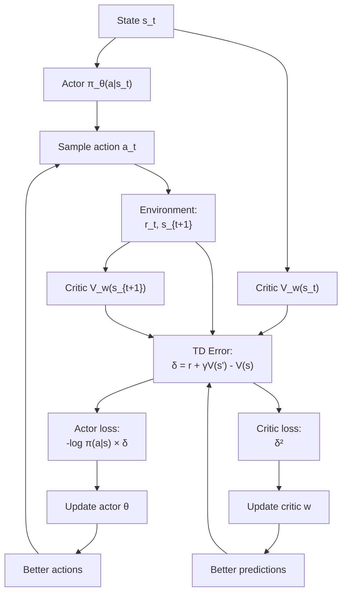

# Actor-Critic — Interview Deep Dive

> **What this file covers**
> - 🎯 Actor-critic architecture — why two networks work better than one
> - 🧮 TD error as advantage estimate — full derivation and bias analysis
> - ⚠️ 4 failure modes: critic bootstrapping error, shared network conflicts, learning rate sensitivity, entropy collapse
> - 📊 Complexity comparison: REINFORCE vs actor-critic vs n-step methods
> - 💡 Online vs episodic updates — when each wins
> - 🏭 Actor-critic as the foundation for PPO, SAC, and RLHF

---

## Brief restatement

Actor-critic methods combine two components: an actor (the policy π_θ) that chooses actions, and a critic (the value function V_w) that evaluates states. The critic's TD error δ = r + γV(s') - V(s) serves as a low-variance advantage estimate, enabling online (per-step) updates instead of waiting for episodes to end. This trades some bias (critic's approximation error) for dramatically lower variance, making learning faster and more stable than REINFORCE.

---

## 🧮 Full mathematical treatment

### The actor-critic update rules

**Step 1 — Words.** The actor and critic learn simultaneously but use different loss functions. The critic learns to predict returns accurately (supervised learning). The actor uses the critic's feedback to improve its action selection (policy gradient).

**Step 2 — Formula.**

**Critic update** (learns to predict value):

```
L_critic = (δ_t)² = (r_t + γV_w(s_{t+1}) - V_w(s_t))²

w ← w - β × ∇_w L_critic
  = w + β × δ_t × ∇_w V_w(s_t)

Where:
  w = critic parameters
  β = critic learning rate
  δ_t = r_t + γV_w(s_{t+1}) - V_w(s_t) = TD error
  V_w(s) = critic's value estimate
```

**Actor update** (learns better actions):

```
L_actor = -log π_θ(a_t|s_t) × δ_t

θ ← θ - α × ∇_θ L_actor
  = θ + α × ∇_θ log π_θ(a_t|s_t) × δ_t

Where:
  θ = actor parameters
  α = actor learning rate
  δ_t = TD error (computed by critic, detached from actor gradient)
```

🧮 **Combined loss** (when using shared parameters):

```
L_total = L_actor + c₁ × L_critic + c₂ × L_entropy

Where:
  c₁ = critic loss coefficient (typically 0.5)
  c₂ = entropy bonus coefficient (typically 0.01)
  L_entropy = -H[π_θ(·|s_t)] = Σ_a π_θ(a|s) log π_θ(a|s)
```

**Step 3 — Worked example.** One step of actor-critic with CartPole:

```
State s_t: pole angle = 0.03 rad, angular velocity = -0.1 rad/s

Critic predicts: V(s_t) = 45.0 (expected ~45 more steps of reward)

Actor outputs: π(left|s_t) = 0.4, π(right|s_t) = 0.6
Agent samples: a_t = right
log π(right|s_t) = log(0.6) = -0.51

Environment returns: r_t = 1, s_{t+1} (pole still balanced)
Critic predicts: V(s_{t+1}) = 46.0

TD error: δ = 1 + 0.99 × 46.0 - 45.0 = 1 + 45.54 - 45.0 = +1.54
→ "Better than expected!" (by 1.54)

Critic loss: δ² = 1.54² = 2.37
→ Adjust V(s_t) upward toward 46.54

Actor loss: -log(0.6) × 1.54 = -(-0.51) × 1.54 = 0.79
→ Increase probability of "right" in this state (positive δ)
```

### TD error as advantage estimate

**Step 1 — Words.** The TD error δ_t is a biased but low-variance estimate of the advantage A(s_t, a_t). We can show why by examining what δ_t is estimating.

**Step 2 — Formula.**

```
δ_t = r_t + γV(s_{t+1}) - V(s_t)

If V is perfect (V = V*):
  E[δ_t | s_t, a_t] = E[r_t + γV*(s_{t+1})] - V*(s_t)
                     = Q*(s_t, a_t) - V*(s_t)
                     = A*(s_t, a_t)

If V is imperfect (learned approximation):
  E[δ_t | s_t, a_t] = Q(s_t, a_t) - V_w(s_t) + γ(E[V*(s_{t+1})] - E[V_w(s_{t+1})])
                     = A(s_t, a_t) + γ × bias_term
```

🎯 **Key insight:** When the critic is perfect, δ_t is an unbiased advantage estimate. When the critic has errors, δ_t has bias proportional to γ × (true value - estimated value at s_{t+1}). As the critic improves, this bias shrinks.

**Step 3 — Worked example.** True values vs critic estimates:

```
V*(s_t) = 50, V_w(s_t) = 45  (critic underestimates by 5)
V*(s_{t+1}) = 52, V_w(s_{t+1}) = 48  (critic underestimates by 4)
r_t = 1

True advantage: Q*(s,a) - V*(s) = (r + γ×52) - 50 = 1 + 51.48 - 50 = 2.48
TD error: δ = r + γ×V_w(s') - V_w(s) = 1 + 0.99×48 - 45 = 1 + 47.52 - 45 = 3.52

Bias = δ - A* = 3.52 - 2.48 = 1.04
     ≈ γ × (V_w(s') - V*(s')) + (V*(s) - V_w(s))
     = 0.99 × (48-52) + (50-45) = -3.96 + 5 = 1.04  ✓
```

### Online vs episodic updates

**Step 1 — Words.** REINFORCE updates after the episode ends. Actor-critic can update after every single step. This is the key practical advantage.

**Step 2 — Comparison.**

```
REINFORCE (episodic):
  For episode of length T:
    - Collect T transitions
    - Compute T returns (backward pass)
    - One gradient update using all T transitions
    - Total updates per episode: 1

Actor-Critic (online):
  For episode of length T:
    - At each step t:
      - Compute δ_t = r + γV(s') - V(s)
      - Update actor AND critic immediately
    - Total updates per episode: T

More updates → faster learning
But each update uses less data → noisier individual updates
Net effect: actor-critic usually wins on wall-clock time
```

---

## 🗺️ Concept flow diagram



---

## ⚠️ Failure modes and edge cases

### 1. Critic bootstrapping error amplification

**Problem:** The critic uses its own predictions to compute targets: target = r + γV(s'). If V(s') is wrong, the target is wrong, and the critic learns from bad targets — a feedback loop.

**Symptom:** Value estimates drift away from true values. The critic predicts increasingly extreme values. Actor receives bad feedback and learns a poor policy.

**Comparison with DQN:** DQN solved this with target networks (separate frozen copy for targets). Basic actor-critic does not use target networks. Some variants (TD3, SAC) do use target networks for the critic.

**Fix:** Target networks for the critic (Polyak averaging), value function clipping, gradient clipping, careful learning rate tuning. Alternatively, n-step returns reduce the dependence on V(s'): target = r₀ + γr₁ + ... + γⁿV(s_{t+n}).

### 2. Shared network gradient conflicts

**Problem:** When the actor and critic share hidden layers, their gradients can conflict. The actor might need features for distinguishing actions, while the critic needs features for predicting value. Pulling the shared weights in different directions can slow learning or cause instability.

**Symptom:** Neither actor nor critic converges well. Training is slower than with separate networks. Loss oscillates without clear improvement.

**Evidence:** Empirically, separate networks can outperform shared networks in complex environments (MuJoCo continuous control). PPO and SAC often use separate networks in production.

**Fix:** Gradient scaling (smaller coefficient for critic loss: c₁ = 0.5), stop-gradient on TD error for actor update, separate networks when computational budget allows.

### 3. Learning rate sensitivity

**Problem:** The actor and critic learn at different speeds. If the critic is too slow, its feedback is inaccurate and the actor follows bad advice. If the critic is too fast, it overfits to the current policy and provides overconfident but wrong values.

**Symptom:** With critic too slow: actor diverges because advantages are noisy. With critic too fast: values look accurate on recent data but generalize poorly.

**Typical ratio:** Critic learning rate 2-10× higher than actor learning rate. The critic needs to keep up with the changing policy.

**Fix:** Separate learning rates (β_critic > α_actor), multiple critic updates per actor update (common in SAC: 1 actor update per 1 critic update, but critic has higher learning rate), gradient clipping.

### 4. Entropy collapse

**Problem:** The actor's policy can converge to a near-deterministic policy too quickly, putting all probability on one action. Once entropy approaches zero, the agent cannot explore and is stuck with potentially suboptimal behavior.

**Symptom:** Policy entropy drops rapidly in early training. Agent always takes the same action in a given state. Performance plateaus far below optimal.

**Fix:** Entropy regularization: add c₂ × H[π(·|s)] to the objective, where H is the entropy. This discourages the policy from becoming too deterministic. SAC makes entropy maximization a core principle. Typical c₂ = 0.01 for A2C.

---

## 📊 Complexity analysis

| Aspect | REINFORCE | REINFORCE + Baseline | Actor-Critic | A2C (N envs) |
|--------|-----------|---------------------|--------------|--------------|
| **Updates/episode** | 1 | 1 | T | T/n_steps |
| **Variance** | Very high | Medium | Low | Low |
| **Bias** | None | None | Critic error | Critic error |
| **Compute/update** | O(T × d) | O(T × d) | O(d) | O(N × n_steps × d) |
| **Memory** | O(T) trajectory | O(T) + O(d) critic | O(d) online | O(N × n_steps) batch |
| **Sample efficiency** | Low | Low | Medium | Medium |
| **Can handle continuing tasks** | ❌ | ❌ | ✅ | ✅ |

Where T = episode length, d = network size, N = number of parallel environments.

---

## 💡 Design trade-offs

| Design Choice | Option A | Option B | Recommendation |
|---|---|---|---|
| **Network architecture** | Shared layers + two heads | Separate actor and critic | Shared for simple tasks, separate for complex (SAC, TD3) |
| **Critic loss** | MSE: (V - target)² | Huber: smooth L1 | Huber more robust to outlier returns |
| **Actor gradient signal** | TD error δ_t | GAE advantage | GAE (λ=0.95) almost always better |
| **Update frequency** | Every step (online) | Every n steps (batch) | Batch (n=5-20) for GPU efficiency |
| **Entropy coefficient c₂** | 0 (no entropy bonus) | 0.01-0.05 | 0.01 standard, increase for exploration-heavy tasks |
| **Number of critic updates** | 1 per actor update | K per actor update | K=1 for A2C, K=2-5 for SAC |

---

## 🏭 Production and scaling considerations

- **PPO is actor-critic.** The most widely used RL algorithm in production is PPO, which is an actor-critic method with a clipped surrogate objective. The "critic" in PPO is trained with clipped value loss. Understanding basic actor-critic is prerequisite to understanding PPO.

- **SAC is actor-critic.** Soft Actor-Critic uses two Q-function critics (not V critics) with target networks and entropy maximization. It is the standard for continuous control (robotics, autonomous driving).

- **RLHF is actor-critic.** In RLHF, the language model is the actor, and the reward model + value head together act as the critic. PPO-based RLHF updates use advantages computed from the reward model's scores and the value head's predictions.

- **Distributed actor-critic.** Production systems (IMPALA, R2D2, Acme) separate data collection (actors running in environments) from learning (learner updating the network). Actors send trajectories to the learner, which computes TD errors and updates. This decoupling enables massive parallelism.

- **Debugging actor-critic:**
  1. Plot critic loss — should decrease and stabilize
  2. Plot policy entropy — should decrease slowly, not collapse
  3. Plot explained variance of critic: EV = 1 - Var(returns - V(s)) / Var(returns). If EV < 0, the critic is worse than predicting the mean — something is wrong
  4. Plot advantage statistics — mean should be near 0, std should decrease over training

---

## Staff/Principal Interview Depth

### Q1: Explain the bias-variance trade-off between REINFORCE and actor-critic. When is bias acceptable?

---

**No Hire**
*Interviewee:* "REINFORCE has high variance, actor-critic has bias. Actor-critic is better because it's faster."
*Interviewer:* Lists the properties but provides no explanation of WHY each method has those properties. "Actor-critic is better" is an oversimplification — there are scenarios where unbiased estimates matter.
*Criteria — Met:* none / *Missing:* mathematical source of bias/variance, when bias is harmful, quantitative comparison

**Weak Hire**
*Interviewee:* "REINFORCE uses actual returns G_t which are unbiased but noisy because they include all future randomness. Actor-critic uses δ_t = r + γV(s') - V(s), which is lower variance because it only looks one step ahead, but biased because V(s') might be wrong. Actor-critic is usually preferred because the variance reduction outweighs the small bias."
*Interviewer:* Correct explanation of sources. Missing: when bias is NOT acceptable, how bias decreases as critic improves, the connection to n-step returns and GAE as interpolation.
*Criteria — Met:* variance source, bias source / *Missing:* bias acceptability criteria, critic convergence, n-step interpolation

**Hire**
*Interviewee:* "The fundamental trade-off: REINFORCE estimates ∇J using E[∇log π × G_t]. G_t is an unbiased sample of Q(s,a), so the gradient is unbiased. But Var(G_t) grows with episode length. Actor-critic uses E[∇log π × δ_t], where δ_t = r + γV_w(s') - V_w(s). The variance of δ_t is much smaller (only one step of randomness), but if V_w ≠ V*, then E[δ_t] ≠ A(s,a) — there is bias. As training progresses and V_w converges, the bias shrinks. Bias is acceptable when: (1) it shrinks as the critic learns, (2) it does not systematically favor wrong actions, (3) the variance reduction more than compensates in terms of convergence speed. Bias is problematic when the critic is poorly architected and cannot represent V* — then the bias never disappears."
*Interviewer:* Good analysis of when bias is acceptable with three criteria. Notes the convergence condition. Would push on: how does this connect to the choice of n in n-step returns?
*Criteria — Met:* mathematical sources, acceptability criteria, convergence analysis / *Missing:* n-step interpolation, GAE, specific quantitative comparison

**Strong Hire**
*Interviewee:* [Gives the Hire answer, then adds] "The n-step return A_t^{(n)} = Σ_{k=0}^{n-1} γ^k r_{t+k} + γ^n V(s_{t+n}) - V(s_t) interpolates between the extremes. n=1 is TD (low variance, high bias), n=T is MC (high variance, zero bias). GAE generalizes this with λ-weighted averaging. The bias-variance trade-off can be quantified: Bias(δ) = γ × E[V_w(s') - V*(s')], so bias is proportional to the critic's prediction error ONE step ahead, scaled by γ. Variance(δ) ≈ Var(r) + γ² Var(V_w), which is typically much smaller than Var(G_t) ≈ Σ γ^{2k} Var(r_{t+k}). In practice, I'd start with GAE λ=0.95 and tune only if needed. If the environment has very long-horizon consequences (strategic games), increase λ toward 1. If the environment is reactive (control tasks), lower λ toward 0.9. The key diagnostic is the critic's explained variance — if EV > 0.8, the bias is small and TD-like methods work well."
*Interviewer:* Quantitative bias and variance formulas, n-step connection, GAE, practical tuning guidance based on explained variance. Connects theory to practice with specific recommendations. This is the level of depth and practical insight expected at staff level.
*Criteria — Met:* all above plus quantitative formulas, n-step to GAE progression, EV diagnostic, practical tuning

---

### Q2: Why does actor-critic use a shared network, and when should you use separate networks instead?

---

**No Hire**
*Interviewee:* "A shared network is more efficient. It uses less memory."
*Interviewer:* Memory efficiency is true but trivial. No mention of feature sharing, gradient conflicts, or when to use separate networks.
*Criteria — Met:* none / *Missing:* feature sharing, gradient conflicts, scenarios for each

**Weak Hire**
*Interviewee:* "Shared networks let the actor and critic use the same features. The hidden layers learn useful state representations that both heads can use. This is more parameter-efficient and provides regularization. You might want separate networks if the gradients conflict."
*Interviewer:* Correct high-level reasoning. "Gradients conflict" is vague — need specifics about how and when.
*Criteria — Met:* feature sharing, parameter efficiency / *Missing:* gradient conflict specifics, evidence, practical guidance

**Hire**
*Interviewee:* "Shared networks have three benefits: (1) Parameter efficiency — one set of shared layers instead of two, important for large models. (2) Feature sharing — representations useful for value prediction are often useful for action selection. The critic's gradient helps learn features the actor needs and vice versa. (3) Implicit regularization — the multi-task setup prevents either head from overfitting. But there are failure modes: the actor wants features that distinguish between actions (decision boundaries), while the critic wants features that predict returns (regression). These objectives can conflict, pulling shared weights in different directions. This is especially problematic in complex environments with high-dimensional observations (images) where feature demands diverge. SAC and TD3 use separate networks. Empirically, separate networks perform better on MuJoCo continuous control but shared networks work fine for CartPole and Atari."
*Interviewer:* Good three-benefit analysis with specific failure mode. Cites SAC/TD3 as evidence. Mentions task-dependent recommendation.
*Criteria — Met:* three benefits, gradient conflict specifics, algorithm examples, task-dependent guidance / *Missing:* stop-gradient technique, gradient scaling, formal analysis of interference

**Strong Hire**
*Interviewee:* [Gives the Hire answer, then adds] "There are intermediate solutions beyond all-shared or all-separate. Stop-gradient: detach the TD error from the actor's computation graph so the actor loss doesn't backpropagate through the critic. This is standard in A2C/PPO and prevents the actor from corrupting the critic's features. Gradient scaling: use a smaller coefficient for the critic loss (c₁ = 0.5 is standard) to reduce the critic's influence on shared features. Asymmetric architectures: the critic can have extra layers not shared with the actor, capturing value-specific representations while sharing the early feature extraction. In RLHF, the value head is typically a single linear layer on top of the language model's last hidden state — minimal shared parameters, avoiding the interference problem. The research community is increasingly moving toward separate networks for complex tasks, as the memory overhead is small compared to the stability benefits."
*Interviewer:* Covers the full spectrum of solutions: stop-gradient, gradient scaling, asymmetric architectures, and RLHF-specific design. Shows awareness of both theory and implementation practice. The RLHF architecture insight is particularly relevant.
*Criteria — Met:* all above plus stop-gradient, gradient scaling, asymmetric architectures, RLHF-specific design, trend analysis

---

### Q3: Compare actor-critic with DQN. When would you choose each for a new project?

---

**No Hire**
*Interviewee:* "DQN is for discrete actions, actor-critic is for continuous. Use DQN for games, actor-critic for robotics."
*Interviewer:* Oversimplified. DQN can handle any discrete action space, and actor-critic also works for discrete actions. The choice involves more nuanced trade-offs.
*Criteria — Met:* none / *Missing:* sample efficiency comparison, on-policy vs off-policy, specific scenarios

**Weak Hire**
*Interviewee:* "DQN is off-policy with replay buffer — more sample efficient. Actor-critic is on-policy — needs more samples but handles continuous actions. DQN uses ε-greedy exploration, actor-critic has natural exploration via stochastic policy."
*Interviewer:* Three valid comparison dimensions. Missing: stability comparison, convergence properties, and the fact that some actor-critic methods ARE off-policy (SAC, TD3).
*Criteria — Met:* sample efficiency, action space, exploration / *Missing:* off-policy actor-critic, stability, convergence, scaling

**Hire**
*Interviewee:* "Five dimensions of comparison. (1) Action space: DQN requires discrete, actor-critic handles both. (2) Sample efficiency: DQN is off-policy with replay — each transition used ~8 times. Basic actor-critic (A2C) is on-policy — each transition used once. Off-policy actor-critic (SAC, TD3) bridges this gap. (3) Stability: DQN can diverge (deadly triad) but target networks help. Actor-critic has high variance but no deadly triad with on-policy updates. (4) Scaling: actor-critic parallelizes naturally (A2C, PPO). DQN requires distributed replay buffers which are more complex. (5) Exploration: DQN uses ε-greedy (crude, often sufficient). Actor-critic uses policy entropy (natural, tunable). My decision rule: discrete + sample efficiency matters → DQN. Continuous actions → actor-critic (SAC for continuous, PPO for discrete). Parallel simulation available → PPO (scales best)."
*Interviewer:* Comprehensive five-way comparison with practical decision rule. Good coverage of both on-policy and off-policy actor-critic variants.
*Criteria — Met:* five dimensions, off-policy AC variants, practical decision rule / *Missing:* latency requirements, real-world deployment constraints, specific numbers

**Strong Hire**
*Interviewee:* [Gives the Hire answer, then adds] "Two additional practical considerations. First, deployment: DQN produces a deterministic policy (argmax Q) which is simple to deploy — no sampling needed. Actor-critic policies are stochastic, so at deployment you typically use the mean action (continuous) or argmax of probabilities (discrete), which adds a mode mismatch between training and inference. Second, real-world timing: if environment interactions are expensive (real robots), sample efficiency dominates and off-policy methods (DQN or SAC) win decisively. If environment interactions are cheap (GPU-based simulation), on-policy methods (PPO) can leverage massive parallelism to outperform off-policy methods in wall-clock time despite using more samples. The decision is really about the economics of your compute vs environment interaction. OpenAI chose PPO for RLHF not because it's the most sample-efficient, but because generating text from an LLM is fast enough that on-policy works, and PPO's stability is critical when training billion-parameter models."
*Interviewer:* Adds deployment considerations and the economics framework for choosing algorithms. The RLHF example is perfectly relevant and demonstrates systems-level thinking about algorithm selection.
*Criteria — Met:* all above plus deployment mode mismatch, compute economics, RLHF example, systems-level reasoning

---

## Key Takeaways

🎯 1. Actor-critic = policy gradient + learned value function. Actor chooses actions, critic evaluates them
🎯 2. TD error δ = r + γV(s') - V(s) is a biased but low-variance advantage estimate
   3. Online updates (every step) give T× more gradient steps per episode than REINFORCE
⚠️ 4. Critic bootstrapping error can amplify through self-referential learning — monitor explained variance
   5. Shared networks save memory but risk gradient conflicts; separate networks are safer for complex tasks
🎯 6. The actor-critic framework underpins PPO (clipped objective), SAC (entropy bonus), and RLHF (LM + value head)
   7. Learning rate ratio matters: critic typically needs 2-10× higher rate than actor
   8. Entropy regularization prevents premature convergence to deterministic policies
