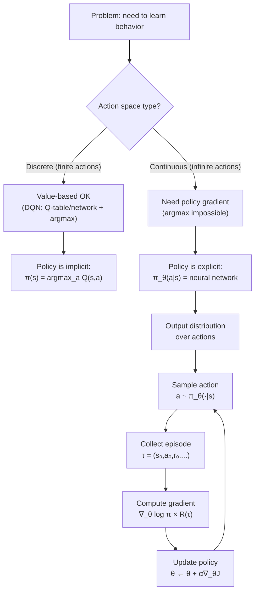

# Policy Gradient Intuition — Interview Deep Dive

> **What this file covers**
> - 🎯 Why policy gradients exist and when to use them over value-based methods
> - 🧮 The policy gradient theorem — full derivation with log-derivative trick
> - ⚠️ 3 failure modes: high variance, reward scale sensitivity, entropy collapse
> - 📊 Comparison of value-based vs policy-based methods — when each wins
> - 💡 Discrete vs continuous action parameterization
> - 🏭 Where policy gradients appear in production (RLHF, robotics, game AI)

---

## Brief restatement

Policy gradient methods learn a parameterized policy directly, bypassing value functions. Instead of computing Q-values and taking an argmax, the agent outputs a probability distribution over actions and updates its parameters to increase the probability of actions that led to high returns. This approach handles continuous actions naturally, supports stochastic policies, and produces smooth optimization landscapes — at the cost of high variance and sample inefficiency.

---

## 🧮 Full mathematical treatment

### The objective function

The goal in reinforcement learning is to find a policy that maximizes expected return. In policy gradient methods, the policy is parameterized by θ (the neural network weights):

**Step 1 — Words.** We want to find the network weights θ that maximize the average total reward across episodes.

**Step 2 — Formula.**

```
J(θ) = E_τ~π_θ [R(τ)]
     = E_τ~π_θ [Σ_{t=0}^{T} γ^t r_t]
```

Where:
- J(θ) = the objective function — average return under policy π_θ
- τ = a trajectory (sequence of states and actions): (s₀, a₀, r₀, s₁, a₁, r₁, ...)
- π_θ = the policy parameterized by θ
- R(τ) = the total return of trajectory τ
- γ = discount factor

**Step 3 — Worked example.** For a 3-step episode with γ = 0.99:
- Rewards: r₀ = 1, r₁ = 2, r₂ = 10
- R(τ) = 1 + 0.99 × 2 + 0.99² × 10 = 1 + 1.98 + 9.80 = 12.78

### The policy gradient theorem

**Step 1 — Words.** We need to compute the gradient ∇_θ J(θ) so we can use gradient ascent to improve the policy. The challenge is that changing θ changes which trajectories the agent produces, making the derivative complicated. The policy gradient theorem solves this with a trick: rewrite the gradient in a form that only requires sampling trajectories.

**Step 2 — Formula.** The probability of a trajectory τ under policy π_θ is:

```
p(τ|θ) = p(s₀) × Π_{t=0}^{T} π_θ(a_t|s_t) × p(s_{t+1}|s_t, a_t)
```

Taking the gradient of J(θ):

```
∇_θ J(θ) = ∇_θ E_τ [R(τ)]
         = ∇_θ ∫ p(τ|θ) R(τ) dτ
         = ∫ ∇_θ p(τ|θ) R(τ) dτ
```

Now apply the **log-derivative trick**: ∇_θ p(τ|θ) = p(τ|θ) × ∇_θ log p(τ|θ):

```
∇_θ J(θ) = ∫ p(τ|θ) × ∇_θ log p(τ|θ) × R(τ) dτ
         = E_τ [∇_θ log p(τ|θ) × R(τ)]
```

Since log p(τ|θ) = log p(s₀) + Σ_t [log π_θ(a_t|s_t) + log p(s_{t+1}|s_t, a_t)], and only π_θ depends on θ:

```
∇_θ log p(τ|θ) = Σ_{t=0}^{T} ∇_θ log π_θ(a_t|s_t)
```

🧮 **The policy gradient theorem:**

```
∇_θ J(θ) = E_τ [Σ_{t=0}^{T} ∇_θ log π_θ(a_t|s_t) × R(τ)]

Where:
  ∇_θ log π_θ(a_t|s_t) = the "score function" — direction to push θ
  R(τ) = total return — how much to push
```

**Step 3 — Worked example.** Consider a discrete policy with 2 actions in state s:
- π_θ(a=0|s) = 0.7, π_θ(a=1|s) = 0.3
- Agent sampled a=1, episode return R(τ) = 50

The gradient contribution for this step:
- log π_θ(a=1|s) = log(0.3) = -1.20
- ∇_θ log π_θ(a=1|s) × R(τ) = ∇_θ(-1.20) × 50

This pushes θ to increase π_θ(a=1|s) — making the action that led to high return more likely.

If R(τ) = -10 instead (bad episode), the gradient would push θ to decrease π_θ(a=1|s).

### Discrete vs continuous policy parameterization

**Discrete actions (Categorical distribution):**

```
π_θ(a|s) = softmax(f_θ(s))

Where f_θ(s) outputs a logit for each action.
Action sampling: a ~ Categorical(π_θ(·|s))
Log probability: log π_θ(a|s) = log(softmax(f_θ(s))[a])
```

**Continuous actions (Gaussian distribution):**

```
π_θ(a|s) = N(μ_θ(s), σ_θ(s)²)

Where:
  μ_θ(s) = neural network outputs the mean
  σ_θ(s) = neural network outputs the standard deviation (or log σ)

Action sampling: a = μ_θ(s) + σ_θ(s) × ε,  where ε ~ N(0, 1)
Log probability: log π_θ(a|s) = -½ [(a - μ)² / σ² + log(2πσ²)]
```

For d-dimensional continuous actions, use a diagonal Gaussian:

```
π_θ(a|s) = Π_{i=1}^{d} N(μ_i(s), σ_i(s)²)
```

This assumes action dimensions are independent — a simplification that works well in practice.

---

## 🗺️ Concept flow diagram



---

## ⚠️ Failure modes and edge cases

### 1. High variance in gradient estimates

The policy gradient uses R(τ) — the total return of the entire trajectory — to weight the gradient. Different trajectories from the same policy can have wildly different returns, making the gradient estimate very noisy.

**Symptom:** Training loss oscillates heavily, reward curves are jagged, convergence is slow or absent.

**Root cause:** R(τ) includes all future randomness after each action. Early actions get weighted by rewards they had no influence over.

**Mitigation:** Baseline subtraction (subtract V(s) from returns), advantage estimation, multiple parallel rollouts, return normalization. Covered in depth in [variance-reduction-interview.md](./variance-reduction-interview.md).

### 2. Reward scale sensitivity

Policy gradients multiply the gradient by the return. If rewards are large (e.g., +1000 per step), gradients become huge and training diverges. If rewards are tiny (e.g., +0.001), gradients vanish and learning stalls.

**Symptom:** Divergence with large rewards, no learning with small rewards, sensitivity to reward rescaling.

**Mitigation:** Reward normalization, return normalization, careful reward shaping, adaptive learning rates (Adam).

### 3. Entropy collapse (premature convergence)

The policy can converge to a deterministic action too quickly, putting all probability on one action before exploring enough. Once entropy is near zero, the agent cannot recover — it is stuck with a potentially suboptimal policy.

**Symptom:** Policy entropy drops rapidly early in training. Agent always takes the same action. Performance plateaus at a suboptimal level.

**Mitigation:** Entropy regularization (add -H[π] to loss), temperature scaling, lower learning rate, careful initialization.

---

## 📊 Complexity analysis

| Aspect | Value-Based (DQN) | Policy Gradient |
|--------|-------------------|-----------------|
| Forward pass | O(|A| × d) — one Q-value per action | O(|A| × d) discrete; O(d) continuous |
| Action selection | O(|A|) argmax | O(1) sampling |
| Works with continuous actions | ❌ Requires discretization | ✅ Native support |
| Sample efficiency | Higher (off-policy, replay) | Lower (on-policy, no replay) |
| Gradient variance | Lower (supervised-style TD loss) | Higher (policy gradient theorem) |
| Memory (replay buffer) | O(B × (|S| + 1)) | O(T × (|S| + 1)) per episode |

Where |A| = number of actions, d = hidden dimension, B = buffer size, T = episode length, |S| = state dimension.

---

## 💡 Design trade-offs

| | Value-Based (DQN) | Policy Gradient | Actor-Critic |
|---|---|---|---|
| **Best for** | Discrete, small action spaces | Continuous actions | Best of both worlds |
| **Sample efficiency** | ✅ High (replay buffer) | ❌ Low (on-policy) | Medium |
| **Stability** | Can diverge (deadly triad) | High variance | Moderate |
| **Exploration** | Requires ε-greedy | Built-in (stochastic) | Built-in + entropy bonus |
| **Continuous actions** | ❌ | ✅ | ✅ |
| **Mixed strategies** | ❌ Deterministic | ✅ Stochastic | ✅ Stochastic |
| **Convergence guarantees** | Weak | Converges to local optimum | Weak |

### When to use policy gradients

✅ Use policy gradients when:
- Action space is continuous (robotics, control)
- Mixed strategies are needed (game theory)
- You need stochastic exploration
- The policy structure matters (e.g., hierarchical policies)

❌ Avoid policy gradients when:
- Action space is small and discrete (DQN is more sample efficient)
- Sample efficiency is critical (off-policy methods are better)
- You need deterministic behavior at test time (though you can use the mean)

---

## 🏭 Production and scaling considerations

- **RLHF:** The language model IS the policy. The reward model provides R(τ). PPO (a policy gradient variant) is the standard training algorithm. The policy gradient theorem is the theoretical foundation for aligning LLMs.

- **Robotics:** Continuous joint torques and motor commands require policy gradients. SAC and PPO dominate, both of which are policy gradient methods. Sim-to-real transfer requires robust stochastic policies.

- **Game AI:** AlphaStar (StarCraft) uses policy gradients for the action policy. OpenAI Five (Dota 2) uses PPO with massive parallelism. Policy gradients handle the complex, mixed-strategy nature of competitive games.

- **Scaling:** Policy gradients parallelize well — run N environments to collect N× more data. A2C/A3C and PPO exploit this. GPU batch processing of policy forward passes enables real-time training with thousands of parallel environments.

---

## Staff/Principal Interview Depth

### Q1: Derive the policy gradient theorem from scratch. Why does the log-derivative trick work, and what does each term mean?

---

**No Hire**
*Interviewee:* "The policy gradient is the gradient of the expected reward. You compute it by... taking the derivative of the policy and multiplying by the reward."
*Interviewer:* Cannot distinguish between the gradient of the policy and the gradient of the objective. Does not mention the log-derivative trick or the expectation form. No mathematical precision.
*Criteria — Met:* none / *Missing:* derivation, log-derivative trick, trajectory probability, score function interpretation

**Weak Hire**
*Interviewee:* "We want to maximize J(θ) = E[R(τ)]. The gradient involves ∇p(τ|θ), but we can't compute that directly. The log-derivative trick converts it to E[∇log p(τ|θ) × R(τ)], which we can estimate by sampling trajectories."
*Interviewer:* Correct high-level outline but lacks the key insight: why only π_θ terms survive in the gradient (transition dynamics cancel). Does not show the actual derivation steps.
*Criteria — Met:* log-derivative trick concept, sampling form / *Missing:* full derivation, dynamics cancellation, score function interpretation, practical implications

**Hire**
*Interviewee:* "Starting from J(θ) = ∫ p(τ|θ)R(τ)dτ. Taking the gradient, we get ∫ ∇p(τ|θ)R(τ)dτ. Using the identity ∇p = p × ∇log(p), this becomes E[∇log p(τ|θ) × R(τ)]. Now log p(τ|θ) decomposes as log p(s₀) + Σ[log π_θ(a_t|s_t) + log p(s'|s,a)]. Only π_θ depends on θ, so the gradient simplifies to E[Σ ∇log π_θ(a_t|s_t) × R(τ)]. The ∇log π term is the score function — it points in the direction that increases the probability of that action. R(τ) scales it — good outcomes push harder."
*Interviewer:* Complete derivation with the critical insight about dynamics cancellation. Explains each term. Would push to Strong Hire by discussing the practical implications (model-free since dynamics cancel, high variance since R(τ) is trajectory-level).
*Criteria — Met:* full derivation, log-derivative trick, dynamics cancellation, score function interpretation / *Missing:* variance analysis, comparison with alternative derivations (compatible function approximation)

**Strong Hire**
*Interviewee:* [Gives the Hire answer, then continues] "Two important consequences. First, this is model-free — we never need ∇p(s'|s,a), which means we don't need a model of the environment. The dynamics cancel in the log. Second, the variance is high because we multiply by R(τ), the total trajectory return, which includes randomness from all future time steps. This is why we use baselines: subtracting any function b(s) that doesn't depend on the action preserves the expected gradient (since E[∇log π × b(s)] = b(s) × ∇Σπ = b(s) × ∇1 = 0) but reduces variance. The optimal baseline is V(s), which leads to the advantage function A(s,a) = Q(s,a) - V(s). There's also the issue of using R(τ) vs G_t: you can show that using the future return G_t from time t (instead of full R(τ)) is also unbiased but has lower variance, since early actions don't get weighted by rewards that preceded them."
*Interviewer:* Full derivation plus deep understanding of consequences. Connects the theorem to practical decisions (model-free, baseline, causality). Demonstrates the kind of mathematical reasoning expected at staff level.
*Criteria — Met:* complete derivation, dynamics cancellation, score function, variance analysis, baseline proof, causality improvement, model-free consequence

---

### Q2: Compare value-based and policy-based methods. When would you choose one over the other?

---

**No Hire**
*Interviewee:* "Value-based methods learn Q-values, policy-based methods learn the policy directly. Policy gradients are better because they're more modern."
*Interviewer:* Superficial distinction with no technical depth. "More modern" is not a valid criterion. No mention of continuous actions, sample efficiency, or convergence properties.
*Criteria — Met:* none / *Missing:* continuous action handling, sample efficiency comparison, convergence properties, specific scenarios

**Weak Hire**
*Interviewee:* "Value-based methods like DQN learn Q-values and take argmax. This doesn't work with continuous actions because you'd need to maximize over an infinite set. Policy gradients output actions directly, so they handle continuous spaces naturally. But DQN is more sample efficient because it can use experience replay."
*Interviewer:* Correctly identifies the continuous action limitation and sample efficiency trade-off. Missing: stochastic vs deterministic policies, convergence guarantees, when you'd actually choose DQN over policy gradients despite continuous being possible.
*Criteria — Met:* continuous action argument, sample efficiency / *Missing:* stochastic policies, mixed strategies, convergence analysis, concrete decision criteria

**Hire**
*Interviewee:* "Three key differences. First, action space: DQN requires argmax over all actions, impossible with continuous spaces. Policy gradients parameterize a distribution and sample, handling any action space. Second, exploration: DQN uses ε-greedy (crude), policy gradients have built-in stochastic exploration (natural). Third, sample efficiency: DQN uses off-policy replay (high efficiency), policy gradients are on-policy (low efficiency). I'd choose DQN for Atari-like discrete environments where sample efficiency matters. Policy gradients for robotics or any continuous control task. Actor-critic methods try to get the best of both — policy gradient updates with a learned value function for variance reduction."
*Interviewer:* Solid three-way comparison with concrete recommendations. Would push further: can you ever use value-based methods for continuous actions? (Yes — DDPG, discretization.) When does sample efficiency NOT matter? (Simulation, where you have unlimited data.)
*Criteria — Met:* action space analysis, exploration comparison, sample efficiency, concrete recommendations / *Missing:* convergence guarantees, mixed strategies, exceptions to the rule (DDPG)

**Strong Hire**
*Interviewee:* [Gives the Hire answer, then adds] "There are also subtler considerations. Policy gradients can represent mixed strategies — in rock-paper-scissors, the Nash equilibrium is uniform random, which a deterministic DQN policy cannot represent. Policy gradient convergence is to a local optimum of J(θ), which can be suboptimal if the policy class is restrictive. DQN converges to the optimal Q-function in the tabular case but can diverge with function approximation (deadly triad). For continuous actions, there are also hybrid approaches: DDPG uses a deterministic policy gradient (actor-critic with a Q-function critic), and SAC adds entropy maximization. The choice isn't strictly value vs policy — it's about which combination of ideas fits your problem. In production at scale, PPO dominates because it's stable, parallelizable, and handles both discrete and continuous actions. DQN is rarely used outside of discrete game environments."
*Interviewer:* Demonstrates nuanced understanding beyond the textbook dichotomy. Knows about mixed strategies, convergence guarantees, hybrid methods, and production realities. This is staff-level thinking — connecting theoretical properties to engineering decisions.
*Criteria — Met:* all above plus mixed strategies, convergence guarantees, hybrid methods (DDPG, SAC), production perspective

---

### Q3: Why are stochastic policies important in policy gradient methods? Can you always use a deterministic policy?

---

**No Hire**
*Interviewee:* "Stochastic policies add randomness for exploration. Deterministic policies are fine once the agent has learned."
*Interviewer:* Misses the fundamental reasons for stochastic policies. Exploration is one benefit but not the only or most important one. Does not mention optimization, mixed strategies, or the mathematical requirements.
*Criteria — Met:* none / *Missing:* optimization smoothness, mixed strategies, gradient computation, theoretical necessity

**Weak Hire**
*Interviewee:* "Stochastic policies are needed for exploration. If the policy is deterministic, the agent always takes the same action and can't explore. Also, the policy gradient requires log π(a|s), which needs the policy to assign probabilities to actions."
*Interviewer:* Correctly identifies the gradient computation requirement. But doesn't explain WHY log probabilities are needed (the log-derivative trick requires a probability distribution). Exploration is mentioned but not connected to any deeper principle.
*Criteria — Met:* gradient computation connection, exploration / *Missing:* optimization smoothness, mixed strategies, deterministic policy gradient theorem as counterexample, entropy regularization

**Hire**
*Interviewee:* "Three reasons. First, the policy gradient theorem is derived using E[∇log π × R], which requires π to be a probability distribution — you need log probabilities. Second, stochastic policies provide smooth optimization landscapes — small changes to θ cause small changes to action probabilities, making gradient descent well-behaved. A deterministic policy has a discontinuous mapping from states to actions, which is hard to optimize. Third, some problems require stochastic policies — in rock-paper-scissors, any deterministic policy is exploitable. The optimal policy is uniformly random, which only a stochastic policy can represent. That said, deterministic policies exist — DDPG uses the deterministic policy gradient theorem, which is derived differently and uses a Q-function critic."
*Interviewer:* All three core reasons clearly stated. Acknowledges the DDPG exception. Good depth.
*Criteria — Met:* gradient computation, optimization smoothness, mixed strategies, DDPG exception / *Missing:* formal connection between entropy and exploration, relationship to KL divergence in trust region methods

**Strong Hire**
*Interviewee:* [Gives the Hire answer, then adds] "There's a deeper connection here. Entropy regularization — adding -αH[π] to the objective — explicitly encourages stochasticity. SAC (Soft Actor-Critic) makes this a central principle: it maximizes expected return PLUS entropy, which has elegant consequences. The optimal policy under maximum entropy RL is π*(a|s) ∝ exp(Q(s,a)/α), which is a Boltzmann distribution over Q-values. This connects policy gradients to energy-based models and provides a principled exploration mechanism. In trust region methods (TRPO, PPO), the KL divergence KL(π_old || π_new) constrains how much the policy changes — this only makes sense for stochastic policies. The entire framework of constrained optimization in policy space requires distributions, not point values. So stochasticity isn't just a hack for exploration — it's fundamental to the mathematical framework that makes modern RL algorithms work."
*Interviewer:* Connects stochastic policies to entropy regularization, maximum entropy RL, Boltzmann distributions, and trust region methods. Demonstrates deep understanding of how stochasticity is woven into the theoretical fabric of policy gradient methods.
*Criteria — Met:* all above plus entropy regularization, maximum entropy RL, trust region connection, energy-based model connection

---

## Key Takeaways

🎯 1. Policy gradients learn the policy directly — no Q-values, no argmax — unlocking continuous action spaces
🎯 2. The policy gradient theorem: ∇_θ J = E[Σ ∇log π_θ(a_t|s_t) × R(τ)] — derived via the log-derivative trick
   3. Transition dynamics cancel in the gradient — this is why policy gradients are model-free
⚠️ 4. High variance is the central weakness — R(τ) is noisy, making gradients unreliable without baselines
   5. Stochastic policies are required for the mathematical framework, not just for exploration
🎯 6. For discrete actions: Categorical distribution. For continuous: Gaussian with learned mean and variance
   7. Policy gradients trade sample efficiency (lower) for generality (handles any action space)
   8. Every modern production RL algorithm (PPO, SAC, A3C) is built on the policy gradient theorem
