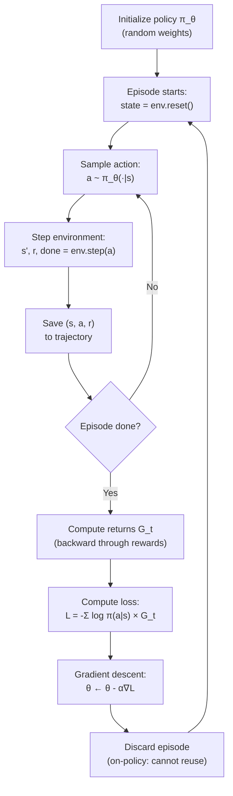

# REINFORCE Algorithm — Interview Deep Dive

> **What this file covers**
> - 🎯 REINFORCE as Monte Carlo policy gradient — why the name fits
> - 🧮 Full REINFORCE update rule with derivation and worked example
> - ⚠️ 4 failure modes: high variance, credit assignment, reward scaling, on-policy inefficiency
> - 📊 Complexity analysis — compute, memory, sample efficiency
> - 💡 Vanilla REINFORCE vs with baseline — when each matters
> - 🏭 REINFORCE as the foundation for PPO and RLHF

---

## Brief restatement

REINFORCE is the simplest policy gradient algorithm. It collects a complete episode, computes the discounted return at each time step, and updates the policy to make actions with high returns more probable. It is Monte Carlo because it uses actual returns (not bootstrapped estimates). It is on-policy because it throws away data after each update. These properties make it unbiased but high-variance — the theoretical foundation for everything that follows.

---

## 🧮 Full mathematical treatment

### The REINFORCE update rule

**Step 1 — Words.** After collecting an episode, REINFORCE computes a gradient that pushes the policy to repeat actions that led to high returns and avoid actions that led to low returns. The key insight is that you can compute this gradient using only the log probabilities of the actions taken and the returns received — no model of the environment needed.

**Step 2 — Formula.**

```
θ ← θ + α × Σ_{t=0}^{T} ∇_θ log π_θ(a_t|s_t) × G_t

Where:
  θ = policy network parameters
  α = learning rate
  π_θ(a_t|s_t) = probability of action a_t in state s_t
  G_t = Σ_{k=0}^{T-t} γ^k × r_{t+k} = discounted return from time t
  T = episode length
```

The loss function used in practice (for gradient descent optimizers that minimize):

```
L(θ) = -Σ_{t=0}^{T} log π_θ(a_t|s_t) × G_t
```

The negative sign converts gradient ascent (maximize return) to gradient descent (minimize loss).

**Step 3 — Worked example.** A 3-step episode with γ = 0.99:

```
States:  s₀, s₁, s₂
Actions: a₀, a₁, a₂
Rewards: r₀=1, r₁=0, r₂=10

Step 1: Compute returns (backward):
  G₂ = r₂ = 10
  G₁ = r₁ + γ × G₂ = 0 + 0.99 × 10 = 9.90
  G₀ = r₀ + γ × G₁ = 1 + 0.99 × 9.90 = 10.80

Step 2: Suppose log probabilities are:
  log π(a₀|s₀) = -0.69  (prob ≈ 0.50)
  log π(a₁|s₁) = -1.20  (prob ≈ 0.30)
  log π(a₂|s₂) = -0.36  (prob ≈ 0.70)

Step 3: Loss contributions:
  -log π(a₀|s₀) × G₀ = -(-0.69) × 10.80 = 7.45
  -log π(a₁|s₁) × G₁ = -(-1.20) × 9.90  = 11.88
  -log π(a₂|s₂) × G₂ = -(-0.36) × 10.00 = 3.60

Total loss = 7.45 + 11.88 + 3.60 = 22.93
```

Notice: a₁ has the largest loss contribution despite getting 0 reward — because log π(a₁|s₁) was large (action was unlikely) AND G₁ was large (good things followed). REINFORCE credits a₁ for the future reward r₂=10, even though a₁ might have had nothing to do with it. This is the credit assignment problem.

### Return computation

**Step 1 — Words.** Returns are computed backward through the episode. Starting from the last step, each return equals the immediate reward plus the discounted return of the next step.

**Step 2 — Formula.**

```
G_T = r_T
G_t = r_t + γ × G_{t+1}    for t = T-1, T-2, ..., 0
```

This backward recursion computes all returns in O(T) time.

**Step 3 — Worked example.** A 5-step episode with all rewards = 1, γ = 0.99:

```
G₄ = 1.000
G₃ = 1 + 0.99 × 1.000 = 1.990
G₂ = 1 + 0.99 × 1.990 = 2.970
G₁ = 1 + 0.99 × 2.970 = 3.940
G₀ = 1 + 0.99 × 3.940 = 4.901
```

Earlier time steps have larger returns because they have more future rewards to collect.

### Why REINFORCE is unbiased

The REINFORCE gradient estimator is an unbiased estimate of ∇_θ J(θ):

```
E[∇_θ log π_θ(a_t|s_t) × G_t] = ∇_θ J(θ)
```

This follows from the policy gradient theorem. The key property: using actual returns G_t (not estimates) preserves the exact expected gradient. This is in contrast to TD-based methods, which bootstrap from a learned value function and introduce bias.

---

## 🗺️ Concept flow diagram



---

## ⚠️ Failure modes and edge cases

### 1. High variance gradient estimates

**Problem:** The return G_t includes all future rewards, which vary wildly between episodes due to stochastic actions and environments. The same action in the same state can produce returns of 50 in one episode and 300 in another.

**Symptom:** Reward curves are extremely noisy. Training progress is inconsistent. The agent appears to "forget" learned behavior.

**Quantification:** For CartPole with episode lengths 50-500, the standard deviation of returns can be 50-100% of the mean. This means gradient estimates regularly point in the wrong direction.

**Fix:** Baseline subtraction reduces variance. The simplest baseline is the running mean of returns. The optimal baseline is V(s). See [variance-reduction-interview.md](./variance-reduction-interview.md).

### 2. Credit assignment failure

**Problem:** G_t at time t includes rewards from t+1, t+2, ..., T. Action a_t gets credit (or blame) for all of them, even though most future rewards were caused by other actions.

**Example:** In a 100-step episode, the agent makes a brilliant move at step 95 that earns reward +100. The action at step 0 gets weighted by a return that includes this +100, even though step 0 had nothing to do with it. This is like giving a football player credit for the whole team's score.

**Fix:** Using G_t (return from time t) instead of R(τ) (total trajectory return) already helps — this is the "causality" improvement built into standard REINFORCE. Further improvement comes from advantage estimation and actor-critic methods.

### 3. Reward scale sensitivity

**Problem:** REINFORCE multiplies gradients by returns. Large rewards create large gradients that can destabilize training. Small rewards create tiny gradients that make learning imperceptibly slow.

**Example:** Environment A gives rewards of 0-1 per step. Environment B gives rewards of 0-1000 per step. The same learning rate α will be far too large for B and possibly too small for A.

**Fix:** Return normalization: G_t ← (G_t - mean) / (std + ε). This standardizes the scale of gradient updates regardless of reward magnitude. Adam optimizer also helps by adapting per-parameter learning rates.

### 4. On-policy sample inefficiency

**Problem:** REINFORCE collects an episode, updates once, and throws the episode away. In environments where episodes are expensive to collect (real-world robotics, complex simulations), this waste is devastating.

**Quantification:** DQN reuses each transition ~8 times on average (replay ratio). REINFORCE uses each transition exactly once. For the same number of gradient updates, REINFORCE needs 8× more environment interactions.

**Fix:** This is a fundamental limitation of on-policy methods. Importance sampling can partially reuse old data (as in PPO), but full off-policy reuse requires a different algorithm class (DQN, SAC).

---

## 📊 Complexity analysis

| Aspect | REINFORCE | DQN (for comparison) |
|--------|-----------|---------------------|
| **Forward pass per step** | O(d × |A|) | O(d × |A|) |
| **Updates per episode** | 1 (end of episode) | T (every step) |
| **Gradient computation** | O(T × d × |A|) per episode | O(d × |A|) per step |
| **Memory per episode** | O(T × (|S| + 1 + 1)) — store states, actions, rewards | O(B × (|S| + |A| + |S| + 2)) — replay buffer |
| **Data reuse** | 1× (each sample used once) | ~8× (replay ratio) |
| **Episodes to solve CartPole** | ~300-500 | ~100-200 |

Where d = hidden dimension, |A| = action count, |S| = state dimension, T = episode length, B = buffer size.

---

## 💡 Design trade-offs

| Design Choice | Option A | Option B | Trade-off |
|---|---|---|---|
| **Return type** | Full R(τ) | Per-step G_t | G_t is lower variance (causality), same expected gradient |
| **Return normalization** | Raw returns | Normalized (G - μ)/σ | Normalization reduces variance but adds slight bias |
| **Discount factor γ** | γ = 1.0 (no discounting) | γ = 0.99 | Lower γ reduces variance but may miss long-term rewards |
| **Learning rate** | Fixed α | Adam adaptive | Adam handles reward scale changes, reduces sensitivity |
| **Baseline** | None (vanilla) | Constant / Learned V(s) | Baseline reduces variance dramatically, small implementation cost |

---

## 🏭 Production and scaling considerations

- **REINFORCE in isolation is rarely used in production.** Its high variance and sample inefficiency make it impractical for large-scale problems. It is the theoretical foundation that PPO, A2C, and TRPO build upon.

- **The REINFORCE gradient estimator appears everywhere.** Any time a system samples a discrete choice and needs to compute a gradient through that sample, the log-probability trick from REINFORCE is used. This includes variational autoencoders (ELBO gradient), neural architecture search, and hard attention mechanisms.

- **Connection to RLHF:** In RLHF, the language model generates a response (episode), the reward model scores it (return), and the policy is updated using a variant of the policy gradient. PPO's objective is a refined version of REINFORCE's log π × advantage.

- **Debugging tip:** Plot the mean and std of returns over episodes. If std >> mean, the gradient signal is mostly noise. Add a baseline, normalize returns, or increase batch size.

---

## Staff/Principal Interview Depth

### Q1: Walk through one complete REINFORCE update step, including what happens to actions that led to negative returns.

---

**No Hire**
*Interviewee:* "You collect an episode, compute the reward, and update the policy to make good actions more likely."
*Interviewer:* No specifics about return computation, gradient formula, or negative returns. The answer could apply to any RL algorithm.
*Criteria — Met:* none / *Missing:* return computation, gradient formula, log probability, negative return handling

**Weak Hire**
*Interviewee:* "Collect a trajectory, compute G_t at each step by discounting forward rewards. The update is θ += α × ∇log π(a|s) × G_t. If G_t is positive, we increase the probability of that action. If G_t is negative, we decrease it."
*Interviewer:* Correct formula and sign interpretation. Missing: why this is gradient ascent (or how the loss function relates), how the backward return computation works, what happens when ALL returns are positive (common in practice).
*Criteria — Met:* formula, sign interpretation / *Missing:* backward computation, all-positive returns problem, practical implementation details

**Hire**
*Interviewee:* "Full walkthrough: (1) Initialize policy. (2) Collect episode: at each step, sample a ~ π_θ(·|s), store (s, a, r). (3) Compute returns backward: G_T = r_T, G_t = r_t + γG_{t+1}. (4) Compute loss: L = -Σ log π(a_t|s_t) × G_t. The negative sign converts to gradient descent. (5) Backpropagate and update θ. For negative returns: log π × G_t becomes positive when G_t < 0 (since log π ≤ 0), so the gradient pushes to decrease π(a_t|s_t). But in practice, returns are often ALL positive (rewards > 0), which means every action gets reinforced — just by different amounts. This is why baselines matter: subtracting V(s) centers the returns, making below-average actions get negative advantage."
*Interviewer:* Complete walkthrough with the practical insight about all-positive returns. Good connection to baselines.
*Criteria — Met:* full algorithm, backward computation, all-positive problem, baseline connection / *Missing:* specific handling of terminal states, practical debugging (NaN in log π when π → 0)

**Strong Hire**
*Interviewee:* [Gives the Hire answer, then adds] "Two practical details worth mentioning. First, when π_θ(a|s) approaches 0 for some action, log π → -∞, which can cause NaN gradients. This is handled by clamping probabilities: max(π, ε) with ε ≈ 1e-8, or equivalently using log-softmax instead of separate softmax + log. Second, the on-policy requirement means we MUST use the current policy to collect data. If we update θ and then use old episode data, the gradient estimate is biased because the actions were sampled from an old policy. This is why REINFORCE discards data after each update — and why PPO uses importance sampling ratios to partially reuse old data while controlling the bias."
*Interviewer:* Adds numerical stability and on-policy requirement — both real engineering concerns. The connection to PPO shows understanding of how REINFORCE's limitations motivated its successors.
*Criteria — Met:* complete walkthrough, all-positive returns, baseline, numerical stability, on-policy constraint, PPO connection

---

### Q2: Why is REINFORCE called a Monte Carlo method, and what are the practical consequences?

---

**No Hire**
*Interviewee:* "It's called Monte Carlo because it uses randomness. The policy is stochastic, so it's a Monte Carlo method."
*Interviewer:* Confuses the source of randomness. Monte Carlo refers to using complete episode returns, not to the stochastic policy. Any RL method with a stochastic policy uses randomness — that doesn't make it Monte Carlo.
*Criteria — Met:* none / *Missing:* episode-level returns, bootstrapping distinction, variance consequence, episodic requirement

**Weak Hire**
*Interviewee:* "Monte Carlo means it uses actual returns from complete episodes rather than bootstrapping from a value estimate. The practical consequence is that you need to finish the episode before you can update."
*Interviewer:* Correct definition and one key consequence. Missing the deeper implications: why this causes high variance, the bias-variance trade-off with TD methods, and the inability to handle continuing (non-episodic) tasks.
*Criteria — Met:* correct definition, episodic requirement / *Missing:* variance analysis, bias trade-off, continuing task limitation

**Hire**
*Interviewee:* "Monte Carlo means using sample-based estimates of the expected return. REINFORCE uses G_t — the actual discounted return from the episode — rather than a bootstrapped estimate like r + γV(s'). Three consequences: (1) Must wait for episode to end — cannot do online updates, cannot handle continuing tasks. (2) Unbiased — G_t is an unbiased estimate of the true expected return, unlike TD targets which depend on a learned V. (3) High variance — G_t includes all future randomness. If the episode is 200 steps long, G_0 has the accumulated noise of 200 random actions and transitions."
*Interviewer:* Clean three-part analysis. Would push: how does the variance scale with episode length?
*Criteria — Met:* correct definition, three consequences, unbiased property / *Missing:* variance scaling analysis, comparison with n-step returns

**Strong Hire**
*Interviewee:* [Gives the Hire answer, then adds] "The variance of G_t scales roughly as O(T-t) — earlier time steps have higher variance because more randomness accumulates. Specifically, Var(G_t) = Σ_{k=0}^{T-t} γ^{2k} Var(r_{t+k}) plus covariance terms from the policy. This scaling is why n-step returns are a useful intermediate: G_t^{(n)} = Σ_{k=0}^{n-1} γ^k r_{t+k} + γ^n V(s_{t+n}) uses n actual rewards and bootstraps the rest. With n=1, this is TD(0) (low variance, biased). With n=T-t, this is Monte Carlo (high variance, unbiased). GAE generalizes this with the λ-weighted average. The fundamental tension in RL — bias vs variance — shows up directly in the choice between Monte Carlo (REINFORCE) and TD (actor-critic)."
*Interviewer:* Quantitative variance analysis, n-step return connection, and GAE. Connects Monte Carlo vs TD to the central bias-variance trade-off in RL. This is the kind of unified understanding expected at staff level.
*Criteria — Met:* all above plus variance scaling, n-step returns, GAE, bias-variance framework

---

### Q3: What is the credit assignment problem in REINFORCE, and how do later methods address it?

---

**No Hire**
*Interviewee:* "Credit assignment is about figuring out which actions were good. REINFORCE doesn't handle this well."
*Interviewer:* Correctly identifies the concept but provides no mechanism or solution. No mention of how returns are allocated or why this is specifically problematic in REINFORCE.
*Criteria — Met:* none / *Missing:* mechanism, specific REINFORCE problem, solutions

**Weak Hire**
*Interviewee:* "In REINFORCE, every action's gradient is weighted by G_t, which includes all future rewards. An action at time 0 gets credit for a reward at time 99, even if it had nothing to do with it. Baselines help by subtracting V(s), so actions only get credit for being above or below average."
*Interviewer:* Good identification of the problem and baseline solution. Missing: temporal credit assignment vs structural credit assignment, actor-critic as a more fundamental solution, eligibility traces.
*Criteria — Met:* problem identification, baseline solution / *Missing:* actor-critic solution, temporal vs structural distinction, eligibility traces

**Hire**
*Interviewee:* "Two aspects. First, temporal credit assignment: G_t at time step t includes rewards from t+1 through T. Action a_t gets blamed or praised for all of them. The causality improvement (using G_t instead of R(τ)) helps — it ensures actions only get credit for rewards that came AFTER them. But they still get credit for rewards that came after but were caused by OTHER actions. Second, the baseline/advantage approach improves this further: A_t = G_t - V(s_t) measures how much better this specific trajectory was than average FROM this state. This filters out the baseline performance. Actor-critic takes it further by using δ_t = r_t + γV(s_{t+1}) - V(s_t), which only looks one step ahead. The TD error is the most localized credit — it asks 'was this one transition better than expected?' at the cost of some bias."
*Interviewer:* Excellent progression from raw returns to causality to baselines to TD error. Each step narrows the credit assignment window. Clear and precise.
*Criteria — Met:* temporal credit assignment, causality improvement, baseline, advantage, TD error progression / *Missing:* eligibility traces, n-step returns as interpolation

**Strong Hire**
*Interviewee:* [Gives the Hire answer, then adds] "There's an elegant way to see this spectrum. The 'effective credit window' shrinks as we go from REINFORCE to actor-critic. REINFORCE with R(τ): window is the entire episode. With G_t: window is t to T. With baseline A_t = G_t - V(s_t): window is still t to T but centered. With n-step advantage: window is t to t+n. With TD error δ_t: window is just one step. GAE with parameter λ gives a geometrically-weighted average across all window sizes, with (γλ)^k giving the weight for k steps ahead. So λ literally controls the credit assignment horizon — λ=1 is full Monte Carlo credit, λ=0 is single-step credit, and λ=0.95 is a compromise. The optimal λ depends on how temporally extended the meaningful consequences of actions are."
*Interviewer:* Unifies the entire spectrum under 'credit window' as a single framework. GAE λ as credit assignment horizon is a powerful insight. This level of synthesis — connecting multiple techniques through a unifying principle — is exactly what distinguishes staff-level understanding.
*Criteria — Met:* full credit assignment spectrum, window interpretation, GAE as credit horizon, practical λ selection guidance

---

## Key Takeaways

🎯 1. REINFORCE update: θ ← θ + α × Σ ∇log π(a_t|s_t) × G_t — multiply score function by return
🎯 2. Monte Carlo property: uses actual returns G_t — unbiased but high variance
   3. Returns computed backward in O(T): G_t = r_t + γG_{t+1}
⚠️ 4. High variance from credit assignment: early actions get credit for all future rewards
   5. All-positive returns problem: without a baseline, every action gets reinforced
🎯 6. On-policy constraint: each episode used exactly once, then discarded
   7. The REINFORCE gradient (log π × return) appears throughout ML: VAE, NAS, hard attention
   8. REINFORCE is the ancestor of PPO, A2C, and all modern policy gradient methods
