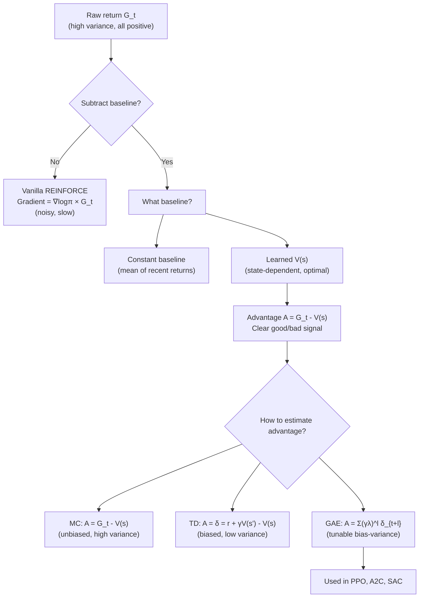

# Variance Reduction — Interview Deep Dive

> **What this file covers**
> - 🎯 Why baseline subtraction reduces variance without adding bias — full proof
> - 🧮 Optimal baseline derivation — why V(s) minimizes variance
> - ⚠️ 3 failure modes: poor baseline estimation, advantage magnitude issues, normalization pitfalls
> - 📊 Variance reduction quantification — how much baselines actually help
> - 💡 Advantage function design choices — MC vs TD vs GAE
> - 🏭 Advantage estimation in PPO and real systems

---

## Brief restatement

Vanilla REINFORCE multiplies the policy gradient by the raw return G_t, which is noisy and often all-positive. Subtracting a baseline b(s) from the return reduces variance without changing the expected gradient. The optimal baseline is V(s), the expected return from the current state. The resulting quantity G_t - V(s) is the advantage — how much better this trajectory was compared to average. The advantage function A(s,a) = Q(s,a) - V(s) is the central signal in all modern policy gradient methods.

---

## 🧮 Full mathematical treatment

### Baseline subtraction preserves the expected gradient

**Step 1 — Words.** We want to show that subtracting any state-dependent baseline b(s) from the return does not change the expected gradient. This means we get the same learning direction on average, but with less noise.

**Step 2 — Formula.**

The original policy gradient:

```
∇_θ J(θ) = E[∇_θ log π_θ(a|s) × G_t]
```

With baseline:

```
∇_θ J(θ) = E[∇_θ log π_θ(a|s) × (G_t - b(s))]
```

We need to show that E[∇_θ log π_θ(a|s) × b(s)] = 0:

```
E_a[∇_θ log π_θ(a|s) × b(s)]
= b(s) × E_a[∇_θ log π_θ(a|s)]           (b(s) doesn't depend on a)
= b(s) × Σ_a π_θ(a|s) × ∇_θ log π_θ(a|s)  (expand expectation)
= b(s) × Σ_a π_θ(a|s) × ∇_θ π_θ(a|s) / π_θ(a|s)  (log derivative)
= b(s) × Σ_a ∇_θ π_θ(a|s)                (cancel π_θ)
= b(s) × ∇_θ Σ_a π_θ(a|s)                (swap sum and gradient)
= b(s) × ∇_θ 1                            (probabilities sum to 1)
= 0
```

🎯 **Key insight:** Any baseline that depends only on the state (not the action) can be subtracted without bias. The proof relies on probabilities summing to 1.

**Step 3 — Worked example.** Two actions from state s, with π(a₀|s) = 0.6 and π(a₁|s) = 0.3:

```
Without baseline (b = 0):
  G₀ = 100, G₁ = 80
  Gradient ∝ 0.6 × ∇log(0.6) × 100 + 0.4 × ∇log(0.4) × 80

With baseline (b = 88, the weighted average):
  Gradient ∝ 0.6 × ∇log(0.6) × (100-88) + 0.4 × ∇log(0.4) × (80-88)
           = 0.6 × ∇log(0.6) × 12 + 0.4 × ∇log(0.4) × (-8)
```

Both have the same expected value, but the second has much smaller magnitudes (12 and -8 vs 100 and 80), meaning lower variance.

### The optimal baseline

**Step 1 — Words.** Not all baselines reduce variance by the same amount. We can find the baseline that minimizes the variance of the gradient estimate.

**Step 2 — Formula.**

The variance of the gradient estimate is:

```
Var = E[(∇_θ log π × (G - b))²] - (E[∇_θ log π × (G - b)])²
```

Since the second term does not depend on b (proven above), minimizing Var means minimizing:

```
E[(∇_θ log π × (G - b))²]
```

Taking the derivative with respect to b and setting to zero:

```
∂/∂b E[(∇_θ log π)² × (G - b)²] = 0
-2 × E[(∇_θ log π)² × (G - b)] = 0
E[(∇_θ log π)² × G] = b × E[(∇_θ log π)²]

b* = E[(∇_θ log π)² × G] / E[(∇_θ log π)²]
```

This is a weighted average of returns, where the weights are the squared score functions. In practice, this is approximated by V(s), which is close to optimal and much easier to estimate.

**Step 3 — Worked example.** With returns G = [100, 80, 120, 60] and squared scores s² = [0.5, 0.3, 0.8, 0.2]:

```
b* = (0.5×100 + 0.3×80 + 0.8×120 + 0.2×60) / (0.5 + 0.3 + 0.8 + 0.2)
   = (50 + 24 + 96 + 12) / 1.8
   = 182 / 1.8
   = 101.1
```

Compare with simple mean of returns: (100+80+120+60)/4 = 90. The optimal baseline weights higher-variance states more.

### The advantage function

**Step 1 — Words.** The advantage function measures how much better a specific action is compared to the average action in that state. It is the natural quantity that emerges from using V(s) as a baseline.

**Step 2 — Formula.**

```
A(s, a) = Q(s, a) - V(s)

Where:
  Q(s, a) = E[G_t | s_t = s, a_t = a]   (expected return after taking a in s)
  V(s) = E_a[Q(s, a)]                    (expected return from s under policy)
  A(s, a) = how much better/worse action a is vs. average

Properties:
  E_a[A(s, a)] = 0    (advantages sum to zero by definition)
  A(s, a) > 0: action a is better than average
  A(s, a) < 0: action a is worse than average
```

In practice, we estimate A_t using returns and the learned value function:

```
A_t ≈ G_t - V(s_t)     (Monte Carlo advantage)
A_t ≈ δ_t = r_t + γV(s_{t+1}) - V(s_t)  (TD advantage)
A_t ≈ Σ_{l=0}^{∞} (γλ)^l δ_{t+l}        (GAE advantage)
```

**Step 3 — Worked example.** State s with 3 possible actions:

```
Q(s, left) = 10,  Q(s, right) = 20,  Q(s, up) = 15
V(s) = π(left)×10 + π(right)×20 + π(up)×15

Suppose π = (0.3, 0.5, 0.2):
V(s) = 0.3×10 + 0.5×20 + 0.2×15 = 3 + 10 + 3 = 16

A(s, left) = 10 - 16 = -6   (worse than average)
A(s, right) = 20 - 16 = +4   (better than average)
A(s, up) = 15 - 16 = -1      (slightly worse)

Check: 0.3×(-6) + 0.5×(+4) + 0.2×(-1) = -1.8 + 2.0 - 0.2 = 0  ✓
```

---

## 🗺️ Concept flow diagram



---

## ⚠️ Failure modes and edge cases

### 1. Poor value function estimation

**Problem:** The baseline V(s) is learned by the critic network. If the critic is inaccurate, the advantage estimates are noisy — the agent thinks actions are better or worse than they actually are.

**Symptom:** High advantage variance even with baseline. Critic loss remains high. Training instability despite correct algorithm implementation.

**Root cause:** Critic learning rate too high or too low, insufficient network capacity, non-stationary targets (the policy changes, so the value function the critic is tracking keeps moving).

**Fix:** Separate learning rates for actor and critic (critic often needs a higher rate). Larger critic network. Multiple critic gradient steps per actor step. Value function clipping (as in PPO).

### 2. Advantage normalization issues

**Problem:** Normalizing advantages (A ← (A - μ) / (σ + ε)) is standard practice but can fail in edge cases.

**Scenario 1:** If all advantages in a batch are nearly identical (σ ≈ 0), division by σ amplifies noise to enormous values. The ε = 1e-8 safety term helps but may not be sufficient.

**Scenario 2:** In multi-environment A2C, if one environment generates an outlier return, its advantage dominates the batch after normalization, drowning out signal from other environments.

**Fix:** Use batch-level normalization rather than per-environment. Check for degenerate batches (all same action, all same reward). Consider clipping advantages after normalization.

### 3. Baseline that depends on the action

**Problem:** If the baseline b(s, a) depends on the action, the bias proof breaks. The term E[∇log π × b(s,a)] is no longer guaranteed to be zero.

**Example:** Using Q(s, a) as a "baseline" (subtracting it from itself) gives A = Q - Q = 0 — no gradient at all. Using a different Q estimate as a baseline introduces bias proportional to the estimation error.

**Rule:** The baseline must depend only on the state, not the action. V(s) satisfies this. Q(s, a) does not.

---

## 📊 Complexity analysis

| Advantage Method | Bias | Variance | Computation | Memory |
|---|---|---|---|---|
| **No baseline** (G_t) | None | Highest | O(T) per episode | O(T) returns |
| **Constant baseline** (mean G) | None | High | O(T) + O(1) running mean | O(T) + O(1) |
| **Learned V(s)** (MC advantage) | None | Medium | O(T) + O(d) critic forward | O(T) + O(d) critic params |
| **TD advantage** (δ_t) | Critic error | Low | O(d) per step | O(d) critic params |
| **GAE** (λ-weighted) | Tunable (via λ) | Tunable | O(T) + O(d) | O(T) + O(d) |

Where T = episode length, d = hidden dimension of critic network.

### Variance reduction factor

Empirically, using V(s) as baseline reduces gradient variance by 50-90% compared to no baseline. The exact reduction depends on how well V(s) predicts returns.

If V(s) explains R² fraction of the variance in returns, then:
```
Variance reduction ≈ R²
```
A critic with R² = 0.8 reduces gradient variance by ~80%.

---

## 💡 Design trade-offs

| Design Choice | Advantage | Disadvantage | When to use |
|---|---|---|---|
| **No baseline** | Unbiased, simplest | Highest variance, slowest learning | Never in practice (only for theory) |
| **Constant baseline** | Unbiased, easy to implement | Does not adapt to state | Quick experiments, baselines for comparison |
| **Running mean baseline** | Unbiased, adaptive | Not state-dependent, lags behind | Simple environments, early debugging |
| **Learned V(s)** | Near-optimal variance reduction | Requires critic network, can be inaccurate | Standard choice, used in A2C/PPO |
| **GAE (λ = 0.95)** | Tunable bias-variance | Extra hyperparameter | Production systems, PPO |
| **Advantage normalization** | Scale-invariant gradients | Can amplify noise with small σ | Almost always recommended |

---

## 🏭 Production and scaling considerations

- **PPO uses GAE with λ = 0.95.** This is the standard advantage estimation method in production RL. GAE is computed after collecting a batch of experience from parallel environments. The advantages are then normalized per-batch before computing the policy gradient.

- **Advantage clipping.** Some implementations clip advantages to [-C, C] to prevent outlier transitions from dominating the gradient. Common with C = 10 or after normalization.

- **Value function targets.** The critic can be trained with MC returns (unbiased, used in simple implementations) or TD(λ) returns (lower variance, used in PPO). PPO clips the value function loss to prevent large updates: min((V - G)², (V_clip - G)²).

- **Shared vs separate networks.** Sharing layers between actor and critic is memory-efficient and provides useful features. But shared networks can suffer from conflicting gradients — the actor wants features for action selection, the critic for value prediction. Some systems use separate networks entirely (SAC, TD3).

---

## Staff/Principal Interview Depth

### Q1: Prove that subtracting a state-dependent baseline from the policy gradient does not add bias. What assumptions does this proof require?

---

**No Hire**
*Interviewee:* "The baseline helps because it centers the returns around zero. Positive advantages mean good actions, negative mean bad."
*Interviewer:* Describes the effect but not why it is unbiased. No mathematical proof. Confuses "it helps" with "it doesn't add bias."
*Criteria — Met:* none / *Missing:* proof, log derivative, probability sum to 1, assumptions

**Weak Hire**
*Interviewee:* "E[∇log π × b(s)] = 0 because b(s) doesn't depend on the action, so you can pull it out of the expectation over actions. Then you're left with E[∇log π] which is zero because... probabilities sum to one, I think."
*Interviewer:* Right direction but the proof is incomplete and hand-wavy. "I think" signals uncertainty about the key step. Does not show the intermediate algebra.
*Criteria — Met:* correct structure / *Missing:* full algebra, explicit probability sum, assumptions

**Hire**
*Interviewee:* "Here's the proof. E_a[∇log π(a|s) × b(s)] = b(s) × Σ_a π(a|s) × ∇π(a|s)/π(a|s) = b(s) × Σ_a ∇π(a|s) = b(s) × ∇(Σ_a π(a|s)) = b(s) × ∇(1) = 0. The key step is that Σ π(a|s) = 1 for all θ, so its gradient is zero. Assumptions: (1) π is differentiable with respect to θ, (2) b does not depend on a, (3) we can swap the sum and gradient (regularity conditions). If b depends on a, the proof breaks — you cannot pull it out of the sum."
*Interviewer:* Complete, correct proof with all steps shown. Identifies the three assumptions. Correctly notes that action-dependent baselines break the proof.
*Criteria — Met:* complete proof, all steps, three assumptions, action-dependence warning / *Missing:* continuous action case (integral instead of sum), connection to optimal baseline derivation

**Strong Hire**
*Interviewee:* [Gives the Hire answer, then adds] "Two extensions worth noting. First, for continuous actions, the sum becomes an integral, and we need Leibniz's rule to swap the gradient and integral — this requires the integrand to be uniformly bounded, which is typically satisfied by neural network policies with bounded outputs. Second, while any b(s) preserves unbiasedness, different baselines give different variance. The optimal baseline b*(s) = E[(∇log π)² × G] / E[(∇log π)²] minimizes variance. In practice, V(s) is close to b* and much easier to learn. There's also a subtlety with minibatch optimization: when we estimate the gradient from a finite batch, the baseline introduces a small finite-sample bias that vanishes as the batch size grows. This is why larger batches (more parallel environments in A2C) not only reduce variance but also reduce the approximation error of the baseline."
*Interviewer:* Extends the proof to continuous actions with proper regularity conditions. Derives the optimal baseline. Notes the finite-sample subtlety. This level of mathematical rigor and awareness of approximation errors is precisely what distinguishes staff-level candidates.
*Criteria — Met:* all above plus continuous case, regularity conditions, optimal baseline, finite-sample analysis

---

### Q2: Explain the advantage function A(s,a). Why is it preferred over raw returns for policy gradient updates?

---

**No Hire**
*Interviewee:* "The advantage tells you if an action is good or bad. A positive advantage means the action is good."
*Interviewer:* The answer is true but trivially shallow. No formula, no connection to baseline or variance reduction, no quantitative reasoning.
*Criteria — Met:* none / *Missing:* formula, baseline connection, variance reduction, properties

**Weak Hire**
*Interviewee:* "A(s,a) = Q(s,a) - V(s). It measures how much better action a is compared to the average action. Using advantages instead of raw returns reduces variance because the returns are centered around V(s). It's the same as using V(s) as a baseline."
*Interviewer:* Correct formula and connection to baselines. But doesn't explain WHY centering reduces variance, doesn't mention the zero-mean property, and doesn't discuss different ways to estimate advantages.
*Criteria — Met:* formula, baseline connection / *Missing:* zero-mean property, variance reduction mechanism, estimation methods (MC vs TD vs GAE)

**Hire**
*Interviewee:* "A(s,a) = Q(s,a) - V(s) has three important properties. (1) E_a[A(s,a)] = 0: advantages are zero-mean by construction, since V(s) = E_a[Q(s,a)]. This means the gradient naturally pushes toward good actions and away from bad ones. (2) It separates action quality from state quality. Raw G_t confounds 'this state is generally good' with 'this action was good.' Subtracting V(s) removes the state's baseline quality. (3) Three estimation methods exist: MC advantage (G_t - V(s)), TD advantage (r + γV(s') - V(s)), and GAE (weighted sum of TD errors). These trade off bias and variance. In practice, GAE with λ=0.95 is the standard choice in PPO because it balances both."
*Interviewer:* Three clear properties with practical implications. Good coverage of estimation methods. Would push: what happens if V(s) is poorly estimated?
*Criteria — Met:* formula, zero-mean, state-action separation, three estimation methods / *Missing:* consequence of poor V(s) estimation, advantage normalization, connection to natural policy gradient

**Strong Hire**
*Interviewee:* [Gives the Hire answer, then adds] "If V(s) is poorly estimated, the advantages are biased by the critic's error. This is especially problematic early in training when the critic hasn't converged. The remedy is to train the critic faster (higher learning rate, more gradient steps) and to use advantage normalization: A ← (A - μ_A) / (σ_A + ε). Normalization makes the gradient invariant to the scale and shift of the advantages, which partially compensates for critic errors. There's a deeper connection too: the natural policy gradient ∇̃J = F⁻¹∇J (where F is the Fisher information matrix) can be shown to be equivalent to computing the gradient using advantages under certain conditions. This means advantages aren't just a variance reduction trick — they appear naturally in the geometry of the policy optimization landscape. PPO's clipped objective is an approximation of the natural gradient that uses advantages directly."
*Interviewer:* Connects advantage estimation to critic quality, normalization as robustness, and the natural policy gradient. The connection between advantages and Fisher information is a deep insight that shows genuine understanding of the optimization theory behind policy gradients.
*Criteria — Met:* all above plus critic estimation quality, normalization robustness, natural policy gradient connection

---

### Q3: Compare Monte Carlo advantage, TD advantage, and GAE. When would you choose each?

---

**No Hire**
*Interviewee:* "Monte Carlo uses actual returns, TD uses one-step bootstrapping. GAE combines them. GAE is the best one."
*Interviewer:* Lists the three but provides no mathematical distinction, no trade-off analysis, and "GAE is the best" is not a nuanced answer.
*Criteria — Met:* none / *Missing:* formulas, bias-variance analysis, scenarios, λ tuning

**Weak Hire**
*Interviewee:* "MC advantage: A = G_t - V(s). Unbiased but high variance because G_t includes all future randomness. TD advantage: A = r + γV(s') - V(s). Lower variance because it only looks one step ahead, but biased because V(s') might be wrong. GAE uses λ to interpolate. λ=0 is TD, λ=1 is MC."
*Interviewer:* Correct formulas and high-level trade-off. Missing: quantitative variance comparison, when each matters in practice, specific λ values and their effects.
*Criteria — Met:* formulas, basic bias-variance trade-off / *Missing:* quantitative analysis, practical scenarios, λ selection guidance

**Hire**
*Interviewee:* "MC advantage A_t = G_t - V(s_t): unbiased because G_t is the true sample return, but variance scales with remaining episode length O(T-t) because each future random transition adds noise. TD advantage δ_t = r_t + γV(s_{t+1}) - V(s_t): variance is low (only one step of randomness) but biased by V's approximation error. If V is perfectly learned, TD is also unbiased. GAE: A_t = Σ_{l=0}^{T-t} (γλ)^l δ_{t+l}, where λ controls the effective lookahead. λ=0.95 is standard because: at l=10, the weight (0.99×0.95)^10 ≈ 0.54 — still significant, so credit assignment works over moderate horizons. At l=50, the weight is ≈ 0.04 — negligible, so distant noise is suppressed. I'd use MC in simple environments with short episodes where variance isn't a problem. TD in environments where the critic converges quickly (simple state space). GAE everywhere else — it's the default in PPO for good reason."
*Interviewer:* Quantitative analysis with concrete weight calculations. Practical guidance for each method. Good depth.
*Criteria — Met:* formulas, quantitative variance, weight calculations, practical guidance / *Missing:* n-step returns as intermediate, effect of γ and λ interaction

**Strong Hire**
*Interviewee:* [Gives the Hire answer, then adds] "GAE is actually a telescoping sum of n-step advantages. The n-step advantage is A_t^{(n)} = Σ_{k=0}^{n-1} γ^k r_{t+k} + γ^n V(s_{t+n}) - V(s_t). GAE is the exponentially-weighted average: A_t^{GAE} = (1-λ) Σ_{n=1}^{∞} λ^{n-1} A_t^{(n)}. This is mathematically equivalent to the TD-error sum form, but thinking of it as a weighted average of n-step estimates makes the bias-variance trade-off clearer: short n-step estimates have low variance but miss long-term effects, while long n-step estimates capture long-term effects but have high variance. The λ parameter controls how much weight goes to each. An important implementation detail: γ and λ interact. The effective discount for credit assignment is γλ, not γ alone. If γ=0.99 and λ=0.95, the effective discount is 0.94, which means the effective horizon for credit assignment is about 1/(1-0.94) ≈ 17 steps. This is separate from the value discount γ which determines how much future rewards are worth. Understanding this separation — γ for value, γλ for credit — is crucial for tuning these hyperparameters."
*Interviewer:* The n-step decomposition of GAE adds clarity. The separation of γ (value discounting) from γλ (credit assignment horizon) is a key insight that even many practitioners miss. This level of hyperparameter understanding is exactly what's needed at staff level.
*Criteria — Met:* all above plus n-step decomposition, γ vs γλ separation, effective horizon calculation

---

## Key Takeaways

🎯 1. Baseline subtraction preserves expected gradient because E[∇log π] = ∇(Σπ) = ∇(1) = 0
🎯 2. The optimal baseline is close to V(s) — it minimizes gradient variance
   3. A(s,a) = Q(s,a) - V(s) is zero-mean by construction — naturally separates good from bad
⚠️ 4. Advantage estimation quality depends on critic accuracy — garbage V(s) means garbage advantages
   5. GAE with λ=0.95 is the standard: (γλ)^l exponentially downweights distant TD errors
🎯 6. The effective credit assignment horizon is 1/(1-γλ), separate from the value discount γ
   7. Advantage normalization adds robustness to critic errors and reward scale
   8. The advantage function connects policy gradients to natural gradient methods and Fisher information
