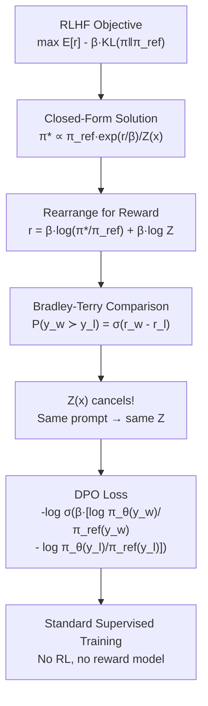

# DPO and Alternatives — Interview Deep Dive

> **What this file covers**
> - 🎯 DPO derivation: from RLHF objective to closed-form loss
> - 🧮 Full DPO loss with implicit reward and worked example
> - ⚠️ 3 failure modes: offline-only limitation, β sensitivity, reference model quality
> - 📊 DPO vs PPO: compute, memory, and quality comparison
> - 💡 Alternatives landscape: RLAIF, Constitutional AI, KTO, ORPO, IPO
> - 🏭 When to choose DPO vs PPO in production

---

## Brief restatement

DPO (Direct Preference Optimization) derives a closed-form solution to the RLHF objective and converts it into a supervised loss function that can be trained directly on preference data. The key insight: the optimal policy under KL-constrained reward maximization has the form π*(y|x) ∝ π_ref(y|x)·exp(r(x,y)/β). By rearranging, we can express the reward in terms of log-probability ratios. When comparing pairs, the intractable partition function Z(x) cancels out, yielding a simple binary cross-entropy loss.

---

## Full mathematical treatment

### 🧮 Step 1: The RLHF objective

> **Words:** RLHF maximizes expected reward while staying close to the reference model. This is a KL-constrained optimization problem.

> **Formula:**
>
>     max_π  E_{x~D, y~π(·|x)}[ r(x, y) ] - β · KL(π(·|x) ‖ π_ref(·|x))
>
>     Expanding KL:
>     max_π  E_{x,y}[ r(x, y) - β · log(π(y|x) / π_ref(y|x)) ]

### 🧮 Step 2: The closed-form optimal policy

> **Words:** This optimization problem has an analytical solution. The optimal policy increases the probability of each response in proportion to its reward, anchored to the reference model.

> **Formula:**
>
>     π*(y|x) = π_ref(y|x) · exp(r(x,y) / β) / Z(x)
>
>     where Z(x) = Σ_y π_ref(y|x) · exp(r(x,y) / β)   (partition function)
>
> — Z(x) normalizes so probabilities sum to 1
> — Higher reward → exponentially higher probability relative to reference

> **Worked example:** Two possible responses with β = 0.5:
> - Response A: π_ref = 0.3, r = 2.0 → π_ref·exp(r/β) = 0.3·exp(4) = 16.38
> - Response B: π_ref = 0.7, r = 0.5 → π_ref·exp(r/β) = 0.7·exp(1) = 1.90
> - Z = 16.38 + 1.90 = 18.28
> - π*(A) = 16.38/18.28 = 0.896, π*(B) = 1.90/18.28 = 0.104
>
> Despite response B being more likely under the reference (0.7 vs 0.3), the optimal policy strongly prefers A because of its higher reward.

### 🧮 Step 3: Recovering reward from the optimal policy

> **Words:** If we know the optimal policy, we can work backwards to express the reward in terms of log-probability ratios. The key insight is that the intractable Z(x) becomes a constant that does not depend on the response.

> **Formula:**
>
>     Taking log of both sides of π*(y|x) = π_ref(y|x)·exp(r(x,y)/β) / Z(x):
>
>     log π*(y|x) = log π_ref(y|x) + r(x,y)/β - log Z(x)
>
>     Rearranging:
>     r(x, y) = β · log(π*(y|x) / π_ref(y|x)) + β · log Z(x)

### 🧮 Step 4: The DPO loss (the cancellation trick)

> **Words:** When we compare two responses using the Bradley-Terry model, the Z(x) terms cancel out. Both responses have the same prompt x, so they share the same Z(x). This eliminates the intractable partition function.

> **Formula:**
>
>     P(y_w ≻ y_l | x) = σ(r(x, y_w) - r(x, y_l))
>
>     Substituting the reward expression:
>     = σ(β · [log(π*(y_w|x)/π_ref(y_w|x)) - log(π*(y_l|x)/π_ref(y_l|x))])
>
>     The β·log Z(x) terms cancel!
>
>     DPO Loss:
>     L_DPO = -E_{(x, y_w, y_l)}[ log σ(β · (log π_θ(y_w|x)/π_ref(y_w|x) - log π_θ(y_l|x)/π_ref(y_l|x))) ]

> **Worked example:** Given prompt x, preferred response y_w, rejected response y_l:
> - Policy log probs: log π_θ(y_w|x) = -45.2, log π_θ(y_l|x) = -52.1
> - Reference log probs: log π_ref(y_w|x) = -47.0, log π_ref(y_l|x) = -50.3
> - Log ratio for y_w: -45.2 - (-47.0) = 1.8 (policy increased probability vs reference)
> - Log ratio for y_l: -52.1 - (-50.3) = -1.8 (policy decreased probability vs reference)
> - Margin: β·(1.8 - (-1.8)) = 0.1 × 3.6 = 0.36
> - σ(0.36) = 0.589
> - Loss = -log(0.589) = 0.529
>
> The policy is correctly increasing the preferred and decreasing the rejected, but not yet by enough. Training will push the margin wider.

### 🧮 Implicit reward in DPO

> **Words:** DPO does not train a separate reward model, but it defines an implicit reward through the log-probability ratios. This implicit reward can be computed after training to verify alignment.

> **Formula:**
>
>     r_implicit(x, y) = β · log(π_θ(y|x) / π_ref(y|x))
>
> — This is the reward the trained policy "thinks" the response deserves
> — Higher log ratio = higher implicit reward
> — Can be used to monitor training (chosen rewards should exceed rejected rewards)

---

## 🗺️ Concept diagram

---

## ⚠️ Failure modes and edge cases

### 1. Offline-only limitation

**What happens:** DPO trains on a fixed dataset of preferences. It cannot generate new responses, collect feedback on them, and improve iteratively. If the preference dataset does not cover some types of prompts or responses, DPO cannot learn about them.

**When it occurs:** When the task distribution is broad (general assistant) and the preference data is narrow (only covers certain topics). Or when the model needs to improve beyond the quality ceiling of the preference data.

**Detection:** The model performs well on prompts similar to the training data but poorly on out-of-distribution prompts. Evaluation shows no improvement after the first epoch of training, even though loss continues to decrease (overfitting to the training distribution).

**Fix:** Collect preference data that covers the full distribution of expected prompts. Use rejection sampling: generate multiple responses with the current model, have humans rank them, and add these to the DPO training set. If iterative improvement is needed, switch to RLHF PPO.

### 2. β sensitivity

**What happens:** DPO performance is sensitive to the choice of β. Too low β → the model overfits to preferences and degenerates (repeating high-reward patterns). Too high β → the model barely changes from the reference (underfitting to preferences).

**When it occurs:** β interacts with learning rate, data quality, and model size in non-obvious ways. A β that works for a 7B model may fail for a 70B model. A β that works for high-quality preference data may be too aggressive for noisy data.

**Detection:** With too-low β: loss drops quickly but validation accuracy peaks and then drops (overfitting). Response diversity collapses. With too-high β: loss barely decreases. Implicit reward margin (chosen - rejected) stays near 0.

**Fix:** Start with β = 0.1 as default. Grid search over {0.05, 0.1, 0.2, 0.5}. Monitor implicit reward margins and response diversity. For noisy data, use higher β (0.2-0.5). For clean data, lower β (0.05-0.1) works.

### 3. Reference model quality

**What happens:** DPO's log ratio π_θ/π_ref is relative to the reference model. If the reference (SFT) model is poor, the DPO-trained model is also poor — it can only be incrementally better than the reference, not fundamentally different.

**When it occurs:** When SFT was done on low-quality demonstration data, or when the base model is too small for the task. The reference model defines the starting point, and DPO cannot overcome a bad starting point by much.

**Detection:** Even after DPO training, the model makes basic errors that should have been caught during SFT. The implicit rewards are high (large log ratios), but the actual response quality is still poor.

**Fix:** Invest more in SFT quality before DPO. Use better demonstration data, more epochs, or a larger model. DPO is an alignment technique, not a capability technique — it cannot teach the model things it never learned.

---

## 📊 Complexity analysis

| | DPO | RLHF (PPO) |
|---|---|---|
| **Models in memory** | 2 (policy + reference) | 4 (policy + reference + RM + value head) |
| **Memory (7B, LoRA)** | ~28 GB | ~42 GB |
| **Training stability** | Very stable (supervised) | Can be unstable (RL) |
| **Time per iteration** | ~1× (standard forward/backward) | ~4× (generation + scoring + PPO) |
| **Data efficiency** | Every comparison used directly | Each comparison used indirectly through RM |
| **Hyperparameters** | β, lr (2 main) | β, lr, clip_range, n_epochs, GAE λ (5+ main) |

**Training time comparison (7B model, 50K preference pairs):**
- DPO: ~2-4 GPU-hours on 1 A100
- RLHF PPO: ~12-24 GPU-hours on 2 A100s

---

## 💡 Design trade-offs: the alternatives landscape

| Method | Key innovation | Data format | Models needed | Online? |
|---|---|---|---|---|
| **RLHF (PPO)** | RL optimization with reward model | Comparisons → RM → PPO | 4 | Yes |
| **DPO** | Direct optimization via closed form | Comparisons → supervised loss | 2 | No |
| **IPO** | Fixes DPO's distribution mismatch | Same as DPO | 2 | No |
| **KTO** | Works with unpaired binary feedback | Thumbs up/down per response | 2 | No |
| **ORPO** | Combines SFT and preference in one loss | Instruction + preference data | 1 | No |
| **RLAIF** | AI generates preferences | AI-labeled comparisons | 2 (+ judge model) | Possible |
| **Constitutional AI** | Self-critique with principles | Constitution + self-generated | 1 | Yes |

### IPO (Identity Preference Optimization)

IPO fixes a theoretical issue with DPO: DPO's loss assumes the Bradley-Terry model is exactly correct, but real preferences are noisy. IPO adds a regularization term that makes training more robust to label noise. In practice, the improvement over DPO is small (1-2% on benchmarks).

### KTO (Kahneman-Tversky Optimization)

KTO works with unpaired feedback: just "this response is good" or "this response is bad," without matched pairs. This makes data collection much easier — you do not need to generate two responses to the same prompt. Based on prospect theory from economics, it weights losses more heavily than gains, matching human loss aversion.

### ORPO (Odds Ratio Preference Optimization)

ORPO combines SFT and preference alignment into a single training step. It does not need a reference model at all — it uses an odds ratio to distinguish preferred from rejected responses within the same training loss. Even simpler than DPO, with comparable results.

---

## 🏭 Production and scaling considerations

**When to choose DPO:** Most projects should start with DPO. It is simpler, faster, more stable, and requires less memory. It works well when you have 10K-100K high-quality preference pairs and do not need iterative improvement. Companies like Meta (Llama 2) and Mistral have used DPO-style training successfully.

**When to choose PPO:** When you need online learning (generate → feedback → improve cycles), when you have a complex reward function (combining multiple objectives), or when you are doing frontier research and need maximum control. OpenAI's ChatGPT and Anthropic's Claude use PPO-based RLHF.

**Hybrid approaches:** Some teams use DPO for initial alignment and then switch to PPO for iterative refinement. This combines DPO's simplicity for the first pass with PPO's online capability for continued improvement.

**Trend:** The field is moving toward simpler methods. DPO replaced PPO for many use cases. ORPO may replace DPO for some. Each generation of techniques reduces the engineering complexity while maintaining or improving quality.

---

## Staff/Principal Interview Depth

### Q1: Walk me through the DPO derivation. Why does Z(x) cancel out?

---

**No Hire**
*Interviewee:* "DPO skips the reward model. You just train on preferences directly."
*Interviewer:* Cannot explain the derivation or why the reward model can be skipped.
*Criteria — Met:* none / *Missing:* closed-form solution, Z(x) cancellation, mathematical derivation

**Weak Hire**
*Interviewee:* "The RLHF objective has a closed-form optimal policy. DPO rearranges it to express the reward in terms of log probability ratios. When comparing two responses, some terms cancel and you get a supervised loss."
*Interviewer:* Correct high-level description. Cannot specify what cancels or write the derivation steps.
*Criteria — Met:* high-level description / *Missing:* formulas, Z(x) specifics, worked example

**Hire**
*Interviewee:* "Start with the RLHF objective: max E[r(x,y)] - β·KL(π‖π_ref). The optimal policy is π*(y|x) = π_ref(y|x)·exp(r(x,y)/β)/Z(x), where Z(x) is the partition function Σ_y π_ref·exp(r/β). Taking log and rearranging: r(x,y) = β·log(π*/π_ref) + β·log Z(x). Now substitute into Bradley-Terry: P(y_w > y_l) = σ(r_w - r_l) = σ(β·[log(π*(y_w)/π_ref(y_w)) + log Z(x) - log(π*(y_l)/π_ref(y_l)) - log Z(x)]). The β·log Z(x) terms cancel because both responses share the same prompt. What remains is: σ(β·[log(π_θ(y_w)/π_ref(y_w)) - log(π_θ(y_l)/π_ref(y_l))]). This is the DPO loss — just supervised learning with a special loss function."
*Interviewer:* Complete derivation with the Z(x) cancellation clearly shown. Would be elevated by discussing what assumptions this derivation makes and when they fail.
*Criteria — Met:* full derivation, Z(x) cancellation / *Missing:* assumptions, limitations

**Strong Hire**
*Interviewee:* "The derivation has four steps. [Same derivation as Hire, plus:] The key assumption is that the Bradley-Terry model is correct: preferences are noisy observations of a latent utility, and the probability of preferring y_w over y_l depends only on the reward difference. This assumption fails when: (1) Preferences are intransitive (A > B, B > C, but C > A). (2) Context matters beyond the prompt (annotator mood, fatigue). (3) The preference strength varies (sometimes A is much better, sometimes slightly better, but both count as one comparison). IPO addresses (3) by adding a regularization term that does not assume perfect Bradley-Terry calibration. The other subtle point: DPO replaces π* (the unknown optimal policy) with π_θ (the policy being trained). This means DPO is doing optimization by gradient descent toward the optimum, not computing the optimum directly. The fixed point of DPO training is the optimal policy under the KL-constrained objective, but finite training may not reach it — especially with limited data or early stopping."
*Interviewer:* Complete derivation plus identification of three assumptions, connection to IPO, and the subtle point about optimization vs computation. Demonstrates research-level understanding of the method's limitations.
*Criteria — Met:* all

---

### Q2: When would you choose RLHF (PPO) over DPO, despite DPO's simplicity?

---

**No Hire**
*Interviewee:* "DPO is always better because it is simpler."
*Interviewer:* Does not understand that PPO has genuine advantages in specific scenarios.
*Criteria — Met:* none / *Missing:* online learning, reward shaping, iterative improvement

**Weak Hire**
*Interviewee:* "Use PPO when you need online learning — generating and improving iteratively. DPO is offline only."
*Interviewer:* Correct but gives only one reason. Missing the broader landscape of PPO advantages.
*Criteria — Met:* online learning / *Missing:* reward shaping, multi-objective, ceiling effect

**Hire**
*Interviewee:* "Three scenarios where PPO beats DPO: (1) Online learning — PPO can generate new responses, score them, and improve iteratively. DPO can only learn from existing data. For frontier models that need continuous improvement, PPO enables a generate-feedback-retrain loop. (2) Reward shaping — PPO can use any reward function, including non-preference-based signals like code execution results, factual accuracy checks, or safety classifiers. DPO is limited to pairwise preferences. (3) Multi-objective optimization — PPO can combine multiple reward signals (helpfulness, safety, honesty) with different weights. DPO optimizes a single implicit objective derived from the preference data."
*Interviewer:* Three strong reasons with concrete examples. Would be elevated by discussing the quality ceiling of DPO and production-level hybrid approaches.
*Criteria — Met:* three scenarios / *Missing:* quality ceiling, hybrid approaches

**Strong Hire**
*Interviewee:* "I would choose PPO in four scenarios, and DPO as the default otherwise. (1) Online improvement loop: PPO generates new responses that may be better than anything in the preference dataset. DPO is bounded by the quality ceiling of its training data — the best it can do is consistently prefer the 'chosen' response, but if both chosen and rejected are mediocre, the aligned model will also be mediocre. PPO can explore beyond this ceiling because the RM scores novel responses. (2) Compositional reward: code correctness (run the code and check), factual accuracy (look up the answer), safety classification (run a toxicity filter) — these are not preference-based but can be combined with RM scores as reward shaping terms in PPO. (3) Distributional mismatch: after DPO training, the policy generates different text than what is in the training data. Since DPO never sees these responses, it cannot correct mistakes the model makes on its own outputs. PPO does see its own outputs and can self-correct. (4) Very long training: DPO overfits after 1-3 epochs on most datasets. PPO can run indefinitely as long as the RM generalizes. In practice, I would start with DPO, evaluate, and switch to PPO only if (a) the quality ceiling is hit or (b) compositional rewards are needed. Hybrid approach: use DPO for initial alignment, then PPO with a retrained RM on DPO outputs for refinement."
*Interviewer:* Four distinct scenarios with clear reasoning, understands the quality ceiling concept, proposes a concrete hybrid approach, and correctly positions DPO as the default. Staff-level judgment.
*Criteria — Met:* all

---

### Q3: What is KTO and when would you use it instead of DPO?

---

**No Hire**
*Interviewee:* "I have not heard of KTO."
*Interviewer:* Lack of awareness of alternatives to DPO.
*Criteria — Met:* none / *Missing:* KTO mechanism, unpaired feedback, use case

**Weak Hire**
*Interviewee:* "KTO works with unpaired feedback — just thumbs up or thumbs down on individual responses, without needing matched pairs. It is useful when collecting paired data is expensive."
*Interviewer:* Correct description. Missing the mechanism, the connection to prospect theory, and practical trade-offs.
*Criteria — Met:* unpaired feedback / *Missing:* mechanism, trade-offs, when DPO is still better

**Hire**
*Interviewee:* "KTO (Kahneman-Tversky Optimization) is based on prospect theory from behavioral economics. It works with binary feedback per response (good/bad) rather than pairwise comparisons (A vs B). The loss function weights negative feedback more heavily than positive, matching human loss aversion: people care more about avoiding bad responses than generating great ones. Use KTO when: (1) Paired data is unavailable — you have thumbs up/down ratings but not A-vs-B comparisons. (2) Data collection is distributed — individual raters see one response, not two. (3) You want to optimize for minimum quality rather than maximum quality. Keep DPO when you have paired data, because paired data provides a stronger training signal — it tells the model not just what is good, but what is better than what."
*Interviewer:* Good understanding of mechanism, three use cases, and correctly notes DPO's advantage with paired data. Would be elevated by discussing the mathematical connection and practical results.
*Criteria — Met:* mechanism, use cases, DPO comparison / *Missing:* mathematical details, empirical results

**Strong Hire**
*Interviewee:* "KTO replaces DPO's pairwise Bradley-Terry assumption with a utility model inspired by Kahneman and Tversky's prospect theory. In prospect theory, the value function is concave for gains and convex for losses, with losses weighted λ ≈ 2× more than gains. KTO's loss separates desirable responses (push log ratio up) from undesirable ones (push log ratio down), with the loss-aversion weighting making the model more sensitive to bad outputs. Mathematically, it still uses log π_θ/π_ref but does not require matched pairs — just individual (x, y, good/bad) labels. Empirically, KTO matches DPO performance when data is abundant (50K+ labels) and beats DPO when paired data is scarce or noisy. The key trade-off: DPO provides a sharper gradient because each comparison says 'A is better than B at this exact prompt.' KTO provides a softer signal: 'this response is generally good' without a direct comparison. In production, I would use KTO when: (a) data comes from user feedback (like/dislike buttons), which is naturally unpaired, or (b) when the cost of generating paired responses is prohibitive. I would use DPO when I can generate pairs from the same model at the same prompt, which is the standard setup for offline alignment."
*Interviewer:* Connects to prospect theory mathematically, understands loss-aversion weighting, compares empirical performance quantitatively, and gives concrete production guidance. Research-level knowledge of the alternatives landscape.
*Criteria — Met:* all

---

## Key Takeaways

🎯 1. DPO derives from the same objective as RLHF but eliminates the reward model and PPO loop. The partition function Z(x) cancels in pairwise comparisons.
   2. DPO loss = -log σ(β · [log π_θ(y_w)/π_ref(y_w) - log π_θ(y_l)/π_ref(y_l)]). This is supervised learning with a special loss.
🎯 3. DPO is the recommended default for most alignment projects. 2× simpler, 4-6× faster, comparable quality to PPO.
⚠️ 4. DPO is offline-only — it cannot improve beyond the quality ceiling of its training data. Switch to PPO when iterative improvement is needed.
   5. β = 0.1 is a good default. Too low → overfitting. Too high → underfitting. Grid search {0.05, 0.1, 0.2, 0.5}.
   6. KTO works with unpaired (thumbs up/down) data. ORPO combines SFT and alignment. The trend is toward simpler methods.
   7. Hybrid approach: start with DPO, evaluate, switch to PPO only if the quality ceiling is hit or compositional rewards are needed.
