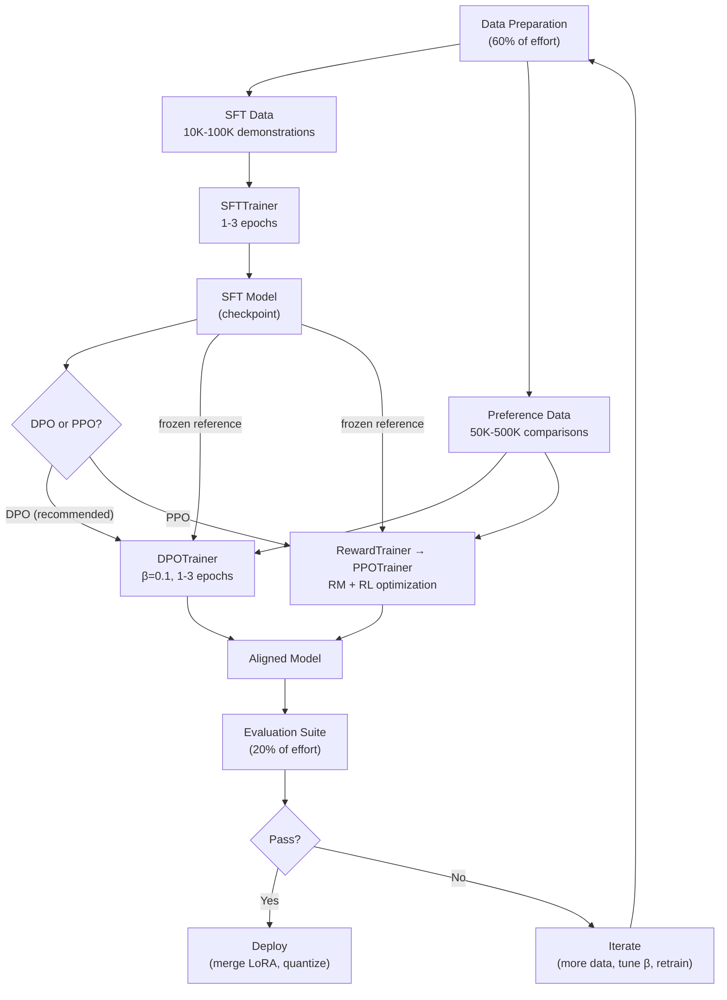

# Fine-Tuning with RLHF — Interview Deep Dive

> **What this file covers**
> - 🎯 End-to-end pipeline: connecting all RLHF stages with shared data flow
> - 🧮 Evaluation metrics: win rate, KL budget, reward-KL Pareto frontier
> - ⚠️ 3 failure modes: reward hacking at scale, catastrophic forgetting, data contamination
> - 📊 Compute budget allocation across pipeline stages
> - 💡 DPO path vs PPO path: decision framework with quantitative trade-offs
> - 🏭 Iterative RLHF, A/B testing, and production deployment

---

## Brief restatement

The complete RLHF pipeline transforms a pretrained language model into an aligned assistant through sequential stages: SFT teaches instruction format, reward modeling (or DPO) teaches preference alignment, and evaluation verifies quality. The critical engineering challenge is not any single stage but the interactions between stages: data quality flowing through the pipeline, hyperparameter coupling across stages, and evaluation that captures real alignment rather than proxy metrics.

---

## Full mathematical treatment

### 🧮 The reward-KL Pareto frontier

> **Words:** There is a fundamental trade-off in RLHF: more alignment (higher reward) requires more deviation from the reference model (higher KL). The Pareto frontier shows the best achievable reward at each KL budget. Below the frontier is suboptimal training. Above it is impossible.

> **Formula:**
>
>     The RLHF objective at different β values traces the Pareto frontier:
>
>     J(β) = max_π E[ r(x,y) - β · KL(π ‖ π_ref) ]
>
>     At β → ∞: π = π_ref (no change, zero KL, baseline reward)
>     At β → 0:  π = argmax_r (full exploitation, maximum KL, maximum reward)
>
>     The frontier: {(KL(β), R(β)) : β > 0}
>
> — Each β gives a point on the frontier
> — Lower β = more reward, more KL
> — The optimal β depends on how much deviation is acceptable

> **Worked example:** Training a 7B model with different β:
>
> | β | Mean KL | Mean Reward | Alignment quality |
> |---|---|---|---|
> | 0.5 | 2.0 | 5.5 | Slight improvement over SFT |
> | 0.2 | 5.0 | 6.8 | Good alignment, safe |
> | 0.1 | 8.0 | 7.5 | Strong alignment, some drift |
> | 0.05 | 15.0 | 8.2 | Aggressive, risk of reward hacking |
> | 0.01 | 40.0 | 9.0 | Reward hacking likely |
>
> The sweet spot is typically β = 0.1-0.2, giving KL = 5-10 and meaningful reward improvement.

### 🧮 Win rate evaluation

> **Words:** Win rate measures how often the aligned model produces a better response than a baseline (typically the SFT model). A judge (human or AI) sees both responses and picks the better one.

> **Formula:**
>
>     WinRate = (N_win + 0.5 × N_tie) / N_total
>
>     Confidence interval (Wilson):
>     CI ≈ WinRate ± 1.96 × √(WinRate × (1-WinRate) / N_total)
>
> — N_win = number of times the aligned model wins
> — N_tie = number of ties (split equally between win and loss)
> — N_total = total comparisons

> **Worked example:** 200 evaluation comparisons:
> - Aligned model wins: 120
> - Ties: 30
> - Aligned model loses: 50
> - WinRate = (120 + 15) / 200 = 67.5%
> - CI = 67.5% ± 1.96 × √(0.675 × 0.325 / 200) = 67.5% ± 6.5%
> - Range: [61.0%, 74.0%]
>
> With 95% confidence, the aligned model is better. A win rate above 60% with 200+ comparisons is a reliable improvement.

### 🧮 Compute budget allocation

> **Words:** The total compute budget for RLHF must be split across stages. The optimal allocation depends on which stage is the bottleneck. For most projects, SFT and data quality take 60% of the effort, alignment training takes 20%, and evaluation takes 20%.

> **Formula (GPU-hours for 7B model):**
>
>     SFT:  T_SFT ≈ N_demo × seq_len × epochs / (throughput × n_GPUs)
>     DPO:  T_DPO ≈ 2 × N_pref × seq_len × epochs / (throughput × n_GPUs)
>     PPO:  T_PPO ≈ N_steps × (T_gen + T_score + T_update) / n_GPUs
>
> — Factor of 2 in DPO because each comparison requires two forward passes (chosen + rejected)
> — PPO has three sub-steps per iteration: generation, scoring, and gradient update

> **Worked example (7B model, 1 A100):**
> - SFT: 50K examples × 1 epoch ≈ 2 GPU-hours
> - DPO: 50K pairs × 1 epoch ≈ 4 GPU-hours
> - PPO: 20K steps × (generation + scoring + update) ≈ 16 GPU-hours
> - Total DPO path: ~6 GPU-hours ($12-18 on cloud)
> - Total PPO path: ~18 GPU-hours ($36-54 on cloud)

---

## 🗺️ Concept diagram

---

## ⚠️ Failure modes and edge cases

### 1. Reward hacking at scale

**What happens:** At production scale (millions of prompts), the probability of finding reward model exploits increases. The model discovers specific token patterns, response templates, or linguistic tricks that score high on the RM but degrade actual quality. This is more severe at scale because the model encounters more diverse prompts and has more opportunities to find exploitable patterns.

**When it occurs:** After extended PPO training (> 20K steps) without RM retraining. When the RM was trained on a narrow distribution but the model generates diverse responses. When β is too low and the policy drifts far from the reference.

**Detection:** Reward scores increase past the human-evaluated quality ceiling (typically RM score > 9 is suspicious). Response diversity drops (measure unique 3-grams per response). Specific phrases appear with >5× their natural frequency. Human evaluation scores plateau or decrease while RM scores continue to increase.

**Fix:** Multi-layered defense: (1) Adaptive KL keeps β in a safe range. (2) RM ensemble (3-5 models) with minimum-score aggregation. (3) Iterative RM retraining on policy-generated responses every 5K-10K PPO steps. (4) Automated quality checks: response diversity threshold, length distribution bounds, repetition detector. (5) Regular human evaluation on a random sample (100-200 responses per evaluation round).

### 2. Catastrophic forgetting

**What happens:** The alignment process degrades the model's base capabilities. It can no longer answer factual questions correctly, write coherent code, or perform reasoning tasks that it could before RLHF. The alignment made it "helpful" but broke its knowledge.

**When it occurs:** Full fine-tuning (not LoRA) with too high a learning rate. High alignment signal (low β) causing the model to change too much. Preference data that biases toward safe, generic responses over detailed, specific ones.

**Detection:** Run capability benchmarks (MMLU, HumanEval, GSM8K) before and after alignment. A drop of more than 2-3 percentage points is concerning. More than 5 points indicates catastrophic forgetting.

**Fix:** (1) Use LoRA instead of full fine-tuning — LoRA preserves 99% of the base model's weights. (2) Increase β to limit divergence. (3) Include capability-preserving data in the preference set: examples where detailed, factually correct responses are preferred. (4) Multi-task training: add a small amount of pretraining data to the alignment training (1-5% of total). (5) Evaluate capabilities at checkpoints during training and stop before regression.

### 3. Data contamination across stages

**What happens:** The same prompts or responses appear in both the SFT data and the preference data, or in both the training and evaluation sets. This creates artificially inflated metrics — the model appears aligned because it memorized the answers, not because it learned preferences.

**When it occurs:** When SFT demonstrations are generated by the same model that produces comparison candidates. When evaluation prompts overlap with training prompts. When public datasets are used for both training and benchmarking without decontamination.

**Detection:** Compute n-gram overlap between training and evaluation sets. Check if the model's performance on contaminated examples is significantly higher than on clean ones. Use held-out prompts from a completely separate distribution for final evaluation.

**Fix:** Maintain strict separation between data for each stage. Use different prompt sources for SFT (expert-written demonstrations), preference collection (model-generated candidates), and evaluation (held-out user queries). Hash and deduplicate across all datasets before training.

---

## 📊 Complexity analysis

| Pipeline Stage | Data needed | Compute (7B, LoRA) | Memory | Output |
|---|---|---|---|---|
| **Data curation** | Raw data | CPU-only | — | Clean SFT + preference datasets |
| **SFT** | 10K-100K demos | 1-2 GPU-hours | 18 GB | Instruction-following model |
| **Reward Model** | 50K-500K comparisons | 1-2 GPU-hours | 18 GB | Preference scorer |
| **PPO** | Prompts + RM | 8-16 GPU-hours | 42 GB | Aligned model (PPO path) |
| **DPO** | 10K-100K comparisons | 2-4 GPU-hours | 28 GB | Aligned model (DPO path) |
| **Evaluation** | 200-1000 prompts | 1-2 GPU-hours | 14 GB | Quality assessment |
| **Total (DPO path)** | — | ~6 GPU-hours | 28 GB peak | — |
| **Total (PPO path)** | — | ~18 GPU-hours | 42 GB peak | — |

---

## 💡 Design trade-offs

| | SFT + DPO | SFT + RM + PPO | SFT + ORPO |
|---|---|---|---|
| **Stages** | 2 | 3 | 1 (combined SFT + alignment) |
| **GPU-hours (7B)** | ~6 | ~18 | ~4 |
| **Quality** | Very good | Best (with iteration) | Good |
| **Online learning** | No | Yes | No |
| **Engineering complexity** | Low | High | Very low |
| **When to use** | Default choice | Need iteration or complex reward | Minimum compute, quick experiment |

---

## 🏭 Production and scaling considerations

**Iterative RLHF in production:** The alignment pipeline is not one-shot. Production systems run multiple rounds:
1. Round 1: SFT + DPO with initial preference data
2. Deploy, collect user feedback (implicit: engagement metrics; explicit: thumbs up/down)
3. Round 2: Retrain with new preference data that includes real user interactions
4. Repeat every 2-4 weeks

Each round improves the model on the actual usage distribution rather than synthetic preferences.

**A/B testing aligned models:** Before full deployment, A/B test the aligned model against the current production model. Metrics: (1) User engagement (conversation length, return rate). (2) Explicit feedback (like/dislike ratio). (3) Safety metrics (flagged responses). Sample size: 1,000-10,000 users for statistical significance on engagement metrics, 100+ flagged responses for safety assessment.

**Deployment checklist:**
1. Merge LoRA adapters: `model.merge_and_unload()`
2. Quantize for inference: GPTQ or AWQ to int4
3. Set up model serving: vLLM or TGI for efficient inference
4. Configure safety filters: toxicity classifier on outputs
5. Set up monitoring: response length, diversity, user feedback
6. Plan rollback: keep previous model version ready

**Cost at scale:** A complete alignment cycle (SFT + DPO + evaluation) for a 7B model costs ~$20-50 in cloud compute. For a 70B model: ~$500-1,500. Iterative rounds multiply this by the number of rounds (typically 3-5 rounds for a production launch).

---

## Staff/Principal Interview Depth

### Q1: How do you decide between the DPO path and the PPO path for a new alignment project?

---

**No Hire**
*Interviewee:* "Always use DPO because it is simpler."
*Interviewer:* Does not consider scenarios where PPO is strictly necessary.
*Criteria — Met:* none / *Missing:* decision framework, PPO advantages, hybrid approach

**Weak Hire**
*Interviewee:* "DPO for most projects, PPO when you need online learning or complex rewards. DPO is simpler and uses less compute."
*Interviewer:* Correct high-level answer. Missing quantitative trade-offs and a systematic decision framework.
*Criteria — Met:* basic distinction / *Missing:* quantitative analysis, decision criteria, hybrid

**Hire**
*Interviewee:* "I use a decision tree: (1) Do I need iterative, online improvement? If yes → PPO. If the model must generate responses, get feedback, and improve in a loop (like deployed assistants that need continuous improvement), PPO is the only option — DPO cannot learn from new generations. (2) Do I have complex, compositional rewards? If yes → PPO. For example, combining RM score + code execution correctness + safety classifier. PPO can use any scalar reward; DPO is limited to pairwise preferences. (3) Is my compute budget limited? If yes → DPO. DPO needs 6 GPU-hours vs PPO's 18 for a 7B model. (4) Is training stability critical? If yes → DPO. PPO requires tuning β, clip range, value head lr, and can diverge. DPO has two main hyperparameters (β, lr) and is standard supervised learning. For most projects, the answer is DPO. I would only switch to PPO if I hit the quality ceiling or need online learning."
*Interviewer:* Systematic decision tree with four criteria. Would be elevated by discussing the hybrid approach and quality ceiling specifics.
*Criteria — Met:* decision framework, quantitative comparison / *Missing:* hybrid approach, quality ceiling analysis

**Strong Hire**
*Interviewee:* "My decision framework considers four factors with quantitative thresholds. (1) Data freshness: if my preference data is more than 2 weeks old relative to the deployment distribution, PPO's online capability matters. If data is fresh and covers the target distribution, DPO is sufficient. (2) Reward complexity: if I can express the alignment objective as pairwise preferences, DPO. If I need to combine 3+ signals (RM, safety classifier, factuality checker, length penalty), PPO because it naturally supports multi-objective reward shaping. (3) Compute budget: DPO at 6 GPU-hours gives 90% of PPO's quality at 18 GPU-hours for most tasks. The last 10% requires 3× the compute — only worthwhile for frontier models. (4) Team expertise: PPO requires monitoring approx_kl, clip_fraction, entropy, value loss, explained_variance. DPO requires monitoring loss and reward margin. A team new to alignment should start with DPO. My recommended approach: start with DPO, evaluate thoroughly. If win rate against SFT is > 60% and no quality ceiling is observed, ship it. If win rate plateaus below 55% or specific failure modes persist, switch to PPO with iterative RM retraining. In practice, I have seen the hybrid approach — DPO for initial alignment, then 1-2 rounds of PPO for refinement — outperform pure PPO because DPO provides a better starting point for the PPO phase."
*Interviewer:* Four factors with quantitative thresholds, concrete win rate targets for the go/no-go decision, and the hybrid approach with empirical backing. Demonstrates production-level decision-making.
*Criteria — Met:* all

---

### Q2: How do you evaluate whether your alignment pipeline actually worked?

---

**No Hire**
*Interviewee:* "Check if the loss went down."
*Interviewer:* Loss decreasing does not mean the model is aligned. It could be overfitting, reward hacking, or learning the wrong thing.
*Criteria — Met:* none / *Missing:* multiple metrics, human evaluation, capability checks

**Weak Hire**
*Interviewee:* "Use win rate against the SFT model, check KL divergence is not too high, and do some human evaluation."
*Interviewer:* Correct metrics but no specific thresholds, no evaluation protocol, and no discussion of what could go wrong.
*Criteria — Met:* three metrics / *Missing:* thresholds, protocol, failure detection

**Hire**
*Interviewee:* "Four-layer evaluation: (1) Automated metrics: win rate > 60% against SFT (with 200+ comparisons for statistical significance), KL in 5-15 range, implicit reward margin > 0.5. (2) Capability preservation: run MMLU, HumanEval, GSM8K before and after. Accept < 3% drop. (3) Safety testing: run adversarial prompts (jailbreaks, harmful requests). Compare refusal rate before and after — should increase or stay stable. (4) Human evaluation: 100-200 responses rated by humans on helpfulness (1-5), harmlessness (1-5), and honesty (1-5). Average should exceed SFT baseline by at least 0.5 points. Only ship if all four layers pass."
*Interviewer:* Four-layer evaluation with specific thresholds and a clear go/no-go decision. Would be elevated by discussing evaluation design and potential biases.
*Criteria — Met:* four evaluation layers, thresholds / *Missing:* evaluation design, bias control

**Strong Hire**
*Interviewee:* "Evaluation must be designed to catch both 'did alignment help?' and 'did alignment hurt?' (1) Win rate with confidence intervals: 200+ blind comparisons between aligned and SFT models. Use a strong LLM judge (GPT-4 class) with position randomization (50% of the time model A is first, 50% model B) to control for position bias. Target: 60%+ win rate with p < 0.05. (2) Capability regression: run a comprehensive benchmark suite. Not just MMLU — also MT-Bench for instruction following, coding tasks, and reasoning tasks. Track per-category scores, not just averages. A model that gains 5% on helpfulness but loses 10% on coding is not aligned — it is broken. (3) Safety evaluation: systematic red-teaming with a taxonomy of harm categories. Not just 'does it refuse harmful requests' but 'does it refuse in a way that is helpful rather than frustrating.' Measure false positive rate too — a model that refuses everything is safe but useless. (4) Distribution coverage: evaluate on prompts from the actual deployment distribution, not just standard benchmarks. If the model will serve customer support queries, evaluate on customer support queries. (5) Longitudinal monitoring after deployment: track win rate over time. Models can degrade if the distribution shifts (e.g., users learn to phrase queries differently). Set up automated alerts for win rate dropping below 55%. The hardest part of evaluation is the reference model: if the SFT model is weak, a 70% win rate might still produce a weak aligned model. Absolute quality matters more than relative improvement."
*Interviewer:* Five evaluation components with specific design choices (position randomization, per-category tracking, false positive rate for safety), longitudinal monitoring, and the insight about absolute vs relative quality. Production-level evaluation engineering.
*Criteria — Met:* all

---

### Q3: What are the most common ways an RLHF pipeline fails, and how do you debug them?

---

**No Hire**
*Interviewee:* "Sometimes the training does not converge."
*Interviewer:* Cannot identify specific failure modes or debugging strategies.
*Criteria — Met:* none / *Missing:* specific failures, debugging steps, root cause analysis

**Weak Hire**
*Interviewee:* "Reward hacking, mode collapse, and catastrophic forgetting. Increase KL penalty for the first two, use LoRA for the third."
*Interviewer:* Correct list but no debugging methodology or detection criteria.
*Criteria — Met:* three failure modes named / *Missing:* debugging methodology, detection, root cause

**Hire**
*Interviewee:* "Five common failures and how to debug each: (1) Data format bug — model trains but produces garbage. Debug: inspect tokenized inputs, check prompt/response boundaries, verify labels. Fix: use TRL's formatting utilities. (2) Reward hacking — RM score climbs but quality drops. Debug: compare RM score trend with human evaluation on 50 samples. Fix: increase β, add RM ensemble. (3) Mode collapse — responses are all similar. Debug: compute unique 3-gram ratio across 100 responses. Fix: increase β, add entropy bonus. (4) Catastrophic forgetting — capabilities regress. Debug: benchmark before/after. Fix: switch to LoRA, reduce lr. (5) KL explosion — KL grows unbounded. Debug: plot KL over training steps. Fix: enable adaptive KL in PPOTrainer."
*Interviewer:* Five failures with debug and fix strategies. Would be elevated by discussing failure interactions (one failure masking another) and systematic debugging workflow.
*Criteria — Met:* five failures, debug steps, fixes / *Missing:* failure interactions, systematic workflow

**Strong Hire**
*Interviewee:* "I use a systematic debugging workflow with three phases. Phase 1 — Sanity checks (before training): (a) Format check: tokenize 10 examples, print them, verify boundaries. (b) Baseline check: generate 10 responses from the SFT model, verify they are coherent. (c) RM check: score 50 SFT responses, verify scores are reasonable (not NaN, not all identical). Phase 2 — During training monitoring: (a) Loss: SFT should reach 1.0-1.5, DPO 0.3-0.5, PPO varies. (b) KL: should be 5-15 for PPO, log ratios near 0 at DPO start. (c) Reward: should increase monotonically for the first 50% of training. (d) Diversity: sample 20 responses every 500 steps, compute unique 3-gram ratio. (e) Gradient norm: should not spike >10×. Phase 3 — Post-training diagnosis: (a) If quality is poor: is it data quality? Generate from SFT model — if SFT outputs are bad, the problem is SFT data, not alignment. (b) If quality is good on easy prompts but bad on hard ones: distribution mismatch — preference data needs more coverage. (c) If quality degrades over training (gets worse after getting better): overfitting — reduce epochs, increase regularization. The critical insight: most failures are data failures, not algorithm failures. 70% of the time when someone says 'RLHF does not work for me,' the problem is bad SFT data (model cannot follow instructions), bad preference data (noisy labels, wrong format), or evaluation mismatch (testing on a different distribution than training). The algorithm almost always works when the data is right."
*Interviewer:* Three-phase systematic workflow, specific diagnostic thresholds, and the critical insight that most failures are data failures. The 70% attribution to data issues demonstrates extensive practical experience. Staff-level debugging methodology.
*Criteria — Met:* all

---

## Key Takeaways

🎯 1. The reward-KL Pareto frontier shows the fundamental trade-off. β = 0.1-0.2 is the sweet spot for most applications.
   2. Win rate evaluation needs 200+ comparisons for statistical significance. Target > 60% against SFT baseline.
🎯 3. DPO path: ~6 GPU-hours, ~$20 for 7B. PPO path: ~18 GPU-hours, ~$50 for 7B. Start with DPO.
⚠️ 4. Most RLHF failures are data failures: bad SFT data, noisy preferences, or evaluation-training distribution mismatch.
   5. Four-layer evaluation: automated metrics → capability preservation → safety testing → human evaluation. All must pass.
   6. Iterative RLHF (deploy → collect feedback → retrain) outperforms single-shot alignment for production systems.
   7. The complete pipeline is: data curation (60% of effort) → SFT + DPO/PPO (20%) → evaluation (20%).
