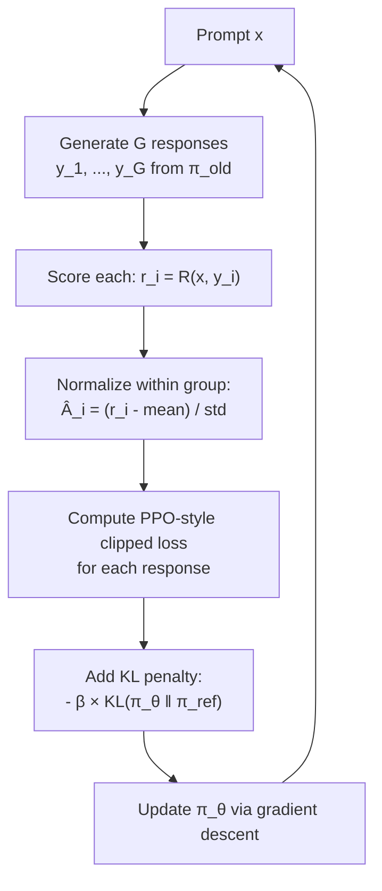

# GRPO — Interview Deep Dive

> **What this file covers**
> - 🎯 GRPO algorithm: group sampling, group-relative advantage, no critic
> - 🧮 Full GRPO objective with derivation, clipped update, and KL penalty
> - ⚠️ 4 failure modes: reward variance collapse, group size sensitivity, KL drift, reward hacking
> - 📊 Memory savings vs PPO: no value network, no GAE computation
> - 💡 GRPO vs PPO vs DPO vs REINFORCE: comparison table
> - 🏭 GRPO in practice: DeepSeek-R1, verifiable rewards, and scaling behavior

> **Math you will need for this file**
>
> | Symbol | Meaning |
> |--------|---------|
> | G | Group size — number of responses generated per prompt |
> | r_i | Reward for the i-th response in the group |
> | Â_i | Group-relative advantage for response i |
> | mean(r), std(r) | Mean and standard deviation of rewards in the group |
> | r_t(θ) = π_θ/π_old | Probability ratio (same as PPO) |
> | clip(r, 1-ε, 1+ε) | Clamp ratio to prevent large updates |
> | KL(π_θ \|\| π_ref) | Drift from reference model |
> | β | KL penalty coefficient |
>
> **RL concepts used here** (defined in earlier files):
> - **PPO clipped objective** — min(r×A, clip(r)×A) ([ppo-from-scratch-interview.md](../advanced-algorithms/ppo-from-scratch-interview.md))
> - **RLHF objective** — maximize reward while staying close to reference ([what-is-rlhf-interview.md](./what-is-rlhf-interview.md))
> - **Advantage A** — how much better an action is than average
> - [Full reference → math-refresher.md](../math-refresher.md)

---

## Brief restatement

GRPO (Group Relative Policy Optimization) generates multiple responses per prompt, computes rewards for each, and normalizes them within the group to get advantages. It uses PPO-style clipping to stabilize updates and a KL penalty to prevent drift from the reference model. The key simplification over PPO: no critic network is needed because the group statistics replace the value function baseline.

---

## 🧮 Full mathematical treatment

### The GRPO algorithm

**Step 1 — Words.** For each prompt, GRPO generates a group of G responses. It scores each one, then computes how each response compares to the group average. Responses above average get a positive advantage (reinforced). Responses below average get a negative advantage (discouraged). The policy is then updated using a PPO-style clipped objective.

**Step 2 — Formula.** For a prompt x, generate G responses {y_1, y_2, ..., y_G} from π_old:

```
1. Score each response: r_i = R(x, y_i)  for i = 1, ..., G

2. Compute group-relative advantage:
   Â_i = (r_i - mean(r)) / std(r)

   Where:
     mean(r) = (1/G) Σ_{i=1}^{G} r_i
     std(r)  = √( (1/G) Σ_{i=1}^{G} (r_i - mean(r))² )

3. Update policy using clipped objective:
   L(θ) = (1/G) Σ_{i=1}^{G} min( r_t(θ) × Â_i,  clip(r_t(θ), 1-ε, 1+ε) × Â_i )
          - β × KL(π_θ ‖ π_ref)

   Where:
     r_t(θ) = π_θ(y_i|x) / π_old(y_i|x)   — probability ratio
     ε ≈ 0.2                                  — clip range
     β                                        — KL penalty coefficient
```

**Step 3 — Worked example.** Prompt: "What is 15 × 23?" Group of G = 4 responses:

```
Response 1: "345"       r_1 = 1.0  (correct)
Response 2: "350"       r_2 = 0.0  (wrong)
Response 3: "345"       r_3 = 1.0  (correct)
Response 4: "335"       r_4 = 0.0  (wrong)

mean(r) = (1.0 + 0.0 + 1.0 + 0.0) / 4 = 0.5
std(r)  = √((0.25 + 0.25 + 0.25 + 0.25) / 4) = 0.5

Â_1 = (1.0 - 0.5) / 0.5 = +1.0   (above average → reinforce)
Â_2 = (0.0 - 0.5) / 0.5 = -1.0   (below average → discourage)
Â_3 = (1.0 - 0.5) / 0.5 = +1.0   (above average → reinforce)
Â_4 = (0.0 - 0.5) / 0.5 = -1.0   (below average → discourage)

The policy update makes responses like "345" more likely and
responses like "350" and "335" less likely.
```

### Why no critic is needed

**Step 1 — Words.** In PPO, the critic network V(s) provides a baseline for computing advantages: A = Q - V. Training this critic requires extra memory (another full-size network), extra compute (separate gradient updates), and introduces its own instabilities. GRPO replaces V(s) with the group mean — a much simpler baseline that requires no learning.

**Step 2 — Formula.** Comparison of advantage computation:

```
PPO advantage (via GAE):
  Â_t = Σ_{l=0}^{T-t} (γλ)^l δ_{t+l}
  Where δ_t = r_t + γ V(s_{t+1}) - V(s_t)
  Requires: trained value network V(s; φ)

GRPO advantage (via group statistics):
  Â_i = (r_i - mean(r)) / std(r)
  Requires: nothing beyond the rewards themselves
```

**Step 3 — Worked example.** Memory comparison for a 7B parameter model:

```
PPO for RLHF (4 models in memory):
  - Policy model (π_θ):     ~14 GB
  - Reference model (π_ref): ~14 GB
  - Reward model (r_φ):      ~14 GB
  - Value model (V_φ):        ~14 GB
  Total: ~56 GB

GRPO (3 models in memory):
  - Policy model (π_θ):     ~14 GB
  - Reference model (π_ref): ~14 GB
  - Reward model (r_φ):      ~14 GB (or rule-based: 0 GB)
  Total: ~42 GB (25% savings)

With verifiable rewards (math/code): just 2 models = ~28 GB (50% savings!)
```

### The KL penalty

**Step 1 — Words.** Like PPO for RLHF, GRPO penalizes the policy for drifting too far from the reference model. Without this penalty, the model could collapse — generating only one type of response that happens to score high, losing the diversity and general capabilities of the pretrained model.

**Step 2 — Formula.**

```
L_total(θ) = L_clip(θ) - β × KL(π_θ ‖ π_ref)

The KL term is typically computed per-token:
  KL = (1/T) Σ_{t=1}^{T} log(π_θ(token_t | context) / π_ref(token_t | context))

Where T is the response length.
```

---

## 🗺️ GRPO Algorithm Flow



---

## ⚠️ Failure Modes and Edge Cases

### 1. Reward Variance Collapse
- If all G responses get the same reward (all correct or all wrong), std(r) = 0
- Division by zero in Â_i = (r_i - mean) / std(r)
- **Mitigation:** Add a small constant ε to std: Â_i = (r_i - mean) / (std(r) + 1e-8), or skip the update for this prompt

### 2. Group Size Too Small
- With G = 2, the advantage estimate is very noisy — you only have two points to compare
- With G = 4, still noisy but usable
- **Sweet spot:** G = 8-64 balances variance with compute cost. DeepSeek-R1 uses G = 64

### 3. KL Drift
- Without sufficient KL penalty, the model can drift far from the reference
- This manifests as repetitive outputs, loss of general knowledge, or incoherent text
- **Mitigation:** Monitor KL during training, use adaptive β, or hard-clip the KL

### 4. Reward Hacking with Verifiable Rewards
- For math problems, a model might learn to output "345" for every multiplication without actually computing
- The group comparison does not prevent this if all responses converge to the same hack
- **Mitigation:** Use diverse prompts, monitor response diversity, add length/format penalties

---

## 📊 Complexity Analysis

| Metric | GRPO | PPO (RLHF) | DPO |
|--------|------|-------------|-----|
| **Models in memory** | 2-3 | 4 | 2 |
| **Extra network** | None | Value network V(s) | None |
| **Data per prompt** | G responses (online) | 1 response (online) | 2 responses (offline) |
| **Reward source** | Any (model, rule, verifier) | Learned reward model | Implicit from preferences |
| **Compute per update** | G × forward passes | 1 × forward + value update | 1 × forward (no generation) |
| **Sample efficiency** | Moderate (needs G samples) | Higher per prompt | Highest (offline) |
| **Works with verifiable rewards** | ✅ Excellent (math, code) | ⚠️ Overkill | ❌ Needs preference pairs |

### When GRPO wins over PPO
- **Verifiable tasks** (math, code, factual Q&A): rewards come from a checker, not a learned model
- **Memory-constrained**: cannot afford 4 models in memory
- **Simplicity**: fewer moving parts, easier to tune

### When PPO wins over GRPO
- **Non-verifiable tasks** (creative writing, conversation): need a learned reward model
- **Token-level credit assignment**: PPO's value function assigns credit per token, GRPO treats the whole response as one unit

---

## 💡 Design Trade-offs

| Decision | GRPO choice | PPO choice | DPO choice |
|----------|-------------|------------|------------|
| Advantage computation | Group statistics | Learned critic (GAE) | Implicit (log-ratio) |
| Reward signal | Explicit (model or rule) | Learned reward model | Implicit from preferences |
| Online/Offline | Online (generates responses) | Online | Offline (uses fixed dataset) |
| Exploration | Via group diversity | Via entropy bonus | None (offline) |
| Memory overhead | Low (no critic) | High (critic + reward model) | Low (no extra models) |

---

## 🏭 Production and Scaling Considerations

- **DeepSeek-R1:** GRPO is the algorithm behind DeepSeek-R1's reasoning capabilities. It uses verifiable math rewards and group sizes of G=64 to train the model to reason step-by-step.
- **Scaling:** Generating G responses per prompt costs G× the inference compute. With G=64 and a 7B model, this can be mitigated with efficient batched inference (vLLM, TGI).
- **Mixed rewards:** You can combine rule-based rewards (correctness) with learned rewards (style, helpfulness) in a weighted sum.
- **Iterative GRPO:** Like iterative DPO, you can run multiple rounds of GRPO, each time generating responses from the latest policy. This improves quality but requires careful KL monitoring.

---

## Staff/Principal Interview Depth

### Q1: How does GRPO compute advantages without a value function, and what are the trade-offs?

---
**No Hire**
*Interviewee:* "GRPO doesn't need a value function because it compares responses to each other."
*Interviewer:* Correct at a surface level but no mechanism, no trade-off analysis.
*Criteria — Met:* basic idea / *Missing:* formula, trade-offs vs PPO's critic, when it breaks

**Weak Hire**
*Interviewee:* "GRPO generates G responses per prompt and normalizes the rewards: Â_i = (r_i - mean) / std. This replaces the critic baseline. The trade-off is that you need multiple responses per prompt, which costs more inference compute."
*Interviewer:* Good formula and identifies the compute trade-off. Missing analysis of when group-relative advantages are better/worse than learned baselines.
*Criteria — Met:* formula, compute trade-off / *Missing:* comparison to GAE, failure cases (std=0), memory savings

**Hire**
*Interviewee:* "GRPO replaces the learned critic V(s) with group statistics. The advantage Â_i = (r_i - mean) / std is an unbiased estimator of relative quality within the group. Compared to PPO: (1) saves ~25% memory by eliminating the value network, (2) removes the critic's training instabilities (value head divergence), (3) but cannot assign per-token credit — it treats each response as an atomic unit. The group size G controls the bias-variance trade-off: small G = high variance, large G = more compute. DeepSeek-R1 uses G=64. The std normalization can fail when all responses get the same reward (std=0), requiring a small epsilon."
*Interviewer:* Strong understanding of trade-offs, memory savings, and failure cases. Staff-level with connection to specific production usage.
*Criteria — Met:* formula, memory analysis, critic comparison, failure case, production reference / *Missing:* nothing significant

**Strong Hire**
*Interviewee:* "The deeper question is when group-relative advantages are better than learned baselines. A critic provides state-dependent baselines — V(s) adapts to the difficulty of each prompt. GRPO's group mean is prompt-dependent but not token-dependent. For tasks with verifiable outcomes (math, code), the binary reward signal means the group mean converges quickly and the lack of token-level credit doesn't matter — the whole response is right or wrong. For nuanced tasks (creative writing), where quality varies at the sentence level, PPO's per-token GAE advantages are more informative. The real win of GRPO is simplicity: fewer moving parts means fewer hyperparameters to tune, fewer failure modes to debug, and faster iteration cycles. This is why DeepSeek-R1 uses GRPO — they could afford the inference compute but wanted training stability."
*Interviewer:* Distinguishes when GRPO wins (verifiable) vs PPO (nuanced), connects to engineering trade-offs. Staff-level systems thinking.
*Criteria — Met:* all — mathematical analysis, comparison framework, production trade-offs, engineering judgment
---

### Q2: Compare GRPO, PPO, DPO, and REINFORCE for language model training.

---
**No Hire**
*Interviewee:* "GRPO and PPO are RL methods, DPO is not. REINFORCE is a simpler version of PPO."
*Interviewer:* Vague taxonomy, many inaccuracies (DPO is derived from the RL objective, REINFORCE is not simply "simpler PPO").
*Criteria — Met:* nothing meaningful / *Missing:* everything

**Weak Hire**
*Interviewee:* "PPO uses a critic and clipped objective. DPO skips the reward model and optimizes preferences directly. GRPO eliminates the critic using group statistics. REINFORCE uses the full return as a gradient weight. PPO and GRPO are online methods; DPO is offline."
*Interviewer:* Correct high-level taxonomy but no analysis of when each is appropriate.
*Criteria — Met:* basic differences / *Missing:* when to use each, compute comparison, quality comparison

**Hire**
*Interviewee:* "Four algorithms, increasing simplicity: PPO (online, critic + reward model, 4 models, best per-token credit), GRPO (online, no critic, 3 models, group-relative advantages), DPO (offline, no reward model or critic, 2 models, implicit optimization), REINFORCE (online, no critic, uses raw returns, highest variance). The key decision axes are: (1) online vs offline — online methods adapt but cost more, (2) verifiable vs learned rewards — GRPO shines with verifiable, (3) memory budget — DPO < GRPO < PPO, (4) reward type — DPO needs preference pairs, GRPO/PPO need scalar rewards."
*Interviewer:* Excellent systematic comparison with clear decision axes.
*Criteria — Met:* four algorithms, decision axes, memory comparison / *Missing:* variance analysis, scaling behavior

**Strong Hire**
*Interviewee:* "Adding to the Hire's analysis: the variance hierarchy is REINFORCE > MC-GRPO > GRPO (with large G) > PPO (with GAE). REINFORCE weights gradients by raw returns, which can be arbitrarily large. GRPO normalizes within the group, bounding the advantage to roughly [-3, +3] standard deviations. PPO uses GAE with λ=0.95, providing per-token variance reduction. The practical comparison: PPO gives best quality on subjective tasks but is hardest to tune (4 models, adaptive KL, value head). GRPO gives comparable quality on verifiable tasks with much less engineering overhead. DPO is fastest to iterate (no generation) but its offline nature means it cannot improve beyond the quality of the preference data. The emerging consensus: DPO for quick alignment, GRPO for reasoning and code, PPO only when you need fine-grained control."
*Interviewer:* Complete analysis with variance hierarchy, practical guidance, and awareness of industry trends.
*Criteria — Met:* all — variance analysis, all four algorithms, practical guidance, scaling insight, industry trends
---

---

## Key Takeaways

🎯 1. GRPO replaces the critic with group statistics: Â_i = (r_i - mean) / std — no value network needed
🎯 2. Generates G responses per prompt (typically 8-64) and compares within the group
   3. Uses PPO-style clipping and KL penalty for stability
⚠️ 4. Fails when all G responses get the same reward (variance collapse) — use ε in denominator
🎯 5. Best for tasks with verifiable rewards (math, code, factual Q&A) — this is why DeepSeek-R1 uses it
   6. Saves ~25% memory vs PPO (no value network) and up to 50% with rule-based rewards (no reward model)
   7. Cannot assign per-token credit — treats each response as a unit (PPO is better for nuanced tasks)
