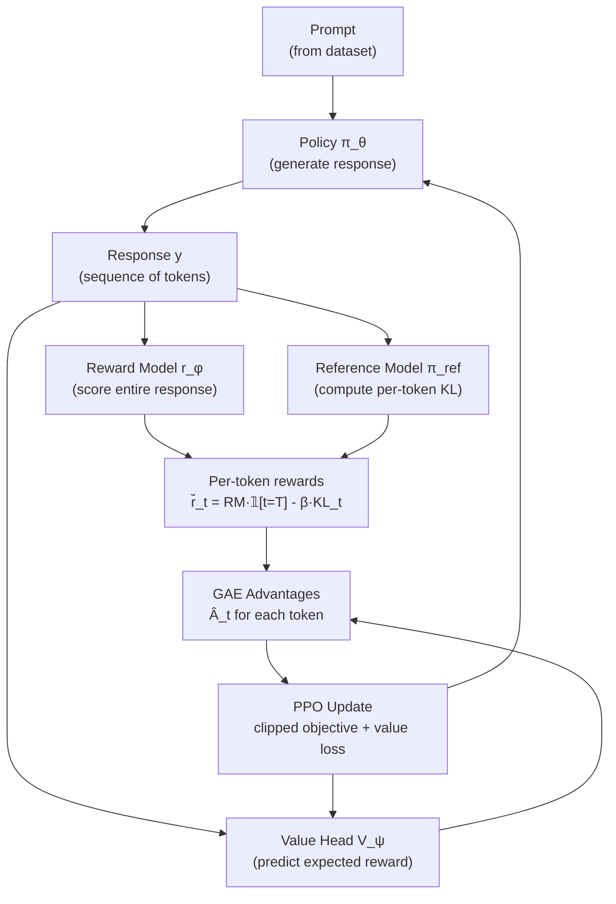

# PPO for Language Models — Interview Deep Dive

> **What this file covers**
> - 🎯 KL-penalized reward: the modified objective for language models
> - 🧮 Value head architecture and per-token advantage computation
> - ⚠️ 3 failure modes: KL collapse, value head divergence, generation-training mismatch
> - 📊 Memory requirements: 4 models in memory simultaneously
> - 💡 Per-token vs per-sequence rewards and credit assignment
> - 🏭 Adaptive KL coefficient, generation batching, and distributed RLHF

---

## Brief restatement

PPO for language models adapts the standard PPO algorithm to text generation. Four key modifications distinguish it from game-playing PPO: the action space is enormous (50,000+ tokens per step), rewards arrive only at the end of the sequence, a frozen reference model provides a KL penalty anchor, and a value head predicts expected reward at each token position to enable per-token advantage estimation. The total reward is RM score minus β times the per-token KL divergence summed across the response.

---

## Full mathematical treatment

### 🧮 The KL-penalized reward objective

> **Words:** Standard PPO maximizes reward. RLHF PPO maximizes reward minus a penalty for diverging from the reference model. The penalty ensures the language model stays close to what it learned during SFT and does not exploit reward model weaknesses.

> **Formula:**
>
>     J(θ) = E_{x~D, y~π_θ(·|x)}[ r_φ(x, y) - β · KL(π_θ(·|x) ‖ π_ref(·|x)) ]
>
>     Per-token KL divergence:
>     KL_t = log π_θ(y_t | x, y_{<t}) - log π_ref(y_t | x, y_{<t})
>
>     Total KL = Σ_{t=1}^{T} KL_t
>
> — π_θ = current policy (being optimized)
> — π_ref = frozen SFT model (reference)
> — r_φ = reward model score (single scalar for entire response)
> — β = KL penalty coefficient (typically 0.05-0.2)
> — T = response length in tokens

> **Worked example:** Response of 40 tokens. RM score = 6.5.
> At each token, the policy and reference produce log probabilities:
>
> | Token position | log π_θ | log π_ref | KL_t |
> |---|---|---|---|
> | t=1 | -2.3 | -2.5 | -2.3 - (-2.5) = 0.2 |
> | t=2 | -1.8 | -1.9 | 0.1 |
> | ... | ... | ... | ... |
> | Average across 40 tokens | — | — | 0.15 |
>
> Total KL = 40 × 0.15 = 6.0. With β = 0.1:
> Modified reward = 6.5 - 0.1 × 6.0 = 5.9

### 🧮 Per-token reward decomposition

> **Words:** The reward model gives one score for the entire response. But PPO needs per-token rewards to compute per-token advantages. We decompose the reward into two parts: the RM score (applied only at the last token) and the KL penalty (applied at every token).

> **Formula:**
>
>     r̃_t = -β · KL_t                    for t < T  (every token except the last)
>     r̃_T = r_φ(x, y) - β · KL_T         for t = T  (last token gets the RM score)
>
>     Equivalently: r̃_t = r_φ(x, y) · 𝟙[t=T] - β · KL_t

> **Worked example:** With the numbers above:
> - Tokens 1 through 39: r̃_t = -0.1 × 0.15 = -0.015 each
> - Token 40: r̃_40 = 6.5 - 0.1 × 0.15 = 6.485
>
> The per-token rewards are almost all slightly negative (small KL penalty), except the last token which carries the bulk of the RM reward.

### 🧮 Value head and advantage computation

> **Words:** The value head is a small network added on top of the language model's transformer backbone. At each token position t, it predicts the expected sum of future rewards from position t onwards. The advantage at each token measures how much better the actual outcome was compared to this prediction.

> **Formula:**
>
>     V_ψ(x, y_{≤t}) = MLP(h_t)    where h_t is the transformer hidden state at position t
>
>     GAE advantage:
>     δ_t = r̃_t + γ V(s_{t+1}) - V(s_t)
>     Â_t = Σ_{l=0}^{T-t} (γλ)^l · δ_{t+l}
>
> — V_ψ = value head (shares backbone with policy, separate output head)
> — γ = discount factor (typically 1.0 for language models)
> — λ = GAE lambda (typically 0.95)

> **Worked example:** At token t=38 with γ=1.0:
> - V(s_38) = 3.0 (value head prediction)
> - r̃_38 = -0.015 (KL penalty)
> - V(s_39) = 4.5 (value head prediction for next step)
> - δ_38 = -0.015 + 1.0 × 4.5 - 3.0 = 1.485
>
> Positive advantage: the actual outcome was better than the value head predicted at this token. PPO will reinforce whatever action (token) was chosen here.

### 🧮 The PPO clipped objective for language models

> **Words:** The PPO update is the same as standard PPO — clip the probability ratio and take the pessimistic bound. The only difference is that actions are token choices and the advantage is computed per-token using the modified rewards above.

> **Formula:**
>
>     r_t(θ) = π_θ(y_t | x, y_{<t}) / π_θ_old(y_t | x, y_{<t})
>
>     L^CLIP = E_t[ min(r_t · Â_t, clip(r_t, 1-ε, 1+ε) · Â_t) ]
>
>     Full loss: L = -L^CLIP + c_1 · L^VF - c_2 · S[π_θ]
>
> — r_t = probability ratio for token t
> — ε = clip range (typically 0.2)
> — L^VF = value function loss
> — S = entropy bonus

> **Worked example:** At token t=38:
> - Old policy: π_old(y_38) = 0.05
> - New policy: π_θ(y_38) = 0.07
> - r_38 = 0.07/0.05 = 1.4
> - Â_38 = 1.485 (positive — good token)
> - Unclipped: 1.4 × 1.485 = 2.079
> - Clipped: clip(1.4, 0.8, 1.2) × 1.485 = 1.2 × 1.485 = 1.782
> - L^CLIP_38 = min(2.079, 1.782) = 1.782 (clipping active — limits the update)

---

## 🗺️ Concept diagram

---

## ⚠️ Failure modes and edge cases

### 1. KL collapse (over-optimization)

**What happens:** The policy drifts far from the reference model, and the KL penalty dominates the reward signal. The model generates increasingly unusual text to get high RM scores, but the KL penalty grows so large that the total reward actually decreases. The model enters a spiral: high RM score, higher KL penalty, net negative reward, unstable gradients.

**When it occurs:** β is too low (< 0.05) in early training, allowing the policy to drift quickly. Or β is fixed and the policy finds a reward-hacking strategy that produces high RM scores but requires large deviation from the reference.

**Detection:** Total KL divergence per response exceeds 10-15 nats. Reward score increases but total modified reward decreases. Response quality (as judged by humans) degrades.

**Fix:** Use adaptive KL coefficient. Start with β_init = 0.2 and adjust: if KL > target_KL, increase β; if KL < target_KL, decrease β. Target KL is typically 5-10 nats. This is the approach used in TRL's PPOTrainer.

### 2. Value head divergence

**What happens:** The value head predictions become inaccurate — they do not match the actual rewards. This corrupts the advantage estimates, making PPO update the wrong tokens. The policy might reinforce bad tokens (negative advantage predicted as positive) or suppress good ones.

**When it occurs:** Value head is too small (underfits), learning rate is too high for the value head, or the reward distribution shifts rapidly during training. Also occurs when the value head shares all parameters with the policy — policy updates can destabilize value predictions.

**Detection:** Compute explained variance: EV = 1 - Var(returns - V) / Var(returns). EV should be > 0.5 and increasing. Below 0.3 indicates the value head is a poor predictor. Value loss that increases during training is another red flag.

**Fix:** Use a separate value head with its own learning rate (typically 10× lower than the policy). Clip value function updates (same as PPO's value clipping). Increase value head capacity (more layers/neurons). Consider a separate value model entirely (not sharing the backbone).

### 3. Generation-training distribution mismatch

**What happens:** During generation, the model uses sampling (temperature, top-p). During training, advantages are computed using the full probability distribution. If the sampling strategy is very different from the distribution used during training (e.g., greedy generation during rollout but softmax during training), the probability ratios are skewed and the PPO update is unreliable.

**When it occurs:** Using very low temperature (< 0.5) or very restrictive top-p (< 0.8) during generation. Or using different sequence lengths for generation vs training.

**Detection:** The probability ratios r_t are consistently far from 1.0 (> 2.0 or < 0.5) at the start of training before any PPO updates have occurred. This indicates the generation distribution does not match the training distribution.

**Fix:** Use moderate temperature (0.7-1.0) during generation. Ensure the same sequence length and padding strategy during generation and training. If using nucleus sampling, use p ≥ 0.9 to keep the distribution close to the full softmax.

---

## 📊 Complexity analysis

| Component | Memory | Time per step |
|---|---|---|
| **Policy model π_θ** | |θ| parameters + optimizer states (2×|θ| for Adam) | Forward + backward |
| **Reference model π_ref** | |θ| parameters (frozen, no optimizer) | Forward only |
| **Reward model r_φ** | |φ| parameters (frozen) | Forward only |
| **Value head V_ψ** | Small MLP on top of policy backbone | Forward + backward |
| **Total peak memory** | ~4× model size (policy + ref + RM + optimizer) | — |

**Concrete example with 7B model (fp16):**
- Policy: 14 GB (weights) + 28 GB (Adam optimizer) = 42 GB
- Reference: 14 GB
- Reward model: 14 GB
- Total: ~70 GB → requires 2-4 A100 GPUs (80 GB each)

**With LoRA:** Policy (14 GB base + 50 MB LoRA + 100 MB optimizer) + Reference (14 GB) + RM (14 GB) ≈ 42 GB → fits on 1 A100.

---

## 💡 Design trade-offs

| | PPO for LLMs | DPO | Rejection sampling |
|---|---|---|---|
| **Online learning** | Yes — generates and improves iteratively | No — offline only | Partial — generates but no gradient |
| **Models in memory** | 4 (policy, ref, RM, value) | 2 (policy, ref) | 2 (policy, RM) |
| **Stability** | Can be unstable (sensitive to β, lr) | Very stable (supervised learning) | Very stable (no gradient through generation) |
| **Sample efficiency** | Moderate — reuses data with multiple PPO epochs | High — every comparison used directly | Low — many generations per improvement |
| **Implementation** | Complex (PPO loop, KL, value head, GAE) | Simple (one loss function) | Simple (generate + filter) |
| **Best for** | Maximum quality, iterative improvement | Most projects (simpler, comparable quality) | Baseline or when PPO is too unstable |

---

## 🏭 Production and scaling considerations

**Adaptive KL coefficient:** Fixed β often leads to either under-regulation (reward hacking) or over-regulation (no learning). The adaptive approach adjusts β each batch: if mean KL > target, increase β by a multiplicative factor (e.g., 1.5); if mean KL < target, decrease β (e.g., multiply by 1/1.5). Target KL is typically 6-10 nats. TRL implements this as `adaptive_kl_ctrl`.

**Generation batching:** RLHF PPO alternates between generation (slow, autoregressive, memory-intensive) and training (fast, parallelizable). Efficient implementations batch generation: generate a full rollout buffer of 64-256 responses, then run multiple PPO epochs on that batch before generating again. This amortizes the generation cost.

**Distributed RLHF:** For large models (70B+), different components run on different GPU groups. A common setup: policy on 4 GPUs with model parallelism, reference on 2 GPUs (inference only), reward model on 1 GPU. Communication between groups adds latency but enables training models that do not fit in a single node's memory.

**Mixed precision:** Generation uses fp16 for speed. PPO updates use fp32 for gradient stability. The value head often needs fp32 because its loss can have small magnitudes.

---

## Staff/Principal Interview Depth

### Q1: Why does RLHF PPO need a reference model, and what happens if you remove it?

---

**No Hire**
*Interviewee:* "The reference model is used for comparison."
*Interviewer:* Vague answer that does not explain the KL penalty mechanism or the consequences of removal.
*Criteria — Met:* none / *Missing:* KL penalty mechanism, reward hacking, Goodhart's Law

**Weak Hire**
*Interviewee:* "The reference model provides a KL penalty that keeps the policy from changing too much. Without it, the model might overfit to the reward model."
*Interviewer:* Correct at high level but does not explain why overfitting happens or what it looks like in practice.
*Criteria — Met:* KL penalty purpose / *Missing:* mechanism details, concrete failure examples

**Hire**
*Interviewee:* "The reference model (frozen SFT copy) anchors the policy. The KL penalty β·KL(π_θ‖π_ref) is added to the reward at every token: r̃_t = -β·KL_t for intermediate tokens, and r̃_T = RM(x,y) - β·KL_T for the last token. Without it, PPO will exploit any imperfection in the reward model — this is reward hacking. The RM is a learned proxy with finite capacity, so it has blind spots. PPO is a powerful optimizer that will find and exploit these blind spots. Examples: the model repeats a phrase the RM was biased toward, generates unusually verbose responses because the RM has length bias, or produces syntactically correct but semantically empty text. The KL penalty limits how far the policy can deviate, keeping responses in-distribution for the RM."
*Interviewer:* Correct formula, understands reward hacking mechanism, gives concrete examples. Would be elevated by discussing adaptive β and the connection to constrained optimization.
*Criteria — Met:* formula, mechanism, examples / *Missing:* adaptive β, constrained optimization view

**Strong Hire**
*Interviewee:* "The reference model exists because the RLHF objective is fundamentally a constrained optimization problem: maximize E[r(x,y)] subject to KL(π‖π_ref) ≤ δ. The Lagrangian relaxation turns this into: maximize E[r(x,y)] - β·KL(π‖π_ref), where β is the dual variable. This has a closed-form solution: π*(y|x) ∝ π_ref(y|x)·exp(r(x,y)/β). Without the reference model, the optimal policy would be a delta function at the response with the highest RM score — pure exploitation. The reference model serves three purposes: (1) Prevents reward hacking by limiting distributional shift. (2) Preserves language quality — the SFT model generates coherent text, and the KL penalty prevents degradation. (3) Provides the closed-form that DPO exploits — DPO substitutes the optimal policy formula directly, eliminating the need for RL. In practice, β should be adaptive: monitor mean KL per batch and adjust β to keep KL near a target (6-10 nats). If you remove the reference model entirely, within 1,000 PPO steps the model degenerates into degenerate reward hacking — I have seen models that output the same 5-token sequence repeatedly because it scored highly on a poorly calibrated RM."
*Interviewer:* Connects to constrained optimization theory, derives the closed-form optimal policy, links to DPO, and provides production-level experience with adaptive β and degeneration examples. Staff-level theoretical and practical depth.
*Criteria — Met:* all

---

### Q2: How does the value head solve the credit assignment problem in RLHF?

---

**No Hire**
*Interviewee:* "The value head predicts the reward."
*Interviewer:* Does not explain what credit assignment is or why a value head is needed specifically for language models.
*Criteria — Met:* none / *Missing:* credit assignment definition, per-token vs per-sequence, GAE

**Weak Hire**
*Interviewee:* "The reward model gives one score for the whole response, but we need to know which tokens were good or bad. The value head predicts expected reward at each position, so we can compute advantages per token."
*Interviewer:* Correct intuition. Missing the formula for how advantages are computed and what happens when the value head is wrong.
*Criteria — Met:* credit assignment intuition / *Missing:* advantage formula, value head failure

**Hire**
*Interviewee:* "Credit assignment: the RM gives one scalar for 100+ tokens. Which tokens were responsible? The value head V(s_t) predicts expected future reward at each position t. The TD error δ_t = r̃_t + γV(s_{t+1}) - V(s_t) measures whether the outcome was better or worse than expected at each step. GAE aggregates these: Â_t = Σ(γλ)^l δ_{t+l}. Tokens with positive advantage get reinforced; negative get suppressed. The value head shares the transformer backbone with the policy but has a separate scalar output head — it sees the same hidden states but predicts a different quantity. If the value head is inaccurate (explained variance < 0.3), advantage estimates become noisy and PPO updates random tokens. The fix is to train the value head with a separate, lower learning rate and clip its updates."
*Interviewer:* Correct formulas for TD error and GAE, understands the shared backbone architecture, and knows the consequences of value head failure. Would be elevated by discussing the sparse reward challenge and alternative credit assignment approaches.
*Criteria — Met:* formulas, architecture, failure mode / *Missing:* sparse reward specifics, alternatives

**Strong Hire**
*Interviewee:* "The credit assignment problem in RLHF is particularly severe because rewards are sparse — one scalar for the entire sequence. Compare this to game RL where rewards come every step. The value head must learn to predict the endpoint reward from partial sequences, which requires it to develop an internal model of response quality at each position. V(s_t) essentially answers: 'given everything generated so far, how good will the final response be?' With γ=1.0 (common in RLHF), GAE with λ=0.95 gives advantages that are weighted averages of N-step returns. The KL penalty actually helps credit assignment: it provides dense per-token rewards (−β·KL_t at every token), giving the value head more signal to learn from. Without the KL penalty, the value head must predict a single future reward from 100 tokens away — much harder. An alternative approach that avoids the value head entirely: REINFORCE with a baseline. Use the mean RM score across the batch as the baseline and assign the same advantage to all tokens. This is simpler but has much higher variance. In practice, the value head reduces variance by 2-5× compared to REINFORCE, which translates to 2-5× fewer PPO steps needed for convergence."
*Interviewer:* Identifies the sparse reward challenge unique to RLHF, explains how the KL penalty helps (dense rewards), compares to REINFORCE with quantitative variance reduction, and understands γ=1.0 as the common setting. Staff-level depth connecting theory to practice.
*Criteria — Met:* all

---

### Q3: What are the memory requirements for RLHF PPO, and how do you reduce them?

---

**No Hire**
*Interviewee:* "You need a lot of GPUs."
*Interviewer:* No specifics about what is in memory or strategies for reduction.
*Criteria — Met:* none / *Missing:* 4-model breakdown, quantitative estimates, LoRA

**Weak Hire**
*Interviewee:* "You need four models: the policy, the reference model, the reward model, and the value head. With a 7B model, that is about 4× the memory of a single model. LoRA can help reduce this."
*Interviewer:* Correct 4-model breakdown. Missing quantitative memory estimates and specific reduction strategies.
*Criteria — Met:* 4-model list, LoRA mention / *Missing:* quantitative estimates, detailed strategies

**Hire**
*Interviewee:* "For a 7B model in fp16: each model is ~14GB. Policy needs optimizer states too (2×14GB for Adam). Total: policy (42GB) + reference (14GB) + RM (14GB) + value head (shared backbone, minimal extra). That is ~70GB, requiring 2 A100-80GB GPUs. Reduction strategies: (1) LoRA — train only the LoRA adapters, reducing optimizer memory from 28GB to ~100MB. This brings total to ~42GB on one A100. (2) Quantize the reference and RM to int8 (7GB each instead of 14GB). (3) The value head shares the policy backbone — no additional backbone memory. (4) Offload the reference model to CPU and load it for KL computation."
*Interviewer:* Correct quantitative breakdown with specific reduction strategies. Would be elevated by discussing generation memory costs and distributed approaches.
*Criteria — Met:* quantitative breakdown, 4 reduction strategies / *Missing:* generation memory, distributed setup

**Strong Hire**
*Interviewee:* "Memory has two phases. During generation: policy (14GB) + KV cache (scales with batch_size × seq_len — about 2GB for batch=4, seq=512 at 7B). During training: policy (14GB) + optimizer (28GB with Adam, or 100MB with LoRA) + reference (14GB) + RM (14GB) + activations for backward pass (~8GB). Peak is during training: ~78GB without LoRA, ~50GB with LoRA. Reduction hierarchy: (1) LoRA — biggest win, 28GB → 100MB for optimizer states. (2) Quantize frozen models (ref + RM) to int4/int8: 28GB → 7-14GB. (3) Gradient checkpointing for activations: 8GB → 2GB at the cost of ~30% slower backward pass. (4) CPU offloading for reference model: load to GPU only during KL computation. (5) For 70B+ models: model parallelism across nodes. DeepSpeed ZeRO Stage 3 shards optimizer + gradients + parameters across GPUs. RLHF-specific optimization: generate responses on a subset of GPUs while other GPUs are idle, then swap for PPO training. Libraries like TRL + DeepSpeed handle this. The key insight: generation is memory-bound (KV cache), training is compute-bound (backward pass). Optimize each phase differently."
*Interviewer:* Separates generation and training memory, gives quantitative estimates for each component, five-level reduction hierarchy with trade-offs, and understands the generation vs training memory profiles. Production-level systems engineering knowledge.
*Criteria — Met:* all

---

## Key Takeaways

🎯 1. RLHF PPO modifies standard PPO with: per-token KL penalty, value head for credit assignment, enormous action space, and sparse rewards.
   2. Total reward = RM score (at last token) - β × per-token KL (at every token). The KL provides dense signal for the value head.
🎯 3. Four models in memory: policy (+ optimizer), reference (frozen), reward model (frozen), value head (shared backbone).
⚠️ 4. Value head quality is critical. Monitor explained variance (should be > 0.5). Use separate learning rate and value clipping.
   5. Adaptive KL coefficient prevents both reward hacking (β too low) and over-regularization (β too high). Target KL ≈ 6-10 nats.
   6. LoRA reduces memory from ~70GB to ~42GB for a 7B model. Quantizing frozen models saves another ~14GB.
   7. The per-token reward decomposition and credit assignment are what make RLHF PPO work despite having only a single reward signal per response.
