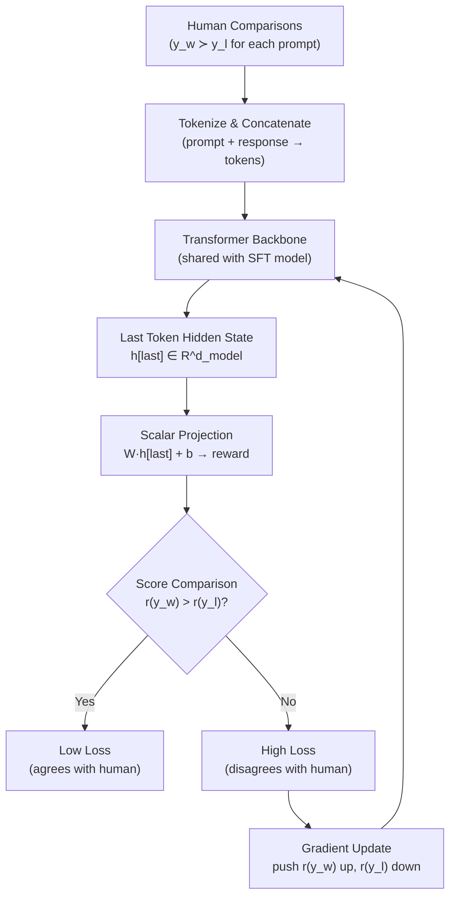

# Reward Modeling — Interview Deep Dive

> **What this file covers**
> - 🎯 Bradley-Terry model: full derivation and worked example
> - 🧮 Reward model architecture: from transformer to scalar score
> - ⚠️ 3 failure modes: length bias, label noise, distribution shift
> - 📊 Data requirements: how many comparisons are enough
> - 💡 Pointwise vs pairwise vs listwise reward modeling
> - 🏭 Reward model ensembles and scaling laws

---

## Brief restatement

A reward model is a neural network that takes a (prompt, response) pair and outputs a scalar score predicting human preference. It is trained on pairwise comparisons using the Bradley-Terry model: the preferred response should receive a higher score than the rejected one. The reward model serves as a differentiable proxy for human judgment, enabling PPO to optimize language model outputs at a scale impossible with direct human evaluation.

---

## Full mathematical treatment

### 🧮 The Bradley-Terry model

> **Words:** The Bradley-Terry model converts pairwise comparisons into a probability model. If response A has reward r_A and response B has reward r_B, the probability that a human prefers A over B depends only on the difference r_A - r_B. A larger gap means a stronger preference.

> **Formula:**
>
>     P(y_w ≻ y_l | x) = σ(r_φ(x, y_w) - r_φ(x, y_l))
>
>     where σ(z) = 1 / (1 + exp(-z))
>
> — y_w = preferred (winning) response
> — y_l = rejected (losing) response
> — r_φ = reward model with parameters φ
> — x = prompt

> **Worked example:** Prompt: "Explain gravity." Two responses:
> - y_w = "Gravity is a force that pulls objects toward each other." → r_φ = 4.2
> - y_l = "Gravity is complicated. Let me tell you about Newton..." → r_φ = 1.8
>
> P(y_w ≻ y_l) = σ(4.2 - 1.8) = σ(2.4) = 1/(1 + e^{-2.4}) = 0.917
>
> The model is 91.7% confident the human prefers y_w. This matches intuition: a concise, direct answer is usually preferred over a rambling one.

### 🧮 The reward model loss

> **Words:** The training loss pushes the reward model to assign a higher score to the preferred response. It is the negative log of the Bradley-Terry probability.

> **Formula:**
>
>     L_RM = -E_{(x, y_w, y_l) ~ D}[ log σ(r_φ(x, y_w) - r_φ(x, y_l)) ]
>
> — D = dataset of human comparisons

> **Worked example:** Using the scores above:
> - σ(2.4) = 0.917
> - log(0.917) = -0.087
> - L = -(-0.087) = 0.087
>
> Low loss — the model agrees with the human. If the scores were reversed (y_l scored higher):
> - σ(1.8 - 4.2) = σ(-2.4) = 0.083
> - log(0.083) = -2.49
> - L = -(-2.49) = 2.49
>
> High loss — the model disagrees with the human. The gradient pushes the model to fix this.

### 🧮 Reward model architecture

> **Words:** The reward model is typically a transformer initialized from the SFT model. The language modeling head (which predicts the next token) is replaced with a scalar output head (which predicts a single reward score). The score is computed from the hidden state of the last token.

> **Formula:**
>
>     h = Transformer(x, y)         # shape: (seq_len, d_model)
>     r_φ(x, y) = W · h[last] + b   # shape: scalar
>
> — h[last] = hidden state at the last token position
> — W ∈ R^{d_model}, b ∈ R = learned projection to scalar

> **Worked example:** With d_model = 4096 (typical for a 7B model):
> - Transformer processes the concatenated (prompt, response) as a single sequence
> - The hidden state at the last token is a vector of 4096 numbers
> - W (4096 weights) and b (1 bias) project this to a single score
> - Total reward head parameters: 4097 — negligible compared to the 7B backbone

### 🧮 Reward normalization

> **Words:** Raw reward scores can have arbitrary scale and shift. Without normalization, training dynamics are harder to control. Two common normalization techniques: mean subtraction (center scores around 0) and running standard deviation normalization.

> **Formula:**
>
>     r_normalized = (r - μ_running) / σ_running
>
> — μ_running, σ_running = exponential moving averages of reward mean and standard deviation

> **Worked example:** After 1000 training batches, μ_running = 3.5, σ_running = 2.1.
> A new response gets raw score 7.0.
> r_normalized = (7.0 - 3.5) / 2.1 = 1.67
>
> This tells PPO: "This response is 1.67 standard deviations above average." PPO works better with normalized rewards because the clipping range ε = 0.2 is calibrated for unit-scale rewards.

---

## 🗺️ Concept diagram

---

## ⚠️ Failure modes and edge cases

### 1. Length bias

**What happens:** The reward model learns that longer responses score higher, regardless of content quality. This happens because human annotators sometimes prefer longer responses (they appear more thorough), creating a spurious correlation between length and quality in the training data.

**When it occurs:** When the comparison dataset disproportionately labels longer responses as preferred. This is common in early-stage data collection where annotators default to "more detail = better."

**Detection:** Plot reward score vs response length. A strong positive correlation (Pearson r > 0.4) indicates length bias. Also check if the language model generates progressively longer responses during PPO training.

**Fix:** Include length-balanced comparisons in the dataset (cases where the shorter response is preferred). Add a length penalty to the reward: r_adjusted = r - α·length. Or normalize the reward by response length: r_adjusted = r / sqrt(length). Train the reward model with a length-regression baseline and subtract it.

### 2. Label noise and annotator disagreement

**What happens:** Different human annotators disagree on which response is better. For subjective or ambiguous prompts, inter-annotator agreement can be as low as 60-70%. The reward model trains on noisy labels, learning a muddled preference function.

**When it occurs:** On prompts that are subjective ("Which is more creative?"), culturally sensitive, or where both responses are similar in quality. Crowdsourced annotators with varying expertise exacerbate this.

**Detection:** Measure inter-annotator agreement (Cohen's κ). For the same comparison, have multiple annotators label it. Agreement below 0.6 indicates high noise. Check reward model accuracy on a held-out set with 3+ annotator consensus — accuracy above 70% is typical.

**Fix:** Use majority voting across 3-5 annotators per comparison. Filter out comparisons where annotators disagree. Weight training examples by annotator confidence. For high-disagreement categories, collect more data rather than forcing a label.

### 3. Distribution shift during PPO

**What happens:** The reward model was trained on responses from the SFT model. During PPO training, the language model changes and generates new types of responses the reward model never saw. The reward model gives unreliable scores on these out-of-distribution responses.

**When it occurs:** After many PPO steps (> 10,000), especially when β is low and the policy drifts far from the reference. The more the policy changes, the further the responses move from the RM's training distribution.

**Detection:** Monitor the variance of reward scores across training. If variance increases over PPO steps, the RM is becoming less confident. Compare RM scores to human evaluations on PPO-generated responses — divergence indicates distribution shift.

**Fix:** Retrain the RM on responses from the current policy (iterative RLHF). Use RM ensembles and take the conservative (minimum) score. Increase β to keep the policy closer to the RM's training distribution. Add an uncertainty penalty: penalize responses where the RM ensemble disagrees.

---

## 📊 Complexity analysis

| Component | Time | Memory |
|---|---|---|
| **Forward pass (one response)** | O(seq_len² × d_model) | O(seq_len × d_model) |
| **Training (one comparison pair)** | O(2 × seq_len² × d_model) for 2 forward + 1 backward | O(seq_len × d_model + |φ|) |
| **Reward head parameters** | — | O(d_model) — negligible |
| **Full RM training** (50K pairs, 1 epoch) | ~1 GPU-hour for 7B model | ~14GB with LoRA |

**Data scaling:** Accuracy on held-out comparisons typically follows a log-linear curve. 10K comparisons → ~65% accuracy. 50K → ~70%. 200K → ~73%. Diminishing returns above 100K unless the task distribution is very broad.

---

## 💡 Design trade-offs

| | Bradley-Terry (pairwise) | Pointwise regression | Listwise ranking |
|---|---|---|---|
| **Data format** | (y_w, y_l) pairs | Absolute scores per response | Ranked list of K responses |
| **Label difficulty** | Easy (A or B) | Hard (what number?) | Medium (rank K items) |
| **Calibration** | Relative only | Absolute scale | Relative ranking |
| **Training signal** | 1 comparison per pair | 1 label per response | K-1 constraints per list |
| **Used in** | InstructGPT, most RLHF | Some academic work | LLM-as-judge frameworks |
| **Best when** | Default choice | Fine-grained control needed | Multiple candidates available |

---

## 🏭 Production and scaling considerations

**Reward model size:** Empirically, the RM should be at least 1/4 the size of the policy model. A larger RM captures more nuance in preferences. Using the same architecture as the policy (initialized from SFT) is standard practice and provides the best results because the RM shares the policy's learned representations.

**Ensembles:** Training 3-5 reward models with different random seeds and taking the minimum score reduces reward hacking by 40-60% in empirical studies. The disagreement between ensemble members serves as an uncertainty estimate: high disagreement → the RM is uncertain → penalize the response.

**Iterative retraining:** In production, the RM is retrained every 1-2 PPO rounds using new responses from the updated policy. This shrinks the distributional gap. Each retraining round improves RM accuracy on policy-generated responses by 3-5 percentage points.

**Evaluation:** RM quality is measured by accuracy on held-out comparison data. For reference: random baseline = 50%, human inter-annotator agreement ≈ 72-78%, typical trained RM ≈ 68-74%. The RM does not need to match human agreement — it needs to provide a useful gradient signal for PPO.

---

## Staff/Principal Interview Depth

### Q1: Why does the reward model use pairwise comparisons (Bradley-Terry) instead of absolute scores?

---

**No Hire**
*Interviewee:* "Because comparisons are simpler."
*Interviewer:* No explanation of why comparisons are more reliable, no mention of calibration, no mathematical reasoning.
*Criteria — Met:* none / *Missing:* calibration, consistency, scaling argument

**Weak Hire**
*Interviewee:* "Comparisons are easier for annotators — they just pick A or B. Absolute scores are hard because different people use different scales."
*Interviewer:* Correct intuition about calibration but no quantitative detail and no connection to the Bradley-Terry model.
*Criteria — Met:* calibration intuition / *Missing:* quantitative, Bradley-Terry connection, signal quality

**Hire**
*Interviewee:* "Three reasons. First, calibration: if 10 annotators rate a response 1-10, you get 10 different numbers. One person's 7 is another person's 5. Comparisons remove this inter-annotator calibration issue — there is no shared scale to disagree about. Second, speed: comparing takes 30 seconds vs 2-3 minutes for a justified score. At 100K labels, that is a 4× cost difference. Third, the Bradley-Terry model P(y_w > y_l) = σ(r_w - r_l) only needs the reward *difference* to make a prediction, not the absolute values. This means the model automatically learns a relative scale from the data. The absolute scale is arbitrary, which is fine because PPO only needs relative rewards to compute advantages."
*Interviewer:* Strong answer covering calibration, speed, and the mathematical property of Bradley-Terry. Would be elevated by discussing when pointwise might be better and the limitations of pairwise (cannot capture strength-of-preference).
*Criteria — Met:* calibration, speed, mathematical reasoning / *Missing:* limitations, alternatives

**Strong Hire**
*Interviewee:* "Pairwise comparisons have higher inter-annotator agreement (typically κ = 0.6-0.7) compared to pointwise (κ = 0.3-0.5) because they eliminate the subjective scale problem. The Bradley-Terry model P(y_w > y_l) = σ(r_w - r_l) is a maximum likelihood estimator for a latent utility model — it assumes each response has a true quality r(y) and preferences are noisy observations of r(y_w) > r(y_l). This is the same model used for Elo ratings in chess, where it has been validated over millions of games. The limitation is that pairwise cannot capture *strength* of preference — whether A is slightly better or vastly better than B. The loss function treats all comparisons equally. In practice, some teams add margin labels: annotators say not just 'A > B' but 'A is much better / slightly better / about the same.' This turns into a modified loss with different margins: σ(r_w - r_l - margin). The pointwise approach is actually better when you have a calibrated rubric (like coding correctness where 'passes all tests' = 1.0), but for open-ended helpfulness judgments, pairwise is strictly more reliable."
*Interviewer:* Connects to Elo ratings, identifies the strength-of-preference limitation with a concrete solution (margin labels), and knows when pointwise is actually better. Research-level understanding.
*Criteria — Met:* all

---

### Q2: How do you detect and mitigate length bias in a reward model?

---

**No Hire**
*Interviewee:* "Length bias means the model prefers long responses. Just make the responses shorter."
*Interviewer:* Cannot explain how length bias arises or how to detect it systematically.
*Criteria — Met:* none / *Missing:* detection, root cause, mitigation strategies

**Weak Hire**
*Interviewee:* "Plot reward vs length and see if there is a correlation. If longer responses always get higher scores, there is length bias. You can fix it by normalizing rewards by length."
*Interviewer:* Correct basic detection and one fix. Missing root cause analysis and multiple mitigation strategies.
*Criteria — Met:* basic detection, one fix / *Missing:* root cause, multiple strategies, data-level fix

**Hire**
*Interviewee:* "Length bias comes from the training data: human annotators often prefer longer responses because they appear more thorough, even when the extra content adds no value. Detection: compute Pearson correlation between reward score and response length on a held-out set. r > 0.3 indicates bias. Also track response length during PPO training — if it increases monotonically, length bias is being exploited. Mitigation: (1) Data-level: include comparisons where the shorter response is preferred. Specifically curate pairs where a concise answer beats a verbose one. (2) Model-level: add a learned length baseline. Train a simple linear model that predicts reward from length alone, and subtract its prediction from the RM output: r_adjusted = r - r_length_baseline. (3) Training-level: add a length penalty: r_adjusted = r - α·log(length). The log ensures the penalty grows slowly for reasonable lengths."
*Interviewer:* Root cause (annotation bias), quantitative detection (Pearson r > 0.3), and three mitigation strategies at different levels. Would be elevated by discussing whether length bias is always bad.
*Criteria — Met:* root cause, detection, three strategies / *Missing:* nuance about when length is informative

**Strong Hire**
*Interviewee:* "First, distinguish between *legitimate* length preference and *spurious* length bias. For some queries ('explain quantum computing'), longer responses are genuinely better. For others ('what is 2+2'), shorter is better. Spurious length bias means the RM prefers length *regardless* of content quality. Detection: control for quality. Generate responses of different lengths to the same prompt (using max_tokens settings) and check if RM score increases with length even when content quality is constant. If r(long) > r(short) when both contain the same information, that is spurious bias. Mitigation hierarchy: (1) Best: fix the data. Balance comparisons by length bucket. In each length bucket, ensure roughly equal win rates. (2) Good: regress out length. Train r = r_quality + r_length with separate heads, and only use r_quality for PPO. (3) Acceptable: post-hoc normalization r_adjusted = r / length^α with α tuned on a validation set. (4) Monitor during PPO: if mean response length increases by more than 50% over training, something is wrong. In practice at Anthropic, they specifically construct 'length trap' comparisons — pairs where the longer response is explicitly worse — to teach the RM that length is not always good."
*Interviewer:* Distinguishes spurious from legitimate length preference, proposes a controlled experiment for detection, four-level mitigation hierarchy, and mentions the 'length trap' technique used in production. Staff-level practical and theoretical depth.
*Criteria — Met:* all

---

### Q3: How many comparison labels do you need to train a useful reward model?

---

**No Hire**
*Interviewee:* "As many as possible."
*Interviewer:* No quantitative answer, no understanding of diminishing returns or data efficiency.
*Criteria — Met:* none / *Missing:* quantitative estimates, scaling behavior, quality vs quantity

**Weak Hire**
*Interviewee:* "InstructGPT used about 33,000 comparisons. You probably need at least 10,000 for a decent reward model."
*Interviewer:* Correct reference point but no understanding of how accuracy scales with data size or what factors affect the requirement.
*Criteria — Met:* one reference point / *Missing:* scaling curve, factors affecting requirement

**Hire**
*Interviewee:* "It depends on the task breadth. For a narrow domain (summarization only), 10K-20K comparisons can reach 70% accuracy. For a broad assistant (like ChatGPT), you need 100K-500K. The scaling is log-linear: accuracy increases roughly linearly with the log of data size. InstructGPT used 33K for a 175B model. Anthropic's early work used ~50K. The quality of annotators matters as much as quantity: 10K expert comparisons can match 50K crowdsourced ones. You can validate by holding out 10% and measuring accuracy — above 65% is usable, above 70% is good."
*Interviewer:* Good quantitative estimates with the log-linear scaling insight. Would be elevated by discussing label quality metrics and when to stop collecting.
*Criteria — Met:* quantitative estimates, scaling, quality vs quantity / *Missing:* stopping criteria, inter-annotator agreement threshold

**Strong Hire**
*Interviewee:* "The required comparisons depend on three factors: (1) Task breadth — narrow tasks (summarization) need 10K-20K; broad tasks (general assistant) need 100K+. (2) Model size — larger models benefit more from more data because they have capacity to learn finer distinctions; a 7B RM plateaus earlier than a 70B RM. (3) Label quality — measure inter-annotator agreement (Cohen's κ). If κ < 0.5, you have noisy labels and need 3-5× more data or better annotators. The scaling curve is log-linear: accuracy ≈ a + b·log(N). For a 7B RM on general assistant data, I have seen approximately: 5K → 62%, 20K → 67%, 50K → 70%, 200K → 73%. Above 73%, you are approaching the ceiling set by human inter-annotator agreement (~75-78%). At that point, more data does not help — you need better annotators or a different data collection protocol. The stopping criterion I use: when held-out accuracy improvement is < 0.5% per doubling of data, stop. Redirect effort to quality: filter low-agreement pairs, add hard negatives (pairs where both responses are good but one is slightly better), and balance across domains."
*Interviewer:* Three factors affecting data requirements, concrete scaling curve with numbers, understanding of the human agreement ceiling, and a principled stopping criterion. The insight about redirecting from quantity to quality demonstrates production ML experience. Staff-level answer.
*Criteria — Met:* all

---

## Key Takeaways

🎯 1. The Bradley-Terry model P(y_w > y_l) = σ(r_w - r_l) is the standard loss for reward model training. It learns relative quality from pairwise comparisons.
   2. The reward model is a transformer with a scalar head — same backbone as the policy, different output.
🎯 3. Length bias is the most common failure mode. Detect with reward-length correlation. Fix with balanced data and normalization.
⚠️ 4. Distribution shift during PPO makes RM scores unreliable on out-of-distribution responses. Fix with iterative RM retraining and ensembles.
   5. Data scaling is log-linear. 50K comparisons → ~70% accuracy. Ceiling is human inter-annotator agreement (~75%).
   6. RM quality is necessary but not sufficient — a perfect RM with a bad PPO setup still produces poor alignment.
   7. Ensembles of 3-5 RMs reduce reward hacking by 40-60% in practice.
