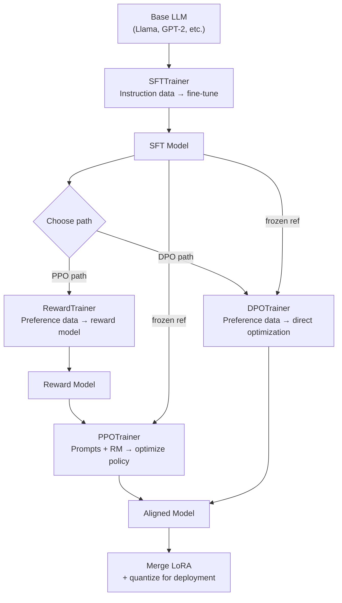

# TRL Library Tutorial — Interview Deep Dive

> **What this file covers**
> - 🎯 TRL architecture: how SFTTrainer, RewardTrainer, PPOTrainer, DPOTrainer connect
> - 🧮 Key hyperparameters and their mathematical effects
> - ⚠️ 3 failure modes: data format bugs, LoRA misconfiguration, tokenizer misalignment
> - 📊 Memory and compute comparison across trainers
> - 💡 From-scratch vs TRL: when each is appropriate
> - 🏭 Production deployment: LoRA merging, inference optimization, monitoring

---

## Brief restatement

TRL (Transformer Reinforcement Learning) is Hugging Face's library for LLM alignment, providing four main trainers that map to the RLHF pipeline stages. SFTTrainer handles supervised fine-tuning on instruction data. RewardTrainer trains a Bradley-Terry reward model on comparisons. PPOTrainer runs the full RLHF loop with KL-penalized reward optimization. DPOTrainer trains directly on preferences without a reward model. All four support LoRA, distributed training, and integration with the Hugging Face ecosystem.

---

## Full mathematical treatment

### 🧮 SFTTrainer internals

> **Words:** SFTTrainer wraps standard causal language model training with features specific to instruction data: packing, chat template formatting, and LoRA integration. The core loss is standard cross-entropy on the assistant tokens only.

> **Formula:**
>
>     L_SFT = -Σ_{t∈assistant_tokens} log π_θ(y_t | x, y_{<t})
>
>     With packing (multiple examples per sequence):
>     L_packed = -Σ_{i=1}^{k} Σ_{t∈assistant_tokens_i} log π_θ(y_t^i | context_i)
>
> — Only assistant tokens contribute to the loss (not prompt tokens)
> — Packing fills each training sequence with multiple short examples, reducing wasted padding

> **Worked example:** A training sequence of max_seq_length = 512:
> - Without packing: example of 100 tokens + 412 padding tokens. Efficiency = 100/512 = 19.5%
> - With packing: 5 examples of ~100 tokens each. Efficiency = 500/512 = 97.7%
>
> Packing gives ~5× more training signal per batch for short examples.

### 🧮 DPOTrainer loss variants

> **Words:** TRL's DPOTrainer supports multiple loss variants beyond standard DPO. Each modifies the loss to address specific issues.

> **Formula variants:**
>
>     Standard (sigmoid):
>     L = -log σ(β · (log π_θ(y_w)/π_ref(y_w) - log π_θ(y_l)/π_ref(y_l)))
>
>     Hinge:
>     L = max(0, 1 - β · (log π_θ(y_w)/π_ref(y_w) - log π_θ(y_l)/π_ref(y_l)))
>
>     IPO (Identity Preference Optimization):
>     L = (log π_θ(y_w)/π_ref(y_w) - log π_θ(y_l)/π_ref(y_l) - 1/(2β))²
>
> — Sigmoid: standard, smooth gradients everywhere
> — Hinge: zero gradient once margin exceeds threshold (prevents over-optimization)
> — IPO: regularized, more robust to label noise

### 🧮 PPOTrainer adaptive KL

> **Words:** TRL's PPOTrainer adjusts the KL coefficient β automatically to maintain a target KL divergence. If KL is too high, β increases (more penalty). If KL is too low, β decreases (less penalty).

> **Formula:**
>
>     After each PPO batch:
>     if mean_KL > target_KL × 1.5:
>         β ← β × 1.5     (increase penalty)
>     elif mean_KL < target_KL / 1.5:
>         β ← β / 1.5     (decrease penalty)
>     else:
>         β unchanged
>
> — target_KL ≈ 6.0 (default in TRL)
> — init_kl_coef ≈ 0.2 (starting β)

> **Worked example:** Training starts with β = 0.2, target_KL = 6.0:
> - Batch 1: mean_KL = 2.0. Below target/1.5 = 4.0 → β = 0.2/1.5 = 0.133
> - Batch 50: mean_KL = 8.5. Above target×1.5 = 9.0 → no change
> - Batch 100: mean_KL = 12.0. Above target×1.5 = 9.0 → β = β×1.5
>
> This self-regulating mechanism prevents both over-optimization (high KL) and under-optimization (low KL).

---

## 🗺️ Concept diagram

---

## ⚠️ Failure modes and edge cases

### 1. Data format and tokenizer bugs

**What happens:** TRL expects specific data formats for each trainer. Misformatting causes silent failures — the model trains but learns garbage. Common issues: missing "prompt" field in DPO data, wrong chat template for SFTTrainer, tokenizer pad_token not set (defaults to None, causing crashes or padding with EOS which corrupts the loss).

**When it occurs:** When converting datasets from one format to another, when using custom datasets, or when switching between models with different tokenizer conventions. Particularly dangerous because TRL does not always error on bad formatting — it may silently train on corrupted data.

**Detection:** Check the first few training examples after formatting. Print tokenized sequences and verify prompt/response boundaries. For DPO: verify that "chosen" and "rejected" come from the same prompt. For SFT: verify that only assistant tokens are included in the loss by checking the labels tensor.

**Fix:** Always set `tokenizer.pad_token = tokenizer.eos_token` (or a dedicated pad token). Use TRL's built-in dataset formatting utilities. For DPO: verify the dataset has "prompt", "chosen", "rejected" columns. Run a training step on 10 examples and inspect the loss — it should be finite and in a reasonable range (1.0-3.0 for SFT, 0.5-1.0 for DPO).

### 2. LoRA misconfiguration

**What happens:** LoRA is applied to the wrong modules, with too low rank, or with conflicting configurations between SFT and DPO stages. This results in the model barely learning (rank too low), overfitting to noise (rank too high), or the DPO stage failing to load the SFT LoRA weights.

**When it occurs:** Using default `target_modules` that do not match the model architecture. Training SFT with one LoRA config and DPO with a different one (incompatible adapters). Setting rank r = 1 (too small, model cannot express the needed changes).

**Detection:** Training loss does not decrease (rank too low or wrong modules). Training loss drops to near zero on first epoch (rank too high, overfitting). DPO trainer crashes when loading SFT model with incompatible adapter shapes.

**Fix:** Use `target_modules = ["q_proj", "v_proj", "k_proj", "o_proj"]` as default for most transformer models. Use rank r = 16-64 (16 is a good default). Use the same LoRA config for both SFT and DPO stages. Verify adapter loading by checking `model.print_trainable_parameters()` — should show 0.1-1% trainable parameters.

### 3. Reference model mismatch in DPO

**What happens:** DPOTrainer automatically creates a reference model from the initial weights. If the model was modified between loading and trainer creation (e.g., by manually applying LoRA adapters), the reference model may not match the intended starting point. The log-probability ratios π_θ/π_ref become meaningless if π_ref is wrong.

**When it occurs:** Loading a model, applying custom modifications, then passing it to DPOTrainer. Or loading a pre-merged LoRA model and expecting DPOTrainer to create a reference from the merged version.

**Detection:** At the start of training, the log-probability ratios should be near 0 (policy ≈ reference). If they are large (> 1.0), the reference does not match the policy's initial state.

**Fix:** Let DPOTrainer handle reference model creation automatically. Do not modify the model between loading and trainer creation. If using a pre-trained LoRA adapter, load it through TRL's mechanisms rather than manually.

---

## 📊 Complexity analysis

| Trainer | Memory (7B, LoRA) | Time per epoch (50K data) | GPU requirement |
|---|---|---|---|
| **SFTTrainer** | ~18 GB | ~1-2 hours | 1 A100 |
| **RewardTrainer** | ~18 GB | ~1 hour | 1 A100 |
| **PPOTrainer** | ~42 GB | ~8-16 hours | 2 A100s |
| **DPOTrainer** | ~28 GB | ~2-4 hours | 1 A100 |

**Recommended hyperparameters by trainer:**

| Trainer | Learning rate | Batch size | Epochs | Special |
|---|---|---|---|---|
| SFTTrainer | 2e-4 (LoRA) / 2e-5 (full) | 4 per GPU | 1-3 | packing=True |
| RewardTrainer | 1e-5 | 4 per GPU | 1 | max_length=512 |
| PPOTrainer | 1.41e-5 | 64 total | — | target_kl=6.0 |
| DPOTrainer | 5e-5 (LoRA) / 5e-7 (full) | 4 per GPU | 1-3 | β=0.1 |

---

## 💡 Design trade-offs

| | TRL | From scratch | CleanRL / custom |
|---|---|---|---|
| **Setup time** | Minutes (pip install) | Days-weeks | Hours |
| **Flexibility** | Moderate (callbacks, subclassing) | Full | Moderate |
| **Tested** | Community-tested, many users | Your bugs only | Varies |
| **Features** | LoRA, logging, distributed, save/load | What you build | Selected features |
| **Novel algorithms** | Must fit TRL abstractions | Anything | Flexible |
| **Debugging** | Can be opaque | Full visibility | Good visibility |
| **Best for** | Standard alignment, production | Research, novel methods | Benchmarking, learning |

---

## 🏭 Production and scaling considerations

**LoRA merging for deployment:** After training, LoRA adapters add latency during inference (additional matrix multiplications). For production, merge the adapter into the base model: `model = model.merge_and_unload()`. This produces a standard model with no inference overhead. Save the merged model for deployment.

**Quantization after training:** Post-training quantization (GPTQ, AWQ, or bitsandbytes) reduces the model size by 2-4× with minimal quality loss. A 7B model at fp16 (14GB) can be quantized to int4 (3.5GB), enabling inference on consumer GPUs. Quantize after merging LoRA.

**Monitoring in production:** Log the following during training: loss (should decrease), implicit rewards for chosen and rejected (chosen should be higher), learning rate schedule, gradient norms (should not spike). After deployment: log response lengths (watch for length drift), response diversity (watch for mode collapse), and user feedback scores.

**Versioning:** Save the full configuration alongside the model: LoRA config, training args, dataset version, library versions. Pin `trl==x.y.z` and `transformers==x.y.z` in requirements. Small version changes can affect training dynamics.

---

## Staff/Principal Interview Depth

### Q1: What is the recommended alignment pipeline for a team with limited compute, and why?

---

**No Hire**
*Interviewee:* "Just use ChatGPT or Claude."
*Interviewer:* Does not answer the question about building one's own alignment pipeline.
*Criteria — Met:* none / *Missing:* pipeline design, compute awareness, tool selection

**Weak Hire**
*Interviewee:* "Use SFTTrainer then DPOTrainer with LoRA. It is simpler than PPO and requires less compute."
*Interviewer:* Correct recommendation but no quantitative reasoning about compute requirements or why DPO over PPO.
*Criteria — Met:* correct recommendation / *Missing:* quantitative compute analysis, trade-offs

**Hire**
*Interviewee:* "SFT + DPO with LoRA, on a single A100 or even a consumer GPU with int8 quantization. Quantitatively: SFT with LoRA on a 7B model needs ~18GB and takes 1-2 hours for 50K examples. DPO needs ~28GB and takes 2-4 hours. Total: one GPU, one day, under $50 in cloud compute. PPO would need 2-4 GPUs and 12-24 hours — 4-8× the cost. The quality gap between DPO and PPO is typically 1-3% on benchmarks, which does not justify the cost for most applications. Start with a small model (GPT-2 or a 1B model) to debug the pipeline, then scale to 7B. Use packing=True in SFTTrainer for efficiency. β=0.1 for DPO, lr=5e-5 with LoRA rank 16."
*Interviewer:* Quantitative analysis with specific memory, time, and cost estimates. Good practical advice about debugging with small models. Would be elevated by discussing data quality and evaluation.
*Criteria — Met:* quantitative analysis, specific hyperparameters, debugging advice / *Missing:* data quality, evaluation strategy

**Strong Hire**
*Interviewee:* "The pipeline is: (1) Curate data — this is where most teams should spend 80% of their time. 5K high-quality SFT demonstrations beat 50K noisy ones. 10K clean preference pairs beat 100K messy ones. (2) SFTTrainer with LoRA (r=16, target_modules=[q,k,v,o]_proj) on 5K-10K demonstrations. 1 epoch, packing=True, lr=2e-4. This takes ~18GB, 1-2 hours on one A100. (3) DPOTrainer with LoRA on 10K-50K preference pairs. 1 epoch, β=0.1, lr=5e-5. This takes ~28GB, 2-4 hours. (4) Evaluate: compute win rate against SFT model using a judge model (GPT-4 or a strong open model), check for harmful outputs, measure response diversity. Total compute: ~$30-50 on cloud. The critical insight: the biggest risk is not the algorithm — it is data quality and evaluation. A perfect DPO training run on bad preference data produces a bad model. A simple SFT + DPO run on excellent data produces a good model. For teams with very limited compute (no A100), use QLoRA (4-bit quantization during training) with ORPO, which combines SFT and alignment in a single step — even simpler than SFT+DPO, and fits on a 24GB consumer GPU."
*Interviewer:* Priorities data quality correctly (80% of effort), provides complete end-to-end pipeline with specific numbers, includes evaluation strategy, and offers a fallback for even more constrained compute (QLoRA + ORPO). Staff-level practical judgment.
*Criteria — Met:* all

---

### Q2: How do you handle the transition from SFT to DPO when using LoRA?

---

**No Hire**
*Interviewee:* "Just save the SFT model and load it for DPO."
*Interviewer:* Does not address LoRA-specific concerns about adapter compatibility, reference model creation, or weight merging.
*Criteria — Met:* none / *Missing:* LoRA adapter handling, reference model, compatibility

**Weak Hire**
*Interviewee:* "Save the LoRA adapter after SFT. Load the base model, apply the adapter, then pass to DPOTrainer. DPOTrainer creates the reference model automatically."
*Interviewer:* Correct workflow but missing potential pitfalls and the merge-vs-keep decision.
*Criteria — Met:* basic workflow / *Missing:* pitfalls, merge decision, config compatibility

**Hire**
*Interviewee:* "Two approaches: (1) Keep LoRA adapter — save the SFT adapter, load base model + adapter for DPO. DPOTrainer creates a reference from this combined model. DPO trains a second LoRA adapter on top of the SFT one. This works but has two adapters stacked. (2) Merge first — merge the SFT LoRA into the base model, save the merged model, then apply a fresh LoRA for DPO. Cleaner, but loses the ability to compare SFT vs DPO adapters separately. I prefer (2) for clarity. Key pitfall: use the same LoRA config for both stages if using approach (1). Different target_modules will crash. Also: set `model_ref=None` in DPOTrainer to let it create the reference automatically — do not manually create a reference model."
*Interviewer:* Two valid approaches with trade-offs explained, key pitfall identified, and practical recommendation. Would be elevated by discussing the reference model's memory footprint and optimization.
*Criteria — Met:* two approaches, trade-offs, pitfalls / *Missing:* memory optimization, evaluation of both approaches

**Strong Hire**
*Interviewee:* "The SFT→DPO transition with LoRA has three approaches, each with different trade-offs: (1) Stack adapters: keep the SFT LoRA frozen, train a new DPO LoRA on top. Advantage: can ablate each adapter's contribution. Disadvantage: inference runs two adapter forward passes. (2) Merge + retrain: merge SFT LoRA into base weights, train a fresh DPO LoRA. Advantage: clean, one adapter. Disadvantage: cannot separate SFT from DPO contributions. This is my default recommendation. (3) Continue training: keep the same LoRA adapter and switch from SFT loss to DPO loss. Advantage: simplest. Disadvantage: the reference model must be created before switching losses, which means saving a copy of the adapter weights at the SFT checkpoint. The memory optimization: if using approach (2), DPOTrainer needs the policy (base + LoRA, ~15GB) and reference (base model copy, ~14GB). But with `ref_model=None` and `peft_config` set, DRL's DPOTrainer shares the base model and only creates a reference copy of the LoRA weights — saving ~14GB. This is a significant optimization: 28GB → 15GB for the 7B case. Always verify the reference model is correct by checking that initial log-probability ratios (π_θ/π_ref) are near 0 at the start of DPO training."
*Interviewer:* Three approaches with precise trade-offs, memory optimization with the shared base model (a non-obvious TRL feature), and a verification step for correctness. Demonstrates deep practical experience with the library.
*Criteria — Met:* all

---

### Q3: What metrics should you monitor during each stage of the alignment pipeline?

---

**No Hire**
*Interviewee:* "Watch the loss."
*Interviewer:* Loss alone is insufficient. Different stages have different metrics that reveal different problems.
*Criteria — Met:* none / *Missing:* stage-specific metrics, diagnostic values, corrective actions

**Weak Hire**
*Interviewee:* "For SFT: training loss and validation loss. For DPO: loss and accuracy on preference pairs. For PPO: reward score and KL divergence."
*Interviewer:* Correct metrics but no diagnostic thresholds or corrective actions.
*Criteria — Met:* correct metric names / *Missing:* thresholds, interpretation, corrective actions

**Hire**
*Interviewee:* "SFT: (1) Training loss — should decrease to 1.0-1.5 for instruction data. (2) Validation loss — if it increases while training loss decreases, stop (overfitting). (3) Perplexity on a held-out set — should decrease, indicating the model is learning the instruction format. DPO: (1) Loss — should decrease from ~0.69 (random) to 0.3-0.5. (2) Implicit reward margin: chosen_reward - rejected_reward. Should increase and stay positive. (3) Accuracy: fraction of examples where chosen_reward > rejected_reward. Should be > 70%. PPO: (1) Mean reward — should increase. (2) KL divergence — should stay in 5-15 range. (3) Entropy — should decrease gradually, not collapse. (4) Clip fraction — should be 0.1-0.3."
*Interviewer:* Stage-specific metrics with numeric thresholds. Good breadth. Would be elevated by discussing corrective actions and automated alerting.
*Criteria — Met:* stage-specific metrics, thresholds / *Missing:* corrective actions, alerting

**Strong Hire**
*Interviewee:* "I organize monitoring into three categories per stage. SFT — Health: training loss (target: 1.0-1.5), gradient norm (should not spike). Quality: validation loss (must not increase — early stop if it does for 3 evaluations), BLEU/ROUGE on held-out set (sanity check, not optimization target). Red flags: loss does not decrease after 100 steps (check learning rate or data format). DPO — Health: loss (from ~0.693 to 0.3-0.5), gradient norm stable. Quality: chosen reward margin (should be > 0.5 after training), preference accuracy (> 70% on held-out). Red flags: margin not increasing after 500 steps (wrong β or bad data), margin increasing but loss not decreasing (numerical issue). Corrective: if accuracy > 95%, you may be overfitting — reduce epochs or increase β. PPO — Health: approx_kl (5-10), clip_fraction (0.1-0.3), entropy (gradual decrease). Quality: mean reward (increasing), win rate vs SFT (target > 55%). Red flags: KL > 15 (increase β automatically via adaptive KL), entropy < 0.1 (mode collapse — add entropy bonus), reward increasing but KL flat (model is improving within the trust region — good). In automated pipelines, I set alerts: stop training if KL > 20, if loss spikes 3× above baseline, or if gradient norm > 10. These prevent wasted compute on diverged runs."
*Interviewer:* Three-category monitoring per stage, specific thresholds with corrective actions, red flag identification, and automated alerting. Production ML engineering discipline across the full pipeline.
*Criteria — Met:* all

---

## Key Takeaways

🎯 1. TRL provides four trainers mapping to RLHF stages. Default pipeline: SFTTrainer → DPOTrainer with LoRA.
   2. SFTTrainer's packing=True gives 3-5× throughput improvement on short examples.
🎯 3. DPOTrainer supports multiple loss variants (sigmoid, hinge, IPO). Start with sigmoid (default), switch to IPO for noisy data.
⚠️ 4. Always set tokenizer.pad_token. Always verify data format before training. Silent formatting bugs cause garbage models.
   5. LoRA (r=16) is the default for memory-efficient training. Merge adapters before deployment.
   6. PPOTrainer's adaptive KL prevents both reward hacking and over-regularization automatically.
   7. Monitor stage-specific metrics: SFT (loss 1.0-1.5), DPO (reward margin > 0.5, accuracy > 70%), PPO (KL 5-10, clip fraction 0.1-0.3).
