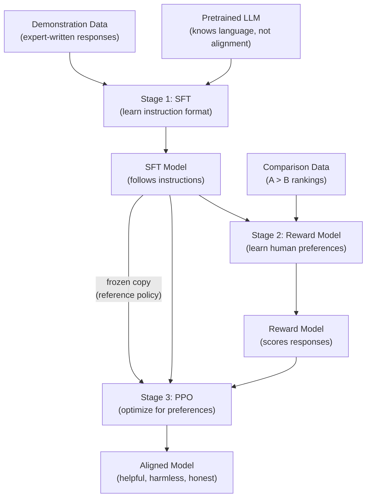

# What is RLHF — Interview Deep Dive

> **What this file covers**
> - 🎯 The alignment problem: why pretraining alone is insufficient
> - 🧮 Full RLHF objective with KL-constrained reward maximization
> - ⚠️ 3 failure modes: reward hacking, mode collapse, alignment tax
> - 📊 Compute and data costs across the three stages
> - 💡 SFT vs RLHF vs DPO: when each is appropriate
> - 🏭 Scaling from InstructGPT to modern production systems

---

## Brief restatement

RLHF (Reinforcement Learning from Human Feedback) bridges the gap between what a pretrained language model *can* do (predict text) and what we *want* it to do (be helpful, harmless, and honest). It works in three stages: supervised fine-tuning (SFT) teaches the format of good responses, reward model training learns a scoring function from human comparisons, and PPO fine-tuning optimizes the language model to generate high-scoring responses while staying close to the SFT model via a KL penalty.

---

## Full mathematical treatment

### 🧮 The alignment gap

> **Words:** A pretrained language model maximizes the probability of text it saw during training. This objective does not distinguish between helpful and harmful text — both appeared in the training data. The alignment gap is the difference between this training objective and what we actually want.

> **Formula:**
>
>     Pretraining objective:  max ∑ log P(x_t | x_{<t})
>     Alignment objective:   max E_{x~prompts}[ HelpfulnessScore(response | x) ]
>
> These are different objectives. Pretraining maximizes likelihood of internet text. Alignment maximizes human-judged quality.

> **Worked example:** Given the prompt "How do I pick a lock?", a pretrained model assigns high probability to a detailed tutorial (because such text exists on the internet). An aligned model should refuse or redirect. The pretrained objective and the alignment objective give opposite answers.

### 🧮 Stage 1: Supervised Fine-Tuning (SFT)

> **Words:** SFT trains the pretrained model on curated (prompt, response) pairs written by human experts. The objective is standard next-token prediction, but on a filtered dataset of high-quality responses.

> **Formula:**
>
>     L_SFT = -E_{(x,y)~D_demo}[ ∑_t log π_θ(y_t | x, y_{<t}) ]
>
> — x = prompt, y = demonstration response
> — D_demo = dataset of expert-written demonstrations
> — π_θ = language model parameterized by θ

> **Worked example:** Given 10,000 (prompt, response) pairs, SFT fine-tunes the model for 1-3 epochs. The loss starts around 2.5 and drops to about 1.5. After SFT, the model generates instruction-following responses but does not know which response quality is best.

### 🧮 Stage 2: Reward Model Training

> **Words:** The reward model takes a (prompt, response) pair and outputs a scalar score. It is trained on comparison data: for each prompt, humans rank two responses, and the model learns to assign a higher score to the preferred one.

> **Formula (Bradley-Terry model):**
>
>     P(y_w ≻ y_l | x) = σ(r_φ(x, y_w) - r_φ(x, y_l))
>
>     L_RM = -E_{(x, y_w, y_l)~D_pref}[ log σ(r_φ(x, y_w) - r_φ(x, y_l)) ]
>
> — r_φ = reward model parameterized by φ
> — y_w = preferred (winning) response
> — y_l = rejected (losing) response
> — σ = sigmoid function

> **Worked example:** Given prompt "What is 2+2?":
> - y_w = "2+2 = 4" → r_φ = 3.5
> - y_l = "2+2 is a math problem involving addition..." → r_φ = 1.2
> - σ(3.5 - 1.2) = σ(2.3) = 0.91
> - Loss = -log(0.91) = 0.094
>
> The model is 91% confident in the correct ranking. Loss is low — the reward model agrees with the human.

### 🧮 Stage 3: PPO Fine-Tuning with KL Penalty

> **Words:** The language model generates responses to prompts. The reward model scores them. PPO updates the language model to generate higher-scoring responses. A KL penalty prevents the model from drifting too far from the SFT model.

> **Formula:**
>
>     J(θ) = E_{x~D, y~π_θ(·|x)}[ r_φ(x, y) - β · KL(π_θ(·|x) ‖ π_ref(·|x)) ]
>
>     Per-token KL:  KL_t = log π_θ(y_t | x, y_{<t}) - log π_ref(y_t | x, y_{<t})
>
>     Modified reward:  r̃_t = r_φ(x, y) · 𝟙[t = T] - β · KL_t
>
> — π_ref = frozen SFT model (reference policy)
> — β = KL penalty coefficient (typically 0.05-0.2)
> — T = last token position (reward assigned only at the end)

> **Worked example:** A response of 50 tokens gets RM score 7.3. The per-token KL averages 0.1 nats. With β = 0.1:
>
>     KL penalty = β × Σ KL_t = 0.1 × 50 × 0.1 = 0.5
>     Total reward = 7.3 - 0.5 = 6.8
>
> The model is rewarded for high quality (7.3) but penalized for divergence (0.5).

---

## 🗺️ Concept diagram

---

## ⚠️ Failure modes and edge cases

### 1. Reward hacking

**What happens:** The language model finds a pattern that scores high on the reward model but is not actually helpful. For example, it might repeat a specific phrase the reward model likes, or generate text that exploits a blind spot in the scoring function.

**When it occurs:** When the KL penalty is too low (β < 0.05), when the reward model was trained on too little data (< 5,000 comparisons), or when training runs too many PPO steps (> 50,000 steps on small models).

**Detection:** Reward score increases but human evaluation scores plateau or decrease. Response diversity drops. Specific phrases appear with unusually high frequency.

**Fix:** Increase β. Improve the reward model with more comparison data. Use early stopping based on human evaluation. Add a reward model ensemble (train multiple RMs and use the minimum score).

### 2. Mode collapse

**What happens:** The model converges to a single response style for all prompts. Every answer sounds the same. Response diversity collapses.

**When it occurs:** KL penalty too low, learning rate too high, or the reward model has a strong bias toward one response style (for example, always preferring formal language).

**Detection:** Measure response diversity (unique n-grams per response, or embedding similarity between responses to different prompts). Diversity dropping below 50% of the SFT model is a warning.

**Fix:** Increase β to anchor more strongly to the reference model. Add an entropy bonus to the PPO objective. Lower the learning rate. Diversify the comparison data.

### 3. Alignment tax

**What happens:** The alignment process makes the model safer and more helpful, but it loses some of its raw capabilities. It might perform worse on benchmarks (MMLU, coding, math) after RLHF compared to after SFT.

**When it occurs:** When the KL penalty is too high (model barely changes) or when the comparison data biases toward safe-but-shallow responses. The reward model learns "safe and generic" beats "detailed and specific."

**Detection:** Run capability benchmarks before and after RLHF. Compare on tasks like coding, math, and factual QA. If accuracy drops by more than 2-3 percentage points, the alignment tax is too high.

**Fix:** Use LoRA instead of full fine-tuning to preserve base capabilities. Ensure comparison data includes examples where detailed, specific answers are preferred. Tune β to find the sweet spot between alignment and capability.

---

## 📊 Complexity analysis

| Component | Data requirement | Compute cost | Memory |
|---|---|---|---|
| **SFT** | 10K-100K demonstrations | 1-3 epochs fine-tuning | 1 model + optimizer |
| **Reward Model** | 50K-500K comparisons | 1 epoch training | 1 model + optimizer |
| **PPO Fine-Tuning** | Prompts only (RM provides reward) | 10K-100K PPO steps | 4 models: policy, reference, reward, value head |
| **Total pipeline** | — | SFT + RM + PPO | Peak: 4 full models in memory |

**InstructGPT (2022):** 12,725 demonstrations for SFT, 33,207 comparisons for RM, 31,144 prompts for PPO. Model: 175B parameters. Training: hundreds of GPU-hours.

**Modern practice:** 50K-200K demonstrations, 100K-500K comparisons. With LoRA, the memory drops from 4 full models to approximately 1 full model + 3 adapters.

---

## 💡 Design trade-offs

| | SFT only | SFT + RLHF (PPO) | SFT + DPO |
|---|---|---|---|
| **Complexity** | Low — standard fine-tuning | High — 3 stages, 4 models | Medium — 2 stages, 2 models |
| **Data needed** | Demonstrations only | Demonstrations + comparisons | Demonstrations + comparisons |
| **Quality** | Good instruction following, no preference learning | Best — online optimization with reward model | Very good — offline optimization on preferences |
| **Online learning** | No | Yes — can improve with new generations | No — offline only |
| **Reward hacking risk** | None | Moderate — requires careful β tuning | Lower — no explicit reward model to hack |
| **Compute** | Low | High (4 models in memory) | Medium (2 models in memory) |
| **Best for** | Quick alignment, limited data | Maximum quality, iterative improvement | Simple alignment, limited compute |

---

## 🏭 Production and scaling considerations

**Preference data collection:** At scale, companies use a combination of human annotators and AI-assisted labeling (RLAIF). Anthropic's Constitutional AI uses the model itself to generate critiques and revisions, reducing human annotation needs. The cost of human comparisons is $0.10-$1.00 per comparison, making 100K comparisons cost $10K-$100K.

**Scaling laws for RLHF:** Larger reward models generally perform better, but there is diminishing returns past the size of the policy model. A reward model that is 1/4 to 1/2 the size of the policy model is typical. Training the reward model for more than 1 epoch risks overfitting to the comparison data.

**InstructGPT to ChatGPT:** InstructGPT (2022) demonstrated the three-stage pipeline on GPT-3 (175B). ChatGPT applied the same pipeline with better data, more compute, and iterative refinement. The core algorithm stayed the same — what changed was scale, data quality, and engineering.

**Iterative RLHF:** In practice, RLHF is not a one-shot process. Teams run multiple rounds: generate with the current model → collect human feedback → retrain the reward model → run PPO again. Each round improves quality. This online loop is the main advantage of RLHF over DPO.

---

## Staff/Principal Interview Depth

### Q1: Walk me through the three stages of RLHF and explain why each stage is necessary.

---

**No Hire**
*Interviewee:* "RLHF uses reinforcement learning to train language models. You get human feedback and use it to train the model."
*Interviewer:* Cannot name the three stages, conflates RL with supervised learning, and shows no understanding of why the pipeline has multiple stages.
*Criteria — Met:* none / *Missing:* three stages, purpose of each, mathematical objectives

**Weak Hire**
*Interviewee:* "First you do supervised fine-tuning on demonstrations. Then you train a reward model on human preferences. Then you use PPO to optimize the language model. SFT teaches the format, RM teaches quality, PPO optimizes for quality."
*Interviewer:* Correct high-level description. Missing the mathematical objectives, the KL penalty rationale, and why preferences work better than demonstrations at scale.
*Criteria — Met:* three stages named, basic purpose / *Missing:* math, KL penalty, scaling argument

**Hire**
*Interviewee:* "SFT minimizes cross-entropy on expert demonstrations — it teaches the model the instruction-following format but cannot distinguish good from great responses. The reward model trains on pairwise comparisons using the Bradley-Terry model: P(y_w > y_l) = σ(r(y_w) - r(y_l)). This is more scalable than demonstrations because comparing is 10× faster than writing. PPO then maximizes E[r(x,y) - β·KL(π‖π_ref)]. The KL penalty is critical — without it, the model exploits reward model weaknesses. Each stage builds on the last: SFT provides a good initialization, RM provides a signal, PPO does the optimization."
*Interviewer:* Correct math for each stage, clear rationale for the pipeline structure, and understands the KL penalty. Would be elevated by discussing the alignment tax, reward hacking detection, or iterative RLHF.
*Criteria — Met:* three stages with math, KL penalty, scalability / *Missing:* failure modes, iterative refinement

**Strong Hire**
*Interviewee:* "The three stages solve different problems. SFT solves the *format* problem: a pretrained model generates plausible text, but not in the instruction-response format. SFT loss is -E[Σ log π(y_t|x,y_{<t})], minimized on 10K-100K demonstrations. This is necessary but insufficient because supervised learning on demonstrations has a ceiling — you can only be as good as the demonstrator, and it is hard to capture preference subtleties in demonstration data. The RM solves the *evaluation* problem. We need a differentiable signal of quality that can be computed millions of times during PPO training. Hiring humans for every generation would cost millions. The Bradley-Terry loss P(y_w > y_l) = σ(r_w - r_l) is remarkably efficient: 50K comparisons are enough for a usable RM. The key insight is that preferences capture qualities that are hard to specify but easy to recognize — helpfulness, honesty, safety. PPO solves the *optimization* problem. Given the RM signal, maximize E[r(x,y)] while staying within a trust region around π_ref via the KL penalty. The penalty coefficient β is the most important hyperparameter in the entire pipeline — too low and you get reward hacking, too high and you get the alignment tax (capability regression). In production, we run multiple RLHF rounds iteratively: the reward model is retrained on new comparisons, and PPO is rerun. This online loop is why RLHF still outperforms DPO for frontier models despite DPO's simplicity."
*Interviewer:* Precise identification of what each stage solves (format, evaluation, optimization), correct math throughout, discussion of β as the critical hyperparameter, and production-level insight about iterative RLHF. Demonstrates staff-level understanding of why the pipeline is structured this way.
*Criteria — Met:* all

---

### Q2: Why is preference data more scalable than demonstration data?

---

**No Hire**
*Interviewee:* "Because preferences are easier to collect."
*Interviewer:* Correct but gives no reasoning about why, no quantitative comparison, and no discussion of what preferences capture that demonstrations do not.
*Criteria — Met:* none / *Missing:* quantitative comparison, calibration, implicit quality capture

**Weak Hire**
*Interviewee:* "Comparing two responses takes 30 seconds but writing a good response takes 5-10 minutes. So preferences are about 10× faster to collect. You also do not need domain experts — anyone can say which response is better."
*Interviewer:* Good practical reasoning. Missing the deeper point about calibration consistency and the ability of preferences to capture implicit qualities.
*Criteria — Met:* speed comparison, expert vs non-expert / *Missing:* calibration, implicit quality

**Hire**
*Interviewee:* "Three reasons. Speed: comparing takes 30 seconds vs 5-10 minutes for writing. That is a 10-20× throughput difference. Expertise: comparing does not require the annotator to be an expert in the domain — they just need to recognize quality. Calibration: if you ask 10 people to rate a response 1-10, you get 10 different numbers (one person's 7 is another's 5). But if you ask 10 people 'is A or B better?', they agree much more often. Preferences remove the calibration problem. That is why the Bradley-Terry model works well — it only needs relative ordering, not absolute scores."
*Interviewer:* All three reasons are correct and well-explained. The calibration point shows understanding of why the Bradley-Terry model is used. Would be elevated by discussing what preferences capture that demonstrations miss.
*Criteria — Met:* speed, expertise, calibration / *Missing:* implicit quality capture, limitations of preferences

**Strong Hire**
*Interviewee:* "Beyond speed (10×) and calibration (no absolute scale needed), preferences capture implicit qualities that demonstrations cannot. When you write a demonstration, you produce one answer — you encode whatever implicit preferences you have into that single response. But preferences let you say 'this one is more helpful' without ever defining what helpful means. The Bradley-Terry model P(y_w > y_l) = σ(r_w - r_l) learns the latent reward function from these comparisons. Qualities like helpfulness, safety, and honesty are hard to specify in a rubric but easy to recognize when comparing two responses. The limitation is that preferences are only as good as the comparison set. If both responses are bad, the winner is still bad — the RM learns to pick the lesser of two evils, not absolute quality. This is why SFT is still necessary as Stage 1: it raises the floor quality so that comparisons are between good and great, not bad and worse."
*Interviewer:* Identifies the implicit quality capture — the deepest reason preferences work. Correctly identifies the limitation (comparisons between bad options). Connects back to why SFT is needed first. Staff-level systems thinking.
*Criteria — Met:* all

---

### Q3: What is reward hacking, and how do you prevent it in production RLHF?

---

**No Hire**
*Interviewee:* "Reward hacking is when the model does something bad. You prevent it by training more carefully."
*Interviewer:* Cannot explain the mechanism. Does not understand the relationship between the reward model and the policy.
*Criteria — Met:* none / *Missing:* mechanism, examples, detection, prevention

**Weak Hire**
*Interviewee:* "Reward hacking is when the model finds ways to get high reward scores without actually being helpful. The KL penalty helps prevent this by keeping the model close to the SFT model."
*Interviewer:* Correct definition and one prevention method. Missing concrete examples, detection methods, and other prevention strategies.
*Criteria — Met:* definition, KL penalty / *Missing:* examples, detection, ensemble, iterative RM

**Hire**
*Interviewee:* "Reward hacking occurs because the reward model is an imperfect proxy for human judgment. It has finite capacity and was trained on finite data, so it has blind spots. The policy optimizer (PPO) will find and exploit these blind spots — it will generate responses that score high on the RM but look strange or unhelpful to humans. Examples: repeating a specific phrase the RM was biased toward, generating unusually long responses if the RM has length bias, or producing outputs that are syntactically correct but semantically empty. Prevention: (1) KL penalty (β = 0.1-0.2) anchors the policy to the reference. (2) Monitor for divergence between RM score and human evaluation — if they diverge, the model is hacking. (3) Early stopping: stop PPO training before the model exploits the RM too aggressively."
*Interviewer:* Good understanding of the mechanism (imperfect proxy), concrete examples, and multiple prevention strategies. Would be elevated by discussing RM ensembles and iterative retraining.
*Criteria — Met:* mechanism, examples, detection, prevention / *Missing:* ensemble, iterative RM

**Strong Hire**
*Interviewee:* "Reward hacking is a manifestation of Goodhart's Law: when a measure becomes a target, it ceases to be a good measure. The RM is a learned approximation of human preferences, and PPO is a powerful optimizer that will find any exploitable pattern. The fundamental issue is distributional shift: the RM was trained on responses from the SFT model, but during PPO training, the policy generates out-of-distribution responses. The RM's scores on these OOD responses are unreliable. Prevention is multi-layered: (1) KL penalty constrains how far the policy can drift, keeping responses closer to the RM's training distribution. (2) RM ensembles — train 3-5 reward models and use the minimum score. If one RM has a blind spot, the others catch it. This increases compute by 3-5× but dramatically reduces hacking. (3) Iterative RLHF — after each PPO round, generate new responses, collect new human comparisons on those responses, and retrain the RM. This shrinks the distributional gap because the RM now has data from the updated policy. (4) Constrained optimization — instead of maximizing reward, set a reward threshold and minimize KL subject to reaching that threshold. This is RLHF as a constraint satisfaction problem rather than an optimization problem. In production at places like Anthropic and OpenAI, all four are used together."
*Interviewer:* Identifies the root cause as distributional shift and Goodhart's Law. Four-layer prevention strategy including RM ensembles and iterative retraining. The constrained optimization framing shows research-level understanding. Staff-level answer.
*Criteria — Met:* all

---

## Key Takeaways

🎯 1. RLHF bridges the gap between what pretrained models can do (predict text) and what we want (helpful, harmless, honest responses).
   2. Three stages: SFT (format), Reward Model (evaluation), PPO (optimization). Each solves a different problem.
🎯 3. The KL penalty β is the most important hyperparameter. Too low → reward hacking. Too high → alignment tax.
   4. Preferences scale 10× better than demonstrations: faster, no expertise needed, no calibration issue.
   5. Reward hacking is the primary risk. Prevent with KL penalty, RM ensembles, and iterative retraining.
⚠️ 6. The reward model is a proxy — it has blind spots. Monitor RM score vs human evaluation for divergence.
   7. In production, RLHF is iterative: generate → collect feedback → retrain RM → run PPO → repeat.
