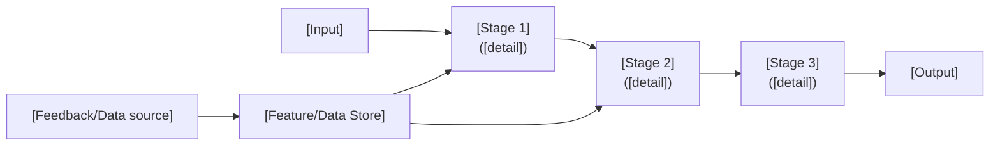
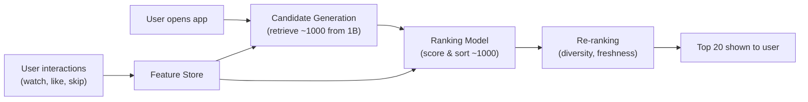
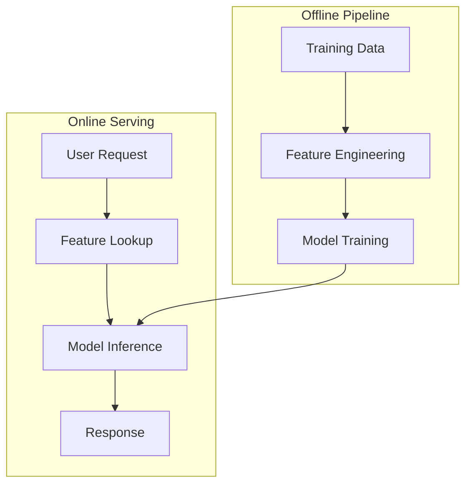

# CLAUDE-MOCK-INTERVIEWS.md

Instructions for generating mock interview content modeled after the hellointerview.com "ML System Design in a Hurry" format.

---

## Section 1: Purpose & Scope

This file tells Claude how to generate two types of interview prep content:

**Type A — Core Concept Pages** (framework/methodology files)
- Cover cross-cutting topics every ML design candidate needs
- ML Design examples: Feature Engineering, Embeddings, Calibration, Loss Functions
- genAI Design examples: Decoding Strategies, RLHF & Alignment, RAG Architecture, Diffusion Models
- Output: one `.md` file per concept
- ML Design placement: `ML Design/01-ml-design-prep/`
- genAI Design placement: `genAI design/01-intro-and-framework/`
- 12 ML Design + 10 genAI Design = **22 concept pages**

Note: Delivery Framework, Evaluation, and Generalization are already covered by the hellointerview HTML files in `ML Design/examples/` — these are NOT recreated.

**Type B — Case Study Breakdowns** (per-case-study mock interviews)
- Full system design walkthrough for a specific product/problem
- Output: one `mock-interview.md` file per case study directory
- 10 ML Design + 10 genAI Design = **20 case study files**

---

## Section 2: Output File Naming & Location

### ML Design core concept pages (12 files)

Note: Delivery Framework, Evaluation, and Generalization are already covered by the hellointerview HTML files in `ML Design/examples/`. Do not create new pages for those three topics.

```
ML Design/01-ml-design-prep/feature-engineering.md
ML Design/01-ml-design-prep/embeddings-and-representation-learning.md
ML Design/01-ml-design-prep/training-data-and-labeling.md
ML Design/01-ml-design-prep/model-selection-and-architecture.md
ML Design/01-ml-design-prep/loss-functions.md
ML Design/01-ml-design-prep/serving-and-inference.md
ML Design/01-ml-design-prep/experimentation-and-ab-testing.md
ML Design/01-ml-design-prep/monitoring-and-observability.md
ML Design/01-ml-design-prep/retrieval-and-ranking.md
ML Design/01-ml-design-prep/sampling-and-negative-mining.md
ML Design/01-ml-design-prep/calibration.md
ML Design/01-ml-design-prep/fairness-and-bias.md
```

### genAI Design core concept pages (10 files)

Note: The existing `README.md` in `genAI design/01-intro-and-framework/` already covers generative model families and discriminative vs generative models. Do not duplicate that content.

```
genAI design/01-intro-and-framework/decoding-and-sampling-strategies.md
genAI design/01-intro-and-framework/fine-tuning-and-adaptation.md
genAI design/01-intro-and-framework/rlhf-and-alignment.md
genAI design/01-intro-and-framework/prompt-engineering-and-in-context-learning.md
genAI design/01-intro-and-framework/rag-architecture-patterns.md
genAI design/01-intro-and-framework/diffusion-model-fundamentals.md
genAI design/01-intro-and-framework/genai-evaluation-methods.md
genAI design/01-intro-and-framework/latency-and-cost-optimization.md
genAI design/01-intro-and-framework/safety-and-content-filtering.md
genAI design/01-intro-and-framework/tokenization-and-vocabulary.md
```

### Case study breakdowns (20 files)

```
ML Design/02-visual-search/mock-interview.md
ML Design/03-google-street-view/mock-interview.md
ML Design/04-youtube-video-search/mock-interview.md
ML Design/05-harmful-content-detection/mock-interview.md
ML Design/06-video-recommendation/mock-interview.md
ML Design/07-event-recommendation/mock-interview.md
ML Design/08-ad-click-prediction/mock-interview.md
ML Design/09-similar-listing/mock-interview.md
ML Design/10-personalized-news-feed/mock-interview.md
ML Design/11-people-you-may-know/mock-interview.md

genAI design/02-gmail-smart-compose/mock-interview.md
genAI design/03-google-translate/mock-interview.md
genAI design/04-chatgpt-chatbot/mock-interview.md
genAI design/05-image-captioning/mock-interview.md
genAI design/06-rag/mock-interview.md
genAI design/07-realistic-face-generation/mock-interview.md
genAI design/08-high-res-image-synthesis/mock-interview.md
genAI design/09-text-to-image/mock-interview.md
genAI design/10-personalized-headshots/mock-interview.md
genAI design/11-text-to-video/mock-interview.md
```

Skip `01-*` directories for case study breakdowns — those get core concept pages instead.

### Total: 42 files

| Category | Count | Location |
|----------|-------|----------|
| ML Design core concepts | 12 | `ML Design/01-ml-design-prep/` |
| genAI Design core concepts | 10 | `genAI design/01-intro-and-framework/` |
| ML Design case studies | 10 | `ML Design/02-*/ through 11-*/` |
| genAI Design case studies | 10 | `genAI design/02-*/ through 11-*/` |

---

## Section 3: Source Material

### For core concept pages

1. Existing content in the `01-*` directories (README, notebooks)
2. The hellointerview example pages in `ML Design/examples/` — use as style and format references
3. Standard ML/AI industry knowledge on the topic

### For case study breakdowns

1. `README.md` — the full design reference (7-step framework content)
2. `staff_interview_guide.md` — the interviewer rubric and calibration levels
3. `INTERVIEW.md` — candidate-facing interview prep (genAI Design only, not all directories have this)
4. Existing notebooks in the case study directory (`01_` through `04_`) — for technical details and implementation context
5. The hellointerview example pages in `ML Design/examples/` — use as style and format references
6. Standard industry knowledge relevant to the problem domain

### Reading order before writing

**Before writing a case study breakdown:**
1. Read the case study's `README.md`
2. Read `staff_interview_guide.md`
3. Read `INTERVIEW.md` (if it exists — genAI Design only)
4. Skim existing notebooks (`01_` through `04_`) for technical details and implementation context
5. Read at least two hellointerview example case studies in `ML Design/examples/` for style reference (the HTML files)
6. Generate the mock interview using source files + standard industry knowledge

**Before writing a core concept page:**
1. Read existing content in the `01-*` directory
2. Read the relevant hellointerview framework page in `ML Design/examples/` for style reference (the HTML files)
3. Generate using existing content + standard industry knowledge

---

## Section 4: Core Concept Page Structure (Type A)

Core concept pages teach a cross-cutting skill. They follow the hellointerview framework style: practical, interview-focused, with concrete examples and clear leveling.

### Template

```markdown
# [Topic Name]

## Introduction
[1-2 paragraphs. What is this concept? Why does every ML design candidate need it?
Frame it as a skill that shows up in every interview, not an academic topic.
Use a direct hook: "One of the most common mistakes we see..." or
"If you've been working on X and get asked about Y in an interview..."]

## [Main Framework / Core Content]
[The substance of the page. Structure varies by topic type — see below.]

## What is Expected at Each Level?
[See Section 6 for format. Required for all core concept pages.]

## References
[Key papers, blog posts, or resources. Only include if there are specific references worth linking.]
```

### Topic type: Delivery Framework

For pages that teach a structured approach to the interview itself.

```markdown
## [Phase Name] (X minutes)

[1-2 paragraphs explaining what happens in this phase and why it matters.]

### [Sub-step 1]
[What to do, what to say, what to avoid. Use concrete examples from real systems
(YouTube, Instagram, Gmail, etc.). Include sample candidate dialogue as blockquotes:]

> "I want to start by understanding the scope. Are we building this for a specific
> platform, or is this a general-purpose system?"

### [Sub-step 2]
[...]

### Summary

**Green Flags**
- You asked detailed questions that uncovered what makes this problem unique
- You established a clear business objective before diving into ML
- You [specific positive behavior for this phase]

**Red Flags**
- You assumed a naive ML objective without discussion
- You jumped straight to model architecture without understanding the problem
- You [specific negative behavior for this phase]
```

**Green Flags / Red Flags rules:**
- Place at the end of each major phase/section, not at the end of the whole document
- Each list has 3-5 items
- Every item must be specific to the phase — not generic interview advice
- Write in second person: "You asked..." not "The candidate asked..."
- Green flags describe observable behaviors, not knowledge: "You probed for data availability constraints" not "You know about data availability"

### Topic type: Evaluation Framework

For pages that teach how to evaluate ML systems across problem types.

```markdown
## General Evaluation Framework for Interviews

[Introduce the 5-step progression:]
1. **Business Objective** — What does the business care about?
2. **Product Metrics** — What user-facing metrics indicate success?
3. **ML Metrics** — What technical metrics align with product goals?
4. **Evaluation Methodology** — How do we measure? (offline + online)
5. **Address Challenges** — What are the pitfalls?

[Brief explanation of why this progression matters in an interview.]

## [Problem Type 1] (e.g., Classification Systems)

### Business Objective
[What businesses typically optimize for in this problem type. Concrete examples.]

### Product Metrics
[User-facing metrics with explanations of what they capture and when to use each.]

### ML Metrics
[Technical metrics with formulas, intuitions, and when-to-use guidance.
Format each metric as:]

- **[Metric Name]**: [Intuitive explanation]. Formula: `[formula]`.
  Use when [specific situation]. Pitfall: [common mistake].

### Evaluation Methodology
[Offline and online evaluation approaches. Include:]
- Offline: test set construction, cross-validation, temporal splits
- Online: A/B testing, shadow mode, interleaving experiments
- When to use each approach

### Address Challenges

#### [Challenge 1] (e.g., Class Imbalance)
[2-3 paragraphs: what the challenge is, why it matters, how to handle it.
Include concrete numbers: "In content moderation, harmful content is typically
less than 0.1% of all content..."]

#### [Challenge 2]
[...]

## [Problem Type 2] (e.g., Recommender Systems)
[Same sub-structure: Business Objective → Product Metrics → ML Metrics →
Evaluation Methodology → Address Challenges]

## [Problem Type 3]
[...]

## Appendix: Intuitive Explanation of Key Metrics
[Optional. For metrics that need more explanation than a single line.
Group by metric type: Classification, Ranking, Generation, etc.]
```

**Evaluation page rules:**
- Every metric must have: name, intuition, formula, when-to-use, and at least one pitfall
- Formulas use inline code formatting: `precision = TP / (TP + FP)`
- Group metrics by problem type, not alphabetically
- Always connect ML metrics back to business objectives — explain *why* this metric matters, not just what it measures
- The "Address Challenges" section must include concrete solutions, not just descriptions of problems

### Topic type: Concept Deep-Dive

For pages that teach a specific ML concept (e.g., Generalization, Feature Engineering).

```markdown
## [Concept Area 1] (e.g., Overfitting and Underfitting)

### [Sub-topic 1] (e.g., Spotting the Difference)
[Explanation with concrete examples. Use loss curve analysis where relevant.
Include specific numbers: "If your training loss is 0.01 but validation loss is 0.8..."]

### [Sub-topic 2] (e.g., Model Capacity and Data Requirements)
[Practical guidance tied to interview scenarios.]

### [Sub-topic 3]
[...]

## [Concept Area 2] (e.g., Data Drift)

### [Sub-topic 1] (e.g., Types of Data Drift)
[...]

### [Sub-topic 2] (e.g., Detecting Data Drift)
[...]

## [Concept Area 3] (e.g., Regularization)
[...]

## Summary
[1-2 paragraphs recapping the key points and connecting them back to interview
performance. What should the candidate take away?]
```

### Core concept page rules

- Every section must be actionable — "here's what to do in the interview", not "here's the theory"
- Use **Green Flags / Red Flags** callouts in framework pages to show what interviewers reward vs penalize
- Include concrete examples from real systems (YouTube, Instagram, Gmail, etc.)
- Metrics sections must include formulas with intuition, not just names
- Keep it dense but scannable — tables, bullet points, and short paragraphs
- Intersperse practical interview coaching naturally: "Feature discussions are easily the biggest tarpit for candidates because there's just so much to talk about."
- Use blockquotes to show sample candidate dialogue where it helps

---

## Section 5: Case Study Breakdown Structure (Type B)

Case study breakdowns walk through a complete ML system design for one product/problem. They follow the hellointerview case study format: conversational problem framing, progressive architecture, deep dives.

### Template

```markdown
# [Product/System Name] ML System Design

## Understanding the Problem

**What is [Platform/Product]?**

[2-3 sentences explaining what the platform/product does for users. Then transition
to why the ML problem matters. Keep it grounded:]

"[Platform] serves [X] users who [do Y]. The ML challenge here is [Z] — and it's
harder than it sounds because [specific reason]."

## Problem Framing

### Clarify the Problem

[Conversational Q&A format simulating the first minutes of an interview.
Present as a bullet list alternating between candidate questions and interviewer
answers:]

- What types of [X] are we dealing with? Are we focused on [specific scope]
  or the full range?
- Let's focus on [specific scope]. We have about [N] items in our catalog,
  with [M] new ones added daily.

- How many users are we serving? What's our scale?
- We have roughly [N] daily active users across [platforms].

- What are the latency requirements?
- We need results within [X]ms for the core experience. Some offline
  components can run in batch.

- Do we have labeled training data, or are we working with implicit signals?
- We have [description of available data]. Labels are [abundant/scarce/noisy].

[4-8 Q&A pairs. Cover: scope, scale, users, constraints, data availability,
latency, content types, geographic/language considerations.]

### Establish a Business Objective

[Show progressive sophistication. Each level gets a bold heading, a one-line
summary, and 1-2 paragraphs explaining why it's at that level:]

#### Bad Solution: [Naive metric]
[Why this metric seems reasonable but fails. Be specific about the failure mode.
Example: "This incentivizes the system to flag as much content as possible,
including borderline cases that aren't actually harmful..."]

#### Bad Solution: [Another naive approach] (optional — use when there are multiple bad options)
[Why this also fails, for a different reason than the first.]

#### Good Solution: [Better metric]
[What this captures that the bad solutions miss. What it still doesn't handle.
Example: "This is better because it accounts for [X], but it still misses [Y]..."]

#### Great Solution: [Multi-stakeholder / long-term metric]
[Why this is the best framing. Must include multiple stakeholder perspectives
(user + creator/content + platform) or long-term effects. Even the great solution
gets caveats: "The downside is that [X] is harder to measure..."]

### Decide on an ML Objective

[Translate the business objective into a concrete ML task. Define:]
- Task type: classification, ranking, retrieval, generation, etc.
- Concrete objective function or formulation
- How this connects to the business objective above

## High Level Design

[System architecture overview. Start with a Mermaid diagram:]



[Brief description of each component and how they connect. 2-3 paragraphs max.
This is the "2-3 minute whiteboard sketch" moment. Include a coaching note:]

"Don't get hung up on the diagram itself in the interview — it's a mechanism
for communicating your ideas, not a final product on which you'll be assessed."

## Data and Features

### Training Data

[What data is available? How is it collected? For each data source, use H4:]

#### [Data Source 1] (e.g., User Interaction Logs)
[What it captures, how it's collected, volume estimates, biases or quality issues.
Include concrete numbers: "~10B interaction events per day, with a 3:1 ratio of
implicit to explicit signals."]

#### [Data Source 2] (e.g., Content Metadata)
[...]

#### [Data Source 3] (e.g., Human Labels)
[If applicable: labeling process, inter-annotator agreement, cost, coverage.]

### Features

[Group by category. Each category gets an H4. Within each category, use bullet
points with bold feature names:]

#### [Category 1] Features (e.g., User Features)
- **[Feature name]**: [Why it's predictive, how to encode it, any engineering considerations]
- **[Feature name]**: [...]

#### [Category 2] Features (e.g., Item/Content Features)
- **[Feature name]**: [...]

#### [Category 3] Features (e.g., Context Features)
- **[Feature name]**: [...]

#### [Category 4] Features (e.g., Cross Features / Interaction Features)
- **[Feature name]**: [...]

[End with a brief note on feature engineering pitfalls:]

"Be careful of getting caught up in a naive feature dump! Maintaining focus on the
most impactful features and keeping moving are essential."

## Modeling

### Benchmark Models

[Start simple. What's the naive baseline? What's the standard industry approach?
Use blockquotes to show candidate dialogue:]

> "We definitely don't have enough data to train a large model from scratch.
> I'd start with a baseline of [simple model] to establish a performance floor."

[Explain the baseline: what it captures, what it misses, why it's useful as
a comparison point.]

### Model Selection

[Compare 2-3 model families using the progressive quality pattern:]

#### Bad Solution: [Naive model choice]
[Why this seems reasonable but falls short. Example: "Matrix factorization was
state of the art in 2010, but it can't incorporate the rich feature set we
discussed..."]

#### Good Solution: [Solid model choice]
[What this gets right. What it still struggles with. Example: "A two-tower model
handles the retrieval well, but the late interaction means we lose fine-grained
feature crossing..."]

#### Great Solution: [Best model choice]
[Why this is the strongest approach for this specific problem. Include a tradeoff
table:]

| Approach | Pros | Cons | When to use |
|----------|------|------|-------------|
| [Model A] | [strengths] | [weaknesses] | [scenario] |
| [Model B] | [strengths] | [weaknesses] | [scenario] |
| [Model C] | [strengths] | [weaknesses] | [scenario] |

### Model Architecture

[Detail the chosen architecture. Use H4 for major components:]

#### [Component 1] (e.g., Embedding Layer)
[Architecture details, dimensions, what it learns.]

#### [Component 2] (e.g., Interaction Layer)
[How components connect, what computation happens.]

#### [Component 3] (e.g., Output Layer)
[Final prediction, calibration if needed.]

### Loss Function

[Present the loss function with inline code formatting:]

`L = [formula]`

where:
- `[symbol]` = [meaning]
- `[symbol]` = [meaning]

[If multi-task: show how losses combine:]

`L_total = alpha * L_primary + beta * L_secondary`

[Explain the hyperparameters and how to tune them.]

## Inference and Evaluation

### Inference

[How does the model serve predictions in production?]

#### Scaling
[Latency requirements and how to meet them. Include specific numbers:
"To serve 1B daily requests with p99 latency under 200ms..."]
- Batching, caching, distillation, quantization strategies
- Multi-stage pipeline if applicable (candidate generation -> ranking -> re-ranking)

#### Triggering
[When does the system run? Real-time vs batch. Event-driven vs periodic.]

### Evaluation

#### Offline Evaluation

| Metric | What it measures | When to use |
|--------|-----------------|-------------|
| [metric] | [description] | [scenario] |
| [metric] | [description] | [scenario] |

[How to construct test sets. Temporal splits vs random splits. Bias considerations.]

#### Online Evaluation
- A/B testing approach: what to randomize, what to hold constant
- What to measure and for how long
- Guardrail metrics: what must NOT degrade
- Statistical significance: sample size, duration

## Deep Dives

[8-12 advanced topics specific to this problem. These are the questions that come
up when the interviewer wants to go deeper. See Section 9 for the full deep dive
topic bank organized by problem type.]

### [Deep Dive 1: Problem-specific topic]

[2-4 paragraphs explaining the issue, why it matters, and how to handle it.
Include concrete examples and numbers. Use emoji markers where appropriate:]

⚠️ [For failure modes and risks]
💡 [For design insights and non-obvious solutions]
📊 [For complexity, scale, and performance]
🏭 [For production and operational concerns]
🔄 [For feedback loops and iterative effects]
🧊 [For cold start problems]
⚖️ [For fairness, bias, and ethical considerations]
🔒 [For privacy and security concerns]

### [Deep Dive 2]
[...]

### [Deep Dive 3]
[...]

[... continue for 8-12 total deep dives]

### [Deep Dive N]
[...]

## What is Expected at Each Level?

[See Section 6 for format. Required for all case study breakdowns.]

## References

[Key papers, blog posts, systems. Only include if there are specific references
worth citing. Format as a bullet list with brief annotations:]

- [Paper/Resource name] — [one-line description of relevance]
```

### Case study breakdown rules

- The "Clarify the Problem" section MUST use conversational Q&A format — this is what makes it feel like an interview, not a textbook. Present as alternating bullet points, not a table or labeled dialog.
- The "Establish a Business Objective" section MUST show progressive sophistication using the **Bad Solution / Good Solution / Great Solution** heading pattern. Always explain *why* each is at its level.
- Include at least one Mermaid diagram for the high-level system design. Use `flowchart LR` or `flowchart TD`. Keep to 5-12 nodes. Annotate nodes with key details (latency targets, data sizes, model types).
- Deep dives must be problem-specific, not generic. Not "monitoring" but "how to detect recommendation feedback loops causing filter bubbles."
- Every model choice must have a "why not X?" comparison.
- Every metric must have an intuition, not just a name and formula.
- Use blockquotes to show sample candidate dialogue at key moments — what a strong candidate would actually say in the interview.
- Include practical coaching asides naturally: "Feature discussions are easily the biggest tarpit for candidates..." or "I'd earmark cold-start for a deep dive later."
- All numbers must be concrete: "1B daily active users" not "large-scale system", "p99 latency under 200ms" not "low latency."

---

## Section 6: "What is Expected at Each Level?" Format

Both core concept pages and case study breakdowns end with this section. It MUST be tailored to the specific topic — never generic.

Note: This uses 3 experience levels (Mid-Level, Senior, Staff) matching the hellointerview format. This is different from the 4-level hiring rubric (No Hire, Weak Hire, Hire, Strong Hire) used in `staff_interview_guide.md` and `INTERVIEW.md` — those files assess hiring decisions, while this section helps candidates self-assess their preparation depth.

### Template

```markdown
## What is Expected at Each Level?

### Mid-Level Engineer

[2-3 sentences. For this specific problem/topic, what does "competent" look like?
Focus on: can they frame the problem correctly, pick reasonable approaches, work
through basic tradeoffs, speak to basic production concerns.]

[Use a concrete example tied to this problem: "For video recommendation, a mid-level
candidate should be able to articulate a basic two-tower retrieval model and explain
why collaborative filtering alone isn't sufficient at scale."]

[How they differentiate: "Mid-level candidates differentiate by delivering a credibly
workable solution — they won't cover every edge case, but their core design holds up
under scrutiny."]

### Senior Engineer

[2-3 sentences. What deeper expertise shows? For this specific problem: stronger
feature engineering choices, broader model toolkit, recognizes production difficulties
(feedback loops, data drift, cold start), balances competing objectives, brings up
A/B testing and monitoring unprompted.]

[Concrete example: "A senior candidate will proactively discuss the tradeoff between
engagement optimization and content diversity, and propose specific mechanisms
(e.g., explore/exploit, diversity constraints) to avoid filter bubbles."]

### Staff Engineer

[2-3 sentences. What does "breeze through the basics and focus on impact" look like?
They quickly establish core architecture then go deep on the most challenging areas.
Solid understanding of relevant research. Volunteers challenges proactively. Leads
deep-dive discussions.]

[Concrete example: "A Staff candidate will recognize that the biggest risk in video
recommendation isn't model accuracy — it's the feedback loop where the model's own
recommendations shape the training data, creating filter bubbles and degrading
long-term user satisfaction."]

[Staff level always includes systemic thinking: feedback loops, data quality,
multi-stakeholder effects, organizational/process considerations.]
```

### Rules

- Every statement MUST be specific to this topic/case study — never reuse the same paragraph across files
- Use concrete examples from the problem domain
- The tone should help readers self-assess: "If you can do X, you're at Senior level. If you also do Y and Z, you're at Staff."
- Mid -> Senior -> Staff should show clear, progressive differentiation
- Write in descriptive prose, not bullet points or rubrics — describe what interviewers have observed
- Staff level always identifies the *real* bottleneck (often not model architecture but data quality, evaluation methodology, or system-level feedback loops)

---

## Section 7: Writing Style

### Tone

Write like a senior engineer who has conducted hundreds of ML design interviews, coaching a colleague who is preparing for one. Not a professor. Not a textbook. Not a tutorial.

**Key tone patterns to follow:**

Direct address to the reader as "you" (the interview candidate):
- "Your job is to show this by taking an ambiguous problem and clearly demonstrating how you'd approach it."
- "If you've been working on time series forecasting and are asked about recommendation systems, you're at a disadvantage if you haven't prepared."

Candid real-world observations:
- "In most ML teams, especially in big companies, teams will spend years optimizing a fairly narrow business objective."
- "A lot of material online about recommendation systems focuses on matrix factorization or collaborative filtering. These aren't state of the art anymore."

Practical interview coaching interjected naturally:
- "Feature discussions are easily the biggest tarpit for candidates because there's just so much to talk about."
- "Earmarking is a useful technique for managing this tradeoff — you make a verbal note to your interviewer that you'd expect to cover a specific topic later."

Explicit warnings about common mistakes:
- "One of the most common mistakes we see from candidates is jumping straight into the problem without taking time to clarify."
- "The biggest mistake candidates make here is assuming that one large multi-modal LLM is going to solve the problem."

Acknowledging when things are hard or uncertain:
- "It's ok to volunteer that you don't know some details."
- "Note that candidates outside the trust and safety domain may not be familiar with the full depth of features here. That's ok."

### Formatting rules

- Short paragraphs. One idea per paragraph. Break up walls of text.
- Use tables for comparisons — never describe tradeoffs in prose when a table would be clearer.
- Use **bold** for key terms on first use, then use them normally after.
- Use inline code for formulas: `precision = TP / (TP + FP)`
- Use blockquotes for sample candidate dialogue:
  > "I expect this domain to drift considerably over time. I'm going to have automated retraining once a week..."
- Use bullet lists for features, data sources, and metrics — not numbered lists (unless order matters).
- Concrete over abstract: "1B daily active users" not "large-scale system", "p99 latency under 200ms" not "low latency", "~500K new videos uploaded daily" not "high upload volume."

### What NOT to do

- Do not use idioms ("under the hood", "out of the box", "rule of thumb")
- Do not use dismissive phrases ("trivially", "obviously", "as you can see")
- Do not use academic tone ("we propose", "it can be shown that", "the reader will note")
- Do not use emoji for decoration — only use emoji markers in deep dive sections (⚠️ 💡 📊 🏭 🔄 🧊 ⚖️ 🔒 — see Section 9 for full list) and in Green Flags / Red Flags lists
- Do not write long paragraphs — if a paragraph is longer than 4 sentences, break it up
- Do not describe tradeoffs in prose when a table would be clearer

---

## Section 8: Mermaid Diagrams

Every case study breakdown includes at least one Mermaid diagram for the high-level system design. Core concept pages include diagrams where they help clarify flow or relationships.

### Rules

- Use `flowchart TD` (top-down) or `flowchart LR` (left-right) — renders natively on GitHub
- Annotate nodes with key details: latency targets, data sizes, model types
- Keep diagrams readable: 5-12 nodes max. Split into multiple diagrams if the system is complex.
- Every diagram gets a markdown heading or introductory sentence above it
- Use `\n` within node labels for multi-line text

### Example

````markdown
### High Level Design


````

### Diagram style guide

- Nodes use square brackets with quotes: `A["Label"]`
- Edge labels only when they add clarity — don't label every arrow
- Data flows go left-to-right; processing stages go top-to-bottom
- Use subgraphs to group related components if the diagram has more than 8 nodes:

````markdown

````

---

## Section 9: Deep Dive Section Rules

Deep dives go at the end of case study breakdowns, before "What is Expected at Each Level?". They cover advanced topics an interviewer might probe after the core design is established.

### Rules

- **8-12 deep dives per case study**, always problem-specific. This is the section that separates strong candidates from weak ones — go deep and go wide.
- Each deep dive: 2-4 paragraphs explaining the issue, why it matters, and how to address it
- Include concrete examples and numbers where possible
- Use emoji markers at the start of key insights within deep dives:
  - ⚠️ for failure modes and risks
  - 💡 for design insights and non-obvious solutions
  - 📊 for complexity, scale, and performance considerations
  - 🏭 for production and operational concerns
  - 🔄 for feedback loops and iterative effects
  - 🧊 for cold start problems
  - ⚖️ for fairness, bias, and ethical considerations
  - 🔒 for privacy and security concerns
- If equations are needed, follow the three-step rule: words -> formula -> worked example
- Each deep dive should cover something an interviewer might probe — the long tail of follow-up questions
- Deep dives should feel like the candidate is driving the conversation: "I see we've got only a few minutes left — I wanted to talk about cold start, explore/exploit, and feedback loops."
- Organize deep dives from most likely to be asked to most advanced. The first 5 should be topics any Staff candidate must nail; the remaining 5-7 demonstrate exceptional depth and breadth.

### Deep dive topic bank by problem type

Each case study should pick 8-12 from its relevant list. Every topic below is a full deep dive — not a one-liner.

**Recommendation systems:**
1. Feedback loops — how the model's recommendations shape future training data, creating filter bubbles and popularity amplification. Detection via diversity metrics over time. Mitigation via exploration budgets and counterfactual logging.
2. Cold start — new users (no history), new items (no interactions). Separate strategies for each: content-based features for items, demographic/onboarding signals for users, bandit-based exploration for both.
3. Explore/exploit tradeoff — epsilon-greedy, Thompson sampling, contextual bandits. How much traffic to allocate to exploration. Impact on short-term metrics vs long-term catalog health.
4. Position bias — items shown higher get more clicks regardless of relevance. Inverse propensity scoring, position-aware models, unbiased learning-to-rank. How to construct unbiased training data.
5. Multi-objective optimization — engagement vs satisfaction vs revenue vs diversity. Scalarization (weighted sum), Pareto optimization, constrained optimization. How to set weights and who decides.
6. Real-time vs batch inference — what needs to be real-time (user context, trending items) vs what can be precomputed (item embeddings, user profiles). Hybrid architectures with precomputed candidates + real-time re-ranking.
7. Popularity bias and long-tail content — models amplify popular items, starving niche content. Calibration techniques, exposure fairness constraints, creator-side metrics.
8. Implicit vs explicit feedback — clicks, dwell time, skips, saves, shares each carry different signal strength. Negative sampling strategies. Handling missing-not-at-random data.
9. Multi-modal content understanding — incorporating video, audio, text, thumbnails into item embeddings. Fusion strategies (early, late, cross-attention). Computational cost vs signal gain.
10. Temporal dynamics — user preferences change over time, seasonal trends, trending topics. Session-based models vs long-term preference models. How to weight recent vs historical behavior.
11. Serving architecture at scale — candidate generation (ANN retrieval from billions), ranking (score thousands), re-ranking (policy layer). Latency budgets at each stage. Feature store architecture.
12. A/B testing pitfalls — network effects (one user's recommendations affect another's behavior), novelty effects, long-term vs short-term metrics divergence, holdout contamination.

**Content moderation:**
1. Class imbalance — harmful content is typically <0.1% of all content. Impact on precision/recall tradeoff. Sampling strategies, focal loss, cost-sensitive learning. Why accuracy is meaningless.
2. Adversarial content evolution — bad actors actively adapt to evade detection. Character substitution, code words, steganography. Concept drift timelines (days, not months). Retraining cadence.
3. Multi-modal detection — harmful content spans text, images, video, audio, and combinations. Per-modality classifiers vs cross-modal fusion. Computational budget allocation across modalities.
4. Human-in-the-loop — reviewer queue prioritization, reviewer fatigue, inter-annotator disagreement. Active learning to maximize reviewer impact. Reviewer calibration and quality control.
5. Cross-cultural and multilingual challenges — what's harmful varies by culture, language, and legal jurisdiction. Low-resource language coverage. Translation-based vs native models.
6. Appeal handling and false positive management — user trust impact of false positives. Appeal review pipeline. How to balance speed (auto-remove) vs accuracy (human review).
7. Coordinated inauthentic behavior — bot networks, brigading, astroturfing. Graph-based detection vs content-based detection. Temporal pattern analysis. The arms race dynamic.
8. Severity and urgency tiers — not all harmful content is equal. Child safety vs spam vs misinformation require different SLAs (minutes vs hours). Priority routing and escalation.
9. Explainability and transparency — why was this content removed? Policy mapping (model decision → human-readable policy violation). Regulatory requirements (DSA, etc.).
10. Edge cases — satire, news reporting about violence, educational content, artistic expression. Context-dependent classification. The "context window" for moderation decisions.
11. Proactive vs reactive detection — scanning at upload vs acting on reports. Hash-matching (PhotoDNA, CSAM), near-duplicate detection, pre-publication review for high-risk content.
12. System gaming and evasion measurement — how to measure what you're NOT catching. Red team operations, honeypot accounts, adversarial robustness benchmarks.

**Search/retrieval:**
1. Query understanding and rewriting — intent classification, query expansion, spell correction, synonym mapping. When to rewrite vs when to show "did you mean?". Multilingual query understanding.
2. Embedding freshness and index updates — new items need to be searchable within minutes, not hours. Incremental vs full index rebuilds. Streaming embedding pipelines.
3. ANN index maintenance — HNSW, IVF, PQ tradeoffs. Memory vs recall vs latency at different scales (1M vs 1B vectors). Index sharding and replication strategies.
4. Relevance vs diversity — showing 10 near-identical results is bad UX even if all are relevant. MMR (Maximal Marginal Relevance), DPP (Determinantal Point Processes). How to measure diversity.
5. Personalization vs fairness — personalized results improve relevance but can create filter bubbles and discriminatory outcomes. When to personalize, when to show universal results.
6. Zero-result and low-result queries — degradation strategies: relax filters, broaden scope, suggest alternatives. Measuring and reducing zero-result rate.
7. Learning to rank — pointwise, pairwise, listwise approaches. LambdaMART vs neural rankers. Feature engineering for ranking (BM25 + semantic + behavioral).
8. Multi-stage retrieval — recall-focused retrieval (thousands) → precision-focused ranking (hundreds) → business-logic re-ranking (tens). How each stage is optimized independently.
9. Click models and position bias — users click higher results more. Cascade click model, position-based model. How to debias implicit feedback for training.
10. Cross-lingual and cross-modal search — text-to-image, image-to-text, multilingual queries. Shared embedding spaces (CLIP, multilingual transformers). Alignment quality measurement.
11. Latency optimization — caching (query cache, embedding cache, result cache), early termination, approximate scoring, tiered retrieval. p50 vs p99 latency management.
12. Query performance prediction — predicting which queries will have poor results before serving them. Routing difficult queries to more expensive models.

**Ad/click prediction:**
1. Click fraud detection — invalid traffic (bots, click farms, competitor sabotage). Rule-based filters + ML detection. Downstream impact on advertiser trust and revenue.
2. Attribution modeling — last-click vs multi-touch vs data-driven attribution. View-through conversions. Cross-device attribution. Impact on bid optimization.
3. Auction design interaction — how the prediction model interacts with the auction mechanism (second-price, VCG, GSP). Incentive compatibility. Revenue vs advertiser value alignment.
4. Calibration — predicted CTR must be well-calibrated (not just well-ranked) because it directly affects bid pricing. Platt scaling, isotonic regression, temperature scaling. Measuring calibration (reliability diagrams, ECE).
5. Feature freshness — some features change in real-time (user's current session, trending topics), others are stable (user demographics). Feature staleness detection. Real-time feature serving infrastructure.
6. Cold-start advertisers and ads — new advertisers with no historical CTR data. Explore/exploit for new ads. Hierarchical priors from advertiser category/industry.
7. Position bias correction — ads in higher positions get more clicks regardless of quality. Counterfactual learning. Position-aware models. How this affects auction fairness.
8. Multi-task and multi-objective prediction — predicting click, conversion, engagement, and lifetime value simultaneously. Task weighting, gradient conflict resolution, Pareto-optimal solutions.
9. Real-time bidding and latency — prediction must happen in <10ms at millions of QPS. Model distillation, feature hashing, lookup tables for expensive features. Cascade architecture (cheap filter → expensive scorer).
10. Privacy and targeting changes — cookie deprecation, ATT (App Tracking Transparency), GDPR. Impact on feature availability. Privacy-preserving techniques: federated learning, differential privacy, on-device models.
11. Ads quality and user experience — too many ads degrades user experience, reducing long-term engagement. Ad load optimization, frequency capping, relevance thresholds.
12. Budget pacing and delivery — advertisers have daily/campaign budgets. Smooth delivery vs front-loading. How pacing interacts with prediction quality and auction dynamics.

**GenAI systems:**
1. Hallucination detection and mitigation — factual consistency checking, retrieval-augmented generation, constrained decoding. Measuring hallucination rate. The tradeoff between creativity and factuality.
2. Safety and alignment guardrails — input/output filtering, RLHF/DPO, constitutional AI. Multi-layer defense (input classifier → generation constraints → output classifier). Jailbreak resistance.
3. Latency optimization — KV-cache management, speculative decoding, quantization (INT8, INT4, GPTQ), continuous batching. Time-to-first-token vs tokens-per-second tradeoff.
4. Cost management — token budgets per request, prompt caching, semantic caching, model routing (small model for easy queries, large model for hard ones). Cost per query at scale.
5. Evaluation methodology — human evaluation (Chatbot Arena, side-by-side), LLM-as-judge, automated metrics (BLEU, ROUGE, BERTScore) and their limitations. Building internal eval pipelines.
6. Prompt injection and adversarial attacks — direct injection, indirect injection (via retrieved documents), multi-turn attacks. Detection strategies. Input sanitization.
7. RAG architecture and retrieval quality — chunking strategies, embedding model selection, re-ranking retrieved passages, citation/attribution. When RAG helps vs when it hurts.
8. Fine-tuning vs prompting vs RAG — decision framework for when to fine-tune, when to prompt-engineer, when to use RAG. Data requirements, cost, maintainability, performance tradeoffs.
9. Streaming and user experience — progressive rendering, stop generation, regeneration. Handling partial outputs. Error recovery mid-generation.
10. Multi-turn context management — context window limits, conversation summarization, memory architectures. What to keep, what to compress, what to drop.
11. Content policy and brand safety — preventing generation of harmful, biased, or off-brand content. Classifier-based gating, topic restrictions, tone control. False refusal rate management.
12. Model versioning and rollback — deploying new model versions, A/B testing generative models (harder than discriminative — outputs are open-ended), regression detection, rollback procedures.

**Social/people recommendation:**
1. Privacy considerations — recommending people reveals social graph information. Differential privacy for graph embeddings. GDPR right to be forgotten. User controls (who can find me, who can be recommended to me).
2. Network effects and viral loops — recommendations reshape the social graph, which reshapes future recommendations. Measuring second-order effects. Preventing echo chambers in social connections.
3. Cold-start for new users — no social graph, no interaction history. Onboarding flows that elicit preferences. Contact upload as a signal. Demographic-based initial recommendations.
4. Reciprocal recommendations — both parties must want the connection. Predicting mutual interest, not just one-directional interest. Impact on recommendation quality metrics.
5. Diversity in social recommendations — avoiding homophily amplification (recommending people who look/think like you). Weak tie theory. Bridging social capital. Measuring structural diversity.
6. Stale connection detection — connections that were strong but have gone cold. Re-engagement recommendations vs accepting natural connection decay. "People you've lost touch with."
7. Graph neural networks at scale — GNN architectures (GraphSAGE, GAT) for social graph embedding. Neighbor sampling strategies for billion-node graphs. Mini-batch training on graphs.
8. Trust and safety in people recommendations — preventing harassment, stalking, catfishing. Blocking and reporting signal integration. High-risk connection detection.
9. Cross-platform identity and signals — merging signals from multiple apps/surfaces (messaging, feed, marketplace). Identity resolution. Cross-platform privacy boundaries.
10. Real-time social signals — who you just messaged, whose post you just liked, who's near you right now. Balancing recency with long-term preference. Event-driven recommendation updates.
11. Professional vs personal relationship modeling — different relationship types need different recommendation strategies. Multi-relational graph embeddings. Context-aware recommendation surfaces.
12. Notification and delivery optimization — when and how to surface people recommendations. Notification fatigue. Optimal frequency and channel selection. Measuring recommendation→action→retention pipeline.

**Image/video generation:**
1. Training data quality and curation — dataset bias, copyright concerns, NSFW filtering, deduplication. Impact of training data composition on generation quality and bias.
2. Controllability — text-to-image alignment (CLIP score), spatial control (ControlNet, IP-Adapter), style transfer, inpainting, outpainting. User intent vs model capability gap.
3. Consistency and identity preservation — generating multiple images of the same subject. Fine-tuning approaches (DreamBooth, LoRA, Textual Inversion). Subject fidelity vs prompt flexibility tradeoff.
4. Resolution and quality scaling — diffusion steps vs quality, upscaling strategies (super-resolution models, tiled generation), progressive generation. Computational cost scaling.
5. Safety and content filtering — preventing generation of CSAM, deepfakes, copyrighted characters. Pre-generation (prompt classifier) vs post-generation (output classifier) filtering. Evasion techniques.
6. Evaluation beyond FID — human preference studies, CLIP score limitations, compositional understanding metrics, aesthetic quality metrics. Building evaluation pipelines for subjective quality.
7. Latency and serving infrastructure — diffusion model inference is expensive (20-50 forward passes). Distillation (consistency models, LCM), caching, GPU fleet management. Cost per image at scale.
8. Video generation challenges — temporal consistency, motion coherence, long-form generation. Autoregressive vs diffusion approaches. Frame interpolation vs direct generation.
9. Personalization — user style preferences, fine-tuning on user-provided images, preference learning from ratings/selections. Privacy of fine-tuning data.
10. Watermarking and provenance — invisible watermarking, C2PA metadata, detecting AI-generated content. Robustness to editing/compression. Regulatory requirements.
11. Multi-modal conditioning — combining text, image, sketch, depth map, pose as conditioning signals. Attention-based fusion. Handling conflicting conditions.
12. Model compression and edge deployment — running generation on mobile devices. Quantization, pruning, architecture-specific optimizations. Quality degradation at smaller model sizes.

**Translation and language systems:**
1. Low-resource language handling — languages with little parallel data. Transfer learning from high-resource languages. Multilingual models (mBART, NLLB). Zero-shot cross-lingual transfer.
2. Domain adaptation — legal, medical, technical translation requires domain-specific terminology. Fine-tuning strategies. Terminology databases and constrained decoding.
3. Quality estimation without references — predicting translation quality at inference time without gold references. QE models, confidence calibration. Routing low-confidence translations to human review.
4. Real-time vs batch translation — latency requirements vary by surface (chat vs document vs website). Streaming translation for real-time communication. Sentence boundary detection.
5. Handling ambiguity and context — word sense disambiguation, pronoun resolution across languages, cultural adaptation (not just linguistic translation). Document-level context vs sentence-level.
6. Formality and register — formal/informal speech varies by language (tu/vous, keigo). Automatic formality detection and control. User preference settings.
7. Post-editing workflows — machine translation + human correction. Optimizing for post-edit distance. Adaptive models that learn from corrections.
8. Evaluation beyond BLEU — COMET, chrF, human evaluation protocols. Why BLEU correlates poorly with quality for many language pairs. Building language-pair-specific evaluation.
9. Code-switching and mixed language input — users mixing languages in a single sentence. Detection and handling strategies. Transliteration.
10. Safety in translation — preserving meaning of safety-critical content (medical instructions, legal documents). Detecting and flagging high-risk mistranslations.
11. Multimodal translation — speech-to-text translation, sign language translation, image text translation (OCR + translate). End-to-end vs cascaded pipelines.
12. Translation memory and terminology management — leveraging previously translated segments at scale. Terminology databases for domain consistency. Integration with MT systems.

**Computer vision and image processing:**
1. OCR pipeline design — text detection (localization), text recognition (character reading), post-processing (spell correction, formatting). End-to-end vs modular approaches.
2. Object detection at scale — YOLO, Faster R-CNN, DETR. Speed vs accuracy tradeoffs. Multi-scale detection for objects of varying sizes.
3. Image segmentation — semantic, instance, panoptic segmentation. When each is needed. Computational cost at high resolution.
4. Data augmentation for vision — geometric transforms, photometric distortions, CutMix/MixUp, domain-specific augmentations (weather simulation, lighting changes). When augmentation hurts.
5. Domain shift in visual data — models trained on curated datasets fail on real-world images (different cameras, lighting, weather, geography). Domain adaptation, domain randomization.
6. Privacy and PII in images — face blurring, license plate detection, building number redaction. Recall requirements (must catch ALL faces). Legal requirements by jurisdiction.
7. Active learning for annotation — selecting the most informative images for human labeling. Uncertainty sampling, diversity sampling. Reducing annotation cost by 5-10x.
8. Multi-task visual models — shared backbone with multiple heads (detection + classification + segmentation). When multi-task helps vs hurts. Gradient conflict across tasks.
9. Edge deployment for vision — running models on mobile/embedded devices. Model quantization, pruning, architecture search (MobileNet, EfficientNet). On-device vs server tradeoffs.
10. Video understanding — temporal modeling across frames. Action recognition, object tracking, scene change detection. Computational cost of processing video at scale.
11. Geo-spatial and mapping applications — geocoding from visual features, map alignment, change detection across time. Handling GPS noise and image orientation.
12. Quality control and confidence scoring — when should the model's output be trusted vs sent to human review? Confidence calibration for vision models. Cascading from cheap to expensive models.

---

## Section 10: One File Per Session

Same rule as main CLAUDE.md: generate one file per session. Do not parallelize content generation within a module.

- **Sequential within a module.** All files within `ML Design/01-ml-design-prep/` must be written one at a time, in order. All files within a single case study directory must be written one at a time. Never launch two writers for files in the same directory.
- **Parallel across modules is allowed.** You may write one ML Design concept page and one genAI Design concept page at the same time, because they are in completely different directories with no shared context. Similarly, you may write `ML Design/02-visual-search/mock-interview.md` and `genAI design/02-gmail-smart-compose/mock-interview.md` in parallel — they have no dependencies on each other.
- **Core concept pages before case study breakdowns.** All concept pages in Phase 1a and 1b must be complete before starting Phase 2 or Phase 3 case study breakdowns. Case studies reference these concepts.
- Parallel subagents work with partial context and cannot see what the other is writing. This causes tone inconsistency and depth miscalibration.
- Subagents are appropriate for **read-only tasks** only — auditing files, searching what exists, reading source material. Never for writing content.
- Each file should be self-contained: a reader should be able to open any single mock interview and get a complete, coherent walkthrough.

---

## Section 11: Writing Order

Write files in this order:

### Phase 1a: ML Design core concept pages

The following three topics are already covered by the hellointerview HTML files in `ML Design/examples/` and should NOT be recreated:
- ~~Delivery Framework~~ → `System Design Delivery Framework _ ML System Design in a Hurry.html`
- ~~Evaluation~~ → `ML System Design Evaluation _ ML System Design in a Hurry.html`
- ~~Generalization~~ → `Generalization _ ML System Design in a Hurry.html`

Create these core concept pages (topics NOT covered by the existing HTML files):

1. `ML Design/01-ml-design-prep/feature-engineering.md`
2. `ML Design/01-ml-design-prep/embeddings-and-representation-learning.md`
3. `ML Design/01-ml-design-prep/training-data-and-labeling.md`
4. `ML Design/01-ml-design-prep/model-selection-and-architecture.md`
5. `ML Design/01-ml-design-prep/loss-functions.md`
6. `ML Design/01-ml-design-prep/serving-and-inference.md`
7. `ML Design/01-ml-design-prep/experimentation-and-ab-testing.md`
8. `ML Design/01-ml-design-prep/monitoring-and-observability.md`
9. `ML Design/01-ml-design-prep/retrieval-and-ranking.md`
10. `ML Design/01-ml-design-prep/sampling-and-negative-mining.md`
11. `ML Design/01-ml-design-prep/calibration.md`
12. `ML Design/01-ml-design-prep/fairness-and-bias.md`

### Phase 1b: genAI Design core concept pages

These cover generative AI-specific concepts that the ML Design pages don't address. They go in `genAI design/01-intro-and-framework/`.

Note: The existing `README.md` in `genAI design/01-intro-and-framework/` already covers generative model families (autoregressive, VAE, GAN, diffusion, flow-based) and the discriminative vs generative distinction. Do not duplicate that content. These pages go deeper on specific cross-cutting genAI topics.

13. `genAI design/01-intro-and-framework/decoding-and-sampling-strategies.md`
14. `genAI design/01-intro-and-framework/fine-tuning-and-adaptation.md`
15. `genAI design/01-intro-and-framework/rlhf-and-alignment.md`
16. `genAI design/01-intro-and-framework/prompt-engineering-and-in-context-learning.md`
17. `genAI design/01-intro-and-framework/rag-architecture-patterns.md`
18. `genAI design/01-intro-and-framework/diffusion-model-fundamentals.md`
19. `genAI design/01-intro-and-framework/genai-evaluation-methods.md`
20. `genAI design/01-intro-and-framework/latency-and-cost-optimization.md`
21. `genAI design/01-intro-and-framework/safety-and-content-filtering.md`
22. `genAI design/01-intro-and-framework/tokenization-and-vocabulary.md`

### Phase 2: ML Design case study breakdowns (in directory order)

23. `ML Design/02-visual-search/mock-interview.md`
24. `ML Design/03-google-street-view/mock-interview.md`
25. `ML Design/04-youtube-video-search/mock-interview.md`
26. `ML Design/05-harmful-content-detection/mock-interview.md`
27. `ML Design/06-video-recommendation/mock-interview.md`
28. `ML Design/07-event-recommendation/mock-interview.md`
29. `ML Design/08-ad-click-prediction/mock-interview.md`
30. `ML Design/09-similar-listing/mock-interview.md`
31. `ML Design/10-personalized-news-feed/mock-interview.md`
32. `ML Design/11-people-you-may-know/mock-interview.md`

### Phase 3: genAI Design case study breakdowns (in directory order)

33. `genAI design/02-gmail-smart-compose/mock-interview.md`
34. `genAI design/03-google-translate/mock-interview.md`
35. `genAI design/04-chatgpt-chatbot/mock-interview.md`
36. `genAI design/05-image-captioning/mock-interview.md`
37. `genAI design/06-rag/mock-interview.md`
38. `genAI design/07-realistic-face-generation/mock-interview.md`
39. `genAI design/08-high-res-image-synthesis/mock-interview.md`
40. `genAI design/09-text-to-image/mock-interview.md`
41. `genAI design/10-personalized-headshots/mock-interview.md`
42. `genAI design/11-text-to-video/mock-interview.md`

---

## Section 12: PROGRESS Tracking

After creating each file, update the relevant `PROGRESS.md` in the case study directory (or create one if missing).

### For case study directories, add a row:

```markdown
| mock-interview.md | Case study breakdown | ⬜ Not started |
```

Update to `🔄 In progress` when starting, `✅ Done` when complete.

### For `01-*` directories, add rows for concept pages:

```markdown
| feature-engineering.md | Core concept page | ⬜ Not started |
| embeddings-and-representation-learning.md | Core concept page | ⬜ Not started |
| training-data-and-labeling.md | Core concept page | ⬜ Not started |
| model-selection-and-architecture.md | Core concept page | ⬜ Not started |
| loss-functions.md | Core concept page | ⬜ Not started |
| serving-and-inference.md | Core concept page | ⬜ Not started |
| experimentation-and-ab-testing.md | Core concept page | ⬜ Not started |
| monitoring-and-observability.md | Core concept page | ⬜ Not started |
| retrieval-and-ranking.md | Core concept page | ⬜ Not started |
| sampling-and-negative-mining.md | Core concept page | ⬜ Not started |
| calibration.md | Core concept page | ⬜ Not started |
| fairness-and-bias.md | Core concept page | ⬜ Not started |
```

Note: Delivery Framework, Evaluation, and Generalization are already covered by the hellointerview HTML files in `ML Design/examples/` — do not create new pages for these.

### For `genAI design/01-intro-and-framework/`, add rows for genAI concept pages:

```markdown
| decoding-and-sampling-strategies.md | Core concept page | ⬜ Not started |
| fine-tuning-and-adaptation.md | Core concept page | ⬜ Not started |
| rlhf-and-alignment.md | Core concept page | ⬜ Not started |
| prompt-engineering-and-in-context-learning.md | Core concept page | ⬜ Not started |
| rag-architecture-patterns.md | Core concept page | ⬜ Not started |
| diffusion-model-fundamentals.md | Core concept page | ⬜ Not started |
| genai-evaluation-methods.md | Core concept page | ⬜ Not started |
| latency-and-cost-optimization.md | Core concept page | ⬜ Not started |
| safety-and-content-filtering.md | Core concept page | ⬜ Not started |
| tokenization-and-vocabulary.md | Core concept page | ⬜ Not started |
```

---

## Section 13: Validation Checklist

Run through this checklist after writing each file. Every box must be checked before marking the file as done.

### For core concept pages

- [ ] Follows the structure for its type (framework / evaluation / concept)
- [ ] Has Green Flags / Red Flags where applicable (framework pages)
- [ ] "What is Expected at Each Level?" is topic-specific, not generic
- [ ] Uses tables for comparisons, not prose
- [ ] Includes concrete examples from real systems (YouTube, Instagram, Gmail, etc.)
- [ ] Metrics include formulas with intuition, not just names
- [ ] Practical interview coaching is interspersed naturally
- [ ] No walls of text — paragraphs are 4 sentences or fewer
- [ ] All numbers are concrete

### For case study breakdowns

- [ ] "Clarify the Problem" uses conversational Q&A format (4-8 alternating bullet pairs)
- [ ] "Establish a Business Objective" shows progressive sophistication using Bad/Good/Great headings
- [ ] "Decide on an ML Objective" translates business objective into concrete ML task
- [ ] At least 1 Mermaid diagram (high-level system design, 5-12 nodes)
- [ ] "Data and Features" covers training data sources with volume estimates and feature categories with encoding details
- [ ] "Modeling" includes a benchmark/baseline before complex models
- [ ] "Modeling" includes a tradeoff comparison table
- [ ] "Loss Function" is specified with formula and variable explanations
- [ ] "Inference" section addresses latency requirements, scaling strategy, and triggering
- [ ] "Evaluation" covers both offline metrics (with table) and online evaluation (A/B testing approach)
- [ ] 8-12 problem-specific deep dives (not generic topics) — selected from the deep dive topic bank in Section 9
- [ ] "What is Expected at Each Level?" is case-study-specific with concrete examples
- [ ] Q&A in "Clarify the Problem" reads naturally — like a real interview conversation
- [ ] All numbers are concrete (not "large scale" but "1B users, 500K new items/day")
- [ ] Sample candidate dialogue appears as blockquotes at key moments
- [ ] Source material (README.md, staff_interview_guide.md, notebooks) was read before writing
- [ ] Content is consistent with (but not duplicative of) the existing README and interview guides

---

## Section 14: Core Concept Page Content Guide

This section provides detailed content guidance for each of the 12 core concept pages. These topics are NOT covered by the existing hellointerview HTML files (Delivery Framework, Evaluation, and Generalization are already covered — do not recreate them).

Each page follows the **Concept Deep-Dive** template from Section 4. Every page must end with "What is Expected at Each Level?" (Section 6 format).

---

### 1. Feature Engineering (`feature-engineering.md`)

**Why this page exists:** Feature engineering is the single highest-leverage activity in most ML systems, yet candidates either spend too long on a feature dump or skip past it. This page teaches how to think about features systematically in an interview.

**Sections to cover:**

**Categorical Features**
- One-hot encoding, label encoding, target encoding
- High-cardinality categoricals (hashing trick, embedding lookup)
- When to embed vs when to one-hot: the cardinality threshold (rule of thumb: >50 unique values → embed)
- Concrete examples: user_country (one-hot, ~200 values) vs item_id (embed, ~1B values)

**Numerical Features**
- Normalization (min-max, z-score, robust scaling) — when each matters
- Log transforms for skewed distributions (prices, counts, dwell times)
- Bucketing/binning — when to discretize continuous features and why (age buckets, price ranges)
- Missing value strategies: imputation vs indicator variable vs model-native handling

**Text Features**
- Bag-of-words, TF-IDF — when they're still useful (sparse, interpretable, fast)
- Pretrained embeddings (Word2Vec, FastText, BERT) — tradeoffs in cost, quality, freshness
- Tokenization choices and their impact

**Temporal Features**
- Time-of-day, day-of-week, seasonality encodings (cyclical encoding with sin/cos)
- Recency features (time since last action, exponential decay)
- Aggregation windows (last 1 hour, 1 day, 7 days, 30 days) — why multiple windows matter
- Trend features (is this metric going up or down?)

**Cross Features and Interactions**
- Explicit crosses (user_age × item_category)
- Why models struggle to learn interactions from raw features without help
- Feature crossing in wide-and-deep architectures
- Automated feature interaction (DeepFM, DCN)

**Feature Freshness and Serving**
- Batch features (updated hourly/daily) vs real-time features (computed at request time)
- Feature store architecture: offline store + online store + streaming pipeline
- The cost of real-time features and when they're worth it
- Feature drift detection

**Interview Strategy**
- The "5-feature rule" — pick the 5 most impactful features and explain why, don't list 30
- How to structure your feature discussion: start with the most predictive signal, explain encoding, note any engineering challenges
- Common tarpit: spending 15 minutes on features and running out of time for modeling

---

### 2. Embeddings and Representation Learning (`embeddings-and-representation-learning.md`)

**Why this page exists:** Embeddings are foundational to every modern ML system — search, recommendations, ads, content understanding. Candidates need to know when to use pretrained embeddings vs train their own, and how embedding quality affects downstream performance.

**Sections to cover:**

**What Embeddings Are and Why They Matter**
- From sparse representations to dense vectors
- The key property: similar things are close in embedding space
- Why raw features (IDs, text, pixels) can't be used directly in most models

**Pretrained Embeddings**
- Text: Word2Vec, GloVe, FastText (static) vs BERT, sentence-transformers (contextual)
- Image: ResNet features, CLIP embeddings, DINOv2
- Multi-modal: CLIP, ALIGN — shared embedding space for text and images
- When to use pretrained: limited data, transfer learning, cold-start situations
- When NOT to use pretrained: domain-specific semantics that general models miss

**Learning Embeddings from Scratch**
- Embedding layers in neural networks — lookup tables trained end-to-end
- Matrix factorization as embedding learning (users × items → user embeddings + item embeddings)
- Two-tower models — separate encoding of queries and items into a shared space
- Training objectives: contrastive loss (SimCLR, CLIP), triplet loss, in-batch negatives

**Embedding Quality and Evaluation**
- Intrinsic evaluation: nearest neighbor quality, analogy tasks, clustering coherence
- Extrinsic evaluation: downstream task performance (retrieval recall, ranking NDCG)
- Embedding space visualization (t-SNE, UMAP) — what to look for and what's misleading
- Dimensional analysis: when 64 dims is enough vs when you need 768

**Embedding Serving and Infrastructure**
- Approximate Nearest Neighbor (ANN) indices: HNSW, IVF-PQ, ScaNN
- Tradeoffs: recall vs latency vs memory at different scales
- Embedding freshness: how often to retrain/update embeddings
- Embedding versioning: what happens when you retrain and all vectors change

**Common Pitfalls**
- Embedding table size explosion with high-cardinality features
- Stale embeddings for new or changed items
- Dimensional collapse — all embeddings converge to similar vectors
- Ignoring the embedding space structure when combining modalities

---

### 3. Training Data and Labeling (`training-data-and-labeling.md`)

**Why this page exists:** "Garbage in, garbage out" is true but unhelpful. This page teaches how to think about training data quality, labeling strategies, and data collection tradeoffs — the topics that separate Senior from Staff candidates.

**Sections to cover:**

**Types of Training Signal**
- Explicit labels (human-annotated, ground truth)
- Implicit signals (clicks, dwell time, purchases, skips) — and their biases
- Semi-supervised signals (pseudo-labels, self-training)
- Programmatic labels (weak supervision, Snorkel, labeling functions)

**Human Labeling**
- Annotation guideline design — specificity, examples, edge case coverage
- Inter-annotator agreement (Cohen's kappa, Fleiss' kappa) — what's acceptable
- Quality control: gold questions, adjudication, calibration sessions
- Cost optimization: active learning, uncertainty sampling, core-set selection
- Crowdsourcing vs expert labeling — when each is appropriate

**Implicit Feedback as Labels**
- Click ≠ relevance — clicks are noisy, biased by position, presentation, and user intent
- Dwell time as a quality proxy — thresholds, normalization, content-length bias
- Negative sampling from implicit data — random negatives, hard negatives, in-batch negatives
- Counterfactual logging for unbiased learning from logged data

**Data Quality Issues**
- Label noise — impact on model performance, noise-robust losses (symmetric cross-entropy, generalized cross-entropy)
- Class imbalance — sampling strategies (oversampling, undersampling, SMOTE), class-weighted loss, focal loss
- Selection bias — logged data only reflects what the previous model showed. Propensity scoring, IPS weighting.
- Distribution shift between training and serving data

**Data Augmentation**
- Text: back-translation, synonym replacement, random insertion/deletion, paraphrasing with LLMs
- Image: geometric transforms, color jittering, CutMix, MixUp, random erasing
- Tabular: SMOTE, feature permutation, generative models
- When augmentation helps vs when it introduces artifacts

**Data Collection Strategy for Interviews**
- How to discuss data in a system design interview: start with what's available, identify gaps, propose collection strategy
- The cost-signal tradeoff: cheap noisy data vs expensive clean data
- Bootstrapping: how to start with no labeled data (heuristics → weak labels → active learning → human review)

---

### 4. Model Selection and Architecture (`model-selection-and-architecture.md`)

**Why this page exists:** Candidates either default to "use a transformer" for everything or can't articulate why they chose one model over another. This page teaches the decision framework for model selection in system design interviews.

**Sections to cover:**

**The Model Selection Framework**
- Start with the simplest model that could work (logistic regression, gradient-boosted trees)
- Evaluate: does the problem need representation learning? → neural networks
- Evaluate: does the problem need sequential/structural modeling? → RNNs, transformers, GNNs
- Evaluate: what's the latency budget? → distillation, quantization, simpler architecture
- Never propose a model without explaining why simpler alternatives are insufficient

**Classical ML Models**
- Logistic regression — when it's still the right choice (interpretability, latency, many dense features)
- Gradient-boosted trees (XGBoost, LightGBM) — tabular data, feature importance, fast training
- When classical models beat deep learning: small data, tabular features, strict latency requirements

**Deep Learning Architectures by Problem Type**

| Problem Type | Standard Architecture | Key Variant | When to upgrade |
|---|---|---|---|
| Tabular classification/regression | GBDT | Deep & Cross Network, TabNet | >1M samples, rich embedding features |
| Click/conversion prediction | Wide & Deep | DeepFM, DCN v2 | Need feature interactions + memorization |
| Retrieval/matching | Two-tower | Cross-encoder (re-ranking only) | Separate recall vs precision stages |
| Sequence modeling | Transformer | LSTM (latency-constrained) | Sequential user behavior |
| Image understanding | CNN (ResNet, EfficientNet) | Vision Transformer (ViT) | >1M images, or use pretrained |
| Text understanding | BERT / sentence-transformers | Distilled models for serving | Almost always pretrained + fine-tuned |
| Multi-modal | CLIP-style dual encoder | Flamingo-style cross-attention | When modalities need deep interaction |
| Graph problems | GNN (GraphSAGE, GAT) | — | Social networks, knowledge graphs |

**Multi-Stage Architectures**
- Candidate generation → ranking → re-ranking (the standard recommendation/search pipeline)
- Why each stage needs a different model: recall vs precision vs business logic
- Latency budgets at each stage: <10ms for retrieval, <50ms for ranking, <10ms for re-ranking

**Training Strategies**
- Pretraining → fine-tuning: when and why
- Multi-task learning: shared representations, task-specific heads, gradient conflict
- Transfer learning: domain adaptation, few-shot learning
- Continual learning: avoiding catastrophic forgetting, replay buffers

**Model Complexity Tradeoffs**
- Parameters vs inference latency vs training cost
- The diminishing returns curve: when more parameters stop helping
- Ensemble methods: when to ensemble, when the cost isn't worth it

---

### 5. Loss Functions (`loss-functions.md`)

**Why this page exists:** The loss function is the most important modeling decision you make — it defines what the model optimizes for. Candidates who can articulate why they chose a specific loss function and what happens when it's wrong stand out.

**Sections to cover:**

**Classification Losses**
- Binary cross-entropy: `L = -[y·log(p) + (1-y)·log(1-p)]` — the standard, when it works, when it doesn't
- Focal loss: `L = -alpha·(1-p)^gamma·log(p)` — handling class imbalance, tuning gamma
- Label smoothing: why, when, and the effect on calibration
- Asymmetric losses: different costs for false positives vs false negatives (content moderation, medical)

**Ranking Losses**
- Pointwise: treat as regression/classification — simple but ignores relative ordering
- Pairwise (BPR, hinge loss): `L = max(0, margin + score_neg - score_pos)` — learns relative ordering
- Listwise (ListMLE, LambdaRank): optimizes metrics like NDCG directly — best quality, hardest to train
- When to use each: pointwise for scoring, pairwise for retrieval, listwise for final ranking

**Contrastive and Metric Learning Losses**
- Triplet loss: `L = max(0, d(a,p) - d(a,n) + margin)` — anchor, positive, negative
- InfoNCE / NT-Xent: temperature-scaled softmax over in-batch negatives — scales better than triplet
- Supervised contrastive loss: extends InfoNCE with label information
- Hard negative mining: why it matters, curriculum strategies (easy → hard negatives)

**Regression Losses**
- MSE vs MAE vs Huber — sensitivity to outliers, when each is appropriate
- Quantile regression: predicting intervals, not just point estimates

**Multi-Task Losses**
- Weighted sum: `L = w1·L1 + w2·L2` — manual weight tuning, sensitivity analysis
- Uncertainty weighting (Kendall et al.): learn weights automatically from task homoscedastic uncertainty
- GradNorm: dynamically balance gradient magnitudes across tasks
- Gradient conflict: when tasks compete, PCGrad and similar solutions

**The Loss-Metric Gap**
- Why the training loss is rarely the same as the evaluation metric
- Surrogate losses: optimizing a differentiable proxy for a non-differentiable metric
- When the gap matters: calibration, ranking metrics, business objectives

---

### 6. Serving and Inference (`serving-and-inference.md`)

**Why this page exists:** A model that can't serve predictions fast enough is useless. This page covers the full inference stack — from model optimization to serving infrastructure — which is the area where Staff candidates show production expertise.

**Sections to cover:**

**Latency Budgets and Requirements**
- Different use cases have different budgets: real-time (<50ms), interactive (<200ms), batch (seconds to hours)
- p50 vs p95 vs p99 latency — why tail latency matters more than median
- Latency decomposition: network + feature lookup + model inference + post-processing

**Model Optimization for Inference**
- Quantization: FP32 → FP16 → INT8 → INT4. Quality degradation at each level. When to quantize.
- Distillation: training a smaller student model from a larger teacher. What knowledge transfers, what's lost.
- Pruning: structured vs unstructured. Impact on hardware utilization.
- ONNX/TensorRT/TorchScript: graph optimization, operator fusion, hardware-specific compilation

**Serving Infrastructure**
- Online serving: request-response, load balancing, auto-scaling
- Batch serving: precompute predictions, store in key-value store, serve lookups
- Streaming serving: process events as they arrive, update predictions in near-real-time
- When to use each: online for personalized/contextual, batch for stable/expensive, streaming for freshness

**Feature Serving**
- Feature stores: offline (batch features) + online (real-time features)
- Feature computation: precomputed vs on-demand vs streaming aggregates
- Feature freshness vs cost tradeoff
- Handling missing features at serving time

**Caching Strategies**
- Query-level caching: cache full predictions for repeated queries
- Embedding caching: cache expensive embedding computations
- Feature caching: cache feature lookups
- Cache invalidation: TTL, event-driven invalidation, staleness tolerance

**Multi-Stage Inference Pipelines**
- Candidate generation (cheap, high recall) → Ranking (expensive, high precision) → Re-ranking (business logic)
- Each stage has different latency and quality tradeoffs
- How to size each stage: 1B → 1000 → 100 → 20

**Scaling**
- Horizontal scaling: model replicas, load balancing, auto-scaling policies
- GPU serving: batching (static, dynamic, continuous), GPU memory management
- Model sharding: for models too large for a single GPU
- Cost optimization: spot instances, model caching, request deduplication

---

### 7. Experimentation and A/B Testing (`experimentation-and-ab-testing.md`)

**Why this page exists:** Every ML system design ends with "how would you test this?" — and most candidates give a shallow answer. This page teaches experimentation methodology at the depth interviewers expect from Staff candidates.

**Sections to cover:**

**A/B Testing Fundamentals**
- Randomization unit: user-level vs session-level vs request-level. When each is appropriate.
- Sample size calculation: minimum detectable effect, statistical power, significance level
- Duration: how long to run experiments. Novelty effects, day-of-week effects, long-term impact.
- Guardrail metrics: what must NOT degrade (latency, crash rate, revenue) vs what you're optimizing

**Common A/B Testing Pitfalls**
- Peeking (checking results too early and stopping) — sequential testing as a solution
- Multiple comparisons: running many tests increases false positive rate. Bonferroni, FDR correction.
- Network effects: one user's treatment affects another user's outcomes (social, marketplace). Cluster randomization, geo experiments.
- Survivorship bias: users who drop out of the experiment aren't counted
- Simpson's paradox: aggregate results hide segment-level effects

**Beyond Simple A/B Tests**
- Multi-armed bandits: adaptive allocation, Thompson sampling, when to use bandits vs fixed A/B
- Interleaving experiments: for ranking systems, interleave control and treatment results. More sensitive than A/B.
- Switchback experiments: for marketplace/platform effects, alternate between control and treatment over time
- Shadow mode / dark launch: run the new model in parallel without serving results, compare outputs

**Offline Evaluation**
- Holdout test sets: temporal splits (not random!) for any system with time dynamics
- Replay evaluation: simulate online behavior using logged data. Assumptions and limitations.
- Counterfactual evaluation: IPS-weighted evaluation using propensity scores from logged data

**Metric Design**
- Primary metric: the one thing you're optimizing. Must connect to business value.
- Secondary metrics: additional signals that help interpret results
- Guardrail metrics: constraints that must be maintained
- The metric hierarchy: business → product → ML → operational

**Interpreting Results**
- Statistical significance vs practical significance — a statistically significant 0.01% improvement may not be worth shipping
- Heterogeneous treatment effects: the average masks segment-level differences
- Long-term effects: some changes look good short-term but degrade long-term (engagement bait, filter bubbles)

---

### 8. Monitoring and Observability (`monitoring-and-observability.md`)

**Why this page exists:** Staff candidates proactively bring up monitoring. This page covers what to monitor, how to detect problems, and what to do when things go wrong — the production ML expertise that separates Staff from Senior.

**Sections to cover:**

**What to Monitor**

| Category | What to track | Why it matters |
|----------|--------------|----------------|
| Model performance | Prediction quality metrics (accuracy, NDCG, etc.) | Detect model degradation |
| Data quality | Feature distributions, missing rates, schema violations | Catch upstream data issues |
| System health | Latency (p50/p95/p99), throughput, error rates | Ensure SLA compliance |
| Business metrics | Revenue, engagement, conversion rates | Connect model to business impact |
| Fairness metrics | Performance across demographic groups | Detect and prevent bias amplification |

**Data and Feature Monitoring**
- Feature distribution shift detection: KL divergence, KS test, PSI (Population Stability Index)
- Schema validation: type checking, range checking, null rate monitoring
- Volume monitoring: sudden drops or spikes in data volume
- Feature coverage: what percentage of predictions have each feature available

**Model Performance Monitoring**
- Online vs offline metric divergence — when they disagree, which to trust
- Delayed feedback: for systems where ground truth arrives later (conversions, long-term engagement)
- Proxy metrics: real-time proxies for metrics you can't measure immediately
- Segmented monitoring: overall metrics can hide degradation in specific segments

**Alerting and Response**
- Alert threshold design: too sensitive → alert fatigue, too loose → miss real issues
- Tiered alerting: informational → warning → critical → page
- Runbooks: predefined response procedures for common failure modes
- Automated rollback triggers: when to auto-revert to the previous model

**Common Failure Modes**
- Silent model degradation: model still serves predictions but quality drops. Causes: data drift, upstream feature changes, label distribution shift.
- Feature pipeline failures: a feature starts returning nulls or stale values. Impact depends on feature importance.
- Training-serving skew: model sees different feature distributions in training vs serving. Causes: different code paths, different preprocessing.
- Feedback loop amplification: model's predictions influence future training data, amplifying biases over time.

**Production ML Lifecycle**
- Model retraining cadence: daily, weekly, triggered by drift detection
- Model validation before deployment: automated checks, canary deployment, gradual rollout
- Model versioning: tracking which model version is serving, A/B test results by version
- Incident postmortems: learning from failures, updating monitoring to prevent recurrence

---

### 9. Retrieval and Ranking (`retrieval-and-ranking.md`)

**Why this page exists:** Multi-stage retrieval-then-ranking is the dominant architecture for search, recommendations, and ads. This page teaches the architecture pattern, the tradeoffs at each stage, and the techniques that make it work at scale.

**Sections to cover:**

**The Multi-Stage Pipeline**
- Why you can't score every item: 1B items × 100ms per scoring = impossible
- The funnel: retrieval (1B → 1000) → ranking (1000 → 100) → re-ranking (100 → 20)
- Each stage optimizes for different tradeoffs: recall vs precision vs business logic
- Latency budgets at each stage

**Candidate Generation / Retrieval**
- ANN (Approximate Nearest Neighbor) retrieval: embed query and items, find closest items
- Multiple retrieval channels: semantic similarity, collaborative filtering, rule-based, trending
- ANN algorithms: HNSW, IVF-PQ, ScaNN — tradeoffs in recall, latency, memory
- Index maintenance: how to handle new items, updated embeddings, deleted items

**Ranking**
- Input: candidates from retrieval + features (user, item, context, cross)
- Model: typically a deep neural network (Wide & Deep, DCN, DLRM) that scores each candidate
- Training: pointwise (binary cross-entropy), pairwise (BPR), listwise (LambdaRank)
- Feature engineering is critical at this stage: cross features, real-time signals, position features

**Re-Ranking**
- Business logic layer: diversity, freshness, promoted content, policy compliance
- Diversity algorithms: MMR, DPP, sliding window diversity
- Fairness constraints: exposure fairness across content creators, geographic balance
- Why re-ranking is separate from ranking: business rules change frequently, shouldn't affect model training

**Two-Tower vs Cross-Encoder**
- Two-tower: encode query and item independently, compute similarity via dot product. Fast (precompute item embeddings), but limited interaction.
- Cross-encoder: joint encoding of query-item pair. Much better quality, but can't precompute — too expensive for retrieval.
- Hybrid: two-tower for retrieval, cross-encoder for ranking. The standard industry approach.

| | Two-Tower | Cross-Encoder |
|---|---|---|
| Latency | O(1) lookup + ANN | O(n) per candidate |
| Quality | Good for recall | Better for precision |
| Precomputation | Items can be precomputed | Cannot precompute |
| Use in pipeline | Retrieval stage | Ranking stage |

**Hard Negative Mining**
- Random negatives are easy to distinguish — model doesn't learn much
- Hard negatives: items that are similar but not relevant. Forces model to learn fine-grained distinctions.
- Sources: ANN retrieval misses, items the user saw but didn't click, items similar to positives
- Curriculum: start with random negatives, gradually introduce harder ones

---

### 10. Sampling and Negative Mining (`sampling-and-negative-mining.md`)

**Why this page exists:** How you construct training examples (especially negatives) has an outsized impact on model quality — often more than architecture choices. This page covers sampling strategies that come up in every retrieval and recommendation interview.

**Sections to cover:**

**The Negative Sampling Problem**
- In most ML systems, positives are rare: clicks, purchases, follows
- You can't train on all negatives (too many) — you must sample
- How you sample negatives determines what the model learns to distinguish

**Random Negative Sampling**
- Simple: sample random items as negatives
- Works for: initial training, easy problems, when you have lots of positives
- Fails when: the model converges quickly because random negatives are too easy — it can't distinguish between "almost relevant" and "relevant"

**Hard Negative Mining**
- Definition: negatives that are difficult for the model to distinguish from positives
- Sources: items the user saw but didn't interact with, nearest neighbors in embedding space that aren't positive, items retrieved by the model but not relevant
- Why it works: forces the model to learn fine-grained distinctions
- Risk: too-hard negatives (false negatives — items the user would have liked but never saw) can corrupt training

**In-Batch Negatives**
- Technique: within a training batch, use other examples' positives as negatives
- Advantage: no additional sampling needed, scales with batch size, efficient GPU utilization
- Disadvantage: popularity bias (popular items appear as negatives more often)
- Correction: log-Q correction to account for sampling frequency

**Curriculum Learning for Negatives**
- Start training with easy (random) negatives
- Gradually increase negative difficulty as training progresses
- Schedule: epochs or loss-based triggers for difficulty increases
- Prevents training instability from hard negatives early on

**Sampling Strategies for Specific Problems**

| Problem | Positive Signal | Negative Strategy | Key Consideration |
|---------|----------------|-------------------|-------------------|
| Search ranking | Click + dwell > 30s | Impressions without clicks | Position bias correction |
| Recommendations | Watch > 50% | Random + hard (ANN misses) | Popularity debiasing |
| Ads CTR | Click | Impressions without clicks | Calibration sensitivity |
| Content moderation | Human-labeled harmful | Random benign content | Adversarial examples |
| Embedding learning | Co-occurrence pairs | In-batch + hard negatives | Dimensional collapse risk |

**Debiasing Sampled Training Data**
- Position bias: users click higher positions more → propensity scoring
- Popularity bias: popular items appear more as both positives and negatives → inverse frequency weighting
- Presentation bias: what the model showed affects what users interacted with → counterfactual learning (IPS)
- Selection bias: training data only reflects past model behavior → exploration, randomized data collection

---

### 11. Calibration (`calibration.md`)

**Why this page exists:** In ads, content moderation, and any system where predicted probabilities are used directly (not just for ranking), calibration matters enormously. This page teaches what calibration is, how to measure it, and how to fix it.

**Sections to cover:**

**What Calibration Means**
- A model is calibrated if: when it predicts 30% probability, the event happens ~30% of the time
- Ranking vs calibration: a model can rank perfectly but be poorly calibrated (and vice versa)
- When calibration matters: auction pricing (ads), risk assessment, decision thresholds (moderation), multi-model score combination

**Measuring Calibration**
- Reliability diagrams (calibration curves): plot predicted probability vs actual frequency
- Expected Calibration Error (ECE): `ECE = sum(|bin_accuracy - bin_confidence| * bin_size / total)`
- Maximum Calibration Error (MCE): worst-case bin deviation
- Calibration by segment: a model can be well-calibrated overall but poorly calibrated for subgroups

**Calibration Methods**
- Platt scaling: fit a logistic regression on model outputs. Simple, works well for binary classification.
- Temperature scaling: single parameter T that softens/sharpens probabilities. `p_calibrated = softmax(logits / T)`. Widely used for neural networks.
- Isotonic regression: non-parametric, fits a monotonic step function. More flexible, but needs more calibration data.
- Histogram binning: assign calibrated probabilities to bins. Simple but coarse.

| Method | Parameters | Monotonic? | Data needed | Best for |
|--------|-----------|------------|-------------|----------|
| Platt scaling | 2 (slope, intercept) | Yes | Small | Binary classification |
| Temperature | 1 (T) | Yes | Small | Neural network outputs |
| Isotonic | Non-parametric | Yes | Medium | Flexible calibration |
| Histogram binning | # bins | Yes (within bins) | Large | Simple, interpretable |

**Calibration in Practice**
- Calibration data must be separate from training data (use a held-out calibration set)
- Calibration can drift over time — recalibrate periodically
- Calibration after model updates: the calibration function may need retraining
- Multi-model calibration: when combining scores from multiple models, each must be calibrated independently

**When Calibration Goes Wrong**
- Over-confident models: predicts 0.99 when true probability is 0.7. Causes: overfitting, label noise
- Under-confident models: predicts 0.5 when true probability is 0.9. Causes: regularization, label smoothing
- Segment-level miscalibration: well-calibrated overall, poorly calibrated for new users / rare categories
- Impact: in ad auctions, miscalibrated CTR predictions directly affect revenue and advertiser value

---

### 12. Fairness and Bias (`fairness-and-bias.md`)

**Why this page exists:** Fairness questions come up in nearly every Staff-level interview, especially for recommendation, search, ads, and content moderation systems. Candidates need to know the types of bias, measurement approaches, and practical mitigation strategies.

**Sections to cover:**

**Types of Bias in ML Systems**
- Historical bias: training data reflects past societal biases (e.g., hiring data biased against women)
- Representation bias: underrepresentation of certain groups in training data
- Measurement bias: features are proxies that correlate with protected attributes
- Aggregation bias: treating heterogeneous groups as homogeneous
- Feedback loop bias: model predictions influence future data, amplifying existing biases

**Fairness Definitions**
- Demographic parity: equal prediction rates across groups. `P(Y=1|A=0) = P(Y=1|A=1)`
- Equalized odds: equal TPR and FPR across groups
- Equal opportunity: equal TPR across groups (relax FPR constraint)
- Individual fairness: similar individuals should receive similar predictions
- Why these definitions are mutually exclusive (impossibility theorems) — you must choose which to prioritize

**Measuring Bias**
- Disaggregated evaluation: compute metrics separately for each demographic group
- Fairness gap: difference in metric (e.g., precision) between groups
- Intersection effects: bias may only appear at the intersection of multiple attributes (Black women, elderly disabled)
- Proxy detection: identifying features that correlate with protected attributes

**Mitigation Strategies**

| Stage | Technique | How it works |
|-------|-----------|-------------|
| Pre-processing | Re-sampling, re-weighting | Balance training data representation |
| Pre-processing | Data augmentation | Generate examples for underrepresented groups |
| In-processing | Adversarial debiasing | Train model to be unable to predict protected attribute |
| In-processing | Fairness constraints | Add fairness penalty to loss function |
| Post-processing | Threshold adjustment | Different decision thresholds per group |
| Post-processing | Calibration per group | Ensure calibrated predictions within each group |

**Fairness in Specific Systems**
- Recommendations: exposure fairness (do all creators get fair exposure?), filter bubble effects, diversity constraints
- Search: result quality parity across demographic-adjacent queries, representation in results
- Ads: discriminatory targeting prevention, housing/employment ad compliance
- Content moderation: cross-cultural variation in harm definitions, disparate enforcement rates
- Hiring: legal requirements (EEOC, adverse impact), four-fifths rule

**Interview Strategy**
- Bring up fairness proactively — don't wait to be asked
- Frame it as a design constraint, not an afterthought
- Know which fairness definition is most relevant for the problem at hand
- Acknowledge the tradeoffs: perfect fairness across all definitions simultaneously is impossible

---

## Section 15: genAI Design Core Concept Page Content Guide

This section provides detailed content guidance for the 10 genAI-specific core concept pages. These go in `genAI design/01-intro-and-framework/`.

The existing `README.md` in that directory already covers generative model families (autoregressive, VAE, GAN, diffusion, flow-based) and discriminative vs generative models. Do not duplicate that. These pages go deeper on specific topics that cut across all genAI case studies.

Each page follows the **Concept Deep-Dive** template from Section 4. Every page must end with "What is Expected at Each Level?" (Section 6 format).

---

### 13. Decoding and Sampling Strategies (`decoding-and-sampling-strategies.md`)

**Why this page exists:** Every autoregressive genAI system needs a decoding strategy. The choice between greedy, beam search, nucleus sampling, and temperature scaling directly affects output quality, diversity, and controllability. Candidates who can articulate when to use which strategy — and why — demonstrate production-level understanding.

**Sections to cover:**

**Greedy Decoding**
- Always pick the highest probability token. Deterministic.
- When it works: short, factual outputs (classification labels, entity extraction)
- When it fails: repetitive, degenerate text. Lacks diversity. Misses globally optimal sequences.

**Beam Search**
- Maintain top-k partial sequences at each step. Pick the best complete sequence.
- Beam width tradeoff: wider = better quality but slower, narrower = faster but riskier
- Length normalization: without it, beam search favors short sequences
- When to use: machine translation, summarization — tasks with a "correct" output
- When NOT to use: creative writing, chatbots — outputs feel generic and bland

**Temperature Scaling**
- Divide logits by temperature T before softmax: `p_i = exp(z_i / T) / sum(exp(z_j / T))`
- T < 1: sharper distribution → more focused, less creative (good for factual tasks)
- T > 1: flatter distribution → more random, more creative (good for brainstorming)
- T = 0: equivalent to greedy decoding
- How to choose T: task-dependent. Factual QA → 0.1-0.3. Creative writing → 0.7-1.0. Brainstorming → 1.0-1.5.

**Top-k Sampling**
- Only sample from the top-k most probable tokens. Eliminates low-probability garbage.
- Problem: fixed k doesn't adapt to distribution shape. When the model is confident, k=50 still includes bad options. When uncertain, k=50 may exclude good options.

**Top-p (Nucleus) Sampling**
- Sample from the smallest set of tokens whose cumulative probability exceeds p.
- Adapts to distribution shape: narrow set when confident, wide set when uncertain.
- Typical values: p = 0.9-0.95 for general text generation.
- Can combine with temperature: first scale temperature, then apply top-p.

**Advanced Techniques**
- Typical sampling: sample from tokens near the expected information content (entropy)
- Repetition penalty: penalize tokens that appeared recently. Prevents degenerate loops.
- Classifier-Free Guidance (CFG): for diffusion models. Interpolate between conditional and unconditional generation. Higher guidance = more adherence to prompt, less diversity.
- Speculative decoding: use a small fast model to draft, large model to verify. Same output distribution, faster generation.

**Choosing the Right Strategy**

| Task | Best Strategy | Temperature | Why |
|------|---------------|-------------|-----|
| Machine translation | Beam search (width 4-8) | — | Correct answer exists |
| Chatbot conversation | Nucleus sampling (p=0.9) | 0.7-0.9 | Natural, non-repetitive |
| Code generation | Nucleus sampling (p=0.95) | 0.2-0.4 | Correctness > creativity |
| Creative writing | Nucleus sampling (p=0.95) | 0.8-1.2 | Diversity matters |
| Factual QA | Greedy or low temperature | 0.0-0.3 | One correct answer |
| Image generation | CFG scale 7-15 | — | Prompt adherence vs quality |

---

### 14. Fine-Tuning and Adaptation (`fine-tuning-and-adaptation.md`)

**Why this page exists:** Deciding when and how to fine-tune a foundation model vs using it out of the box is one of the most impactful decisions in genAI system design. This page covers the spectrum from prompting to full fine-tuning, with practical guidance on when each approach makes sense.

**Sections to cover:**

**The Adaptation Spectrum**
- Zero-shot prompting → few-shot prompting → prompt tuning → LoRA/QLoRA → full fine-tuning
- Each step costs more (data, compute, expertise) but gives more control
- Decision framework: start left, move right only when the simpler approach demonstrably fails

**When Fine-Tuning is Necessary**
- The model doesn't know domain-specific patterns (medical terminology, legal citations, internal company jargon)
- You need consistent output format that prompting can't reliably enforce
- Latency constraints: a shorter, fine-tuned model can replace a large prompted model
- Cost: fine-tuned small model can be cheaper per query than prompting a large model
- Privacy: fine-tuning lets you avoid sending sensitive data in prompts

**When Fine-Tuning is NOT Necessary**
- The task can be solved with good prompting + few examples
- You have fewer than 100-500 high-quality examples
- The domain is already well-covered by the pretrained model
- Requirements change frequently (fine-tuning is expensive to redo)

**Parameter-Efficient Fine-Tuning (PEFT)**
- LoRA (Low-Rank Adaptation): freeze base model, add trainable low-rank matrices to attention layers. 0.1-1% of parameters trained.
- QLoRA: quantize base model to 4-bit, apply LoRA on top. Fits fine-tuning on consumer GPUs.
- Prefix tuning / prompt tuning: learn a set of soft prompt tokens prepended to input
- Adapters: insert small trainable layers between frozen layers

| Method | Parameters trained | Memory | Data needed | Quality |
|--------|-------------------|--------|-------------|---------|
| Full fine-tuning | 100% | Very high | 10K+ examples | Best |
| LoRA (rank 16) | ~0.5% | Moderate | 1K-10K | Near full FT |
| QLoRA | ~0.5% | Low | 1K-10K | Slightly below LoRA |
| Prompt tuning | <0.01% | Low | 100-1K | Good for simple tasks |

**Fine-Tuning Data**
- Quality over quantity: 1K high-quality examples > 100K noisy ones
- Data format: instruction-response pairs for instruction tuning, conversation format for chat models
- Data contamination: ensure eval data doesn't leak into fine-tuning set
- Synthetic data generation: use a stronger model to generate training data for a weaker model (distillation)

**Common Failure Modes**
- Catastrophic forgetting: model loses general capabilities after fine-tuning on narrow task
- Overfitting: model memorizes training examples instead of learning patterns
- Alignment tax: fine-tuning can degrade safety alignment from RLHF
- Format collapse: model only generates outputs in the format seen during fine-tuning

**Evaluation After Fine-Tuning**
- Held-out test set from the target domain
- General capability benchmarks (to check for catastrophic forgetting)
- Safety evaluations (to check alignment wasn't degraded)
- A/B testing against the base model with prompting

---

### 15. RLHF and Alignment (`rlhf-and-alignment.md`)

**Why this page exists:** RLHF (and its successors) is how foundation models go from "predicts the next token" to "follows instructions and avoids harm." Understanding alignment techniques is essential for any genAI system design interview where safety, quality, or user preference matters.

**Sections to cover:**

**Why Pretraining Alone is Insufficient**
- Pretrained LLMs learn to predict text, not to be helpful/harmless/honest
- Without alignment: model generates toxic content, follows harmful instructions, gives confidently wrong answers
- The alignment gap: bridging "predicts likely text" to "produces useful, safe responses"

**The RLHF Pipeline**

1. **Supervised Fine-Tuning (SFT)**: train on human-written demonstrations of ideal behavior
2. **Reward Model Training**: train a model to predict human preferences from comparison data
   - Data: human annotators rank pairs of model outputs (A > B)
   - Model: takes (prompt, response) → scalar reward score
   - Challenges: inter-annotator disagreement, reward hacking, distribution shift
3. **RL Optimization (PPO)**: optimize the language model to maximize reward model score
   - KL penalty: prevent the model from diverging too far from the SFT model
   - `objective = E[reward(y|x)] - beta * KL(pi || pi_sft)`
   - Training instability: reward hacking, mode collapse, distribution shift

**DPO (Direct Preference Optimization)**
- Skip the reward model entirely. Directly optimize the language model from preference pairs.
- Simpler training pipeline: no separate reward model, no RL
- `L_DPO = -log sigmoid(beta * (log pi(y_w|x) - log pi(y_l|x) - log pi_ref(y_w|x) + log pi_ref(y_l|x)))`
- When DPO beats RLHF: simpler setup, more stable training, sufficient for many applications
- When RLHF beats DPO: better at extrapolating preferences, more flexible reward shaping

**Constitutional AI (CAI)**
- The model critiques and revises its own outputs based on a set of principles
- Reduces dependence on human annotators
- Scales better: principles are reusable across domains

**Preference Data Collection**
- Human annotation: expensive, slow, inconsistent. Need clear guidelines, calibration, quality control.
- AI-assisted annotation: use a stronger model to generate preference labels. Cheaper but introduces systematic bias.
- Implicit preferences: thumbs up/down, regeneration, editing. Noisy but abundant and natural.

**Common Failure Modes**
- Reward hacking: model finds loopholes in the reward function (verbose but unhelpful answers score high)
- Sycophancy: model agrees with the user even when the user is wrong
- Over-refusal: model refuses benign requests due to over-cautious safety training
- Mode collapse: model converges to a narrow set of safe but generic responses

---

### 16. Prompt Engineering and In-Context Learning (`prompt-engineering-and-in-context-learning.md`)

**Why this page exists:** In many genAI systems, the prompt IS the system design. How you structure prompts, use few-shot examples, and handle context directly determines output quality. This page covers prompt engineering as an engineering discipline, not just "try different wordings."

**Sections to cover:**

**In-Context Learning**
- What it is: the model learns to perform a task from examples provided in the prompt, without weight updates
- Why it works: pretrained models have "meta-learning" capabilities from diverse training data
- How many examples: diminishing returns after 5-10 for most tasks. Quality of examples matters more than quantity.

**Prompt Structure Patterns**
- System prompt: persistent instructions that shape all responses (persona, constraints, format)
- User prompt: the specific request or input
- Few-shot examples: input-output demonstrations within the prompt
- Chain-of-thought: "Let's think step by step" — forces the model to show reasoning before answering
- Structured output: specifying JSON schema, markdown format, XML tags

**Advanced Techniques**
- Chain-of-thought (CoT): improves reasoning on math, logic, multi-step problems. Zero-shot ("think step by step") vs few-shot (show reasoning examples).
- Self-consistency: generate multiple CoT paths, take majority vote. Improves accuracy at the cost of latency/cost.
- Tree-of-thought: explore multiple reasoning paths, backtrack when stuck. For complex planning tasks.
- ReAct (Reason + Act): interleave reasoning steps with tool use actions. Foundation of most AI agent architectures.

**Prompt Engineering for Production Systems**
- Prompt versioning: treat prompts as code, version control, A/B test changes
- Prompt templates: parameterized prompts with variable slots. Separate logic from content.
- Guardrails in prompts: explicit constraints ("do not generate", "if you're unsure, say so")
- Prompt injection defense: input validation, delimiter separation, instruction hierarchy

**When Prompting Reaches Its Limits**
- Complex domain-specific knowledge not in training data → fine-tuning
- Consistent output format across thousands of requests → fine-tuning
- Low latency requirements with long prompts → fine-tuning a smaller model
- Prompt cost at scale: a 2000-token system prompt × 1M daily requests = significant cost

---

### 17. RAG Architecture Patterns (`rag-architecture-patterns.md`)

**Why this page exists:** RAG (Retrieval-Augmented Generation) is the most common architecture pattern in production genAI systems. This page covers the full RAG pipeline — from document ingestion to generation — with the depth needed for Staff-level interviews.

**Sections to cover:**

**Why RAG Exists**
- LLMs have knowledge cutoffs, hallucinate facts, can't access private/proprietary data
- RAG provides grounding: retrieve relevant documents, then generate answers based on them
- The alternative (fine-tuning) is expensive, slow to update, and can hallucinate training data

**The RAG Pipeline**

```
Documents → Chunking → Embedding → Vector Store
                                        ↓
User Query → Query Embedding → Retrieval → Retrieved Chunks → LLM → Response
```

**Document Ingestion**
- Chunking strategies: fixed-size, sentence-level, paragraph-level, semantic chunking
- Chunk size tradeoffs: too small (no context) vs too large (noise, exceeds context window)
- Overlap: overlapping chunks prevent information loss at boundaries
- Metadata: preserve document title, section headers, source URL for attribution

**Embedding and Indexing**
- Embedding model selection: general-purpose (OpenAI, Cohere) vs domain-specific (fine-tuned)
- Dimensionality tradeoffs: 384 vs 768 vs 1536 — quality vs storage vs latency
- Vector store options: Pinecone, Weaviate, Qdrant, pgvector, FAISS
- Hybrid search: combine semantic (vector) search with keyword (BM25) search. Often beats either alone.

**Retrieval**
- Top-k retrieval: how many chunks to retrieve (typically 3-10)
- Re-ranking: use a cross-encoder to re-rank retrieved chunks for better precision
- Query transformation: rewrite the user query for better retrieval (HyDE, multi-query, step-back prompting)
- Filtering: metadata filters (date range, source, category) before or after vector search

**Generation with Retrieved Context**
- Prompt construction: how to present retrieved chunks to the LLM (order, formatting, instructions)
- Citation and attribution: instruct the model to cite which chunks support each claim
- Handling contradictory sources: when retrieved documents disagree
- Context window management: what to do when retrieved chunks exceed the context limit

**Advanced RAG Patterns**
- Multi-hop RAG: iterative retrieval — use the first answer to generate a follow-up query
- Agentic RAG: the LLM decides when to retrieve, what to retrieve, and how many times
- Graph RAG: combine document retrieval with knowledge graph traversal
- Self-RAG: the model decides whether retrieval is needed and self-evaluates retrieval quality

**Evaluation**
- Retrieval quality: recall@k, precision@k, MRR
- Generation quality: faithfulness (does the answer match retrieved context?), relevance (does it answer the question?), completeness
- End-to-end: human evaluation, LLM-as-judge with rubrics
- Failure analysis: hallucination rate, "I don't know" rate, citation accuracy

---

### 18. Diffusion Model Fundamentals (`diffusion-model-fundamentals.md`)

**Why this page exists:** Diffusion models power most modern image, video, and audio generation systems. This page covers the math, architecture, and practical considerations at the depth needed for genAI system design interviews.

**Sections to cover:**

**The Core Idea**
- Forward process: gradually add Gaussian noise to data over T steps until it becomes pure noise
- Reverse process: learn to denoise — predict and remove noise at each step
- At generation time: start from random noise, apply the learned denoiser T times → get an image

**The Math (Simplified)**
- Forward: `x_t = sqrt(alpha_bar_t) * x_0 + sqrt(1 - alpha_bar_t) * epsilon`
- The model predicts: `epsilon_theta(x_t, t)` — the noise that was added at step t
- Loss: `L = E[||epsilon - epsilon_theta(x_t, t)||^2]` — simple MSE between predicted and actual noise
- Noise schedule: linear, cosine, learned. How the schedule affects training stability and sample quality.

**Architecture**
- U-Net: the standard backbone. Encoder-decoder with skip connections + attention at middle resolutions.
- DiT (Diffusion Transformer): replace U-Net with a transformer. Scales better with compute.
- Cross-attention for conditioning: inject text embeddings (from CLIP/T5) into the denoising model via cross-attention layers.
- Time embedding: sinusoidal or learned embedding of the timestep t, added to every layer.

**Latent Diffusion (Stable Diffusion)**
- Problem: running diffusion in pixel space is extremely expensive (512×512×3 = 786K dimensions)
- Solution: run diffusion in the latent space of a pretrained VAE (64×64×4 = 16K dimensions)
- Encode image → latent → add noise → denoise in latent space → decode back to image
- 50-100x more efficient than pixel-space diffusion with comparable quality

**Conditioning and Control**
- Text conditioning: encode text with CLIP/T5, inject via cross-attention
- Classifier-Free Guidance (CFG): `output = unconditional + guidance_scale * (conditional - unconditional)`
  - Higher guidance = more prompt adherence, less diversity. Typical range: 7-15.
- ControlNet: add spatial control (edges, depth, pose) via a parallel trainable copy of the encoder
- IP-Adapter: condition on reference images via image embeddings injected into cross-attention

**Inference Optimization**
- Fewer steps: DDIM, DPM-Solver reduce steps from 1000 → 20-50 with minimal quality loss
- Distillation: consistency models, LCM (Latent Consistency Models) — 1-4 step generation
- Quantization: INT8/FP16 for faster inference with minimal quality loss
- Tiled generation: generate high-resolution images by processing overlapping tiles

---

### 19. GenAI Evaluation Methods (`genai-evaluation-methods.md`)

**Why this page exists:** Evaluating generative AI is fundamentally harder than evaluating discriminative models — there's no single "correct" output. This page covers the evaluation toolkit for genAI systems, from automated metrics to human evaluation, with the practical guidance needed for interviews.

**Sections to cover:**

**Why GenAI Evaluation is Hard**
- Open-ended outputs: many valid answers to the same prompt
- Subjective quality: what's "good" depends on the user, task, and context
- Multiple dimensions: factual accuracy, coherence, creativity, safety, helpfulness are often in tension
- Reference-free evaluation: for many tasks, there's no gold standard to compare against

**Automated Text Metrics**
- BLEU: n-gram precision. Good for: machine translation. Bad for: open-ended generation (penalizes valid paraphrases).
- ROUGE: n-gram recall. Good for: summarization. Bad for: same as BLEU.
- BERTScore: semantic similarity using BERT embeddings. Better than n-gram metrics but still limited.
- Perplexity: model's uncertainty about the text. Lower = more fluent, but doesn't measure correctness or helpfulness.
- When to use automated metrics: as a fast, cheap first filter. Never as the sole evaluation.

**Automated Image/Video Metrics**
- FID (Fréchet Inception Distance): measures distribution similarity between generated and real images. Lower = better.
- CLIP Score: alignment between generated image and text prompt. Higher = better prompt adherence.
- IS (Inception Score): quality and diversity. High IS = sharp, diverse images.
- Limitations: FID needs thousands of samples, CLIP Score can be gamed, IS doesn't measure faithfulness to prompt.

**LLM-as-Judge**
- Use a strong LLM to evaluate outputs of a weaker model
- Rubric-based evaluation: provide explicit scoring criteria and examples
- Pairwise comparison: "Which response is better, A or B?" — more reliable than absolute scoring
- Pitfalls: position bias (LLMs prefer the first option), self-preference bias, verbosity bias
- Calibration: validate LLM judge against human judgments on a held-out set

**Human Evaluation**
- Gold standard but expensive and slow
- Methods: Likert scales (1-5 rating), pairwise preferences, Chatbot Arena (Elo ratings)
- Inter-annotator agreement: critical for reliability. Measure with Cohen's kappa or Krippendorff's alpha.
- Evaluation dimensions: define separate scales for accuracy, helpfulness, safety, coherence — don't collapse into one number

**Task-Specific Evaluation**
- Factual QA: exact match, F1 over tokens, human verification of correctness
- Summarization: ROUGE + faithfulness (does the summary contain claims not in the source?)
- Translation: COMET, chrF, human post-edit distance
- Code generation: pass@k (generate k solutions, report if any pass tests)
- Dialogue: engagement metrics (turn count, user satisfaction), task completion rate

**Building an Evaluation Pipeline**
- Three-tier approach: automated metrics (fast, cheap) → LLM-as-judge (medium) → human evaluation (expensive, gold standard)
- Regression testing: run eval suite before every model update
- Slice-based evaluation: check performance on specific categories, edge cases, safety scenarios
- Living benchmarks: regularly update eval sets to prevent overfitting to specific benchmarks

---

### 20. Latency and Cost Optimization (`latency-and-cost-optimization.md`)

**Why this page exists:** GenAI models are expensive to run and slow to generate. Every production genAI system must address latency and cost. This page covers the optimization toolkit — from model-level techniques to system-level architecture — that Staff candidates need to know.

**Sections to cover:**

**The Cost Problem**
- LLM inference cost: proportional to model size × sequence length × number of requests
- Image generation cost: proportional to model size × number of diffusion steps × resolution
- At scale: a chatbot serving 1M daily users at $0.01/query = $10K/day. Cost optimization is existential.

**Model-Level Optimizations**

| Technique | Latency reduction | Quality impact | Effort |
|-----------|------------------|----------------|--------|
| Quantization (FP16→INT8) | 2x | Minimal | Low |
| Quantization (INT4, GPTQ) | 3-4x | Small | Low |
| Distillation | 5-10x | Moderate | High |
| Speculative decoding | 2-3x | None (lossless) | Medium |
| Pruning | 1.5-2x | Small-moderate | Medium |

**KV-Cache Management**
- What: cache key-value states from past tokens to avoid recomputation
- Memory cost: O(batch × layers × heads × seq_len × head_dim). Can dominate GPU memory.
- PagedAttention (vLLM): memory pages for KV-cache, eliminates fragmentation. 2-4x improvement in throughput.
- Prefix caching: share KV-cache for common system prompts across requests

**Batching Strategies**
- Static batching: wait for N requests, process together. Simple but high latency for individual requests.
- Dynamic batching: batch requests that arrive within a time window. Better latency-throughput tradeoff.
- Continuous batching: process different requests at different stages simultaneously. Best throughput.

**Speculative Decoding**
- Use a small draft model to generate N candidate tokens
- Large model verifies all N tokens in one forward pass (parallel verification)
- Accept matching tokens, reject and regenerate from first mismatch
- Same output distribution as the large model, 2-3x faster

**System Architecture for Cost**
- Model routing: classify query difficulty, route easy queries to a small/cheap model, hard queries to a large/expensive model
- Semantic caching: cache responses for semantically similar queries. Hash embedding of query → lookup.
- Prompt compression: remove unnecessary context, summarize conversation history, use shorter system prompts
- Request deduplication: identical or near-identical concurrent requests → serve one response

**Cost-Latency-Quality Triangle**
- You can optimize for any two at the expense of the third
- Smaller model = cheaper and faster, but lower quality
- More caching = cheaper, but stale/generic responses
- Batching = better throughput (cheaper per request), but higher individual latency
- Interview approach: state which corner you're optimizing for and what you're trading away

---

### 21. Safety and Content Filtering (`safety-and-content-filtering.md`)

**Why this page exists:** Every production genAI system needs safety guardrails. This page covers the multi-layer defense approach to content safety — from input filtering to output classification — that Staff candidates are expected to articulate.

**Sections to cover:**

**The Threat Landscape**
- Direct harmful requests: user asks the model to generate dangerous content
- Prompt injection: adversarial input that overrides system instructions
- Indirect injection: malicious content in retrieved documents or tool outputs
- Unintended harmful outputs: model generates harmful content without being asked (bias, hallucination)
- Jailbreaks: creative reformulations that bypass safety training (role-playing, encoding, multi-turn escalation)

**Multi-Layer Defense Architecture**

```
User Input → Input Classifier → LLM Generation → Output Classifier → Response
     ↓              ↓                  ↓                  ↓              ↓
  Rate limit    Block/flag      Safety system     Block/modify      Audit log
                              prompt + RLHF
```

- No single layer is sufficient. Defense in depth is mandatory.

**Input Filtering**
- Keyword/pattern matching: fast, catches obvious violations, easily bypassed
- ML classifiers: text classification for harmful intent categories. More robust but imperfect.
- Embedding-based similarity: compare input embedding to known harmful prompt embeddings
- Rate limiting and anomaly detection: detect coordinated attacks, unusual usage patterns

**Model-Level Safety**
- RLHF/DPO alignment: train the model to refuse harmful requests (see RLHF section)
- System prompts: explicit safety instructions ("Never provide instructions for...")
- Instruction hierarchy: system prompt > user prompt priority enforcement
- The over-refusal problem: too-strict safety training → model refuses benign requests. Measuring false refusal rate.

**Output Filtering**
- Classification: run output through a safety classifier before returning to user
- Specific category detectors: CSAM, PII, toxicity, copyright
- Watermarking: embed invisible markers in generated text/images for provenance
- Content policy mapping: match model output to specific policy violations for explainability

**Evaluation and Red-Teaming**
- Automated red-teaming: use another LLM to generate adversarial prompts
- Human red-teaming: domain experts probe for specific vulnerability categories
- Benchmark suites: ToxiGen, RealToxicityPrompts, BBQ (bias), etc.
- Continuous monitoring: track safety classifier trigger rates in production

**The Tradeoffs**
- Safety vs helpfulness: stricter filtering → more false refusals → worse user experience
- Safety vs latency: more classifier layers → higher latency per request
- Safety vs cost: running multiple safety models adds inference cost
- One-size-fits-all vs context-aware: a medical chatbot has different safety needs than a children's assistant

---

### 22. Tokenization and Vocabulary (`tokenization-and-vocabulary.md`)

**Why this page exists:** Tokenization is the foundation of all text-based genAI systems. How text is tokenized affects model quality, latency, cost, and multilingual capability. Candidates who understand tokenization can explain why models struggle with certain inputs and propose solutions.

**Sections to cover:**

**What Tokenization Does**
- Converts raw text into a sequence of integer IDs that the model processes
- The vocabulary (set of tokens) determines what the model can "see"
- Every token maps to an embedding vector — the model's representation of that piece of text

**Tokenization Algorithms**
- BPE (Byte-Pair Encoding): iteratively merge the most frequent character pairs. Used by GPT, LLaMA.
- WordPiece: similar to BPE but uses likelihood-based merging. Used by BERT.
- SentencePiece: language-agnostic, works on raw bytes/characters. Handles any language without preprocessing.
- Unigram: starts with a large vocabulary, prunes based on likelihood. Used in some SentencePiece models.

**Vocabulary Size Tradeoffs**

| Vocabulary size | Embedding size | Sequence length | Training cost | Multilingual |
|----------------|---------------|-----------------|---------------|-------------|
| Small (8K) | Small | Long (more tokens per text) | Lower per-token, more tokens | Poor |
| Medium (32K) | Medium | Moderate | Balanced | Decent |
| Large (100K+) | Large | Short (fewer tokens per text) | Higher per-token, fewer tokens | Good |

**Why Tokenization Matters for System Design**
- Cost: API pricing is per-token. Fewer tokens = lower cost. Tokenizer efficiency varies by language.
- Latency: autoregressive models generate one token at a time. Fewer tokens = faster generation.
- Multilingual inequality: BPE trained on English-heavy data splits non-English text into more tokens. Chinese text can be 3-5x more tokens than equivalent English.
- Numerical reasoning: "123456" might be tokenized as ["123", "456"] or ["1", "234", "56"] — breaking numerical structure.

**Common Tokenization Issues**
- Unseen characters: tokens not in vocabulary → UNK token or byte fallback
- Whitespace handling: leading spaces, multiple spaces, tabs — different tokenizers handle these differently
- Code tokenization: variable names, operators, indentation — specialized tokenizers for code
- Special tokens: [CLS], [SEP], [PAD], <|endoftext|> — model-specific, must be handled correctly

**Production Considerations**
- Tokenizer-model coupling: the tokenizer must exactly match what the model was trained with. Mismatched tokenizer = garbage output.
- Tokenization speed: for high-throughput systems, tokenization can be a bottleneck. Rust-based tokenizers (tokenizers library) are 10-100x faster than Python.
- Token counting for API limits: must count tokens before sending requests to stay within context window limits
- Prompt token budgets: system prompt + few-shot examples + user input + expected output length must fit within context window
