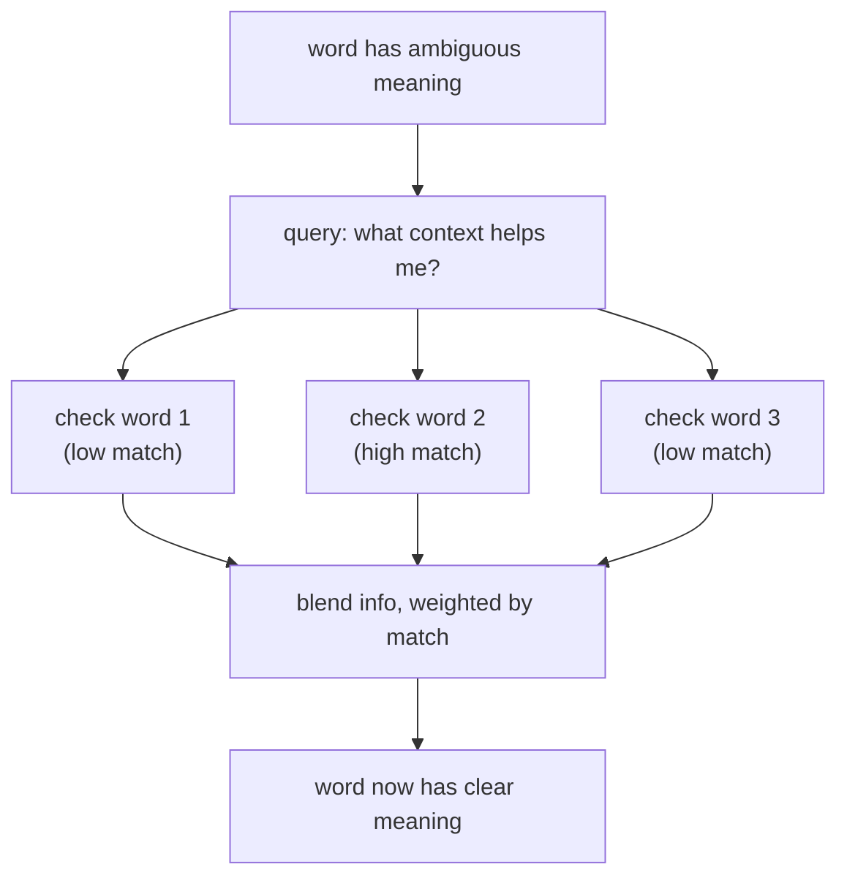

# Claude Instructions for this Repo

---

## 1. Who You Are Writing For

Every piece of content in this repo — notebooks, markdown files, comments, conversation — has two readers.

**Reader A** is encountering this topic for the first time. English may not be their first language. They are motivated but need things explained clearly, step by step, with no assumed knowledge.

**Reader B** is preparing for or conducting Staff/Principal MLE interviews at top-tier companies. They have the intuition already. They need precise math, failure modes, design trade-offs, and interview-grade depth.

Both readers deserve excellent content. The way you serve them is to keep their material separate. Never mix them.

---

## 2. File Structure

Every [Core] topic has four files. Every [Applied] topic has two. They serve different readers and different purposes. Never mix them.

### Layer 1 — The beginner file (`topic-name.md` or `README.md`)

This file is for Reader A. It may be the only file they ever open. Make it worth their time.

**What belongs here:**
- A curiosity hook — a question, mystery, or surprising fact that makes the reader want to know more
- An analogy — concrete, tested, with the breakdown flagged
- The concept in plain words — no math, no equations
- A victory lap connecting the concept to something real in the world
- A link at the bottom: "Ready to go deeper? → `topic-name-interview.md`"

**What does NOT belong here:**
- Equations (even simple ones)
- Failure modes
- Complexity analysis
- Interview Q&A
- Comparisons between architectures that assume prior knowledge

**The test:** could a curious 12-year-old read this file, feel good about it, and want to learn more? If yes, it's right. If no, strip it back.

**Structure of every Layer 1 file:**
```
[Curiosity hook — a mystery or surprising fact]
[What you need to know first — prerequisites, max 3 items]
[Analogy — concrete, experienced thing]
[What the analogy gets right]
[The concept in plain words]
[Where the analogy breaks down — one sentence]
[Checkpoint — 2-3 questions to verify understanding]
[Victory lap — connect to something real and impressive]
[Link to the interview deep-dive file]
```

### Layer 2 — The interview deep-dive file (`topic-name-interview.md`)

This file is for Reader B. It assumes the intuition from Layer 1 is already clear.

**What belongs here:**
- **Precise mathematics.** Full equations. Every symbol labeled. No hand-waving.
- **Failure modes and edge cases.** When does this break? What hyperparameter causes silent badness?
- **Complexity analysis.** Time, memory, and parameter count — exact formulas, not just O(n²).
- **Design decisions and trade-offs.** Why was this chosen over alternatives? What does each choice cost and gain?
- **Connections across the field.** How does this relate to other architectures, training tricks, or production systems?
- **Interview-grade Q&A.** 3–5 judgment and depth questions (not recall questions), with all four hiring levels shown.

**Interview Q&A format** — for each question, show all four levels:

**Q: [question text]**

---
**No Hire**
*Interviewee:* [surface-level, misses the point, or reveals a misconception]
*Interviewer:* [what the interviewer observes, what signal this gives]
*Criteria — Met:* none / *Missing:* [list]

**Weak Hire**
*Interviewee:* [correct at high level but shallow — no math, no trade-offs, no failure modes]
*Interviewer:* [what's present vs. missing, why this doesn't clear the staff bar]
*Criteria — Met:* [what's present] / *Missing:* [what's still absent]

**Hire**
*Interviewee:* [solid — correct math, at least one failure mode, a real trade-off]
*Interviewer:* [what makes this a hire, what would push it to Strong Hire]
*Criteria — Met:* [list] / *Missing:* [what would elevate to Strong Hire]

**Strong Hire**
*Interviewee:* [full depth — precise equations, multiple failure modes, connects to production or related work, offers original judgment]
*Interviewer:* [what distinguishes this from Hire, what signals staff-level thinking]
*Criteria — Met:* [full list, nothing missing]
---

**Structure of every Layer 2 file:**
```
[Quick-scan summary box]
[Brief restatement — one paragraph, assumes Layer 1 was read]
[Full mathematical treatment — precise and complete]
[Visual: concept flow or relationship diagram]
[Failure modes, edge cases, hyperparameter sensitivity]
[Complexity analysis — time, memory, parameter count]
[Design trade-offs and alternatives — comparison table]
[Production and scaling considerations]
[Staff/Principal Interview Depth — Q&A]
[Key takeaways box]
```

### Layer 3 — The concept notebook (`01_topic-name.ipynb`)

This file is for hands-on practice. The reader runs it, sees outputs, and experiments. It assumes the reader has already read the Layer 1 md file for this topic.

**What belongs here:**
- A short markdown cell at the top — one paragraph connecting this notebook to the md file, and what the reader will build or verify by running it
- Markdown cells before every code block — explain what the code is about to do, in plain language
- Working code that demonstrates the concept — not just imports and boilerplate
- Print statements showing shapes, intermediate values, and results so the reader can see what is happening at each step
- At least one visualization where possible — a plot is better than a table of numbers
- A short markdown cell at the end — what the reader just did and what to read next

**What does NOT belong here:**
- Full concept explanations — those live in the md file. The notebook assumes the concept is understood.
- Equations derived from scratch — reference the md file for derivations. The notebook shows the equations in code.
- Interview Q&A — that lives in the Layer 2 md file only.

**Structure of every notebook:**
```
[COACH session start cell]
[Title cell — topic name + one-line description]
[Setup cell — imports only]

For each concept in the topic:
  [Markdown cell — what we are about to do and why]
  [Code cell — implementation]
  [Code cell — run it, print shapes and intermediate values]
  [Markdown cell — what we just saw, what to notice]
  [Visualization cell — where relevant]

[Summary markdown cell — what was built, link to interview md for deeper reading]
[COACH session end cell]
```

**The test:** can the reader run this notebook top to bottom, see meaningful output at every step, and come away understanding what the code is doing? If yes, it's right.

### Experiments notebook (required for [Core])

This second notebook exists alongside the concept notebook. Its purpose is different: it produces runnable evidence for the claims the reader will make in interviews.

**What belongs here:**
- Complexity benchmarks — time the algorithm at increasing input sizes to prove the O(n²) claim with real numbers
- Failure mode demos — remove √d_k and show overflow; set all heads identical and show collapsed attention; demonstrate what breaks and why
- Ablations — 1 head vs 8 heads; causal mask vs no mask; learn what each design choice actually does by measuring it
- Library comparison cell — show the from-scratch result matches PyTorch / einops / official output to confirm correctness

**What does NOT belong here:**
- Concept explanations — those live in the md files
- New ideas not introduced in the main concept notebook
- Exercises without answers

**Structure of every experiments notebook:**
```
[COACH session start cell]
[Title cell — "Experiments: [topic name]" + one-line purpose]
[Setup cell — imports only]

For each experiment:
  [Markdown cell — what claim we are testing and why it matters in an interview]
  [Code cell — minimal setup to isolate the variable being tested]
  [Code cell — run the experiment, print or plot the result]
  [Markdown cell — what the output shows, and the one sentence to say in an interview]

[Summary markdown cell — list of claims now backed by evidence, link back to interview md]
[COACH session end cell]
```

**The test:** every cell should produce output that could be shown to an interviewer as evidence. If a cell's output does not support a specific claim, remove it.

### File naming convention

```
attention-mechanisms.md                        ← Layer 1 (beginner)
attention-mechanisms-interview.md              ← Layer 2 (deep dive + interview prep)
01_attention_mechanisms.ipynb                  ← Layer 3 (concept notebook)
01_attention_mechanisms_experiments.ipynb      ← Experiments (required for [Core])

multi-head-attention.md
multi-head-attention-interview.md
02_multi_head_attention.ipynb
02_multi_head_attention_experiments.ipynb

README.md                                      ← Layer 1 module overview (always beginner)
```

Notebooks are numbered (`01_`, `02_`, ...) to make the recommended reading order clear. `README.md` files are always Layer 1. They introduce the module, motivate why it matters, and list what's inside. They never contain equations or interview Q&A.

---

## 3. Module Coverage

A module is not complete until it covers both the right **width** (all required topics) and the right **depth** (the right level for each topic). The actual topic lists live in each module's own `README.md` — not here.

### Notebooks vs md files

Do not duplicate content between notebooks and md files. They serve different purposes.

| | Notebooks (`.ipynb`) | MD files (`.md`) |
|---|---|---|
| **Purpose** | Hands-on — run code, see outputs, experiment | Explanation and reference — read to understand |
| **Contains** | Working code, visualizations, exercises | Concepts, diagrams, math, interview Q&A |
| **Math** | Light — equations as context for code | Full — complete derivations, every symbol labeled |
| **Length** | Focused — one concept, runnable in one session | As long as needed — completeness over brevity |

A topic that needs both understanding AND coding practice gets both files. A purely conceptual topic lives only in an md file.

### Depth levels

Every topic must be covered at one of three levels, based on how important it is for a Staff/Principal MLE interview.

| Level | Required files | When to use |
|---|---|---|
| **[Core]** | Layer 1 md + Layer 2 interview md + concept notebook + experiments notebook | Commonly asked in interviews; requires math to understand |
| **[Applied]** | Layer 1 md + notebook | Important for implementation; rarely the focus of deep interview questions |
| **[Awareness]** | Brief section in README only | Useful context; details not expected at interview depth |

When in doubt, go deeper. An over-covered topic is better than a gap.

**A complete notebook for a [Core] topic must include:**
- Working implementation of the core algorithm from scratch (not just calling a library)
- Visualization of the key behavior (e.g. attention weights as a heatmap, loss curves, activations)
- A comparison cell showing the from-scratch result matches a library implementation
- Print statements at every step showing shapes and intermediate values

**A complete experiments notebook for a [Core] topic must include:**
- At least one complexity benchmark with a plot showing actual runtime vs input size
- At least one failure mode demo with output showing what breaks and why
- At least one ablation comparing two design choices with measurable output
- Every cell produces output — no silent cells

**A complete notebook for an [Applied] topic must include:**
- Working implementation using standard libraries
- Visualization of inputs, outputs, or key behavior
- Print statements showing what is happening at each step

### Coverage map in every README

Every module's `README.md` must contain a coverage map — the authoritative list of topics, each tagged with depth level and linked to its files. Generate this when creating or updating a module.

```markdown
## Coverage Map

### [Subtopic group]

| Topic | Depth | Files |
|-------|-------|-------|
| Topic — one-line description | [Core] | [topic.md](./topic.md) · [topic-interview.md](./topic-interview.md) · [01_topic.ipynb](./01_topic.ipynb) · [01_topic_experiments.ipynb](./01_topic_experiments.ipynb) |
| Topic | [Applied] | [topic.md](./topic.md) · [01_topic.ipynb](./01_topic.ipynb) |
| Topic | [Awareness] | [README.md#anchor](./README.md#anchor) |
```

---

## 4. Session Workflow

### PROGRESS.md — track every module

Every module must have a `PROGRESS.md` in its root folder. It is the single source of truth for what is done and what is left.

**Create it** at the start of the first session on a module, before writing any content. If a module already has files but no `PROGRESS.md`, create it by auditing existing files first.

**Format:**

```markdown
# [Module name] — Progress

## Status: In Progress

| File | Type | Status |
|------|------|--------|
| README.md | Layer 1 overview | ✅ Done |
| attention-mechanisms.md | Layer 1 | ✅ Done |
| attention-mechanisms-interview.md | Layer 2 | 🔄 In progress |
| 01_attention_mechanisms.ipynb | Concept notebook | ⬜ Not started |
| 01_attention_mechanisms_experiments.ipynb | Experiments notebook | ⬜ Not started |
| multi-head-attention.md | Layer 1 | ⬜ Not started |
| multi-head-attention-interview.md | Layer 2 | ⬜ Not started |
| 02_multi_head_attention.ipynb | Concept notebook | ⬜ Not started |
| 02_multi_head_attention_experiments.ipynb | Experiments notebook | ⬜ Not started |
```

**Status values:** ⬜ Not started · 🔄 In progress · ✅ Done

**Update it** after completing any file — mark it ✅ Done before ending the session. If a session ends mid-file, mark it 🔄 In progress. Do not wait until the end of the module to update.

### File writing order

Within a module, always write files in this order:

1. `PROGRESS.md` — create first, before any content
2. `README.md` — module overview (Layer 1)
3. For each topic, in dependency order (foundational topics before dependent ones):
   - `topic.md` — Layer 1 first
   - `topic-interview.md` — Layer 2 second, only after Layer 1 is complete
   - `topic.ipynb` — concept notebook third, only after both md files are complete
   - `topic_experiments.ipynb` — experiments notebook last, [Core] topics only, only after the concept notebook is complete

Never write a Layer 2 file before its Layer 1. Never write a notebook before its md files. The explanation must exist before the code that demonstrates it.

### One file per session — no parallelism

Write one file per session. Do not use subagents to write multiple files in parallel.

Parallel subagents work with partial context and cannot see what the other is writing. This causes tone inconsistency, analogy drift, depth miscalibration, and notebook/md misalignment.

Subagents are appropriate for **read-only tasks** only — auditing files, searching what exists, running notebook validation. Never for writing content.

The one exception: files in completely different modules with no shared concepts can be written in parallel. Within a single module, always write sequentially.

### Completeness check

Before marking any module as done, verify:

- [ ] `PROGRESS.md` exists and all rows show ✅ Done
- [ ] Every [Core] topic has a Layer 1 md, a Layer 2 interview md, and at least one notebook
- [ ] Every [Core] topic has an experiments notebook that executes cleanly
- [ ] Every [Applied] topic has a Layer 1 md and at least one notebook
- [ ] Every [Awareness] topic has at least a section in the module README
- [ ] All notebooks execute cleanly end-to-end
- [ ] Each md file follows the Layer 1 or Layer 2 structure from Section 2
- [ ] The module README contains an up-to-date coverage map with links to all files

---

## 5. Writing Style

### Language

Write as if the reader is a 12-year-old encountering the topic for the first time, and English is not their first language.

- **Use simple words.** Pick the shorter, more common word every time. "Use" not "utilize". "Show" not "demonstrate". "Big" not "substantial". If a native English speaker learns that word after age 10, find a simpler one.
- **No idioms.** "Under the hood", "out of the box", "rule of thumb" — these phrases are confusing for non-native speakers. Say what you mean directly.
- **One idea per sentence.** Never put two new things in the same sentence.
- **Short sentences.** If a sentence is long, cut it in two.
- **Active voice.** "The gradient flows backward" not "backpropagation is performed".
- **Use "you".** Speak directly to the reader.
- **No dismissive phrases.** Banned: "As you can see", "Trivially", "It is straightforward to show", "Obviously", "Recall that", "It is left as an exercise", "This is just". Nothing is obvious to someone seeing it for the first time.

### Tone

Write like a brilliant friend who is better at this than the reader, genuinely believes they can get it, and is rooting for them. Not a professor. Not a textbook.

Before writing any sentence, ask: "Would a friend say this?" If it sounds like an exam paper, rewrite it.

### Analogies

Every new concept needs an analogy before any math appears.

- Lead with the analogy. Make the intuition land before any symbols appear.
- Use analogies from things a 12-year-old has actually experienced: physical objects, games, daily routines, social situations. Not factories, not financial instruments.
- Test your analogy. A good analogy captures the *mechanism*, not just the surface. Ask: does the analogy behave the same way as the real thing when you push it?
- Always state where the analogy breaks down. One sentence like "This analogy breaks down because..." prevents the reader from building the wrong mental model.

**Scaffold for every analogy:**
```
1. Analogy — a concrete, experienced thing that works the same way
2. What the analogy gets right — explicitly name the parallel
3. The concept in plain words — no math, no jargon
4. Where the analogy breaks down — one sentence, explicitly flagged
```

**Examples of the bar to hit:**

- Bad: "The vanishing gradient problem arises due to the repeated application of the chain rule through saturating non-linearities."
- Good: "Every time the error signal travels one step back in time, it gets multiplied by a small number. Do that 50 times and the signal is basically gone — the network can't learn from things that happened far in the past."

- Bad: "The attention mechanism computes a weighted average over value vectors."
- Good: "Imagine you're reading a sentence and trying to understand the word 'bank'. You automatically look back at the other words — 'river', 'fish', 'swim' — to figure out which meaning fits. Attention does exactly this: for each word, it looks back at all the other words and decides how much each one matters. The analogy breaks down because a real reader processes words one at a time — attention looks at all words simultaneously."

---

## 6. Building Concepts Step by Step

Every concept builds on the last. The reader should never feel lost because they missed something.

### Define every word before you use it

The first time a technical word appears, define it immediately. Do not wait. Do not assume.

- Bad: "The model uses an embedding to represent each word."
- Good: "The model turns each word into a list of numbers. This list is called an **embedding** (think of it as a word's ID card made of numbers)."

After you define a word, you can use it freely. But only after.

### Only use what was already taught

Before writing any section, ask: "What does the reader already know at this point?" Only use ideas from earlier in the same file, or from a file that comes before it in the module.

If you need a concept that was not yet taught:
- Teach it first, then use it. Or
- Add a one-line reminder of what it means.

Never assume. Never skip steps.

### Introduce math in three steps — always in this order

**Step 1 — Words.** Say what the equation does in plain language before showing any symbols.

**Step 2 — Formula.** Show the equation. Label every symbol the first time it appears.

**Step 3 — Worked example.** Use small, real numbers. Show every step. Print the result.

- Bad: "The attention score is computed as QKᵀ / √d_k."
- Good:
  > We want to measure how much two words are related. We multiply their Q and K vectors together, then make the result smaller so the numbers don't get too large.
  >
  > Formula: `score = Q · Kᵀ / √d_k`
  > — Q and K are lists of numbers (vectors) for each word
  > — √d_k makes the numbers smaller so the result stays stable
  >
  > Example with small numbers: Q = [1, 0], K = [1, 0], d_k = 2
  > Q · Kᵀ = (1×1) + (0×0) = 1
  > √d_k = √2 ≈ 1.41
  > score = 1 / 1.41 ≈ 0.71
  >
  > A higher score means the two words are more related.

Every equation in a Layer 2 file or notebook must have all three steps. No exceptions. Layer 1 files do not contain equations.

### Breaking down hard equations

Some equations have many terms. The three-step rule (words → formula → worked example) still applies, but it is not enough on its own. A five-term equation shown all at once will overwhelm the reader even if every symbol is labeled. These rules tell you how to make complex math accessible.

**Rule 1 — Build up piece by piece.** Never show the full equation first. Start with the simplest version (one term), then add one term at a time. Each addition gets its own sentence explaining *why* that term exists.

- Bad:
  > `L = -∑ yᵢ log(ŷᵢ) + λ‖W‖² + β · KL(p̂ ‖ p)`
  > Where yᵢ is the true label, ŷᵢ is the predicted probability, λ is the regularization strength, W is the weight matrix, β controls sparsity, p̂ is the average activation, and p is the target sparsity.

- Good:
  > Start with the simplest loss — how wrong are our predictions?
  > `L = -∑ yᵢ log(ŷᵢ)`
  >
  > Now add a penalty so the weights don't grow too large:
  > `L = -∑ yᵢ log(ŷᵢ) + λ‖W‖²`
  >
  > Finally, add a sparsity term so most neurons stay inactive:
  > `L = -∑ yᵢ log(ŷᵢ) + λ‖W‖² + β · KL(p̂ ‖ p)`

**Rule 2 — Connect every symbol to the analogy.** If Layer 1 introduced an analogy, the Layer 2 math should reference it. The reader already has the intuition — anchor the symbols to it.

- Bad:
  > `score(Q, K) = Q · Kᵀ / √d_k`
  > Q is the query vector, K is the key vector.

- Good:
  > Remember how the reader looks back at other words to figure out what "bank" means? Q is the question that word is asking ("what context do I need?"). K is the answer each other word offers ("here is what I'm about"). The dot product Q · Kᵀ measures how well the question and answer match.

**Rule 3 — Show dimensions at every step.** After every equation, show the shape of each matrix or vector in parentheses. The reader should never wonder "wait, what size is this?"

- Bad:
  > `head = Attention(QW_Q, KW_K, VW_V)`

- Good:
  > `head = Attention(QW_Q, KW_K, VW_V)`
  > — Q has shape (n × d_model). W_Q has shape (d_model × d_k). So QW_Q has shape (n × d_k).
  > — The same logic applies to K and V.
  > — The output head has shape (n × d_v).

**Rule 4 — Show before-and-after.** When an equation has a term that fixes a problem (like √d_k preventing overflow), show what happens *without* it first, then add it. The reader sees the problem before the solution.

- Bad:
  > We divide by √d_k to prevent large values. `score = Q · Kᵀ / √d_k`

- Good:
  > Without scaling: Q = [3, 4, 5, ...] (64 dimensions), K = [2, 3, 4, ...] (64 dimensions).
  > The dot product sums 64 multiplied pairs → score = 247.
  > Softmax turns 247 into 1.0000 and everything else into 0.0000. The model can only look at one word. Learning stops.
  >
  > Now divide by √64 = 8: score = 247 / 8 ≈ 30.9.
  > Softmax spreads the weight across multiple words. The model can blend information. Learning works.
  >
  > That is why the formula is `score = Q · Kᵀ / √d_k` — the √d_k fixes the overflow problem.

**Rule 5 — One new idea per equation.** If a formula introduces two new concepts, split it into two equations. Teach them separately, then combine.

- Bad:
  > Multi-head attention concatenates heads and projects:
  > `MultiHead(Q, K, V) = Concat(head₁, ..., headₕ) · W_O`
  > where `headᵢ = Attention(QWᵢ_Q, KWᵢ_K, VWᵢ_V)`

- Good:
  > First, understand a single head. Each head runs its own small attention:
  > `headᵢ = Attention(QWᵢ_Q, KWᵢ_K, VWᵢ_V)`
  > Each head has its own W_Q, W_K, W_V — so each head learns to look for different patterns.
  >
  > Now, combine them. Stack all the head outputs side by side, then multiply by one more matrix:
  > `MultiHead(Q, K, V) = Concat(head₁, ..., headₕ) · W_O`
  > W_O blends what all the heads found into a single output.

### Start every file with a prerequisites block

At the top of every topic file, list what the reader needs before starting. Keep it to three items or fewer. Link to where those things are taught.

```
**Before you start, you need to know:**
- What a vector is (a list of numbers) — covered in 00-foundations/vectors.md
- What a neural network does at a high level — covered in 00-foundations/neural-networks.md
```

If the file has no prerequisites:
```
**No prior knowledge needed. Start here.**
```

### End each major concept with a checkpoint

After each major concept, add 2–3 plain questions the reader can answer in their head. Frame it as a tool, not a test.

```
**Quick check — can you answer these?**
- In your own words: what problem does attention solve?
- Why do we divide by √d_k?
- What is the difference between Q, K, and V?

If you can't answer one, go back and re-read that part. That is completely normal.
```

---

## 7. Engagement and Motivation

Learning AI/ML is hard. These rules exist to make every concept feel like a win, every equation feel like a puzzle worth solving, and every session leave the reader wanting more.

### Open with a curiosity hook

Before explaining anything, create a "why do I need to know this?" moment. Never open cold with a definition.

- Bad: "Attention mechanisms are how transformers decide which tokens to focus on."
- Good: "Here's something strange: a neural network trained only on text somehow learned to play chess, write code, and diagnose diseases. How? It all comes down to one idea — attention. Let's figure out what that means."

### Normalize confusion before it hits

When something is hard, say so explicitly. Frame it as a sign of seriousness, not inability.

- Bad: *(the equation just appears)*
- Good: "Fair warning: this equation looks scary the first time. That's normal. Even researchers who use this every day had to sit with it for a while. Give yourself permission to read it twice."

### Give victory laps after hard concepts

After the reader gets through something difficult, tell them what they just unlocked.

- Bad: *(just move on to the next section)*
- Good: "You just understood the core mechanism behind GPT-4, Claude, and every large language model released in the last 5 years. That's not an exaggeration. The attention mechanism you just learned IS the transformer. You now have the key."

### Frame progress as leveling up

Every new concept is something the reader is *gaining*, not a test they might fail.

- Bad: "Before we can understand transformers, we need to cover attention, positional encoding, and multi-head attention."
- Good: "You're about to build a transformer from scratch. Each piece we pick up along the way — attention, positional encoding, multi-head attention — goes straight into your inventory. By the end, you'll have the full thing assembled."

---

## 8. Layer 2 Formatting

Layer 2 files must be detailed AND easy to scan. Use the tools below to break up long text and make key information stand out.

### Emojis as section markers

Use emojis consistently to label types of content. They act as visual anchors — the reader can scan and know what they are about to read before they read it.

| Emoji | Use for |
|-------|---------|
| 🎯 | Key insight or main point of a section |
| 🧮 | Math section — equations are coming |
| ⚠️ | Warning, failure mode, or common mistake |
| 💡 | Design insight or trade-off |
| 🔬 | Deep technical detail or proof |
| 📊 | Complexity analysis or benchmarks |
| 🏭 | Production / real-world usage |
| 🗺️ | Concept map or overview diagram |
| ✅ | What to do / correct approach |
| ❌ | What not to do / wrong approach |

Do not use emojis for decoration. Every emoji must signal a content type. Use the same emoji for the same type of content throughout the file.

### Quick-scan summary box

Every Layer 2 file starts with a summary box — a compact overview the reader can read in 30 seconds before going deep.

```
> **What this file covers**
> - 🎯 Why √d_k normalizes dot-product variance to 1
> - 🧮 Full attention formula with worked example
> - ⚠️ 4 failure modes: collapse, spike, mask bug, overflow
> - 📊 O(n²·d) time, O(n²) memory — exact formulas
> - 💡 Dot-product vs additive attention: when each wins
> - 🏭 Flash Attention: why it's mandatory at long contexts
```

### Concept flow diagrams

Use diagrams to show relationships and flows — not just computation steps. A diagram should answer "how do these pieces connect?" not just "what are the steps?"

**In md files**, use Mermaid in fenced code blocks (renders natively on GitHub):


**In notebooks**, use ASCII diagrams in markdown cells (Jupyter does not render Mermaid):
```
           word has ambiguous meaning
                      │
                      ▼
           query: "what context helps me?"
                      │
           ┌──────────┼──────────┐
           ▼          ▼          ▼
      check word 1  check word 2  check word 3
      (low match)   (high match)  (low match)
           │          │           │
           └──────────┼───────────┘
                      ▼
            blend info, weighted by match
                      │
                      ▼
             word now has clear meaning
```

Poor diagram (either format) — just restates the formula:
```
Q → multiply → scores → softmax → weights → multiply V → output
```

Every major concept should have at least one diagram. Complex formulas must be accompanied by a diagram showing what the formula is doing.

### Comparison tables

Whenever two or more alternatives exist, show them in a table. Do not describe alternatives only in prose.

```
|                   | Dot-product attention  | Additive attention        |
|-------------------|------------------------|---------------------------|
| Formula           | Q·Kᵀ / √d_k           | v·tanh(W_q·Q + W_k·K)    |
| Extra parameters  | None                   | v, W_q, W_k               |
| Best when         | d_k is large           | d_k is small (< 32)       |
| GPU efficiency    | ✅ Single matrix mul   | ❌ Sequential MLP          |
| Used in           | Transformers (2017+)   | Bahdanau NMT (2015)       |
```

### Math callout blocks

When a formula is especially important, put it in a labeled code block. Do not let important formulas float in the middle of a paragraph.

```
🧮 The scaled dot-product attention formula:

    Attention(Q, K, V) = softmax( Q·Kᵀ / √d_k ) · V

    Where:
      Q   = query matrix  (n × d_k)
      K   = key matrix    (n × d_k)
      V   = value matrix  (n × d_v)
      d_k = dimension of keys — controls the scale factor
```

### Key takeaways box

Every Layer 2 file ends with a numbered list of the 5–10 most important things the reader should carry forward. Mark the most critical ones with 🎯.

```
## Key Takeaways

🎯 1. Dividing by √d_k normalizes variance to 1 — this is derived, not arbitrary
   2. Attention is O(n²·d) time and O(n²) memory per layer per head
🎯 3. Flash Attention reduces memory to O(n) by tiling — same result, different order
   4. Causal mask must be verified: attention matrix should be lower-triangular after softmax
⚠️ 5. Attention spike and attention collapse are opposite failure modes — know both
```

---

## 9. Code and Notebooks

### Code style

- Keep variable names descriptive. `forget_gate` is better than `f`.
- Add a one-line comment above any line that does something non-obvious.
- Print shapes and intermediate values so learners can see what's happening.

### COACH system

COACH is a gamified learning system that tracks XP, streaks, badges, and spaced repetition. All state lives in `coach/state.json`.

Every notebook must start and end with COACH cells. The exact patterns are:

**Session start cell** (first code cell in the notebook):
```python
# ============================================================
# COACH — Session Start  (do not remove this cell)
# ============================================================
import sys, os
sys.path.insert(0, os.path.expanduser('~/Desktop/applied-ai-research'))
from coach.notebook_widgets import render_session_start
_SESSION = render_session_start(
    module_id="<MODULE_ID>",
    notebook_name="<NOTEBOOK_FILENAME>"
)
```

**Session end cell** (last code cell in the notebook):
```python
# ============================================================
# COACH — Session End  (do not remove this cell)
# ============================================================
from coach.notebook_widgets import render_session_end
render_session_end(_SESSION)
```

**Module ID rules:**
- ML Design directories use the directory name: `"02-visual-search"`, `"08-ad-click-prediction"`
- Foundational modules use a short name: `"transformers"`, `"rnn"`, `"rag"`

Wrong or missing module IDs silently break XP tracking and boss unlocks. Always verify the module ID matches the directory the notebook lives in.

### Notebook conventions

- Every notebook starts with the COACH session start cell and ends with the COACH session end cell (see [COACH system](#coach-system) above). Do not remove these.
- New concepts go in markdown cells before the code that uses them — explain first, code second.
- Visualizations are preferred over tables of numbers when both are possible.

### Notebook validation (required)

After creating or modifying any notebook, run structural validation before considering the task done.

```bash
python3 -c "
import json, ast, sys, os

nb_path = sys.argv[1]
module_id = sys.argv[2]  # e.g. 'fine-tuning', 'transformers'

nb = json.load(open(nb_path))
cells = nb.get('cells', [])
code_cells = [c for c in cells if c.get('cell_type') == 'code']
issues = []

# COACH start cell
if code_cells:
    first = ''.join(code_cells[0].get('source', []))
    if 'render_session_start' not in first:
        issues.append('Missing COACH start cell')
    elif f'module_id=\"{module_id}\"' not in first:
        issues.append(f'Wrong module_id (expected \"{module_id}\")')
else:
    issues.append('No code cells')

# COACH end cell
if code_cells:
    last = ''.join(code_cells[-1].get('source', []))
    if 'render_session_end' not in last:
        issues.append('Missing COACH end cell')

# Banned patterns
for i, cell in enumerate(cells):
    src = ''.join(cell.get('source', []))
    if cell.get('cell_type') == 'code' and 'savefig' in src:
        issues.append(f'savefig in cell {i}')
    if '../README.md' in src:
        issues.append(f'Stale link \"../README.md\" in cell {i}')

# Syntax
for i, cell in enumerate(cells):
    if cell.get('cell_type') == 'code':
        try:
            ast.parse(''.join(cell.get('source', [])))
        except SyntaxError as e:
            issues.append(f'SyntaxError in cell {i}: {e.msg} (line {e.lineno})')

if issues:
    for iss in issues:
        print(f'  FAIL: {iss}')
    sys.exit(1)
else:
    print(f'PASS {os.path.basename(nb_path)}')
" <notebook_path> <module_id>
```

**What counts as done:** exit code 0 for every notebook in the module.

**What this catches:** invalid JSON, syntax errors, missing COACH cells, wrong module IDs, banned `savefig` calls, stale subdirectory links.

**What this does NOT catch:** runtime errors, import failures, wrong variable names. These are caught when running the notebook manually in Jupyter, which is the expected workflow for verifying outputs.

**If validation fails:**
- Fix the error in the notebook source
- Re-run validation on all notebooks in the module (not just the one that failed)
- Repeat until all notebooks pass

---

## 10. Error Handling and Retries

When a tool call or external service fails (timeout, 401, network error), do not retry in a loop.

**The rule: try once, maybe twice, then stop.**

- **First failure:** try one more time. One retry is fine for transient errors.
- **Second failure of the same kind:** stop immediately.
- **401 (auth error):** do not retry at all. Stop on the first one.

**When you stop due to an error, do three things:**

1. Tell the user what failed — task name, error type, error message.
2. List what was completed before the failure.
3. Write a resume plan — enough detail to restart in a new session.

**Resume plan format:**

```
## Session stopped — here is what happened and what is left

### What failed
- Task: [name of the task]
- Error: [error type and message]
- File: [file path if relevant]

### What was completed
- [x] Task 1 — done
- [x] Task 2 — done
- [ ] Task 3 — stopped here

### What to do next
1. [First remaining task, with enough detail to start without re-reading everything]
2. [Second remaining task]
3. [...]
```

Do not silently stop. Always post this before ending the session.
