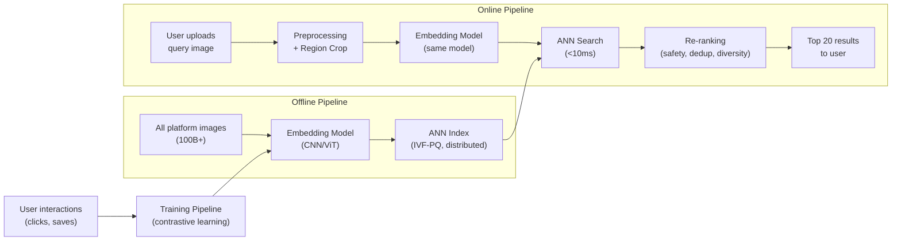

# Visual Search ML System Design

## Understanding the Problem

**What is Visual Search?**

Visual search lets users find images by uploading an image rather than typing a query. Pinterest, Google Lens, and Amazon all use it — you snap a photo of a pair of shoes you like, and the system finds similar shoes you can buy. The ML challenge is learning a representation of images where "visually similar" images are close together in a mathematical space, then searching that space efficiently across billions of images in under 100ms.

This is harder than it sounds because "similar" is subjective (same object? same style? same color palette?), the corpus is enormous (100B+ images), and the system must serve results fast enough that it feels instantaneous.

## Problem Framing

### Clarify the Problem

- What does "visually similar" mean for our platform? Are we matching exact objects (product search) or aesthetic similarity (mood board / inspiration)?
- Let's say we're building for a platform like Pinterest. Similar means both same-object matches (these shoes) AND stylistically related items (other mid-century modern furniture). The emphasis is on inspiration, not just product lookup.

- How many images are in the corpus?
- About 100-200 billion images, with roughly 10 million new images uploaded daily.

- What's the latency requirement?
- Sub-100ms for the search results to feel interactive. Users are actively waiting.

- Do we have labeled training data — human-annotated similar/dissimilar pairs?
- No explicit labels. We have user interaction logs: impressions, clicks, and saves. Users can also save images to themed boards, which is a strong implicit similarity signal.

- Is it image-only queries, or do we also need to support text + image (multimodal)?
- Image-only for now. Text-to-image search is a future extension.

- Are there content policy requirements — NSFW filtering, copyright, deduplication?
- Yes. Results must be filtered for NSFW content, near-duplicates should be collapsed, and private images must not appear in public search results.

- Can users crop or select a region of the query image?
- Yes. Users can select a specific object in the image to search for just that item.

- Is the search personalized per user?
- No personalization for now. Same query image returns the same results for everyone.

### Establish a Business Objective

#### Bad Solution: Maximize visual similarity accuracy

Measure how "accurate" the model's similarity judgments are against some ground truth. This seems reasonable but fails because there's no single ground truth — similarity is subjective and depends on context. Two human annotators will disagree on whether a rustic kitchen and a modern kitchen are "similar." Optimizing for accuracy against noisy labels produces a model that matches annotator conventions, not user preferences.

#### Good Solution: Maximize click-through rate on search results

CTR captures whether users find the results useful enough to click. This is a real user signal — users vote with their clicks. It's better than accuracy because it reflects actual user preferences.

The limitation: CTR is noisy. Users click for many reasons — curiosity, accidental taps, position bias (top results get clicked regardless of quality). A model optimized purely for CTR might learn to surface clickbait-style images rather than genuinely relevant results.

#### Great Solution: Maximize user engagement depth (save rate + downstream session activity)

The best signal for a Pinterest-like platform is the **save rate** — did the user save the image to a board? Saves indicate genuine interest (stronger than clicks) and align with the platform's core value proposition (inspiration and curation). Complement this with downstream metrics: did the search lead to longer sessions, more saves, or return visits?

This multi-dimensional objective captures both immediate relevance (saves) and long-term platform value (session engagement, retention). The downside is that saves are sparser than clicks — fewer users save than click — so you need more data to reach statistical significance in experiments.

### Decide on an ML Objective

This is a **metric learning / representation learning** problem. The goal is to learn an embedding function `f(image) → ℝ^d` such that:
- Images that users consider similar have embeddings close together (high cosine similarity)
- Images that users consider dissimilar have embeddings far apart (low cosine similarity)

At serving time: embed the query image, find the nearest neighbors in the embedding space using ANN search, and return them as results. The ML objective is to minimize a contrastive loss that pulls positive pairs together and pushes negative pairs apart.

## High Level Design



The system has two pipelines. The **offline pipeline** pre-computes embeddings for all images in the corpus and builds an ANN index for fast retrieval. The **online pipeline** processes the user's query image in real-time: embed the query, search the index, re-rank results with business logic, and return results.

The embedding model is shared between offline and online pipelines — the same model that indexes images is used to embed queries. This ensures query and corpus embeddings live in the same space.

## Data and Features

### Training Data

#### Bad Solution: Use only click data as similarity labels

Treat every click as a positive pair and every non-click as a negative. This is the fastest path to a working model — the data is abundant (~200M clicks/day) and easy to collect. But click data is deeply biased: position bias (top results get 5x the CTR regardless of relevance), exploration clicks (users tap out of curiosity), and accidental clicks on mobile. A model trained solely on clicks learns to replicate position rankings, not true visual similarity. The negative signal is also unreliable — users skip images they didn't see, not images they evaluated and rejected.

#### Good Solution: Use saves and board co-occurrence as primary signal, clicks as supplement

Saves are a much stronger signal than clicks — users deliberately curate boards. On Pinterest, images on the same board are implicitly similar (the user grouped them by theme). Use saves as the primary positive label, clicks as a weaker secondary signal, and non-clicked impressions (where the user had sufficient viewport dwell time) as negatives. This reduces position bias because saves don't correlate with position the way clicks do.

The limitation: saves are 10-50x sparser than clicks. You'll need more data accumulation time and the model will have less coverage over the image corpus.

#### Great Solution: Multi-stage training pipeline combining self-supervised, board, and engagement data

Stage 1: Pretrain with self-supervised contrastive learning (SimCLR, MoCo, BYOL) — generate positive pairs by augmenting the same image (crop, rotate, flip, color jitter). This learns general visual similarity from unlimited data with no human bias.

Stage 2: Fine-tune with board co-occurrence data — images on the same board are positives, images on different boards are negatives. This captures platform-specific aesthetic similarity.

Stage 3: Final fine-tune with engagement-weighted data — saves weighted highest, clicks medium, dwell-time-adjusted impressions as negatives. Apply inverse propensity scoring to correct for position bias.

Each stage addresses a different weakness: self-supervision provides the visual foundation, boards add platform taste, and engagement signals capture real user preferences. The downside is training complexity — three stages means three sets of hyperparameters to tune and a longer training pipeline to maintain.

**Volume estimates:**
- ~500M search sessions/day, ~2B impressions, ~200M clicks, ~20M saves
- Self-supervised pairs: unlimited (generated on-the-fly from any image)
- Board co-occurrence pairs: ~50B pairs across all boards

### Features

For visual search, the "features" are the image pixels themselves — there's no manual feature engineering in the traditional sense. The embedding model learns to extract features automatically.

#### Image-Level Properties
- **Resolution and aspect ratio**: Normalize to fixed size (224×224 or 384×384) for model input
- **Color space**: Ensure consistent RGB representation
- **Region of interest**: If the user cropped a region, extract and embed only that crop

#### Metadata (for Re-ranking, Not Embedding)
- **Upload timestamp**: Prefer fresher content in re-ranking
- **Image source/owner**: Required for privacy and copyright filtering
- **Safety classification**: NSFW score from a separate classifier

## Modeling

### Benchmark Models

> "I'd start with a pretrained ResNet-50 or ViT-B/16 as a feature extractor, without any fine-tuning. Extract the penultimate layer activations as embeddings and run ANN search. This gives us a working system in days, not weeks, and establishes a quality baseline to beat."

The pretrained baseline captures general visual similarity (objects, scenes, textures) learned from ImageNet. It won't capture platform-specific similarity (aesthetic style, user preferences) — that's what fine-tuning addresses.

### Model Selection

#### Bad Solution: Train a binary classifier for each image pair

Train a model that takes two images and predicts "similar" or "not similar." This doesn't scale — you'd need to run the classifier against 100B images per query, which would take hours. Classification can't be decomposed into precomputation + lookup.

#### Good Solution: CNN-based embedding model (ResNet-50/101)

Use a CNN backbone to produce embeddings. Items are pre-embedded offline; at query time, embed the query and do ANN lookup. This is fast and battle-tested.

Limitation: CNNs have limited receptive fields — they struggle with global image structure (spatial relationships between objects across the full image).

#### Great Solution: Vision Transformer (ViT) or hybrid CNN-ViT

ViT captures global image relationships through self-attention. For aesthetic similarity (the Pinterest use case), global context matters — a "mid-century modern" aesthetic is defined by the overall composition, not just individual objects.

| Approach | Pros | Cons | When to Use |
|----------|------|------|-------------|
| ResNet-50 | Fast inference (~5ms), compact embeddings, battle-tested | Limited global context | Strict latency budgets, object-identity search |
| ViT-B/16 | Better global understanding, state-of-the-art quality | Slower inference (~15ms), needs more data | Aesthetic/style search, when quality is priority |
| CLIP (ViT + text encoder) | Multi-modal — supports future text-to-image search | Larger model, higher latency | When multimodal search is planned |

**Recommended:** Start with ResNet-50 for v1 (proven, fast). Upgrade to ViT when the data and infrastructure support it.

### Model Architecture

#### Backbone

ResNet-50 or ViT-B/16 pretrained on ImageNet, then fine-tuned with contrastive learning on platform data.

```
Input Image (224×224×3)
    → Backbone (ResNet-50 or ViT-B/16)
    → Global Average Pooling (ResNet) or [CLS] token (ViT)
    → Projection Head (MLP: 2048 → 512 → 128)
    → L2 Normalization
    → Embedding (128-dim unit vector)
```

The projection head maps backbone features to a lower-dimensional embedding space. L2 normalization ensures all embeddings have unit norm — so dot product equals cosine similarity.

#### Embedding Dimension

128 dimensions is the standard tradeoff. Higher dimensions (256, 512) capture more information but cost more storage and slower ANN search. At 100B images, each additional dimension adds ~400GB of index storage.

### Loss Function

**Contrastive loss (InfoNCE / NT-Xent):**

`L = -log( exp(sim(q, k+) / τ) / Σ_i exp(sim(q, k_i) / τ) )`

where:
- `q` = query image embedding
- `k+` = positive (similar) image embedding
- `k_i` = all candidates (1 positive + N-1 negatives) in the batch
- `sim` = cosine similarity
- `τ` = temperature (0.05-0.1 typical)

**Temperature matters:** Low τ (0.05) makes the distribution sharp — the model must distinguish hard negatives. High τ (0.5) makes it softer — easier to train but weaker discrimination. Start at 0.07 and tune.

**Hard negative mining is critical:** Random negatives are too easy (a dog vs a car). Hard negatives (a golden retriever vs a labrador retriever) force the model to learn fine-grained distinctions. Mine hard negatives from ANN near-misses in the current embedding space.

## Inference and Evaluation

### Inference

#### ANN Index Selection

At 100-200B images with 128-dim embeddings, the raw index is ~100TB. This doesn't fit on a single machine.

#### Bad Solution: Brute-force exact search or single-machine HNSW

Run exact k-nearest-neighbor search across the full corpus, or try to fit an HNSW graph index on one large machine. Exact search at 200B vectors is computationally impossible — it would take hours per query. HNSW stores the full graph plus raw vectors (~200TB), which exceeds any single machine's memory. Even with SSDs, random I/O patterns during graph traversal make disk-based HNSW prohibitively slow.

#### Good Solution: HNSW with distributed sharding

Shard the corpus across N machines, each running its own HNSW index. Query all shards in parallel, merge top-K results. HNSW gives 97-99% recall@100 with <5ms latency per shard.

This works, but the infrastructure cost is high — raw vectors plus graph structure require ~200TB total storage across the cluster. At $0.10/GB/month for high-performance instances, that's $20K/month in storage alone. Each shard also needs substantial RAM.

#### Great Solution: IVF-PQ with tiered indexing

Use IVF-PQ (Inverted File with Product Quantization) to compress each vector from 128 floats (512 bytes) to 8-16 bytes — a 50-100x compression. The full 200B index fits in ~2-3TB. This enables a tiered architecture: keep recent and popular images in a hot in-memory index (~500M vectors), store the rest in a larger on-disk index. Most queries are answered by the hot tier.

| Approach | Index Size | Recall@100 | Latency | Infrastructure |
|----------|-----------|------------|---------|---------------|
| HNSW (sharded) | ~200TB (graph + raw vectors) | 97-99% | <5ms | Expensive cluster, high RAM per shard |
| IVF-PQ (tiered) | ~2-3TB (compressed to 8-16 bytes/vector) | 90-95% | <10ms | Fits on a modest cluster |

The recall gap (95% vs 99%) is acceptable because the re-ranking layer can compensate — and at 200B scale, the infrastructure savings are substantial.

#### Serving Pipeline

1. **Preprocessing** (<5ms): Resize, normalize, handle region crop
2. **Embedding** (<15ms): Run query through the model
3. **ANN search** (<10ms): Search the IVF-PQ index
4. **Re-ranking** (<10ms): Safety filter, dedup, diversity, freshness
5. **Total: <40ms** (well within 100ms budget)

### Evaluation

#### Offline Metrics

| Metric | What It Measures | Why It's Relevant |
|--------|-----------------|------------------|
| nDCG@20 | Ranking quality over the top 20 results | Handles graded relevance (similarity scores 0-5), penalizes bad rankings at top positions |
| Recall@1000 | Fraction of relevant images in ANN top-1000 | Measures retrieval coverage before re-ranking |
| MRR | Position of first relevant result | Captures whether the best result appears quickly |

**nDCG is the primary offline metric** because it handles continuous relevance scores (not just binary relevant/irrelevant) and weights top positions more heavily.

#### Online Metrics

- **A/B test with user-level randomization:** Split users into control (current model) and treatment (new model)
- **Primary metric:** Save rate on search results (strong engagement signal)
- **Secondary metrics:** CTR, average position of first click, session duration after search
- **Guardrail metrics:** Search latency p99, safety classifier trigger rate, error rate
- **Duration:** Run for 2+ weeks to capture weekly patterns

## Deep Dives

### ⚠️ Position Bias in Training Data

Users click results at the top of the list more than results at the bottom, regardless of relevance. A model trained on click data learns "position 1 is good" instead of "this image is relevant."

**Detection:** Compare CTR by position. If position 1 has 5x the CTR of position 5 even for randomized results, position bias is present.

**Mitigation:** Propensity scoring — weight training examples by the inverse probability of being examined at that position. Alternatively, occasionally randomize result ordering to collect unbiased position data (costly — users see worse results during randomization).

### 💡 Self-Supervised vs Supervised Contrastive Learning

Self-supervised methods (SimCLR, MoCo) learn from augmented image pairs — no user data needed. Supervised contrastive learning uses click/save data as similarity labels. Which is better?

In practice, the best approach is a **two-stage training pipeline**: pretrain with self-supervised contrastive learning (learns general visual similarity from augmented pairs), then fine-tune with supervised contrastive learning using user engagement data (learns platform-specific similarity). The self-supervised stage provides a strong initialization that the supervised stage refines with real user preferences.

### 📊 Scaling the ANN Index to 200 Billion Images

At 200B images, even IVF-PQ with 16 bytes per vector requires ~3.2TB of index storage. This needs a distributed index:

- **Sharding:** Partition images across N index shards (by geography, category, or hash). Each shard handles a subset. Query all shards in parallel, merge top-K results.
- **Tiered indexing:** Keep a small, hot index in memory (recent and popular images) and a larger, cold index on disk (older, less-accessed images). Most queries are satisfied by the hot index.
- **Incremental updates:** New images are added to a small staging index immediately, then merged into the main index in batch (nightly or weekly).

### 🏭 Embedding Model Versioning

When you retrain the embedding model, all 200B image embeddings become stale — they were computed with the old model. You can't serve results mixing old-model embeddings with new-model query embeddings.

#### Bad Solution: Skip re-embedding and hope the new model is compatible

Deploy the new model for query embedding while keeping old corpus embeddings. If the new model's embedding space has rotated, scaled, or collapsed relative to the old model, queries will return irrelevant results. Even small distributional shifts compound — a 2% quality degradation per update compounds to 20% after ten updates. You won't catch this in offline evals because your test set uses the new model for both query and corpus embeddings.

#### Good Solution: Full re-embed on every model update

Recompute all 200B embeddings with the new model. At 1000 images/second on a GPU, this takes ~2.3 days on 1000 GPUs. Expensive but clean — no compatibility concerns, no accumulated drift. Run a shadow index alongside the production index during the re-embedding window, then swap atomically.

This is the gold standard for correctness, but the cost is substantial: 2300 GPU-days per model update. If you update the model monthly, that's ~$100K-200K in compute per update just for re-embedding.

#### Great Solution: Backward-compatible training with scheduled full re-embeds

Train the new model with a compatibility loss term that keeps its embeddings close to the old model's embeddings: `L_total = L_contrastive + λ * L_compatibility`. This allows incremental model updates without full re-embedding — you re-embed only new images and a random sample of the corpus.

Schedule a full re-embed quarterly (or when compatibility drift exceeds a threshold measured by correlation between old and new embedding distances). This gives you the agility of frequent model updates with the correctness of periodic full refreshes.

**The tradeoff:** The compatibility loss constrains model improvement — the new model can't diverge too far from the old one. Each generation of backward-compatible training loses some potential quality gain. The quarterly full re-embed resets this constraint.

### 💡 Region-Based Visual Search (Smart Crop)

Users often want to search for a specific object in an image, not the whole scene. If a user photographs a room, they might want to find just the lamp, not the entire room.

**Approach:** Run an object detection model (YOLO, Faster R-CNN) on the query image to identify objects. Let the user select an object, crop it, and embed only the crop. For automatic detection, embed each detected object separately and search for each.

**Tradeoff:** Adds object detection latency (~20-50ms) and complexity. But dramatically improves result quality for multi-object scenes.

### ⚠️ Feedback Loop: Popular Items Get More Clicks

The recommendation feedback loop: items shown at top positions get more clicks → these items become stronger positives in training → the model ranks them even higher → they get even more clicks. Over time, the model converges to always showing a small set of popular images.

**Detection:** Monitor the diversity of search results over time. If the number of unique images shown across all queries is decreasing, a feedback loop is active.

**Prevention:** Exploration — reserve 5-10% of result positions for random items. This gathers unbiased training signal and surfaces new content. Also, apply diversity constraints in re-ranking (no more than N images from the same source/category in the top 20).

### 📊 Multimodal Extension: Text + Image Search

Users may eventually want to search with both an image and text ("this dress but in blue"). This requires cross-modal embeddings.

**Approach:** Use a CLIP-style dual encoder — one tower for images, one tower for text, trained to align visual and textual concepts in the same embedding space. At query time, embed the image, embed the text, combine the embeddings (weighted average or attention-based fusion), and search the index.

**Challenge:** The combined embedding must balance visual similarity from the image with semantic constraints from the text. If the text says "blue" but the image shows a red dress, the embedding should favor blue versions of that dress style.

### 🏭 Re-Ranking for Safety and Quality

The ANN index returns the most visually similar images — but similarity alone isn't sufficient. The re-ranking layer applies business logic:

- **NSFW filtering:** Run a safety classifier on retrieved images (or pre-classify during indexing). Remove any flagged content.
- **Near-duplicate removal:** Images that are nearly identical (same photo, slightly different crop) should be collapsed. Use embedding distance threshold or perceptual hashing.
- **Private image filtering:** Ensure images marked private by their owners don't appear in public search results.
- **Diversity injection:** If the top 20 results are all the same type of shoe from the same angle, inject some variety — different angles, different styles, different price points.
- **Freshness boost:** Slightly boost recently uploaded content to surface new material.

## What is Expected at Each Level?

### Mid-Level Engineer

Mid-level candidates should frame this as a representation learning problem — learn image embeddings where similar images are close together, then use nearest neighbor search to find results. They should propose a CNN (like ResNet) as the embedding backbone and mention that ANN search (FAISS) is needed for scale. They differentiate by correctly identifying contrastive learning as the training approach and nDCG as the evaluation metric, and by distinguishing between the offline indexing pipeline and the online serving pipeline.

### Senior Engineer

Senior candidates demonstrate fluency with the full system. They specify the contrastive loss (InfoNCE with temperature), discuss hard negative mining and why random negatives are insufficient, and compare ANN algorithms (HNSW vs IVF-PQ) based on the scale requirements. For 200B images, they recognize that IVF-PQ is necessary for memory efficiency and that the index must be distributed across machines. They proactively bring up position bias correction for click-based training data, self-supervised pretraining as a starting point, and the re-ranking layer for safety and diversity.

### Staff Engineer

Staff candidates quickly establish the standard architecture (embedding model + ANN index + re-ranking) and focus on the hard problems. They might spend time on: how to handle embedding model versioning at 200B scale (full re-embed vs backward-compatible training), how to detect and prevent feedback loops where popular items dominate results, or how the definition of "similarity" (object-identity vs aesthetic) fundamentally changes the training objective. A Staff candidate recognizes that the biggest quality lever isn't the model architecture — it's the training data (clicks vs saves vs self-supervised), and proposes a multi-stage training pipeline that combines self-supervision for visual features with user engagement signals for platform-specific relevance.
