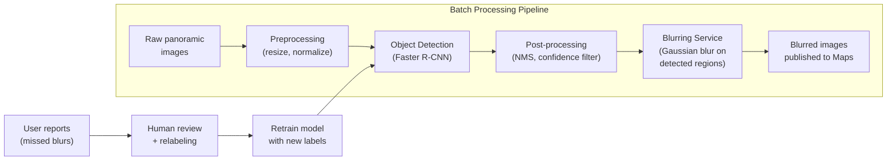

# Google Street View Blurring ML System Design

## Understanding the Problem

**What is Street View Blurring?**

Google Street View captures imagery of streets around the world using camera-equipped vehicles. Before publishing these images, Google must blur personally identifiable information — human faces and license plates — to protect privacy. The ML challenge is building an object detection system that finds every face and every license plate in billions of panoramic images, with near-perfect recall, because a single missed face is a privacy violation that could have legal consequences under GDPR and similar regulations.

This is harder than it sounds because street imagery is messy — faces at extreme distances, partially occluded faces, faces in reflections, license plates from dozens of countries with different formats, and all of this under varying lighting, weather, and camera angles.

## Problem Framing

### Clarify the Problem

- What objects do we need to detect and blur? Just faces and license plates, or also body silhouettes, text on signs, or other PII?
- The primary targets are human faces and license plates. Other objects like visible VINs or name badges are out of scope for now, but good to flag.

- What's the scale? How many images need processing?
- Billions of street-level panoramic images in the existing corpus, with millions of new images captured weekly as cars continue driving.

- Are there latency constraints? Does blurring need to happen in real-time?
- No. This is offline batch processing. Existing images are already displayed to users while new captures are processed in the background. We have hours to days to process each batch.

- Do we have labeled training data?
- Yes. About 1 million images with bounding box annotations for faces and license plates.

- Is there a user feedback mechanism?
- Yes. Users can report images where faces or plates weren't blurred. This creates a feedback loop for improving the model.

- What's more important — catching every face (recall) or avoiding false blurs (precision)?
- Recall is critical. A missed face is a privacy violation. A false positive (blurring a non-face) is just a cosmetic issue. We strongly prefer high recall, even at the cost of some false positives.

- Does the system need to handle international license plate formats?
- Yes. License plates vary significantly across countries — different sizes, shapes, colors, and character sets. The model must generalize across all of them.

### Establish a Business Objective

#### Bad Solution: Maximize detection accuracy (precision = recall)

Treating precision and recall as equally important misses the fundamental asymmetry of this problem. A missed face (false negative) is a privacy violation that could lead to lawsuits, regulatory fines, and user trust erosion. A false blur (false positive) is a cosmetic blemish — a tree trunk or mailbox gets an unnecessary blur. These errors have vastly different costs.

#### Good Solution: Maximize recall at a fixed precision threshold

Set a minimum recall target (e.g., 99.5%) and optimize precision subject to that constraint. This captures the asymmetry — we never want to miss faces, but we also don't want to blur half the image.

The limitation: a single recall threshold doesn't capture the severity difference between missing a close-up face (clearly identifiable) vs a distant face (barely visible). Not all misses are equally harmful.

#### Great Solution: Weighted recall prioritizing high-risk detections + user complaint rate

Assign higher weights to detections where privacy risk is greatest (close-up faces, clearly readable license plates) and lower weights to edge cases (distant faces, partial occlusions). Complement this with a user complaint rate metric — the fraction of published images where users report unblurred PII. The complaint rate is the ground truth that matters most: if users aren't reporting privacy issues, the system is working.

This multi-signal objective balances model-level quality (weighted recall) with real-world impact (user complaints). The downside is that user complaints are sparse and biased — they only cover images that users actually view and where they notice the issue.

### Decide on an ML Objective

This is an **object detection** problem. The model must:
1. **Localize** objects: predict bounding boxes (x, y, width, height) around each face and license plate — a regression task
2. **Classify** objects: determine if each detection is a face, license plate, or background — a classification task

The ML objective is to maximize mean Average Precision (mAP) at IoU=0.5, with a particular focus on recall ≥ 99.5% for both object classes.

## High Level Design

The system is a batch processing pipeline. Raw images flow through preprocessing, object detection, post-processing (NMS to remove duplicate detections), and blurring. User reports of missed blurs feed back into the training loop. Since there are no latency constraints, we optimize for detection quality over speed.

## Data and Features

### Training Data

#### Bad Solution: Rely solely on the static 1M annotated dataset

Use only the existing 1M labeled images for training. This seems sufficient — 1M images is a large dataset — but it misses two critical issues. First, the dataset was annotated at one point in time and may not reflect the current distribution of real-world captures (new camera hardware, new geographies, seasonal changes). Second, the model's worst failures — the cases users report — are not represented in the original training set, because those failure modes weren't known when the data was collected.

#### Good Solution: Augmented dataset plus user feedback loop

Augment the 1M labeled images to ~10M through random crop, flip, rotation, brightness/contrast jitter, scale variations, and occlusion simulation. Additionally, integrate user reports: when users flag unblurred faces or plates, human reviewers verify and create new annotations, which are added to the training set. This targets the model's actual failure modes.

The limitation: augmentation creates synthetic diversity but doesn't introduce truly new scenarios (new plate formats, unusual face presentations). The user feedback loop is reactive — you only fix cases that slip through AND get reported by users.

#### Great Solution: Multi-source pipeline — annotated + augmented + synthetic + active learning

Combine four data sources:
1. **Core labeled set** (1M images, augmented to 10M) — the foundation
2. **User reports** (continuous) — hard examples where the model fails in production
3. **Synthetic data** — render fake license plates with correct country-specific format, font, and color, composited onto street scenes. This fills coverage gaps for underrepresented regions without expensive manual annotation
4. **Active learning** — run the current model on unlabeled images, select the predictions with lowest confidence, and send those to human reviewers. This targets the decision boundary where the model is most uncertain

This multi-source approach provides both breadth (synthetic data covers new regions) and depth (active learning and user reports target failure modes). The downside is pipeline complexity — four data sources means four ingestion paths, deduplication logic, and quality monitoring.

### Features

For object detection, the "features" are the image pixels processed by the CNN backbone. No manual feature engineering is needed.

#### Image Properties
- **Resolution:** Panoramic images are high-resolution (typically 8000×4000 or larger). May need to be processed in tiles.
- **Camera metadata:** Pitch, yaw, roll of the camera. Useful for knowing expected face/plate orientations.
- **Location metadata:** GPS coordinates. Not used for detection directly but useful for post-processing (e.g., known license plate format for the region).

## Modeling

### Benchmark Models

> "I'd start with a pretrained Faster R-CNN with a ResNet-50 backbone, fine-tuned on our 1M annotated images. This gives us a strong baseline with well-understood behavior. We can measure recall and precision, identify failure modes, and iterate from there."

### Model Selection

#### Bad Solution: Image classification (face present / not present)

A classifier that answers "does this image contain a face?" provides no localization — it can't tell you WHERE the face is, which you need for blurring. This framing fundamentally misses the localization requirement.

#### Good Solution: One-stage detector (YOLO v5/v8)

YOLO processes the entire image in a single pass and outputs bounding boxes + classes simultaneously. It's fast and handles most cases well.

Limitation: One-stage detectors can miss small objects (distant faces, small license plates) because they process at a fixed grid resolution. For a privacy-critical application where missing even one face has consequences, this recall gap is concerning.

#### Great Solution: Two-stage detector (Faster R-CNN) with a recall-optimized configuration

Faster R-CNN first proposes candidate regions (Region Proposal Network), then classifies each region. The two-stage process is more accurate, especially for small objects, because the RPN can propose regions at multiple scales.

| Approach | Speed | Small Object Detection | Recall | Best For |
|----------|-------|----------------------|--------|----------|
| YOLO v8 | Very fast (~5ms/image) | Good but not best | 95-97% | Real-time applications |
| Faster R-CNN | Slower (~50-200ms/image) | Excellent | 98-99%+ | Offline, recall-critical |
| DETR (transformer) | Moderate | Good | 97-98% | When global context matters |

**Recommended:** Faster R-CNN. The offline processing mode means speed doesn't matter. Privacy demands the highest possible recall. Faster R-CNN with careful tuning can achieve 99%+ recall on faces.

### Model Architecture

#### Backbone: ResNet-101 or ResNet-152

Deeper backbone = better feature extraction for small objects. Since inference speed doesn't matter (offline processing), we can afford a larger backbone.

#### Region Proposal Network (RPN)

Generates candidate regions at multiple scales and aspect ratios. For faces and license plates, configure anchor boxes that match their typical sizes and shapes:
- Faces: roughly square, various sizes (close-up to distant)
- License plates: wide rectangles, more uniform size range

#### Detection Head

Classifies each proposal as face, license plate, or background, and refines the bounding box coordinates.

### Loss Function

Multi-task loss combining classification and localization:

`L = L_cls + λ × L_reg`

where:
- `L_cls` = cross-entropy loss for class prediction (face / plate / background)
- `L_reg` = smooth L1 loss for bounding box regression (x, y, w, h)
- `λ` = weight balancing classification and regression (typically 1.0)

**Asymmetric weighting for recall:** Increase the weight of false negatives in the classification loss to penalize missed detections more heavily than false positives.

## Inference and Evaluation

### Inference

#### Batch Processing Pipeline

1. **Tiled processing:** Panoramic images (8000×4000) are too large for a single model pass. Split into overlapping tiles, detect in each tile, merge detections, and apply NMS to remove duplicates at tile boundaries.
2. **Multi-scale detection:** Run detection at multiple scales to catch both close-up faces and distant ones.
3. **Confidence threshold:** Set low (e.g., 0.3) to maximize recall. Better to over-blur than miss a face.
4. **Non-Maximum Suppression (NMS):** Merge overlapping detections. Use a generous IoU threshold (0.3) to avoid suppressing legitimate nearby detections.
5. **Blurring:** Apply Gaussian blur to all detected regions with a margin (extend bounding box by 10-20% to ensure full coverage).

**Throughput:** At ~200ms per tile and ~20 tiles per panorama, processing one panorama takes ~4 seconds. With a GPU cluster, millions of images can be processed daily.

### Evaluation

#### Bad Solution: Use mAP as the single evaluation metric

Mean Average Precision (mAP) is the standard object detection metric, and it seems like the obvious choice. But mAP balances precision and recall equally — it doesn't capture the asymmetric error cost of this problem. A model with 98% precision and 95% recall has a similar mAP to one with 95% precision and 98% recall, but the second model is far better for privacy protection. Reporting a single mAP number hides whether the model is failing on the dimension that matters most.

#### Good Solution: Recall-focused metrics with size-based stratification

Report recall@0.5 IoU as the primary metric, stratified by object size (small <32px, medium 32-96px, large >96px) and by class (face vs license plate). Set a hard threshold: recall must be ≥99.5% across all strata before deploying. Report precision as a secondary metric to ensure false blurs don't degrade image quality below an acceptable threshold (~90%).

This captures the asymmetry and reveals where the model struggles (typically small faces). The limitation: offline metrics can't capture the real-world distribution of images users actually view.

#### Great Solution: Offline recall metrics + online user complaint rate + geographic slicing

Combine offline metrics (recall by size and class, precision) with online metrics (user complaint rate — fraction of published images with reported unblurred PII). Slice everything by geographic region to catch performance gaps in underrepresented countries. Set a user complaint rate target of <0.001%.

The user complaint rate is the ground truth that matters most — it measures actual privacy failures in production. The downside is that complaints are sparse, biased (only images users view), and lagging (issues may exist for weeks before someone reports them).

#### Offline Metrics

| Metric | What It Measures | Target |
|--------|-----------------|--------|
| Recall@0.5 IoU | % of ground truth objects detected with IoU ≥ 0.5 | ≥ 99.5% |
| Precision@0.5 IoU | % of detections that are correct | ≥ 90% (acceptable to have some false blurs) |
| mAP@0.5 | Mean Average Precision at IoU threshold 0.5 | ≥ 95% |
| Recall by size | Recall for small (<32px), medium (32-96px), large (>96px) objects | ≥ 98% for all sizes |

**Recall is the primary metric.** Report it sliced by object size, object class, and geographic region.

#### Online Metrics

- **User complaint rate:** Fraction of published images where users report unblurred PII. Target: <0.001%
- **False blur report rate:** Users reporting unnecessary blurring (not as critical but affects image quality)
- **Time to resolution:** How quickly reported issues are fixed (re-blurred and republished)

## Deep Dives

### ⚠️ Small and Distant Face Detection

Faces that are far from the camera (10-20 pixels across) are the hardest to detect and the most commonly missed. Standard detectors trained at a single scale struggle with these.

**Approach:** Feature Pyramid Networks (FPN) — generate feature maps at multiple resolutions and detect objects at each level. Small objects are detected in high-resolution, low-level feature maps; large objects in low-resolution, high-level maps. This is standard in modern Faster R-CNN implementations.

Additionally, use test-time augmentation: run detection on the original image AND on 2x upscaled crops of the image. Merge detections. The upscaled version catches small faces that the original-scale pass missed.

### 💡 Recall vs Precision: The Asymmetric Error Cost

A false negative (missed face) is a privacy violation. A false positive (blurring a fire hydrant) is a cosmetic issue. How do you operationalize this asymmetry?

**In training:** Use asymmetric class weights in the loss function. Weight false negatives 5-10x more than false positives. This shifts the model's decision boundary to favor recall.

**In post-processing:** Set the confidence threshold low (0.2-0.3). This catches borderline detections at the cost of more false positives. For a privacy-critical system, this is the right tradeoff.

**In monitoring:** Track recall and precision separately. Alert on recall drops immediately. Tolerate precision drops as long as the false blur rate stays below a cosmetic threshold.

### 📊 International License Plate Variability

License plates vary dramatically across countries: size, shape, color, character set, mounting position. A model trained primarily on US license plates will miss European or Asian plates.

**Approach:** Ensure the training data includes plates from all major regions. If labeled data is scarce for some regions, use synthetic data generation — render fake license plates with correct format, font, and color for each country, composited onto street scenes. Active learning can help: after initial deployment, prioritize labeling user-reported misses from underrepresented regions.

### 🏭 Panoramic Image Processing

Street View images are 360° panoramas, not standard rectangular photos. This creates challenges:

- **Distortion:** Objects at the edges of the equirectangular projection are distorted. Faces near the poles are stretched. The detector may not recognize distorted faces.
- **Wrap-around:** An object at the left edge of the panorama continues at the right edge.
- **Size:** Full panoramas are 8000×4000+ pixels — too large for a single model pass.

#### Bad Solution: Resize the full panorama to model input size and run detection once

Resize the 8000×4000 panorama to 800×400 (or whatever the model accepts) and run a single detection pass. This is fast but catastrophic for recall — small faces that were 15 pixels in the original image become 1.5 pixels after 10x downscaling. They become undetectable. You also preserve the equirectangular distortion, which warps faces near the poles into unrecognizable shapes.

#### Good Solution: Tile the panorama into overlapping patches

Split the panorama into overlapping tiles (e.g., 1024×1024 with 20% overlap), run detection on each tile independently, merge detections across tiles, and apply NMS to remove duplicates at tile boundaries. This preserves resolution and catches small faces.

The limitation: equirectangular distortion is still present. Faces near the top and bottom of the panorama are stretched, and the detector may not recognize them. Tile boundaries can also split objects in unfortunate ways.

#### Great Solution: Convert to perspective projections at multiple viewpoints

Convert the panorama to perspective projections — essentially simulate what a flat camera would see when pointing in each direction (front, left, right, rear, up, down). Each perspective view is distortion-free and looks like a standard photo. Run detection on each view, then project detections back to panoramic coordinates and deduplicate.

This eliminates distortion entirely and produces standard rectangular images the model handles well. The downside is computational cost — 6+ perspective views per panorama means 6+ detection passes — but since processing is offline with no latency constraint, this is acceptable for the recall improvement.

### ⚠️ The Human Review Pipeline

Even with 99.5% recall, at billions of images, the 0.5% miss rate means millions of unblurred faces. The human review pipeline is essential:

1. **Automated triage:** Prioritize images from high-traffic areas and recently published images
2. **User reports:** When a user reports an unblurred face, the image is queued for human review
3. **Human review:** Annotators verify the report and draw bounding boxes for missed detections
4. **Immediate fix:** The image is re-blurred and republished
5. **Feedback to training:** The corrected annotations are added to the training set, specifically targeting the model's weaknesses

This pipeline turns production failures into training improvements — the model gets better at exactly the cases it currently fails on.

### 💡 Faces in Unusual Contexts

The model must detect faces not just in standard orientations but in challenging contexts:
- **Reflections:** Faces visible in car mirrors, shop windows, and reflective surfaces
- **Photographs:** Faces on posters, billboards, or TV screens visible in the scene
- **Partial occlusion:** Faces partially hidden behind objects, wearing sunglasses, or turned away
- **Non-standard angles:** Faces viewed from above (drone imagery) or below

**Decision:** Should we blur faces in reflections and posters? From a privacy perspective, yes — a face in a car mirror is still identifiable. From a practical perspective, poster faces are not private individuals. The policy decision affects the training data: if we decide to blur reflections but not posters, annotators must distinguish between them.

### 📊 Model Retraining Strategy

How often should the model be retrained?

**Triggered retraining:** Retrain when the user complaint rate exceeds a threshold (e.g., 0.001% of published images). Use all accumulated user reports + human corrections as new training data, combined with the original labeled dataset.

**Geographic expansion:** When Street View expands to new countries, the model may need fine-tuning for local license plate formats and demographic variations. Collect and annotate a seed dataset from the new region, then fine-tune.

### 🏭 Blurring Quality and Adversarial Considerations

The blurring itself must be sufficient to prevent identification:
- **Gaussian blur** with sufficient kernel size (the blurred region must not be recoverable)
- **Extend the bounding box** by 10-20% beyond the detection — if the box is slightly too tight, part of the face may be visible at the edge
- **Consider adversarial de-blurring:** With modern super-resolution models, light blurring can be reversed. The blur strength must be strong enough to be irreversible.

## What is Expected at Each Level?

### Mid-Level Engineer

Mid-level candidates should frame this as an object detection problem with two classes (face, license plate) and propose using a detector like YOLO or Faster R-CNN. They should recognize that this is offline batch processing (no latency constraint) and that recall is more important than precision because missing a face is a privacy violation. They differentiate by mentioning data augmentation to expand the training set and mAP as the evaluation metric.

### Senior Engineer

Senior candidates demonstrate understanding of the asymmetric error cost and how to operationalize it — asymmetric loss weights, low confidence thresholds, and recall-focused evaluation. They propose Faster R-CNN over YOLO because recall matters more than speed for offline processing, and discuss Feature Pyramid Networks for detecting small/distant faces. For the serving pipeline, they describe tiled processing of panoramic images and NMS for merging overlapping detections. They proactively bring up the human review pipeline as a feedback mechanism and international license plate variability as a data challenge.

### Staff Engineer

Staff candidates quickly establish the standard architecture (Faster R-CNN + FPN, offline batch, recall-optimized) and focus on the systemic challenges. They might discuss the tension between recall and false blur rate at scale — 99.5% recall across 10 billion images still means 50 million potential misses, so the human review pipeline must be carefully designed to scale. They think about the panoramic projection problem (equirectangular distortion, converting to perspective views). A Staff candidate recognizes that the hardest problem isn't model accuracy — it's defining the policy boundary (should we blur faces in reflections? on posters? at what distance threshold?) and building the operational infrastructure to continuously improve the system through user feedback.
