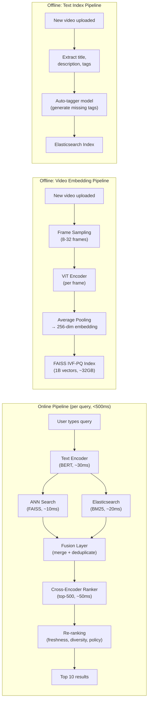

# YouTube Video Search ML System Design

## Understanding the Problem

Video search is one of the hardest information retrieval problems in production ML. Users type a short text query — "funny cat videos" or "how to fix a leaky faucet" — and the system must find the most relevant videos from a corpus of over 1 billion items, in under 500ms. The difficulty is that search spans two completely different modalities: the user expresses intent through text, but relevance lives in the video's visual content, audio, metadata, and engagement history. A video titled "VID_20240301.mp4" could be exactly what the user wants, but a text-only system would never find it. A video with a perfect title might show completely irrelevant content. The system must bridge this cross-modal gap at massive scale.

This makes video search a fascinating ML design problem because it combines NLP (understanding the query), computer vision (understanding video content), information retrieval (searching billions of items efficiently), and ranking (putting the best results first) — all under strict latency constraints.

## Problem Framing

### Clarify the Problem

**Q:** What is the input modality? Are users searching with text only, or can they search with images or video clips?
**A:** Text queries only. Users type a search string and receive a ranked list of video results.

**Q:** How large is the video corpus?
**A:** Approximately 1 billion videos, with roughly 500 hours of new video uploaded every minute — about 720,000 new videos per day.

**Q:** Do we have labeled training data?
**A:** Yes. We have 10 million (text query, relevant video) pairs derived from user click data, plus implicit signals like watch time and engagement.

**Q:** What determines whether a video is "relevant" to a query?
**A:** Both the video's visual content and its textual metadata (title, description, tags, auto-generated transcript). A video about cooking pasta should be found even if the title is just "Sunday dinner vlog."

**Q:** What is the latency requirement?
**A:** Under 500ms end-to-end for interactive search. Users expect near-instant results.

**Q:** Is the search personalized?
**A:** No. Unlike recommendations, this is a non-personalized search system. The same query returns the same results for all users.

**Q:** Do we need to support multiple languages?
**A:** English only for now. Multilingual search is a future extension.

**Q:** Any content policy requirements?
**A:** Yes — results must be filtered for policy violations, near-duplicates should be deduplicated, and we need freshness signals so that trending queries surface recent content.

### Establish a Business Objective

#### Bad Solution: Maximize text-match precision

Count what fraction of returned videos contain the exact query terms in their title or description. This is the simplest metric — just measure keyword overlap. The problem is obvious: semantic queries like "dogs being goofy" won't match any video title literally. Users don't search in the language of video titles. And videos with misleading titles ("MUST WATCH!! Best video ever") would rank highly even when the content is irrelevant. Keyword matching captures maybe 40% of user intent at best.

#### Good Solution: Maximize click-through rate (CTR)

CTR measures whether users found results compelling enough to click. This is a real behavioral signal — users vote with their clicks. It's better than keyword matching because it captures semantic relevance, not just word overlap.

The limitation: CTR is heavily biased by position (the first result gets 30-40% of clicks regardless of quality), by thumbnail attractiveness (clickbait thumbnails inflate CTR), and by video title appeal. A model optimizing purely for CTR learns to surface videos with eye-catching thumbnails and titles, not necessarily the most relevant content. Users click, realize the video isn't what they wanted, and bounce.

#### Great Solution: Maximize total watch time after search + search success rate

**Total watch time** after search results are shown is YouTube's north star metric for search quality. Users who find what they're looking for watch more — it directly measures whether the search delivered value.

Complement this with **search success rate**: did the user watch >30% of the clicked video AND not immediately re-search the same query? This captures genuine satisfaction. A user who clicked, watched 60 seconds of a 10-minute video, then searched the same query again clearly didn't find what they wanted — even though CTR counted it as a success.

This multi-signal objective captures both immediate relevance (watch time) and user satisfaction (no re-search). The tradeoff is that watch time is biased toward longer videos (a 2-hour documentary generates more watch time than a 30-second answer even if the short video was exactly what the user wanted), so normalizing by video length or using completion rate as a secondary metric is important.

### Decide on an ML Objective

This is a **cross-modal retrieval and ranking** problem. The core ML task is learning two embedding functions:

- `f_text(query) → ℝ^d` — maps a text query to a d-dimensional vector
- `f_video(video) → ℝ^d` — maps a video to a d-dimensional vector in the same space

such that `similarity(f_text(q), f_video(v))` is high when video `v` is relevant to query `q` and low otherwise. At serving time, we pre-compute all video embeddings offline, and at query time we embed the query and find the nearest video embeddings using ANN search.

The training objective is **contrastive learning with InfoNCE loss**: for each (query, positive video) pair in a batch, maximize the similarity of the positive pair while minimizing similarity against all other videos in the batch (in-batch negatives).

## High Level Design



The system uses a **dual-path architecture**:

1. **Visual/Semantic Search Path:** Encodes the text query with BERT and retrieves videos whose visual content is semantically similar via ANN search over pre-computed video embeddings.
2. **Text Search Path:** Uses Elasticsearch (BM25) to find videos whose titles, descriptions, and tags match query keywords.
3. **Fusion Layer:** Merges results from both paths, deduplicates, and produces a combined candidate set.
4. **Cross-Encoder Ranker:** Re-scores the top candidates using a more expensive model that sees the full query-video interaction.
5. **Re-ranking Service:** Applies business logic — freshness boosting, diversity (max 3 from same channel), content policy filtering.

The dual-path design is essential because each path catches what the other misses. Text search finds videos with matching titles ("how to change a tire"), while semantic search finds videos whose content matches even when the title doesn't ("that song with the blue umbrella" → finds the music video by visual content).

## Data and Features

### Training Data

#### Bad Solution: Use raw click data directly as relevance labels

Treat every click as a positive pair (query, clicked video) and every impression-without-click as a negative pair. The data is abundant (~10M pairs), easy to collect, and requires no human annotation. But raw click data is deeply contaminated: position bias means the first result gets 30-40% of clicks regardless of relevance, thumbnail-bait videos accumulate clicks they don't deserve, and impression-without-click is unreliable as a negative (users don't scroll far enough to see most results). A model trained on raw clicks learns to replicate the previous model's rankings — a self-reinforcing loop that entrenches existing biases.

#### Good Solution: Quality-weighted clicks with IPS correction

Filter clicks to keep only those where the user watched >30 seconds of the video (genuine interest, not curiosity clicks). Weight each click by `normalized_watch_time × (1/P(position))`, where the watch-time factor captures relevance strength and the IPS factor corrects for position bias. Use shown-but-skipped impressions (where the user had sufficient dwell time on the result page) as hard negatives.

This captures behavioral quality, not just raw volume. The limitation: IPS weights have high variance for rarely-shown positions, and the watch-time threshold is arbitrary — a 30-second cutoff treats a 31-second view of a 1-minute video very differently from a 31-second view of a 2-hour movie.

#### Great Solution: Multi-signal training pipeline with exploration data

Combine three training signals:
1. **IPS-corrected click data** (quality-weighted by watch-time completion rate) — the primary signal
2. **Exploration data** — 5% of search traffic includes randomized results at lower positions, providing unbiased relevance labels. This breaks the feedback loop by collecting data on videos the model would never surface on its own
3. **Cross-encoder distillation** — train a high-quality cross-encoder on human-rated query-video pairs (~100K), then use cross-encoder scores as soft labels for the bi-encoder retrieval model. This transfers nuanced relevance judgments without requiring human labels at scale

Temporal split: train on months 1-8, validate on month 9, test on month 10. Never split randomly — search query distribution shifts over time (trending topics, seasonality).

**Volume estimates:**
- ~10M (query, video) pairs from click logs
- ~500K unbiased pairs from exploration data (5% of traffic)
- ~100K human-rated pairs for cross-encoder training

### Features

**Text Features (Query Side)**
- Raw query text → tokenized with WordPiece (BERT's tokenizer, 30K vocabulary)
- Text normalization: lowercase, strip accents, NFKD normalization
- Sequence length: truncate to 128 tokens (queries are short)
- Output: 768-dim BERT [CLS] embedding → projected to 256-dim

**Video Features (Visual Path)**
- Frame sampling: 8-32 frames uniformly sampled per video (or keyframe detection for efficiency)
- Frame preprocessing: decode to RGB, resize to 224×224, normalize by ImageNet mean/std
- Frame encoder: ViT-B/16 → 768-dim [CLS] token per frame
- Aggregation: average pooling over frame embeddings → projected to 256-dim
- Alternative: attention-weighted pooling (learn which frames are most representative — avoids diluting signal with black transition frames or talking-head segments)

**Video Features (Text Path)**
- Title, description, uploader-provided tags → indexed in Elasticsearch
- Auto-generated transcript (speech-to-text) → also indexed
- Auto-tagger model: generates tags from video visual content, especially valuable when uploaders provide no tags
- Channel metadata: channel name, category, subscriber count (used in re-ranking, not retrieval)

**Engagement Features (used in re-ranking only)**
- View count, like/dislike ratio, comment count
- Video age (days since upload)
- Historical CTR for this query-video pair (if available)
- Channel authority score

## Modeling

### Benchmark Models

**BM25 Baseline:** Use Elasticsearch to match query terms against video titles, descriptions, and transcripts. No ML training needed. This handles exact keyword matches well ("Taylor Swift concert 2024") but fails on semantic queries ("dogs being goofy") and videos with poor metadata.

**TF-IDF + Cosine Similarity:** Represent both queries and video metadata as TF-IDF vectors, compute cosine similarity. Slightly better than raw BM25 for multi-word queries but still has no semantic understanding.

### Model Selection

| Approach | Pros | Cons | When to use |
|----------|------|------|-------------|
| **BM25 (keyword search)** | No training needed, handles exact matches, sub-20ms latency | No semantic understanding, misses paraphrase and concept queries | Always — as one path in the dual-path system |
| **Two-Tower (bi-encoder)** | Pre-compute video embeddings, O(log N) query time via ANN, handles semantic queries | Separate encoding means no query-video interaction, lower quality than cross-encoder | Retrieval stage — scale demands it |
| **Cross-Encoder** | Sees full query-video interaction, highest relevance quality | O(N) per query — infeasible for 1B videos, must limit to top-K candidates | Ranking stage — run on top-500 candidates only |
| **Late Interaction (ColBERT-style)** | Multiple vectors per document, richer interaction than bi-encoder | Larger index (10x more vectors), more complex serving | When single-vector retrieval quality is insufficient |

### Model Architecture

**Retrieval: Two-Tower with Contrastive Learning**

The retrieval model uses separate encoders for text and video, trained jointly with contrastive learning.

**Text encoder:** BERT-base (12 layers, 768 hidden, 12 attention heads, 110M parameters). Input: tokenized query (max 128 tokens). Output: [CLS] token → linear projection to 256-dim.

**Video encoder:** ViT-B/16 (12 layers, 768 hidden, 86M parameters). Input: 8 sampled frames, each 224×224. Per-frame: ViT → [CLS] token (768-dim). Aggregate: average pool → linear projection to 256-dim.

**Training loss: InfoNCE (in-batch contrastive)**

For a batch of B (query, video) pairs, the loss for query i is:

```
L_i = -log[ exp(cos(t_i, v_i) / τ) / Σ_j exp(cos(t_i, v_j) / τ) ]
```

where `t_i` = text embedding, `v_i` = positive video embedding, τ = 0.07 (temperature). The denominator sums over all B videos in the batch — 1 positive + (B-1) in-batch negatives. Larger batch sizes give more negatives and better training signal.

**Why frame-level over video-level encoding:** Video-level models (3D convolutions, Video Transformers) capture temporal information (actions, motion) but are 5-10x more expensive. For search relevance, temporal understanding is rarely critical — "dogs playing in snow" doesn't require understanding the sequence of actions, just recognizing dogs and snow. Frame-level with average pooling gives 95% of the quality at 20% of the compute.

**Ranking: Cross-Encoder**

The ranking model sees the full query-video interaction. Input: [CLS] + query tokens + [SEP] + video metadata tokens (title, description). Architecture: 6-layer Transformer. Output: single relevance score per candidate. Runs on the top-500 candidates from retrieval. Latency: ~50ms on GPU for 500 candidates.

**Knowledge distillation (advanced):** Train the cross-encoder first (higher quality). Then use cross-encoder scores as soft labels to fine-tune the bi-encoder. The bi-encoder learns to approximate the cross-encoder's judgment within the constraints of separate encoding. This improves Recall@100 from ~80% to ~90%.

## Inference and Evaluation

### Inference

**Online pipeline (per query, <500ms budget):**

| Stage | What happens | Latency | Output |
|-------|-------------|---------|--------|
| Query preprocessing | Tokenize, normalize | 5ms | Token IDs |
| Text encoding | BERT-base forward pass | 30ms | 256-dim query embedding |
| Semantic retrieval | FAISS IVF-PQ ANN search | 10ms | Top-200 by visual similarity |
| Keyword retrieval | Elasticsearch BM25 | 20ms | Top-200 by text match |
| Fusion | Merge, deduplicate, normalize scores | 5ms | Top-500 combined candidates |
| Ranking | Cross-encoder on GPU | 50ms | Scored and re-sorted candidates |
| Re-ranking | Business rules, diversity, policy | 10ms | Final top-10 |
| **Total** | | **~130ms** | |

Semantic retrieval and keyword retrieval run **in parallel** — they're independent and their combined wall-clock time is max(10ms, 20ms) = 20ms, not 30ms.

**Offline pipelines:**

1. **Video embedding pipeline:** When a new video is uploaded, sample frames → ViT encoding → 256-dim embedding → insert into ANN index. For freshness, new videos go into a small HNSW buffer index; a daily batch job merges the buffer into the main IVF-PQ index.

2. **Text indexing pipeline:** When a new video is uploaded, extract title/description/tags → run auto-tagger model for missing tags → insert into Elasticsearch. Near-real-time updates.

**Scaling:**
- FAISS IVF-PQ index: 1B × 32 bytes (compressed) = 32GB — fits in RAM on 1-2 high-memory servers
- Replicate index across multiple shards for throughput (each shard handles different query load)
- Text encoder can be optimized with ONNX Runtime or TensorRT for faster inference

### Evaluation

**Offline Metrics:**

| Metric | What it measures | Why it matters for video search |
|--------|-----------------|-------------------------------|
| **MRR (Mean Reciprocal Rank)** | Average of 1/rank of the first relevant video | Primary metric. With typically 1 relevant video per query, MRR directly measures how quickly we find it. MRR = 1.0 means the relevant video is always rank 1. |
| **Recall@k** | Fraction of queries where the relevant video appears in top-k | For retrieval stage: Recall@100 (did we at least retrieve the right video?). For end-to-end: Recall@5, Recall@10. |
| **nDCG@10** | Normalized discounted cumulative gain | Useful when multiple videos have graded relevance (highly relevant, somewhat relevant, irrelevant). |

**MRR formula and example:**

```
MRR = (1/|Q|) × Σ(1/rank_i) for i = 1 to |Q|
```

Example: 3 queries, relevant video at rank 1, 3, and 2:
MRR = (1/3) × (1/1 + 1/3 + 1/2) = (1/3) × 1.833 = 0.611

**Why MRR over Precision@k:** With only 1 relevant video per query, Precision@10 is capped at 0.1 — it can't distinguish between good and bad rankings. MRR rewards the model for ranking the correct video as high as possible.

**Online Metrics (A/B testing):**
- **Primary:** Total watch time after search (YouTube's north star)
- **Secondary:** CTR@3 (click-through rate on top-3 results), video completion rate post-click
- **Guardrail:** Session abandonment rate (user searches but watches nothing), zero-result rate
- **Long-term:** Search success rate — user watched >30% of video AND did not re-search the same query within 5 minutes

**A/B testing considerations:**
- Randomize at user level (not query level) to avoid crossover effects
- Run for at least 2 weeks to separate novelty effects from sustained quality
- With 65% baseline search success rate and σ=15%, detecting a 1% lift requires ~3.3M queries — easily achievable at YouTube scale

## Deep Dives

### 💡 Dual-Path Fusion Strategy

The fusion layer combines results from semantic search and keyword search, but their scores are on completely different scales — cosine similarity (range [-1, 1]) vs BM25 scores (unbounded positive). Naive concatenation doesn't work.

#### Bad Solution: Use only the semantic path (or only BM25)

Pick one path and ignore the other. Semantic-only misses exact keyword matches — a navigational query like "MrBeast latest video" is best served by title match, not visual similarity. BM25-only misses conceptual queries — "dogs being goofy" won't match any video title literally. Either approach alone leaves 20-30% of query types poorly served.

#### Good Solution: Score-level fusion with tuned weights

Normalize both score sets to [0, 1] using min-max normalization within each result set. Then combine: `final_score = α × semantic_score + (1-α) × text_score`. Tune α on a held-out validation set (typically α ≈ 0.6, slightly favoring semantic search). This is simple, interpretable, and runs in <5ms.

The limitation: a single α doesn't account for query type — navigational queries should weight BM25 higher, while conceptual queries should weight semantic search higher.

#### Great Solution: Query-adaptive fusion with learned weights

Train a lightweight query classifier to predict the optimal fusion weight per query. Input: query embedding, query length, entity presence, temporal intent. Output: α for this specific query. Navigational queries ("MrBeast") get α=0.3 (favor BM25), semantic queries ("relaxing ambient music") get α=0.8 (favor semantic). This adds <2ms latency but adapts the fusion to each query's needs.

For the ranking stage, use full feature-level fusion: concatenate the text embedding and video embedding alongside keyword-match features, and let the cross-encoder learn the optimal combination. This is more powerful but only feasible for the top-500 candidates (not at retrieval scale).

### ⚠️ Position Bias and Click Contamination

Click data is the primary training signal, but clicks are heavily position-biased: the first result gets 30-40% of clicks regardless of relevance. Training on raw clicks teaches the model to replicate the previous model's rankings — a self-reinforcing loop.

**IPS correction:** Weight each training example by 1/P(position), where P is the estimated probability of clicking at that position. This reweights under-shown videos to correct for exposure bias. The risk: high-variance estimates for rarely-shown positions.

**Exploration data:** Inject 5% random results into live traffic (not shown to the user as top results — interleaved at lower positions). Log clicks on these random results as unbiased training data. This provides a clean evaluation signal and breaks the feedback loop.

**Counterfactual evaluation:** Use the doubly robust estimator to estimate what performance would have been under a different ranking policy, without actually deploying it. This lets you evaluate new models offline against the bias-corrected signal.

### 📊 Long-Tail and Head Query Dynamics

Query frequency follows a power law. Head queries ("cat videos", "music") have abundant click data. Tail queries ("1980s Bulgarian folk dance tutorial") have zero clicks.

**Head queries (top 1% of queries, ~50% of traffic):** Can be partially pre-computed. Cache the fusion results for the top 10,000 queries and refresh hourly. This eliminates inference latency for the most common searches entirely.

**Torso queries (next 19%, ~35% of traffic):** Sufficient click data for model training. The standard dual-path pipeline works well.

**Tail queries (bottom 80%, ~15% of traffic):** No click data, so the contrastive model has never seen these queries during training. Fallback strategy: rely more heavily on BM25 keyword search (which doesn't need training data) and use the semantic model's zero-shot generalization from similar queries. Query expansion via an LLM ("Bulgarian folk dance" → also search "Balkan traditional dance", "horo dance") can surface relevant results from better-covered query clusters.

### 🏭 Index Freshness and New Video Cold Start

YouTube ingests ~500 hours of video per minute. New videos must be searchable within minutes of upload — especially for trending topics, breaking news, and time-sensitive queries.

**Streaming embedding pipeline:** New video upload → event stream → video embedding pipeline (ViT on sampled frames, ~2 seconds per video on GPU) → write to a "new video buffer" (a small HNSW index of recent uploads). At query time, fan out to both the main IVF-PQ index (stable, 99%+ of corpus) and the new video buffer (recent uploads). Daily batch job merges the buffer into the main index.

**Cold start for engagement signals:** New videos have no view count, likes, or engagement history. The re-ranking stage can't use these signals. Mitigation: use content-quality proxy signals — channel authority (established channels produce consistently relevant content), category relevance (does the video's category match the query's typical category?), and thumbnail/title quality scores from a pre-trained classifier.

### ⚠️ Embedding Space Versioning

When you deploy a new version of the text or video encoder, the old pre-computed video embeddings are in the old embedding space. The new query embeddings are in the new space. They're incompatible — cosine similarity between old and new embeddings is meaningless.

**Option 1 — Full re-embedding:** Re-run the video encoder on all 1B videos. At ~2 seconds per video on GPU, this takes ~23,000 GPU-hours. Accurate but expensive and slow (days even with hundreds of GPUs).

**Option 2 — Compatibility mapping:** Train a lightweight linear projection `P` such that `P × old_embedding ≈ new_embedding`, using a sample of ~100K videos embedded by both models. Apply `P` to all old embeddings in hours. Quality loss: ~1-3% Recall, but deployable immediately.

**Option 3 — Frozen backbone:** Only fine-tune the projection head while keeping the backbone encoder frozen. Since backbone embeddings don't change, old and new embeddings are compatible by construction. Best for incremental updates; doesn't work for major architecture changes.

Production pattern: Option 3 for routine fine-tuning, Option 2 for major model upgrades, Option 1 only for annual full-system refreshes.

### 💡 Video Granularity — Full Video vs Segment Embedding

A single video can be 20 seconds or 2 hours. Embedding the full video as one vector dilutes the signal — a 1-hour documentary that discusses cooking for 5 minutes shouldn't score highly for "cooking tutorial," but average pooling over 60 minutes of frames drowns out the cooking segment.

#### Bad Solution: One embedding per video using average pooling over all frames

Sample 8-32 frames uniformly across the video, encode each with ViT, average pool into a single 256-dim vector. This works for short videos (< 5 minutes) where the content is focused, but it fails for long videos where the content is heterogeneous. A 2-hour podcast that briefly discusses machine learning gets the same diluted embedding as all other podcasts — the ML-relevant signal is drowned out by 115 minutes of unrelated content.

#### Good Solution: Segment-level embedding with deduplication

Split videos into 30-60 second segments, embed each independently, index all segments. At query time, the ANN search finds relevant segments. Return results at the video level (with a timestamp for the relevant segment). This dramatically improves recall for specific topics within long videos.

The downside: the index grows ~10x (30 segments per video × 1B videos = 30B vectors), requiring more aggressive compression (PQ with higher compression ratio) and deduplication in results (multiple segments from the same video).

#### Great Solution: Hierarchical embedding — video-level + keyframe segments + transcript segments

Maintain two representation levels:
1. **Video-level embedding** — average pool over uniformly sampled frames. Used for the first-pass ANN retrieval as a coarse filter
2. **Segment embeddings** — keyframe-detected segments + transcript-aligned segments, each independently embedded. Used for fine-grained re-ranking

At query time, coarse retrieval uses the video-level index (1B vectors, fast). For top-500 candidates, re-score using segment-level similarity (return the max similarity across all segments). This gives the quality of segment search with the speed of video-level retrieval. The system also returns the specific segment timestamp, enabling "jump to relevant part" in the UI.

### 📊 Query Understanding

Raw user queries are noisy and ambiguous. A query understanding module between the user and the search pipeline can significantly improve result quality.

**Spelling correction:** "funy cat vidoes" → "funny cat videos". Use a character-level model or edit-distance matching against a query log dictionary. Critical for user experience — misspelled queries account for 5-10% of search traffic.

**Query intent classification:** Is this an informational query ("how to tie a tie"), navigational query ("MrBeast latest video"), or entertainment query ("relaxing music")? Each intent type benefits from different ranking signals — navigational queries should heavily weight exact title match; entertainment queries should weight engagement.

**Entity recognition:** "Taylor Swift Eras Tour" → entity = Taylor Swift, event = Eras Tour. Enables structured matching against video metadata (channel name, video tags) and entity-specific boosting.

**Temporal intent detection:** "latest iPhone review" should boost recent uploads. "Best 90s music" should not. Detecting temporal intent and adjusting freshness signals accordingly prevents stale results for trending queries.

### ⚠️ Multimodal Search Extension

The current system uses text queries to search video. A natural extension is incorporating audio signals from the videos themselves.

**Speech-to-text transcripts:** Auto-generate transcripts for all videos using ASR (automatic speech recognition). Index transcripts in Elasticsearch alongside titles and descriptions. This is especially valuable for instructional videos where the most relevant content is spoken, not shown visually. Transcript quality varies — errors are common for accented speech, technical jargon, and music-heavy content.

**Audio embeddings:** Encode audio features (music genre, ambient sounds, speech patterns) and include them in the video representation. Useful for queries like "upbeat workout music" or "ASMR rain sounds" where audio content is the primary relevance signal.

**Cross-lingual search (future):** Replace BERT with multilingual BERT (mBERT) or XLM-R. This enables English queries to find Spanish-titled videos if the content is relevant. The contrastive learning objective naturally handles this — it learns that a Spanish video about cooking and an English query about cooking should be close in embedding space, because users who speak both languages click on both.

## What is Expected at Each Level?

### Mid-Level Engineer

A mid-level candidate should recognize that video search requires both text matching and visual understanding, and propose a system with keyword search (Elasticsearch) plus some form of semantic search. They should identify BERT as a text encoder and a CNN or ViT as a video encoder, understand that contrastive learning trains them jointly, and choose MRR as the primary offline metric. They differentiate by explaining why two-tower architecture is necessary at 1B scale — a cross-encoder over the full corpus is computationally infeasible.

### Senior Engineer

A senior candidate will design the complete dual-path architecture, explain why both paths are necessary (keyword search catches exact matches, semantic search catches paraphrase and concept queries), and detail the fusion strategy. They proactively discuss position bias in click data and propose IPS correction or exploration data injection. For evaluation, they distinguish retrieval-stage metrics (Recall@100) from end-to-end metrics (MRR@10), propose total watch time as the online metric, and mention the offline-online gap caused by exposure bias. They bring up the cross-encoder ranking stage and explain why it can only run on the candidate set, not the full corpus.

### Staff Engineer

A Staff candidate will quickly establish the dual-path retrieval + cross-encoder ranking architecture and then go deep on the hardest production challenges: how to handle the training-serving feedback loop (the model trains on its own recommendations, creating exposure bias), how to manage index freshness (new videos must be searchable within minutes), and how embedding versioning works when model updates invalidate the entire pre-computed index. They'll identify that the biggest risk isn't model quality — it's the feedback loop where the model never learns about videos it never shows, creating a self-reinforcing bias toward popular content. They might propose a universal query understanding service shared across search, ads, and recommendations — recognizing the platform opportunity beyond the immediate search problem.

## References

- Devlin et al., "BERT: Pre-training of Deep Bidirectional Transformers for Language Understanding" (2019)
- Dosovitskiy et al., "An Image is Worth 16x16 Words: Vision Transformers" (ViT, 2020)
- Radford et al., "Learning Transferable Visual Models From Natural Language Supervision" (CLIP, 2021)
- Johnson et al., "Billion-scale similarity search with GPUs" (FAISS, 2019)
- Khattab & Zaharia, "ColBERT: Efficient and Effective Passage Search via Contextualized Late Interaction" (2020)
- Robertson & Zaragoza, "The Probabilistic Relevance Framework: BM25 and Beyond" (2009)
