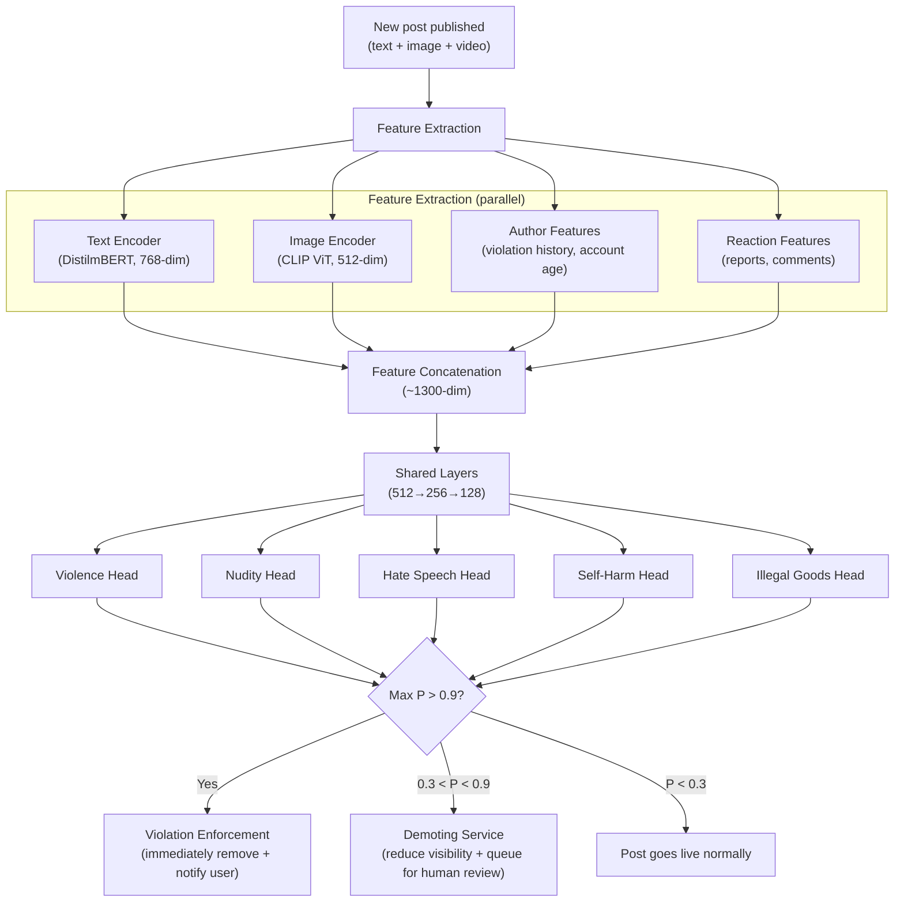

# Harmful Content Detection ML System Design

## Understanding the Problem

Every major social media platform faces the same challenge: billions of posts are created daily, and a small but dangerous fraction contains harmful content — violence, hate speech, nudity, self-harm instructions, or illegal goods. A platform with 500 million posts per day and a 0.5% harmful rate still produces 2.5 million harmful posts daily. Human reviewers can handle maybe 10 million reviews per day (at enormous cost and psychological toll), but the system needs to catch the most dangerous content within seconds of publication, before it goes viral.

This makes harmful content detection one of the highest-stakes ML problems in production: false negatives let harmful content reach millions of users, while false positives suppress legitimate speech and alienate creators. The system must handle multimodal content (text, images, video, and combinations like memes where neither modality alone is harmful), operate in 50+ languages, adapt to adversarial evasion, and explain its decisions when users appeal.

## Problem Framing

### Clarify the Problem

**Q:** Are we detecting harmful content, bad actors (fake accounts, bots), or both?
**A:** Both matter, but we're focusing on harmful content detection — classifying whether a specific post violates community guidelines, regardless of who posted it.

**Q:** What content modalities do posts contain?
**A:** Posts can include text, images, video, or any combination. A significant challenge is multimodal content like memes, where a benign image plus benign text creates harmful meaning together.

**Q:** What types of harm are we detecting?
**A:** Five categories: violence, nudity/sexual content, hate speech, self-harm, and illegal goods/activities. Each has different detection difficulty and different error cost profiles.

**Q:** How many posts per day?
**A:** Approximately 500 million posts per day — about 5,800 posts per second.

**Q:** What is the latency requirement?
**A:** Post-publication detection within 5 seconds. Content doesn't need to be blocked before publication, but harmful content should be caught before it goes viral (most viral spread happens in the first 30 minutes).

**Q:** Do we have labeled training data?
**A:** A hybrid: user reports provide noisy but abundant labels, and a team of ~10,000 human reviewers provides high-quality labels on a sample (~10M reviews/day). That's 2% of daily volume.

**Q:** What happens when content is flagged?
**A:** Two-tier action: high-confidence harmful content is immediately removed and the user is notified (with appeal option). Lower-confidence content is demoted (reduced visibility) and queued for human review.

**Q:** Is explainability required?
**A:** Yes. When content is removed, we must tell the user which specific guideline was violated. This is also a legal requirement under the EU Digital Services Act for platforms with 45M+ EU users.

### Establish a Business Objective

#### Bad Solution: Maximize detection accuracy

Measure the percentage of posts correctly classified as harmful or not harmful. This fails because harmful content is extremely rare (~0.5% of posts). A model that labels everything as "not harmful" achieves 99.5% accuracy — and catches zero harmful posts. Accuracy is meaningless for class-imbalanced problems.

#### Good Solution: Minimize prevalence (fraction of harmful posts still live)

Prevalence measures the supply side — how much harmful content exists on the platform at any given time. This is better because it directly targets the goal of removing harmful content. Optimize for high recall to catch as much as possible.

The limitation: prevalence treats all harmful posts equally. A harmful post seen by 10 million users is counted the same as one seen by 5 users. Prevalence doesn't capture actual user harm.

#### Great Solution: Minimize harmful impressions + monitor valid appeals rate

**Harmful impressions** counts the total number of times users view harmful content. This is the demand-side metric — it measures actual user exposure to harm. A viral harmful post with 10M views is correctly weighted as 10,000x worse than a post with 1,000 views, even though prevalence counts them equally.

Complement this with the **valid appeals rate** — the fraction of content removals that are successfully overturned on appeal. This measures false positive impact on creators. Target: <5% valid appeals.

The combination captures both sides: harmful impressions measures how well we protect users, while valid appeals measures how well we protect creators from over-enforcement. Different harm categories get different precision/recall tradeoffs — CSAM requires near-perfect recall (missing even one is catastrophic), while hate speech detection requires higher precision (context-dependent, high false positive risk).

### Decide on an ML Objective

This is a **multi-task classification** problem. The model takes a multimodal post (text + image + video + metadata) as input and outputs a probability score for each harm category simultaneously.

**Why multi-task over separate models:** One model with shared base layers and task-specific heads is cheaper to train and serve than 5 independent models. The shared layers learn general "content understanding" features that benefit all tasks — learning to detect disturbing imagery helps both the violence head and the self-harm head. Each task-specific head then specializes in the patterns unique to its harm category.

**Why early fusion over late fusion:** A meme with a harmless image and harmless text that together create hate speech would be missed by late fusion (separate models per modality, combined at prediction time). Early fusion — combining all modality features into a single representation before classification — captures these cross-modal interactions.

## High Level Design



The system has three action paths:
1. **High confidence harmful (P > 0.9):** Immediately remove and notify the user which guideline was violated. User can appeal.
2. **Medium confidence (0.3 < P < 0.9):** Demote the post (reduce visibility in feeds) and queue for human review. This limits harm while avoiding false positive removals.
3. **Low confidence (P < 0.3):** Post goes live normally.

The two-tier action system is critical: binary remove/don't-remove forces an impossible tradeoff between recall and false positives. The demotion middle ground limits viral spread of potentially harmful content without the creator impact of a false removal.

## Data and Features

### Training Data

**Label sources:**

| Source | Volume | Quality | Use |
|--------|--------|---------|-----|
| User reports | Abundant (~5M/day) | Noisy — users report content they disagree with, not just harmful content. Weaponized reporting of political opponents is common. | Triage: identify candidates for human review |
| Human review | ~10M/day (10K reviewers × 1K reviews/day) | High quality but expensive. Inter-rater agreement varies: ~95% for nudity, ~70% for hate speech. | Primary training labels |
| Appeals outcomes | ~100K/day | Very high quality — confirmed true/false positives after careful review | Hard negative mining + model improvement |
| Proxy signals | Unlimited | Moderate — correlations, not causation | Supplementary features (engagement patterns, viral velocity) |

**Label construction:** Use human review labels as ground truth. User reports identify which posts to prioritize for human review (posts with multiple reports get reviewed first). Appeals outcomes provide the highest-quality labels — a successfully appealed removal is a confirmed false positive.

**Class imbalance:** Harmful posts are <1% of all posts. For each harm category, the positive rate ranges from 0.01% (CSAM) to 0.3% (mild policy violations). The model must learn from extremely skewed data.

### Features

**Text Features**
- Encoder: DistilmBERT (distilled multilingual BERT, 66M parameters, 6 layers)
- Why DistilmBERT over full BERT: 40% smaller, 60% faster inference at 97% of BERT's quality. At 5,800 posts/second, inference speed matters.
- Output: 768-dim [CLS] token embedding
- Handles 50+ languages via multilingual pretraining
- Preprocessing: truncate to 512 tokens; for longer posts, sliding window with max-pooling

**Image/Video Features**
- Encoder: CLIP visual encoder (ViT-B/32)
- Why CLIP: its visual-language pretraining makes it robust to text-in-image content (memes, overlaid text), which is a major source of cross-modal harm
- Output: 512-dim image embedding
- For video: sample keyframes (1 per second or scene-change detection), encode each, temporal aggregation via average pooling
- Preprocessing: decode, resize to 224×224, normalize

**Author Features**
- `violation_count_90d`: number of previous policy violations in last 90 days (strong predictor — repeat offenders)
- `profanity_rate`: fraction of previous posts containing flagged terms
- `account_age_days`: bucketized (new accounts are higher risk)
- `follower_count`: log-transformed
- `country`: embedding (high cardinality — affects cultural context of content)

**Reaction Features (accumulate over time)**
- `report_count`: number of user reports (log-transformed)
- `comment_sentiment`: average sentiment of comments (negative comments correlate with harmful content)
- `like_to_report_ratio`: high reports relative to likes is a strong signal
- These features make the system progressively more confident over time — a post with 500 reports in 10 minutes is almost certainly harmful

**Contextual Features**
- `time_of_day`: bucketized into 6 intervals
- `device_type`: one-hot (mobile, desktop, API/bot)
- `post_velocity`: how many posts the author has made in the last hour (burst posting correlates with spam/coordinated campaigns)

**Total feature vector:** ~1,300 dimensions (768 text + 512 image + ~20 author/reaction/context)

## Modeling

### Benchmark Models

**Keyword Filter Baseline:** Match post text against a blocklist of harmful keywords and phrases. Catches obvious violations ("kill yourself") but trivially evaded by misspellings ("k1ll y0urself"), context-blind (blocks "how to kill a process" in programming forums), and text-only (misses image/video harm entirely). Useful as a fast first-pass filter, not as the primary system.

**Single-Modality Classifier:** Train a BERT classifier on text alone. Catches text-based harm but misses image-only harm, video harm, and cross-modal harm (memes). At best ~60% recall when used alone.

### Model Selection

#### Bad Solution: Separate model per modality (late fusion)

Build independent classifiers for text, image, and video, then combine their scores at prediction time (e.g., max score across modalities). Each model specializes in its modality, and debugging is straightforward. But late fusion fundamentally misses cross-modal harm — a meme where the image is benign and the text is benign but the combination is hateful will be scored as benign by every individual model. Cross-modal harm accounts for an estimated 5-15% of harmful content on social media, and it's growing as bad actors learn that single-modality classifiers can't catch it.

#### Good Solution: Separate model per harm type with early fusion

Build 5 independent models (one per harm category), each using early fusion of all modalities. This catches cross-modal harm because each model sees the full multimodal input. Each model is fully specialized for its harm type.

The limitation: 5 independent models means 5x the training cost, 5x the serving cost, and no knowledge sharing between tasks. Learning to detect disturbing imagery for the violence model doesn't help the self-harm model, even though disturbing imagery is relevant to both.

#### Great Solution: Multi-task model with early fusion and shared base layers

One model with shared base layers (general "content understanding") and 5 task-specific heads (one per harm category). This captures cross-modal harm through early fusion, shares computation across tasks, and enables knowledge transfer — the shared layers learn features useful for all harm types.

| Approach | Pros | Cons | When to use |
|----------|------|------|-------------|
| **Keyword blocklist** | Sub-1ms, no training needed, easy to update | Trivially evaded, context-blind, text-only | Fast pre-filter layer |
| **Separate model per modality (late fusion)** | Each model specializes, easy to debug | Misses cross-modal harm (memes), 3x serving cost | When cross-modal harm is rare |
| **Multi-task with early fusion (chosen)** | Captures cross-modal interactions, one model to serve, knowledge transfer between tasks | Harder to debug, requires multimodal training data | When cross-modal harm matters (social media) |
| **Separate model per harm type** | Each model fully specialized | 5x training/serving cost, no knowledge sharing | When harm categories have very different feature needs |

### Model Architecture

**Shared base tower:**
```
Input: ~1,300-dim concatenated feature vector
→ Dense: 1300→512, ReLU, BatchNorm, Dropout(0.3)
→ Dense: 512→256, ReLU, BatchNorm, Dropout(0.3)
→ Dense: 256→128, ReLU
→ Shared representation: 128-dim
```

**Task-specific heads (one per harm category):**
```
For each harm type k ∈ {violence, nudity, hate_speech, self_harm, illegal_goods}:
→ Dense: 128→64, ReLU
→ Dense: 64→1, Sigmoid
→ Output: P(harm_type_k | post)
```

**Loss function — Focal Loss per task:**

Standard binary cross-entropy focuses on the 99% majority class (non-harmful posts), ignoring the rare positive class. Focal Loss down-weights easy negatives to focus training on the hard examples near the decision boundary:

```
FL(p_t) = -α × (1 - p_t)^γ × log(p_t)
```

where `p_t = ŷ` if `y=1`, else `1-ŷ`. α = 0.25 (class balance weight), γ = 2.0 (focusing parameter).

**Total loss:**
```
L_total = Σ_k w_k × FL_k
```

Task weights `w_k` are set differently per harm category. CSAM gets the highest weight (missing it is catastrophic). Hate speech gets lower weight (noisier labels, more context-dependent). GradNorm can automatically tune these weights based on learning rate per task.

**Calibration:** After training, apply Platt scaling (`P_calibrated = sigmoid(a × logit(ŷ) + b)`) on a held-out calibration set. Calibration is critical because thresholds drive the remove/demote/pass decision. If `P(violence) = 0.8` doesn't actually mean 80% of posts at that score are violent, our thresholds systematically misfire.

## Inference and Evaluation

### Inference

#### Bad Solution: Run detection only once at publication time

Score every post at the moment of publication and take a final action (remove/keep) based on that single score. This is the simplest architecture — one inference pass per post, deterministic outcome. But it misses two critical dimensions. First, reaction features (user reports, comment sentiment) don't exist at publication time — the model makes its decision with incomplete information. Second, a borderline post that accumulates 500 reports in 30 minutes is almost certainly harmful, but the system never re-evaluates it.

#### Good Solution: Two-pass architecture — initial classification + human review queue

Score every post at publication (using text/image/author features only). High-confidence harmful content (P > 0.9) is removed immediately. Everything else goes live. Posts that accumulate user reports above a threshold (e.g., 5+ reports) are sent to a human review queue.

The limitation: the human review queue is reactive — harmful content can go viral before enough users report it. The system doesn't re-evaluate posts as new signals arrive, so a post initially scored at P=0.4 stays at P=0.4 even as the evidence mounts.

#### Great Solution: Progressive confidence with streaming re-evaluation

Three-tier action at publication time (remove/demote/pass), followed by periodic re-scoring of demoted and recently-published posts as reaction features accumulate. A post initially scored at P=0.4 (demoted) is re-scored with reaction features at T+10min, T+30min, T+1hr. If its score rises to P=0.85 after receiving 200 reports, it's removed. If it stays low after an hour, it's restored to full visibility.

This limits viral spread during the critical first 30 minutes while allowing the system to incorporate real-time signals. The downside is infrastructure complexity — streaming re-evaluation requires maintaining state per post, scheduling re-scoring jobs, and handling the race condition between re-scoring and user interactions.

**Serving architecture (500M posts/day = 5,800/second):**

| Stage | What happens | Latency |
|-------|-------------|---------|
| Post enters Kafka queue | Stream processing, multiple consumers | <5ms |
| Feature extraction | Text/image embedding (pre-computed by upload pipeline), author features from Redis | 10ms |
| Model inference | Multi-task MLP forward pass on GPU, batch size 64 | 15ms |
| Action routing | Compare scores against per-category thresholds | 5ms |
| Enforcement/demotion | Write to enforcement service or human review queue | 5ms |
| **Total** | | **~35ms P99** |

**Infrastructure:**
- Kafka message queue for post ingestion (handles burst traffic)
- GPU inference workers running batched forward passes (64 posts per batch)
- Redis feature store for author features and reaction counts (updated every minute)
- Pre-computed embeddings: text and image embeddings are generated as part of the post upload pipeline, not at inference time
- Human review queue prioritized by virality signal (high-engagement posts first) and harm severity (CSAM always top priority, SLA: 1 hour)

**Progressive confidence:** The system re-evaluates posts as reaction features accumulate. A post initially scored at P=0.4 (demoted) might be re-scored at P=0.85 (removed) after receiving 200 user reports in 30 minutes. This is implemented as periodic re-scoring of demoted posts.

### Evaluation

**Offline Metrics:**

| Metric | What it measures | Why it matters here |
|--------|-----------------|-------------------|
| **PR-AUC** (per harm type) | Area under precision-recall curve across all thresholds | Primary metric. More informative than ROC-AUC for imbalanced data — ROC-AUC can be misleadingly high when negatives vastly outnumber positives. |
| **F_β Score** | Weighted harmonic mean of precision and recall | β varies by harm type: F₂ for CSAM (recall-heavy), F₀.₅ for hate speech (precision-heavy) |
| **Precision at fixed recall** | Precision when recall = 95% (or 99% for CSAM) | Answers: "if we catch 95% of harmful content, how many false positives do we generate?" |

**Online Metrics:**

| Metric | Formula | Target |
|--------|---------|--------|
| **Harmful impressions** | Σ view_count(harmful post) per day | Minimize — this is the primary business metric |
| **Prevalence** | Harmful posts not caught / Total posts | <0.1% |
| **Valid appeals rate** | Overturned appeals / Total removals | <5% |
| **Proactive rate** | System-detected / (System-detected + user-reported) | >95% (catch before users report) |
| **Per-category metrics** | All above, broken down by harm type | Track independently — violence improving while hate speech degrades is actionable |

**Why harmful impressions > prevalence:** A viral harmful post with 10M views is 10,000x worse than 1,000 non-viral harmful posts each with 1,000 views (same total prevalence). Harmful impressions captures actual user exposure to harm.

## Deep Dives

### ⚠️ Cross-Modal Harm: The Meme Problem

The hardest content moderation challenge is cross-modal harm — content where no single modality is harmful in isolation, but the combination creates harm. A photo of a person is benign. The text "this species should be extinct" is weird but arguably benign. Together, they're a hateful meme.

Late fusion architectures completely miss this because each modality is classified independently before combining scores. Early fusion solves it by letting the model see the joint representation — the shared layers learn that certain image-text combinations are harmful even when each part is not.

Training data for cross-modal harm is harder to collect because annotators need to see the full post, not just text or image. The Facebook Hateful Memes Challenge showed that even state-of-the-art multimodal models only achieve ~65% accuracy on cross-modal hate detection, compared to >90% on text-only hate speech. This remains an open problem, and the practical mitigation is to route ambiguous multimodal content to human review.

### 🏭 The Adversarial Arms Race

Bad actors actively evade detection. Common evasion techniques and defenses:

**Text evasion:** Misspellings ("v1olence"), Unicode lookalikes (Cyrillic 'а' replacing Latin 'a'), zero-width characters, coded language (dog whistles). Defense: character-level models and subword tokenization are more robust than word-level. Train on augmented data with common evasion patterns. Maintain a known dog-whistle dictionary updated by the policy team.

**Image evasion:** Adding imperceptible noise (adversarial perturbations), slight color shifts, overlaying irrelevant text to confuse classifiers, or using AI-generated content that looks realistic but is designed to bypass visual classifiers. Defense: adversarial training with FGSM augmentation (`x_adv = x + ε × sign(∇_x L)`), perceptual hashing for near-duplicate detection of known harmful images.

**Coordinated evasion:** Large-scale posting of variations of the same harmful content from different accounts to overwhelm the review queue. Defense: image hash clustering (if 1,000+ posts share a similar image hash within 5 minutes, auto-apply the same moderation decision to all), graph-based detection of coordinated account behavior.

The arms race never ends. Monthly adversarial probing by a dedicated red team is essential to discover new evasion techniques before bad actors do.

### 💡 Threshold Management Per Harm Category

Different harm categories demand different precision/recall tradeoffs because the cost of errors is asymmetric:

| Harm Category | Error Priority | Threshold Strategy | Why |
|--------------|---------------|-------------------|-----|
| CSAM | Recall >> Precision | Very low threshold (P > 0.3 → remove) | Missing CSAM is catastrophic. Legal and moral imperative. False positives are acceptable. |
| Violence/Gore | Recall > Precision | Low threshold (P > 0.5 → remove) | Viral violence causes real harm. Moderate false positive cost. |
| Nudity | Balanced | Medium threshold (P > 0.7 → remove) | High false positive risk on artistic/medical content. Context matters. |
| Hate Speech | Precision > Recall | High threshold (P > 0.85 → remove) | Extremely context-dependent. Sarcasm, quotation, and counter-speech are easily confused with hate speech. |

The thresholds are managed by a configuration service separate from the model itself. Policy teams can adjust thresholds within minutes during a crisis (e.g., lowering the violence threshold during a live harmful event) without model redeployment.

### ⚠️ Label Quality and the Annotation Challenge

Content moderation labels are uniquely difficult because harm is often subjective and context-dependent.

**Inter-rater agreement varies dramatically:** For nudity, annotator agreement is ~95% (relatively objective). For hate speech, agreement drops to ~60-70% — reasonable people disagree on whether a statement is hate speech, satire, counter-speech, or legitimate critique. Training on noisy hate speech labels produces a noisy hate speech detector.

**Annotator burnout:** Human reviewers exposed to thousands of violent, abusive, and disturbing posts per day experience documented psychological harm. This causes reviewer fatigue, inconsistent decisions, and high turnover. Mandatory exposure limits (e.g., max 4 hours/day reviewing harmful content, with rotation to benign content queues) protect reviewer wellbeing but reduce review capacity.

**Mitigation:** Weight the multi-task loss by label quality — give higher weight to harm categories with higher annotator agreement (nudity, violence) and lower weight to categories with lower agreement (hate speech). Report evaluation metrics separately on "high-agreement" cases (>90% annotator consensus) and "low-agreement" cases. Use appeals outcomes as the highest-quality training signal.

### 🏭 Handling New Harm Categories

New types of harmful content emerge regularly — deepfake non-consensual imagery, AI-generated CSAM, new coded hate symbols. The existing model has no training data for these categories.

**Short-term response (hours):** Deploy rule-based filters. If the policy team identifies a new harmful image circulating, add its perceptual hash to a blocklist. This catches exact copies and near-duplicates immediately, with no ML training needed.

**Medium-term response (days-weeks):** Use zero-shot classification. CLIP's open-vocabulary capabilities allow detection of new categories by describing them in text ("an image depicting [new harm category]") without any labeled training data. Quality is lower than a fine-tuned model but provides coverage while training data is being collected.

**Long-term response (weeks-months):** Collect labeled data through the human review pipeline (active learning: surface uncertain predictions for review), add a new task-specific head to the multi-task model, fine-tune on the new category. The shared layers already encode general "content understanding" — the new head only needs to learn category-specific patterns.

### 📊 Cultural Context and Global Moderation

Content that is harmful in one culture may be benign in another. A hand gesture offensive in one country is a casual greeting in another. A political statement considered hate speech in one jurisdiction is protected speech in another.

A globally-deployed model trained primarily on US-annotated data systematically misclassifies content from other cultures. This shows up as higher valid appeals rates in specific countries.

**Mitigation:** Regional model fine-tuning — train regional variants of the task-specific heads on locally-annotated data while keeping the shared base layers global. Route content through region-appropriate heads based on the post's country of origin. Staff human review queues with culturally-knowledgeable reviewers by region.

This doesn't fully solve the problem — some content crosses cultural boundaries, and defining "harmful" is ultimately a policy decision, not a technical one. The ML system enforces policies; it doesn't set them.

### 📊 Class Imbalance: The Fundamental Data Challenge

Harmful content is extremely rare — typically <0.5% of all posts. For the most dangerous categories like CSAM, the positive rate is 0.01% or lower. This creates severe class imbalance that breaks standard training approaches.

A model trained with standard binary cross-entropy on 99.5% negative / 0.5% positive data converges to predicting "not harmful" for everything — the loss gradient from the overwhelming negative class drowns out the rare positive signal. Accuracy looks great at 99.5%, but recall is zero.

**Focal Loss** (used in our architecture) addresses this by down-weighting easy negatives: `FL(p_t) = -α × (1 - p_t)^γ × log(p_t)`. With γ=2, a well-classified negative (p_t = 0.95) contributes 400x less gradient than a hard example (p_t = 0.5). This focuses training on the decision boundary where harmful and benign content are difficult to distinguish.

**Cost-sensitive learning** offers an alternative: assign different misclassification costs per class. Missing a harmful post (false negative) costs 100x more than a false positive in the loss function. This directly encodes the asymmetric business cost. In practice, focal loss and cost-sensitive learning can be combined — focal loss handles the optimization dynamics while cost-sensitive weights encode the business priorities.

**Sampling strategies** are complementary: oversample positive examples 10-20x and undersample easy negatives. Hard negative mining (selecting negatives near the decision boundary) provides the most informative training signal. For CSAM detection specifically, synthetic hard negatives (benign images that share visual features with known harmful content) augment the scarce positive examples.

### 💡 Appeal Handling and False Positive Management

Every content removal comes with the risk of suppressing legitimate speech. At 500M posts/day with even a 1% false positive rate on flagged content, that's thousands of wrongful removals daily. Each wrongful removal erodes creator trust and generates user complaints. Under the EU Digital Services Act, platforms with 45M+ EU users must provide an appeal mechanism with a human review process.

#### Bad Solution: Manual appeals queue with first-in-first-out processing

Process appeals in the order they arrive. This treats a 50-follower account's borderline meme removal the same as a 10M-follower creator's video takedown. High-profile false positives cause disproportionate platform damage (media coverage, creator exodus), while low-impact correct removals consume review capacity.

#### Good Solution: Priority-weighted appeals with SLA tiers

Route appeals by severity and creator impact: high-follower creators get expedited review (4-hour SLA), standard appeals get 24-hour SLA, and bulk/automated appeals are batched. Include model confidence as a priority signal — a removal at P=0.91 (barely above threshold) is more likely a false positive than one at P=0.99.

#### Great Solution: ML-assisted triage + closed-loop model improvement

Train a secondary "appeal likelihood" model that predicts which removals will be overturned on appeal, using historical appeal outcomes as training data. Route high-appeal-likelihood removals for proactive human review before the user even appeals. Feed confirmed false positives back as hard negatives in the next training cycle, and confirmed true positives as high-quality positives. Over time, the system learns from its own mistakes.

Track the valid appeals rate per harm category and per geographic region. If hate speech appeals spike in a specific country, it signals a cultural context gap in the model. If nudity false positives increase for medical content, it signals a domain coverage gap. These metrics drive targeted data collection and model improvement.

### 🏭 Severity and Urgency Tiers

Not all harmful content is equally urgent. Child exploitation material requires action within minutes. A mildly offensive meme can wait hours. Treating all harm categories with the same SLA wastes resources on low-urgency content while potentially delaying action on the most dangerous cases.

**Tier 1 — Immediate (SLA: <5 minutes):** CSAM, terrorism recruitment, active self-harm threats, doxxing with imminent danger. These bypass the standard pipeline — perceptual hash matching (PhotoDNA) catches known CSAM instantly, and a dedicated fast-path classifier with an extremely low threshold (P > 0.2) flags novel content for immediate human review. Reviewers in this tier are specifically trained and receive mandatory psychological support.

**Tier 2 — Urgent (SLA: <1 hour):** Graphic violence, non-consensual intimate imagery, credible threats of violence. Flagged content is demoted immediately and queued for urgent human review. The model threshold is set low enough to favor recall — a false demotion (reducing visibility of a benign post for an hour) is far less costly than a missed violent video going viral.

**Tier 3 — Standard (SLA: <24 hours):** Hate speech, harassment, misinformation, spam, policy-violating commercial content. These are handled through the standard demote-and-review pipeline. The model threshold is set higher (P > 0.7 for demotion) because context matters more — satire, counter-speech, and news reporting about violence are frequently misclassified.

Each tier has its own infrastructure path, reviewer pool, and escalation protocol. The key insight is that the reviewer capacity constraint (~10M reviews/day) must be allocated by urgency, not spread equally.

### 🔒 Proactive vs Reactive Detection

Most content moderation systems are reactive — they wait for content to be published, then classify it. Proactive detection catches harmful content before or during publication, preventing harm exposure entirely.

**Hash-matching for known harmful content:** Maintain a database of perceptual hashes (e.g., Microsoft PhotoDNA for CSAM, shared industry databases via GIFCT). At upload time, compute the hash of each image and compare against the database. Exact and near-duplicate matches are blocked before publication. This catches 70-80% of known harmful images with zero false positives and sub-millisecond latency.

**Near-duplicate detection:** Bad actors modify known harmful images slightly (crop, resize, color shift, add text overlay) to evade exact hash matching. Perceptual hashing and learned hash functions (embedding similarity with a tight threshold) catch these near-duplicates. At scale, this requires a fast approximate nearest neighbor lookup against the hash database — similar to the ANN index used in visual search, but optimized for the moderation use case.

**Pre-publication text screening:** For posts containing text, run a lightweight text classifier before publication. If the post scores above a very high confidence threshold (P > 0.98) for a severe harm category, block publication and prompt the user: "This post may violate our community guidelines. Are you sure you want to publish?" This catches the most obvious violations (direct threats, slurs) while the prompt gives false positives a graceful exit (the user can edit and repost).

The tradeoff between proactive and reactive detection is latency vs coverage. Proactive blocking must be extremely fast (<50ms to avoid noticeable publication delay) and extremely precise (blocking legitimate content at publication time is worse than removing it later, because the user sees the rejection immediately). Reactive detection has more time and can use richer features (reactions, reports) but allows some period of harm exposure.

## What is Expected at Each Level?

### Mid-Level Engineer

A mid-level candidate should recognize that harmful content detection is a classification problem requiring multimodal input (text + image + video), propose a model that outputs harm probabilities for each category, and identify class imbalance as a key challenge. They should mention Focal Loss or oversampling to handle imbalance, and understand that the system needs both automated detection and human review. They differentiate by proposing specific feature types (text embeddings, image embeddings, author history) and choosing PR-AUC over accuracy as the evaluation metric.

### Senior Engineer

A senior candidate will articulate the multi-task architecture with shared layers and task-specific heads, explain why early fusion is necessary for cross-modal harm (the meme problem), and design the two-tier action system (remove vs. demote). They proactively discuss the precision/recall tradeoff per harm category — CSAM demands near-perfect recall while hate speech needs higher precision due to context dependence. They bring up calibration (Platt scaling) to ensure thresholds behave correctly, mention harmful impressions as a better metric than prevalence, and design the appeals pipeline as both a user-facing feature and a training data source.

### Staff Engineer

A Staff candidate will quickly establish the multi-task early-fusion architecture and then focus on the systemic challenges: the adversarial arms race (evasion techniques and countermeasures), the label quality problem (annotator disagreement, reviewer burnout, and how to weight tasks by label quality), and the organizational question of who controls moderation thresholds (policy teams, not ML engineers, with a configuration service for rapid adjustment during crises). They'll recognize that the biggest risk isn't model accuracy on known harm categories — it's the emergence of new harm categories that the model has never seen, and propose a multi-timescale response (rule-based filters → zero-shot classification → fine-tuned model). They think about the regulatory dimension (DSA compliance, audit logging, explainability) as architectural requirements, not afterthoughts.

## References

- Lin et al., "Focal Loss for Dense Object Detection" (2017) — introduces Focal Loss for class imbalance
- Kiela et al., "The Hateful Memes Challenge" (2020) — benchmark for cross-modal hate detection
- Radford et al., "Learning Transferable Visual Models From Natural Language Supervision" (CLIP, 2021)
- Chen et al., "GradNorm: Gradient Normalization for Adaptive Loss Balancing in Deep Multitask Networks" (2018)
- EU Digital Services Act (2022) — regulatory requirements for content moderation
