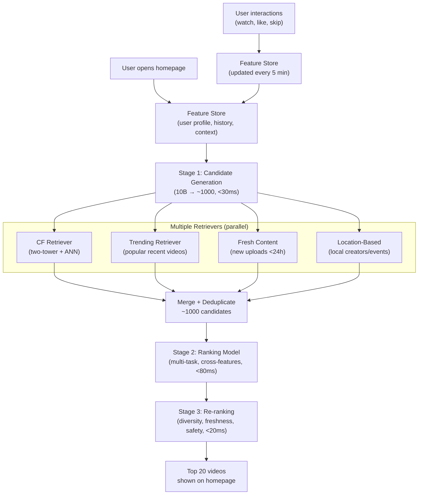

# Video Recommendation ML System Design

## Understanding the Problem

Video recommendation is the backbone of platforms like YouTube, Netflix, and TikTok. YouTube reports that over 70% of watch time comes from recommended videos — not from search. The system's job is to select ~20 personalized videos from a corpus of 10 billion for each of hundreds of millions of users, in under 200 milliseconds. You cannot score every video for every user — that would require 10 billion model evaluations per request. This forces a multi-stage pipeline architecture where each stage narrows the candidate set while increasing model complexity.

What makes this problem fascinating is the multi-objective tension: pure engagement optimization creates filter bubbles and surfaces clickbait, while pure content quality optimization ignores user preferences. The system must balance immediate engagement (did the user click and watch?) with long-term user health (does the user come back tomorrow?), creator ecosystem health (do new creators get discovered?), and platform safety (does the recommendation amplify harmful content?).

## Problem Framing

### Clarify the Problem

**Q:** What is the business objective — are we optimizing for engagement, revenue, or user satisfaction?
**A:** Increase user engagement, measured primarily by watch time, but with guardrails on user retention and content diversity.

**Q:** What type of recommendation? Homepage, related videos, or notifications?
**A:** Homepage personalized videos. This is the hardest variant because there's no immediate context signal — the user isn't watching anything yet.

**Q:** How many videos are in the corpus?
**A:** Approximately 10 billion videos, with continuous uploads (~500 hours of new video per minute).

**Q:** How many daily active users?
**A:** Hundreds of millions. Let's assume 500 million DAU.

**Q:** What is the latency requirement?
**A:** Under 200ms end-to-end for the recommendation response.

**Q:** What interaction signals are available?
**A:** Clicks, watch duration, video completion rate, likes, shares, comments, search queries, explicit "not interested" signals, and impression logs (which videos were shown but not clicked).

**Q:** Do we need to handle cold start?
**A:** Yes. New users with no history and newly uploaded videos with no interactions are both significant.

**Q:** Any privacy constraints?
**A:** Yes. GDPR compliance — users can request deletion of their data, which means user embeddings must be reconstructable without stored history.

### Establish a Business Objective

#### Bad Solution: Maximize click-through rate (CTR)

CTR measures whether users click on recommendations. It's easy to compute and immediately available. The problem: CTR rewards clickbait. A video with a sensational thumbnail and misleading title gets high clicks but users bounce after 10 seconds. Optimizing for CTR produces a recommendation system that surfaces manipulative content, not satisfying content. Users click more in the short term but leave the platform faster.

#### Good Solution: Maximize total watch time per session

Watch time is a stronger engagement signal — users who find relevant content watch more. YouTube uses total watch time as a primary metric. It's better than CTR because a user who clicks and watches 10 minutes provides 10x the signal of a user who clicks and bounces.

The limitation: watch time is biased toward long videos. A 2-hour mediocre documentary generates more raw watch time than a perfect 3-minute tutorial, even though the user found the short video more valuable. Pure watch time optimization also creates "rabbit hole" effects — addictive recommendation loops that maximize session time but degrade long-term user satisfaction and retention.

#### Great Solution: Maximize number of relevant videos (multi-objective with user satisfaction constraints)

Define "relevant" as: the user either explicitly liked/shared the video OR watched at least 50% of it. This normalizes for video length (a 3-minute video watched to completion counts the same as a 90-minute video watched to completion) and captures both explicit and implicit satisfaction.

Combine this with **constrained multi-objective optimization**: maximize relevant video count subject to (1) a diversity floor — recommendations must span at least K topic clusters, (2) a retention guardrail — 7-day user retention must stay above threshold, and (3) a creator health constraint — new videos must receive a minimum number of impressions. This prevents the degenerate feedback loops that pure engagement optimization creates.

### Decide on an ML Objective

This is a **hybrid retrieval-ranking** problem with two distinct ML tasks at different stages:

**Retrieval (candidate generation):** A contrastive learning task. Learn two embedding functions — `f_user(user) → ℝ^d` and `f_video(video) → ℝ^d` — such that the similarity between user and relevant video embeddings is high. Trained with InfoNCE contrastive loss. At serving time, pre-compute video embeddings and use ANN search to find the nearest candidates.

**Ranking:** A multi-task classification task. Given a (user, candidate video) pair, simultaneously predict P(click), P(watch >50%), P(like), P(share), and P(skip). The final ranking score is a weighted combination: `score = w₁·P(watch>50%) + w₂·P(like) + w₃·P(share) - w₄·P(skip)`. Each prediction head shares a base tower that learns general user-video interaction patterns.

## High Level Design



The three-stage pipeline is driven by a fundamental constraint: you cannot run a complex model against 10 billion videos in 200ms.

1. **Candidate Generation (~1000 from 10B):** Multiple lightweight retrievers run in parallel. The main CF retriever computes a user embedding and runs ANN search over pre-computed video embeddings. Additional retrievers surface trending, fresh, and location-relevant content. Speed is the priority — false positives are fine here.

2. **Ranking (score ~1000 candidates):** A deep neural network with multi-task output heads scores each candidate using rich cross-feature interactions between user and video. This is the most expensive model in the pipeline — runs only on the small candidate set.

3. **Re-ranking (top ~100 → top 20):** Business logic — diversity enforcement (max 3 from same creator), already-watched filtering, safety filters, freshness boosting, explore/exploit balance.

## Data and Features

### Training Data

**Positive labels:** User explicitly liked/shared the video OR watched ≥50% of it. Combining explicit (likes) and implicit (watch time) signals gives both accuracy and coverage — likes are high quality but sparse (few users bother to like), while watch completion is abundant but noisier.

**Negative labels:**
- In-batch negatives for contrastive retrieval training
- Random videos the user has not interacted with (easy negatives)
- Videos shown but explicitly skipped or disliked (hard negatives — these are the most informative for ranking)

**Class imbalance:** ~5-10% of impressions result in a positive interaction. Handle with negative sampling (4-9 negatives per positive) and hard negative mining.

**Label delay:** The label "watched >50%" is only available after the user finishes watching, which could be hours later. For continual learning, this means a ~2-hour wait window before a training example is complete. Training pipelines must handle this delay.

**Temporal split:** Train on weeks 1-8, validate on week 9, test on week 10. Never random split — recommendation data has strong temporal patterns (trending topics, seasonality).

### Features

**Video Features**
- `video_id`: Embedding lookup (dim=128, learned end-to-end) — the most important video feature for CF
- `title`: BERT [CLS] embedding (768-dim → projected to 128-dim)
- `tags`: CBOW (average of word embeddings, projected to 128-dim)
- `duration`: Bucketized on log scale [<1min, 1-5min, 5-15min, 15-60min, 60+min] → embedding
- `language`: Embedding (dim=16)
- `upload_recency`: log(hours_since_upload), continuous
- `engagement_stats`: log(view_count), log(like_count), like/view ratio (real-time from feature store, updated hourly)

**User Features**
- Demographics: age bucket (embedding dim=8), gender (embedding dim=4)
- `watch_history_embedding`: Last 50 watched video IDs → look up learned video embeddings → weighted average with exponential recency decay e^(-λt) → 128-dim. This is the single most predictive feature — it encodes the user's "taste profile" in the same space as video embeddings.
- `liked_video_embedding`: Last 20 liked videos → weighted average → 128-dim
- `search_history_embedding`: Last 10 search queries → BERT each → average → 128-dim
- Context: time_of_day (embedding dim=8), device_type (dim=4), day_of_week (dim=8)

**Cross-Features (ranking stage only)**
- User-video language match (binary)
- Video topic overlap with watch history (cosine similarity of topic distributions)
- User's historical engagement with this channel/creator
- These cross-features require knowing both the user and the specific candidate, so they can only be computed at ranking time (not pre-computed)

**Feature freshness:** Static user demographics computed daily. Watch history embeddings updated every 5 minutes via streaming pipeline. Video engagement stats updated hourly. Two-tier feature store: Redis (online, low-latency) and BigTable (offline, batch).

## Modeling

### Benchmark Models

**Popularity Baseline:** Recommend the most popular videos globally. No personalization. Surprisingly strong for cold-start users — popular content tends to have broad appeal. But completely fails for returning users who want personalized content.

**Matrix Factorization (WALS):** Decompose the user-video interaction matrix R (users × videos) into U (users × d) and V (videos × d) such that R ≈ U·Vᵀ. WALS (Weighted Alternating Least Squares) treats unobserved pairs as soft negatives with low weight. Fast training, fast inference (static embeddings). Fails on cold start — no embeddings for new users or videos.

### Model Selection

#### Bad Solution: Matrix Factorization (WALS)

Decompose the user-video interaction matrix into user and video embeddings. Fast training, fast inference. But it ignores all side information — video content, user demographics, context. A new user with no interactions gets a zero embedding. A new video gets a zero embedding. At YouTube scale, 50%+ of daily traffic involves either a new user or a recently uploaded video. Matrix factorization worked in the Netflix Prize era (2006) but can't handle the feature richness and cold start challenges of modern video platforms.

#### Good Solution: Two-Tower Neural Network for retrieval + pointwise ranking model

Two-tower model uses rich features (demographics, content embeddings, context) in both user and video towers, producing embeddings compatible with ANN search. A separate ranking model scores the top-K candidates with cross-features. This handles cold start (content features provide a baseline embedding for new videos) and scales to billions of items.

The limitation: the ranking model predicts a single objective (e.g., P(click)). Single-objective ranking creates perverse incentives — clickbait has high P(click) but low user satisfaction. You can't capture the nuance of "this user will click but then regret it" with one prediction head.

#### Great Solution: Two-Tower retrieval + Multi-Task Deep Ranking

The retrieval stage uses a two-tower model (as above). The ranking stage uses a multi-task model that simultaneously predicts P(click), P(watch>50%), P(like), P(share), and P(skip). The final score combines all heads: `score = w₁·P(watch>50%) + w₂·P(like) + w₃·P(share) - w₄·P(skip)`. Predicting P(skip) explicitly penalizes clickbait (high P(click) but high P(skip) → misleading content → lower final score).

| Approach | Pros | Cons | When to use |
|----------|------|------|-------------|
| **Matrix Factorization** | Fast training, fast serving (static embeddings) | No side features, no cold start handling | Baseline for CF |
| **Two-Tower NN (retrieval)** | Uses rich features, handles cold start, ANN-compatible | Separate encoding — no user-video cross-attention | Candidate generation (must pre-compute video embeddings) |
| **Deep Ranking Model** | Full cross-feature interactions, multi-task outputs | Expensive — cannot run on 10B items | Ranking stage (top-1000 candidates only) |
| **Multi-task Ranking** | Jointly predicts click, watch, like, skip | Multi-task weight tuning required | Production ranking with multiple engagement signals |

### Model Architecture

**Candidate Generation: Two-Tower with Contrastive Learning**

```
User Tower:                          Video Tower:
[user features]                      [video features]
    ↓                                     ↓
Dense: concat→512, ReLU              Dense: concat→512, ReLU
Dense: 512→256, ReLU                 Dense: 512→256, ReLU
Dense: 256→128, ReLU                 Dense: 256→128, ReLU
Dense: 128→64, L2-normalize          Dense: 128→64, L2-normalize
    ↓                                     ↓
64-dim user embedding                64-dim video embedding
```

**Training loss — InfoNCE:**
```
L = -log[ exp(u·v⁺/τ) / Σⱼ exp(u·vⱼ/τ) ]
```
where u = user embedding, v⁺ = positive video embedding, vⱼ = all videos in batch (1 positive + B-1 in-batch negatives), τ = 0.07 (temperature).

Larger batch sizes give more in-batch negatives and better training. Hard negative mining is critical — random in-batch negatives are mostly trivially easy. Add hard negatives: topically similar videos that the user skipped.

**Ranking: Multi-Task Deep Model**

```
Input: [user_embedding || video_embedding || cross_features]
    ↓
Dense: (128+N_cross)→512, ReLU, BatchNorm, Dropout(0.3)
Dense: 512→256, ReLU
Dense: 256→128, ReLU (shared representation)
    ↓
┌──────────┬──────────┬──────────┬──────────┐
P(click)   P(watch>50%) P(like)   P(skip)
(head 1)   (head 2)    (head 3)  (head 4)
```

Final ranking score: `score = w₁·P(watch>50%) + w₂·P(like) + w₃·P(share) - w₄·P(skip)`

The multi-task formulation is critical: predicting P(skip) explicitly lets the system penalize clickbait (high P(click) but also high P(skip) means misleading content).

## Inference and Evaluation

### Inference

**Latency budget decomposition (200ms total):**

| Stage | What happens | Latency |
|-------|-------------|---------|
| Network round trip | Client → edge → datacenter | 20ms |
| Feature store lookup | User features from Redis | 15ms |
| User tower forward pass | Compute user embedding | 3ms |
| ANN search | FAISS IVF-PQ over 10B vectors | 12ms |
| Multiple retriever fan-out + merge | Trending, fresh, location | 5ms |
| Batch feature fetch for candidates | 1000 candidate video features from Redis | 15ms |
| Ranking model inference | 1000 items, GPU batched | 55ms |
| Re-ranking + business logic | Diversity, safety, freshness | 10ms |
| Response serialization | | 15ms |
| **Buffer** | | **50ms** |
| **Total** | | **200ms** |

**ANN index:** IVF-PQ with 65,536 clusters, PQ with 64 subspaces × 8 bits. Memory: 10B × ~16 bytes = ~160GB (fits on 1-2 high-memory servers). Recall@100: ~90%. Latency: ~12ms.

**Feature store:** Two-tier architecture — Redis for online features (watch history, trending scores, updated every 5 minutes), BigTable for offline features (demographics, computed daily). Unified feature API abstracts over both stores.

**Model update frequency:** Daily batch retraining with weekly full retraining from scratch. The batch retrain fine-tunes on the last 7 days of data with a replay buffer (10% from older data) to prevent catastrophic forgetting.

### Evaluation

**Offline Metrics:**

| Metric | Stage | What it measures |
|--------|-------|-----------------|
| **Recall@K** (K=500) | Retrieval | Fraction of relevant videos that appear in the top-K candidates. Primary retrieval metric. |
| **nDCG@10** | End-to-end | Normalized discounted cumulative gain. Measures both relevance and ranking quality. |
| **Diversity@10** | End-to-end | Fraction of distinct topic clusters in the top-10. Monitors filter bubble risk. |

**Online Metrics (A/B testing):**
- **Primary:** Total watch time per session
- **Secondary:** CTR, video completion rate, explicit positive feedback rate (likes/shares per session)
- **Guardrail:** 7-day user retention, daily active users. Must not sacrifice long-term retention for short-term engagement.
- **Counter-metric:** Skip rate, explicit dislikes, "not interested" signals

**A/B test design:**
- Randomize at user level (not request level) to avoid crossover effects
- With σ=15 min/day watch time and δ=0.5 min (1% lift), sample size needed: ~14,000 users per variant. Easily achievable.
- Run for at least 2 weeks to separate novelty effects from sustained quality improvement
- Monitor for network effects: recommendation changes affect content creator behavior which affects all users

## Deep Dives

### ⚠️ Filter Bubbles and the Feedback Loop

The most dangerous failure mode in recommendation systems is the feedback loop: the model recommends content based on past engagement → user engages with that content (because it's what they see) → engagement data reinforces the model's belief → recommendations narrow further. Over time, a user who watched one political video gets increasingly extreme political content, not because they want it, but because the loop amplifies initial signals.

This is a specific instance of Goodhart's Law: when engagement becomes the target, it ceases to measure genuine user satisfaction.

**Detection:** Track topic distribution entropy per user over time. Decreasing entropy means narrowing recommendations. Survey a sample of users weekly on satisfaction with recommendation diversity. Monitor 30-day retention by cohort — users stuck in filter bubbles tend to churn faster.

**Mitigation:** (1) Diversity constraints in re-ranking: force at least 30% of recommendations from outside the user's dominant topic cluster. (2) Multiple retrieval sources — the "trending," "fresh," and "location" retrievers inject non-personalized content. (3) Exploration budget: 5% of recommendations are random, providing unbiased engagement data and breaking the loop. (4) Long-term retention as a guardrail metric — if retention drops while session watch time increases, the system is creating addictive loops.

### 💡 Position Bias in Training Data

Videos shown at position 1 in the recommendation list receive 5-10x more clicks than videos at position 5, regardless of content quality. If we naively use "clicked" as the positive label, our training data is confounded by position — the model learns to replicate previous model rankings rather than predict genuine user preferences.

**IPS correction:** Weight each training example by `1/P(examined | position)`, where P is estimated from exploration traffic. This reweights under-examined positions to correct for exposure bias. Risk: high-variance estimates for rarely-examined positions.

**Position as a feature:** Include position as a training feature, then set position=0 (or the mean) at serving time. The model learns the position effect and can factor it out. This is simpler than IPS and empirically effective.

**Controlled experiments:** Periodically swap items between positions 1 and 5 and measure if CTR follows the item or the position. If CTR follows position, bias is significant and correction is needed.

### 🏭 Cold Start: New Users and New Videos

**New users:** No watch history means the watch history embedding — the most predictive feature — is zero. The two-tower model degrades to using only demographic features (age, gender, country, device) and contextual features (time of day). This provides generic but reasonable recommendations. Fallback: show popular/trending content. The key metric is how quickly we can build a useful history embedding — even 5-10 interactions dramatically improve recommendation quality.

**New videos:** No engagement statistics (views, likes) and no position in the embedding space. The content-based features (title, tags, duration, creator) provide a cold-start embedding through the video tower. But the CF retriever won't surface new videos because they have no interaction-based embedding. Mitigation: a dedicated "fresh content" retriever guarantees minimum impressions (e.g., 1,000 within 24 hours) for new uploads. This both ensures creator fairness and generates the interaction data needed to improve the video's embedding.

**The bootstrapping problem:** New videos need impressions to generate engagement data, but the model won't recommend them without engagement data. Breaking this chicken-and-egg: the fresh content retriever acts as an exploration mechanism specifically for new content.

### 📊 Exposure Bias and Counterfactual Evaluation

The model trains on clicks from its own recommendations, creating a fundamental observability problem: we only have engagement data for videos the model chose to show. Videos never shown have no data. The model can't learn that an unseen video would have been great — it only reinforces what it already believes.

**Consequences:** Systematically undervalues niche content and new creators (they were rarely shown, so they have few positive interactions, so they continue to be rarely shown). Over time, the recommendation landscape homogenizes around a small set of popular, well-known content.

**Counterfactual debiasing:** Use inverse propensity scoring — weight each training example by 1/P(model showed this video), where P is the logging policy's probability of showing the item. Rarely-shown items get upweighted. Risk: high variance for very rare items.

**Exploration data:** The 5% random exploration traffic provides unbiased engagement data. Use this exclusively for model evaluation (not just training). When evaluating a new model offline, compute metrics only on the exploration data — this removes the selection bias of the logging policy.

**Doubly robust estimation:** Combine IPS with a direct model-based estimator to reduce variance while maintaining unbiased estimation. This is the state-of-the-art approach for offline evaluation of recommender systems.

### 💡 Multi-Objective Optimization and Goodhart's Law

Every single-metric optimization in recommendation creates perverse incentives:

| Optimize for... | Perverse outcome |
|----------------|-----------------|
| Watch time | Addictive rabbit holes, long but low-quality videos |
| Click-through rate | Clickbait thumbnails and misleading titles |
| Video completion rate | Bias toward very short videos |
| Like rate | Content that is easy to like but not deeply engaging |

The solution is multi-objective optimization with explicit constraints. The ranking score `w₁·P(watch>50%) + w₂·P(like) + w₃·P(share) - w₄·P(skip)` balances multiple signals. But even this can be gamed — the weights themselves become the optimization target.

Staff-level thinking: treat recommendation as constrained optimization. Maximize a primary engagement metric subject to hard constraints on diversity, retention, and creator ecosystem health. When any guardrail metric degrades, the system should automatically reduce exploration of the primary objective.

### 🏭 Training-Serving Skew

Training-serving skew is one of the most insidious production bugs. The model performs well offline but degrades in production. Root causes:

1. **Feature computation divergence:** Training uses Python pandas with float64; serving uses C++ with float32. Small numerical differences compound across millions of features.
2. **Feature freshness mismatch:** Training uses daily features; serving uses hourly features. If the model learned on stale features, fresh features confuse it.
3. **Log-train skew:** Serving logs compressed features; training recomputes from raw data. Subtle differences.

**Solution:** A unified feature store where the same computation graph runs in both training and serving. Features are logged at serving time and fed directly into training — so training exactly replicates what serving computed. Monitor feature distribution drift daily with KL divergence between training and serving distributions. If D_KL > threshold for any feature, alert on-call.

### 🔄 Explore/Exploit Tradeoff

The recommendation system faces a classic explore/exploit dilemma: should it recommend videos the model is confident the user will like (exploit) or try new categories and creators to discover potentially better recommendations (explore)?

Pure exploitation maximizes short-term engagement but starves niche content, accelerates filter bubbles, and makes the system unable to adapt when user preferences change. Pure exploration degrades immediate user experience with irrelevant recommendations.

**Epsilon-greedy** is the simplest approach: show the model's top recommendations 95% of the time (exploit) and random content 5% of the time (explore). Simple to implement but wasteful — random exploration shows clearly irrelevant content most of the time.

**Thompson sampling** is smarter: for each candidate video, sample from the posterior distribution of engagement probability rather than using the point estimate. Videos with high uncertainty get explored more often — the system naturally gravitates toward candidates where more information would be valuable. This concentrates exploration on the most informative items.

**Contextual bandits** (LinUCB, Neural UCB) formalize the tradeoff: estimate both the expected reward and the uncertainty for each candidate, then select the item with the highest upper confidence bound. This balances exploitation (high expected reward) with exploration (high uncertainty).

In practice, dedicate 5-10% of the recommendation slots to exploration, sourced from the "fresh content" and "trending" retrievers rather than the main CF retriever. Monitor the explore-to-exploit ratio over time — if exploration traffic decreases organically (because the model becomes more certain), that's a sign the system is converging on a narrow set of content and exploration should be increased.

### 📊 Implicit vs Explicit Feedback Signal Strength

Not all user signals carry the same information content. The recommendation system has access to multiple feedback types, each with different signal-to-noise ratios:

| Signal | Strength | Volume | Noise Source |
|--------|----------|--------|-------------|
| Watch completion (>80%) | Strong | High | Long videos get artificially penalized; background viewing |
| Like/save | Very strong | Low (~2% of views) | "Like" has different meanings across cultures |
| Share | Strongest | Very low (~0.5% of views) | Sharing ≠ endorsement (sharing to criticize) |
| Click | Moderate | Very high | Position bias, thumbnail bait, accidental taps |
| Skip (< 3 seconds) | Strong negative | High | Sometimes user glances and saves for later |
| "Not interested" | Very strong negative | Very low (~0.1% of views) | Nuclear option — user is frustrated |

The multi-task ranking model should weight these signals proportionally to their quality, not their volume. A model trained predominantly on clicks (the most abundant signal) becomes a clickbait recommender. The watch completion rate, normalized by video length, provides the best balance of signal quality and volume.

**Missing-not-at-random (MNAR) challenge:** Users who don't interact with a recommended video may have: (1) not seen it (scrolled past), (2) seen it and found it irrelevant, or (3) seen it and saved it mentally for later. Treating all non-interactions as negatives introduces label noise. Viewport tracking (did the video thumbnail appear on screen for >1 second?) helps distinguish case 1 from cases 2-3.

### 🏭 Real-Time vs Batch Inference Architecture

Recommendation systems face an architectural choice about how fresh the predictions should be.

#### Bad Solution: Pure batch — pre-compute recommendations for all users every hour

Pre-compute the top-100 videos for each of 500M users and store them in a key-value store. At request time, just do a lookup — no model inference needed. Latency is <5ms. But the recommendations are stale: a user who watched 3 videos since the last batch update gets recommendations that don't reflect their current session. Trending content from the last hour doesn't appear. Pre-computing for 500M users every hour is also expensive — 500M model inferences per hour = 139K per second of batch processing.

#### Good Solution: Pure real-time — run the full pipeline on every request

Run candidate generation (ANN search) and ranking (cross-feature scoring) on every homepage visit. Recommendations always reflect the freshest user state. But the latency budget is tight (200ms), and the computational cost is high — 500M DAU × ~5 homepage visits/day = 2.5B real-time inferences per day.

#### Great Solution: Hybrid — batch candidate generation + real-time ranking

Pre-compute candidate sets (top-1000 from the CF retriever) for all active users every 6 hours. At request time, refresh only the ranking scores using the latest user features (current session, time of day) and blend in results from real-time retrievers (trending, fresh content, location). This gives 90% of the benefit of real-time inference at 20% of the cost.

The ranking model is lightweight enough to score 1000 candidates in <55ms on GPU. The ANN search (the most expensive step) is only run when the candidate set needs updating — either on the batch schedule or when the user's behavior signals a significant shift in preference (e.g., watching 3+ videos in a new category triggers a real-time ANN refresh).

### ⚠️ A/B Testing Pitfalls in Recommendation Systems

A/B testing recommendation systems is harder than testing most ML systems because of three unique challenges:

**Network effects:** One user's recommendations affect another's behavior. If variant A surfaces a video that goes viral, variant B users see it too (through organic sharing, search, etc.). The treatment effect "leaks" between variants, making the estimated treatment effect smaller than the true effect. Mitigation: cluster-based randomization (randomize by geographic cluster or social graph cluster), or use longer holdout periods.

**Novelty effects:** Users initially engage more with any new recommendation algorithm simply because the content is different. After 1-2 weeks, engagement often regresses to baseline. An A/B test that runs for only 3 days will overestimate the improvement. Always run for at least 2 weeks. Plot the treatment effect over time — a declining effect curve signals novelty, not genuine improvement.

**Long-term vs short-term metric divergence:** A model that creates addictive rabbit holes increases watch time immediately but degrades 30-day retention. Standard A/B tests optimized for 1-week watch time will approve changes that hurt the platform long-term. Mitigation: hold out a long-term evaluation cohort (5% of users never get the new model) for 3-6 months, measuring retention and satisfaction.

**Interference through content supply:** Recommendation changes affect creator behavior. If the algorithm starts favoring short videos, creators produce more short videos, changing the content supply for all users. This second-order effect takes months to manifest and can't be captured in a standard 2-week A/B test.

## What is Expected at Each Level?

### Mid-Level Engineer

A mid-level candidate should recognize that scoring 10B videos per request is infeasible and propose a multi-stage pipeline (candidate generation → ranking). They should articulate the difference between collaborative filtering and content-based filtering, propose a two-tower model for candidate generation, and identify watch time or completion rate as a reasonable engagement metric. They differentiate by explaining why the two-tower architecture enables ANN search (separate encoding allows pre-computing video embeddings) and handling cold start with content features.

### Senior Engineer

A senior candidate will design the complete three-stage pipeline, explain the multi-task ranking formulation (jointly predicting click, watch, like, skip), and proactively discuss position bias and its correction via IPS. They bring up the filter bubble problem, propose diversity constraints in re-ranking, and design the feature store architecture (online vs. offline stores, feature freshness). For evaluation, they distinguish retrieval metrics (Recall@K) from ranking metrics (nDCG@10), propose total watch time as the online metric with user retention as a guardrail, and explain why offline-online gaps exist (exposure bias, distribution shift).

### Staff Engineer

A Staff candidate will quickly establish the multi-stage retrieval-ranking architecture and then go deep on the systemic challenges. They'll identify the feedback loop as the biggest risk — the model's recommendations shape user behavior which shapes training data, creating self-reinforcing biases toward popular content and away from niche content. They propose constrained multi-objective optimization (maximize engagement subject to diversity, retention, and creator health constraints) rather than single-metric optimization. They recognize that training-serving skew requires a unified feature computation graph, not separate training and serving code. They think about the platform opportunity — the user tower and video tower as shared platform services used by search, ads, and recommendations — and the organizational question of who owns the embedding infrastructure versus who owns the product-specific ranking models.

## References

- Covington et al., "Deep Neural Networks for YouTube Recommendations" (2016)
- Yi et al., "Sampling-Bias-Corrected Neural Modeling for Large Corpus Item Recommendations" (Google, 2019)
- Oord et al., "Representation Learning with Contrastive Predictive Coding" (CPC/InfoNCE, 2018)
- Johnson et al., "Billion-scale similarity search with GPUs" (FAISS, 2019)
- Schnabel et al., "Recommendations as Treatments: Debiasing Learning and Evaluation" (IPS for recommenders, 2016)
