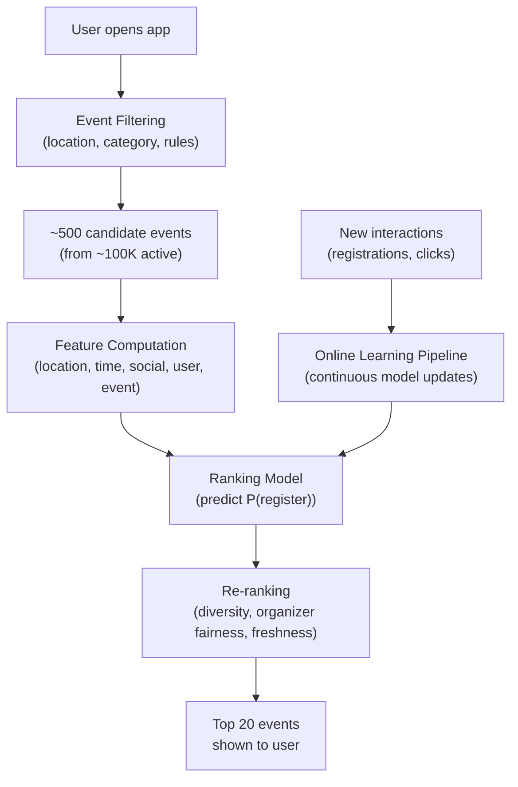

# Event Recommendation ML System Design

## Understanding the Problem

Event recommendation is a fundamentally different problem from video or product recommendation. Events are ephemeral — a concert happens once, on a specific date, at a specific place, and then it's gone. This creates a constant cold-start problem: new events appear daily with zero interaction history, and old events expire before the model can accumulate enough data to learn about them. Location matters enormously — a concert in Tokyo is useless to someone in Chicago, regardless of how well it matches their interests. And social dynamics drive attendance in ways that don't exist for media consumption — you're much more likely to attend an event if three friends are already registered.

These constraints make event recommendation an excellent interview problem because it forces candidates to think beyond standard collaborative filtering. Feature engineering — especially location, time, and social features — is where most of the predictive power comes from, not model architecture.

## Problem Framing

### Clarify the Problem

**Q:** What is the business objective — registrations, revenue, or user satisfaction?
**A:** Maximize ticket sales, which means maximizing paid event registrations. For free events, maximize registration count (drives platform engagement and organizer retention).

**Q:** What types of events are on the platform?
**A:** One-time ephemeral events: concerts, conferences, workshops, sports games, meetups. Once the event date passes, it's no longer available for registration.

**Q:** How many events and users?
**A:** Approximately 1 million events per month (~100K active/upcoming at any time), with about 1 million daily active users.

**Q:** What data is available?
**A:** No hand-labeled data. We have interaction logs: impressions (user saw the event), clicks, registrations, invitations, and bookmark signals. We also have a social graph — users can be friends and invite each other to events.

**Q:** Is the user's location available?
**A:** Yes — users agree to share their location. We can also use Google Maps APIs for distance and travel time computation.

**Q:** What are the latency requirements?
**A:** Real-time ranked feed when the user opens the app. Sub-200ms end-to-end.

**Q:** How do we handle the event expiration problem?
**A:** Events that have already occurred must be excluded from recommendations. Events happening very soon may or may not be recommended depending on whether the user has time to get there.

**Q:** Is this a two-sided marketplace?
**A:** Yes. Event organizers (hosts) create events and need exposure. Users attend events. The recommendation system must serve both sides — pure user optimization can starve new organizers of visibility, reducing supply diversity.

### Establish a Business Objective

#### Bad Solution: Maximize click-through rate on event listings

CTR measures whether users click on recommended events. The problem: clicks are cheap. Users browse dozens of events and click many but register for very few. Optimizing for CTR produces recommendations of visually appealing events with engaging descriptions that never convert to actual attendance. The business makes money from registrations, not browsing.

#### Good Solution: Maximize event registration conversion rate

Conversion rate (registrations / impressions) directly measures whether recommendations lead to the desired action. This is better than CTR because it captures genuine intent to attend, not just curiosity.

The limitation: conversion rate treats all registrations equally. A free meetup for 10 people and a $500 concert for 50,000 people count the same. And pure conversion optimization creates a feedback loop — the system learns to recommend events that are easy to convert (free, low-commitment, in familiar categories) while ignoring higher-value events that have a lower conversion rate but drive more revenue and platform growth.

#### Great Solution: Maximize weighted registrations (conversion × event value) with organizer fairness constraints

Weight each registration by event value: for free events, weight = 1 (engagement value); for paid events, weight = price (GMV contribution). This aligns the recommendation objective with the business's actual revenue model.

Add an **organizer fairness constraint**: new organizers must receive a minimum number of impressions for their events. Without this, the system creates a rich-get-richer dynamic — established organizers with proven events dominate recommendations, new organizers never get traction, and they leave the platform. This reduces supply diversity, which eventually hurts users too.

Monitor **long-term user retention** as a guardrail — if conversion goes up but monthly active users go down, the system is over-optimizing for easy conversions and boring the user base.

### Decide on an ML Objective

This is a **pointwise Learning to Rank (LTR)** problem using **binary classification**. For each (user, event) pair, predict the probability that the user will register for the event. Then rank all candidate events by predicted probability and return the top-K.

**Training data unit:** A (user, event) pair observed at impression time.
**Label:** 1 if the user registered for the event, 0 if the user saw the event but did not register.
**Loss function:** Focal loss to handle severe class imbalance (~1-2% conversion rate):

```
FL(p_t) = -α × (1 - p_t)^γ × log(p_t)
```

α = 0.25, γ = 2.0. When γ = 0, this reduces to standard cross-entropy.

**Why pointwise over pairwise/listwise:** Pointwise maps cleanly to binary classification infrastructure, scales to millions of (user, event) pairs, and directly produces calibrated probabilities (needed for the two-tier serve/demote decision). Pairwise (LambdaMART) gives better ranking quality but requires constructing preference pairs and is harder to calibrate. Start pointwise, upgrade to listwise if top-of-list quality is insufficient.

## High Level Design



The serving pipeline has two key differences from video/product recommendation:

1. **No candidate generation via ANN search.** With only ~100K active events (not 10B videos), we can afford to filter by location/category and score the remaining ~500 candidates directly. No multi-stage retrieval pipeline needed.

2. **Continuous model updates are critical.** Events are ephemeral — new events appear daily, old ones expire, and social signals (friends registering) change hourly. The model must be fine-tuned continuously with fresh data, not retrained weekly.

## Data and Features

### Training Data

**Positive labels (label = 1):** User was shown the event (impression logged) and subsequently registered. Weight by event value for paid events.

**Negative labels (label = 0):** User was shown the event (impression logged) but did not register. Only use impression negatives — catalog-wide negatives (all events the user didn't see) would bias the model against popular events that simply had more impressions.

**Position bias correction:** Events shown at the top of the feed receive more registrations regardless of quality. Apply inverse propensity scoring (IPS): weight each training example by 1/P(examined | position), estimated from randomized exploration traffic.

**Class imbalance:** ~1-2% of impressions result in registration. Handle with focal loss (not oversampling — focal loss is more stable for production ranking models).

**Temporal split:** Train on the last 90 days, validate on the most recent 7 days, test on the next 7 days. Use a sliding window — event preferences shift seasonally and with cultural trends.

### Features

This is where most of the predictive power comes from. Feature engineering is the star of event recommendation.

**Location Features (most critical)**
- `distance_bucket`: Raw distance bucketized into [<0.5mi, 0.5-1mi, 1-5mi, 5-10mi, 10-25mi, 25-50mi, 50+mi]. Bucketization captures the nonlinear relationship — users are dramatically less likely to attend events beyond 10 miles.
- `same_city`: Binary. Strongly predictive — most users attend events in their city.
- `same_country`: Binary. Captures whether cross-border travel is needed.
- `estimated_travel_time`: From Google Maps API, bucketized. More informative than raw distance (10 miles in NYC with transit ≠ 10 miles in rural Montana).
- `walk_score_similarity`: Difference between event venue's walkability and user's historical average. Captures accessibility preferences.
- `historical_location_affinity`: Cosine similarity between event geo-cluster and centroid of user's past event locations. "Does this user attend events in this neighborhood?"

**Time Features**
- `time_until_event`: Bucketized [<1hr, 1-24hr, 1-7d, 7-30d, 30+d]. Critical for urgency modeling — an event tomorrow demands immediate action.
- `day_of_week_preference`: Vector of size 7 — user's historical attendance rate per day of week. Some users never attend Monday events.
- `hour_of_day_preference`: Similar vector for start time preference.
- `day_hour_similarity`: How well the event's timing matches the user's historical profile.
- `remaining_time_similarity`: Difference between this event's lead time and the user's average registration lead time. Some users plan weeks ahead; others decide last-minute.

**Social Features (highest signal per feature)**
- `friends_registered_count`: Number of the user's friends who have registered. This is often the single most predictive feature — social proof drives event attendance.
- `friend_invitation_count`: Number of explicit invitations from friends. Stronger signal than organic friend registration.
- `host_is_friend`: Binary. Users are much more likely to attend events hosted by friends.
- `past_events_by_host`: How many of this host's previous events the user attended. Captures organizer loyalty.
- `registration_ratio_smoothed`: registrations / (impressions + β), with Laplace smoothing (α=1, β=10). Prevents new events with 1/1 impressions from getting 100% ratio.

**User Features**
- `age_bucket`: [18-24, 25-34, 35-44, 45-54, 55+]. Bucketized — the relationship between age and event preference is nonlinear.
- `gender`: One-hot encoded [male, female, unspecified].
- `activity_level`: Number of events registered in past 30/90 days. Proxy for engagement propensity.

**Event Features**
- `price_bucket`: [Free, $1-24, $25-99, $100-499, $500+]. Nonlinear — free events convert very differently from paid ones.
- `price_similarity`: Difference from user's average past event price. Users have price preferences.
- `category_embedding`: Category/subcategory one-hot or learned embedding (dim=16).
- `description_similarity`: Embed event description with SBERT, compute cosine similarity to mean embedding of user's past registered events. Captures semantic interest alignment beyond category labels. For cold-start users (<5 events), fall back to category-level features.

## Modeling

### Benchmark Models

**Popularity Baseline:** Recommend the most popular events in the user's city. No personalization. This is surprisingly strong for cold-start users and provides a lower bound for personalized models.

**Logistic Regression:** Linear model on engineered features. Fast, interpretable (feature weights show importance), but cannot learn nonlinear interactions between features (e.g., the interaction between distance and price — users tolerate longer distance for expensive concerts but not for free meetups).

### Model Selection

#### Bad Solution: Matrix Factorization or standard collaborative filtering

Decompose the user-event interaction matrix into latent factors. This works for video/product recommendation where items persist for months and accumulate rich interaction histories. For events, it fails completely: each event exists for days to weeks before expiring, accumulates minimal interaction data, and has no historical interaction pattern to factorize. New events — the majority of the catalog — get zero embeddings. Cold start isn't an edge case here; it's the norm.

#### Good Solution: XGBoost/GBDT on engineered features

Gradient boosted trees handle the rich tabular features (distance, price, social signals, timing) naturally — no normalization needed, built-in handling of nonlinear relationships (distance decay, price sensitivity), and strong performance with limited data. XGBoost can be trained on the current event catalog in hours and provides interpretable feature importance rankings.

The limitation: tree-based models can't do continual learning. When new events appear or social signals change, you must retrain from scratch. In a domain where new events appear daily and friend registrations shift relevance hourly, retraining every 24 hours means the model is always stale on the most dynamic signals.

#### Great Solution: Neural Network with continual learning and feature crosses

A neural network supports fine-tuning on new interaction data without full retraining — critical for ephemeral events. Dense layers learn nonlinear feature interactions (distance × price, time × social signals) that tree models capture through splits but can't generalize as broadly. Daily micro-batch fine-tuning on the last 7 days of data with a replay buffer (10% from older data to prevent catastrophic forgetting) keeps the model current.

| Approach | Pros | Cons | When to use |
|----------|------|------|-------------|
| **Logistic Regression** | Fast, interpretable, good baseline | Cannot learn feature interactions | Baseline |
| **XGBoost/GBDT** | Handles nonlinear relationships, no normalization needed, works well with tabular data | Cannot do continual learning (must retrain from scratch), many hyperparameters | Strong baseline for structured features |
| **Neural Network (chosen)** | Supports continual learning (fine-tune on new data), learns feature interactions, works with embeddings | Needs normalization, requires more training data, less interpretable | Production — continual learning is critical for ephemeral events |

### Model Architecture

**Start with XGBoost** as a fast, competitive baseline. Then upgrade to a neural network for production.

**Production Neural Network:**

```
Input: concatenated feature vector (~80-120 dimensions)
→ Dense: input→256, ReLU, BatchNorm, Dropout(0.3)
→ Dense: 256→128, ReLU, BatchNorm, Dropout(0.2)
→ Dense: 128→64, ReLU
→ Dense: 64→1, Sigmoid
→ Output: P(register | user, event)
```

**Loss function:** Focal loss with α=0.25, γ=2.0 (handles 1-2% positive rate).

**Continual learning:** The neural network supports fine-tuning on new interaction data without retraining from scratch. This is critical for event recommendation because:
- New events appear daily with no history (cold start)
- Social signals change hourly (friends registering shifts relevance)
- User preferences evolve (post-pandemic preferences differ from pre-pandemic)

Fine-tune daily on the last 7 days of data with a replay buffer (10% from older data to prevent catastrophic forgetting). The NN adapts to current trends while retaining learned patterns.

**Why not a two-tower model?** With only ~100K active events, we don't need ANN search. The entire candidate set is small enough to score directly. A two-tower model would sacrifice cross-feature interactions (location-price interaction, time-social interaction) for retrieval efficiency we don't need.

## Inference and Evaluation

### Inference

**Serving pipeline (per request, <200ms):**

| Stage | What happens | Latency |
|-------|-------------|---------|
| Event filtering | Location filter (same city or within 50mi), category filter (user preferences), remove expired events | 10ms |
| Feature computation | Batch compute all features for ~500 (user, event) pairs. Static features from feature store, dynamic features (friend count, registration count) computed in real-time | 30ms |
| Model inference | Forward pass on ~500 candidates (batched on GPU) | 20ms |
| Re-ranking | Diversity enforcement, organizer fairness boost, freshness | 10ms |
| **Total** | | **~70ms** |

**Feature freshness:**
- Static features (user demographics, event description, price): computed at event creation and user profile update
- Dynamic features (friend registration count, total registration count, remaining time): computed in real-time at request time
- Social features updated whenever a new registration or invitation occurs — stored in Redis for sub-5ms retrieval

**Online learning pipeline:** New interactions (registrations, clicks) flow into a Kafka queue. A training pipeline continuously fine-tunes the model on fresh data (hourly micro-batches). New model versions are evaluated against a holdout set before deployment.

### Evaluation

#### Bad Solution: Optimize for NDCG on held-out registration data

NDCG measures ranking quality — are events that the user registered for ranked higher than ones they didn't? This is a standard recommendation metric but misses the two-sided nature of events. NDCG treats a registration for a free meetup the same as one for a $200 conference. It also ignores the temporal constraint — recommending a great event after it's sold out is a ranking success but a user failure.

#### Good Solution: Registration conversion rate + NDCG, stratified by event type

Report both ranking quality (NDCG) and business value (conversion rate). Stratify by event type (free vs paid, popular vs niche, new organizer vs established) to catch segment-level regressions. A model that improves overall NDCG by 3% but drops conversion for new organizers by 15% should not ship.

#### Great Solution: Multi-sided metrics with user satisfaction and organizer health

Track three stakeholder dimensions: (1) User: conversion rate, registration diversity (variety of event types attended), 7-day retention; (2) Organizer: fill rate (registrations / capacity), new attendee rate (% of registrations from first-time attendees), organizer churn rate; (3) Platform: GMV, new organizer acquisition rate, overall supply diversity. Use an online dashboard that surfaces conflicts between stakeholder metrics — if user conversion rises while organizer fill rate drops, the system is concentrating demand on a few popular events.

**Offline Metrics:**

| Metric | What it measures | Why it fits event recommendation |
|--------|-----------------|-------------------------------|
| **mAP (Mean Average Precision)** | Average precision across all ranking positions for queries with multiple relevant items | Primary metric. Multiple events can be relevant per user, and mAP captures ranking quality. |
| **nDCG@10** | Normalized discounted cumulative gain in top-10 | Measures top-of-list quality — the events users actually see. |
| **Precision@5** | Fraction of top-5 that are relevant | Quick diagnostic — are the top recommendations any good? |

**Why mAP over MRR:** MRR focuses on the rank of the first relevant item. Event recommendation has multiple relevant events per user, so mAP (which averages precision across all relevant items) is more appropriate.

**Online Metrics:**
- **Primary:** Conversion rate (registrations / impressions) and revenue lift
- **Secondary:** CTR, bookmark rate (interest signal even without registration)
- **Guardrail:** 7-day user retention, organizer event creation rate (supply health)
- **Counter-metric:** Time to first registration for new events (measures cold-start resolution)

**A/B testing considerations:**
- Randomize at user level
- Events are shared across users — changing recommendations for one user can affect event popularity signals seen by others. This creates interference. Mitigate with cluster-based randomization (randomize by city/region).
- Run for at least 2 weeks to capture weekend vs. weekday patterns

## Deep Dives

### 💡 The Constant Cold-Start Problem

Unlike video recommendation where cold-start affects a small fraction of content, event recommendation faces cold-start constantly. New events appear daily and have zero interaction history at creation time. By the time enough interaction data accumulates, the event may be hours from starting.

**Content-based features carry the load:** The description embedding, category, price, location, and host history features are all available at event creation time. The model must produce reasonable recommendations from these features alone, without any registration or impression data.

**Social bootstrapping:** When the first few friends register for an event, the social features (friends_registered_count) activate and dramatically boost relevance for their social network. This creates a viral loop that is especially important for new events — a single early registration from a well-connected user can trigger a cascade of recommendations to their friends.

**Organizer reputation transfer:** The `past_events_by_host` feature transfers trust from previous successful events. A host whose previous events had high attendance signals quality for their new event, even with zero interaction data. This is the event-domain equivalent of creator reputation in video recommendation.

### ⚠️ Location as a First-Class Feature

Most recommendation systems treat location as one of many features. In event recommendation, location is the dominant factor — an event's relevance drops to near-zero beyond a certain distance, regardless of how well it matches the user's interests. This creates a natural geographic filtering that doesn't exist in content recommendation.

**Distance is nonlinear:** The relationship between distance and attendance probability follows a steep decay curve — attendance drops 80% between 5 and 25 miles. Bucketization captures this nonlinearity without requiring the model to learn it from data.

**Travel time > distance:** 10 miles in Manhattan (30 min by subway) is very different from 10 miles in suburban sprawl (20 min by car). Using Google Maps estimated travel time instead of raw distance captures real-world accessibility.

**Location preferences are personal:** Some users attend events across a wide radius; others stick to their neighborhood. The `historical_location_affinity` feature captures this personal range — it's computed as the cosine similarity between the event's location and the centroid of the user's past event locations. A user whose past events cluster in downtown Manhattan will see low affinity for events in the suburbs.

### 🏭 Social Features and Viral Dynamics

Social signals are often the highest-impact features in event recommendation. "Three of your friends are going" is more persuasive than any algorithmic prediction of content relevance.

**Feature hierarchy:** Friend invitation > friend registration > overall popularity. Explicit invitations are the strongest signal (someone deliberately chose to invite you), followed by organic friend registrations (social proof), followed by raw popularity (weaker signal, often dominated by marketing spend).

**Network effects in A/B testing:** Social features create interference between experiment and control groups. If a user in the treatment group registers for an event because of better recommendations, their friends in the control group now see higher `friends_registered_count` for that event. This "leaks" treatment effect into the control group, making the experiment underestimate the true effect. Mitigate by randomizing at the social cluster level (groups of highly connected users go into the same experimental bucket).

### ⚠️ Two-Sided Marketplace Fairness

Event recommendation is a marketplace: users are demand, organizers are supply. Pure user optimization creates a feedback loop where popular organizers dominate recommendations, new organizers get zero visibility, and eventually leave the platform. This reduces supply diversity, which eventually hurts users too.

**Minimum impression guarantee:** Every new event must receive at least N impressions (e.g., 1,000) within its first 48 hours. The re-ranking stage enforces this by boosting under-exposed events. This provides organizers with a minimum viable feedback loop — they can see whether their event resonates — and generates the interaction data the model needs to calibrate future recommendations.

**Organizer diversity constraint:** In the top 20 recommendations, cap the number of events from any single organizer at 3. This prevents monopolization of the recommendation feed by high-volume organizers.

**Revenue vs. fairness tension:** Fairness constraints reduce short-term conversion (showing events the model predicts are less likely to convert). But they maintain supply-side health, which drives long-term platform value. Track both conversion rate and organizer retention as coupled metrics.

### 📊 Temporal Dynamics and Urgency Modeling

Time creates urgency in event recommendation that doesn't exist in content recommendation. An event happening tomorrow demands different treatment than an event a month away.

**Remaining time changes feature importance:** For events happening in <24 hours, social signals dominate (are friends going? is the event selling out?). For events weeks away, content features matter more (does the description match my interests? is the price right?). The model should learn these temporal interactions through feature crosses between `time_until_event` and other features.

**Recommendation decay:** After a user has seen an event recommended 5+ times and hasn't registered, stop showing it. The user has implicitly rejected it. Track impression count per (user, event) pair and apply a decay factor — each additional impression reduces the event's score.

**Last-minute recommendations:** Some users are spontaneous — they decide to attend events within hours. The model should learn from `remaining_time_similarity` whether this user is a planner or a spontaneous attendee. For spontaneous users, surface events happening today/tonight with available capacity.

### 🔄 Explore/Exploit for Sparse Events

Event recommendation has an unusually sharp explore/exploit tension because events are one-time — you can't show a user the same event again tomorrow if they weren't interested today. Every recommendation slot is a non-renewable resource.

**Exploitation risk:** If the model only recommends events in the user's known preference categories (concerts for a music lover), it never discovers that this user also loves cooking workshops. Once the user stops seeing new event types, their perceived value of the platform drops (they think it only has concerts), even though the supply is diverse.

**Exploration cost:** Showing irrelevant events to explore preferences is more costly here than in content recommendation. A bad video recommendation costs 30 seconds of a user's time. A bad event recommendation wastes a slot in a finite feed of 20 items, where missing an event they would have loved is an irreversible loss (the event happens and they miss it forever).

**Thompson sampling with category-level bandits** is the most practical approach: maintain a Beta distribution per (user, event_category) pair tracking registration success rate. Sample from the posterior when scoring candidates — categories with high uncertainty get explored more. As the user registers for events in a category, the posterior tightens and the exploration rate decreases naturally. Combine the bandit score with the main model's prediction using a tunable blend weight.

### 💡 Multi-Objective: Organizer Revenue vs Attendee Satisfaction

The two-sided marketplace creates a multi-objective tension that doesn't exist in single-sided recommendation (like video):

**Organizer objectives:** Fill events to capacity, maximize revenue, get new attendees (not just the same regulars). Organizers who don't fill events stop creating them, reducing supply.

**Attendee objectives:** Find events they'll enjoy, discover new experiences, attend events with friends. Attendees who get bad recommendations churn.

**Platform objectives:** Maximize GMV (gross merchandise value from ticket sales), grow supply diversity (more unique organizers), grow demand (DAU, retention).

These objectives conflict: the most conversion-likely event for a user might be a free meetup from their favorite organizer (high attendee satisfaction, zero GMV). The most revenue-maximizing recommendation might be an expensive concert the user probably won't attend (high GMV per conversion but low conversion probability).

**Scalarization with constraints:** Maximize expected GMV (P(register) × event_price) subject to: (1) at least 40% of recommendations are from organizers the user hasn't attended before (discovery), (2) at least 20% of recommendations include friends-registered events (social), (3) minimum impression guarantee for new organizers. The constraint weights are set by the product team, not the ML team — these are business decisions, not optimization parameters.

### 🏭 Real-Time vs Batch Inference for Events

Event recommendation has unique latency requirements because relevance changes rapidly:

**Social signals change hourly:** When three friends register for an event in the afternoon, the user should see it recommended that evening — not 24 hours later. Batch inference with daily updates misses these time-sensitive social signals.

**Event urgency changes by the minute:** An event happening tomorrow with 3 seats left has a fundamentally different urgency profile than the same event with 300 seats left. Capacity and timing features must be real-time.

**Hybrid approach:** Pre-compute candidate sets daily (events in the user's geographic region matching their category preferences). At request time, re-score with fresh social features (friends registered since last computation), real-time capacity data, and current time features. The re-scoring is lightweight — just a forward pass through the ranking model with updated feature values — and adds <20ms to the pipeline.

**Event-driven updates:** When a user's friend registers for an event, push a notification to the recommendation service to invalidate the cached candidate score for that (user, event) pair. The next time the user opens the app, the event appears with updated social features.

### 📊 Popularity Bias and Long-Tail Events

Events follow a power-law distribution: a small number of popular events (major concerts, festivals, conferences) dominate impressions and registrations, while thousands of long-tail events (local meetups, niche workshops, community gatherings) struggle for visibility.

The recommendation model amplifies this: popular events have more interaction data → better model predictions → more recommendations → more interactions → even more data. Long-tail events have sparse data → uncertain predictions → fewer recommendations → less data → they expire with minimal exposure.

**The supply diversity argument:** Long-tail events are critical for platform health. They serve niche interests that popular events don't cover. Users who discover and attend a local wine-tasting meetup develop a deeper relationship with the platform than users who only attend well-known concerts (which they'd find with or without the platform). Long-tail events also represent new and small organizers — the future supply pipeline.

**Mitigation:** (1) The minimum impression guarantee (discussed in marketplace fairness) provides a floor. (2) Calibration-based boosting: for events with <100 impressions, multiply the predicted score by a calibration factor that accounts for prediction uncertainty (wider confidence interval → higher exploration bonus). (3) Category-level diversity: ensure the top 20 recommendations span at least 4 different event categories, even if one category dominates the user's history.

### ⚠️ A/B Testing Challenges: Events Are One-Time

Standard A/B testing assumes you can measure the same outcome repeatedly under controlled conditions. Events break this assumption: each event happens once, and you can't re-run it to see what would have happened under a different recommendation policy.

**One-shot problem:** If the treatment group was shown Event A and the control group wasn't, and Event A was amazing, you can't prove counterfactually that the control group would have benefited. You only observe the treatment effect on the events that both groups were shown.

**Temporal confounds:** Events cluster around weekends and holidays. If the treatment is deployed on a Thursday and the control ran on the previous Thursday, differences in event supply (not model quality) may drive the metric difference. Always run treatment and control simultaneously, never sequentially.

**Small sample sizes:** With ~100K active events and ~1M DAU, the number of registrations per event is small (median event has <50 registrations). This makes per-event analysis statistically underpowered. Aggregate metrics (total registrations, GMV, conversion rate) across all events provide sufficient power, but you lose the ability to detect effects on specific event types.

**Network interference:** Social features create leakage between treatment and control (discussed in Social Features section). The estimated treatment effect is biased downward because control users benefit from treatment users' registrations through social signals. Cluster-based randomization by social graph components is the cleanest solution, but it reduces effective sample size.

## What is Expected at Each Level?

### Mid-Level Engineer

A mid-level candidate should frame this as a binary classification problem (predict registration probability), identify the key feature categories (location, time, social, user, event), and recognize class imbalance as a challenge. They should propose XGBoost or a neural network as the model and choose mAP or nDCG as the offline metric. They differentiate by explaining why events are harder than standard recommendation (ephemeral content, constant cold start, location dominance) and proposing at least one specific feature encoding strategy (distance bucketization, category one-hot).

### Senior Engineer

A senior candidate will design the complete feature engineering pipeline with specific encoding decisions for each feature type (bucketization for distance and price, smoothed ratios for popularity, SBERT embeddings for description similarity). They proactively discuss position bias in training data and propose IPS correction. They explain why continual learning (neural network over GBDT) is critical for ephemeral events, design the online learning pipeline, and distinguish between static and dynamic features in the serving architecture. For evaluation, they choose mAP with justification over MRR and propose conversion rate as the online metric with retention as a guardrail.

### Staff Engineer

A Staff candidate quickly establishes the LTR pointwise framing and rich feature schema, then goes deep on the systemic challenges: the two-sided marketplace problem (organizer fairness vs. user optimization), the constant cold-start problem (how content features carry the load before interaction data accumulates), and the social dynamics that create viral loops and A/B testing interference. They recognize that training-serving skew is a major risk for time-sensitive features (computing `time_until_event` relative to the wrong timestamp creates data leakage) and propose a unified feature store with point-in-time correctness. They think about the platform as a marketplace, not just a recommendation engine — supply diversity, organizer retention, and long-term user health matter as much as conversion rate.

## References

- Covington et al., "Deep Neural Networks for YouTube Recommendations" (2016) — multi-stage pipeline
- Lin et al., "Focal Loss for Dense Object Detection" (2017) — focal loss for class imbalance
- Agarwal et al., "A General Framework for Counterfactual Learning-to-Rank" (2019) — position debiasing
- Wang et al., "Position Bias Estimation for Unbiased Learning to Rank in Personal Search" (2018)
- Reimers & Gurevych, "Sentence-BERT" (2019) — SBERT for text embeddings
