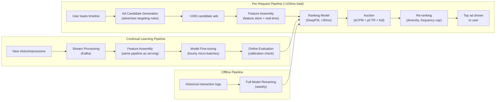

# Ad Click Prediction ML System Design

## Understanding the Problem

Ad click prediction is one of the most consequential ML systems in production. Google made over $200 billion in 2023 from ads. Meta makes 97% of its revenue from ads. The prediction — P(click | user, ad, context) — feeds directly into a real-time auction that determines which ads are shown, how much advertisers pay, and how much revenue the platform earns. If the model gets 0.1% better at predicting clicks, that can translate to hundreds of millions of dollars in additional revenue.

What makes this problem technically demanding is the combination of extreme scale (100+ billion impressions per day), extreme sparsity (millions of categorical features, most of which are zero for any given example), and extreme freshness requirements (even a 5-minute delay in model updates degrades performance). The model must also be well-calibrated — not just accurate in ranking, but accurate in its probability estimates — because those probabilities directly determine auction prices. An over-confident model causes advertisers to overpay, which erodes trust and reduces long-term ad spend.

## Problem Framing

### Clarify the Problem

**Q:** What is the business objective — maximize revenue, CTR, or advertiser ROI?
**A:** Maximize platform revenue, which means maximizing `eCPM = P(click) × bid × quality_score` across all ad impressions. Revenue is the primary objective, but advertiser satisfaction (ROI) is a constraint — advertisers who don't get value stop spending.

**Q:** What ad types and placements are we covering?
**A:** Image ads on the user's social media timeline. Single placement type.

**Q:** How many ad impressions per day?
**A:** Approximately 100 billion impressions per day across hundreds of millions of users.

**Q:** What is the latency requirement?
**A:** The ad prediction must happen within the ad auction, which has a total budget of ~100ms. The ML prediction component should take <30ms.

**Q:** What interaction signals are available?
**A:** Click logs, conversion data (delayed — users convert hours/days after clicking), explicit negative feedback ("hide this ad"), and viewability data (was the ad actually visible on screen?).

**Q:** How critical is continual learning?
**A:** Critical. Ad inventory and user behavior change rapidly. Even a 5-minute delay in model updates degrades performance measurably. The model should be updated at minimum daily, ideally more frequently.

**Q:** Are there privacy constraints?
**A:** Yes. Apple's App Tracking Transparency (ATT) has eliminated cross-app tracking signal for iOS users. GDPR restricts user-level behavioral targeting in the EU. The model must handle partial feature absence gracefully.

### Establish a Business Objective

#### Bad Solution: Maximize click-through rate (CTR)

CTR measures how often users click on shown ads. Optimizing for CTR seems natural — more clicks mean more engagement. The problem: CTR optimization rewards clickbait ads with misleading copy and sensational images. Users click, realize the landing page is irrelevant, and don't convert. Advertisers get charged for worthless clicks. Over time, advertisers with legitimate products lose auctions to clickbait, reduce ad spend, and the platform's long-term revenue drops.

#### Good Solution: Maximize revenue (eCPM = P(click) × bid)

eCPM directly measures the revenue the platform earns per impression. This aligns the model with the business objective and naturally balances ad quality (high P(click)) with advertiser willingness to pay (high bid). An ad with a 1% click rate and $10 bid ranks the same as one with a 5% click rate and $2 bid — both generate $0.10 expected revenue.

The limitation: eCPM ignores post-click value. An ad for a scam product might get clicks (curiosity) but never converts and generates user complaints. This damages both user trust and advertiser ecosystem health.

#### Great Solution: Maximize revenue with advertiser ROI and user satisfaction constraints

Use `eCPM = P(click) × bid × P(conversion | click)` as the auction ranking score. Including P(conversion | click) ensures that ads which actually deliver value to advertisers rank higher — not just ads that generate curiosity clicks. This is the "full-funnel" optimization.

Add **user satisfaction constraints**: monitor "hide this ad" rate (explicit negative feedback) and user session time after ad exposure. If ad load degrades user engagement, the system is showing too many low-quality ads.

Add **advertiser health metrics**: track advertiser-reported ROI and churn rate. If advertisers consistently underperform their ROI targets, the model's calibration is off, and they'll reduce spend.

### Decide on an ML Objective

This is a **pointwise Learning to Rank** problem with a **calibrated binary classification** formulation.

**Primary task:** Predict `P(click | user, ad, context)` — a calibrated probability, not just a ranking score, because this probability directly determines the auction clearing price.

**Secondary tasks (multi-task):**
- `P(conversion | click, user, ad)` — for full-funnel auction ranking
- `P(hide | user, ad)` — explicit negative signal for user satisfaction

**Loss function:** Binary cross-entropy for each task, with task-specific weights:
```
L = w_click·BCE(ŷ_click, y_click) + w_conv·BCE(ŷ_conv, y_conv) + w_hide·BCE(ŷ_hide, y_hide)
```

**Label construction:**
- **Positive click (y=1):** User clicked the ad within t_window seconds after impression
- **Negative click (y=0):** Ad was visible on screen for >1 second but not clicked. Scroll-past impressions (<1 second visibility) are excluded — the user never saw the ad, so it's not a true negative.
- **Explicit negative:** User hid the ad → strongly negative label (can be upweighted)

## High Level Design



The system has three pipelines:
1. **Prediction pipeline:** Per-request, <100ms. Candidate generation → feature assembly → model prediction → auction → re-ranking.
2. **Continual learning pipeline:** Hourly model fine-tuning on fresh interaction data. Critical for keeping the model current with changing ad inventory and user behavior.
3. **Offline pipeline:** Weekly full retraining from scratch on historical data. Prevents drift and recalibrates the model.

## Data and Features

### Training Data

**Scale:** 100B+ impressions/day means the training data is effectively unlimited. The challenge is not data quantity but data quality — label noise, position bias, and delayed feedback.

**Negative label subtlety:** Not every impression is a true negative. If the ad was on screen for <1 second (user scrolling fast), the user never had a chance to evaluate it. Treating these as negatives adds noise. Use viewability threshold: only count as negative if the ad was visible for >1 second.

**Conversion label delay:** Conversions (purchases after click) can happen hours to days after the ad impression. During this delay, we don't know if the impression led to a conversion. For click prediction (primary task), delay is minimal (<5 seconds). For conversion prediction, either (a) wait for the attribution window to close (7 days) before labeling, or (b) use survival analysis to model time-to-conversion.

### Features

**Ad Features**
- `ad_id`: Embedding (dim=32, cardinality: billions). Captures ad-specific quality beyond category.
- `advertiser_id`, `campaign_id`, `ad_group_id`: Embeddings (dim=16 each). Hierarchy captures advertiser reputation.
- `category`, `subcategory`: Embeddings (dim=32, dim=16). E.g., "travel/hotel".
- `ad_image_embedding`: CLIP/SimCLR visual encoder → 256-dim (pre-computed, stored in feature store). Captures visual appeal.
- `historical_ctr`: Ad's average CTR over last 7 days. Float. Strong signal for established ads; use Laplace-smoothed estimate for new ads.
- `impression_count_log`: log(total impressions). Captures ad fatigue — CTR typically declines with repeated exposure.

**User Features**
- `user_id`: Embedding (dim=32, cardinality: billions).
- Demographics: `age_bucket` (embedding dim=8), `gender` (embedding dim=4), `country` (embedding dim=16).
- Context: `device_type` (one-hot), `time_of_day` (embedding dim=8), `day_of_week` (embedding dim=4).
- `recently_clicked_ad_ids`: Last 10 ad IDs clicked → look up embeddings → average → 32-dim. Captures recent ad interests.
- `user_click_rate`: User's historical click rate across all ads (last 30 days). Captures general propensity to click ads.
- `user_category_affinities`: Engagement rate per ad category (many insurance clicks → likely to click insurance again). Sparse vector, use feature hashing.

**Cross-Features**
- `user_category × ad_category`: Whether the user's preferred categories match the ad's category.
- `user_country × ad_region`: Geographic targeting match.
- The most important feature interactions are between user behavioral history and ad content attributes.

**Feature sparsity:** Ad click prediction has millions of categorical features, most of which are zero for any given example. This drives the model architecture choice — models like DeepFM that handle sparse features via embedding factorization outperform standard DNNs.

## Modeling

### Benchmark Models

**Logistic Regression:** Linear combination of features through sigmoid. Fast, interpretable, good baseline. Cannot learn nonlinear feature interactions (the "young" + "basketball" → sports ad interaction requires manual feature crossing).

**GBDT (XGBoost):** Handles nonlinear relationships, no normalization needed, works well with tabular data. Cannot do continual learning (must retrain from scratch). Cannot learn embedding layers for high-cardinality sparse features.

**GBDT + LR (Facebook's classic 2014 approach):** Train GBDT first, use leaf node indices as new binary features, feed into LR. Better than either alone, but still can't do efficient continual learning.

### Model Selection

#### Bad Solution: Logistic Regression or standard DNN

Logistic regression is fast and interpretable but cannot learn feature interactions — the "young + basketball → Nike ad" interaction requires manual feature crossing across millions of possible pairs. Standard DNNs handle nonlinearity but struggle with the extreme sparsity of ad features. With millions of categorical features (ad_id, user_id, advertiser_id), most (user, ad) pairs never co-occur in training data. The DNN can't learn interactions for unseen feature combinations.

#### Good Solution: GBDT + LR (Facebook 2014 approach)

Train XGBoost first to automatically discover feature interactions via tree splits. Use the leaf node indices as new binary features fed into logistic regression. This captures nonlinear interactions without manual feature engineering.

The limitation: GBDT cannot do continual learning (must retrain from scratch), and the leaf-index features are fixed at the tree structure discovered during initial training. New ads and advertisers don't benefit from the tree's feature interactions until the next full retrain. In a domain where new ads appear every hour, this staleness degrades performance.

#### Great Solution: DeepFM — Factorization Machine + Deep Network

DeepFM combines the FM component (captures all pairwise feature interactions via embedding factorization in O(kn) time) with a DNN component (captures higher-order interactions). The FM component generalizes to unseen feature pairs through learned embeddings — even if features i and j never co-occurred in training, their interaction is approximated by `<vᵢ, vⱼ>`, learned from other interactions involving i and j separately. The DNN component adds higher-order interactions the FM can't model.

DeepFM supports continual learning (fine-tune on new data without full retraining) and handles extreme feature sparsity naturally through the shared embedding layer.

| Approach | Pros | Cons | When to use |
|----------|------|------|-------------|
| **Logistic Regression** | Fast, interpretable | Can't learn feature interactions | Baseline |
| **GBDT + LR** | Automatic feature engineering via tree leaf indices | Can't do continual learning, can't learn embeddings | Offline baseline |
| **Deep & Cross Network (DCN)** | Explicit feature crossing via cross network + DNN | Cross network only captures bounded-degree interactions | When explicit crosses matter |
| **DeepFM (chosen)** | FM captures all pairwise interactions + DNN for higher-order | More parameters than simple models | Production — best balance of interaction modeling and scalability |

### Model Architecture

**DeepFM (Deep Factorization Machine):**

```
Input: sparse feature vector (one-hot encoded categorical + continuous features)
    ↓
Embedding Layer (shared between FM and DNN components)
    ↓
┌────────────────────┬────────────────────┐
│ FM Component       │ DNN Component      │
│ (pairwise          │ (higher-order      │
│  interactions)     │  interactions)     │
│                    │                    │
│ ŷ_FM = Σ<vᵢ,vⱼ>  │ Dense: 512→256→128 │
│        × xᵢ × xⱼ │ → 64→1             │
└────────┬───────────┴──────────┬─────────┘
         │                      │
         └──────────┬───────────┘
                    ↓
              Add outputs
                    ↓
              Sigmoid → P(click)
```

**FM component formula:**
```
ŷ_FM = w₀ + Σᵢ wᵢxᵢ + Σᵢ Σⱼ>ᵢ <vᵢ, vⱼ> × xᵢ × xⱼ
```
- First term: bias
- Second term: linear (like logistic regression)
- Third term: pairwise interactions via dot product of learned embedding vectors vᵢ, vⱼ

The FM component models ALL pairwise feature interactions in O(kn) time (not O(kn²)) via the factorization trick. This is critical for sparse features where most pairs have zero co-occurrence in training data — the embedding factorization enables generalization.

**DNN component:** Standard feedforward network on concatenated embeddings. Captures higher-order (3rd, 4th, ...) feature interactions that FM cannot model.

**Why DeepFM over plain DNN:** DNNs struggle with sparse features because there isn't enough data for each (user, ad) pair to learn interactions directly. FM's factorization enables interaction modeling even for unseen feature pairs.

**Calibration (mandatory):** After training, apply Platt scaling on a held-out calibration set:
```
P_calibrated = sigmoid(a × logit(ŷ) + b)
```
Validate with reliability diagrams: bin predictions by score, plot mean predicted vs. mean actual click rate per bin. A well-calibrated model lies on the diagonal.

## Inference and Evaluation

### Inference

**Per-request pipeline (100ms total budget):**

| Stage | What happens | Latency |
|-------|-------------|---------|
| Candidate generation | Apply advertiser targeting rules (demographics, geography, interests). Narrow millions of ads to ~1000. | 10ms |
| Feature assembly | Look up ad features and user features from feature store (Redis). Compute dynamic features (ad impression count, user's recent clicks). | 15ms |
| Model prediction | DeepFM forward pass on ~1000 candidates (batched on GPU) | 20ms |
| Auction | Rank by eCPM = pCTR × bid. Winner pays second-highest eCPM price. | 5ms |
| Re-ranking | Frequency cap (same ad ≤3 times/day), diversity (max 1 ad per advertiser per session) | 5ms |
| **Total** | | **~55ms** |

**Continual learning:** New click/impression events flow into Kafka. Every hour, a micro-batch training job fine-tunes the model on the latest data. The new model is evaluated against calibration metrics on a holdout set before deployment. If calibration degrades (ECE > threshold), the update is rejected and oncall is alerted.

**Feature store:** Shared between training and serving — the same feature computation code runs in both pipelines. Features are logged at serving time and fed back into training to eliminate training-serving skew. Two tiers: Redis (online, sub-5ms) for real-time features, Hive/BigQuery (offline, batch) for historical aggregates.

### Evaluation

**Offline Metrics:**

| Metric | What it measures | Why it matters for ads |
|--------|-----------------|---------------------|
| **Normalized Cross-Entropy (NCE)** | How much better the model is than always predicting the average CTR: NCE = CE(model) / CE(baseline). NCE < 1 means the model beats the baseline. | Primary offline metric. Raw CE is misleading when CTR varies across segments — NCE normalizes this. |
| **AUC-ROC** | Discrimination — can the model distinguish clickers from non-clickers? | Measures ranking quality. Threshold-independent. |
| **Calibration Error (ECE)** | Average absolute difference between predicted probability and actual click rate, binned by prediction score. | Critical for ad systems — miscalibrated predictions cause advertisers to overpay or underpay. |

**Why NCE is preferred over raw CE for ad systems:** Raw cross-entropy varies with the background CTR. An ad system serving luxury goods (CTR ~0.1%) and one serving gaming ads (CTR ~5%) have very different baseline CE values. NCE normalizes by the background CTR, making it comparable across segments and over time.

**Online Metrics:**
- **Primary:** Revenue per mille impressions (RPM), total ad revenue
- **Secondary:** CTR, conversion rate
- **Guardrail:** User hide rate (explicit negative feedback), user session time post-ad-exposure
- **Advertiser health:** Advertiser spend retention (do advertisers keep spending?), advertiser-reported ROI satisfaction

## Deep Dives

### 💡 Why Calibration Is a First-Class Concern

In recommendation systems, the model just needs to rank items correctly — absolute probabilities don't matter. In ad systems, the absolute probability IS the product. When the model predicts P(click) = 0.03, that number feeds directly into the auction: `eCPM = 0.03 × bid`. If the true click rate is 0.05, the advertiser is underbid and misses impressions they should have won. If the true rate is 0.01, the advertiser overpays and eventually stops spending.

**Measuring calibration:** Expected Calibration Error (ECE). Bin predictions into 10-20 buckets by predicted probability. For each bucket, compute |mean_predicted - mean_actual|. ECE is the weighted average of these gaps.

```
ECE = Σ (nₖ/N) × |mean_predicted_k - mean_actual_k|
```

Target: ECE < 0.005 (predicted probabilities within 0.5% of actual rates on average).

**Calibration drift:** Model calibration degrades over time as the ad ecosystem changes (new advertisers, seasonal effects, user behavior shifts). Monitor ECE daily. When ECE exceeds threshold, trigger recalibration via Platt scaling on recent data.

### ⚠️ Feature Sparsity and the Factorization Machine Advantage

Ad click prediction features are extremely sparse. A user-ad pair might have the feature vector: [user_id=397284, ad_id=58291, category=travel, device=mobile, time=evening, ...]. Most of these are one-hot encoded categorical features — the resulting vector has millions of dimensions, almost all zeros.

**Why standard DNNs struggle:** A DNN needs to see enough examples of each feature combination to learn interactions. With millions of features, most pairs never co-occur in training data. The DNN can't learn that "young + basketball → clicks on Nike ads" if it has never seen that exact combination.

**How FM solves this:** FM learns a low-dimensional embedding vector for each feature. The interaction between features i and j is approximated by the dot product of their embeddings: `<vᵢ, vⱼ>`. Even if features i and j never co-occurred in training, their embeddings can be learned from other interactions involving i and j separately. This is the key insight — factorization enables generalization to unseen feature combinations.

### 🏭 Continual Learning Architecture

Ad systems degrade rapidly without fresh model updates. New ads appear constantly, user interests shift, seasonal events create abrupt behavioral changes. A model trained on last week's data may be poorly calibrated for this week's traffic.

**Micro-batch training (hourly):** New interaction data flows through Kafka into a feature assembly pipeline (same code as serving). Every hour, fine-tune the model on the latest micro-batch. This captures intra-day trends (morning vs. evening ad preferences, weekday vs. weekend patterns).

**Full retraining (weekly):** Retrain the model from scratch on a large historical window (e.g., 90 days). This prevents slow drift in base embeddings and recalibrates the model. The freshly trained model is evaluated against the continually-updated model on a holdout set. If the retrained model is better, it replaces the continual model; otherwise, the continual model continues.

**Safe deployment:** Never deploy a model update without validation. Check: (1) NCE improved on holdout, (2) ECE (calibration error) is below threshold, (3) Revenue-per-mille (RPM) on shadow traffic matches or exceeds production model. Only then promote to serving.

### ⚠️ Position Bias in Training Data

Ads shown in higher positions (top of timeline) get more clicks regardless of quality. The model trained on this data learns to assign higher scores to ads that were shown in prominent positions — a self-reinforcing loop.

**Position as a feature:** Include position as a training feature. At serving time, set position to a neutral value (e.g., mean position) for all candidates. The model learns the position effect and can factor it out. This is simpler than IPS and empirically effective.

**IPS correction:** Weight each training example by `1/P(click | position)`, estimated from randomized position experiments. Rarely-seen positions get upweighted. Risk: high-variance estimates for extreme positions.

**Auction interaction:** Position bias interacts with the auction — the auction determines which ad gets position 1, which determines click probability, which feeds into the next training iteration. Breaking this loop requires randomized exploration (show random ads at random positions for a small fraction of traffic) to collect unbiased training data.

### 📊 Privacy Constraints and Signal Loss

Apple's ATT has eliminated cross-app tracking for ~50% of mobile users (iOS). GDPR restricts behavioral targeting in the EU. These aren't future concerns — they're the current reality.

**Impact on features:** Cross-app behavioral signals (user visited competitor's website, user made purchases on other apps) are no longer available for opted-out users. For these users, the model must rely on within-platform signals only — demographics, on-platform engagement, contextual features.

**Graceful feature degradation:** The model should be trained to handle missing features. During training, randomly mask certain features (dropout at the feature level, not just the neuron level). This forces the model to learn from available features without relying on any single signal. At serving time, absent features are masked the same way.

**Contextual advertising resurgence:** With less user-level behavioral data, contextual signals become more valuable — what content is the user currently viewing? What's trending in their region? These signals don't require tracking individual users and are privacy-compliant by construction.

### 💡 Auction Mechanics and ML Interaction

The ML model doesn't operate in isolation — it's embedded in an auction system. Understanding the auction is critical for Staff-level design.

**Second-price auction:** The winning ad pays the minimum bid needed to win (the second-highest eCPM divided by the winner's pCTR). This means the model's calibration directly affects prices — a model that overestimates P(click) for one advertiser causes them to win more auctions but pay fair prices (based on second-place bids). The advertiser gets more exposure but at the correct price. However, systematic overestimation across all advertisers inflates the number of impressions served to underperforming ads, reducing overall revenue quality.

**Explore/exploit:** The auction naturally creates an exploitation bias — ads with high eCPM get shown repeatedly, accumulating more click data, while low-eCPM ads are rarely shown and never get a chance to prove their quality. Mitigation: reserve 1-5% of impressions for exploration (show random ads at random positions to collect unbiased data). This is costly in the short term (revenue loss on exploration traffic) but essential for long-term model quality and new advertiser onboarding.

### ⚠️ Click Fraud Detection

Invalid traffic (IVT) — bots, click farms, competitor sabotage — costs advertisers an estimated $80+ billion annually. If the ad click prediction model trains on fraudulent clicks, it learns to predict bot behavior instead of genuine user interest. If advertisers discover they're paying for fraudulent clicks, they lose trust and reduce spend.

**Rule-based detection (first layer):** Flag clicks from known bot IPs, data centers, abnormally fast click patterns (>10 clicks/second from one device), and clicks with zero dwell time on landing pages. This catches ~70% of crude bot traffic. Rules are simple to implement but trivially evaded by sophisticated actors.

**ML-based detection (second layer):** Train a separate fraud classifier on features like click timing distribution (bots have unnaturally regular intervals), session behavior patterns (real users browse before clicking), device fingerprint consistency, and geographic anomalies (clicks from a country the ad doesn't target). The challenge is label noise — confirmed fraud is rare and biased toward the types of fraud you've already detected. Adversarial actors evolve tactics faster than the model can adapt.

**Impact on click prediction:** Filter identified fraudulent clicks before they enter the training pipeline. If 5% of clicks are fraudulent and you train on them, the model overestimates P(click) by up to 5% for categories targeted by fraud (e.g., insurance, legal services). This miscalibration directly distorts auction prices. Report IVT rate by ad category and alert advertisers when their campaigns show anomalous fraud patterns.

### 📊 Attribution Modeling

A user sees an ad on Monday, searches the product on Wednesday, and buys on Friday. Which touchpoint gets credit for the conversion? Attribution determines how conversion value is assigned to ad impressions, which in turn affects how the P(conversion | click) model is trained and how advertisers evaluate ROI.

**Last-click attribution** (simplest, most common): The last ad clicked before conversion gets all credit. This systematically undervalues upper-funnel impressions (display ads that create awareness) and overvalues lower-funnel ads (retargeting ads shown to users already about to buy). Advertisers reduce upper-funnel spending because it appears unprofitable, which actually reduces total conversions.

**Multi-touch attribution:** Distribute credit across all touchpoints using position-based (40% first touch, 40% last touch, 20% middle), time-decay (recent touches get more credit), or data-driven (Shapley value) models. Data-driven attribution uses the Shapley value framework — for each touchpoint, estimate the marginal contribution to conversion by computing the difference in conversion probability with and without that touchpoint, averaged over all possible orderings.

**View-through conversions:** Some users see an ad, don't click, but later convert organically. Should the ad get credit? If yes, how much? View-through attribution expands the training data for P(conversion) but introduces noise — the user may have converted regardless. Typically, view-through conversions are down-weighted (0.1-0.3× of click-through conversions).

### 🏭 Real-Time Bidding and Latency at Scale

The ad prediction pipeline runs inside the auction, which has a total budget of ~100ms. At 100B+ daily impressions, that's >1M auctions per second at peak. Every millisecond of model inference latency costs money — either in compute costs (more GPUs to maintain throughput) or in revenue (slower response means fewer auctions completed per second).

#### Bad Solution: Run the full DeepFM model on all candidate ads

Score every candidate ad (~1000 per request) with the full DeepFM model. At 1000 × DeepFM forward pass = ~20ms on GPU, this is feasible for a single request but doesn't scale to 1M QPS without thousands of GPU inference servers.

#### Good Solution: Cascade architecture — cheap filter + expensive scorer

First, score all 1000 candidates with a lightweight model (logistic regression or a small 2-layer NN, <5ms). Keep the top 100. Then run the full DeepFM on 100 candidates (<10ms). This reduces GPU compute by 10x while losing <1% of top-10 quality.

#### Great Solution: Cascade + feature hashing + model distillation

Distill the full DeepFM into a smaller student model (3-layer MLP, 1/10th the parameters) trained on the teacher's soft labels. The student handles 80% of auctions (easy cases where the top candidate is obvious). The full DeepFM runs only on close auctions (top candidates within 10% of each other). Feature hashing reduces embedding table sizes from billions to millions of parameters, cutting memory and lookup latency. Combined, this achieves <15ms p99 inference at 1M+ QPS.

### 📊 Budget Pacing and Delivery

Advertisers set daily or campaign budgets ("spend $10,000/day on this campaign"). The ad system must pace delivery to spread spend evenly across the day, not exhaust the budget by noon and show nothing in the afternoon.

**Budget pacing interacts with prediction quality:** If the model overestimates P(click), the ad wins more auctions than it should, spending the budget faster. If it underestimates, the budget is underspent and the advertiser misses impressions. Calibration failures directly cause pacing failures.

**Throttling vs bid modification:** The simplest approach is throttling — randomly drop a fraction of auction participations to control spend rate. More sophisticated: modify the effective bid downward when the campaign is ahead of pace and upward when behind. The modification factor is: `pace_multiplier = (budget_remaining / time_remaining) / (budget_total / time_total)`. Values >1 mean the campaign is behind pace (spend more aggressively); values <1 mean it's ahead (pull back).

**Smooth delivery matters for advertiser trust:** An advertiser who sees all their budget spent by 2 PM and zero impressions afterwards suspects the system is broken, even if total daily spend equals the budget. Smooth, predictable delivery throughout the day builds confidence that the system is working. Plot spend curves (cumulative spend vs. time of day) and alert when any campaign deviates >20% from the ideal linear pace.

## What is Expected at Each Level?

### Mid-Level Engineer

A mid-level candidate should frame this as binary classification predicting P(click), identify the key feature types (user demographics, ad attributes, historical CTR), and propose logistic regression or a neural network. They should recognize class imbalance (low CTR) and choose AUC or log loss as the evaluation metric. They differentiate by explaining why the prediction must be a probability (not just a score) because it feeds into the auction, and by proposing a two-stage pipeline (candidate generation → ranking) to handle the scale of millions of ads.

### Senior Engineer

A senior candidate will articulate the DeepFM architecture and explain why factorization machines handle sparse features better than standard DNNs. They discuss calibration as a requirement (not just nice-to-have), propose Platt scaling or isotonic regression, and choose NCE over raw CE as the primary offline metric. They design the continual learning pipeline (hourly fine-tuning + weekly full retraining), handle the negative label construction subtlety (viewability threshold, not just "impression without click"), and proactively discuss position bias in training data with IPS correction or position-as-feature.

### Staff Engineer

A Staff candidate quickly establishes the DeepFM ranking model within the auction framework and then goes deep on the systemic challenges: why calibration is a first-class concern (miscalibration directly distorts auction prices and advertiser trust), how the auction creates exploration-exploitation tension (shown ads accumulate data, unshown ads don't), and how privacy constraints (ATT, GDPR) require graceful feature degradation. They think about the multi-task formulation (click + conversion + hide) for full-funnel optimization, recognize that the feedback loop between model predictions and auction outcomes creates self-reinforcing biases, and propose exploration strategies with quantified revenue tradeoffs. They see the ad system as a three-sided marketplace (users, advertisers, platform) and design metrics that monitor the health of all three.

## References

- Guo et al., "DeepFM: A Factorization-Machine based Neural Network for CTR Prediction" (2017)
- Wang et al., "Deep & Cross Network for Ad Click Predictions" (Google, 2017)
- He et al., "Practical Lessons from Predicting Clicks on Ads at Facebook" (GBDT+LR, 2014)
- Rendle, "Factorization Machines" (2010)
- McMahan et al., "Ad Click Prediction: a View from the Trenches" (Google, 2013)
- Chapelle et al., "Modeling Delayed Feedback in Display Advertising" (2014)
