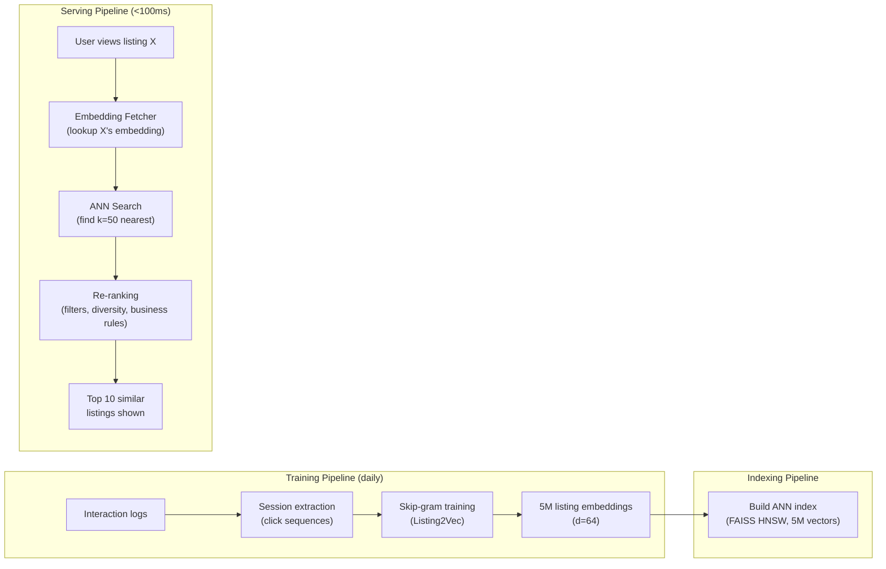

# Similar Listing Recommendation ML System Design

## Understanding the Problem

When a user is viewing a vacation rental on Airbnb and the page shows "you might also like these listings," how does the system decide which listings are "similar"? This is not a simple attribute-matching problem — two listings can have different prices, different amenities, and different locations but still be "similar" in a meaningful way if users consistently consider them as alternatives.

Airbnb discovered that the most useful definition of similarity is behavioral: two listings are similar if users frequently view both in the same search session. If thousands of users looking at a particular beachfront condo in Miami also look at a specific oceanview apartment nearby, those listings are functionally equivalent in users' mental models — they compete for the same booking. This behavioral similarity captures perceived quality, aesthetic taste, and price expectations in ways that attribute matching never could.

The technical approach is inspired by Word2Vec: treat listings as words and browsing sessions as sentences. Listings that co-occur in sessions get similar embeddings. At serving time, find nearest neighbors in the embedding space.

## Problem Framing

### Clarify the Problem

**Q:** What is the business objective — increase engagement or increase bookings?
**A:** Increase bookings. Recommendations that keep users browsing longer but never booking are a cost, not a benefit. Session book rate (fraction of sessions ending in a booking) is the north star metric.

**Q:** What defines "similarity"?
**A:** Behavioral similarity — two listings are similar if users frequently view both in the same search session. This captures implicit user judgment about what's comparable, without requiring explicit similarity labels.

**Q:** How many listings are on the platform?
**A:** Approximately 5 million active listings.

**Q:** What data is available for training?
**A:** User-listing interaction logs: impressions, clicks, and bookings with timestamps. We can reconstruct browsing sessions from click sequences. We do NOT use listing attributes (price, location, amenities) during embedding training — the model learns these relationships implicitly from behavioral data.

**Q:** How do we handle new listings with no interaction history?
**A:** Cold start: new listings have no embedding. Use the embedding of a geographically nearby listing as a proxy. Once the listing accumulates ~1 day of interaction data, the daily retraining pipeline learns its real embedding.

**Q:** What is the latency requirement?
**A:** Under 100ms for the similar listings response.

**Q:** Are results personalized per user?
**A:** For simplicity, the similar listings are based on the currently viewed listing, not the user's profile. Same query listing → same recommendations for all users.

### Establish a Business Objective

#### Bad Solution: Maximize CTR on similar listing recommendations

CTR measures how often users click on recommended similar listings. Clicks mean engagement. The problem: clicks don't equal bookings. A recommendation set optimized for CTR might surface interesting but aspirational listings (a $2,000/night villa when the user's budget is $200/night) that generate curiosity clicks but never convert. The user browses more but books less.

#### Good Solution: Maximize session book rate

Session book rate — the fraction of search sessions that end in a booking — directly measures whether recommendations help users find what they want and commit. This is better because a session that ends in a booking means the recommendations successfully guided the user through the consideration set.

The limitation: session book rate doesn't distinguish between bookings directly driven by the similar listings feature versus bookings that would have happened anyway. Attribution is noisy.

#### Great Solution: Maximize session book rate with session length and listing diversity constraints

Session book rate as the primary metric, with two supporting constraints:

1. **Session efficiency:** Optimize for shorter sessions that end in bookings, not longer ones. If a user browses 50 listings before booking, the recommendations weren't doing their job — they should guide the user to the right listing faster. Track average session length for booking sessions.

2. **Listing diversity in recommendations:** Ensure the similar listings span different sub-categories (different buildings, different hosts, different exact styles) rather than showing 10 identical-looking apartments. Diversity helps users discover options they hadn't considered while maintaining relevance.

This captures both the conversion goal (booking rate) and the experience quality (efficiency and diversity).

### Decide on an ML Objective

This is a **representation learning / metric learning** problem. The goal is to learn an embedding function `f(listing) → ℝ^d` such that listings users consider interchangeable map to nearby vectors.

**Training approach: Session-Based Skip-Gram (Listing2Vec)**

Treat browsing sessions as sentences and listings as words. Apply Word2Vec-style skip-gram training:
- Slide a context window across each session
- For each center listing, positive pairs are the context listings within the window
- Negative pairs are randomly sampled listings outside the window

**Training loss:**
```
L = -Σ log σ(v_center · v_positive) - Σ log σ(-v_center · v_negative)
```

where σ is the sigmoid function. Minimizing this loss pushes co-occurring listings together and random listings apart.

**Two critical improvements over vanilla skip-gram:**

1. **Global context (booking signal):** The booked listing in each session is treated as a permanent positive for all other listings in that session. This ensures the embedding captures booking intent, not just browsing patterns.

2. **Hard negatives from same region:** Random negatives are mostly trivially easy (a listing in Barcelona vs. one in Tokyo). Hard negatives sampled from the same city/neighborhood force the model to learn fine-grained distinctions.

## High Level Design



The system is simpler than video recommendation because:
1. **No heavy ranking model:** The embedding similarity IS the relevance score. No need for a separate cross-encoder or multi-task ranker.
2. **No candidate generation vs. ranking split:** With 5M listings (not 10B videos), ANN search directly produces high-quality candidates.
3. **No user-side model:** Recommendations are based on the listing being viewed, not the user's profile. No user tower needed.

## Data and Features

### Training Data

**Search sessions:** A session is a sequence of clicked listings, optionally ending in a booking. Example: `[L1, L2, L3, L4, L5_booked]` — user clicked through L1-L4, then booked L5.

Sessions are extracted from interaction logs by grouping clicks per user with a 30-minute inactivity threshold (clicks more than 30 minutes apart start a new session).

**Positive pairs:** For a session `[L1, L2, L3, L4]` with window size 2, when center = L2: positive pairs are (L2, L1), (L2, L3), (L2, L4). When center = L3: positive pairs are (L3, L2), (L3, L4).

**Global context (booking signal):** If the session ends in a booking of L5: for every center listing L_i in the session, add (L_i, L5) as a positive pair. L5 stays as a positive for the entire session, even outside the normal window.

**Random negatives:** For each center listing, sample N random listings from the full corpus. Typically N = 5-10 negatives per positive pair.

**Hard negatives:** Sample additional negatives from the same city/neighborhood as the center listing. These force the model to learn fine-grained within-region distinctions.

### Features

**During training:** The model uses ONLY listing IDs — no listing attributes. Each listing ID maps to a learned embedding vector (dim=64). The embeddings implicitly learn location, price, amenity, and quality patterns from co-occurrence behavior.

**Why no explicit features during training:** The Word2Vec-style approach learns that similar listings cluster together purely from behavioral patterns. A beachfront condo in Miami will end up near other beachfront condos in Miami because users view them in the same sessions — not because we told the model they're both beachfront condos. This behavioral learning captures subtleties that explicit features miss (perceived quality, aesthetic style, "vibe").

**Features used only in re-ranking:**
- Price: filter out listings outside the user's stated price range
- Location: ensure recommendations are in the same city/region
- Availability: remove listings unavailable for the user's dates
- Host: diversity constraint (max 2 listings per host in top 10)

## Modeling

### Benchmark Models

**Attribute-Based Similarity:** Compute similarity between listings using explicit attributes — same city, similar price (within 20%), same number of bedrooms, same amenities. Rank by weighted attribute overlap. Simple, interpretable, no training needed. Misses behavioral patterns entirely — doesn't know that users who look at listing A also look at listing B if they have different attribute profiles.

**Collaborative Filtering (Item-Based):** Compute item-item similarity from the user-item interaction matrix. Two listings are similar if many users interacted with both. Better than attribute matching but doesn't capture session-level patterns (sequential co-occurrence within a session is more informative than global co-occurrence across all time).

### Model Selection

#### Bad Solution: Attribute-based similarity with weighted overlap

Compute similarity between listings using explicit attributes — same city, similar price (within 20%), same number of bedrooms, overlapping amenities. Rank by weighted attribute overlap score. No training needed, easy to implement, easy to explain. But it misses the behavioral patterns that matter most: perceived quality, aesthetic taste, "vibe," and price negotiability. Two listings with identical attributes can have vastly different perceived quality, and attribute matching treats them as identical.

#### Good Solution: Item-based Collaborative Filtering

Compute item-item similarity from the user-item interaction matrix — two listings are similar if many users interacted with both. Captures behavioral signals that attribute matching misses. But it doesn't capture session-level patterns: sequential co-occurrence within a browsing session (user viewed A then B then C) is more informative than global co-occurrence across all time (user X clicked A last month and B last week).

#### Great Solution: Session-Based Skip-Gram (Listing2Vec) with booking signal and hard negatives

Treat browsing sessions as sentences and listings as words. Apply Word2Vec skip-gram with two critical improvements: (1) the booked listing acts as a global context for the entire session, ensuring embeddings capture booking intent, and (2) hard negatives are sampled from the same city, forcing fine-grained within-region distinctions. This captures session-level behavioral patterns, booking intent, and fine-grained quality differences.

| Approach | Pros | Cons | When to use |
|----------|------|------|-------------|
| **Attribute matching** | Simple, interpretable, no training | Misses behavioral patterns, rigid | Baseline / cold-start fallback |
| **Item-based CF** | Captures behavioral similarity | Ignores session structure, can't handle cold start | When session data is unavailable |
| **Session-based Skip-Gram (Listing2Vec, chosen)** | Captures session co-occurrence, handles booking signal, simple architecture | Requires sufficient session data, daily retraining | When session data is available (our case) |
| **Graph Neural Networks** | Can capture higher-order relationships (friends-of-friends similarity) | More complex, harder to train, marginal gain over Listing2Vec | When multi-hop relationships matter |

### Model Architecture

**Listing2Vec (Skip-Gram with booking signal and hard negatives):**

Architecture: Shallow neural network with a single embedding layer.
- Input: listing_id (integer)
- Embedding layer: V × d matrix, where V = 5M listings, d = 64
- Output: 64-dim embedding vector per listing

**Training loss (four components):**
```
L = -Σ_{(c,p)∈D_pos} log σ(v_c · v_p)         # 1. Push toward clicked context
    -Σ_{(c,n)∈D_neg} log σ(-v_c · v_n)         # 2. Push away from random negatives
    -Σ_{(c,b)∈D_book} log σ(v_c · v_b)         # 3. Push toward booked listing
    -Σ_{(c,h)∈D_hard} log σ(-v_c · v_h)         # 4. Push away from hard negatives
```

Components 3 and 4 are the key improvements over vanilla Word2Vec:
- **Component 3 (booking signal):** Ensures the embedding space captures purchase intent, not just browsing patterns. Without this, the model learns "listings viewed together" but not "listings that compete for the same booking."
- **Component 4 (hard negatives):** Forces the model to make fine-grained distinctions within the same region. Without this, the model easily separates listings in different cities but can't distinguish quality differences within the same neighborhood.

**Hyperparameters:**
- Embedding dimension d = 64 (32-128 reasonable; 64 balances expressiveness and index size)
- Context window size c = 5 (listings within 5 positions of the center)
- Negative sampling ratio: 5 random negatives + 2 hard negatives per positive
- Learning rate: 0.025 with linear decay
- Retraining frequency: daily (new sessions from the last 24 hours)

## Inference and Evaluation

### Inference

**Serving pipeline (per request, <100ms):**

| Stage | What happens | Latency |
|-------|-------------|---------|
| Embedding lookup | Fetch pre-computed embedding for the current listing from the index | 2ms |
| ANN search | HNSW search over 5M embedding vectors → top-50 nearest neighbors | 10ms |
| Re-ranking | Apply filters (price, availability, location), diversity rules, business logic | 5ms |
| **Total** | | **~17ms** |

**ANN index choice:** HNSW (Hierarchical Navigable Small World). With 5M vectors at d=64, the index fits easily in memory (~1.2GB). HNSW gives >95% recall at sub-10ms latency for 5M vectors — no need for IVF-PQ compression at this scale.

**Cold start for new listings:** New listings have no learned embedding (they weren't in yesterday's training data). Fallback: use the average embedding of the 5 nearest listings by geographic location. This provides a reasonable proxy until the listing accumulates enough interaction data (typically 1 day) to learn its own embedding in the next daily retraining.

**Daily retraining pipeline:** New interaction data from the last 24 hours → extract sessions → retrain the skip-gram model → recompute all 5M embeddings → rebuild HNSW index → swap into serving. The entire pipeline runs in a few hours and is orchestrated to complete before peak traffic.

### Evaluation

**Offline Metrics:**

| Metric | What it measures | How to compute |
|--------|-----------------|---------------|
| **Average rank of booked listing** | For each session in the test set, take the first clicked listing, rank all other listings by embedding similarity, and report the rank of the eventually booked listing. Lower = better. | Primary offline metric. Directly measures whether the model places the booked listing (the "right answer") near the top of the similar listings. |
| **Recall@10** | Fraction of test sessions where the booked listing appears in the top-10 similar listings of any other listing in that session | Measures whether the embedding space captures booking-level similarity |

**Why average rank of booked listing:** This metric directly measures the system's ability to surface the listing the user ultimately chose. If the booked listing ranks at position 3 on average, the user would see it in the top recommendations. If it ranks at position 500, the embedding missed the pattern.

**Online Metrics:**
- **Primary:** Session book rate (fraction of sessions ending in a booking)
- **Secondary:** CTR on similar listing recommendations
- **Guardrail:** Average session length for booking sessions (shorter = better — users found what they want faster)

## Deep Dives

### 💡 Why Behavioral Similarity Beats Attribute Matching

Attribute-based similarity (same city, similar price, same bedrooms) seems intuitive but misses critical signals:

**Perceived quality:** Two 2-bedroom apartments in the same neighborhood at the same price can have vastly different perceived quality. One has professional photos, modern furniture, and a host with 200 reviews. The other has phone photos and no reviews. Users never view these two in the same session — they're not comparable. Behavioral embeddings learn this quality gradient; attribute matching treats them as identical.

**Price negotiability:** A listing priced at $300/night might regularly compete with $200/night listings because users perceive them as comparable (the $300 listing has a pool). Attribute matching with a 20% price filter would never connect these; behavioral similarity does because users view both in the same session.

**Taste clusters:** Some users prefer modern minimalist spaces; others prefer cozy rustic cabins. These are latent taste dimensions that behavioral embeddings learn naturally from session co-occurrence patterns. No amount of attribute engineering captures "vibe."

### ⚠️ The Hard Negative Sampling Problem

Random negative sampling is the standard approach in Word2Vec, but it produces weak training signal for listings. A random listing from the 5M corpus is almost certainly in a different city, at a different price point, with different amenities — the model can trivially distinguish it from any query listing. It learns "listings in the same city are similar to each other" (geographic clustering) but fails to learn fine-grained distinctions within a neighborhood.

**Impact without hard negatives:** The embedding space degenerates into a geographic clustering — all listings in Miami cluster together, all listings in Barcelona cluster together. Within each cluster, embeddings are nearly random. Similar listings recommendations become "nearby listings" rather than "listings you'd actually consider."

**Hard negative strategy:** For each center listing, sample 2-3 negatives from the same city (and ideally same price range) that were NOT viewed in the same session. This forces the model to learn: "Among all 2-bedroom apartments in downtown Miami priced at $150-200/night, THESE specific ones are similar to this listing and THOSE ones are not."

**Curriculum of difficulty:** Start training with random negatives (easy), then gradually introduce hard negatives (hard). This is analogous to curriculum learning — the model first learns geographic and price clustering, then refines within-cluster distinctions.

### 🏭 Embedding Freshness and Daily Retraining

Listing embeddings must be retrained daily because:
1. **New listings:** ~50K new listings are created per week. Without daily retraining, they have no embeddings and rely on the geographic fallback.
2. **Seasonal shifts:** A ski cabin gains similarity to other ski properties in winter but to hiking lodges in summer. The behavioral patterns shift with seasons, and the embeddings must follow.
3. **Price changes:** Hosts adjust prices based on demand. A listing that was in the budget category last month may now be in the luxury category. Behavioral patterns update accordingly.

**Training efficiency:** Skip-gram with 5M listings and ~10M sessions/day trains in about 2 hours on 8 GPUs. The model is small (5M × 64 = 320M parameters in the embedding matrix). The bottleneck is data loading and negative sampling, not model computation.

**Index rebuild:** After retraining, all 5M embeddings are recomputed (forward pass through the model) and the HNSW index is rebuilt from scratch (~10 minutes). The new index is swapped atomically into serving.

### ⚠️ Position Bias in Session Data

Listings shown at the top of search results get more clicks regardless of true similarity. If the existing search ranking always shows listing B first when viewing listing A, the model will learn that A and B are "similar" even if they're not — B just gets more clicks because of its position.

**Impact on embeddings:** Position bias contaminates the co-occurrence signal. The embeddings reflect "what the current ranking surfaces" rather than "what users truly find similar." This creates a self-reinforcing loop: the model learns that top-ranked listings are similar → similar listings recommendations show top-ranked listings → users click on them → the model reinforces the belief.

**Mitigation:** Weight each positive pair by the inverse of the position's click propensity. Listings viewed at position 1 (high propensity) get downweighted; listings viewed at lower positions (lower propensity, more informative clicks) get upweighted. This corrects for the bias toward already-popular listings.

### 💡 Extending to Personalized Recommendations

The basic Listing2Vec approach produces the same similar listings for all users viewing the same listing. For logged-in users with booking history, we can personalize.

**User-type embeddings:** Airbnb's published work shows that user booking history can be embedded into the same space as listing embeddings. The user's long-term preference vector is the average of their past booked listing embeddings. At query time, combine the query listing's nearest neighbors with the user's preference vector: `score = α × sim(query, candidate) + (1-α) × sim(user_history, candidate)`. This biases recommendations toward listings that are both similar to the query AND match the user's long-term taste.

**Cross-market generalization:** A user who booked luxury apartments in Paris and Tokyo has a "luxury urban" preference vector. When they're browsing listings in Barcelona, this preference vector boosts luxury apartments even if the behavioral data from Barcelona is sparse. This enables cross-market personalization.

### 📊 Seasonality in Vacation Rental Similarity

Vacation rentals have extreme seasonality that doesn't exist in most recommendation domains. A beachfront property's similar listings in July (other beach properties) are different from its similar listings in January (possibly ski resorts — users exploring winter trips browse both warm and cold destinations in the same session).

**Option 1 — Temporal embedding:** Include a time feature (month or season) in the training data. The embedding for listing A in July can differ from its embedding in January. This requires separate embeddings per listing per season (4× the index size).

**Option 2 — Time-weighted sessions:** Train a single embedding per listing but weight sessions by recency. Recent sessions (last 30 days) get higher weight than older sessions. The embeddings naturally shift with the season as the training data distribution changes. Simpler than temporal embeddings and works well with daily retraining.

Option 2 is the practical choice — it provides seasonal adaptation without multiplying the index size.

### 🏭 ANN Index Maintenance at Scale

With 5M listings and daily embedding retraining, the ANN index must be rebuilt every day. HNSW at this scale is straightforward (~1.2GB in memory, ~10 minutes to build), but operational challenges exist:

**Atomic swap strategy:** Build the new index in a background process while the old index continues serving. Once the new index passes validation (recall@10 ≥ 95% on a test set of known similar pairs), atomically swap it into the serving path. This ensures zero downtime — users never see a partially-built index or stale embeddings.

**Index validation:** Before swapping, run a suite of regression tests: (1) known similar listing pairs should still be neighbors, (2) listings in different countries should not be nearest neighbors (geographic sanity), (3) recall@10 on a held-out set of booked pairs should exceed threshold. If validation fails, keep the old index and alert on-call.

**Scaling to larger catalogs:** If the listing count grows to 50M+, HNSW may no longer fit comfortably in memory on a single server. Options: (1) shard the index by geography (US, Europe, Asia-Pacific) since cross-region similarity is rare, (2) use IVF-PQ with trained codebooks for 10-50x compression, trading recall for memory savings. At 5M listings, neither is needed — but knowing the scaling path shows system design maturity.

### 💡 Relevance vs Diversity (MMR)

Pure embedding similarity tends to produce monotonous recommendations — 10 listings that are nearly identical in style, price, and location. This doesn't serve users well because they want to compare alternatives, not see the same property repeated.

#### Bad Solution: Return the top-10 nearest neighbors by cosine similarity

The simplest approach: take the 10 closest embeddings. Fast, straightforward, maximally relevant. But embedding similarity clusters tightly — the top 10 might all be in the same building, by the same host, with nearly identical photos. The user sees "10 versions of the same thing" instead of a diverse consideration set.

#### Good Solution: Simple diversity rules in re-ranking

After ANN retrieval, apply heuristic filters: max 2 listings per host, max 3 per building/complex, ensure at least 2 different price brackets represented. This breaks the worst cases of monotony but is ad-hoc and doesn't adapt to the query listing's characteristics.

#### Great Solution: Maximal Marginal Relevance (MMR)

MMR iteratively selects recommendations that balance relevance (similarity to query) with diversity (dissimilarity to already-selected items):

`MMR_score(candidate) = λ × sim(query, candidate) - (1-λ) × max_{selected} sim(candidate, selected)`

At each step, pick the candidate with the highest MMR score. λ controls the relevance-diversity tradeoff (typically λ=0.6-0.7). This produces recommendations that are each individually relevant to the query but collectively diverse — covering different price points, styles, and sub-locations.

The downside: MMR is sequential (each selection depends on previous selections), so it runs on the top-50 ANN results rather than the full index. At <5ms for 50 candidates, this is fast enough.

### ⚠️ Cold Start for New Listings

New listings have no behavioral data — no sessions, no co-occurrences, no learned embedding. At ~50K new listings per week, cold start is not an edge case.

#### Bad Solution: Show no similar listings until the embedding is learned

Wait until the listing accumulates enough interaction data and appears in the next daily retraining. The listing page shows "no similar listings available" for 24-48 hours. This is the worst case for the host — new listings already struggle with visibility, and missing the "similar listings" section removes a key discovery channel during the critical first hours.

#### Good Solution: Geographic fallback — average of 5 nearest neighbors by location

Use the mean embedding of the 5 geographically closest listings as a proxy. This produces "similar listings in the same area" which is reasonable but generic — it doesn't account for price, style, or quality.

#### Great Solution: Content-attribute bridge embedding

Train a lightweight neural network (3-layer MLP) that maps listing attributes (location, price, number of bedrooms, amenity vector, description SBERT embedding, host rating) to the behavioral embedding space. The bridge model is trained on listings that have both attributes and learned embeddings. For new listings, the bridge model produces a predicted embedding that captures attribute-level similarity in the behavioral space.

This gives cold-start listings embeddings that are better than geographic averaging because they account for price, amenities, and description. The bridge embedding is replaced by the real behavioral embedding once the listing accumulates enough interaction data (typically after 1 day of daily retraining).

### 🔄 Cross-Modal Search Extension

The Listing2Vec embedding captures behavioral similarity, but users often search with different modalities — they might describe what they want in text ("cozy cabin near a lake") or even upload a photo of their dream vacation spot.

**Text-to-listing search:** Train a text encoder (SBERT) to map search queries into the same embedding space as listing embeddings. Use supervised contrastive learning: the query "beachfront apartment in Barcelona" is a positive pair with listings that users clicked after entering that query. This enables natural language search over the listing corpus using the same ANN index.

**Image-to-listing search:** Use CLIP or a similar vision-language model to encode listing photos. Fine-tune the visual encoder so that photo embeddings align with the Listing2Vec space. A user can upload a photo of a dreamy treehouse and find similar listings — not by visual pixel similarity, but by the behavioral cluster that aesthetic belongs to.

**Multi-modal ranking:** At retrieval time, combine text, image, and behavioral similarity scores with learned weights. The behavioral similarity (Listing2Vec) handles "listings users like me also considered," the text similarity handles explicit preferences ("pet-friendly, near beach"), and the image similarity handles aesthetic matching. The combination serves different user search intents better than any single modality.

## What is Expected at Each Level?

### Mid-Level Engineer

A mid-level candidate should recognize that this is a representation learning problem, propose learning listing embeddings from user behavior (session co-occurrence), and describe the serving pipeline (embedding lookup → ANN search → re-ranking). They should identify Word2Vec as the inspiration and explain that listings appearing together in sessions should have similar embeddings. They differentiate by explaining the negative sampling approach (random negatives from the corpus) and choosing session book rate over CTR as the primary metric.

### Senior Engineer

A senior candidate will articulate both improvements over vanilla skip-gram: the global context (booked listing as a permanent positive throughout the session) and hard negative sampling (negatives from the same city, not random). They explain why hard negatives are critical — without them, the embedding degenerates into geographic clustering. They design the daily retraining pipeline, handle cold start with geographic fallback embeddings, and discuss position bias in session data. For evaluation, they propose the average rank of the booked listing as the primary offline metric and explain why it directly measures the system's value.

### Staff Engineer

A Staff candidate quickly establishes the Listing2Vec approach with booking signal and hard negatives, then goes deep on the systemic challenges: why behavioral similarity captures taste, quality, and price negotiability that attribute matching misses; how position bias contaminates session co-occurrence data and creates self-reinforcing loops; and how seasonality requires either temporal embeddings or time-weighted training. They think about the personalization extension — combining listing similarity with user-type embeddings for cross-market generalization — and recognize that the embedding space is a platform asset that can serve search ranking, pricing models, and host analytics, not just the similar listings feature.

## References

- Grbovic et al., "Real-time Personalization using Embeddings for Search Ranking at Airbnb" (KDD 2018)
- Mikolov et al., "Distributed Representations of Words and Phrases and their Compositionality" (Word2Vec, 2013)
- Barkan & Koenigstein, "Item2Vec: Neural Item Embedding for Collaborative Filtering" (2016)
- Malkov & Yashunin, "Efficient and Robust Approximate Nearest Neighbor using Hierarchical Navigable Small World Graphs" (HNSW, 2018)
