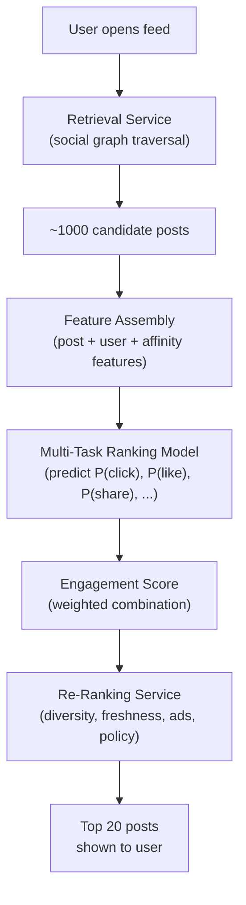

# Personalized News Feed ML System Design

## Understanding the Problem

Every time a user opens Facebook, Instagram, or Twitter, the platform must answer a single question: of the thousands of new posts available from friends, groups, and pages, which ones should appear first? The answer determines whether the user stays and scrolls for 20 minutes or leaves after 10 seconds. At Facebook's scale — 2 billion daily active users checking feeds ~2 times per day — this is 4 billion ranking requests per day, each requiring a personalized ordering of hundreds of candidate posts in under 200 milliseconds.

The problem is technically demanding because it combines multi-modal content understanding (text, images, video), social graph analysis (who posted it, how close is the relationship), multi-objective optimization (clicks vs. likes vs. shares vs. dwell time — each measuring different aspects of engagement), and massive scale serving. What makes it especially interesting as a design problem is the tension between engagement and user health: pure engagement optimization can create addictive content loops, amplify outrage, and degrade long-term retention.

## Problem Framing

### Clarify the Problem

**Q:** What is the primary business objective — engagement, revenue, or user retention?
**A:** Maximize engagement, measured as a weighted combination of user reactions (clicks, likes, comments, shares). Engagement drives ad impressions, which drives revenue. But we must protect long-term user retention — engagement that causes churn is net negative.

**Q:** What types of content appear in the feed?
**A:** Multi-modal: text posts, images, videos, and combinations. Content comes from friends, pages the user follows, groups they're in, and some discovery/viral content.

**Q:** What engagement signals are available?
**A:** Click, like, comment, share, friend request (positive); dwell time (implicit); hide, block, report (negative); skip (scrolled past in <0.5 seconds, strong negative).

**Q:** How many users and what latency?
**A:** ~2 billion DAU, ~4 billion feed requests/day, ~46K requests/second at peak. Latency SLA: 200ms end-to-end.

**Q:** How many candidate posts per user?
**A:** Each user has hundreds to thousands of candidate posts (from friends' recent activity, group posts, page updates). The system must filter and rank these efficiently.

**Q:** How do we handle new users with no history?
**A:** Cold-start users with <5 interactions have no affinity features. Fall back to popularity-based ranking combined with demographic matching.

### Establish a Business Objective

#### Bad Solution: Maximize click-through rate

CTR counts how often users click on posts. The problem: clickbait. Sensational headlines and misleading previews generate clicks without genuine engagement. Users click, realize the content is low-quality, and feel frustrated. CTR optimization also ignores passive engagement — a user who reads a post for 30 seconds without clicking is genuinely engaged, but CTR counts them as zero.

#### Good Solution: Maximize a weighted combination of explicit reactions

Define engagement score = Σ P(reaction_i) × weight_i, where weights reflect business value:

| Reaction | Weight | Why |
|----------|--------|-----|
| Click | 1 | Low effort, noisy signal |
| Like | 5 | Explicit positive signal |
| Comment | 10 | Active engagement, content creation |
| Share | 20 | Brings new eyeballs to the platform |
| Friend request | 30 | Network growth |
| Hide | -20 | Strong negative signal |
| Block | -50 | Very strong negative signal |

This captures the full spectrum of engagement and penalizes content that generates negative reactions. A post with 80% click probability but 15% hide probability would score lower than a post with 40% click probability and 5% like probability.

The limitation: these weights are manually tuned and may not reflect true user satisfaction. A user who spends 30 minutes in an outrage-driven comment thread shows high engagement (likes, comments) but may feel worse about the platform afterward.

#### Great Solution: Multi-objective optimization with user health constraints

Use the weighted engagement score as the primary ranking signal, but add explicit constraints:
1. **Diversity floor:** No more than 3 consecutive posts from the same author or topic cluster. Prevents filter-bubble effects.
2. **Freshness constraint:** Posts older than 48 hours must score 2x higher than a fresh post to rank above it. Users expect new content.
3. **User health guardrail:** Monitor 7-day session frequency and 30-day retention by user cohort. If engagement goes up but retention goes down, the system is creating addictive/outrage-driven loops.
4. **Negative signal sensitivity:** Weight hide/block signals asymmetrically — one hide signal should outweigh many positive signals, because showing a single highly offensive post can damage user trust more than 10 good posts can build it.

### Decide on an ML Objective

This is a **multi-task pointwise Learning to Rank** problem. For each (user, post) pair, simultaneously predict the probability of each reaction type using a shared-backbone multi-task neural network.

**Task heads:**
- P(click), P(like), P(comment), P(share), P(friend_request): binary classification heads
- P(dwell_time > t): regression or binary classification (captures passive engagement for users who never click/like)
- P(skip): binary classification (scrolled past in <0.5 seconds — strong negative)

**Ranking score:**
```
score = w_click·P(click) + w_like·P(like) + w_comment·P(comment) + w_share·P(share)
        + w_dwell·P(dwell>t) - w_hide·P(hide) - w_skip·P(skip)
```

**Why multi-task:** Separate models per reaction would require 7+ models (expensive to train and serve). A shared backbone learns common engagement patterns, and the task-specific heads specialize. Crucially, sparse reactions (shares are rare — maybe 0.1% of impressions) benefit from shared learning with dense reactions (clicks are ~5% of impressions).

## High Level Design



The three-stage pipeline:

1. **Retrieval (candidate generation):** Traverse the social graph to find all recent posts from friends, followed pages, and joined groups. Also inject some discovery content (viral posts, recommended accounts). Produce ~1000 candidate posts. This is mostly a graph database query, not an ML stage.

2. **Ranking:** The multi-task DNN scores each (user, post) pair. The ranking score is the weighted engagement score. This is the ML-heavy stage — runs on GPU, ~100ms latency budget for 1000 candidates.

3. **Re-ranking:** Apply business logic — diversity (no more than 3 from same source), freshness boost, ad interleaving, content policy filtering (remove misinformation, NSFW). This is rules-based, not ML.

## Data and Features

### Training Data

**Positive labels (per task):** User performed the reaction (liked, commented, shared, etc.) on the post after seeing it in the feed.

**Negative labels:** User saw the post (impression logged) but did not perform the reaction. For the skip task, positive = user scrolled past in <0.5 seconds.

**Class imbalance:** Varies dramatically by task. Clicks: ~5% of impressions. Likes: ~2%. Shares: ~0.1%. Comments: ~0.5%. Handle with task-specific loss weighting in the multi-task loss function.

### Features

**User-Author Affinity Features (MOST IMPORTANT)**

Research shows that the affinity between the user and the post's author is the single most predictive feature category for engagement. These features capture the relationship strength:

- `user_author_like_rate`: Rate at which this user has liked this author's previous posts (last 90 days). A like rate of 0.8 means the user almost always likes this author's posts.
- `user_author_comment_rate`: Similar, for comments.
- `user_author_click_rate`: Similar, for clicks.
- `friendship_length_days`: How long the user and author have been friends. Longer friendships correlate with stronger ties.
- `close_friend_flag`: Binary — did the user mark this author as a close friend/family member? Users pay dramatically more attention to close friend posts.
- `recent_message_count`: Number of messages exchanged in the last 30 days. Active communication indicates a strong relationship.

**Post Features**
- `text_embedding`: BERT [CLS] token → 768-dim (or distilled version for speed). Captures post topic and sentiment.
- `image_embedding`: CLIP/ResNet → 256-dim (pre-computed). Captures visual content.
- `video_features`: For video posts — duration, has_thumbnail_text (clickbait signal), topic from first-frame analysis.
- `post_age_bucket`: [<1hr, 1-5hr, 5-24hr, 1-7d, 7-30d, 30+d] → one-hot. Users strongly prefer fresh content.
- `reaction_counts`: log(likes), log(comments), log(shares). Posts with many reactions have proven engagement — social proof.
- `hashtags_embedding`: TF-IDF or word2vec of hashtags → topic similarity with user's interest profile.

**User Features**
- Demographics: `age_bucket` (embedding, dim=8), `gender` (embedding, dim=4), `country` (embedding, dim=16)
- Context: `device_type` (mobile vs. desktop), `time_of_day` (embedding, dim=8), `day_of_week` (embedding, dim=4)
- `historical_engagement_embedding`: Average embedding of the last 50 posts the user engaged with → 128-dim. Captures current interests.
- `user_is_mentioned`: Binary. Users pay much more attention to posts that @mention them.
- `user_activity_level`: Number of interactions in the last 7 days. Distinguishes power users from casual browsers.

**Cross-Features**
- User-post topic similarity: cosine similarity between user interest embedding and post text embedding
- User-post language match: binary
- Author-post consistency: does the post topic match the author's typical topics? Unusual posts from an author may get different engagement patterns.

## Modeling

### Benchmark Models

**Chronological Feed:** Show posts in reverse-chronological order. No personalization. This is what Twitter/X offered as an alternative. It works for power users who follow a curated list but fails for average users who follow hundreds of accounts — they see a firehose of posts with no quality filter.

**Popularity Baseline:** Rank posts by total reaction count (likes + comments + shares). No personalization — same ranking for all users. Surprisingly strong for cold-start users (popular content has broad appeal) but completely ignores individual preferences.

### Model Selection

#### Bad Solution: Logistic Regression on engineered features

Fast, interpretable, and a solid baseline for structured tabular features. But a news feed ranking model must understand multimodal content — text, images, video — and learn complex interactions between user preferences and content attributes. Logistic regression can't handle unstructured data (no way to incorporate BERT or CLIP embeddings natively) and can't learn nonlinear feature interactions (the user likes basketball AND the post is about basketball AND it's from a close friend → high engagement).

#### Good Solution: N separate deep neural networks (one per engagement type)

Train independent models for P(click), P(like), P(comment), P(share), P(skip). Each model fully specializes in its task. The problem: 7+ models to train and serve is expensive. More critically, sparse tasks fail — shares are only 0.1% of impressions, not enough data for a standalone share prediction model. Each model independently must learn the shared patterns of "what content is engaging" from scratch.

#### Great Solution: Multi-Task DNN with shared backbone

One model with shared base layers learning common engagement patterns and 6+ task-specific heads for each engagement type. Sparse tasks (shares, friend requests) benefit from knowledge transfer via the shared layers — patterns learned from abundant click data help predict rare shares. One model to train, serve, and maintain. GradNorm automatically balances task-specific gradients to prevent one task from dominating.

| Approach | Pros | Cons | When to use |
|----------|------|------|-------------|
| **Logistic Regression** | Fast, interpretable | Can't handle unstructured data (text, images), can't learn feature interactions | Baseline only |
| **GBDT (XGBoost)** | Works well with tabular features | Can't fine-tune pre-trained models (BERT, ResNet), can't do continual learning | When features are all structured |
| **N separate DNNs (one per task)** | Each model is specialized | 7+ models to train/serve; sparse tasks (shares) have too little data for their own model | Never — too expensive |
| **Multi-task DNN (chosen)** | Shared backbone enables knowledge transfer; sparse tasks benefit from dense tasks; one model to serve | Multi-task weight tuning; potential negative transfer between tasks | Production — best balance |

### Model Architecture

**Multi-Task DNN with Shared Backbone:**

```
Input: [affinity_features || post_embedding || user_features || cross_features]
    ↓
Shared Backbone:
  Dense: input→512, ReLU, BatchNorm, Dropout(0.3)
  Dense: 512→256, ReLU, BatchNorm, Dropout(0.2)
  Dense: 256→128, ReLU (shared representation)
    ↓
┌────────┬────────┬─────────┬────────┬──────────┬──────────┐
P(click) P(like)  P(comment) P(share) P(dwell>t) P(skip)
Head 1   Head 2   Head 3     Head 4   Head 5     Head 6
└────────┴────────┴─────────┴────────┴──────────┴──────────┘
```

Each head: Dense(128→64, ReLU) → Dense(64→1, Sigmoid)

**Loss function:**
```
L_total = Σᵢ αᵢ × BCELoss(ŷᵢ, yᵢ)  for classification tasks
          + α_dwell × HuberLoss(ŷ_dwell, y_dwell)  for dwell time regression
```

Task weights αᵢ are tuned to balance learning across tasks. Share prediction (very sparse positive rate) gets higher weight. Use GradNorm for automatic weight tuning if manual tuning is insufficient.

**Why multi-task works here:** The click head has abundant training data (5% positive rate). The share head has very sparse data (0.1%). Without multi-task learning, the share head can't learn a good model. With shared layers, the share head leverages patterns learned from the click and like heads — "users who click also tend to share" is implicit in the shared representation.

## Inference and Evaluation

### Inference

**Latency budget (200ms total):**

| Stage | What happens | Latency |
|-------|-------------|---------|
| Social graph retrieval | Traverse friend graph, groups, pages → ~1000 candidate posts | 30ms |
| Feature store lookup | User features, affinity features, post features from Redis/Memcached | 20ms |
| Pre-computed embeddings | Text, image, video embeddings (computed at post creation time) | 5ms |
| Model inference | Multi-task DNN on ~1000 candidates (batched on GPU) | 60ms |
| Engagement score computation | Weighted combination of task predictions | 5ms |
| Re-ranking | Diversity, freshness, ad interleaving, policy filters | 15ms |
| **Buffer** | | **65ms** |
| **Total** | | **200ms** |

**Caching strategy:** For viral posts (viewed by millions of users), pre-compute post embeddings and reaction count features. These don't change per user. Only user-specific features (affinity scores, user embedding) need per-request computation.

**Feature freshness:** Affinity features (user-author like rate) are updated hourly via streaming pipeline. Post reaction counts are updated every 5 minutes. User context features (device, time) are computed at request time.

### Evaluation

**Offline Metrics:**

| Metric | Task | Why |
|--------|------|-----|
| **AUC-ROC** per task | Each reaction prediction head | Measures discrimination quality — can the model distinguish engagers from non-engagers? |
| **PR-AUC** for sparse tasks | Share, comment | PR-AUC is more informative than ROC-AUC when the positive rate is very low |
| **nDCG@10** | End-to-end ranking | Measures whether the top-10 posts are the most engaging ones |

**Online Metrics:**
- **Primary:** Total time spent per session, total reactions per session
- **Secondary:** CTR, like rate, comment rate, share rate (per reaction)
- **Guardrail:** Hide rate, block rate, user-reported dissatisfaction, 7-day retention
- **Long-term:** 30-day retention by cohort, DAU trends

**A/B testing at Facebook scale:**
- Randomize at user level, not request level
- With 1B+ DAU, even tiny effects (0.1% improvement) are detectable with high statistical power
- Run for at least 2 weeks to separate novelty effects from sustained improvement
- Monitor guardrail metrics (hide rate, retention) with the same rigor as primary metrics

## Deep Dives

### 💡 User-Author Affinity Is the Most Predictive Feature

Facebook's published research shows that the affinity between user and post author is the single most predictive factor for news feed engagement. A post from your best friend — no matter the content — is more engaging than a perfectly topical post from a distant acquaintance.

**Why this matters architecturally:** The affinity features (like rate, comment rate, message frequency, friendship length) are pre-computed per (user, author) pair and stored in a fast KV store (Redis). With ~1000 friends per user and ~500 average friends/pages/groups generating content, this is ~500K pre-computed affinity scores per user. At 2B users, this is ~1 quadrillion affinity scores. In practice, most are zero (the user has never interacted with that author) and only non-zero entries are stored.

**Time decay:** Affinity should decay over time. A user who liked every post from a friend 2 years ago but hasn't interacted in 6 months should have lower affinity than the raw like rate suggests. Apply exponential time decay: weight each past interaction by `e^(-λt)` where `t` is the time since the interaction and `λ` controls the decay rate (typically set so that interactions from 90 days ago have ~50% weight).

### ⚠️ The Passive User Problem

Many users scroll through the feed but never click, like, comment, or share. For these passive users, the multi-task model predicts near-zero probabilities for all explicit reactions — the engagement score is essentially zero for every post, making ranking meaningless.

**Dwell time as implicit engagement:** How long the user lingers on a post before scrolling is a strong engagement signal even without any explicit reaction. A user who stops scrolling for 10 seconds to read a post is engaged; a user who scrolls past in 0.3 seconds is not.

**Skip prediction:** The inverse signal — predict whether the user will skip the post in <0.5 seconds. This provides a strong negative signal for all users, including passive ones.

**Serving passive users:** For users with <5 explicit reactions in the last 30 days, shift the engagement score weights to emphasize P(dwell>t) and P(skip) over P(like) and P(share). This gives the model a meaningful ranking signal for passive users while maintaining the standard engagement score for active users.

### 🏭 Viral Post Handling

When a post goes viral (millions of views in hours), it creates several technical challenges:

**Thundering-herd problem:** Millions of requests simultaneously fetch the same post's features from the feature store. Without caching, this overwhelms the feature store. Solution: cache viral post features (reaction counts, embeddings) at the edge with 5-minute TTL. Post-specific features don't change per user.

**Feature staleness:** A viral post's reaction count changes rapidly (from 1,000 to 1,000,000 in an hour). Stale reaction count features cause the model to underestimate the post's popularity. Solution: for posts with >10K reactions in the last hour, push real-time reaction count updates via streaming pipeline, bypassing the normal 5-minute batch update.

**Fairness:** Viral posts crowd out content from friends and smaller accounts. A user whose feed is dominated by viral content from accounts they don't follow will have a worse experience. Solution: cap the number of viral/discovery posts in the top 20 (e.g., max 3 viral posts) to preserve the social feed character.

### ⚠️ Engagement vs. User Health

Pure engagement optimization creates measurably harmful content loops. Outrage-driven political content generates high engagement (comments, shares, emotional reactions) but degrades user satisfaction and drives long-term churn. Research shows users who consume outrage content spend more time per session but are less likely to return the next day.

**Measuring user health:** Supplement engagement metrics with:
- User-initiated negative signals (hide, snooze, unfollow) as direct dissatisfaction indicators
- Post-session survey sampling ("Did you enjoy your feed today?" shown to 0.1% of sessions)
- Weekly retention by engagement type (do users who engage primarily with outrage content retain worse than users who engage with positive content?)

**Intervention:** When the engagement score heavily favors a post due to controversy/outrage, apply a quality multiplier based on the post's hide/report rate among users who saw it. A post with 5% like rate but 3% hide rate should rank lower than a post with 3% like rate and 0.1% hide rate — the first post is polarizing, not genuinely engaging.

### 📊 Multi-Task Weight Tuning

The multi-task loss function `L = Σ αᵢ × Lᵢ` requires tuning the task weights αᵢ. Getting these wrong can cause one task to dominate training at the expense of others.

**Naive approach:** Set weights proportional to task importance (share weight > like weight > click weight). Problem: tasks with low positive rates (shares at 0.1%) naturally have lower loss magnitudes than tasks with high positive rates (clicks at 5%). Equal weighting causes the click head to dominate gradient updates because its loss is larger.

**GradNorm (automatic weighting):** Dynamically adjust task weights during training to keep gradient magnitudes balanced across tasks. If the click head's gradients are 10x larger than the share head's, reduce the click weight and increase the share weight.

**Task conflict detection:** Some tasks can have conflicting gradients — a parameter update that improves click prediction may hurt share prediction. Monitor per-task metrics during training. If adding a new task head consistently degrades other tasks, it may need its own parameters (not shared layers).

### 🔄 Feedback Loops and Filter Bubbles

The news feed creates one of the most powerful feedback loops in ML: the model shows content based on past engagement → users engage with what they see → engagement data reinforces the model → the model narrows further. Over months, users who initially showed mild interest in politics receive increasingly extreme political content, not because they sought it out, but because the loop amplified the initial signal.

**Measuring filter bubbles:** Track topic distribution entropy per user over time. A declining entropy means the user is seeing narrower content. Monitor the "unique sources" metric — how many distinct authors/pages appear in a user's feed per week. If this count decreases, the feed is concentrating on a smaller set of content producers.

**Structural mitigations:** (1) Diversity constraints in re-ranking: at least 30% of feed items must come from sources the user rarely engages with. (2) Exploration budget: 5% of feed slots are filled by content from outside the user's normal interest profile, selected via Thompson sampling across topic clusters. (3) "Serendipity" metric: track how often users engage positively with content from outside their dominant topic clusters. Increasing serendipity without decreasing overall engagement is the goal.

**Why pure diversity isn't enough:** Forced diversity can degrade the user experience if the injected content is truly irrelevant. The exploration content should still be high-quality — use a "best of the rest" strategy (highest engagement probability among content outside the user's typical clusters) rather than random injection.

### 🏭 Cold Start for New Users

New users with no interaction history have no affinity features, no engagement history embedding, and no preference signal. The multi-task model's most predictive features are all zero. This is especially critical because first-session experience determines whether a new user returns.

#### Bad Solution: Show a popularity-ranked feed

Show the most globally popular posts. This works for broad-appeal content but completely ignores the user's potential interests. A new user interested in cooking sees the same feed as one interested in gaming. The feed feels generic and impersonal — the opposite of what a personalized platform promises.

#### Good Solution: Demographic-based personalization + explicit interest selection

During onboarding, ask the user to select interest categories (sports, cooking, technology, etc.) and suggest popular accounts to follow. Use demographic features (age, gender, location) combined with selected interests to initialize the engagement model. This provides a basic personalization layer immediately.

#### Great Solution: Rapid exploration + contextual bandits for the first 50 interactions

During the first 5-10 sessions, run a contextual bandit (LinUCB) over topic clusters: show diverse content from many categories, observe which the user engages with, and rapidly narrow the content distribution toward engaged categories. Each interaction provides an order of magnitude more signal than demographics. After ~50 interactions, the user has enough affinity features for the standard ranking model to take over.

Track new-user 7-day retention as the key metric. Compare bandit-based onboarding against popularity-based and demographic-based baselines. The bandit approach typically achieves 10-20% higher 7-day retention because it personalizes faster.

### 📊 Real-Time vs Batch Inference for Feed Ranking

The news feed must balance prediction freshness with infrastructure cost. User preferences change throughout the day (news in the morning, entertainment at night), new posts appear every minute, and reaction counts shift rapidly.

**Batch approach (pre-compute rankings):** Compute the top-100 posts for each of 2B users every hour. Store in a key-value cache. At request time, just do a lookup. Pros: near-zero serving latency, low inference cost per request. Cons: 2B × ranking computation per hour is enormous; rankings are stale within minutes as new posts arrive and reaction counts change.

**Real-time approach (rank on every request):** Run the full ranking pipeline (feature assembly + model inference) on every feed request. Pros: always fresh. Cons: at 46K requests/second × 1000 candidates per request = 46M model evaluations per second — requires a massive GPU fleet.

**Hybrid (production approach):** Pre-compute candidate sets hourly (which ~1000 posts are eligible for each user). At request time, refresh feature values (current reaction counts, user context) and re-score the pre-computed candidate set. The expensive part (candidate generation via social graph traversal) is batched; the cheap part (model inference on 1000 candidates) is real-time. This gives 90% of the freshness benefit at 30% of the cost.

### ⚠️ Position Bias in Feed Ranking

Posts shown at the top of the feed get more engagement regardless of quality. A post at position 1 receives 3-5x the engagement of the same post at position 5. If we train on raw engagement labels, the model learns that "whatever we currently show first is the best content" — a self-reinforcing loop.

**Position as a feature:** Include the position in which the post was shown as a training feature. At serving time, set position to a neutral value (e.g., position 0 or mean position) for all candidates. The model learns the position effect and factors it out when making predictions.

**IPS correction:** Weight each training example by `1/P(engagement | position)`, estimated from randomized position experiments. Posts shown at position 1 (high engagement propensity) are downweighted; posts at lower positions are upweighted. This debiases the training data toward true content quality rather than position-driven engagement.

**Measuring position bias severity:** Run a periodic randomization experiment: shuffle the top-20 posts randomly for 1% of users for 24 hours. Compare engagement patterns between random and ranked feeds. The gap between position-1 engagement in random vs. ranked feeds measures how much of the engagement is position-driven vs. content-driven.

### ⚠️ A/B Testing Long-Term Effects

Standard A/B tests for feed ranking run for 1-2 weeks and measure immediate engagement metrics. But the most important effects of ranking changes — filter bubble acceleration, retention degradation, creator behavior shifts — manifest over months, not days.

**Novelty bias:** Users initially engage more with any new ranking because the content is different. A test showing +5% engagement in week 1 may show +0% by week 3 as the novelty wears off. Always run tests for at least 3 weeks and plot the treatment effect trajectory over time. A declining effect curve signals novelty, not genuine improvement.

**Metric divergence:** A ranking change can simultaneously improve short-term engagement (more clicks, more time) and degrade long-term satisfaction (more outrage content, more hide signals). If the test runs for only 7 days, the short-term metric looks great and the change ships. The damage shows up 3 months later as a slow decline in daily active users.

**Long-term holdout cohort:** Reserve 2-5% of users who never receive any ranking updates for 6+ months. Compare their retention, satisfaction survey results, and engagement patterns against the main population. This reveals the cumulative effect of all ranking changes, not just individual experiments. If the holdout cohort retains better, the sum of recent ranking changes is net-negative for user health even if each individual change showed a positive A/B result.

## What is Expected at Each Level?

### Mid-Level Engineer

A mid-level candidate should recognize that this is a ranking problem, propose a multi-task model predicting multiple engagement types (click, like, share), and define the engagement score as a weighted combination. They should identify user-author affinity as an important feature category and propose a three-stage serving pipeline (retrieval → ranking → re-ranking). They differentiate by explaining why multi-task is better than separate models (sparse tasks benefit from shared learning) and choosing time-on-site or weighted engagement over raw CTR as the primary online metric.

### Senior Engineer

A senior candidate will design the complete multi-task DNN architecture with shared backbone and task-specific heads, explain the loss function with task-specific weights, and discuss dwell time and skip prediction for passive users. They proactively raise position bias, freshness handling, and the engagement-vs-clickbait tension. For features, they detail user-author affinity scores with time decay and propose BERT/CLIP embeddings for multimodal content understanding. They design the feature store architecture (hot features in Redis, batch features computed hourly) and propose AUC-ROC per task plus nDCG@10 for end-to-end ranking evaluation.

### Staff Engineer

A Staff candidate quickly establishes the multi-task ranking model and three-stage pipeline, then goes deep on the systemic challenges: why user-author affinity dominates other features (and the infrastructure implications of pre-computing quadrillions of affinity scores), how pure engagement optimization creates harmful content loops (outrage amplification, filter bubbles), and how viral posts create thundering-herd problems and fairness issues. They think about engagement vs. user health as a measurable tradeoff — not a vague concern — and propose specific metrics (hide rate, post-session surveys, retention by engagement type) and interventions (quality multipliers, controversy caps). They recognize that the engagement score weights are a product decision embedded in the ML system, and that the ML team should surface the tradeoffs rather than make the decision unilaterally.

## References

- Sankar et al., "An Internal Look at Facebook's News Feed Ranking" (Facebook Engineering, 2021)
- Covington et al., "Deep Neural Networks for YouTube Recommendations" (2016)
- Chen et al., "GradNorm: Gradient Normalization for Adaptive Loss Balancing in Deep Multitask Networks" (2018)
- Devlin et al., "BERT: Pre-training of Deep Bidirectional Transformers for Language Understanding" (2019)
- Radford et al., "Learning Transferable Visual Models From Natural Language Supervision" (CLIP, 2021)
