# People You May Know ML System Design

## Understanding the Problem

"People You May Know" (PYMK) is one of the most impactful features on professional social networks like LinkedIn and social platforms like Facebook. It suggests connections the user might want to add. Behind the simplicity of "you might know this person" lies a system that processes billions of relationships across a social graph of 1 billion users.

What makes PYMK a fascinating ML problem is that the most predictive signal is not individual user attributes (age, company, location) but the graph structure itself. Meta research shows that 92% of new friendships form between friends-of-friends (2-hop neighbors). Two users with 15 mutual connections are far more likely to connect than two users who attended the same school but have no overlapping social circle. This makes PYMK fundamentally a graph problem — and the architecture choice (Graph Neural Networks vs. independent classifiers) is one of the most impactful decisions in the design.

PYMK also has unique privacy implications: recommending two users to each other can inadvertently reveal that they share a sensitive affiliation (same support group, same HR investigation). This privacy dimension doesn't exist in most recommendation problems and is a hallmark of Staff-level awareness.

## Problem Framing

### Clarify the Problem

**Q:** What is the business objective — maximize connection requests sent, or connections formed?
**A:** Maximize accepted connections (connections formed). Requests sent without acceptance is vanity — it can even harm the platform if users feel overwhelmed by irrelevant requests. Accepted connections directly measure network growth.

**Q:** How many users and connections?
**A:** ~1 billion total users, ~300 million daily active users. Average user has ~1,000 connections. Friendship is symmetric (both sides must accept).

**Q:** Is the social graph dynamic?
**A:** Relatively static. Users don't dramatically change their connection graph day to day. This means batch pre-computation of PYMK suggestions is viable.

**Q:** What data is available beyond the connection graph?
**A:** User profile data (education, work history, skills, location), interaction data (profile views, searches, message exchanges, post engagement), and connection timestamps.

**Q:** What is the latency requirement?
**A:** Because the social graph is relatively stable, PYMK can be batch pre-computed daily. The online serving just fetches pre-computed results — sub-50ms.

**Q:** Are there privacy constraints?
**A:** Yes. PYMK has known privacy risks. If two users are both members of a sensitive group (HIV support group, addiction recovery), showing them in each other's PYMK list reveals their shared membership. Privacy-aware design is required.

### Establish a Business Objective

#### Bad Solution: Maximize connection requests sent

Requests sent measures whether PYMK is generating action. The problem: many requests are never accepted. A system that generates 1,000 requests where only 50 are accepted is worse than one that generates 200 requests where 150 are accepted. The first creates noise and annoyance (recipients get irrelevant requests); the second creates genuine network growth.

#### Good Solution: Maximize accepted connections (new connections formed)

This directly measures the business objective — network growth. Each accepted connection represents a genuine new relationship that increases platform value for both users. It accounts for both sides of the connection decision (sender thought the suggestion was good enough to send AND recipient thought it was worth accepting).

The limitation: raw accepted connections doesn't account for connection quality. Adding your 5th connection at a new job (strong professional value) is worth more than adding your 500th casual acquaintance (marginal value). And optimizing purely for acceptance rate can create a bias toward suggesting "easy" connections (close mutual friends) rather than "valuable" connections (people who would benefit from knowing each other but don't yet).

#### Great Solution: Maximize weighted accepted connections with network diversity constraints

Weight each accepted connection by the predicted interaction value: connections that lead to message exchanges, endorsements, or professional collaboration in the following 90 days are worth more than dormant connections. This shifts optimization from "any connection" to "valuable connections."

Add a **network diversity constraint:** ensure PYMK suggestions span multiple social clusters (different companies, different industries, different friend groups). Without this, PYMK creates echo chambers — users only connect within their existing bubble, and the platform loses its value as a bridge across professional communities.

### Decide on an ML Objective

This is a **graph edge prediction** problem. Given a snapshot of the social graph at time t, predict which new edges (connections) will form by time t+k.

**Why graph edge prediction over pointwise classification:**
A binary classifier that takes two user feature vectors and predicts P(connect) independently ignores the most important signal — graph structure. Two users with 15 mutual connections are far more likely to connect than two users with identical profile attributes but zero mutual connections. The graph-based formulation captures this.

**Training data construction:**
1. Snapshot the social graph at time t (nodes = users, edges = connections)
2. Compute node features (user profiles) and edge features (mutual connections, profile views)
3. Labels: pairs of users who formed NEW connections between t and t+k are positive; pairs who remained unconnected are negative
4. Temporal split: train on snapshots from months 1-6, validate on month 7, test on month 8

**Model: Graph Neural Network (GNN)** — specifically GraphSAGE, which samples and aggregates from neighbor nodes. After K layers of message passing, each user has an embedding that encodes both their profile features AND their graph neighborhood structure. Edge prediction: `P(connect | u, v) = σ(embed(u) · embed(v))`.

## High Level Design

```mermaid
flowchart TD
    subgraph Offline["Offline Pipeline (daily batch)"]
        A["Social Graph Snapshot"] --> B["FoF Service\n(2-hop neighbors)"]
        B --> C["~1M candidates per user"]
        C --> D["Lightweight Pre-filter\n(mutual connection count > threshold)"]
        D --> E["~10K candidates per user"]
        E --> F["GNN Scoring\n(GraphSAGE edge prediction)"]
        F --> G["Ranked PYMK Lists\n→ Database"]
    end

    subgraph Online["Online Pipeline (per request)"]
        H["User opens PYMK page"] --> I["Fetch pre-computed list\nfrom database"]
        I --> J["Re-ranking\n(diversity, privacy, freshness)"]
        J --> K["Top 10 suggestions\nshown to user"]
    end
```



The key architectural insight: **batch pre-computation is viable** because the social graph changes slowly. Unlike a news feed (which must rank fresh content in real-time), PYMK suggestions from yesterday are still relevant today. This dramatically simplifies the serving architecture — no real-time model inference needed.

**Candidate generation: Friends of Friends (FoF)**
- 92% of new connections form between FoF (2-hop neighbors)
- Average user has ~1,000 connections → ~1M FoF candidates
- Pre-filter by mutual connection count (>2 mutual connections) → ~10K candidates
- This reduces the comparison space from 1B to ~10K — a 100,000x reduction

## Data and Features

### Training Data

**Graph snapshot at time t:**
- Nodes: 1B users, each with a feature vector
- Edges: existing connections with timestamps

**Positive labels:** Pairs of users who formed new connections between time t and t+k (e.g., k = 30 days). ~50M new connections per month at LinkedIn scale.

**Negative labels:** FoF pairs who did NOT connect during the same period. Random sampling from all non-connected pairs would be dominated by trivially easy negatives (users in different countries with zero mutual connections). Use FoF-restricted negatives: pairs within 2 hops who did not connect — these are the hard negatives the model needs to distinguish.

**Temporal split:** Train on graph snapshot at month 1 → labels from months 1-2. Validate on month 3 → labels from months 3-4. Test on month 5 → labels from months 5-6. Never leak future graph information into training features.

### Features

**User (Node) Features**
- Demographics: `age_bucket`, `gender`, `country`, `city` (embeddings)
- Professional: `current_company`, `industry`, `job_title_seniority` (embeddings)
- Education: `university`, `degree_type`, `field_of_study` (embeddings)
- Activity: `connection_count` (log), `account_age_days` (log), `posts_last_30d` (log)
- Engagement: `received_likes_30d` (log), `profile_view_count_30d` (log)

**User-User (Edge) Features**
- `mutual_connection_count`: THE most important feature. Log-transformed. Users with 15+ mutual connections have >80% probability of connecting.
- `time_discounted_mutual_connections`: Weight each mutual connection by recency. Recent mutual connections (formed in the last 30 days) indicate active network growth — the user is more likely to continue adding connections.
- `schools_in_common`: Binary or count. Were they at the same school?
- `school_year_overlap`: Did they attend the same school at the same time? Much more predictive than just same school.
- `companies_in_common`: Binary or count. Did they work at the same company?
- `same_industry`: Binary. Both in tech? Both in finance?
- `profile_view_count`: How many times User A viewed User B's profile (asymmetric — A→B is a strong signal that A is interested in connecting with B).
- `search_interaction`: Did User A search for User B by name? Very strong intent signal.

**Graph-Level Features (learned by GNN)**
- `neighborhood_overlap`: Jaccard similarity of 1-hop neighborhoods
- `common_clusters`: Number of shared community clusters (detected via graph clustering)
- `triadic_closure_score`: For each mutual connection, how many of that mutual's connections also connect both users? High triadic closure = dense mutual neighborhood = high connection probability.

## Modeling

### Benchmark Models

**Mutual Connection Count Baseline:** Rank all FoF candidates by mutual connection count. Show the ones with the most mutual connections first. This is surprisingly strong — mutual connections is the single most important feature. But it ignores all profile-based signals (same company, same school) and can't distinguish quality of mutual connections.

**Pointwise Binary Classifier:** Extract user pair features (mutual connections, same school, profile views) and train a logistic regression or XGBoost classifier to predict P(connect). Better than the heuristic baseline because it combines multiple features. But treats each pair independently — doesn't capture graph neighborhood structure or triadic closure patterns.

### Model Selection

#### Bad Solution: Mutual connection count heuristic

Rank all FoF candidates by the number of mutual connections and show the top-10. No ML needed. This is surprisingly strong — mutual connections is the single most predictive feature. But it ignores all profile-based signals (same company, same school, profile views), can't break ties intelligently, and treats all mutual connections as equal (a mutual connection formed last week is more informative than one from 5 years ago).

#### Good Solution: Pointwise binary classifier (LR/XGBoost) on pair features

Extract user pair features (mutual connections, same school, company overlap, profile view count) and train a classifier to predict P(connect). Combines multiple features, handles ties, and can learn nonlinear interactions (via XGBoost). But it treats each pair independently — the model doesn't know about the broader graph neighborhood structure. It can't capture triadic closure patterns (if A→B and A→C are connected, and B→C are not, the closure probability depends on the density of the A-B-C triangle neighborhood, which pointwise features can't encode).

#### Great Solution: GraphSAGE (Graph Neural Network) with edge features

GraphSAGE learns node embeddings by iteratively aggregating information from sampled neighbors. After 2 layers of message passing, each user has an embedding encoding both their profile features AND their local graph topology. Edge prediction uses the dot product of node embeddings plus an MLP on explicit edge features (profile views, school overlap). This captures triadic closure, neighborhood density, and community structure that pointwise classifiers miss entirely.

| Approach | Pros | Cons | When to use |
|----------|------|------|-------------|
| **Mutual connection count** | Simple, no training, strong baseline | Ignores profile features, can't rank ties | Baseline |
| **Pointwise classifier (LR/XGBoost)** | Combines multiple features, fast inference | Ignores graph structure, can't learn from neighborhood | When graph features are unavailable |
| **GraphSAGE (chosen)** | Learns from graph neighborhood, message passing captures triadic closure, inductive (handles new nodes) | More complex to train, requires graph infrastructure | When graph structure is the dominant signal (our case) |
| **GAT (Graph Attention Network)** | Attention-weighted neighbor aggregation | Higher compute cost, marginal gain over GraphSAGE | When neighbor importance varies significantly |

### Model Architecture

**GraphSAGE (Sample and Aggregate):**

GraphSAGE learns node embeddings by iteratively aggregating feature information from a node's neighbors. At each layer, a node's embedding is updated by:
1. Sampling K neighbors (not all — sampling controls computational cost)
2. Aggregating their embeddings (mean, max-pool, or LSTM aggregator)
3. Combining the aggregated neighbor embedding with the node's own embedding
4. Applying a nonlinear transformation

**Layer computation:**
```
h_v^(l+1) = σ(W^(l) · CONCAT(h_v^(l), AGG({h_u^(l) : u ∈ N(v)})))
```

where `h_v^(l)` is node v's embedding at layer l, N(v) is v's sampled neighbor set, AGG is the aggregation function (mean pooling), and W is a learnable weight matrix.

**Architecture:**
```
Input: node features (user profile, ~128-dim)
    ↓
GraphSAGE Layer 1 (sample 15 neighbors, mean-pool aggregate)
    → 128-dim node embedding after 1-hop aggregation
    ↓
GraphSAGE Layer 2 (sample 10 neighbors, mean-pool aggregate)
    → 64-dim node embedding after 2-hop aggregation
    ↓
For edge prediction between users u and v:
    P(connect | u, v) = σ(embed(u) · embed(v) + MLP(edge_features))
```

**Why 2 layers:** Each layer aggregates information from 1 hop. 2 layers captures 2-hop neighborhood — exactly the FoF range. 3+ layers suffer from over-smoothing (all node embeddings converge to similar values) and are computationally expensive on large graphs.

**Edge features integration:** Pure GNN only captures graph structure. Critical edge features (profile view count, school overlap, company overlap) are injected via an MLP that takes edge features as input and adds its output to the dot product score. This combines graph-learned signals with explicit pair features.

**Training loss — Binary Cross-Entropy with negative sampling:**
```
L = -Σ log σ(embed(u) · embed(v)) for positive edges
    -Σ log σ(-embed(u) · embed(w)) for negative samples
```

Negative samples: 5 random FoF non-connected pairs per positive pair.

**Scalability:** Full-graph GNN training is infeasible at 1B nodes. GraphSAGE's inductive training approach uses mini-batch training with neighborhood sampling — sample a subgraph around each target edge, run message passing on the subgraph only. This makes training scale linearly with the number of edges, not quadratically with the number of nodes.

## Inference and Evaluation

### Inference

**Batch pipeline (daily, for 300M DAU):**

| Stage | What happens | Scale |
|-------|-------------|-------|
| FoF candidate generation | For each user, find all 2-hop neighbors | ~1M per user |
| Pre-filtering | Keep only FoF with ≥2 mutual connections | ~10K per user |
| Feature computation | Compute edge features for (user, candidate) pairs | ~3B pairs total |
| GNN scoring | Run GraphSAGE edge prediction on all pairs | ~3B predictions |
| Rank and store | Sort by score, store top-100 PYMK per user in DB | 300M users × 100 |

**Compute budget:** 3B edge predictions per day. With batch inference on GPUs (~1M predictions/second), this takes ~3,000 GPU-seconds = ~50 GPU-minutes per daily run. Feasible.

**Online serving (per request):**
1. User opens PYMK page → fetch pre-computed top-100 from database (5ms)
2. Re-ranking: remove already-sent requests, filter by privacy rules, enforce diversity (5ms)
3. Return top-10 suggestions (2ms)
Total: ~12ms. Well within any latency SLA.

**Refresh frequency:** Re-compute every 7 days for established users (stable networks), daily for new users (rapidly growing networks). Trigger re-computation when a user forms 3+ new connections in a day (their network changed significantly).

### Evaluation

#### Bad Solution: Optimize for ROC-AUC on a random held-out set

ROC-AUC measures whether the model can distinguish pairs that will connect from pairs that won't. The problem: PYMK is a ranking problem, not a classification problem. A model with high ROC-AUC might rank the top 10 suggestions poorly — it correctly separates "will connect" from "won't connect" at the population level, but the specific ranking within the top 10 shown to the user is what drives product value. Additionally, a random held-out set doesn't reflect temporal dynamics — the model might memorize graph patterns rather than predict future connections.

#### Good Solution: mAP with temporal splits and acceptance rate tracking

Use mean average precision (mAP) on a temporally split evaluation set: train on graph snapshots from months 1-6, evaluate on connections formed in month 7. mAP directly measures ranking quality — are the users most likely to accept near the top of the PYMK list? Track acceptance rate online (accepted connections / requests sent) to catch divergence between offline ranking quality and real-world behavior.

The limitation: mAP treats all accepted connections equally. A connection that leads to active professional collaboration is worth more than a dormant connection that is accepted but never interacted with again.

#### Great Solution: Multi-signal evaluation with interaction-weighted metrics and privacy guardrails

Combine offline ranking quality (mAP with temporal splits) with online metrics that measure connection value: (1) weighted acceptance rate where connections followed by messages, endorsements, or content engagement within 90 days receive higher weight, (2) network diversity score ensuring suggestions span multiple social clusters, (3) privacy guardrails tracking block/ignore rate and user-reported "creepy" recommendations. A model that achieves high mAP but increases the block rate is worse than one with slightly lower mAP but fewer privacy violations. Run stratified evaluation across user segments: new users (cold start), active users (high engagement), and dormant users (re-engagement).

**Offline Metrics:**

| Metric | What it measures | Why it fits PYMK |
|--------|-----------------|-----------------|
| **ROC-AUC** | Can the GNN distinguish pairs that will connect from pairs that won't? | Primary model-level metric for edge prediction quality. |
| **mAP** | Ranking quality of the PYMK list — are the users most likely to accept near the top? | System-level metric. Multiple suggestions can be relevant, and mAP captures ranking. |

**Online Metrics:**
- **Primary:** Total accepted connections per day (network growth). This is the north star.
- **Secondary:** Connection request send rate (are users engaging with PYMK suggestions?)
- **Acceptance rate:** Accepted / sent. If send rate goes up but acceptance rate drops, we're suggesting less relevant connections.
- **Guardrail:** Block/ignore rate on PYMK suggestions (explicit negative signal), user-reported "creepy" recommendations

## Deep Dives

### 💡 Why 92% of Connections Are Friends-of-Friends

This statistic from Meta research has profound architectural implications. It means:

1. **Candidate generation is solved:** We don't need sophisticated retrieval. Just enumerate 2-hop neighbors. This reduces the search space from 1B to ~1M per user — and with the mutual connection threshold filter, to ~10K.

2. **The graph IS the feature:** The fact that two users share mutual connections is more predictive than any profile attribute. Two strangers at the same company with zero mutual connections are less likely to connect than two people in different industries with 15 mutual connections.

3. **The remaining 8% is the hard problem:** Non-FoF connections (people who connect despite having no mutual connections) require content-based features — same university, same company, same interest groups. These are much harder to predict and much rarer.

**Practical implication:** The system should have two pathways — FoF-based (covers 92% of connections, uses graph features) and content-based (covers the remaining 8%, uses profile matching). The GNN handles the first; a simple profile-similarity model handles the second.

### ⚠️ Privacy and the "Creepy Recommendation" Problem

PYMK can inadvertently reveal sensitive information:

**Group membership leakage:** Two users in the same HIV support group appear in each other's PYMK. The recommendation implicitly reveals that both are members of a sensitive health community.

**Workplace leakage:** An employee appears in the PYMK of an HR consultant hired to review their team. The recommendation reveals internal HR activity.

**Stalker signal leakage:** User A repeatedly views User B's profile. User B appears in User A's PYMK (correct — A is interested). But if User A then appears in User B's PYMK, the system has revealed A's private browsing behavior to B.

**Mitigations:**
- Privacy-tagged groups: if a group has a "private" or "sensitive" flag, suppress group co-membership as a PYMK signal
- Asymmetric profile view handling: profile views inform the viewer's PYMK (User A sees B as suggestion) but NOT the viewed user's PYMK (B does NOT see A as a result of A's viewing)
- Explanation transparency: show "X mutual connections" as the explanation for the suggestion. Never show "viewed your profile" or "member of the same group" as explanations.

### 🏭 Batch vs. Online Prediction

PYMK is one of the few recommendation problems where batch pre-computation is clearly the right choice:

**Why batch works:** The social graph changes slowly. A user's PYMK list from yesterday is 95%+ identical to today's list. Pre-computing daily is sufficient for most users.

**Why real-time is too expensive:** Computing PYMK for 300M DAU in real-time means running the GNN on 300M × 10K candidate pairs = 3 trillion edge predictions per day. In batch, we run 3B predictions once per day (only for the top candidates after pre-filtering). That's a 1000x reduction.

**Hybrid approach for events:** When a user forms a new connection, trigger a lightweight re-ranking of their pre-computed PYMK list. The new connection changes mutual connection counts for all FoF — a simple incremental update, not a full re-computation. This keeps PYMK responsive to recent connection activity without full real-time inference.

### 📊 Cold Start for New Users

New users have no connections, no interaction history, and no graph neighborhood. The GNN produces a zero embedding because there are no neighbors to aggregate from.

**Content-based fallback:** Match new users by profile attributes — same company, same university, same location, same industry. These features are available at account creation. Rank by attribute overlap score.

**Onboarding flow:** During sign-up, prompt the user to connect their address book or social accounts. This immediately bootstraps their connection graph and provides FoF candidates. Within 5 connections, the GNN can produce meaningful recommendations.

**Import-based suggestions:** If the user imports contacts from email or phone, match against existing platform users. These are extremely high-quality suggestions (the user already knows these people) and bootstrap the graph rapidly.

### 💡 Time-Discounted Mutual Connections

Not all mutual connections are equal. A mutual connection formed last week is more informative than one from 5 years ago.

**Why recency matters:**
- A user who recently connected with several people in a new team/company is actively expanding their network in that direction. Their remaining unconnected FoF in that group are high-probability suggestions.
- A user whose mutual connections are all from years ago has a stable network. They probably already know about their FoF and chose not to connect. Suggesting them again is less likely to succeed.

**Implementation:** Weight each mutual connection by `e^(-λt)` where t is the time since the connection formed. λ is tuned so that connections from 6 months ago have ~50% weight. The time-discounted mutual connection count captures "active network expansion" vs. "stable network" dynamics.

This feature is cited as one of the most impactful improvements in Meta's PYMK system — it significantly increases the acceptance rate of suggestions by prioritizing candidates in actively-growing parts of the user's network.

### ⚠️ Network Diversity and Echo Chamber Risk

Pure mutual-connection-based PYMK creates echo chambers. If User A's connections are all engineers at Google, PYMK will suggest more engineers at Google. The user's network becomes increasingly homogeneous, reducing the platform's value as a bridge across communities.

**Diversity constraints in re-ranking:** After scoring, enforce diversity: no more than 3 suggestions from the same company, no more than 5 from the same industry. This ensures PYMK surfaces connections from different parts of the user's potential professional network.

**Weak-tie optimization:** Research (Granovetter, 1973) shows that weak ties (connections between different social clusters) are the most valuable for career advancement. PYMK could prioritize cross-cluster connections — people who would bridge two otherwise disconnected parts of the user's network. Measure this as the "bridge score" of a potential connection: how much would adding this connection reduce the average path length in the user's ego network?

### 🔄 Reciprocal Recommendations: Mutual Interest Prediction

Standard PYMK predicts whether User A will send a request to User B. But a connection requires both sides — User B must also accept. Optimizing only for the sender's intent ignores the recipient's perspective.

**Asymmetric intent:** User A might want to connect with User B (a famous tech CEO), but the probability that User B accepts a request from User A (an unknown junior engineer) is very low. Showing A this suggestion generates a request that gets ignored, wasting both users' attention.

**Reciprocal scoring:** Predict P(A sends request to B) AND P(B accepts request from A) separately. The final PYMK score is: `score = P(send | A, B) × P(accept | B, A)`. This naturally penalizes asymmetric suggestions — a pair where both sides are likely to connect scores highest.

**Data asymmetry challenge:** We observe who sends requests (positive send labels) but not who would have sent a request if shown the suggestion (counterfactual). We observe which requests are accepted, but acceptance is conditioned on the request being sent. Use IPS correction: weight acceptance labels by `1/P(shown in PYMK and sent)` to debias.

**In practice,** reciprocal scoring reduces the total number of connection requests sent but dramatically increases the acceptance rate. The net effect is often positive — fewer but more valuable connections form, and users trust the PYMK feature more because suggestions feel relevant from both sides.

### 🏭 Graph Neural Networks at Scale: Neighbor Sampling

Running a GNN on a graph with 1B nodes and 500B edges (each user has ~1000 connections) is computationally infeasible without sampling. GraphSAGE solves this through neighborhood sampling, but the sampling strategy has major implications for model quality.

**Why full-graph training is impossible:** At 2 layers with full neighborhood aggregation, computing one node's embedding requires touching all 2-hop neighbors. A well-connected user has ~1M 2-hop neighbors. Computing embeddings for 300M DAU × 1M 2-hop neighbors = 300 trillion operations per batch — impossible.

**Neighborhood sampling:** GraphSAGE samples K₁ neighbors at layer 1 and K₂ at layer 2 (typically K₁=15, K₂=10). This limits the computation fan-out to 15 × 10 = 150 nodes per target, reducing the per-node cost by 6,000x. The trade-off: sampled neighborhoods introduce variance — two forward passes on the same node may produce different embeddings depending on which neighbors are sampled.

**Importance sampling** improves on uniform random sampling: sample neighbors proportional to their connection strength (measured by interaction frequency, recency, or edge attention weights from a previous model iteration). This ensures that the most informative neighbors are included in the sampled subgraph.

**Mini-batch training:** Sample a batch of target edges, expand each to its K-hop neighborhood, compute embeddings via message passing on the subgraph, and update model weights. This scales linearly with batch size and is compatible with standard distributed training frameworks.

### 🔒 Trust and Safety: Harassment and Stalking Prevention

PYMK can be weaponized. A stalker or harasser can use PYMK suggestions to discover targets or monitor a victim's social network. PYMK that reveals to a former partner that their ex is "connecting with new people in a new city" creates a safety risk.

**Block-list integration:** If User A has blocked User B, neither should ever appear in the other's PYMK. This includes transitive suppression — if A blocked B, and B's connections appear in A's PYMK because of mutual connections, ensure the explanation doesn't reveal B's involvement ("3 mutual connections" might implicitly tell A that B's friend is suggesting they connect).

**Request throttling:** Rate-limit connection requests from accounts flagged for suspicious behavior. A new account sending 50 requests per day to strangers (not FoF) is a spam/harassment signal. Suppress their PYMK suggestions and reduce their requests-per-day cap.

**Domestic violence protections:** Some platforms allow users to enter a "safety mode" that suppresses them from appearing in any PYMK list, prevents their profile from appearing in search, and hides their connection list. This protects victims from being discovered by abusers through mutual connections.

**Monitoring for misuse:** Track complaint rate per PYMK suggestion — if a specific user generates an unusually high number of "block after suggestion" events, investigate whether they're using the platform to locate people who don't want to be found.

### 💡 Cross-Platform Identity Signals

Users exist across multiple platforms — they may have accounts on LinkedIn, Facebook, Instagram, Twitter, and professional community sites. Cross-platform signals can dramatically improve PYMK, but they come with privacy tradeoffs.

**Contact graph matching:** When a user imports their phone contacts or email address book, match against existing platform users. This is the single highest-quality signal for PYMK — if someone is in your phone contacts, you almost certainly know them. The acceptance rate for contact-matched suggestions is 5-10x higher than for graph-based suggestions.

**Cross-app behavioral signals (with consent):** If the same user uses both Facebook and Instagram (under the Meta umbrella), engagement patterns on one platform can inform PYMK on the other. A user who follows someone on Instagram but isn't connected on Facebook is a strong PYMK candidate for the Facebook side.

**Privacy tradeoffs:** Cross-platform identity matching feels invasive to many users ("how did Facebook know I know this person?"). Under GDPR and ATT, cross-platform identity linkage requires explicit consent. Some platforms offer this as an opt-in feature during onboarding ("connect your contacts to find people you know") rather than doing it silently.

**The "creepy factor" paradox:** Cross-platform signals produce the best suggestions (highest acceptance rate) but also the most uncomfortable ones (users don't understand how the system knew). The solution is transparency: always explain why a suggestion was made ("in your contacts" or "15 mutual connections"), and suppress cross-platform suggestions when the user would find them inexplicable.

## What is Expected at Each Level?

### Mid-Level Engineer

A mid-level candidate should recognize that PYMK is a connection prediction problem, identify mutual connections as the most important feature, and propose the FoF candidate generation strategy (2-hop neighbors reduce the search space from 1B to ~1M). They should choose a binary classifier (logistic regression or gradient boosted trees) with features like mutual connection count, same company, same school, and profile view count. They differentiate by proposing batch pre-computation (social graph is stable, daily refresh is sufficient) and choosing accepted connections over sent requests as the primary metric.

### Senior Engineer

A senior candidate will frame this as a graph edge prediction problem and propose a GNN (GraphSAGE) over a pointwise classifier, explaining why graph structure captures triadic closure patterns that independent feature vectors miss. They design the temporal training split (snapshot at time t, labels from t+k) to prevent data leakage, propose time-discounted mutual connections as a key feature, and handle cold start with content-based fallback. For evaluation, they choose mAP for the ranking quality and acceptance rate as the primary online metric with acceptance/send ratio as a quality indicator.

### Staff Engineer

A Staff candidate quickly establishes the GraphSAGE-based edge prediction architecture with FoF candidate generation and then goes deep on the systemic challenges: the privacy implications of PYMK (group membership leakage, profile view leakage, and how to design privacy guards without destroying recommendation quality), why batch computation is the correct serving architecture for this problem (graph stability enables it, and the 1000x compute reduction makes it necessary), and the network diversity problem (pure mutual-connection optimization creates echo chambers; weak-tie optimization creates more valuable professional networks). They think about PYMK as a platform lever — network density drives engagement, which drives ad revenue — and recognize that the long-term health metric is not just connections formed but the quality of connections (measured by subsequent interactions within 90 days).

## References

- Hamilton et al., "Inductive Representation Learning on Large Graphs" (GraphSAGE, 2017)
- Kipf & Welling, "Semi-Supervised Classification with Graph Convolutional Networks" (GCN, 2017)
- Veličković et al., "Graph Attention Networks" (GAT, 2018)
- Granovetter, "The Strength of Weak Ties" (1973) — weak-tie theory for network diversity
- Meta Research, "People You May Know" — 92% FoF statistic and mutual connection importance
