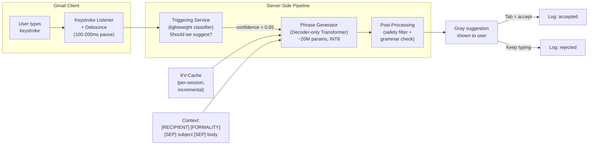

# Gmail Smart Compose GenAI System Design

## Understanding the Problem

Smart Compose is Gmail's real-time autocomplete system — the gray text that appears as you type an email, suggesting how your sentence might end. You press Tab to accept or keep typing to ignore it. The system serves 1.5 billion Gmail users and must generate suggestions in under 100ms, which is faster than a blink. This latency constraint dominates every architectural decision: it rules out large language models, forces aggressive quantization, and makes the KV-cache the single most important inference optimization. The privacy constraint is equally hard — emails are deeply personal, and training on raw email content creates memorization risks that can leak one user's private information into another user's suggestions.

What makes Smart Compose interesting as a GenAI design problem is the tension triangle: you want high suggestion quality (big model), low latency (tiny model), and per-user personalization (either on-device compute or server-side user data). You cannot fully satisfy all three. Every design decision is about where to compromise.

## Problem Framing

### Clarify the Problem

**Q: What is the latency budget for showing a suggestion?**
**A:** Under 100ms end-to-end, from the user's last keystroke to the gray text appearing. With ~50ms for network round-trip in the worst case, that leaves roughly 50ms for actual model inference. This constraint alone rules out any model larger than ~20-30M parameters on server-side.

**Q: What does a "suggestion" look like — a single word, a phrase, or a full sentence?**
**A:** A short phrase, typically 3-8 tokens. Not a single word (too little value to justify the visual distraction) and not a full paragraph (too likely to be wrong). The sweet spot is completing the current clause or sentence fragment.

**Q: How do we decide WHEN to show a suggestion? Do we generate on every keystroke?**
**A:** No — generating on every keystroke at 1.5B users would be prohibitively expensive and mostly annoying. A separate triggering service decides when to fire a generation request. It considers: cursor position (end of a content word, not mid-word), typing speed (pausing suggests the user might welcome help), model confidence from the last pass, and whether the user is at a natural completion point (after a comma, period, or phrase boundary).

**Q: What level of personalization do we need?**
**A:** Three tiers. First, context-aware: the model conditions on recipient type, subject line, and email thread history — "Dear Professor" vs. "Hey dude" is driven by who you are writing to, not your personal style. Second, style-aware: the model adapts to your formality level, common sign-offs, and phrase preferences. Third, content-aware: the model predicts domain-specific terms you use often. Tiers 2 and 3 require privacy-safe personalization mechanisms since raw email content cannot be sent to a central server.

**Q: What are the privacy constraints?**
**A:** Raw email text cannot be stored or used for centralized training without strong anonymization. Privacy-preserving techniques include PII scrubbing (removing names, addresses, phone numbers), differential privacy during training (DP-SGD with a formal privacy guarantee), and federated learning for personalization (gradient updates computed on-device, not raw emails sent to server).

**Q: How many languages do we need to support?**
**A:** Initially the top 5-10 languages by Gmail usage (English, Spanish, Portuguese, French, German, Japanese, etc.). Non-Latin scripts like Japanese and Arabic require different tokenization strategies and may need separate models. Google's production system supports 13+ languages.

**Q: How do we measure success?**
**A:** The ultimate business metric is keystroke savings rate (KSR) — the fraction of characters that came from accepted suggestions rather than manual typing. Acceptance rate (fraction of shown suggestions the user presses Tab on) is the primary online proxy, but it conflates model quality with triggering policy quality. Google reported ~11% acceptance rate in early deployment.

### Establish a Business Objective

#### Bad Solution: Minimize perplexity on held-out email data

Perplexity measures how well the language model fits the email distribution — lower perplexity means the model is less "surprised" by the test data. This seems natural for a language model but fails as a business metric because perplexity optimizes for average token-level prediction accuracy, not phrase-level suggestion quality. A model with excellent perplexity might achieve it by being good at predicting common words ("the", "is", "and") while being mediocre at the interesting predictions — the actual phrase completions that save keystrokes. Low perplexity also does not guarantee that the model produces suggestions users want to accept.

#### Good Solution: Maximize acceptance rate of shown suggestions

Acceptance rate directly measures user satisfaction with the suggestions — did they press Tab? This is closer to the real goal because it captures the user's judgment of suggestion quality. It is measurable in production, easy to A/B test, and directly reflects user experience.

The limitation: acceptance rate conflates model quality with triggering policy. If you make the triggering more conservative (only show when extremely confident), acceptance rate goes up but keystroke savings go down — you are just showing fewer, safer suggestions. Acceptance rate also suffers from selection bias: you only measure quality on the cases where you chose to show a suggestion, which are precisely the easy cases.

#### Great Solution: Maximize keystroke savings rate with per-user utility and long-term engagement guardrails

KSR = (keystrokes saved via accepted suggestions) / (total keystrokes in baseline). This is the true business value metric — how much typing effort did Smart Compose actually save? Complement KSR with: (1) per-user utility distribution (ensuring the feature helps the median user, not just power users who accept everything), (2) negative interaction rate (how often suggestions cause confusion or typing errors), and (3) long-term engagement guardrails (email composition time, feature retention over 30 days).

Measuring KSR properly requires a holdout group with suggestions disabled entirely — a counterfactual baseline that tells you the absolute value of the feature, not just relative model-vs-model comparisons. This holdout should be small (0.1% of users) but permanent.

### Decide on an ML Objective

The core ML task is **causal language modeling** — next-token prediction. Given tokens t_1 through t_n (the email context typed so far), predict t_{n+1}. The training loss is cross-entropy over the vocabulary:

```
L = -1/T * sum_{t=1}^{T} log p(w_t | w_1, ..., w_{t-1})
```

At inference time, the model generates a multi-token phrase using beam search, not just a single next token. The quality metric that matters most is not token-level accuracy but **phrase-level exact match** — does the model's top beam exactly match what the user would have typed?

There is a subtle gap between the training objective (token-level cross-entropy on complete emails) and the deployment objective (phrase-level completion of email prefixes). The model is trained on all positions equally but deployed only at prefix positions where the triggering service fires. Task-specific fine-tuning on email prefix-completion pairs can close this gap.

## High Level Design



The system has four components. The **keystroke listener** on the client batches keystrokes and debounces — it waits for a brief pause before sending a request, preventing the server from being flooded by fast typists. The **triggering service** is a separate lightweight classifier (logistic regression or small MLP) that decides whether to fire a generation request based on cursor position, typing cadence, model confidence history, and whether the user is at a natural completion point. The **phrase generator** is the core Transformer model with KV-cache for incremental inference and beam search for multi-token generation. The **post-processing service** runs a safety classifier and grammar filter on each beam candidate before returning the suggestion to the client.

The triggering service is deliberately separate from the phrase generator. This decoupling lets you A/B test the triggering policy independently from the model quality, and it lets you route the triggering decision to cheap stateless machines while keeping the stateful (KV-cached) phrase generator on GPU-equipped servers.

## Data and Features

### Training Data

Smart Compose uses a two-stage training pipeline with very different data at each stage.

**Stage 1 — Pretraining on public text:**
- Data: Large-scale public corpora — Common Crawl, BooksCorpus, Wikipedia, web text
- Volume: Hundreds of billions of tokens
- Purpose: Learn general English grammar, vocabulary, and composition patterns
- No privacy concerns since this is public data

**Stage 2 — Fine-tuning on email data:**
- Data: Anonymized email corpus with PII scrubbed (names, addresses, phone numbers removed via NER + regex)
- Format: Prefix-completion pairs mined from complete sent emails — every email prefix is a training input, the next K tokens are the label
- Volume: Tens of millions of examples (fine-tuning requires less data given the strong pretrained prior)
- Privacy protections: PII scrubbing as a floor, DP-SGD (differentially private training) with privacy budget epsilon ~1-8, k-anonymity checks to prevent individual writing style recognition
- Freshness: Language evolves, so continuous fine-tuning on recent email data is necessary

**Tokenization:**
- BPE (Byte-Pair Encoding) with ~30K vocabulary, trained on both pretraining and email data combined
- Email-specific tokens: "re:", "fwd:", common greetings and sign-offs get unified tokens
- Special tokens: `[BOS]`, `[EOS]`, `[SEP]` to separate subject, thread history, and current body
- Conditioning tokens: `[RECIPIENT_EXTERNAL]`, `[FORMALITY_PROFESSIONAL]`, `[TIME_MORNING]` encode context without revealing PII

### Features

The model's "features" are the input context tokens. Feature engineering happens through how the context is constructed and what conditioning signals are included.

**Email Context Features:**
- Subject line (strong predictor of email register and topic)
- Thread history (previous emails in the conversation, truncated from the left to preserve recent context)
- Current body text (everything typed so far)
- Cursor position relative to paragraph structure

**Conditioning Signal Features (privacy-safe metadata):**
- Recipient type: internal vs. external, individual vs. group
- Formality level: inferred from first few tokens or recipient relationship
- Time of day: morning emails tend to be formal, late-night emails informal
- Email length bucket: short reply vs. long composition
- Thread depth: first email vs. 5th reply in a chain

**Personalization Features (for advanced tiers):**
- User style cluster: cluster users by writing patterns (verbose vs. terse, formal vs. casual) without storing individual emails
- Recent accepted suggestions: prepend as few-shot examples at inference time
- User-specific LoRA adapter weights (trained via federated learning on-device)

## Modeling

### Benchmark Models

**N-gram language model:** Count-based approach using the last 2-3 words to predict the next word. Fast and simple but cannot capture long-range dependencies. "Thanks for the" might predict "help" but cannot condition on the subject line or recipient. Useful as a baseline to prove the Transformer adds value.

**LSTM language model:** Processes the email token by token, maintaining a hidden state. Better than n-grams at capturing context but processes sequentially (slow for long contexts) and struggles with dependencies beyond ~100 tokens. Cannot leverage KV-cache for incremental inference as efficiently as Transformers.

### Model Selection

#### Bad Solution: N-gram language model

Count-based approach using the last 2-3 words to predict the next word. Extremely fast (microseconds), no GPU needed, interpretable. But it cannot capture context beyond 3 words — "Thanks for the" might predict "help" but cannot condition on the subject line being about "budget review" or the recipient being a professor. At a 30K vocabulary, the number of possible trigrams (27 trillion) exceeds what any count-based model can store, so predictions are limited to common phrases. Useful as a baseline to prove the Transformer adds value.

#### Good Solution: LSTM language model

Processes the email token by token, maintaining a hidden state that captures context from the entire email prefix. Better than n-grams at long-range dependencies, moderate model size. But LSTMs process sequentially — each token must wait for the previous token's hidden state, making inference slow for long contexts. They also struggle with dependencies beyond ~100 tokens (vanishing gradient), and they can't leverage KV-cache for truly O(1) incremental inference the way Transformers can.

#### Great Solution: Decoder-only Transformer with KV-cache

The decoder-only (causal) architecture generates text left-to-right with causal attention mask. The decisive advantage: KV-cache enables O(1) incremental inference per new keystroke — only the new token's Q/K/V are computed, using cached K/V from all previous tokens. This is the only architecture that meets the 50ms per-keystroke inference budget while maintaining full-context quality. Parallel training on TPU/GPU makes pretraining fast. Distillation from a larger teacher (~100M params) recovers quality lost from the small 20M-param constraint.

| Approach | Pros | Cons | When to use |
|----------|------|------|-------------|
| N-gram LM | Extremely fast, no GPU needed, interpretable | No long-range context, poor quality | Baseline only |
| LSTM LM | Captures sequential patterns, moderate size | Sequential processing, no parallelism during training, weak on long dependencies | Legacy systems, very constrained devices |
| Decoder-only Transformer | Parallel training, KV-cache for O(1) incremental inference, captures full context | O(n^2) attention in full pass (mitigated by KV-cache at inference) | **Best fit for Smart Compose** |
| Encoder-decoder Transformer | Good for seq2seq tasks | Encoder is wasted since input and output are the same sequence; double the compute | Translation, not completion |

### Model Architecture

**Architecture:** Decoder-only (causal) Transformer — the same family as GPT, but radically smaller.

**Why decoder-only?** Smart Compose generates text left-to-right, token by token. Each token must be conditioned on all previous tokens but must not see future tokens (they have not been typed yet). The decoder-only architecture enforces this via a causal attention mask. An encoder-decoder would add an unnecessary encoder pass — the "source" and "target" are the same sequence at different positions, making the split artificial and wasteful. Critically, decoder-only with KV-cache supports O(1) incremental inference per new keystroke, which is the decisive advantage for keystroke-level latency.

**Model configuration:**
- 6 Transformer layers
- 256 hidden dimension (d_model)
- 4 attention heads (d_head = 64)
- Feed-forward dimension: 4 * 256 = 1024
- Vocabulary: ~30K BPE tokens
- Total parameters: ~20M
- Quantization: INT8 (4x size reduction, 2-3x speedup, <1% perplexity increase)

**Why so small?** The 100ms latency budget with ~50ms for inference means the model must be tiny by modern standards. A 20M-parameter model at INT8 runs in ~5ms on a modern accelerator, leaving headroom for beam search and post-processing. A 1B-parameter model would take ~30ms even with aggressive optimization — too close to the budget with no margin.

**Loss function:** Standard cross-entropy loss for next-token prediction:

```
L = -1/T * sum_{t=1}^{T} log p_theta(w_t | w_1, ..., w_{t-1})
```

With optional task-specific fine-tuning on prefix-completion pairs: given the first K tokens of an email, minimize the cross-entropy of predicting the next M tokens. This aligns training more closely with the deployment distribution.

**Training strategy:**
1. Pretrain on public text (general language model)
2. Fine-tune on anonymized email data (domain adaptation)
3. Distill from a larger teacher model (~100M params) to recover quality lost from the small architecture
4. Quantize to INT8 post-training (or use quantization-aware training if PTQ causes significant degradation)

## Inference and Evaluation

### Inference

The inference path is optimized for keystroke-level latency using the KV-cache and incremental decoding.

**Step-by-step inference flow:**

1. **Context construction:** When the compose window opens, the full context is assembled: `[RECIPIENT_EXTERNAL] [FORMALITY_PROFESSIONAL] [TIME_MORNING] [SEP] Re: Q3 budget review [SEP] Thanks for the`. This tokenizes to ~30-50 tokens.

2. **Initial forward pass:** The Transformer processes all context tokens in one pass, computing key-value pairs for each layer and head. These K/V tensors are cached (shape: `[layers x heads x seq_len x head_dim]`).

3. **Incremental inference per keystroke:** When the user types a new character, only the new token's Q/K/V are computed. Attention uses the cached K/V for all previous tokens plus the new K/V:
   ```
   Cached: K_{1..n}, V_{1..n}
   New token n+1: compute q_{n+1}, k_{n+1}, v_{n+1}
   Attention = softmax(q_{n+1} · [K_cache; k_{n+1}]^T / sqrt(d_k)) · [V_cache; v_{n+1}]
   ```
   This reduces per-keystroke attention from O(n^2) to O(n), and the overall forward pass from O(n·d) to O(d).

4. **Beam search:** When the triggering service fires, beam search generates a multi-token phrase. Beam width 4-8, max 8 tokens, with length normalization:
   ```
   score(y_1...y_t) = sum_{i=1}^{t} log p(y_i | y_{<i}, x) / t^alpha,  alpha ~ 0.7
   ```
   This prevents shorter suggestions from being unfairly favored.

5. **Post-processing:** The top beam candidate is checked by a fast safety classifier (DistilBERT-size) for toxic content, PII leakage, and grammatical coherence.

6. **Cache invalidation on deletion:** If the user deletes characters, cache entries after the deletion point are invalidated. Entries before the deletion point remain valid. The next forward pass recomputes only from the deletion point onward.

**Latency budget:**
| Component | Time |
|-----------|------|
| Debounce + network | ~30ms |
| Triggering service | ~2ms |
| Incremental forward pass | ~2-5ms |
| Beam search (4 beams, 8 steps) | ~10ms |
| Post-processing | ~3ms |
| UI rendering | ~5ms |
| **Total** | **~50-55ms** |

### Evaluation

**Offline Metrics:**

| Metric | What it measures | When to use |
|--------|-----------------|-------------|
| Perplexity | How well the model fits the email distribution; `PP = exp(-1/N * sum log p(w_t))` | Canary metric — if perplexity spikes, something broke in training or data pipeline |
| ExactMatch@N | Does the model's top-N beam match the actual continuation exactly? | Task-specific quality; most predictive of acceptance rate |
| Top-k recall | Does the correct continuation appear in any of the top-k beams? | Measures beam search coverage |

**Online Metrics:**

| Metric | What it measures | Target |
|--------|-----------------|--------|
| Acceptance rate | % of shown suggestions accepted via Tab | >10% |
| Keystroke savings rate (KSR) | Characters saved / total characters typed | >5% |
| Suggestion coverage | % of typing sessions with at least one suggestion shown | Balance with quality |
| Negative interaction rate | Suggestions that cause typing errors or explicit dismissal | <2% |
| p99 latency | End-to-end suggestion display time | <100ms |

**A/B Testing Approach:**

- **Model comparison:** Split users randomly into control (model A) and treatment (model B). Fix the triggering policy during the test — only vary the generation model. Measure acceptance rate and KSR.
- **Absolute value measurement:** Maintain a small permanent holdout (0.1% of users, ~1.5M users) with suggestions disabled entirely. Compare KSR and email composition time between treatment and holdout to measure the counterfactual value of Smart Compose.
- **Duration:** Run for at least 2 weeks to account for novelty effects (users interact more with new suggestions initially).
- **Segmentation:** Report metrics by email length, language, device type, and user tenure to understand where each model version wins and loses.

## Deep Dives

### 💡 The Triggering-Suggestion Decoupling Problem

The triggering service and the phrase generator are separate components, but their metrics are deeply entangled. Acceptance rate measures the quality of suggestions *conditional on a suggestion being shown*. If you make the triggering more conservative (higher confidence threshold), acceptance rate goes up because you only show easy, high-confidence suggestions — but keystroke savings go down because you are showing fewer suggestions overall.

This creates a measurement trap: you can inflate acceptance rate by raising the trigger threshold, which looks like model improvement but actually reduces user value. The fix is to always report acceptance rate alongside suggestion coverage (what fraction of typing sessions received at least one suggestion) and KSR (the real bottom-line metric). When A/B testing model changes, fix the triggering policy and only vary the model. When A/B testing triggering changes, fix the model and only vary the threshold. Never change both simultaneously.

### ⚠️ Training Data Memorization and Privacy Leakage

The most dangerous failure mode in Smart Compose is memorization — the model reproducing training data verbatim. If the model has seen enough emails containing a specific phone number, address, or financial figure, it may suggest those details to a completely different user. This is not a hypothetical risk; language models demonstrably memorize rare sequences from training data.

Mitigation requires defense in depth. PII scrubbing (NER + regex) removes identifiable information before training but is imperfect — scrubbers miss unusual formats and indirect identifiers. DP-SGD provides a formal mathematical bound on memorization: by clipping per-example gradients and adding calibrated Gaussian noise, it ensures that no single training example can have a disproportionate influence on model weights. The privacy budget epsilon controls the strength of the guarantee — lower epsilon means stronger privacy but more noise (lower model quality). The tradeoff is that DP-SGD requires very large batch sizes to maintain utility, which increases infrastructure cost. Finally, a post-generation filter checks each suggestion for named entities, phone numbers, email addresses, or dollar amounts that are not present in the current email's context — any match triggers suppression.

### 📊 KV-Cache Memory Management at Scale

The KV-cache stores key and value tensors for all processed tokens, enabling O(1) incremental inference per new keystroke. For the Smart Compose model (6 layers, 4 heads, d_head=64), the cache size per token is: 2 (K and V) x 6 (layers) x 4 (heads) x 64 (dim) x 2 (bytes for FP16) = 6,144 bytes per token. For a 200-token context and 1,000 concurrent users per GPU, that is ~1.2GB just for KV-cache.

At 1.5B total users with even 1% concurrently composing emails (15M users), you need 15,000 GPUs just for cache memory. Cache lifecycle management becomes a first-class engineering problem: LRU eviction for inactive sessions, immediate invalidation on model updates (different model weights produce different K/V representations — version the cache with the model checkpoint hash), and shared prefix caching for common email openings ("Dear [Name], I hope this email finds you well" is surprisingly common and can share cache blocks across users). PagedAttention (from vLLM) chunks the cache into fixed-size pages, enabling efficient allocation and reducing memory fragmentation from irregular context lengths.

### 🏭 Federated Learning for Personalization

The deepest personalization — adapting to a user's specific writing style — requires training on their actual email data. But sending raw emails to a central server violates the privacy constraint. Federated learning resolves this: each device computes gradient updates on local email data and sends only the gradients (not the emails) to the server, which aggregates them using Federated Averaging.

The challenge is that FL at 1.5B-device scale has real engineering constraints. Communication overhead: each round requires downloading the current model and uploading gradients, which consumes battery and bandwidth. Convergence: FL converges slower than centralized training because user data is non-IID (each user writes differently) and participation is irregular (devices must be charging, on Wi-Fi, and idle). The practical resolution is a LoRA-per-user approach: instead of fine-tuning the full model, each device trains a small low-rank adapter (ΔW = AB, rank 4-8, ~100K parameters). The adapter stays on-device. At inference time, it is added to the global base model weights. The server aggregates adapter updates across users to improve the global base but does not distribute user-specific adapters. This gives genuine style personalization while keeping all personal data on-device.

### 💡 Speculative Decoding for Latency Optimization

Even with a 20M-parameter model, generating 8 beam candidates autoregressively takes 8 sequential forward passes per beam. Speculative decoding can reduce this: a tiny draft model (1-2M parameters) proposes k tokens (typically 4-8) autoregressively, then the larger target model scores all k tokens in a single batched forward pass. Rejection sampling ensures the output distribution is mathematically identical to the target model — no quality loss, just speed.

For Smart Compose, the applicability depends on the deployment regime. On-device inference (where compute is scarce) benefits most — a 1M draft model runs in microseconds, and verifying 4-5 tokens in one target model pass roughly halves total latency. Server-side with dedicated accelerators, where the bottleneck is often memory bandwidth rather than FLOPs, benefits less because the batch of k tokens is still small. There is also a complication with beam search: speculative decoding is designed for single-sequence sampling, not beam search. Applying it to beam search requires running the draft model for each beam independently, multiplying draft model cost by beam width, which may negate the benefit.

### ⚠️ Correlated Prediction Errors and Trust Degradation

Random errors are tolerable — users understand that a suggestion might be wrong. But systematic errors destroy trust. If the model always suggests "Best regards" as a closing, millions of users see the same wrong suggestion every day, and the feature develops a reputation for being unhelpful. Similarly, if the model exhibits demographic bias (suggesting different language patterns based on inferred gender or ethnicity of the recipient), the reputational damage is severe.

Mitigation requires monitoring error patterns, not just error rates. Track the entropy of rejected suggestions: if certain phrases are repeatedly suggested and rejected across many users, flag them for investigation. Implement diversity constraints in the triggering service: if the same suggestion has been rejected N times by different users in a time window, temporarily suppress it and surface alternative beams. For bias detection, run offline audits where you vary recipient names (controlling for demographics) and check whether suggestion distributions change in problematic ways.

### 🏭 Multi-Turn Context Management for Long Email Threads

When replying to a 20-message email thread, the relevant context can span thousands of tokens — far exceeding the model's 512-1024 token context window. Naive truncation (keeping only the most recent messages) loses the original discussion topic and early decisions. Right-truncation (keeping only the oldest messages) loses the most recent context, which is usually the most relevant.

**Context construction strategy:** Use a hierarchical approach. For the most recent 2-3 messages, include full text. For older messages, include only the first sentence (topic summary) and any text the user explicitly quoted in their reply chain. Prepend the subject line (which persists across the entire thread). This captures both the current discussion context and the original topic within a fixed 512-token budget.

**Attention pattern optimization:** In long-threaded emails, the model's attention should focus heavily on (1) the most recent message being replied to, (2) the subject line, and (3) any text the user has already typed. During fine-tuning, weight the loss on reply-position tokens higher than on forwarded-context tokens to teach the model that its completion should respond to the latest message, not just continue the thread.

### 💡 Streaming UX and Progressive Rendering

Smart Compose shows a single gray suggestion that appears all at once. But for longer suggestions (5-8 tokens), the beam search may take 10-15ms — during which the user sees nothing. If the user types during this gap, the suggestion arrives stale and must be discarded.

#### Bad Solution: Wait for full beam search completion before rendering

Generate all 8 tokens, score beams, pick the best, then render. The user sees a 15ms gap with no feedback. If they type during this gap, the suggestion is invalidated and wasted.

#### Good Solution: Speculative rendering — show first token immediately, complete in background

Show the first token of the top beam as soon as it's generated (~2ms), then progressively extend the suggestion as beam search completes. If the user pauses, the full suggestion appears seamlessly. If they keep typing, cancel the remaining generation.

#### Great Solution: Adaptive suggestion length based on typing cadence

Monitor the user's typing speed in real-time. For fast typists (>60 WPM), generate shorter suggestions (2-3 tokens) that can complete within the inter-keystroke interval. For users who pause mid-sentence, generate longer suggestions (5-8 tokens) using the full beam budget. This matches suggestion length to user receptivity — a fast typist won't wait for a long suggestion, while a paused user appreciates more help.

### ⚠️ Model Versioning and Regression Detection for Suggestions

Deploying a new model version is risky for Smart Compose because regression is subtle. A new model might have lower perplexity (better on average) but worse ExactMatch on email sign-offs — causing millions of users to see wrong closing suggestions where the old model was correct. Aggregate metrics look fine, but user trust degrades.

**Canary deployment:** Roll out the new model to 1% of users for 48 hours. Compare segment-level metrics (acceptance rate by email category, by language, by user tenure) between canary and control. If any segment degrades by more than 2% in acceptance rate, halt the rollout.

**Automatic rollback trigger:** Monitor three signals in real-time: (1) aggregate acceptance rate, (2) negative interaction rate (suggestions causing typing errors or explicit dismissal), (3) per-phrase rejection concentration (one specific suggestion being rejected at an anomalous rate). If any signal crosses its threshold, automatically revert to the previous model version within 10 minutes.

**Shadow scoring:** Before deploying a new model, run it in shadow mode — score every triggering event with both old and new models, log both suggestions, but only show the old model's suggestion. Compare the two offline: for what fraction of cases does the new model produce a better suggestion? A worse one? For the "worse" cases, analyze the pattern (specific languages, specific email types) to understand the regression before it reaches users.

### 📊 Cost Management at Scale

At 1.5B Gmail users with even 1% concurrently composing emails, the inference infrastructure is massive. Every optimization dollar matters because the marginal cost per suggestion is multiplied by billions.

**Token budget per user:** Not every compose session needs the same model quality. For short replies ("Thanks!" or "See you then."), an n-gram model or simple template matching suffices. Reserve GPU inference for longer compositions where the user is more likely to accept multi-token suggestions. This tiered approach can reduce GPU inference calls by 40-60% with minimal impact on overall KSR.

**Batch-level optimization:** Group concurrent inference requests from multiple users into batched forward passes. A batch of 64 context tensors on a single GPU is far more efficient than 64 individual requests. The challenge is that contexts have different lengths — use dynamic batching with left-padding and attention masks, or group requests by similar context length.

**Model distillation economics:** The production 20M-param model is itself distilled from a 100M-param teacher. The teacher trains for weeks on expensive hardware but is never deployed. The student trains for days using the teacher's soft labels. Each improvement to the teacher (better data, longer training, architectural upgrades) automatically flows to the student through re-distillation. This amortizes research investment across the entire production fleet.

## What is Expected at Each Level?

### Mid-Level Engineer

A mid-level candidate correctly frames Smart Compose as a next-token prediction problem using a decoder-only Transformer. They know that the model must be small (~20M parameters) because of the 100ms latency constraint, and they can describe the three-component architecture (triggering service, phrase generator, post-processing). They explain beam search as the generation strategy and know that perplexity and acceptance rate are the key metrics. They mention privacy as a concern but may not go deep on specific techniques beyond "anonymize the data." They can draw a reasonable system diagram but may not address the KV-cache, cache invalidation, or the triggering-suggestion coupling.

### Senior Engineer

A senior candidate proactively identifies the latency-privacy-personalization triangle and explains why these constraints interact (deep personalization requires either user data on the server or large on-device models, both of which violate other constraints). They explain the KV-cache in detail — shape, incremental inference, and what happens when the user deletes text. They distinguish offline metrics (perplexity, ExactMatch) from online metrics (acceptance rate, KSR) and explain why acceptance rate alone is insufficient (triggering coupling, selection bias). They propose federated learning for personalization with awareness of its tradeoffs (slower convergence, communication overhead). They design the A/B test with a holdout group for counterfactual measurement.

### Staff Engineer

A Staff candidate reasons from constraints to architecture — the latency budget determines model size, model size determines architecture choices, privacy requirements determine the training pipeline, and the deployment regime (server vs. edge) determines the cache management strategy. They discuss KV-cache memory layout at scale (PagedAttention, shared prefix caching, cache versioning on model updates), speculative decoding with awareness of when it does and does not help, MQA/GQA for reducing cache memory, and LoRA-per-user via federated learning as the personalization architecture. They identify that the hardest problem is not model quality but measurement — acceptance rate suffers from Goodhart's Law, triggering-suggestion coupling, and selection bias, and they propose keystroke savings with a permanent holdout as the true metric. They recognize that correlated prediction errors (not random errors) are the real trust risk and propose systematic monitoring beyond aggregate metrics.

## References

- [Gmail Smart Compose: Real-Time Assisted Writing (Chen et al., 2019)](https://arxiv.org/abs/1906.00080)
- [Attention Is All You Need (Vaswani et al., 2017)](https://arxiv.org/abs/1706.03762)
- [Efficient Transformers: A Survey (Tay et al., 2020)](https://arxiv.org/abs/2009.06732)
- [Fast Inference from Transformers via Speculative Decoding (Leviathan et al., 2023)](https://arxiv.org/abs/2211.17192)
- [PagedAttention / vLLM (Kwon et al., 2023)](https://arxiv.org/abs/2309.06180)
- [Communication-Efficient Learning of Deep Networks from Decentralized Data (McMahan et al., 2017)](https://arxiv.org/abs/1602.05629) — Federated Averaging
