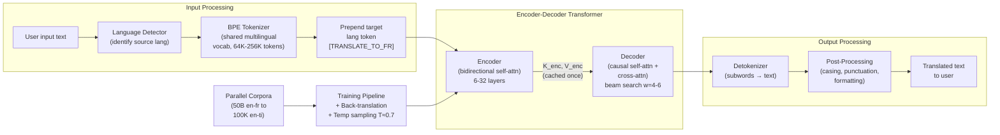

# Google Translate GenAI System Design

## Understanding the Problem

Google Translate converts text between 133+ languages, handling everything from single words to full documents. It translates roughly 150 billion characters per day. The ML challenge is that translation is not word substitution — sentence structure changes across languages ("I love you" becomes "私はあなたを愛しています" in Japanese, literally "I you love"), words are ambiguous ("bank" could be a river bank or a financial institution), and idioms do not translate literally ("it's raining cats and dogs" means nothing word-by-word).

What makes this a fascinating system design problem is the scale of language coverage. Supporting 100+ languages means 100 x 99 = 9,900 directed language pairs. Training one model per pair is infeasible. You must choose between a pivot strategy (translate everything through English, adding latency and quality loss) or a massively multilingual model (one model handles all pairs, with capacity and interference challenges). The data availability varies by orders of magnitude — English-French has billions of sentence pairs; English-Tibetan has fewer than 100K. And the quality expectations are domain-dependent: casual web text can tolerate imperfect translations; medical documents cannot.

## Problem Framing

### Clarify the Problem

**Q: How many languages do we need to support, and do we need all-to-all translation?**
**A:** 100+ languages, all-to-all. That is 9,900+ directed language pairs. Building one model per pair is infeasible from both training cost and serving infrastructure perspectives. We will build a massively multilingual Transformer (MMT) that handles all pairs in a single model, using a target language token to specify the output language.

**Q: What is the latency requirement?**
**A:** Two modes. Interactive web/mobile translation (user types or pastes text and expects near-instant results) requires <200ms for short sentences. Document translation (uploading a PDF or web page) can take seconds per page. These are different serving profiles — the interactive mode needs aggressive batching and caching, while the document mode needs chunking and stitching.

**Q: How much parallel training data is available per language pair?**
**A:** It varies by 4-5 orders of magnitude. English-French has ~50 billion sentence pairs from web crawls, news corpora, and book translations. English-Swahili has ~5 million. English-Tibetan may have fewer than 100K. Low-resource languages require transfer learning from high-resource pairs and data augmentation via back-translation.

**Q: Do we need domain-specific quality (medical, legal, technical)?**
**A:** General-domain is the baseline. Enterprise customers (hospitals, law firms) need domain-specific accuracy — "patient presents with acute MI" must be translated with medical precision, not casual paraphrasing. Domain adaptation is a separate concern layered on top of the general model.

**Q: Is this sentence-level or document-level translation?**
**A:** Sentence-level is the primary mode. But document-level context matters — pronouns in sentence 5 may refer to entities introduced in sentence 1. We need at least cross-sentence coreference awareness for document translation to feel coherent.

**Q: How do we handle languages we have never seen in training?**
**A:** Zero-shot transfer through the multilingual model. If the model has seen Language A paired with English and Language B paired with English, it can often translate A→B directly even without any A-B parallel data. Quality is lower than supervised pairs but often usable.

### Establish a Business Objective

#### Bad Solution: Maximize BLEU score on benchmark test sets

BLEU measures n-gram precision between the machine translation and a reference translation. It is the standard automated metric, but optimizing for BLEU has well-documented failure modes. BLEU gives no credit for paraphrases ("big house" vs. "large home" score zero overlap with "large house"). It ignores fluency independently of adequacy — a fluent but inaccurate translation can score higher than an accurate but slightly ungrammatical one. And BLEU is reference-biased: it rewards translations that mirror the reference's word choices, penalizing equally valid alternatives.

#### Good Solution: Maximize COMET score with human evaluation calibration

COMET is a neural metric trained on human Direct Assessment scores — it correlates at r~0.9 with human judgments versus r~0.6 for BLEU. Using COMET as the primary offline metric gives a much better proxy for actual translation quality. Complement with periodic human evaluation (bilingual raters scoring translations on a 0-100 scale) to calibrate and detect cases where COMET disagrees with human judgment.

The limitation: COMET is a black-box neural model, making it harder to debug when it gives unexpected scores. And human evaluation is expensive and slow — you cannot run it on every model checkpoint.

#### Great Solution: Layered quality measurement across automated metrics, human evaluation, and user behavior

Use COMET as the primary offline metric for rapid iteration. Run human Direct Assessment studies monthly on a stratified sample across languages and domains. Track online user signals: post-edit distance (how much do users modify the translation?), copy rate (do users copy the translation for use?), and cross-session retention (do users return to Translate?). The post-edit distance is particularly valuable — it measures how much human effort the translation saves, which is the real business value.

For low-resource languages, where automated metrics are less reliable, weight human evaluation more heavily. For enterprise customers, track terminology accuracy separately — a medical translation that uses the wrong term for a disease is a critical failure even if COMET scores it highly.

### Decide on an ML Objective

Machine translation is **conditional sequence-to-sequence generation**. Given a source sentence x = (x_1, ..., x_m) in language L_src, produce a target sentence y = (y_1, ..., y_n) in language L_tgt that preserves meaning. The model estimates:

```
p(y | x) = product_{t=1}^{n} p(y_t | y_1, ..., y_{t-1}, x)
```

The training objective is cross-entropy (negative log-likelihood) over a corpus of parallel sentence pairs:

```
L = -sum_{(x,y)} sum_{t=1}^{|y|} log p_theta(y_t | y_{<t}, x)
```

For the multilingual model, each input is prepended with a target language token: `[TRANSLATE_TO_FR] The cat sat on the mat` → the model generates French output. This single framing handles all 9,900+ language pairs.

## High Level Design



The system has a clear pipeline. **Language detection** identifies the source language (or uses the user's specification). The **BPE tokenizer** converts text into subword tokens using a shared multilingual vocabulary. The **encoder** processes the full source sentence with bidirectional self-attention — every source token sees every other source token, building rich contextual representations. The **decoder** generates the target sentence one token at a time, using causal self-attention over its own previous outputs and cross-attention over the encoder's representations. **Beam search** (width 4-6) with length normalization explores multiple candidate translations and selects the highest-scoring one. Finally, **post-processing** handles detokenization, casing, punctuation, and formatting.

The encoder-decoder split is deliberate. The encoder sees the full source sentence bidirectionally — critical because word order changes across languages. The decoder generates autoregressively. Cross-attention is the bridge: at each generation step, the decoder queries the encoder's representations to decide which source words to focus on.

## Data and Features

### Training Data

**Parallel corpora (primary):**
- CommonCrawl aligned: parallel sentences extracted from multilingual web crawls using language ID + sentence alignment
- WMT benchmarks: curated high-quality parallel data (news domain) for high-resource pairs
- WikiMatrix: cross-language Wikipedia article alignments
- Book translations: high-quality literary parallel data

Data volume varies enormously: ~50B sentence pairs for English-French, ~5M for English-Swahili, <100K for English-Tibetan. This 5-order-of-magnitude imbalance is the fundamental challenge.

**Back-translation for low-resource languages:**
1. Train an English→L model on available parallel data
2. Use this model to translate large monolingual English corpora into synthetic L
3. Use (synthetic_L, real_English) pairs as additional training data

The key insight: monolingual data is far more abundant than parallel data for any language. Back-translation converts monolingual data into usable training signal. Filter by back-translation model confidence (beam search score above threshold) to avoid adding noisy examples.

**Temperature-based sampling for language balancing:**
During training, the probability of sampling from language L is:
```
P_T(L) proportional to (n_L / sum_k n_k)^T
```
At T=1, sampling is proportional to corpus size (high-resource languages dominate). At T→0, all languages are equally sampled. Google uses T≈0.7 — moderately upsampling low-resource languages without completely ignoring the quality signal from large corpora.

### Features

For MT, the "features" are primarily the input token sequence. Feature engineering happens through tokenization choices and input construction.

**Multilingual tokenization (SentencePiece/BPE):**
- Shared vocabulary of 64K-256K subword tokens across all 100+ languages
- Vocabulary allocation must balance across scripts — a vocabulary trained primarily on English represents CJK characters poorly (each character becomes a separate token, inflating sequence length)
- Built from a sampled mix of all languages with upsampling of low-resource languages to ensure representation

**Input construction:**
- Target language token prepended: `[TRANSLATE_TO_FR] source tokens`
- For document-level translation: sentence-level context from previous sentences can be prepended as conditioning
- Special tokens for domain adaptation: `[DOMAIN_MEDICAL]` or `[DOMAIN_LEGAL]` when enterprise customers specify domain

**Positional encodings:**
- Sinusoidal or learned positional encodings for sequence position
- Source and target sequences use independent positional encodings (source positions do not interfere with target positions)

## Modeling

### Benchmark Models

**Statistical MT (phrase-based):** Pre-neural approach that aligns phrases between languages using co-occurrence statistics and translates phrase-by-phrase with a language model for fluency. Still competitive for high-resource pairs with abundant aligned data, but cannot handle long-range dependencies or reordering well. Useful as a quality floor.

**Decoder-only Transformer (GPT-style):** Concatenate source and target as a single sequence: `source [SEP] target`. Generate the target autoregressively. This works — large decoder-only models like GPT-4 translate reasonably well — but is architecturally inefficient for MT. The model must re-read the entire source at every generation step via causal attention, rather than encoding it once. And the model cannot see the full source bidirectionally; it only sees source tokens through the causal mask.

### Model Selection

#### Bad Solution: RNN Encoder-Decoder (Seq2Seq with Attention)

The classic Bahdanau/Luong architecture uses bidirectional LSTM encoders and attention-based decoding. For a production system like Google Translate, this fails for three reasons. First, the recurrent encoder processes tokens sequentially — an 80-token sentence requires 80 serial steps, making GPU parallelism impossible during encoding. Training throughput is 5-10x slower than a Transformer of equivalent capacity. Second, even with attention, the fixed-size encoder hidden state bottlenecks long sentences. Translation quality degrades noticeably past 40-50 tokens as the encoder cannot maintain fine-grained source representations. Third, scaling to 100+ languages in a single RNN model is impractical — RNNs do not benefit from scale the way Transformers do, and the curse of multilinguality hits harder with fewer effective parameters.

RNN-based MT was state-of-the-art from 2015-2017. It remains useful as a mental model for understanding attention mechanics, but no production MT system launched after 2018 uses RNNs as the primary architecture.

#### Good Solution: Standard Transformer Encoder-Decoder

The Transformer encoder-decoder (Vaswani et al., 2017) solves all three RNN limitations: fully parallel encoding, no fixed bottleneck (each source token retains its own representation vector), and proven scaling behavior to billions of parameters. The encoder processes the source sentence with bidirectional self-attention; the decoder generates autoregressively with causal self-attention and cross-attention over the encoder output. This architecture directly targets the MT problem structure — understand the full source first, then generate the target.

The limitation of a standard (dense) Transformer is the capacity-interference tradeoff at multilingual scale. With 100+ languages sharing every parameter, adding Tibetan training data can degrade French translation quality. A 3B-parameter dense Transformer handles 30-40 languages well but shows measurable quality loss beyond that. You can increase model size, but serving cost scales linearly with parameters — a 10B dense model requires 2-4x the GPU memory and latency of a 3B model, which is prohibitive for <200ms interactive serving.

#### Great Solution: Multilingual Transformer with Mixture-of-Experts and Language-Specific Adapters

The production-grade solution keeps the encoder-decoder Transformer backbone but replaces the dense feed-forward layers with Mixture-of-Experts (MoE) layers. Each MoE layer contains 32-128 expert sub-networks, and a learned router selects 2-4 experts per token based on language and content. This gives 54B total parameters but only ~3B active per token — the model has massive capacity for language-specific knowledge without proportional serving cost. High-resource languages naturally route to well-trained experts; low-resource languages share experts with linguistically similar high-resource languages, enabling positive transfer.

On top of MoE, language-specific LoRA adapters (rank 8-16, ~1M parameters each) can be trained for language pairs or language families that show persistent quality gaps. These adapters load per-request with negligible latency overhead. The result is a system where the base MoE model handles the general multilingual capacity problem, and lightweight adapters provide the last mile of per-language quality — similar to how Google's NLLB and recent production systems are structured.

| Approach | Pros | Cons | When to use |
|----------|------|------|-------------|
| Phrase-based SMT | No GPU needed, interpretable, fast | Cannot handle reordering, no long-range deps | Legacy systems, baseline |
| Decoder-only Transformer | Unified architecture, large pretrained models available | Inefficient for MT (re-reads source), no bidirectional source encoding | When using a general-purpose LLM (GPT-4) |
| Encoder-decoder Transformer | Bidirectional source encoding, efficient cross-attention, KV-cache for encoder | More complex architecture, two separate components | **Best fit for dedicated MT system** |

### Model Architecture

**Architecture:** Encoder-decoder Transformer. The encoder processes the full source sentence with bidirectional self-attention. The decoder generates the target sentence with causal self-attention + cross-attention over the encoder output.

**Why encoder-decoder?** Translation fundamentally requires understanding the full source before generating the target. The word "bank" in "I went to the bank to deposit money" must be disambiguated by the full sentence context before translation begins. The encoder provides this bidirectional understanding. The decoder then generates the target sentence autoregressively, querying the encoder's representations via cross-attention at each step.

**Three attention mechanisms in each decoder layer:**
1. **Causal self-attention:** Each target token attends to all previous target tokens (with a causal mask preventing lookahead). This ensures grammatical coherence in the target language.
2. **Cross-attention:** Q comes from the decoder's current state; K and V come from the encoder output. This is the "soft alignment" mechanism — the decoder decides which source words to focus on when generating each target word.
3. **Feed-forward network:** A position-wise transformation that processes each token independently.

**Model configuration (production-scale multilingual):**
- 24-32 encoder layers + 24-32 decoder layers
- d_model = 1024
- 16 attention heads
- Feed-forward dimension: 4 x 1024 = 4096
- Shared vocabulary: 256K subword tokens
- Total parameters: 3-10B
- Quantization: INT8 for serving

**Loss function:** Cross-entropy over the target vocabulary at each decoding position, with label smoothing (epsilon ~0.1) to prevent overconfident predictions:
```
L = -sum_{t=1}^{|y|} [(1 - eps) * log p(y_t | y_{<t}, x) + eps/|V| * sum_v log p(v | y_{<t}, x)]
```

**Training strategy:**
1. Pretrain on large-scale monolingual data with denoising objectives (span corruption for T5-style, or masked LM for mBART-style)
2. Fine-tune on parallel corpora across all language pairs with temperature-based sampling (T≈0.7)
3. Back-translation to augment low-resource pairs
4. Optional: domain-specific fine-tuning with LoRA adapters for enterprise customers

## Inference and Evaluation

### Inference

#### Bad Solution: Greedy Decoding with No Batching

The simplest serving approach: for each request, run the encoder once, then generate the target sentence one token at a time by always picking the highest-probability token (greedy decoding). No batching — each request gets its own forward pass. This fails at production scale for two reasons. Greedy decoding makes locally optimal choices that are globally suboptimal — the highest-probability first word often leads to a worse overall translation than the second-best first word. And without batching, GPU utilization is <5% because a single short sentence does not saturate the compute available on a modern GPU. At 150 billion characters per day, this approach would require 50-100x more GPUs than necessary.

#### Good Solution: Beam Search with Static Batching

Beam search (width 4-6) with length normalization fixes the quality problem — it explores multiple candidate translations and selects the highest-scoring complete sequence. Static batching groups incoming requests into fixed-size batches (e.g., batch size 32) with padding to the maximum sequence length. This achieves reasonable GPU utilization and produces high-quality translations. The limitation is padding waste: if one sentence in the batch has 80 tokens and the rest have 15, every sentence is padded to 80 tokens, wasting 80% of compute on empty tokens. Static batching also introduces latency for short sentences that must wait until a full batch accumulates.

#### Great Solution: Beam Search with Dynamic Batching and Speculative Decoding

Dynamic batching with length-based bucketing sorts incoming requests by source length and batches similar lengths together, minimizing padding waste. Continuous batching allows new requests to enter the batch as soon as a slot opens (when a previous request finishes generation), keeping GPU utilization consistently above 80%. For latency-critical interactive requests, speculative decoding uses a small draft model (distilled, 2-layer decoder) to propose 4-8 candidate tokens at once, which the full model verifies in a single forward pass — this achieves 2-3x speedup for the decoder with no quality loss. Encoder output caching ensures the source representation is computed exactly once per request regardless of beam width or generation length.

**Beam search with length normalization:**
Beam search maintains the top-k (k=4-6) candidate translations at each generation step. Length normalization prevents shorter hypotheses from being unfairly favored:
```
score(y_1...y_t) = log p(y_1...y_t | x) / (|y| + alpha)^beta,  beta in [0.6, 1.0]
```
The length penalty beta is tuned per language pair because target languages have different length ratios relative to the source (Japanese text is typically much shorter than English).

**Encoder output caching:**
The encoder processes the full source sentence once, producing a representation (one vector per source token). This encoder output is computed once per request and cached. The decoder beam search reuses it for all generation steps, making beam search cost dominated by the decoder only.

**Batching for throughput:**
At 150 billion characters per day, efficient batching is critical. Variable-length sequences in a batch require padding, which wastes compute. Solution: dynamic batching with length-based bucketing — sort requests by source length and batch similar lengths together. This minimizes padding waste while maintaining high GPU utilization.

**Long document handling:**
For documents exceeding the model's context length (512-1024 tokens), use overlapping chunk translation: split into chunks with ~20% overlap, translate each chunk, stitch together by preferring the non-overlapping portion. A document-level context model can receive a summary of previous sentences as a prefix to maintain coreference across chunk boundaries.

### Evaluation

**Offline Metrics:**

| Metric | What it measures | Limitation |
|--------|-----------------|------------|
| BLEU | Modified n-gram precision + brevity penalty | No paraphrase credit, reference-biased, r≈0.6 with human |
| chrF | Character-level F-score | Better for morphologically rich languages but still surface-level |
| COMET | Neural metric trained on human Direct Assessment scores | Black-box, r≈0.9 with human |
| METEOR | Handles synonyms and word order | Slower, needs language-specific resources |

**Online Metrics:**
- Post-edit distance: how much do professional translators modify the machine output? (measures real human effort saved)
- Copy rate: do users copy the translation for external use? (proxy for trust)
- Cross-session retention: do users return to Translate? (long-term value)

**Human Evaluation:**
- Direct Assessment (DA): bilingual raters score translations on a 0-100 scale without seeing the reference
- Comparative evaluation: side-by-side comparison of two model versions, raters pick which is better
- Run monthly on a stratified sample across languages, domains, and sentence lengths

**A/B testing:**
- Any model update must show: no BLEU regression >2 points on high-resource test sets, no COMET regression >0.02, and human DA scores at parity or better on a sampled evaluation
- Pay special attention to low-resource languages where automated metrics are less reliable

## Deep Dives

### ⚠️ The Curse of Multilinguality

A single model handling 100+ languages faces a fundamental capacity problem: model parameters are shared across all language pairs, and adding more languages eventually degrades quality on existing pairs. This is called the "curse of multilinguality." A bilingual English-French model will almost always outperform the multilingual model on English-French specifically, because it devotes 100% of its capacity to one pair.

The mitigation is to increase model capacity (more parameters) and use language-specific components where the interference is worst. Mixture-of-Experts (MoE) architectures help: instead of routing every token through every feed-forward layer, route each token to a subset of "expert" sub-networks based on the language pair. This increases total parameter count without proportionally increasing per-token compute. Google's recent MT work uses MoE architectures with 54B total parameters but only ~3B active per token.

### 💡 Back-Translation and Synthetic Data Quality

Back-translation is the primary data augmentation technique for low-resource languages, but the quality of synthetic data matters enormously. If the back-translation model is poor (which it often is for low-resource languages — that is the whole problem), the synthetic parallel data will contain errors that the main model learns to replicate.

Three strategies to manage synthetic data quality: (1) beam-search filtering — only keep synthetic pairs where the back-translation model's beam score exceeds a confidence threshold; (2) tagged back-translation — prepend a special token `[BT]` to synthetic source sentences so the model learns to treat them differently from real parallel data; (3) iterative back-translation — alternate between training the forward and backward models, each improving the other's synthetic data quality over multiple rounds. Google and Meta (NLLB) use iterative back-translation as a core component of their low-resource MT pipeline.

### 📊 Exposure Bias and Non-Autoregressive Translation

During training with teacher forcing, the decoder sees ground-truth target tokens at each step. During inference, it sees its own predictions. This mismatch — called exposure bias — means that small errors in early tokens compound: the model enters states it never encountered in training, producing increasingly degraded output. This is particularly visible in long sentences where error accumulation causes the translation to "drift" away from the source meaning.

Mitigations include scheduled sampling (gradually replace teacher-forcing inputs with model predictions during training), minimum risk training (optimize for sentence-level BLEU directly rather than token-level cross-entropy), and non-autoregressive translation (NAT) — generating all target tokens simultaneously rather than sequentially. NAT eliminates exposure bias entirely but sacrifices the ability to condition each token on previous tokens, requiring iterative refinement or learned alignment to recover quality. In practice, NAT models trade 2-3 BLEU points for 5-10x inference speedup — useful for latency-critical applications but not yet competitive for quality-first systems.

### ⚠️ MT Hallucination

MT hallucination occurs when the model generates fluent target text that is not supported by the source sentence — it adds information not present in the input or ignores parts of the source entirely. This differs from LLM hallucination (generating factually incorrect content). MT hallucination is most common with: (1) very short source sentences (insufficient context for the model to condition on, so it falls back to language model priors), (2) rare entities and numbers (the model has seen these infrequently and may substitute similar-looking but semantically different terms), and (3) low-resource language pairs (where the model has less supervised signal).

Detection uses round-trip translation consistency: translate x → y → x'. If x' diverges significantly from x (measured by BLEU or semantic similarity), the intermediate translation y may contain hallucinated content. For production monitoring, flag translations where the source-target length ratio deviates significantly from the expected ratio for that language pair — hallucinated additions tend to produce abnormally long translations.

### 🏭 Enterprise Domain Adaptation Without Retraining

Enterprise customers (hospitals, law firms) need domain-specific translation quality but cannot afford full model retraining. Three approaches in increasing engineering complexity:

**Terminology injection (no retraining):** Customer provides a glossary of (source_term, target_term) pairs. During beam search, boost the probability of target_term when source_term appears in the source. This is constrained decoding — the glossary acts as hard or soft constraints on the output. Zero additional training cost; works immediately.

**Domain LoRA adapters (lightweight retraining):** For customers with large in-domain parallel corpora (>100K sentence pairs), train a small LoRA adapter (rank 8-16, ~1M additional parameters) on their domain data. The adapter is customer-specific and loaded per-request. The base model weights are shared; only the adapter differs. Training cost is minimal (hours on a single GPU), and the adapter can be updated as the customer accumulates more data.

**Dedicated fine-tuned model (heavy retraining):** For the highest-value enterprise customers, fine-tune the full model on their domain data with data mixing (domain data + general data to prevent catastrophic forgetting). This produces the best quality but is expensive to maintain and requires dedicated serving infrastructure for data isolation (HIPAA, GDPR compliance).

### 📊 Low-Resource Language Handling

Zero-shot cross-lingual transfer is the baseline strategy for languages with fewer than 1 million training pairs. If the multilingual model has seen English↔Hindi and English↔Nepali with sufficient data, it can translate Hindi↔Nepali directly without any Hindi-Nepali parallel data — the shared multilingual representation space enables this transfer. Quality depends heavily on linguistic similarity: Hindi↔Nepali zero-shot achieves ~70% of supervised quality because the languages share script, grammar, and vocabulary roots. Hindi↔Japanese zero-shot achieves ~30% because the languages share almost nothing structurally.

When zero-shot quality is unacceptable and direct parallel data is unavailable, pivot translation through a high-resource hub language (usually English) provides a reliable fallback. Translate Tibetan→English using the small available parallel corpus, then English→French using the abundant parallel data. The cost is error compounding — each hop introduces translation errors, and the final output reflects the product of two imperfect translations. For a 90%-quality first hop and 95%-quality second hop, the combined quality is roughly 85%. Pivot translation also doubles latency and compute cost.

The most effective approach for bootstrapping low-resource pairs combines three techniques in sequence: (1) transfer learning from related high-resource languages by initializing the language-specific adapter from a linguistically similar language's adapter, (2) iterative back-translation starting from even a small seed corpus of 10-50K pairs, and (3) mining additional parallel data from multilingual web crawls using cross-lingual sentence embeddings (LASER or LaBSE) to find naturally occurring translations. Meta's NLLB project used this pipeline to extend MT coverage from ~100 to 200 languages, with the cross-lingual mining step contributing the largest data gains for the lowest-resource languages.

### 💡 Quality Estimation Without References

In production, you rarely have reference translations to compare against — the whole point of the system is that no human translation exists yet. Quality Estimation (QE) models predict translation quality directly from the source-target pair without any reference. COMET-QE is the current state of the art: a cross-lingual encoder (XLM-R based) trained on millions of human quality judgments, producing a scalar score per sentence that correlates at r~0.85 with human Direct Assessment scores.

QE scores enable confidence-based routing in production. Translations scoring above a high-confidence threshold (e.g., COMET-QE > 0.85) are served directly to the user. Translations in a medium-confidence band (0.65-0.85) are served with a visual indicator ("this translation may be imprecise") and optionally offered for community post-editing. Translations below the low-confidence threshold (< 0.65) are flagged for professional human translation, routed to a human-in-the-loop pipeline, or in safety-critical domains (medical, legal), blocked entirely with a message directing the user to a professional service.

The QE model itself has failure modes worth knowing for interviews. It tends to overestimate quality for fluent but unfaithful translations — a sentence that reads naturally in the target language but adds or omits information from the source. This is because QE models are trained primarily on adequacy scores, and human raters sometimes conflate fluency with adequacy. Mitigations include training QE models with explicit hallucination-detection objectives and using source coverage features (what percentage of source tokens are semantically reflected in the target) as auxiliary inputs.

### 🏭 Formality and Register

Many languages encode social register grammatically in ways English does not. French distinguishes "tu" (informal you) from "vous" (formal you). Japanese has three distinct politeness levels: plain form (da/desu), polite form (masu), and honorific/humble keigo. Korean has seven speech levels. A translation system that ignores register produces technically correct but socially inappropriate translations — translating a business email into informal Japanese is functionally wrong even if every word is accurate.

The production approach is to treat formality as a controllable attribute, similar to the target language token. Prepend a register token — `[FORMAL]` or `[INFORMAL]` — to the input and train the model on parallel data annotated for register. The challenge is that register-annotated parallel data is scarce. Most web-crawled parallel corpora have no register labels. The workaround is to use register classifiers trained on monolingual data (where formality detection is easier — formal text uses longer sentences, specific vocabulary, and grammatical markers) to automatically label the target side of parallel corpora, then train the MT model on these noisy labels.

When the user does not specify a register preference, the system must choose a default. The safest default is formal — informal register in the wrong context is offensive, while formal register in an informal context is merely stiff. For consumer-facing products, the system can infer register from context: chat messages default to informal, document translations default to formal, and detected business email patterns trigger formal output. This heuristic is imperfect but handles the 80% case.

### ⚠️ Real-Time vs Batch Translation

Interactive translation (user types a sentence in a chat app) and batch translation (user uploads a 50-page PDF) have fundamentally different serving requirements, and a single serving configuration cannot optimize for both.

Interactive translation needs end-to-end latency under 200ms for short sentences (10-20 tokens). This demands aggressive optimizations: smaller beam width (4 instead of 6), speculative decoding, INT8 or INT4 quantized models, and continuous batching to avoid queueing delays. The quality-latency tradeoff is real — reducing beam width from 6 to 4 drops BLEU by ~0.3 points on average, and INT4 quantization drops it by another ~0.5 points. For interactive use, users tolerate this because they value speed over perfection. Streaming output (displaying tokens as they are generated, similar to ChatGPT) further improves perceived latency even when total generation time is unchanged.

Batch translation for documents prioritizes quality over latency. A user uploading a legal contract expects to wait 30 seconds for a 10-page document but demands high accuracy. This mode uses larger beam width (6-8), full-precision (FP16) models, document-level context windows for cross-sentence coherence, and optionally a reranking pass using a separate QE model to select the best beam hypothesis. Batch mode also enables cost optimizations unavailable in interactive mode: requests can be queued and processed during off-peak GPU hours, and similar-domain documents can be batched together to amortize domain adapter loading.

The serving infrastructure must route requests to the appropriate mode based on client metadata. Chat API requests go to the low-latency interactive pool; document upload API requests go to the high-quality batch pool. Each pool has independent autoscaling, model configurations, and SLA targets.

### 🔄 Post-Editing Workflows and Adaptive Models

Machine Translation Post-Editing (MTPE) is the dominant professional translation workflow: a human translator receives machine-translated output and corrects it rather than translating from scratch. MTPE reduces human effort by 30-60% compared to translation from scratch, depending on MT quality and language pair. The post-edits are a gold mine of training signal — they represent exact corrections of the model's specific failure modes, produced by domain experts.

Adaptive MT systems learn from these corrections in near-real-time. When a translator corrects "acute MI" → "infarctus aigu du myocarde" (instead of the model's generic output "IM aigu"), that correction is stored as a translation memory entry and immediately applied to future sentences containing the same term via constrained decoding. Over a session, the model effectively adapts to the translator's style and the document's domain without any parameter updates — this is retrieval-augmented translation, where the translation memory acts as a dynamic glossary.

For deeper adaptation, accumulated post-edits (thousands of corrections over weeks or months) are used to fine-tune the model or train a domain adapter. The key engineering challenge is feedback attribution: a translator might change word order for stylistic preference (not a model error), fix a genuine mistranslation, or correct a terminology choice that is domain-specific. Naively training on all post-edits treats stylistic preferences as errors. The solution is to weight corrections by semantic distance — large semantic changes (wrong meaning) get high weight, small surface changes (word order, synonyms) get low weight. This is measured by comparing the semantic similarity (using cross-lingual embeddings) between the MT output and the post-edited version. Interactive translation interfaces that allow translators to explicitly flag "error" vs. "preference" further improve feedback quality.

## What is Expected at Each Level?

### Mid-Level Engineer

A mid-level candidate correctly frames MT as a sequence-to-sequence problem using an encoder-decoder Transformer. They know that the encoder processes the source sentence bidirectionally and the decoder generates the target autoregressively with cross-attention. They can describe BLEU as the standard evaluation metric and mention beam search as the generation strategy. They identify that supporting 100+ languages requires a multilingual model rather than per-pair models. They may mention back-translation for low-resource languages at a high level but lack detail on temperature sampling, exposure bias, or the specific tradeoffs of multilingual model capacity.

### Senior Engineer

A senior candidate explains why encoder-decoder is preferred over decoder-only for MT (bidirectional source encoding, efficient cross-attention with cached encoder output, and architectural separation of understanding and generation). They describe three attention types in the decoder (causal self-attention, cross-attention, feed-forward). They identify the curse of multilinguality and propose solutions (increase capacity, MoE). They design the back-translation pipeline with quality filtering and explain temperature-based sampling for language balancing. They propose COMET over BLEU as the primary metric and explain BLEU's limitations (no paraphrase credit, reference bias). They address exposure bias and propose scheduled sampling or minimum risk training.

### Staff Engineer

A Staff candidate quickly establishes the encoder-decoder architecture and moves to the hard problems: how to maintain quality across 100+ languages with 5 orders of magnitude difference in data availability, how to detect and mitigate MT hallucination in production, and how to serve enterprise customers with domain-specific quality and data isolation guarantees. They discuss MoE architectures for handling the multilinguality capacity problem, iterative back-translation for low-resource language bootstrapping, and constrained decoding for terminology injection. They recognize that BLEU is a poor proxy for human quality and propose a layered evaluation strategy (COMET for rapid iteration, human DA for calibration, post-edit distance for real-world value). They identify that the hardest unsolved problem in production MT is not model quality but evaluation — knowing when the translation is wrong for a language pair where you have no bilingual expertise to judge.

## References

- [Attention Is All You Need (Vaswani et al., 2017)](https://arxiv.org/abs/1706.03762) — The original Transformer paper
- [Google's Multilingual Neural Machine Translation (Johnson et al., 2017)](https://arxiv.org/abs/1611.04558) — Massively multilingual model with language tokens
- [No Language Left Behind (NLLB Team, 2022)](https://arxiv.org/abs/2207.04672) — Meta's 200-language MT model
- [Neural Machine Translation of Rare Words with Subword Units (Sennrich et al., 2016)](https://arxiv.org/abs/1508.07909) — BPE for NMT
- [BLEU: A Method for Automatic Evaluation of Machine Translation (Papineni et al., 2002)](https://aclanthology.org/P02-1040/) — The BLEU metric
- [COMET: A Neural Framework for MT Evaluation (Rei et al., 2020)](https://arxiv.org/abs/2009.09025) — Neural MT evaluation metric
- [Exploring the Limits of Transfer Learning with T5 (Raffel et al., 2020)](https://arxiv.org/abs/1910.10683) — T5 encoder-decoder pretraining
