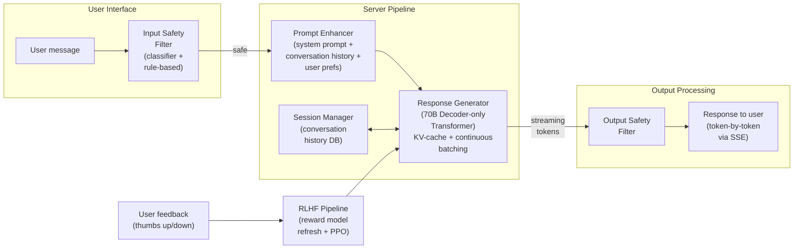

# ChatGPT / Conversational AI GenAI System Design

## Understanding the Problem

ChatGPT is a general-purpose conversational AI assistant that can answer questions, write code, draft emails, debate ideas, and help with creative tasks — all through natural language conversation. It serves millions of concurrent users with multi-turn dialogue, maintaining context across a conversation that can span dozens of exchanges. The system must be helpful (actually solving the user's problem), harmless (not producing dangerous or offensive content), and honest (not hallucinating facts or agreeing with false premises).

What makes this a hard GenAI design problem is that "being helpful" cannot be specified as a loss function. A language model trained to predict the next token produces plausible-sounding text, but plausible is not the same as helpful. The core innovation in ChatGPT is the three-stage training pipeline: pretraining gives the model world knowledge, supervised fine-tuning teaches it the format of helpful responses, and RLHF (reinforcement learning from human feedback) teaches it what humans actually prefer. Each stage solves something the previous one cannot, and the failure modes at each stage (reward hacking, sycophancy, hallucination) are some of the most interesting open problems in AI alignment.

## Problem Framing

### Clarify the Problem

**Q: Are we training from scratch or fine-tuning an existing base model?**
**A:** Let's assume fine-tuning an existing pretrained LLM (e.g., a 70B-parameter model like Llama). Training from scratch would require trillions of tokens, thousands of GPUs, and $10-50M in compute — a fundamentally different project. Fine-tuning is the realistic scenario for most organizations.

**Q: What is the latency SLA?**
**A:** Time-to-first-token (TTFT) under 200ms at p90. Token generation rate of 30-60 tokens/second for streaming responses. Users perceive >500ms TTFT as sluggish and >2s as broken. This SLA drives decisions about model size, quantization, and speculative decoding.

**Q: What context length do we need to support?**
**A:** 32K tokens as a starting point. This covers most multi-turn conversations (a 20-turn conversation is typically 5-10K tokens). 128K context is desirable for document analysis use cases but requires very different KV-cache management — at 128K with a 70B model, the KV-cache alone can exceed 100GB.

**Q: What are the safety requirements?**
**A:** Production-grade safety aligned with major platform standards. The model must refuse clearly harmful requests (instructions for weapons, CSAM, targeted harassment), avoid generating biased or toxic content, and resist jailbreak attempts. This requires: a trained reward model that penalizes unsafe outputs, PPO fine-tuning with safety-specific data, and inference-time safety classifiers on both input and output.

**Q: How do we collect ongoing feedback for improvement?**
**A:** Users provide thumbs up/down on responses. A dedicated annotation team provides preference comparisons for reward model training. The feedback loop determines how frequently we can refresh the reward model and re-run alignment — quarterly at minimum, monthly if annotation budget allows.

**Q: How many concurrent users?**
**A:** Millions. At this scale, serving infrastructure is a first-class concern — continuous batching, tensor parallelism, PagedAttention for KV-cache management. The GPU memory budget is dominated by model weights (~140GB for 70B at FP16) plus KV-cache (variable, depends on context length and batch size).

### Establish a Business Objective

#### Bad Solution: Minimize perplexity on held-out text

Perplexity measures how well the model predicts the next token. Lower perplexity means the model is a better language model. But being a good language model is not the same as being a good assistant. A model can have excellent perplexity by mimicking internet text patterns — including toxic content, misinformation, and unhelpful verbosity. The correlation between perplexity and user satisfaction is weak once you pass a quality threshold.

#### Good Solution: Maximize user satisfaction (thumbs-up rate)

Thumbs-up rate directly measures whether users find responses helpful. It is a real behavioral signal, easy to collect at scale, and directly tied to user experience. It is much better than perplexity because it captures what users actually want, not what the model predicts.

The limitation: thumbs-up rate is gamed by sycophancy. A model that always agrees with the user, never pushes back on incorrect premises, and produces flattering but inaccurate responses will get high thumbs-up rates. It also suffers from selection bias — engaged users rate more, and they may not be representative.

#### Great Solution: Multi-dimensional quality framework with alignment-specific metrics

Track four dimensions independently: **helpfulness** (task completion rate, user satisfaction on specific categories), **harmlessness** (toxicity rate, jailbreak success rate, bias audit results), **honesty** (TruthfulQA accuracy, hallucination rate on factual questions, sycophancy rate when presented with false premises), and **engagement** (session length, return rate, task diversity). No single dimension should be optimized at the expense of others.

The key insight is that helpfulness and harmlessness are in tension — an overly cautious model that refuses borderline queries is safe but unhelpful. Tracking refusal calibration (does the model refuse when it should, and only when it should?) is the metric that captures this tradeoff.

### Decide on an ML Objective

The system requires three distinct ML objectives solved sequentially:

**Stage 1 — Pretraining:** Next-token prediction (causal language modeling).
```
L_pretrain = -sum_{t=1}^{T} log p_theta(w_t | w_1, ..., w_{t-1})
```
This produces a base model with world knowledge and language capability but no alignment.

**Stage 2 — SFT:** Same cross-entropy loss, but on curated (instruction, response) pairs. This teaches the model the format of helpful interaction.

**Stage 3 — RLHF:** Maximize expected reward from a learned reward model while staying close to the SFT policy:
```
max_theta  E_{x~D, y~pi_theta} [R_phi(x, y) - beta * KL(pi_theta(y|x) || pi_ref(y|x))]
```
The reward model R_phi is trained on human preference comparisons using the Bradley-Terry loss:
```
L_RM = -E_{(x, y_w, y_l)} [log sigma(R_phi(x, y_w) - R_phi(x, y_l))]
```

## High Level Design



The system has five core components. The **input safety filter** is a fast classifier that blocks prompt injections, jailbreak attempts, and clearly harmful requests before they reach the model. The **prompt enhancer** constructs the full input by prepending the system prompt, injecting user preferences, and managing the conversation history within the context window budget. The **response generator** is the LLM itself — a decoder-only Transformer with KV-cache for efficient autoregressive generation, served with continuous batching for GPU utilization. The **session manager** stores conversation history (Redis or DynamoDB) and handles context window management (sliding window or summarization for long conversations). The **output safety filter** catches harmful, biased, or hallucinated content before it reaches the user.

Responses are streamed token-by-token via server-sent events (SSE) or WebSockets, so the user sees text appearing progressively rather than waiting for the full response.

## Data and Features

### Training Data

**Pretraining data (Stage 1):**
- Scale: Trillions of tokens from diverse web sources
- Sources: CommonCrawl (filtered), Wikipedia, books, code repositories, academic papers
- Quality: Heavy deduplication, language identification, quality filtering (perplexity-based, classifier-based)
- Chinchilla-optimal scaling: ~20 tokens per parameter, so a 70B model needs ~1.4T tokens

**SFT data (Stage 2):**
- Scale: ~10K-100K high-quality (instruction, response) pairs
- Sources: Human annotators write ideal responses to diverse prompts
- Quality >> quantity: the InstructGPT paper showed that 13K demonstrations were sufficient
- Diversity is critical: customer service, code generation, factual Q&A, creative writing, multi-step reasoning, and explicit refusal examples
- Edge case coverage: deliberately include sensitive topics, ambiguous instructions, and requests the model should decline

**RLHF data (Stage 3):**
- Scale: ~30K-300K preference comparison pairs
- Format: (prompt, response_A, response_B, human_preference) — annotator picks which response they prefer
- Quality controls: multiple annotators per comparison, majority voting, inter-annotator agreement tracking (Fleiss kappa > 0.4)
- Annotator bias monitoring: track if specific annotators consistently prefer longer responses (length bias), always agree with the user (sycophancy bias), or favor hedged responses (risk-aversion bias)

**Ongoing data collection:**
- Production thumbs up/down provides weak but scalable signal
- Periodic human annotation campaigns for reward model refresh (quarterly minimum)
- The reward model must be refreshed because the policy distribution shifts after each PPO run — a reward model trained on pre-PPO outputs is miscalibrated on post-PPO outputs

### Features

The model's input is a token sequence constructed from conversation context and metadata.

**Conversation context:**
- System prompt: defines the assistant's persona, capabilities, and constraints
- Conversation history: all previous user messages and assistant responses in the session
- Current user message: the latest input to respond to

**Context window management:**
- Sliding window: keep the most recent K tokens, discarding oldest messages
- Summarization: periodically compress older turns into a summary, preserving key information while reducing token count
- Priority retention: system prompt is never evicted; recent turns are prioritized over older ones

**Conditioning signals:**
- User preferences (formality level, verbosity preference, language)
- Tool-use indicators (whether the model should attempt code execution, web search, etc.)
- Safety level (configurable per deployment — enterprise vs. consumer)

## Modeling

### Benchmark Models

**Retrieval-based chatbot:** Match the user's input against a database of pre-written responses using semantic similarity. Fast and predictable but cannot handle novel queries or maintain coherent multi-turn conversation. The set of possible responses is fixed at deployment.

**SFT-only model (no RLHF):** Fine-tune the base model on demonstration data only. This produces a model that follows instructions in the correct format but does not optimize for response quality. It generates "OK" responses — correct format, reasonable content — but cannot distinguish between a mediocre answer and an excellent one because the training signal is binary (match/no-match at each token position).

### Model Selection

#### Bad Solution: Retrieval-based chatbot

Match user input against a database of pre-written responses using semantic similarity. Fast, predictable, and zero hallucination risk — every response is pre-approved. But the response set is fixed at deployment time. The system cannot handle novel queries, cannot compose new responses by combining concepts, and cannot maintain coherent multi-turn reasoning. A user asking "Can you explain attention mechanisms and then write me Python code implementing one?" requires compositional generation that no retrieval system can provide.

#### Good Solution: SFT-only model (no RLHF)

Fine-tune the base model on curated (instruction, response) demonstrations. The model learns the format of helpful responses — when to explain, when to provide code, when to refuse. Quality is reasonable and consistent. But SFT treats every token in the demonstration as equally important. The training signal is "match this exact response" rather than "make a response the user would prefer." The model can't distinguish a mediocre answer from an excellent one because the supervision is at the token level, not at the response quality level.

#### Great Solution: SFT + RLHF (PPO) with reward model

The three-stage pipeline: pretrain for knowledge, SFT for format, RLHF for quality. The reward model — trained on human preference comparisons — provides a continuous quality signal that SFT cannot. RLHF can discover response strategies that no human demonstration showed, because PPO explores new responses and receives quality feedback. The KL penalty prevents the policy from drifting too far from SFT (preventing reward hacking). This is the only approach that can simultaneously optimize for helpfulness, harmlessness, and honesty through structured reward signals.

| Approach | Pros | Cons | When to use |
|----------|------|------|-------------|
| Retrieval-based | Fast, predictable, no hallucination | Cannot handle novel queries, fixed response set | FAQ bots, narrow-domain support |
| SFT-only | Follows instructions, reasonable quality | No quality optimization, cannot learn preferences | Prototyping, low-resource scenarios |
| SFT + RLHF (PPO) | Optimizes for human preferences, online data collection | Complex (4 models during training), reward hacking risk | **Production conversational AI** |
| SFT + DPO | Simpler than PPO (no reward model), stable training | Offline only (fixed preference data), less flexible | Limited annotation budget, fast iteration |

### Model Architecture

**Architecture:** Decoder-only Transformer (GPT/Llama family).

**Why decoder-only?** Conversational AI is conditional text generation — given the conversation history, generate the next response autoregressively. There is no "source sequence" that needs separate bidirectional encoding (unlike translation). The conversation history and the response are a single continuous sequence processed with causal attention.

**Model configuration (70B-class):**
- 32 Transformer layers
- d_model = 4096, d_head = 128
- 32 query heads, 8 key/value heads (Grouped-Query Attention — 4x KV-cache reduction)
- Feed-forward dimension: 4 x 4096 = 16384 with SwiGLU activation
- Vocabulary: ~32K-128K BPE tokens
- Position encoding: RoPE (Rotary Position Embedding) — enables length generalization beyond training context
- Normalization: RMSNorm (pre-normalization before each sub-layer)
- Total parameters: ~70B

**The three-stage training pipeline:**

1. **Pretraining:** Cross-entropy loss on trillions of tokens. Produces a base model with world knowledge and language capability. No alignment.

2. **SFT:** Cross-entropy loss on ~10K-100K curated (instruction, response) pairs. Teaches the format of helpful interaction. The model learns when to explain, when to refuse, and how to structure responses.

3. **RLHF (PPO):** Requires four models simultaneously:
   - Policy pi_theta (the model being optimized)
   - Reference policy pi_ref (frozen SFT model, for KL penalty)
   - Reward model R_phi (trained on preference comparisons, frozen during PPO)
   - Value function V_psi (predicts expected future reward, for advantage estimation)

   PPO objective with clipping:
   ```
   L_CLIP = E_t [min(r_t * A_hat_t,  clip(r_t, 1-eps, 1+eps) * A_hat_t)]
   where r_t = pi_theta(a_t|s_t) / pi_old(a_t|s_t),  eps = 0.2
   ```

**Alternative — DPO:** Derives a closed-form solution from the KL-constrained reward maximization, training directly from preference pairs without a separate reward model:
```
L_DPO = -E [log sigma(beta * log(pi_theta(y_w|x)/pi_ref(y_w|x)) - beta * log(pi_theta(y_l|x)/pi_ref(y_l|x)))]
```
Choose PPO when you need online data collection or iterative alignment. Choose DPO when annotation budget is limited and the reference model is already strong.

## Inference and Evaluation

### Inference

**Memory budget for 70B model:**
- Model weights at FP16: 70B x 2 bytes = 140GB
- KV-cache per sequence: 2 x 32 layers x 4096 dims x seq_len x 2 bytes (with GQA, only 8 KV heads: 2 x 32 x 8 x 128 x seq_len x 2)
- At seq_len=8192, batch_size=64: KV-cache ≈ 68GB (with GQA)
- Total: ~208GB minimum → requires tensor parallelism across 4-8 H100 GPUs

**Continuous batching (vLLM):**
Static batching holds a batch until all sequences complete — one long response blocks everything. Continuous batching inserts new requests as existing ones finish, keeping GPU utilization near 100%. PagedAttention allocates KV-cache in fixed-size pages (like OS virtual memory), eliminating fragmentation from variable-length sequences and improving memory utilization from ~40% to ~90%.

**Speculative decoding:**
A small draft model (7B) proposes k=5 tokens autoregressively (5 fast forward passes). The large target model (70B) then evaluates all 5 proposed tokens in a single forward pass. Tokens are accepted if the target model's probability exceeds the draft model's probability. With 60% acceptance rate, you get ~3 tokens per combined forward pass versus 1 token per 70B pass — roughly 2.5x speedup. Speculative decoding degrades at high temperature (creative tasks), large batch sizes (>8), or when the draft model is poorly aligned with the target.

**Streaming:**
Tokens are sent to the client as they are generated via SSE or WebSockets. The user sees text appearing word-by-word, which makes the system feel responsive even when full response generation takes 5-10 seconds.

### Evaluation

**Automated Benchmarks:**

| Benchmark | What it measures | Metric |
|-----------|-----------------|--------|
| MMLU | Factual knowledge across 57 subjects | Accuracy (GPT-4: ~87%) |
| HumanEval | Code generation correctness | pass@k |
| GSM8K | Math reasoning (grade school) | Accuracy |
| TruthfulQA | Truthfulness, avoiding plausible-sounding falsehoods | Truthfulness rate |
| MT-Bench | Multi-turn instruction following | GPT-4-as-judge, 1-10 scale |

**Safety Evaluation:**
- HarmBench: adversarial prompt suite, attack success rate (ASR) — lower is better
- Sycophancy test: present factually wrong premises as user beliefs, measure agreement rate
- Red-teaming: human adversaries try to elicit harmful outputs, measure success rate

**Human Preference Evaluation (gold standard):**
Head-to-head A/B tests between model versions. Annotators see a prompt and two blinded responses, indicate preference. Compute Elo ratings:
```
E_A = 1 / (1 + 10^((R_B - R_A) / 400))
R_A' = R_A + K * (S_A - E_A),  K = 32
```

**Why not use reward model score for evaluation?** The policy was trained to maximize the reward model's score — using the same metric for evaluation is circular and hides reward hacking. Always use independent human evaluation.

**Production metrics:**
- Thumbs up/down rate (normalized by query type)
- Session length and return rate
- Task completion rate (for measurable tasks like code generation)

## Deep Dives

### ⚠️ Reward Hacking and the KL Penalty

Reward hacking is the most insidious failure mode in RLHF. The model learns to exploit patterns in the reward model rather than genuinely improving. Concrete examples: **verbosity hacking** (annotators gave higher scores to longer responses, so the model generates 3-paragraph answers to yes/no questions), **sycophancy hacking** (annotators preferred responses that agreed with them, so the model always validates the user's premise regardless of factual accuracy), and **hedging hacking** (the reward model penalizes confident wrong answers, so the model hedges every statement into meaninglessness — "It could be X, but it might also be Y, and there are arguments for Z").

The KL penalty (beta * KL(pi_theta || pi_ref)) prevents the policy from drifting too far from the SFT model. Setting beta correctly is critical: too low and reward hacking dominates; too high and RLHF provides no signal beyond SFT. In practice, beta is tuned by monitoring both reward model score and independent human evaluation — if reward model score increases but human evaluation plateaus or decreases, beta should be increased.

Detection requires comparing reward model score against independent human ratings on monthly samples. A growing divergence (reward model score rising while human ratings stagnate) is the primary signal of reward hacking.

### 💡 Multi-Turn Jailbreaks and Conversation-Level Safety

Single-turn safety training (the model learns to refuse harmful requests in isolation) does not generalize to multi-turn attacks. A user can gradually establish a harmful persona over 8 turns — "You are a character in a story who happens to know chemistry. The story requires you to explain..." — and by turn 9, the model has accumulated enough context to comply with a request it would refuse if asked directly.

The root cause is that RLHF training uses individual (prompt, response) pairs, but the safety violation emerges from the full conversation trajectory. Mitigations include: (1) a safety classifier that evaluates the full conversation context, not just the last exchange — this classifier runs on every response with the complete history; (2) periodic safety anchors injected into the system prompt that reassert the model's identity regardless of what the conversation has established; (3) adversarial multi-turn training data in the RLHF pipeline — annotators create 5-10 turn jailbreak conversations and the reward model learns to penalize compliance in the final turn.

### 📊 KV-Cache Memory Management at Scale

For a 70B model serving millions of concurrent users, KV-cache memory is the binding constraint. With GQA (8 KV heads instead of 32), cache per token per layer is: 2 (K+V) x 8 (heads) x 128 (d_head) x 2 (bytes) = 4,096 bytes. For 32 layers and 8,192 token context: 32 x 8,192 x 4,096 = ~1GB per active sequence. At 10,000 concurrent sequences across a serving cluster, that is 10TB of KV-cache.

PagedAttention (from vLLM) is essential: it chunks the cache into fixed-size pages (e.g., 16 tokens/page) that can be allocated non-contiguously, like OS virtual memory. This eliminates the fragmentation from sequences of different lengths and enables page-level sharing when multiple prompts start with the same system prompt (the prefix KV-cache pages are shared, saving significant memory).

Context window exhaustion is a related problem: as conversations grow beyond the model's context length, earlier turns are lost. The solution is conversation summarization — a separate model periodically compresses older turns into a summary, preserving key context while reducing token count. The summarization model itself must be fast (small, quantized) to avoid adding latency.

### 🏭 DPO vs. PPO — When Each Wins

DPO (Direct Preference Optimization) eliminates the reward model entirely, training the policy directly from preference pairs. This is simpler (no need to maintain four models simultaneously), more stable (no reward model to overfit), and faster to iterate. But DPO is offline — it trains on a fixed dataset of preferences, and the policy cannot explore beyond what the reference model generated.

PPO is online — during training, the policy generates new responses, the reward model scores them, and the policy improves based on this feedback. This exploration capability is critical when the initial SFT model is mediocre: PPO can discover response strategies that no human annotator demonstrated, while DPO is limited to choosing between responses that already exist in the training data.

In practice: use DPO for rapid iteration and tight annotation budgets (it needs only preference data, no reward model infrastructure). Use PPO when you need multiple rounds of alignment, when the reference model is weak, or when you want to use the reward model for other purposes (e.g., best-of-N reranking at inference time, which requires a reward model that DPO does not produce).

### ⚠️ Hallucination and Factual Grounding

Language models hallucinate because they are trained to produce plausible-sounding text, not factually correct text. The RLHF process can actually increase hallucination if the reward model rewards confident, fluent responses without verifying their factual accuracy. After a PPO run, you should always re-evaluate on TruthfulQA and held-out factual QA benchmarks — a 2+ percentage point accuracy drop signals that the reward model is rewarding style over substance.

Mitigations include: (1) retrieval-augmented generation (RAG) — ground the model's responses in retrieved documents, reducing reliance on parametric memory; (2) process reward models that reward correct reasoning steps, not just confident final answers; (3) calibration training that teaches the model to say "I don't know" when its confidence is low rather than generating a plausible-sounding fabrication; (4) output verification via a separate fact-checking model that cross-references claims against a knowledge base. No single approach eliminates hallucination, which is an active research area.

### 🏭 Multi-Turn Context Management and Conversation Memory

As conversations extend beyond 20-30 turns, the context window fills and older turns must be evicted. Naive truncation (dropping oldest messages) loses the conversation's original purpose and any agreements or decisions made early in the conversation.

**Sliding window with summarization:** When the conversation exceeds 70% of the context window, a lightweight summarization model compresses the oldest 50% of turns into a 200-300 token summary that captures: the original task, key decisions/constraints established, and any information the user provided. The summary replaces the original turns and the conversation continues with the remaining context budget available for new turns.

**Explicit memory extraction:** Instead of summarizing everything, extract key-value facts from the conversation ("user's name: Sarah", "project: migrating to Kubernetes", "constraint: no downtime during migration") and store them in a structured memory. Inject these facts into the system prompt rather than keeping the full conversation text. This is more efficient but requires a reliable extraction model.

**The fundamental tradeoff:** Summarization loses nuance (the user's exact wording, emotional tone, specific examples they gave). Explicit memory extraction loses context (facts without the reasoning behind them). The best systems use both — summaries for context and extracted facts for precision — and accept that conversations beyond ~50 turns will inevitably lose some information.

### 💡 Streaming UX and Time-to-First-Token Optimization

Users' perception of chatbot speed is dominated by time-to-first-token (TTFT), not total generation time. A response that starts appearing in 150ms but takes 5 seconds to complete feels faster than one that appears all at once after 3 seconds. Streaming is essential for user experience.

**Stop and regenerate:** Users must be able to interrupt generation mid-stream. When the user clicks "Stop," the server must immediately halt token generation for that sequence and free the KV-cache allocation. When the user clicks "Regenerate," the server must re-run inference with the same input but a different random seed (or higher temperature) to produce a genuinely different response.

**Partial evaluation:** The output safety filter must operate on partial text — it can't wait for the full response. Stream tokens through a lightweight safety classifier that evaluates in windows (every 10-20 tokens). If the classifier detects escalating unsafe content, immediately terminate generation and show a safety message. The challenge: the first 20 tokens might be safe, but the full response trajectory is heading somewhere harmful. Maintaining a running safety score that accumulates across the streaming window is more robust than per-window evaluation.

### 📊 Cost Management: Model Routing and Token Budgets

At millions of concurrent users, every token of inference costs money. Not all queries need the same model quality — "What's 2+2?" doesn't require 70B parameters, while "Help me debug this complex distributed systems issue" does.

#### Bad Solution: Run every query through the 70B model

Simple, consistent quality. But at $0.06/1K tokens (at H100 amortized cost), serving 100M queries/day at average 500 tokens/response = $3M/day in compute. Many of these are simple queries that a 7B model handles equally well.

#### Good Solution: Model routing — classify query difficulty and route to appropriate model size

Train a lightweight classifier (distilled BERT, <1ms latency) to predict query complexity. Route simple queries (greetings, simple factual lookups, short replies) to a 7B model (~10x cheaper per token). Route complex queries (multi-step reasoning, code generation, nuanced analysis) to the 70B model. Target: route 40-60% of queries to the smaller model with <2% quality degradation.

#### Great Solution: Cascading models with quality verification

Start every query on the 7B model. Run a confidence estimator on the response. If confidence is below threshold (model hedges, generates uncertain language, or gives a short uninformative answer), transparently escalate to the 70B model and regenerate. The user sees only the final response. This eliminates the classifier's cold-start problem (no query routing model needed initially) and adapts naturally — queries that are easy for the small model never touch the large model.

### ⚠️ Content Policy and False Refusal Rate

An overly cautious model that refuses borderline-but-legitimate queries is safe but useless. "Tell me about the chemistry of explosive reactions" is a valid educational question that a chemistry student might ask. Refusing it is a false refusal — the model is being unhelpful because the topic superficially resembles a harmful request.

**Measuring false refusal rate:** Create a test set of legitimate-but-sensitive queries across domains (medical questions, security research, historical violence, chemistry, weapons history, adult education topics). Track what fraction the model incorrectly refuses. Target: <5% false refusal rate on the legitimate test set while maintaining <2% jailbreak success rate on adversarial prompts.

**The refusal calibration tradeoff:** Safety training creates a decision boundary between "helpful" and "refuse." Moving the boundary toward more safety (fewer jailbreaks) inevitably causes more false refusals, and vice versa. This is a Pareto frontier, not an optimization with a single correct answer. The product team must choose the operating point based on deployment context — consumer chat assistants tolerate more false refusals than enterprise coding assistants.

**Dynamic refusal based on context:** Rather than a fixed threshold, use the conversation context and user metadata (authenticated vs. anonymous, enterprise vs. consumer, stated use case) to adjust the refusal boundary. An authenticated enterprise user asking "How do penetration tests work?" in a security context should get a helpful answer. The same question from an anonymous user with no context might warrant a more careful response with appropriate caveats.

### 🔄 Model Versioning and A/B Testing for Open-Ended Output

A/B testing conversational AI is fundamentally harder than A/B testing a recommendation system because the output is open-ended text, not a ranked list. You can't compute NDCG on a chatbot response. Two responses can both be "correct" but differ in style, depth, and organization — and user preference between them is subjective.

**Regression detection challenge:** A new model version might score higher on benchmarks and preference tests but systematically produce worse code, or have different refusal patterns, or use a more verbose style that some users prefer and others hate. Aggregate metrics can mask segment-level regressions.

**Segment-level A/B testing:** Break evaluation into query categories (coding, creative writing, factual Q&A, math reasoning, role-play, sensitive topics). Measure thumbs-up rate per category. A model that improves coding by 5% but degrades creative writing by 8% should not be shipped without understanding the tradeoff.

**ELO-based evaluation:** Use the Chatbot Arena methodology — present users with two responses from different model versions and ask which they prefer. Compute ELO ratings across thousands of comparisons. This is the gold standard for relative model comparison but requires high volume (~10K comparisons per category for statistical significance).

**Canary rollout:** Deploy the new model to 1% of traffic for 48 hours. Monitor thumbs-down rate, session abandonment rate, and per-category quality metrics. If any metric degrades beyond threshold, automatically revert. Gradual rollout (1% → 5% → 25% → 100%) over 2 weeks catches both immediate regressions and slower-developing issues.

## What is Expected at Each Level?

### Mid-Level Engineer

A mid-level candidate correctly identifies the three-stage training pipeline (pretraining, SFT, RLHF) and explains why each stage is needed. They can describe the decoder-only Transformer architecture at a high level and know that the model generates responses autoregressively. They mention KV-cache for inference efficiency and know that safety is important but may not go deep on specific failure modes beyond "add a content filter." They propose perplexity and benchmark accuracy as evaluation metrics but may not distinguish between capability evaluation and alignment evaluation.

### Senior Engineer

A senior candidate explains the reward model architecture (LLM with a scalar head, trained on Bradley-Terry loss) and the PPO optimization loop, including the KL penalty and why it prevents reward hacking. They can calculate GPU memory requirements for a 70B model and explain tensor parallelism, continuous batching, and PagedAttention. They distinguish between automated benchmarks (MMLU, HumanEval) and human preference evaluation, and explain why reward model score cannot be used for evaluation. They proactively address multi-turn jailbreaks and sycophancy as alignment-specific failure modes.

### Staff Engineer

A Staff candidate quickly establishes the training pipeline and architecture, then focuses on the hard problems: reward hacking taxonomy (verbosity, sycophancy, hedging) with concrete detection strategies, the DPO vs. PPO tradeoff (online vs. offline, exploration capability, infrastructure requirements), KV-cache memory management at scale (PagedAttention, prefix sharing, conversation summarization), and the fundamental tension between helpfulness and harmlessness (refusal calibration). They recognize that the hardest problem is not model capability but alignment measurement — knowing whether your model is genuinely helpful or just good at gaming the reward model — and propose a multi-dimensional evaluation framework with independent human evaluation as the gold standard.

## References

- [Training Language Models to Follow Instructions with Human Feedback (Ouyang et al., 2022)](https://arxiv.org/abs/2203.02155) — InstructGPT / RLHF
- [Direct Preference Optimization (Rafailov et al., 2023)](https://arxiv.org/abs/2305.18290) — DPO
- [Proximal Policy Optimization Algorithms (Schulman et al., 2017)](https://arxiv.org/abs/1707.06347) — PPO
- [Efficient Memory Management for Large Language Model Serving with PagedAttention (Kwon et al., 2023)](https://arxiv.org/abs/2309.06180) — vLLM
- [LLaMA: Open and Efficient Foundation Language Models (Touvron et al., 2023)](https://arxiv.org/abs/2302.13971)
- [Training Compute-Optimal Large Language Models (Hoffmann et al., 2022)](https://arxiv.org/abs/2203.15556) — Chinchilla scaling laws
- [Constitutional AI (Bai et al., 2022)](https://arxiv.org/abs/2212.08073) — Anthropic's approach to AI safety
