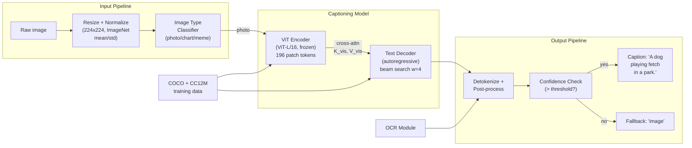

# Image Captioning GenAI System Design

## Understanding the Problem

Image captioning is the task of generating a natural language description of an image — given a photo of a golden retriever catching a frisbee on a beach, the system produces "A golden retriever catches a frisbee on a sunny beach." This bridges two completely different worlds: vision (pixels) and language (words). The AI must understand what objects are present, what actions are happening, what spatial relationships exist, and then express all of this in a grammatically correct, accurate sentence.

Real-world applications include accessibility (alt-text for screen readers, serving visually impaired users), image search indexing (enabling text-based search of image corpora), social media auto-descriptions, medical imaging report generation, and e-commerce product description generation. Each use case has fundamentally different quality requirements — accessibility alt-text has zero tolerance for hallucination (describing objects that are not in the image), while search indexing can tolerate imprecise descriptions as long as key objects are captured.

## Problem Framing

### Clarify the Problem

**Q: What is the primary use case — accessibility, search indexing, or something else?**
**A:** Let's focus on accessibility (alt-text for screen readers) as the primary use case, with search indexing as a secondary benefit. This means hallucination tolerance is very low — a blind user who hears "a woman holding a red balloon" when the image shows a man holding a sign is actively misled. We need to be conservative: showing "image" as a fallback is better than showing an incorrect caption.

**Q: What is the expected caption style — a short phrase or a detailed description?**
**A:** For accessibility, a single concise sentence is the standard (15-25 words). "A dog playing fetch in a green park" rather than a multi-sentence narrative. For search indexing, we want keyword-rich descriptions that capture the main objects, actions, and scene.

**Q: What types of images do we need to handle?**
**A:** Primarily natural photographs (user-uploaded photos, web images). But the system will also encounter charts, diagrams, screenshots, and memes. A model trained only on natural photos performs poorly on non-photographic images. We should detect image type and route to specialized models when possible.

**Q: What is the latency requirement?**
**A:** Two modes. Real-time accessibility (captions appearing as images load in a web browser): <500ms per image. Batch indexing (captioning a corpus of images for search): throughput-optimized, latency per image <100ms is fine. These require different serving strategies.

**Q: What about multilingual captions?**
**A:** English-only for now. Multilingual captions could be generated by either training a multilingual decoder or translating the English caption post-generation. The translation approach is simpler but introduces translation errors.

**Q: How do we handle images containing text (signs, memes, book covers)?**
**A:** For accessibility, the text content is often the most important information. We need an OCR module integrated into the pipeline. "A sign reading 'EXIT' on a building" is far more useful than "a sign on a building" for a blind user.

### Establish a Business Objective

#### Bad Solution: Maximize BLEU score on the COCO Captions test set

BLEU measures n-gram precision between the generated caption and reference captions. All n-grams are weighted equally, so getting "the" and "a" right contributes as much as getting "golden retriever" right. A caption that says "A the on a the" with enough common words overlapping will score higher than a specific, informative caption with different word choices. BLEU was designed for machine translation, not captioning — it does not reward image-specific information.

#### Good Solution: Maximize CIDEr score with TF-IDF weighting

CIDEr (Consensus-based Image Description Evaluation) uses TF-IDF weighted n-gram similarity, so informative words like "golden retriever" or "frisbee" receive much higher weight than common words like "a" or "the." It computes cosine similarity between the candidate and reference captions in TF-IDF space, averaged across n-gram sizes (1 through 4) and across all reference captions. CIDEr correlates at r~0.85-0.90 with human judgments of caption quality, compared to r~0.70 for BLEU.

The limitation: CIDEr measures caption quality (does it match human descriptions?) but not faithfulness (does it describe what is actually in the image?). A model can achieve high CIDEr by learning COCO training set patterns (kitchens usually have microwaves) and hallucinating objects that are statistically likely but not actually present.

#### Great Solution: Multi-dimensional evaluation combining CIDEr, CHAIR, SPICE, and human evaluation

CIDEr for caption quality, CHAIR for hallucination detection (fraction of mentioned objects not in the image — lower is better), SPICE for semantic correctness (scene graph matching), and periodic human evaluation for adequacy, fluency, and specificity. For the accessibility use case, CHAIR is arguably more important than CIDEr — a caption with CHAIR_i=5% and CIDEr=120 is better for blind users than one with CHAIR_i=20% and CIDEr=140.

Add a confidence threshold: only display a generated caption when model confidence exceeds a threshold. Below threshold, show a generic "image" label rather than risking a misleading caption. Track the threshold's impact on coverage (what fraction of images get captions) versus precision (what fraction of shown captions are correct).

### Decide on an ML Objective

Image captioning is **conditional text generation** where the conditioning signal is a visual representation:

```
p(y_1, ..., y_n | I) = product_{t=1}^{n} p(y_t | y_1, ..., y_{t-1}, f(I))
```

where I is the image, f(I) is the visual representation (patch token sequence from a ViT), and y_1..y_n is the caption.

The training loss is cross-entropy over the caption tokens, conditioned on the image:

```
L = -sum_{(I, y)} sum_{t=1}^{|y|} log p_theta(y_t | y_{<t}, f(I))
```

The vision encoder (ViT) maps the image into a sequence of patch features. The text decoder generates the caption autoregressively, attending to the visual features via cross-attention at each layer.

## High Level Design



The system has three stages. The **input pipeline** preprocesses the image (resize, normalize) and classifies the image type (natural photo, chart, meme) to route to the appropriate model. The **captioning model** uses a ViT encoder (typically frozen, pretrained with CLIP) to produce visual patch tokens, and a Transformer decoder to generate the caption autoregressively via cross-attention over those visual tokens. The **output pipeline** detokenizes, post-processes (capitalization, punctuation), integrates OCR results for text-in-image, and applies a confidence threshold to decide whether to show the generated caption or a generic fallback.

The ViT encoder is computed once per image and cached. The decoder runs beam search (width 4) over the cached visual features. For batch indexing, visual features can be pre-computed and stored, decoupling encoding from captioning.

## Data and Features

### Training Data

**COCO Captions (standard benchmark):**
- 330K images, each with 5 human-written captions
- High quality, diverse descriptions from different annotators
- During training: randomly sample 1 of 5 captions per image per epoch (implicit augmentation)
- 5K test images (Karpathy split) with 5 references each for evaluation

**Conceptual Captions (CC3M, CC12M):**
- 3-12M web-scraped image-alt-text pairs
- Lower quality than COCO but much larger scale
- Useful for pretraining before fine-tuning on COCO
- CLIP-score filtering (cosine similarity > 0.25) to remove mismatched pairs

**LAION-COCO:**
- 600M synthetic COCO-style captions generated by CoCa
- Massive scale for pretraining the decoder's language capabilities

**Image preprocessing:**
- Resize to 224x224 (or 336x336 for higher-resolution variants)
- Normalize with ImageNet mean and std: mu = (0.485, 0.456, 0.406), sigma = (0.229, 0.224, 0.225)
- For ViT: divide into 16x16 patches, each patch is a 768-dim vector (16 x 16 x 3)

**Augmentation constraints:**
Augmentations must not change the semantic content referenced in the caption. Safe: horizontal flip (if caption has no left/right references), color jitter, random crop (>80% area). Unsafe: aggressive random crop (<50% area, may crop out the subject), vertical flip (unnatural images).

### Features

**Visual features (from ViT encoder):**
- 196 patch tokens (for 224x224 with p=16) + 1 CLS token, each d_model-dimensional
- Each patch token captures local visual information (edges, textures, object parts)
- Self-attention across patches builds global scene understanding
- The CLS token provides a single aggregate image representation (useful for retrieval)
- All patch tokens serve as K and V in cross-attention with the decoder

**Text features (for the decoder):**
- BPE-tokenized caption with [BOS] and [EOS] tokens
- Learned token embeddings + positional embeddings
- Causal self-attention over previously generated tokens
- Cross-attention queries (Q) come from the text decoder; keys and values (K, V) come from the ViT encoder

## Modeling

### Benchmark Models

**Retrieval-based captioning:** Find the most similar image in a database (using CLIP embeddings) and return its stored caption. Zero hallucination risk since captions come from human annotations, but fails for novel images or novel visual compositions not represented in the database. Useful as a conservative baseline for high-stakes accessibility applications.

**CNN + LSTM (classic, 2015-era):** ResNet encoder extracts a single feature vector → LSTM decoder generates the caption token by token, conditioned on the visual feature via an initial hidden state. This was the standard architecture (Show and Tell, 2015) but cannot attend to specific image regions — the entire image is compressed into a single vector, losing spatial information.

### Model Selection

#### Bad Solution: CNN + LSTM (Show and Tell architecture)

ResNet encoder extracts a single feature vector from the image, which initializes the LSTM decoder's hidden state. The decoder generates the caption word by word. Simple, fast, low memory. But the entire image is compressed into a single 2048-dim vector — all spatial information is lost. The model can say "a dog in a park" but can't distinguish whether the dog is on the left or right, or whether it's running or sitting, because those spatial details are crushed into the same fixed-size vector. No cross-attention means the decoder can't "look at" specific image regions while generating specific words.

#### Good Solution: ViT encoder + Transformer decoder with cross-attention

The ViT encoder produces 196 spatial patch tokens (each representing a 16x16 region of the image), and the Transformer decoder attends to these patches via cross-attention at each generation step. When generating "dog," the decoder focuses attention on dog-containing patches. When generating "beach," it shifts to sand/water patches. This spatial selectivity produces much richer, more accurate captions than the single-vector approach.

The limitation: training the full encoder-decoder pipeline from scratch requires millions of image-caption pairs and significant compute. The vision encoder and language decoder are not pretrained to be compatible — the cross-modal alignment must be learned entirely from paired data.

#### Great Solution: BLIP-2 / CoCa with frozen pretrained components

BLIP-2 introduces a Q-Former (188M trainable parameters) as a lightweight bridge between a frozen ViT-G encoder (~1B params) and a frozen LLM (OPT/FlanT5, 3-13B params). The Q-Former learns to extract exactly the visual information the LLM needs for caption generation. Training cost is a fraction of end-to-end training because only the Q-Former is updated. This leverages the strongest available vision encoder and language model without fine-tuning either — a dramatic efficiency win for production deployment.

| Approach | Pros | Cons | When to use |
|----------|------|------|-------------|
| Retrieval-based | Zero hallucination, predictable | Cannot describe novel images, fixed caption set | High-stakes accessibility fallback |
| CNN + LSTM | Simple, fast, low memory | No spatial attention, single vector bottleneck, poor quality | Legacy systems |
| ViT + Transformer decoder | Fine-grained spatial attention via cross-attention, state-of-art quality | Higher compute, needs large pretraining | **Production captioning** |
| BLIP-2 / CoCa | Joint understanding + generation, frozen encoder/LLM, minimal fine-tuning | Complex training, large model size | **Best for platform-level deployment** |

### Model Architecture

**Architecture:** ViT encoder + Transformer decoder with cross-attention.

**Vision Transformer (ViT) Encoder:**

```
Input: I in R^{224 x 224 x 3}
Step 1: Patchify — divide into P = (224/16)^2 = 196 non-overlapping patches
Step 2: Flatten each patch to p^2 * C = 768 dimensions
Step 3: Linear projection — W_e * patch_i + b_e, W_e in R^{d_model x 768}
Step 4: Prepend learnable [CLS] token → sequence of 197 tokens
Step 5: Add learned positional embeddings
Step 6: Process through L transformer encoder layers (bidirectional self-attention)
Output: V in R^{197 x d_model} — one vector per patch + CLS
```

For captioning, all 196 patch vectors (not just CLS) serve as cross-attention keys and values, giving the decoder fine-grained access to different image regions.

**Text Decoder:**

Each decoder layer has three sub-modules:
1. **Causal self-attention** over previously generated caption tokens
2. **Cross-attention** over visual patch features:
   ```
   CrossAttn(Q_dec, K_vis, V_vis) = softmax(Q_dec * K_vis^T / sqrt(d_k)) * V_vis
   ```
3. **Feed-forward network**

The cross-attention at step t asks: "given what I have generated so far, which image patches are most relevant for the next word?" When generating "dog", attention peaks at dog-containing patches. When generating "beach", it peaks at sand/water patches.

**Modern architecture choice — BLIP-2:**
Rather than training encoder and decoder jointly from scratch, BLIP-2 introduces a Q-Former (querying transformer) as a lightweight bridge between a frozen ViT encoder and a frozen LLM. The Q-Former has ~188M trainable parameters that learn to extract visual information relevant to language generation. This allows using the most powerful available ViT (ViT-G) and LLM (OPT, FlanT5) without fine-tuning them — dramatically reducing training cost.

**Loss function:** Cross-entropy with teacher forcing:
```
L = -sum_{(I, y)} sum_{t=1}^{|y|} log p_theta(y_t | y_{<t}, f(I))
```

**Optional: Self-Critical Sequence Training (SCST):**
After cross-entropy pretraining, fine-tune with RL to directly optimize CIDEr score. The reward is the CIDEr score of the generated caption; the baseline is the CIDEr of the greedy-decoded caption. This closes the gap between the token-level training objective and the sequence-level evaluation metric.

## Inference and Evaluation

### Inference

**Two-phase inference:**

Phase 1 — Visual encoding: The ViT encoder processes the full image in a single forward pass, producing 197 visual tokens. This is highly parallelizable (no sequential dependencies). ViT-L/16 on an A100 encodes one image in ~10ms; batches of 64 images in ~15ms (effective 0.23ms per image with batching). The encoder output is computed once per image and can be cached.

Phase 2 — Caption decoding: The decoder generates tokens autoregressively via beam search (width 4, max 25 tokens). Each step attends to the cached visual features (cross-attention) and all previous tokens (causal self-attention with KV-cache). A 25-token caption with beam width 4 requires ~100 decoder forward passes — this dominates latency.

**Latency budget (real-time accessibility):**

| Component | Time |
|-----------|------|
| Image preprocessing | ~5ms |
| ViT encoding | ~10ms |
| Beam search decoding (25 tokens, w=4) | ~200ms |
| Post-processing + OCR | ~30ms |
| **Total** | **~245ms** |

Within the 500ms budget. For batch indexing, encoder outputs are pre-computed and stored, and decoding runs in large batches.

**Confidence thresholding:**
For accessibility, apply a confidence gate: compute the average log-probability of the generated caption. If below a threshold (tuned on a validation set to achieve target CHAIR), output "image" instead. This trades coverage for precision.

### Evaluation

#### Bad Solution: Optimize for BLEU-4 on COCO Captions test set

BLEU-4 measures 4-gram precision between generated and reference captions. It weights all n-grams equally — common words like "the" and "a" contribute as much as informative words like "golden retriever." A generic caption like "a person in a room" can score surprisingly well because those n-grams appear in many references. BLEU was designed for machine translation where word order matters; for captioning, the focus should be on whether the right objects and relationships are described, not whether the exact phrasing matches.

#### Good Solution: CIDEr + CHAIR with stratified evaluation

CIDEr uses TF-IDF weighting so informative words receive higher weight. CHAIR directly measures hallucination rate — the fraction of mentioned objects not actually in the image. Together they capture both caption quality (does it describe the scene well?) and faithfulness (does it describe what is actually there?). Stratify evaluation across image difficulty levels: single-object (easy), multi-object scenes (medium), complex interactions and text-in-image (hard). This reveals whether the model's average score is hiding poor performance on hard cases.

The limitation: both CIDEr and CHAIR are reference-dependent — they require ground truth annotations. For new domains (medical images, satellite photos), no reference captions exist, making these metrics impossible to compute.

#### Great Solution: Multi-dimensional evaluation combining automated metrics, human judgment, and online signals

Use CIDEr for quality, CHAIR for hallucination, SPICE for semantic correctness (scene graph matching), and periodic human evaluation for adequacy, fluency, and specificity on a stratified sample. For domains without reference captions, use LLM-as-judge (GPT-4V or Claude) to score faithfulness by comparing the caption against the image directly. For the deployed accessibility system, track online signals: screen reader user feedback rate (negative reports per 1,000 captions), search precision improvement (for the indexing use case), and coverage (fraction of images that receive a caption vs. fallback). A model that achieves CIDEr=140 but CHAIR_i=20% is actively harmful for blind users — prioritize CHAIR over CIDEr for the accessibility use case.

**Offline Metrics:**

| Metric | What it measures | Typical SOTA |
|--------|-----------------|--------------|
| CIDEr | TF-IDF weighted n-gram consensus with references | ~140-150 on COCO |
| SPICE | Scene graph (subject-relation-object) F-score | ~23-25 on COCO |
| CHAIR_i | Fraction of mentioned objects that are hallucinated | <5% is good |
| BLEU-4 | 4-gram precision with brevity penalty | ~40 on COCO |
| METEOR | Synonym-aware, stemming-aware matching | ~30 on COCO |

**Human Evaluation:**
- **Adequacy:** Does the caption accurately describe the image? (1-5 scale)
- **Fluency:** Is the caption grammatically correct and natural? (1-5 scale)
- **Specificity:** Does it capture important details, or is it generic? (1-5 scale)
- Run on a stratified sample: easy images (single object), medium (multi-object scene), hard (complex interactions, text in image)

**Online Metrics (for deployed system):**
- Coverage: fraction of images that receive a generated caption (vs. fallback)
- User feedback: screen reader users report incorrect captions (negative feedback rate)
- Search precision: for search indexing, does the caption improve image retrieval accuracy?

## Deep Dives

### ⚠️ Object Hallucination — The Most Critical Failure Mode

Object hallucination occurs when the model describes objects not present in the image. A caption says "a cat sitting on a mat" when there is no cat. This happens because the model learns statistical co-occurrence patterns from training data: kitchens usually have microwaves, parks usually have dogs, tables usually have food. When the model encounters a kitchen image, it may hallucinate a microwave even if none is visible.

CHAIR (Caption Hallucination Assessment with Image Relevance) measures this directly: CHAIR_i = |hallucinated objects| / |all mentioned objects|. A model with CIDEr=140 but CHAIR_i=20% is dangerous for accessibility — one in five mentioned objects is fabricated.

Mitigations: (1) constrained decoding — use an object detector (YOLO, Faster R-CNN) to identify objects actually present, and suppress generation of nouns not detected with sufficient confidence; (2) reduce beam search temperature for more conservative decoding; (3) factual consistency verification — a separate model checks whether each claim in the caption is supported by the image; (4) SCST fine-tuning with a combined CIDEr + CHAIR reward that explicitly penalizes hallucination.

### 💡 The Vision-Language Modality Gap

The fundamental challenge in image captioning is bridging pixels and words — two fundamentally different representation spaces. A ViT produces patch features optimized for visual discrimination; a language model expects token embeddings optimized for text generation. The cross-attention mechanism must learn this cross-modal alignment from scratch during fine-tuning, which requires large amounts of paired data.

Modern architectures address this gap through pretraining alignment. CLIP pretrains the ViT encoder to produce features that are already aligned with text embeddings via contrastive learning. BLIP-2's Q-Former is a lightweight adapter specifically designed to bridge a frozen ViT and a frozen LLM — it learns to extract the visual information that the LLM needs for caption generation, requiring only 188M trainable parameters while leveraging billions of parameters in the frozen encoder and decoder. This approach is dramatically more efficient than training the full encoder-decoder pipeline end-to-end.

### 📊 Caption Diversity vs. Accuracy Tradeoff

Beam search tends to produce generic, safe captions — "A man standing in a room" rather than "A chef in a white apron preparing sushi in a modern kitchen." This happens because beam search optimizes for the most likely sequence, and generic descriptions are always more likely than specific ones (more images match "a man standing" than "a chef preparing sushi").

For search indexing, specificity matters more than for accessibility. Strategies to increase diversity: (1) nucleus sampling (top-p) instead of beam search for more varied output, with temperature tuning; (2) diverse beam search that penalizes beams that are too similar to each other; (3) SCST fine-tuning with a reward that includes a specificity bonus (TF-IDF score of the caption — more specific words score higher); (4) re-ranking multiple beam outputs using a separate quality model that rewards detail.

### 🏭 Handling Non-Photographic Images

The training data (COCO, Conceptual Captions) is overwhelmingly natural photographs. When the model encounters charts, diagrams, screenshots, or memes, it produces nonsensical captions — "a colorful pattern" for a bar chart, "a group of people" for a meme with text overlay. For accessibility, these non-photographic images are particularly important — data visualizations are completely inaccessible to blind users without data-specific descriptions.

The solution is an image type classifier at the front of the pipeline. Route natural photos to the general captioning model, charts/graphs to a chart-captioning model fine-tuned on chart description data (e.g., ChartQA, PlotQA datasets), screenshots to an OCR-enhanced captioning model, and memes to a model that can read and describe the text-image relationship. This routing architecture adds ~5ms of latency but dramatically improves caption quality across image types.

### 💡 Platform Architecture — Shared Vision Foundation

Image captioning shares its vision encoder with visual question answering, image search, and OCR-enhanced understanding. The platform architecture is: shared frozen CLIP-pretrained ViT → task-specific decoders/adapters. The ViT encoder (ViT-L, ~307M parameters) is expensive to pretrain (~$1M in compute) but is paid once and shared across all vision-language tasks.

For infrastructure efficiency: pre-compute ViT features for all images in the corpus and store them in a feature store. All downstream tasks (captioning, VQA, search) read from this shared feature store rather than re-encoding images. When the shared ViT encoder is updated (better pretraining, higher resolution), all tasks benefit simultaneously without individual retraining — only the task-specific adapters need adjustment.

### 🧮 Multi-Modal Conditioning: Combining Visual and Textual Features

For many real-world captioning scenarios, the model needs more than just visual information. An e-commerce product photo needs captions that mention the brand name, material, and size — information that's in the product metadata but not visible in the image. A medical X-ray needs captions that reference the patient's clinical context.

**Multi-modal input construction:** Prepend textual context tokens to the decoder input: `[BOS] [CONTEXT: product listing, cotton t-shirt, size M] [SEP] [START_CAPTION]`. The decoder's cross-attention attends to both visual patch tokens and context text tokens, learning to integrate both sources. During training, randomly drop the context 50% of the time (context dropout) so the model remains functional without context.

**Attention pattern analysis:** With multi-modal conditioning, inspect where the decoder's cross-attention focuses for each generated word. Content words ("dog," "beach") should attend primarily to visual patches. Context-dependent words ("brand name," "size") should attend primarily to context tokens. If content words attend to context instead of image patches, the model is hallucinating from context rather than describing the image — a subtle failure mode.

### 📊 Evaluation Beyond Standard Metrics: Human Preference and LLM-as-Judge

CIDEr, BLEU, and METEOR all measure similarity to reference captions. But reference captions are just one way to describe an image — a caption that is equally accurate but uses different wording scores poorly. This reference bias systematically penalizes diverse, specific captions in favor of generic ones that match the reference vocabulary.

**LLM-as-judge:** Use a strong LLM (GPT-4V, Claude) to evaluate captions along multiple dimensions: accuracy (does the caption match the image?), completeness (are important elements missing?), fluency (is it grammatically natural?), and hallucination (does it mention things not in the image?). The LLM sees both the image and the candidate caption and provides structured scores. This correlates r~0.90+ with human evaluation and is scalable to thousands of examples — whereas human evaluation at that scale costs $10K+.

**Preference-based evaluation:** Show human evaluators two captions for the same image (from different models) and ask which they prefer. Compute ELO ratings across many comparisons. This eliminates the reference bias problem entirely — evaluators judge caption quality directly, not similarity to a reference.

### 💡 Fine-Tuning vs Prompting for Domain Adaptation

When deploying captioning for a specific domain (medical images, satellite imagery, fashion), the training distribution (COCO photos) is mismatched. Two approaches to close this gap:

**Fine-tuning on domain data:** Collect domain-specific image-caption pairs (e.g., 10K radiology images with radiologist-written descriptions) and fine-tune the decoder while keeping the ViT encoder frozen. This requires annotation effort but produces domain-specialized captions. Risk: catastrophic forgetting — the model becomes excellent at medical images but loses general captioning ability. Mitigation: mix 20% general COCO data into domain training.

**Prompting/In-context learning (for LLM-based captioners like BLIP-2):** Instead of fine-tuning, provide domain-specific instructions and examples in the prompt: "Describe this chest X-ray, focusing on abnormalities. Example: 'Bilateral lower lobe opacities consistent with pneumonia.'" This requires no training but is limited by the model's existing knowledge of the domain. For specialized domains (pathology, satellite), prompting alone is insufficient because the visual patterns are too different from the pretraining distribution.

**Practical recommendation:** For domains with >5K annotated examples, fine-tune. For domains with <1K examples, prompt with in-context examples. For domains where the visual content is fundamentally different (medical imaging, microscopy), fine-tune the ViT encoder as well — not just the decoder.

### 🏭 Latency Optimization: Encoder Caching and Batch Decoding

For production accessibility (alt-text on web pages), each page may contain 5-20 images that all need captions within the page load budget (~500ms total, not per image). The ViT encoder dominates compute but can be highly parallelized.

**Encoder batching:** Process all images on the page in a single batched ViT forward pass. A batch of 16 images at 224x224 on an A100 takes ~20ms total (vs. 10ms × 16 = 160ms sequentially). This is the single largest latency optimization.

**Decoder parallelism:** After encoding, run beam search for all images concurrently. On GPU, this means interleaving decoder forward passes across images — while image 1 is at token 5, image 2 is at token 3, etc. Continuous batching (vLLM-style) keeps GPU utilization high across variable-length captions.

**Pre-computation for static content:** For images that don't change (product photos, article illustrations), pre-compute captions offline and cache them. Only dynamically caption user-uploaded images or new content. This eliminates inference latency entirely for ~80% of images on most web pages.

### ⚠️ Safety and Content Filtering for Captions

The captioning model can produce captions that are technically accurate but socially harmful — describing a person's race, weight, or apparent disability when that information is irrelevant to the image's purpose. For accessibility, mentioning "a wheelchair-bound person" when the image context is a group meeting is unnecessary and potentially offensive.

**Guidance for inclusive captioning:** Train the model on captions that follow accessibility best practices: describe actions and context rather than personal attributes unless directly relevant. "A person presenting at a conference" rather than "A woman in a wheelchair presenting at a conference" — unless the wheelchair is the subject of the image (e.g., a product listing for wheelchairs).

**Sensitive content detection:** Some images should not be captioned at all — NSFW content, graphic violence, or images of identifiable minors. Run a lightweight safety classifier before captioning and suppress captions for flagged images. For accessibility, provide a generic safety message ("This image may contain sensitive content") rather than describing the harmful content.

**Medical and emergency content:** Images of medical conditions, injuries, or emergencies require special handling. A generic caption of "a person lying on the ground" is less useful than "a person who appears to need medical assistance." But detailed medical descriptions ("apparent third-degree burn on left forearm") may be inappropriate for general alt-text. Route medical-context images to a specialized captioning pipeline with appropriate guardrails.

## What is Expected at Each Level?

### Mid-Level Engineer

A mid-level candidate identifies image captioning as an encoder-decoder problem with a vision encoder (CNN or ViT) and a text decoder connected by cross-attention. They know that COCO Captions is the standard dataset and can describe BLEU as an evaluation metric. They explain beam search as the generation strategy and mention teacher forcing during training. They may not distinguish between CIDEr and BLEU or address hallucination as a specific concern. They can draw a reasonable system diagram but may not address the two-phase inference optimization (encoding once, decoding per caption).

### Senior Engineer

A senior candidate explains why ViT is preferred over CNN (global attention from the first layer, better scaling, CLIP pretraining alignment) and describes the cross-attention mechanism precisely (Q from decoder, K/V from encoder). They use CIDEr as the primary metric and can explain why TF-IDF weighting matters for captioning. They identify object hallucination as the critical failure mode and propose CHAIR as the detection metric. They address the two-phase inference split (cache encoder output, optimize decoder beam search) and the confidence threshold approach for accessibility. They mention BLIP-2 or CoCa as modern architectures that leverage frozen pretrained components.

### Staff Engineer

A Staff candidate quickly establishes the ViT + decoder architecture and focuses on what makes captioning hard in production: the hallucination-coverage tradeoff (confidence thresholding trades coverage for precision, and the right threshold depends on the use case), the modality gap (why CLIP pretraining and Q-Former adapters matter more than bigger models), and the image type routing problem (natural photos vs. charts vs. memes require fundamentally different approaches). They recognize that the platform value is in the shared vision encoder, not the captioning decoder — and that CLIP-pretrained ViT features power captioning, VQA, image search, and OCR simultaneously. They propose a multi-dimensional evaluation framework where CHAIR matters more than CIDEr for accessibility use cases.

## References

- [An Image is Worth 16x16 Words: Transformers for Image Recognition at Scale (Dosovitskiy et al., 2020)](https://arxiv.org/abs/2010.11929) — ViT
- [Show, Attend and Tell: Neural Image Caption Generation with Visual Attention (Xu et al., 2015)](https://arxiv.org/abs/1502.03044) — Attention-based captioning
- [CIDEr: Consensus-based Image Description Evaluation (Vedantam et al., 2015)](https://arxiv.org/abs/1411.5726) — CIDEr metric
- [BLIP-2: Bootstrapping Language-Image Pre-training (Li et al., 2023)](https://arxiv.org/abs/2301.12597) — Q-Former architecture
- [CoCa: Contrastive Captioners (Yu et al., 2022)](https://arxiv.org/abs/2205.01917) — Joint contrastive + captioning
- [CHAIR: Object Hallucination in Image Captioning (Rohrbach et al., 2018)](https://arxiv.org/abs/1809.02156) — Hallucination evaluation
- [Learning Transferable Visual Models From Natural Language Supervision (Radford et al., 2021)](https://arxiv.org/abs/2103.00020) — CLIP
