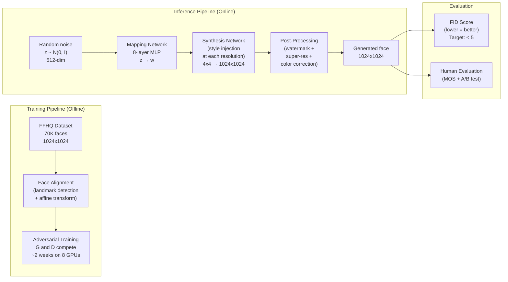

# Realistic Face Generation GenAI System Design

## Understanding the Problem

Face generation is the task of creating photorealistic images of human faces that do not correspond to any real person. Systems like StyleGAN power websites like "This Person Does Not Exist" — every refresh shows a new face that belongs to nobody, yet looks indistinguishable from a real photograph. The system must generate diverse faces covering different ages, genders, ethnicities, and expressions at high resolution (1024x1024).

What makes this an interesting GenAI design problem is the tension between four competing objectives: quality (every pixel must be photorealistic — humans are extraordinarily sensitive to facial artifacts), diversity (the model must cover the full spectrum of human appearance, not collapse to generating a narrow range of faces), controllability (users often want to specify attributes like age or expression), and speed (real-time avatar creation requires generation in under 100ms). GANs remain the dominant architecture for face generation because of their single-pass inference speed, while diffusion models have overtaken them for general image generation.

## Problem Framing

### Clarify the Problem

**Q: What output resolution do we need?**
**A:** 1024x1024 pixels. This is the threshold for photorealistic quality — below 512x512, faces lack fine detail (individual hair strands, skin texture, pore-level detail). Generating at 1024x1024 requires a fundamentally different architecture than 128x128. StyleGAN's progressive growing and multi-scale style injection were specifically designed for this resolution.

**Q: Is this unconditional generation or do we need attribute control?**
**A:** Primarily unconditional (sample a latent vector and generate a random face), but with post-hoc attribute editing capability. A user should be able to say "make this face older" or "add a smile" by manipulating the latent code. This requires a disentangled latent space where individual dimensions correspond to interpretable attributes.

**Q: What are the diversity requirements?**
**A:** The generated face distribution should reflect global human demographic diversity — different ages, genders, ethnicities, skin tones, and facial features. If 95% of generated faces have light skin, that is a product failure regardless of individual image quality. Diversity must be measured and enforced explicitly.

**Q: What is the latency requirement?**
**A:** Real-time for interactive avatar creation: <100ms per face. This rules out diffusion models (which require 20-1000 denoising steps) and makes GANs the natural architecture choice. For offline dataset generation (creating synthetic training data for other models), latency is not a constraint.

**Q: What are the ethical safeguards?**
**A:** Critical. Face generation technology enables deepfakes and synthetic identity fraud. The system must: (1) embed invisible watermarks in every generated image for forensic detection, (2) never generate a face matching a real person's identity, and (3) gate deployment behind use-case review (avatar creation and privacy-preserving research are acceptable; impersonation is not).

**Q: Do we need identity preservation or variation?**
**A:** Pure generation — new faces each time. Identity-preserving generation (variations of a specific real person) is a different and ethically more complex problem.

### Establish a Business Objective

#### Bad Solution: Minimize pixel-level reconstruction loss (L2 loss)

Pixel-level losses measure the average squared distance between generated and target images. This penalizes any deviation from the target, which forces the model to average over all possible outputs. For faces, averaging produces blurriness — the model generates "average" skin texture, "average" hair, and "average" features rather than sharp, specific details. VAEs suffer from exactly this problem. Pixel-level metrics do not measure perceptual realism.

#### Good Solution: Minimize FID (Fréchet Inception Distance) on a diverse evaluation set

FID measures the distance between the distributions of real and generated images in the feature space of a pretrained Inception-v3 network:
```
FID = ||mu_r - mu_g||^2 + Tr(Sigma_r + Sigma_g - 2*(Sigma_r * Sigma_g)^{1/2})
```
Lower FID means the generated distribution is closer to the real distribution, capturing both quality (mean distance) and diversity (covariance distance). FID is the standard metric for generative image models because it correlates well with human quality judgments.

The limitation: FID uses Inception features trained on ImageNet, which may not capture face-specific quality issues (subtle asymmetries, teeth artifacts, hair consistency). And FID is a single number that conflates quality and diversity — a model with excellent quality but poor diversity can still achieve low FID.

#### Great Solution: Multi-dimensional evaluation: FID + per-demographic FID + human evaluation + diversity metrics

Use FID as the primary automated metric. Supplement with: (1) Per-demographic FID — compute FID separately for each demographic group (by age, gender, skin tone) to detect quality disparity; (2) Truncated FID at different truncation values to map the quality-diversity frontier; (3) LPIPS diversity — measure perceptual diversity among generated samples to detect mode collapse; (4) Human evaluation (Mean Opinion Score) on a stratified sample for the final quality assessment; (5) Identity diversity — verify that generated faces are not near-duplicates using face recognition distance.

### Decide on an ML Objective

Face generation is **unconditional image generation** — learning the distribution p(x) over photorealistic face images and sampling from it. The GAN framework parameterizes this through an adversarial game:

```
min_G max_D  V(D, G) = E_{x~p_data}[log D(x)] + E_{z~p_z}[log(1 - D(G(z)))]
```

The generator G: Z → X maps a noise vector z ~ N(0, I) to a face image. The discriminator D: X → [0,1] classifies images as real or generated. At the Nash equilibrium, p_G = p_data and D(x) = 1/2 everywhere — the discriminator cannot distinguish real from generated.

In practice, the non-saturating loss variant is used for the generator:
```
L_G = -E_{z~p_z}[log D(G(z))]
```
This provides stronger gradients when the generator is poor (early training), avoiding the vanishing gradient problem of the original minimax formulation.

## High Level Design



The system has three phases. The **training pipeline** prepares the FFHQ dataset (face alignment, quality filtering, normalization), then runs adversarial training between the StyleGAN generator and discriminator. The **inference pipeline** is generator-only: sample a noise vector z, transform through the mapping network (z → w), then run through the synthesis network which injects the style vector w at each resolution level, producing a 1024x1024 face in a single forward pass (~50-100ms). The **evaluation pipeline** computes FID against the real distribution and runs periodic human evaluation.

The critical insight is that only the generator is needed at inference — the discriminator is discarded after training. This makes GAN inference extremely fast (one forward pass) compared to diffusion models (50+ forward passes).

## Data and Features

### Training Data

**FFHQ (Flickr-Faces-HQ):**
- 70,000 face images at 1024x1024 resolution
- Sourced from Flickr under Creative Commons licenses
- Curated for diversity: ages, ethnicities, accessories (glasses, hats), expressions, lighting conditions
- This is the standard training dataset for face generation, introduced with StyleGAN

**Face alignment preprocessing (critical):**
1. Detect 68 facial landmarks (eye corners, nose tip, mouth corners, jawline)
2. Compute the affine transformation mapping detected landmarks to a canonical template position (eyes at fixed pixel coordinates, face centered)
3. Apply transformation, crop, and resize to 1024x1024

Without alignment, the generator must simultaneously learn facial structure AND arbitrary orientations — massively increasing task difficulty and degrading quality. All modern face generation models require aligned training data.

**Additional preprocessing:**
- Pixel normalization to [-1, 1] (matching tanh output activation)
- Quality filtering: remove blurry images (Laplacian variance < threshold), images with failed alignment, images with heavy occlusion
- Data augmentation: horizontal flip only (faces are approximately symmetric). No rotation, crop, or color jitter — these would create unrealistic facial images

**Demographic diversity audit:**
Before training, audit the dataset distribution using a face attribute classifier across: apparent gender, apparent age group, skin tone (Fitzpatrick scale or ITA). If any demographic group is under-represented by >2x relative to target distribution, augment with targeted data collection.

### Features

Unlike discriminative models, GANs do not use explicit input features. The "feature engineering" happens in the architecture design — how the latent space is structured and how style information is injected.

**Latent space (Z-space):**
- z ~ N(0, I), 512-dimensional
- Simple spherical Gaussian — easy to sample from
- But not well-suited for disentangled control (facial attributes are entangled in Z-space)

**Style space (W-space):**
- w = MappingNetwork(z), also 512-dimensional
- The mapping network (8-layer MLP) transforms Z into a more disentangled representation
- Empirically, W-space is more disentangled: changing one dimension of w changes one visual attribute more independently
- Measured by Perceptual Path Length (PPL) — lower PPL means smoother, more disentangled traversal

**Extended style space (W+):**
- Different w vectors injected at different resolution layers
- Allows independent control of coarse attributes (face shape, pose) at early layers and fine attributes (skin texture, hair detail) at later layers

## Modeling

### Benchmark Models

**DCGAN (Deep Convolutional GAN):** The original convolutional GAN architecture. Generator uses transposed convolutions to upsample; discriminator uses regular convolutions to downsample. Produces reasonable 64x64 faces but cannot scale to 1024x1024 — training becomes unstable and images develop visible artifacts. Useful as a historical baseline.

**ProGAN (Progressive GAN):** Introduced progressive growing — start training at 4x4 resolution and gradually add higher-resolution layers. This stabilized high-resolution training significantly. Produces good 1024x1024 faces but lacks the disentangled control of StyleGAN.

### Model Selection

#### Bad Solution: DCGAN — brute-force upsampling

DCGAN stacks transposed convolutions to upsample from a 4x4 feature map all the way to the target resolution. This works for 64x64 faces but falls apart beyond 128x128 — the generator cannot learn stable high-frequency details across such a large resolution jump, and training becomes increasingly unstable as the discriminator easily detects checkerboard artifacts from transposed convolutions.

#### Good Solution: ProGAN — progressive growing stabilizes high-resolution training

ProGAN solves the resolution problem by starting training at 4x4 and gradually fading in higher-resolution layers over the course of training. Each new resolution stage only needs to learn the residual detail that the previous stage could not capture. This produces good 1024x1024 faces, but the latent space is entangled — there is no clean way to edit a specific attribute (like age or expression) without changing other attributes. For generation-only applications this is acceptable, but it limits downstream use cases.

#### Great Solution: StyleGAN2 — disentangled style control at every resolution

StyleGAN2 keeps progressive growing's multi-resolution approach but adds the mapping network (Z to W-space disentanglement), style injection at every resolution layer, weight demodulation (fixing AdaIN artifacts), and per-pixel noise injection for stochastic variation. The result is the highest-quality face generation available (FID ~2.8 on FFHQ), a latent space that supports semantic editing, and a clear separation between coarse structure (controlled by early layers) and fine texture (controlled by late layers). The cost is architectural complexity and a two-week training cycle on 8 GPUs — but for production face generation, no other architecture matches the combined quality, controllability, and inference speed.

| Approach | Pros | Cons | When to use |
|----------|------|------|-------------|
| DCGAN | Simple, well-understood | Cannot scale beyond 128x128 | Educational, small-scale |
| ProGAN | Progressive growing stabilizes high-res training | No latent space control, limited attribute editing | When you only need generation, no editing |
| StyleGAN2 | State-of-art face quality, disentangled W-space, attribute editing | Complex architecture, training is expensive (~2 weeks on 8 GPUs) | **Production face generation** |
| Diffusion (DDPM/LDM) | Better diversity, more stable training, text-conditional | Slow inference (50+ steps), 5-10s per image | When latency is not a constraint |

### Model Architecture

**Architecture: StyleGAN2** — the industry standard for photorealistic face generation.

**Component 1 — Mapping Network (z → w):**
An 8-layer MLP that transforms the input noise z ∈ R^512 to an intermediate latent code w ∈ R^512. The mapping network learns a non-linear transformation that produces a more disentangled latent space — in W-space, linear interpolation between two w vectors produces smooth, semantically meaningful face transformations (gradual aging, expression changes), whereas interpolation in Z-space often produces artifacts.

**Component 2 — Synthesis Network (w → image):**
The synthesis network generates the face image from a learned 4x4 constant input, progressively upsampling through a series of convolutional blocks:
```
4x4 → 8x8 → 16x16 → 32x32 → 64x64 → 128x128 → 256x256 → 512x512 → 1024x1024
```

At each resolution, the w vector is injected via style modulation:
- StyleGAN1 used AdaIN: `AdaIN(x_i, y) = y_s * (x_i - mu(x_i)) / sigma(x_i) + y_b`
- StyleGAN2 replaced AdaIN with weight demodulation to eliminate "droplet" artifacts

Each resolution layer controls a different level of facial detail:
- 4x4-8x8: overall face shape, head pose, identity
- 16x16-32x32: facial features (eye shape, nose shape)
- 64x64-128x128: finer features (lip shape, eyebrow shape)
- 256x256-1024x1024: texture details (skin pores, hair strands, freckles)

**Component 3 — Noise injection:**
At each layer, per-pixel Gaussian noise is added to the feature maps before style modulation. This provides a source of stochastic fine-grained variation (individual hair strands, skin texture, pores) that the style vector does not need to encode deterministically.

**Component 4 — Discriminator:**
A ResNet-style convolutional network that progressively downsamples the input image from 1024x1024 to a scalar real/fake score. Uses spectral normalization for training stability.

**Loss functions:**
- Generator: non-saturating logistic loss + path length regularization (encourages smooth W-space)
- Discriminator: logistic loss + R1 gradient penalty (penalizes discriminator gradient magnitude on real images)
- The R1 regularization `gamma/2 * E[||∇D(x)||^2]` stabilizes training by preventing the discriminator from becoming too confident

**Training strategy:**
- Adam optimizer with separate learning rates (G: 0.002, D: 0.002)
- Exponential moving average (EMA) of generator weights for inference (smooths out training oscillations)
- Batch size 32-64 across 8 GPUs
- Training duration: ~2 weeks on 8× A100 GPUs

## Inference and Evaluation

### Inference

**Generation pipeline:**
1. Sample z ~ N(0, I), z ∈ R^512
2. (Optional) Apply truncation: reject samples where ||z|| > psi (truncation trick)
3. Mapping network: w = MLP(z)
4. Synthesis network: image = SynthNet(w, noise)
5. Post-processing: watermark embedding, color correction, format conversion

**Latency:** Single forward pass through the generator: ~50-100ms on a modern GPU (A100). This is the key advantage over diffusion models, which require 50+ sequential denoising steps.

**Truncation trick — the quality-diversity dial:**
Truncation controls the quality-diversity tradeoff at inference time:
```
w_truncated = w_avg + psi * (w - w_avg)
```
where w_avg is the mean of W-space computed over many samples.
- psi = 1.0: full diversity, some unusual faces
- psi = 0.7: reduced diversity, higher average quality
- psi = 0.5: low diversity, all faces look "average" but all look excellent

**Attribute editing:**
In W-space, semantic directions can be found (either by linear probes on labeled data or unsupervised methods like GANSpace). Moving w along the "age" direction ages the face; moving along the "smile" direction adds a smile. This works because the mapping network learns a relatively disentangled W-space.

### Evaluation

**Automated Metrics:**

| Metric | What it measures | Target |
|--------|-----------------|--------|
| FID | Distribution distance between real and generated in Inception feature space. Lower = better. | <5.0 (StyleGAN2 on FFHQ achieves ~2.8) |
| IS (Inception Score) | Quality (confident classification) × Diversity (broad marginal distribution). Higher = better. | Not commonly used for face generation (IS was designed for ImageNet classes) |
| LPIPS diversity | Average perceptual distance between pairs of generated samples. Higher = more diverse. | Monitor for mode collapse (should not decrease over training) |
| PPL (Perceptual Path Length) | Smoothness of latent space traversal. Lower = more disentangled. | Lower is better; used to evaluate W-space quality |

**Per-demographic FID:**
Compute FID separately for each demographic group (age, gender, skin tone) to detect quality disparity. If FID for dark-skinned faces is 3x higher than for light-skinned faces, the model has a demographic quality gap that needs addressing — typically through training data rebalancing.

**Human Evaluation:**
- Mean Opinion Score (MOS): rate generated images on a 1-5 scale for realism
- A/B testing: show a real and a generated face side-by-side, ask which is generated
- Stratified by demographic group to ensure quality is uniform

**Identity diversity check:**
Run a face recognition model (ArcFace) on generated images and verify that no two generated faces have a recognition distance below the "same person" threshold. This detects subtle mode collapse where the model generates faces that look diverse but are actually minor variations of the same identity.

## Deep Dives

### ⚠️ Mode Collapse — The Diversity Killer

Mode collapse occurs when the generator finds a narrow set of faces that consistently fool the discriminator and stops exploring other modes of the face distribution. The model might generate only young, light-skinned female faces because that is the "easy solution" that achieves low discriminator loss. The discriminator eventually learns to detect this narrow range, but the generator may oscillate between different narrow modes rather than learning the full distribution.

Detection: monitor LPIPS diversity over training. If LPIPS decreases (generated samples become more similar to each other), mode collapse is occurring. Also monitor per-demographic FID — if FID improves for one group but deteriorates for others, the generator is collapsing toward that group.

Mitigation: (1) mini-batch discrimination — the discriminator receives statistics of the entire generated batch, penalizing low diversity; (2) Wasserstein distance (WGAN) provides smoother gradients that reduce mode collapse; (3) training data augmentation via adaptive discriminator augmentation (ADA) — augment both real and fake images identically to prevent the discriminator from overfitting, which is a root cause of mode collapse; (4) balanced demographic sampling during training to ensure equal exposure to all face types.

### 💡 W-Space Disentanglement — Why the Mapping Network Matters

The mapping network transforms the spherical Gaussian Z-space into W-space, which is more disentangled. But why does this matter beyond attribute editing? In Z-space, features that are correlated in face data (head rotation and shadow direction, age and skin texture, gender and hair length) are entangled because the Gaussian prior has no structure to separate them. Changing one dimension of z simultaneously changes multiple visual attributes, making the latent space difficult to navigate and the generated distribution harder to control.

The mapping network learns a non-linear function that "unwraps" these correlations. In W-space, linear directions correspond more closely to single semantic attributes. This is measured by PPL (Perceptual Path Length) — lower PPL means that equal-magnitude steps in latent space produce equal-magnitude perceptual changes, which indicates a smoother, more regular latent geometry.

For production, W-space disentanglement enables applications beyond generation: face editing (age, expression, lighting), face interpolation (smooth morphing between two faces), and style mixing (combine the coarse structure of one face with the fine texture of another by using different w vectors at different resolution layers).

### 📊 GAN Training Dynamics — Balancing Generator and Discriminator

GAN training is a delicate balancing act. If the discriminator becomes too strong too fast, it provides near-zero gradients to the generator (the "vanishing gradient" problem — log(1 - D(G(z))) ≈ 0 when D(G(z)) ≈ 0). If the generator becomes too strong, the discriminator cannot provide useful feedback. The ideal state is a balanced competition where both improve together.

Practical stabilization techniques: (1) R1 gradient penalty on the discriminator (gamma/2 * E[||∇D(x)||^2]) — penalizes the discriminator for having large gradients on real data, preventing it from becoming too confident; (2) separate learning rates (the discriminator often needs a slower learning rate); (3) EMA of generator weights for inference — the training generator oscillates, but the EMA-smoothed version produces more consistent quality; (4) lazy regularization — apply the R1 penalty every k=16 steps instead of every step, reducing compute overhead by ~40% without quality loss.

### 🏭 Deepfake Prevention and Responsible Deployment

Photorealistic face generation creates serious misuse risks: deepfake media (putting a synthetic face into a real video), synthetic identity fraud (creating fake ID documents), and non-consensual intimate imagery. Responsible deployment requires multiple safeguards.

#### Bad Solution: Add a visible "AI Generated" label to every image

A visible text overlay is trivially removable — any user with basic image editing skills can crop, paint over, or inpaint the label in seconds. It also degrades the image for legitimate use cases (avatar creation, privacy-preserving research datasets). Visible labels provide a false sense of security while offering no real protection against motivated misuse.

#### Good Solution: Embed invisible watermarks in every generated image

Frequency-domain watermarks (modifying high-frequency DCT coefficients) are robust to JPEG compression and mild image editing. The watermark encodes a model identifier, generation timestamp, and a hash — enabling forensic tracing of any generated image back to the source model. This approach is invisible to users and survives most casual sharing. The limitation is that watermarks can be defeated by aggressive post-processing (heavy compression, screenshots, re-generation through another model), and they only work for images that pass through your system — they do nothing about face generators you do not control.

#### Great Solution: Layered defense — watermarking + content-based detection + access control

Combine three complementary safeguards. First, watermarking for provenance tracing (catches casual misuse and enables forensic investigation). Second, a separately trained deepfake detection model that identifies GAN-generated faces based on spectral artifacts (GANs have characteristic frequency-domain signatures) and physiological inconsistencies (eye reflection consistency, hair boundary artifacts) — this works even on images without watermarks. Third, access control: do not release model weights publicly without rate limits, terms of service, and a use-case review process. API-based access with logging is preferable to open-weight release for photorealistic face generators. This is a departure from the open-source default and is justified by the specific risks of face generation technology. Publish the detector alongside the generator to enable downstream verification.

### 💡 GANs vs. Diffusion — When Each Wins

GANs and diffusion models occupy different points in the quality-speed-diversity tradeoff space. GANs generate in a single forward pass (~50ms) but suffer from mode collapse and training instability. Diffusion models generate over 20-1000 denoising steps (~5-10s) but produce better diversity and more stable training.

For face generation specifically: GANs (StyleGAN2/3) still produce the highest-quality faces at 1024x1024 (FID ~2.8 on FFHQ) and are the only option for real-time applications. Diffusion models match GAN quality but with much better diversity and controllability — they can generate faces with text-conditional attributes ("a 60-year-old woman with gray hair smiling") that GANs cannot easily achieve.

The emerging hybrid approach: use a GAN as a one-step generator distilled from a diffusion model. Train a diffusion model for maximum quality, then distill it into a GAN-like one-step generator using consistency distillation or progressive distillation. This combines diffusion's training stability and diversity with GAN's inference speed.

### ⚠️ Training Data Quality and Bias

FFHQ is the standard training dataset for face generation, but it has significant demographic skew. The images were scraped from Flickr, which overrepresents young, white, Western users who post selfies. The dataset skews heavily toward ages 20-40, lighter skin tones, and Western facial features. A model trained naively on FFHQ inherits these biases — it generates higher-quality faces for overrepresented groups and produces more artifacts (blurry hair texture, inconsistent skin tone, distorted facial features) for underrepresented groups.

The impact is measurable. Compute per-demographic FID by running a face attribute classifier on both real and generated images, then computing FID within each group. If FID for dark-skinned faces is 8.5 while FID for light-skinned faces is 2.3, the model is producing noticeably worse quality for one group. This is not just an ethical concern — it is a product failure that users will notice and report.

Mitigation requires intervention at multiple stages. Before training: audit the dataset demographics and augment underrepresented groups with targeted data collection (CelebA-HQ, LSUN Faces, or licensed stock photography with explicit demographic diversity requirements). During training: use class-balanced sampling so each demographic group appears equally often in mini-batches, even if the underlying dataset is imbalanced. After training: measure per-demographic FID and reject models that show quality disparity above a threshold. No single technique is sufficient — the bias is baked into the data distribution and must be addressed structurally.

### 💡 Controllability — Latent Space Editing

One of StyleGAN2's most powerful properties is that its W-space supports semantic editing — you can change a single attribute of a generated face (age, expression, lighting, pose) by moving the latent code w along a learned direction vector. This works because the mapping network learns to separate different visual concepts into approximately orthogonal directions in W-space.

InterFaceGAN finds these directions by training a linear SVM on labeled face attributes in W-space. Given a set of (w, label) pairs (where label indicates "smiling" or "not smiling"), the SVM's normal vector defines the "smile direction" in W-space. Moving w along this direction adds or removes a smile while leaving other attributes largely unchanged. The disentanglement is not perfect — moving along the "age" direction also slightly changes skin texture and hair color, because these attributes are correlated in the training data — but it is far better than what Z-space provides.

StyleCLIP takes controllability further by using CLIP to map text descriptions to W-space directions. Instead of requiring labeled data for each attribute, a user can type "curly hair" or "angry expression" and the system finds the corresponding direction in W-space by optimizing for CLIP similarity. This enables open-ended editing that was not possible with fixed attribute classifiers. The W+ space (where different w vectors are injected at different resolution layers) provides even finer control — you can change coarse structure (pose, face shape) at early layers while preserving fine texture (skin detail, freckles) at late layers, or vice versa.

### 📊 Resolution Scaling — From ProGAN to StyleGAN

Generating faces at 1024x1024 is fundamentally harder than 64x64 — the generator must produce coherent structure at the global level (face shape, symmetry) while simultaneously rendering fine-grained texture at the pixel level (individual hair strands, skin pores, iris detail). Training a single network to do both from scratch is unstable because the discriminator can easily reject images based on low-frequency structure errors early in training, providing no gradient signal for the generator to improve high-frequency details.

ProGAN solved this with progressive growing: start training at 4x4 resolution, stabilize, then fade in the next resolution layer (8x8), stabilize again, and repeat until reaching 1024x1024. Each stage only needs to learn the incremental detail that the previous resolution could not capture. This decomposition makes training tractable — the generator never faces the full 1024x1024 problem from scratch. The drawback is that progressive growing makes training more complex (managing fade-in schedules, adjusting learning rates at each stage) and creates phase artifacts at resolution boundaries.

StyleGAN2 moved away from explicit progressive growing and instead uses a fixed architecture with skip connections and residual blocks that allow gradients to flow directly to early (low-resolution) layers. This achieves the same multi-resolution learning effect without the complexity of progressive growing. The memory cost scales quadratically with resolution — 1024x1024 training requires ~32GB GPU memory per sample at batch size 1, which is why training uses 8 GPUs with gradient accumulation. Mixed-precision training (FP16 for forward/backward passes, FP32 for weight updates) cuts memory by roughly 40% with negligible quality impact.

### 🏭 Evaluation Beyond FID

FID is the standard automated metric for generative models, but it has significant blind spots that matter for production face generation. FID uses Inception-v3 features trained on ImageNet, which contains very few face images — the feature space was not designed to capture face-specific quality issues like subtle asymmetries, teeth artifacts, or inconsistent eye reflections. Two faces with very different perceptual quality can have similar Inception features.

FID also conflates quality and diversity into a single number. A model that generates 100 perfect copies of the same face achieves a reasonable FID (the mean matches) but terrible diversity (the covariance does not match). In practice, partial mode collapse — where the model covers most of the face distribution but underrepresents certain subgroups — may not show up clearly in aggregate FID but is obvious in per-demographic FID.

Human preference studies remain the gold standard for face quality evaluation. Mean Opinion Score (MOS) asks raters to judge individual faces on a 1-5 realism scale. A/B testing shows a real face and a generated face side-by-side and asks "which is generated?" — when raters perform at chance level (50%), the model has achieved perceptual photorealism. For applications that require identity consistency (generating multiple images of the same synthetic person), ArcFace embedding distance measures whether different views of a "person" are recognized as the same identity. No single metric captures everything — production evaluation requires a dashboard combining FID, per-demographic FID, LPIPS diversity, human MOS, and identity consistency metrics.

### 🔒 Watermarking and Provenance

Every face generated by a production system should carry an invisible watermark that identifies it as synthetic. The C2PA (Coalition for Content Provenance and Authenticity) standard defines a metadata framework for content provenance — embedding generation metadata (model name, timestamp, parameters) in a cryptographically signed manifest attached to the image file. C2PA provenance survives file format conversion and metadata-preserving edits but is stripped by screenshots, re-encoding, and most social media platforms that remove metadata on upload.

Invisible watermarking operates in the pixel domain and survives more aggressive transformations. Frequency-domain watermarks modify high-frequency DCT or wavelet coefficients to encode a binary payload (typically 64-256 bits — enough for a model ID and timestamp hash). These watermarks are invisible to the human eye but detectable by a trained decoder network. The key challenge is robustness: a watermark must survive JPEG compression (quality 75+), mild cropping (up to 10%), resizing, and color correction while remaining imperceptible. Aggressive attacks (heavy compression, large crops, screenshots of screens) degrade detection accuracy — robustness and imperceptibility trade off against each other.

Detection accuracy tradeoffs are critical for deployment decisions. Setting a low detection threshold catches more watermarked images but increases false positives (flagging real photographs as synthetic). Setting a high threshold reduces false positives but misses watermarked images that have been lightly edited. Production systems typically operate at a threshold that achieves >99% true positive rate at <1% false positive rate on unmodified images, accepting that heavily post-processed images will evade detection. This is why watermarking is a necessary but not sufficient safeguard — it must be combined with content-based deepfake detection models that analyze the image itself, not just embedded metadata.

## What is Expected at Each Level?

### Mid-Level Engineer

A mid-level candidate correctly describes the GAN framework (generator and discriminator competing in a minimax game) and knows that the generator maps random noise to face images. They identify FID as the primary evaluation metric and can explain it at a high level (lower = better, compares generated vs. real distributions). They know that mode collapse is a GAN training problem and that StyleGAN is the state-of-the-art architecture for faces. They mention the need for aligned training data (FFHQ) but may not describe the alignment pipeline in detail.

### Senior Engineer

A senior candidate explains StyleGAN's architecture in depth: the mapping network (Z → W for disentanglement), AdaIN/weight demodulation for style injection at each resolution, noise injection for stochastic variation, and progressive growing for stable high-resolution training. They compute FID formally (Fréchet distance in Inception feature space with mean and covariance terms) and explain why it is better than IS for faces. They describe the truncation trick as a quality-diversity tradeoff at inference time. They proactively address mode collapse detection (LPIPS diversity monitoring) and mitigation (mini-batch discrimination, WGAN, ADA augmentation). They compare GANs to diffusion models with specific tradeoffs (inference speed vs. diversity).

### Staff Engineer

A Staff candidate quickly establishes the StyleGAN2 architecture and focuses on what makes face generation hard in production: demographic diversity as a first-class product requirement (per-demographic FID to detect quality disparities), the ethical deployment framework (watermarking, detection, access control), and the disentanglement quality of W-space as the enabler of downstream applications (editing, interpolation, style mixing). They recognize that FID is insufficient alone — it conflates quality and diversity and ignores demographic disparity. They discuss training dynamics at a technical level (R1 regularization, EMA, lazy regularization) and can explain why each stabilization technique works. They identify the GAN-diffusion convergence (distillation of diffusion models into single-step generators) as the trajectory of the field.

## References

- [Generative Adversarial Nets (Goodfellow et al., 2014)](https://arxiv.org/abs/1406.2661)
- [A Style-Based Generator Architecture for GANs (Karras et al., 2019)](https://arxiv.org/abs/1812.04948) — StyleGAN
- [Analyzing and Improving the Image Quality of StyleGAN (Karras et al., 2020)](https://arxiv.org/abs/1912.04958) — StyleGAN2
- [Progressive Growing of GANs (Karras et al., 2018)](https://arxiv.org/abs/1710.10196) — ProGAN
- [Wasserstein GAN (Arjovsky et al., 2017)](https://arxiv.org/abs/1701.07875)
- [GANs Trained by a Two Time-Scale Update Rule (Heusel et al., 2017)](https://arxiv.org/abs/1706.08500) — FID metric
- [Training Generative Adversarial Networks with Limited Data (Karras et al., 2020)](https://arxiv.org/abs/2006.06676) — ADA augmentation
- [FFHQ Dataset](https://github.com/NVlabs/ffhq-dataset)
