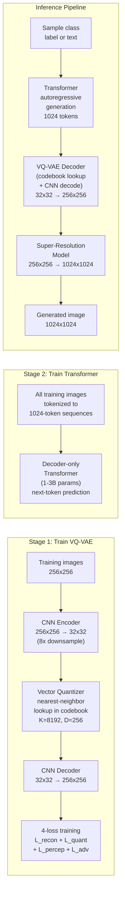

# High-Resolution Image Synthesis GenAI System Design

## Understanding the Problem

High-resolution image synthesis is about generating photorealistic images at resolutions like 1024x1024 or higher. The approach covered here treats images as "sentences" of discrete visual tokens — a VQ-VAE compresses images into a sequence of codebook indices (like converting a photo into LEGO brick codes), and then an autoregressive Transformer generates new images by predicting these tokens one at a time, just like GPT predicts the next word. A super-resolution model then upscales the result to full resolution. This is the architecture behind DALL-E 1, Parti, and VQGAN+Transformer.

What makes this a fascinating system design problem is that it unifies vision and language under a single framework. Once images are tokenized into discrete codes, all the machinery of language modeling — attention, autoregressive decoding, top-k sampling, temperature control — transfers directly to image generation. The core engineering challenges are the quantization quality (how much information is lost when compressing continuous pixels to discrete tokens?), the sequence length problem (a 256x256 image produces 1024 tokens, making O(n^2) attention expensive), and the two-stage pipeline coordination (VQ-VAE tokenizer + Transformer generator must be trained separately but work together).

## Problem Framing

### Clarify the Problem

**Q: Are we doing unconditional image generation or super-resolution?**
**A:** Both are covered by this architecture. The VQ-VAE + Transformer pipeline generates images unconditionally (or conditioned on text/class labels). A separate super-resolution model upscales 256x256 → 1024x1024. Let's focus on the full generative pipeline: tokenize with VQ-VAE, generate with Transformer, upscale with SR model.

**Q: What output resolution do we need?**
**A:** Final output at 1024x1024. The Transformer generates at 256x256 (producing ~1024 tokens), then a super-resolution model performs 4× upscaling. Generating 1024x1024 directly would require ~16,384 tokens and O(n^2) = 268M attention operations per layer — impractical for autoregressive decoding.

**Q: What is the codebook size for the VQ-VAE?**
**A:** 8192 entries. This is a balance between expressiveness (more entries = more visual detail preserved per token) and Transformer vocabulary size (more entries = sparser distribution, harder to model). DALL-E 1 used 8192; smaller codebooks like 1024 lose too much detail at 256x256 resolution.

**Q: Is this text-conditional or unconditional generation?**
**A:** Let's design for class-conditional generation (prepend a class token), with the architecture extensible to text conditioning. Text-to-image conditioning (DALL-E 1 style) adds a text encoder that produces tokens prepended to the image token sequence.

**Q: What is the latency requirement?**
**A:** Offline generation is acceptable — generating a single 1024x1024 image in 5-30 seconds. This is not real-time. The autoregressive approach is inherently sequential (one token at a time), which is the primary latency bottleneck.

**Q: What quality metrics matter most?**
**A:** FID (distribution-level quality and diversity) as the primary automated metric. Human evaluation (Mean Opinion Score) for final quality assessment. Reconstruction quality of the VQ-VAE is measured separately by PSNR and LPIPS to ensure the tokenizer is not the quality bottleneck.

### Establish a Business Objective

#### Bad Solution: Minimize pixel-level reconstruction loss (L2/PSNR)

PSNR measures pixel-level fidelity between the generated image and a reference. Optimizing L2 loss produces blurry images because L2 averages over multiple plausible pixel values. If there are two equally likely edge textures at a given location, L2 outputs their smooth average. A high-PSNR image that looks blurry is worse than a slightly lower-PSNR image that looks sharp and realistic. PSNR does not correlate well with human perception of image quality.

#### Good Solution: Minimize FID between generated and real image distributions

FID measures distribution distance in Inception feature space, capturing both quality (mean shift) and diversity (covariance difference). FID correlates well with human quality judgments and is the standard metric for generative models. It evaluates the generated image distribution holistically rather than individual images.

The limitation: FID requires at least 10K-50K generated samples for stable estimation and does not evaluate individual image quality. A model can achieve good FID by producing many "OK" images while failing catastrophically on specific inputs.

#### Great Solution: Multi-stage evaluation: VQ-VAE reconstruction quality + Transformer generation quality + SR upscaling quality + FID + human evaluation

Evaluate each stage of the pipeline independently. VQ-VAE reconstruction quality (PSNR, LPIPS, codebook utilization) determines the quality ceiling — the Transformer cannot generate images better than what the VQ-VAE can reconstruct. Transformer generation quality (token-level perplexity, sequence-level FID of decoded 256x256 images) measures the autoregressive prior's ability to model the visual token distribution. Super-resolution quality (LPIPS, perceptual quality) measures the upscaling fidelity. End-to-end FID measures the full pipeline. Human evaluation (MOS) on the final 1024x1024 output provides the ground truth.

This decomposition pinpoints quality bottlenecks: if FID is poor but VQ-VAE reconstruction is excellent, the Transformer prior is the problem.

### Decide on an ML Objective

The system has three distinct ML objectives, one per stage:

**Stage 1 — VQ-VAE (image tokenizer):** Learn an encoder-decoder with a discrete codebook. The combined loss:
```
L_VQ-VAE = L_recon + L_quant + lambda_p * L_perceptual + lambda_a * L_adversarial
```
where:
- L_recon = ||x - x_hat||^2 (pixel reconstruction)
- L_quant = ||sg(z_e) - z_q||^2 + beta * ||z_e - sg(z_q)||^2 (codebook + commitment losses)
- L_perceptual = sum_l ||phi_l(x) - phi_l(x_hat)||^2 (VGG feature matching)
- L_adversarial = -log D(x_hat) (PatchGAN discriminator)

**Stage 2 — Autoregressive Transformer:** Next-token prediction over codebook indices:
```
L_transformer = -sum_{t=1}^{N} log p_theta(z_t | z_1, ..., z_{t-1})
```
Standard cross-entropy loss with vocabulary size = codebook size K.

**Stage 3 — Super-resolution:** Conditional image generation from 256x256 → 1024x1024:
```
L_SR = L_pixel + lambda_p * L_perceptual + lambda_a * L_adversarial
```

## High Level Design



The system is a three-stage pipeline. **Stage 1** trains the VQ-VAE image tokenizer: an encoder compresses 256x256 images to a 32x32 grid of continuous latent vectors, the quantizer snaps each vector to its nearest codebook entry (producing 1024 discrete tokens per image), and a decoder reconstructs the image from the quantized tokens. The four-loss training (reconstruction + quantization + perceptual + adversarial) ensures high-fidelity reconstruction with sharp textures. **Stage 2** trains a decoder-only Transformer to model the distribution of image token sequences — it learns which tokens typically follow which, just like a language model learns word sequences. **Stage 3** at inference: the Transformer generates a 1024-token sequence autoregressively, the VQ-VAE decoder converts it to a 256x256 image, and a super-resolution model upscales to 1024x1024.

## Data and Features

### Training Data

**VQ-VAE training (Stage 1):**
- ImageNet (1.3M images, 1000 classes) or OpenImages for general-purpose tokenization
- FFHQ (70K faces, 1024x1024) for face-specific models
- Custom domain data for specialized applications (satellite, medical)
- Images resized and center-cropped to 256x256 for training
- Augmentation: horizontal flip only (preserves image structure)

**Transformer training (Stage 2):**
- The same training set, tokenized through the frozen VQ-VAE encoder
- Each 256x256 image → 32x32 = 1024 codebook indices
- For class-conditional generation: prepend a class token (e.g., ImageNet class ID) to each sequence
- For text-conditional generation (DALL-E 1): prepend BPE-tokenized text (256 text tokens + 1024 image tokens)

**Super-resolution training (Stage 3):**
- HR images at 1024x1024 paired with LR images at 256x256
- Degradation modeling for realistic SR: random blur, noise, JPEG compression, downsampling (not just bicubic)
- Real-ESRGAN's degradation pipeline applies these transformations randomly for robustness

### Features

**VQ-VAE codebook (the discrete visual vocabulary):**
- K = 8192 entries, each D = 256 dimensions
- Each codebook entry represents a prototypical visual pattern (edge type, texture, color region)
- The codebook is learned end-to-end during VQ-VAE training
- Codebook utilization is a critical metric: if only 100 of 8192 entries are used, the tokenizer is under-utilizing its capacity (codebook collapse)

**Image token sequence (input to Transformer):**
- 1024 integers in [0, 8192)
- Raster-scan order: row by row, left to right, top to bottom
- Token embedding: each index is mapped to a learned embedding vector
- Positional encoding: learned absolute positions (1024 positions)
- For conditional generation: class token or text tokens prepended to the image token sequence

## Modeling

### Benchmark Models

**Pixel CNN / PixelRNN:** Directly model the distribution over raw pixels autoregressively. Each pixel depends on all previous pixels. For a 256x256x3 image, this requires generating 196,608 values sequentially — impractically slow. The VQ-VAE tokenization reduces this to 1024 tokens, a 192× reduction.

**Standard VAE (continuous latent space):** Encode images to continuous latent vectors, sample from the posterior, decode. Produces blurry outputs because the reconstruction loss (L2 in pixel space) averages over modes. The VQ-VAE's discrete codebook forces the model to commit to specific visual patterns, producing sharper outputs.

### Model Selection

#### Bad Solution: PixelCNN — direct autoregressive generation over raw pixels

Generate each pixel value autoregressively, conditioned on all previous pixels. Theoretically principled (exact likelihood computation) but impractically slow: a 256x256x3 image requires 196,608 sequential generation steps, each requiring a forward pass. At 5ms per step, that's ~16 minutes per image. Quality is also poor at high resolution because the model must learn extremely long-range dependencies between pixels hundreds of rows apart.

#### Good Solution: Standard VAE with continuous latent space

Encode images to continuous latent vectors, sample from the posterior, decode. Fast generation (single decoder pass). But L2 reconstruction loss produces blurry outputs — when multiple plausible textures exist for a given location, the model averages them. Posterior collapse is a common failure mode where the decoder learns to ignore the latent variable entirely, generating nearly identical images regardless of the latent sample.

#### Great Solution: VQ-VAE + Autoregressive Transformer

Discretize the continuous latent space into codebook entries, forcing the model to commit to specific visual patterns (sharp textures, not blurry averages). The discrete token sequence enables language model machinery — attention, KV-cache, beam search, top-k sampling — to transfer directly to image generation. The 192× sequence length reduction (from 196K pixels to 1024 tokens) makes autoregressive generation feasible. Two-stage training decouples representation learning (VQ-VAE) from distribution modeling (Transformer).

| Approach | Pros | Cons | When to use |
|----------|------|------|-------------|
| PixelCNN | Exact likelihood, theoretically principled | Impractically slow (196K steps per image), poor quality at high res | Historical baseline |
| Standard VAE | Smooth latent space, fast sampling | Blurry outputs, posterior collapse | When interpolation matters more than sharpness |
| VQ-VAE + Transformer | Discrete tokens enable language model machinery, sharp outputs, scalable | Two-stage training, codebook collapse risk, raster-scan ordering | **Best for token-based image generation** |
| Diffusion (DDPM/LDM) | Higher quality, better diversity, spatial parallelism | Slow (50+ denoising steps), no exact likelihood | When quality > speed |
| GAN (StyleGAN) | Single-pass inference, excellent quality | Mode collapse, training instability, limited diversity | When real-time speed is critical |

### Model Architecture

**Component 1 — VQ-VAE (image tokenizer):**

**Encoder:** A CNN that compresses a 256x256x3 image to a 32x32xD grid of continuous latent vectors (8× spatial downsampling). Each of the 1024 spatial positions has a D=256 dimensional vector.

**Vector quantization:** For each of the 1024 continuous vectors z_e, find the nearest codebook entry:
```
k = argmin_j ||z_e - e_j||_2,  j in {1, ..., K}
z_q = e_k
```
This is a non-differentiable operation. The **straight-through estimator (STE)** handles backpropagation: `z_q = z_e + sg(z_q - z_e)`, where sg() is stop-gradient. In the forward pass, z_q (quantized) is used. In the backward pass, gradients flow directly to z_e (as if quantization did not happen). This works because if the codebook is well-trained, z_q ≈ z_e.

**Decoder:** A CNN that reconstructs the 256x256x3 image from the 32x32xD grid of quantized codebook vectors.

**Four-loss training:**
1. **Reconstruction loss** (L_recon = ||x - x_hat||^2): pixel-level fidelity. Alone produces blurry results.
2. **Quantization losses** (L_quant): two terms that keep encoder and codebook aligned:
   - Codebook loss: ||sg(z_e) - z_q||^2 — moves codebook entries toward encoder outputs
   - Commitment loss: beta * ||z_e - sg(z_q)||^2 — moves encoder outputs toward codebook entries (beta ≈ 0.25)
3. **Perceptual loss** (L_perceptual = sum_l ||phi_l(x) - phi_l(x_hat)||^2): VGG feature matching for structural and textural fidelity. This is the key to sharp reconstructions.
4. **Adversarial loss** (PatchGAN discriminator): forces the decoder to produce realistic local textures.

**Component 2 — Autoregressive Transformer (image generator):**

A decoder-only Transformer (GPT-style) trained on image token sequences. The vocabulary is the codebook (size K=8192). The model predicts the next token given all previous tokens:
```
p(z_1, ..., z_N) = product_{t=1}^{N} p(z_t | z_1, ..., z_{t-1})
```

Configuration:
- 24-48 Transformer layers
- d_model = 1024-2048
- 16 attention heads
- Parameters: 1-3B
- Context length: 1024 tokens (for 32x32 grid) or 1280 (256 text tokens + 1024 image tokens for text-conditional)
- Training: standard cross-entropy loss over codebook indices

**Component 3 — Super-resolution model:**

A separate model (typically ESRGAN, diffusion-based SR, or another VQ-VAE) that upscales 256x256 → 1024x1024. Trained with perceptual + adversarial loss for sharp, realistic upscaling. This decouples the generation resolution from the final output resolution.

## Inference and Evaluation

### Inference

**Generation pipeline:**
1. (Optional) Encode conditioning: class label → class token, or text → BPE tokens
2. Autoregressive generation: Transformer generates 1024 codebook indices one at a time
   - Each step: full forward pass through the Transformer, predict distribution over 8192 codebook entries
   - Sampling: top-k (k=100) or top-p (p=0.9) with temperature τ
   - Higher temperature = more diverse but potentially lower quality
3. Codebook lookup: map each of the 1024 indices to its 256-dim codebook vector
4. VQ-VAE decode: CNN decoder converts 32x32x256 → 256x256x3 image
5. Super-resolution: upscale 256x256 → 1024x1024

**Latency analysis:**
| Component | Time |
|-----------|------|
| Transformer generation (1024 steps, each ~5ms) | ~5s |
| Codebook lookup + VQ-VAE decode | ~50ms |
| Super-resolution (ESRGAN) | ~200ms |
| **Total** | **~5.3s** |

The Transformer autoregressive generation dominates latency. Each token requires a full forward pass through the Transformer, and KV-cache must be maintained for all previous tokens. At step t, the attention computation is O(t · d_model), and total generation is O(N^2 · d_model) for N tokens.

**KV-cache management:**
At each generation step, the key and value tensors for all previous tokens are cached. For a 3B-parameter Transformer generating 1024 tokens: cache size ≈ 2 (K+V) × 48 (layers) × 16 (heads) × 128 (d_head) × 1024 (seq_len) × 2 (bytes) ≈ 6.4GB. This must fit in GPU memory alongside the model weights (~6GB at FP16).

### Evaluation

**VQ-VAE reconstruction quality (Stage 1):**

| Metric | What it measures | Target |
|--------|-----------------|--------|
| PSNR | Pixel-level fidelity of reconstruction | >30 dB for 256x256 |
| LPIPS | Perceptual distance (lower = better) | <0.1 |
| Codebook utilization | Fraction of codebook entries used | >90% |
| rFID | FID between reconstructed and original images | <5 |

Codebook utilization is critical: if only 500 of 8192 entries are used, the VQ-VAE is wasting capacity. This is codebook collapse — a failure mode where most entries never get selected.

**Transformer generation quality (Stage 2):**

| Metric | What it measures | Target |
|--------|-----------------|--------|
| Token perplexity | How well the Transformer models the token distribution | Lower is better |
| FID (256x256 decoded images) | Quality and diversity of generated images before SR | <10 |

**End-to-end quality (full pipeline):**

| Metric | What it measures | Target |
|--------|-----------------|--------|
| FID (1024x1024) | Final image quality and diversity | <10 |
| IS (Inception Score) | Quality × diversity | Higher is better |
| Human MOS | Mean Opinion Score from human raters | >4.0 / 5.0 |

## Deep Dives

### ⚠️ Codebook Collapse — The Silent Quality Killer

Codebook collapse occurs when the VQ-VAE's codebook degenerates: most encoder outputs map to a small subset of codebook entries while the remaining entries are never selected. In extreme cases, only 50-100 of 8192 entries are active. This drastically reduces the visual vocabulary available to the Transformer, limiting the diversity and detail of generated images.

Root cause: the codebook and commitment losses may not provide sufficient gradient signal to update inactive entries. Once an entry falls behind (its nearest-neighbor region shrinks), fewer encoder outputs map to it, creating a positive feedback loop where it receives even fewer updates and falls further behind.

Mitigations: (1) EMA codebook updates — instead of gradient-based optimization, update codebook entries as exponential moving averages of the encoder outputs that map to them. This is more stable. (2) Codebook reset — periodically replace unused entries with perturbed copies of the most frequently used entries, forcing the codebook to re-explore. (3) Entropy regularization — add a loss term that encourages uniform codebook usage: L_entropy = -sum_k p(k) log p(k), maximized when all entries are equally used. (4) Larger batch sizes — more encoder outputs per batch means more codebook entries receive updates per training step.

### 💡 The Straight-Through Estimator — Bridging Discrete and Continuous

The quantization step (argmin over codebook) is fundamentally non-differentiable — you cannot compute gradients through a discrete lookup operation. The STE provides a practical workaround: during the backward pass, the gradient of the loss with respect to z_q is copied directly to z_e, bypassing the quantization step entirely.

Why this works: if the VQ-VAE is well-trained, z_q ≈ z_e (the continuous vector is close to its nearest codebook entry). The commitment loss explicitly enforces this closeness, keeping the STE approximation tight. The gradient dL/dz_q is a reasonable approximation of dL/dz_e when the quantization error ||z_e - z_q|| is small.

When it fails: if the codebook entries are far from the encoder outputs (early training, or after codebook collapse), the STE approximation breaks down. The gradient at z_e may point in a direction that is irrelevant after quantization. This is why warm-starting the codebook (initializing entries from k-means clustering of encoder outputs) and using the commitment loss to keep z_e close to z_q are both critical for training stability.

### 📊 Raster-Scan Ordering — The Imposed Sequential Structure

The autoregressive Transformer requires a sequential ordering of the 2D token grid. The standard approach is raster-scan: row by row, left to right, top to bottom. This imposes a left-to-right, top-to-bottom causal structure on image generation — each token can attend to tokens above it and to the left, but not below or to the right.

The problem: this ordering is arbitrary and unnatural for images. A pixel in the middle of a face should depend on context from all directions, not just the upper-left quadrant. The raster-scan ordering introduces an artificial asymmetry — the upper-left corner has no context, while the lower-right corner has full context.

Alternatives: (1) Hilbert curve or Z-order curve scanning, which preserve more spatial locality than raster-scan; (2) multi-scale generation (first generate a coarse 4x4 grid, then refine each cell to 8x8, then to 16x16, etc.); (3) masked image modeling (like BERT for images) — predict randomly masked tokens conditioned on visible ones, avoiding any fixed ordering. The VQ-VAE-2 approach uses a two-level hierarchy: a top-level prior generates a coarse token grid, then a bottom-level prior generates fine tokens conditioned on the coarse ones.

### 🏭 Autoregressive vs. Diffusion — The Architecture Crossroads

The VQ-VAE + Transformer approach and diffusion models represent two fundamentally different paradigms for image generation. The autoregressive approach converts images to discrete tokens and generates them sequentially (like writing a story). Diffusion models start from continuous noise and iteratively denoise (like sculpting from a rough block).

Autoregressive strengths: exact log-likelihood computation (useful for anomaly detection and model comparison), unified text-image architecture (the same Transformer processes both modalities — DALL-E 1 simply concatenates text and image tokens), and mature scaling laws from language modeling that predict performance improvements with scale.

Diffusion strengths: higher sample quality (FID), better diversity (no mode collapse from autoregressive error accumulation), natural spatial parallelism at each denoising step (vs. sequential token generation), and text-conditional generation via classifier-free guidance (simpler than autoregressive text-image concatenation).

The field has largely moved toward diffusion for image generation (DALL-E 2/3, Stable Diffusion, Imagen), but the autoregressive approach persists in multimodal models (Parti, Gemini) where unified text-image token processing is architecturally desirable. Latent diffusion (Stable Diffusion) borrows the VQ-VAE's latent space idea — it runs diffusion in the VQ-VAE's continuous latent space rather than in pixel space, getting the best of both worlds.

### ⚠️ Error Accumulation in Autoregressive Generation

Autoregressive generation samples tokens one at a time, and each token depends on all previous tokens. If the model makes a poor choice at step t (an unlikely codebook index), all subsequent tokens are conditioned on this mistake. Errors accumulate — a wrong token in the upper-left corner can corrupt the entire image structure.

This is more severe for images than for text because images have strong spatial coherence — a face requires symmetry, consistent lighting, and anatomical plausibility across thousands of tokens. A single misplaced token in the eye region can make the entire face look wrong.

Mitigations: (1) nucleus (top-p) sampling rather than greedy or pure random sampling — restricts the token vocabulary to the most probable subset at each step, reducing the chance of pathological tokens; (2) rejection sampling — generate multiple candidate images and select the best using a quality classifier (CLIP score, discriminator score, or FID-proxy); (3) classifier-free guidance adapted for autoregressive models — bias the token probabilities toward class-conditional modes. The two-level VQ-VAE-2 approach also helps: generating a coarse structure first (top-level tokens) and then refining detail (bottom-level tokens) reduces the impact of individual token errors.

### 🏭 Training Data Quality and Curation

The quality of training images determines the quality ceiling of generated images. A VQ-VAE trained on noisy, watermarked, or low-resolution images will produce noisy, watermarked, or blurry reconstructions regardless of the Transformer's capacity.

**Data filtering pipeline:** Start with a large web-scraped corpus (LAION-5B, CC12M). Apply cascading filters: (1) resolution filter (discard images below 256x256), (2) aesthetic score filter (CLIP-based aesthetic predictor, keep score >5/10), (3) watermark/text detection (discard images with visible watermarks or overlaid text), (4) near-duplicate removal (perceptual hash deduplication within a Hamming distance threshold), (5) NSFW classifier (remove adult content unless specifically training for that domain).

**Data deduplication matters more than data size.** Near-duplicate images in training cause the VQ-VAE to overfit on specific patterns and the Transformer to memorize specific sequences. A training set with 5M unique images will produce a better model than 50M images with 90% near-duplicates.

**Copyright considerations:** For production systems, use training data with clear licenses (Creative Commons, public domain) or opt-out mechanisms. The legal landscape for training on copyrighted images is evolving, and using clearly licensed data avoids future liability.

### 💡 Controllability: Conditioning Beyond Text

Class-conditional generation (prepend a class token) provides coarse control. Text-conditional generation (DALL-E 1 style) provides semantic control. But users often want more precise control — "generate this specific layout" or "match this reference image's style."

**Layout conditioning:** Provide a semantic map (segmentation mask) as additional conditioning. The VQ-VAE learns separate codebooks for semantic maps and images, and the Transformer generates both in sequence (semantic tokens first, then image tokens conditioned on semantics). This gives pixel-level spatial control.

**Reference image conditioning (style transfer):** Encode a reference image through the VQ-VAE encoder and use its codebook indices as partial conditioning for the Transformer. The generated image shares visual patterns with the reference while varying in content. This enables "generate a new face with the same lighting and color palette as this reference."

**ControlNet-style conditioning** (adapted for autoregressive models): Provide edge maps, depth maps, or pose skeletons as additional channels. The Transformer receives both control tokens and image tokens, generating image tokens conditioned on the control structure. This is more naturally suited to diffusion models but can be adapted by tokenizing the control signal through a separate VQ-VAE.

### 📊 Resolution Scaling: Multi-Scale Codebooks

Generating higher resolution images (512x512, 1024x1024) directly with a single VQ-VAE + Transformer is impractical — a 512x512 image with the same downsampling produces 4096 tokens, making the O(n^2) attention quadratically more expensive (16× more computation than 256x256).

**VQ-VAE-2 (hierarchical approach):** Use two levels of VQ-VAE — a top-level tokenizer operating at 64x64 (64 tokens) captures global structure (object layout, color scheme), and a bottom-level tokenizer at 256x256 (1024 tokens) captures fine detail (textures, edges). The top-level Transformer generates the coarse structure. A separate bottom-level Transformer generates fine tokens conditioned on the coarse tokens. This factored approach reduces the effective sequence length at each level.

**Tiled generation for arbitrary resolution:** Generate overlapping 256x256 patches and blend them. The VQ-VAE encodes/decodes each patch independently. The Transformer generates each patch conditioned on already-generated neighboring patches (left and above). Blending uses feathered averaging in the overlap region. This scales to arbitrary resolution but introduces visible seam artifacts if the blending is not smooth.

**Super-resolution as a scalability tool:** The cleanest approach is to generate at moderate resolution (256x256, 1024 tokens) and upscale with a dedicated super-resolution model. This decouples generation complexity from output resolution — the SR model adds texture detail and sharpness without increasing the Transformer's sequence length.

### 💡 Latency and Serving Infrastructure

At ~5 seconds per 1024x1024 image, the autoregressive approach is too slow for interactive applications but acceptable for batch generation (marketing assets, stock imagery, training data augmentation).

#### Bad Solution: One request per GPU, synchronous generation

Each image generation request occupies a single GPU for ~5 seconds. At 100 concurrent requests, you need 100 GPUs. GPU utilization is low because the autoregressive generation is memory-bound (limited by KV-cache memory bandwidth), not compute-bound — the GPU's FLOPs are largely idle during each forward pass.

#### Good Solution: Continuous batching across multiple requests

Batch multiple generation requests on the same GPU. While request A is at token 500/1024, request B is at token 200/1024, and request C just started. The GPU processes all active tokens in a single batched forward pass, increasing utilization from <20% to >70%. This requires managing multiple KV-caches concurrently (PagedAttention).

#### Great Solution: Speculative decoding + continuous batching + caching

Apply speculative decoding: a small draft model (50M params) proposes 4-8 tokens per step, the large model verifies them in a single batched pass. With 60% acceptance rate, generation drops from 1024 single-token passes to ~400 combined passes — roughly 2.5× speedup (5s → 2s per image). Combine with continuous batching for multi-request GPU sharing and prefix caching for common conditioning (the same class/text prompt can share KV-cache across multiple image generations).

### ⚠️ Safety and Content Filtering for Generated Images

The generation pipeline can produce harmful content — realistic depictions of violence, NSFW imagery, or photorealistic faces of real people. For production deployment, content filtering is mandatory.

**Pre-generation filtering:** Check the conditioning input (class label or text prompt) against a blocklist. Prompts requesting violence, CSAM, or specific real individuals are rejected before generation begins. This is fast (<1ms) but easy to evade through indirect language.

**Post-generation filtering:** Run a multi-label safety classifier (NSFW, violence, hate symbols, realistic faces) on the generated image before returning it to the user. A ViT-based classifier fine-tuned on safety-labeled data provides >95% detection accuracy with <50ms latency — a negligible overhead given the 5-second generation time.

**Watermarking:** Embed an invisible watermark in all generated images to enable downstream detection of AI-generated content. The watermark should survive JPEG compression, rescaling, and cropping. Approaches include frequency-domain watermarking (embed signal in DCT coefficients) and learned watermarking (train an encoder-decoder pair where the decoder extracts the watermark from compressed/cropped images). Detection accuracy of >99% with false positive rate <0.01% is achievable for robust watermarking schemes.

## What is Expected at Each Level?

### Mid-Level Engineer

A mid-level candidate identifies that the system has two stages (VQ-VAE tokenizer + Transformer generator) and can explain each at a high level. They know that VQ-VAE encodes images into discrete codebook indices and that the Transformer generates new images by predicting these indices autoregressively. They mention FID as the evaluation metric and know that super-resolution is a separate stage for upscaling. They may not be able to explain the straight-through estimator, the four-loss training, or codebook collapse.

### Senior Engineer

A senior candidate explains the VQ-VAE architecture in detail: encoder, vector quantization with nearest-neighbor lookup, decoder, and the four-loss training formula (reconstruction + quantization + perceptual + adversarial). They understand the straight-through estimator and why it is necessary (argmin is not differentiable). They can describe the Transformer's autoregressive generation with cross-entropy loss over the codebook vocabulary. They identify codebook collapse as a failure mode and propose mitigations (EMA updates, codebook reset). They compare autoregressive vs. diffusion approaches with specific tradeoffs (sequential vs. parallel, exact likelihood vs. higher quality).

### Staff Engineer

A Staff candidate quickly establishes the three-stage architecture and focuses on the hard design decisions: why discrete tokens over continuous latents (enables language model machinery, prevents posterior collapse, enables compositional generation), the raster-scan ordering problem and alternatives (Hilbert curves, multi-scale generation, masked modeling), codebook collapse as the primary training failure mode (with root cause analysis and entropy regularization), and the autoregressive error accumulation problem (with top-p sampling and rejection sampling as mitigations). They recognize that the field has shifted toward latent diffusion but identify that the VQ-VAE tokenization concept persists (Stable Diffusion uses a VAE latent space). They frame the design decision as a choice between architectural unification (autoregressive: same model for text and images) and generation quality (diffusion: better FID, diversity, and spatial coherence).

## References

- [Neural Discrete Representation Learning (van den Oord et al., 2017)](https://arxiv.org/abs/1711.00937) — VQ-VAE
- [Generating Diverse High-Fidelity Images with VQ-VAE-2 (Razavi et al., 2019)](https://arxiv.org/abs/1906.00446)
- [Taming Transformers for High-Resolution Image Synthesis (Esser et al., 2021)](https://arxiv.org/abs/2012.09841) — VQGAN
- [Zero-Shot Text-to-Image Generation (Ramesh et al., 2021)](https://arxiv.org/abs/2102.12092) — DALL-E 1
- [Scaling Autoregressive Models for Content-Rich Text-to-Image Generation (Yu et al., 2022)](https://arxiv.org/abs/2206.10789) — Parti
- [ESRGAN: Enhanced Super-Resolution Generative Adversarial Networks (Wang et al., 2018)](https://arxiv.org/abs/1809.00219)
- [Real-ESRGAN: Training Real-World Blind Super-Resolution (Wang et al., 2021)](https://arxiv.org/abs/2107.10833)
