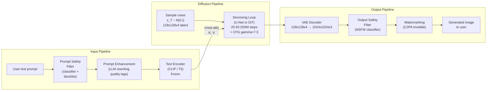

# Text-to-Image Generation GenAI System Design

## Understanding the Problem

Text-to-image generation takes a natural language prompt — "a corgi wearing a top hat, riding a skateboard through a neon city at sunset, oil painting style" — and produces a photorealistic or stylized image matching that description. This is the technology behind DALL-E, Midjourney, and Stable Diffusion. The dominant approach uses diffusion models: start from pure Gaussian noise and iteratively denoise, guided by a text embedding, until a coherent image emerges.

What makes this a compelling system design problem is the intersection of three challenges. First, the generation quality: each diffusion step is a full neural network forward pass, and more steps produce better images but slower generation — 20 steps at ~2 seconds versus 100 steps at ~10 seconds. Second, text-image alignment: simple prompts ("a red apple") work well, but compositional prompts ("a red cube on the left, a blue sphere on the right, with a green cylinder behind") fail even in state-of-the-art systems because the model must correctly bind attributes to objects and maintain spatial relationships. Third, safety: the model can generate photorealistic images of real people, explicit content, copyrighted art styles, and misinformation — requiring multi-layered content safety enforcement.

## Problem Framing

### Clarify the Problem

**Q: What output resolution do we need?**
**A:** 1024x1024 as the default. This is the minimum for modern web and mobile displays. Higher resolutions (2048x2048) for print use cases. Latent diffusion makes this tractable — operating in a compressed latent space (128x128 latents at 8x compression) rather than directly in pixel space.

**Q: What is the latency requirement?**
**A:** Under 5 seconds for interactive generation (user waits for the image). Each DDIM step takes ~100ms on an A100 GPU for a 1024x1024 image in latent space, so 50 steps ≈ 5 seconds. For batch/API generation, 10-30 seconds is acceptable with more steps for higher quality.

**Q: How faithful must the image be to the text prompt?**
**A:** High fidelity for simple prompts (single object, single attribute). The hard case is compositional prompts — multiple objects with distinct attributes and spatial relationships. This is a known weakness of current systems and requires explicit architectural support (attention-based layout control, ControlNet).

**Q: What safety requirements exist?**
**A:** Multi-layered. Block CSAM, graphic violence, and non-consensual intimate imagery (zero tolerance). Block generation of recognizable real individuals without consent. Flag content that closely imitates copyrighted artistic styles. Apply invisible watermarking (C2PA) to all generated images for provenance tracking.

**Q: Do we need style control?**
**A:** Yes — photorealistic, oil painting, watercolor, anime, pencil sketch, and other styles, controlled via the text prompt or a separate style parameter. The model should generate diverse styles without separate fine-tuning for each.

**Q: Is this unconditional or do we need personalization?**
**A:** Start with generic text-conditional generation. Personalization (generating images of a specific person, object, or style) requires additional techniques like DreamBooth or LoRA fine-tuning, which can be layered on top.

### Establish a Business Objective

#### Bad Solution: Minimize FID (Fréchet Inception Distance) on COCO-30K

FID measures how close the distribution of generated images is to the distribution of real images. It captures both quality and diversity. But FID does not measure text-image alignment — a model that generates beautiful images that ignore the prompt will achieve low FID. FID also uses ImageNet-trained Inception features, which may not capture aesthetic quality relevant to generated art.

#### Good Solution: Maximize CLIPScore + minimize FID jointly

CLIPScore = cosine similarity between the CLIP text embedding and the CLIP image embedding. Higher CLIPScore means the generated image better matches the text prompt. Optimizing both FID (image quality) and CLIPScore (text alignment) captures the two primary quality dimensions. Typical good CLIPScore range: 0.28-0.35.

The limitation: CLIPScore inherits CLIP's biases and blind spots. CLIP is better at recognizing objects than spatial relationships ("a red cube on the left" scores similarly whether the cube is on the left or right). And CLIP was trained on web alt-text, which is often generic — it may not distinguish between highly specific prompt details.

#### Great Solution: Multi-dimensional evaluation with FID, CLIPScore, DrawBench human evaluation, compositional benchmarks, and safety metrics

FID for image quality and diversity. CLIPScore for automatic text-image alignment. DrawBench for systematic human evaluation on challenging compositional prompts (spatial relationships, attribute binding, counting, text rendering). T2I-CompBench for automated compositional evaluation. Safety metrics: NSFW leak rate (false negatives of the output safety filter), adversarial prompt success rate, celebrity likeness detection rate. The composition of these metrics determines whether the system is production-ready.

### Decide on an ML Objective

Text-to-image via latent diffusion has three components with distinct objectives:

**VAE (image compressor):** Encode images to a compressed latent space and decode back. Trained with reconstruction loss + KL regularization + perceptual loss + adversarial loss. The VAE is trained separately and frozen during diffusion training.

**Diffusion model (noise predictor):** The core generative model. During training, Gaussian noise is added to latent representations over T=1000 timesteps:
```
q(z_t | z_0) = N(z_t; sqrt(alpha_bar_t) * z_0, (1 - alpha_bar_t) * I)
```
The model epsilon_theta(z_t, t, c) predicts the noise epsilon added at timestep t, conditioned on the text embedding c:
```
L = E_{t, z_0, epsilon, c} [||epsilon - epsilon_theta(z_t, t, c)||^2]
```

**Text encoder (frozen):** CLIP or T5 encodes the text prompt into a sequence of embeddings that condition the diffusion model via cross-attention.

**Classifier-free guidance (CFG):** During training, the text condition is dropped 10-20% of the time (replaced with null embedding). At inference:
```
epsilon_guided = epsilon_theta(z_t, t, null) + gamma * (epsilon_theta(z_t, t, c) - epsilon_theta(z_t, t, null))
```
gamma > 1 amplifies the text-conditioning signal. gamma = 7.5 is typical. Higher gamma = sharper, more text-aligned but less diverse and potentially oversaturated.

## High Level Design



The system has three stages. The **input pipeline** filters the prompt for safety, optionally enhances it (appending quality tags like "highly detailed, 4k"), and encodes it with a frozen text encoder (CLIP or T5). The **diffusion pipeline** starts from pure Gaussian noise in the VAE's latent space (128x128x4 for a 1024x1024 output) and iteratively denoises over 20-50 DDIM steps, with the text embedding injected via cross-attention at every denoising step. CFG with gamma=7.5 amplifies text conditioning. The **output pipeline** decodes the final latent representation to pixel space via the VAE decoder, applies an NSFW safety classifier, embeds an invisible watermark, and returns the image to the user.

The key architectural choice is latent diffusion — running diffusion in the VAE's compressed latent space rather than pixel space. This reduces the spatial dimensions by 8x in each dimension, cutting compute by ~64x and making 1024x1024 generation feasible.

## Data and Features

### Training Data

**Raw dataset:**
- LAION-5B: 5.85 billion image-text pairs scraped from the web (alt-text as captions)
- This is the primary pretraining dataset for open-source diffusion models (Stable Diffusion)

**Data filtering pipeline (critical for quality):**
1. **Deduplication:** Remove exact and near-duplicate images using perceptual hashing (pHash). Duplicates cause the model to memorize specific images.
2. **NSFW/toxicity filter:** Remove harmful, violent, and explicit content using a trained classifier. Zero tolerance for CSAM.
3. **Resolution filter:** Remove images below 256x256. Quality improves with higher minimum resolution.
4. **CLIP score filter:** Remove pairs where CLIPScore(text, image) < 0.28. This removes ~30-40% of pairs that are mismatched (alt-text doesn't describe the image).
5. **Aesthetic score filter:** Score images using a CLIP-based aesthetic predictor (trained on human aesthetic ratings). Keep only the top 10-20% by aesthetic score. This is the single most impactful quality filter.
6. **Watermark detection:** Remove images with visible watermarks (which the model would otherwise learn to reproduce).
7. **Caption enhancement:** Re-caption images with a vision-language model (BLIP-2, CogVLM) for more detailed descriptions. DALL-E 3 showed this dramatically improves prompt following — original alt-text is often generic ("photo"), while VLM-generated captions describe specific content.

**After filtering:** ~600M high-quality, well-captioned pairs from 5.85B raw pairs.

**Aspect ratio bucketing:** Group images by aspect ratio for efficient batching. Padding square images to fit wide or tall aspect ratios wastes compute and introduces artifacts.

### Features

**Text conditioning (the "features" of text-to-image):**
- CLIP text embedding: 77 tokens x 768 dimensions (CLIP ViT-L/14). Good at object recognition, weaker at spatial relationships.
- T5-XXL text embedding: variable length x 4096 dimensions. Stronger text understanding, better compositional reasoning, but larger and slower. Imagen uses T5-XXL and achieves better prompt following than CLIP-conditioned models.
- Dual text encoders: SDXL and SD3 use both CLIP and T5, concatenating their embeddings for complementary strengths.

**Cross-attention injection:**
```
CrossAttn(Q_img, K_text, V_text) = softmax(Q_img * K_text^T / sqrt(d_k)) * V_text
```
Q comes from the noisy image features (spatial positions). K and V come from the text encoder output (text tokens). Each spatial position in the image can attend to all text tokens — learning which words are relevant for that region. When generating a "red apple", the apple-region spatial positions attend strongly to "red" and "apple" tokens.

## Modeling

### Benchmark Models

**GAN-based text-to-image (StackGAN, AttnGAN):** Early approaches used GANs with text conditioning. Produced reasonable images for simple prompts but suffered from mode collapse and could not handle complex compositional prompts. Training was unstable. Largely superseded by diffusion models.

**Autoregressive (DALL-E 1, Parti):** Tokenize images with VQ-VAE, then generate image tokens autoregressively conditioned on text tokens. Exact likelihood computation and unified text-image architecture. But sequential token generation is slow, and quality is generally lower than diffusion. Parti (Google) achieves competitive quality but at much higher compute cost.

### Model Selection

#### Bad Solution: GAN-based generation (AttnGAN, StackGAN)

GANs produce images in a single forward pass, which is fast, but they suffer from mode collapse and cannot handle compositional prompts. Training is unstable and requires careful hyperparameter tuning. Text conditioning is weak — the generator has limited capacity to incorporate fine-grained prompt details, so outputs tend to be generic and blurry for anything beyond simple single-object scenes.

#### Good Solution: Pixel-space diffusion (Imagen)

Pixel-space diffusion paired with a strong text encoder (T5-XXL) achieves excellent prompt following and image quality. The iterative denoising process is stable to train and avoids mode collapse entirely. However, operating directly on 1024x1024x3 pixel tensors is prohibitively expensive — self-attention cost scales quadratically with spatial dimensions, making training and inference slow and memory-hungry without aggressive model parallelism.

#### Great Solution: Latent diffusion with dual text encoders (Stable Diffusion XL / SD3)

Latent diffusion compresses images into a 128x128x4 latent space via a pretrained VAE, cutting compute by ~48-64x while preserving nearly all visual detail. Dual text encoders (CLIP + T5) combine CLIP's visual-semantic alignment with T5's compositional reasoning. This is the production-optimal architecture: fast enough for interactive generation, high enough quality for commercial use, and flexible enough to support ControlNet, LoRA, and other downstream extensions.

| Approach | Pros | Cons | When to use |
|----------|------|------|-------------|
| GAN (AttnGAN) | Fast inference, single forward pass | Mode collapse, poor compositional control, unstable training | Legacy, or real-time applications |
| Autoregressive (DALL-E 1) | Exact likelihood, unified text-image architecture | Slow sequential generation, lower quality than diffusion | When unified text-image modeling matters |
| Pixel-space diffusion (Imagen) | Highest quality, strong text understanding with T5 | Very expensive compute (operating on full-resolution pixels) | When compute budget is unconstrained |
| **Latent diffusion (Stable Diffusion)** | 64x compute reduction, high quality, open-source | VAE compression introduces slight quality loss | **Best for production deployment** |

### Model Architecture

**Architecture: Latent Diffusion Model (LDM)**

**Component 1 — VAE (pretrained, frozen):**
Encoder: 1024x1024x3 → 128x128x4 (8x spatial compression, 4 latent channels).
Decoder: 128x128x4 → 1024x1024x3.
Trained with reconstruction + KL + perceptual + adversarial loss. Frozen during diffusion training.

**Component 2 — Denoising network (the core model):**

*U-Net architecture (SD v1/v2):*
Encoder-decoder with skip connections. Each block contains ResNet layers, self-attention, and cross-attention (for text conditioning). The U-Net processes the noisy latent z_t and outputs a noise prediction epsilon_theta. ~860M parameters for SD v1.5.

*DiT architecture (SD3, DALL-E 3, Flux, Sora):*
Patchify the latent → Transformer blocks (self-attention + cross-attention + FFN) → unpatchify. Scales better than U-Net (log-linear scaling like language Transformers). Handles variable resolutions more naturally. The newer trend.

**Component 3 — Text encoder (frozen):**
CLIP ViT-L/14 or T5-XXL. Encodes the text prompt into a sequence of embeddings that serve as K, V in cross-attention.

**Training:**
```
L = E_{t, z_0, epsilon, c} [||epsilon - epsilon_theta(z_t, t, c)||^2]
```
Simple MSE on noise prediction. The text condition c is dropped 10-20% of the time (replaced with null embedding) to enable classifier-free guidance at inference.

**Noise schedule:** Linear or cosine schedule for beta_t. Cosine schedule provides more uniform signal-to-noise ratio across timesteps, improving quality at early timesteps.

## Inference and Evaluation

### Inference

**DDIM sampling (fast deterministic generation):**
DDPM uses 1000 steps with stochastic noise injection at each step. DDIM reformulates the reverse process as a deterministic ODE, enabling generation in 20-50 steps with near-equal quality:
```
z_{t-1} = sqrt(alpha_bar_{t-1}) * z_0_pred + sqrt(1 - alpha_bar_{t-1}) * epsilon_theta
```
where z_0_pred = (z_t - sqrt(1-alpha_bar_t) * epsilon_theta) / sqrt(alpha_bar_t).

DDIM is deterministic: the same noise and prompt always produce the same image. This enables reproducible generation and latent interpolation.

**Latency budget (1024x1024, A100 GPU):**

| Component | Time |
|-----------|------|
| Text encoding (CLIP) | ~10ms |
| DDIM denoising (50 steps × ~100ms each) | ~5s |
| VAE decoding | ~50ms |
| Safety filter + watermarking | ~100ms |
| **Total** | **~5.2s** |

CFG doubles the compute per step (two forward passes: conditional + unconditional), but the two passes can be batched together. With batched CFG, the overhead is ~60% rather than 100%.

**Serving at scale:**
- GPU cluster with A100/H100 GPUs
- Request queue with priority tiers (paid users get priority)
- Async generation: user submits prompt, receives a job ID, polls for completion
- Dynamic batching: group multiple generation requests into a single GPU batch
- Model sharding: large DiT models (>3B parameters) may require tensor parallelism across 2-4 GPUs

### Evaluation

#### Bad Solution: FID-only evaluation on COCO-30K

FID captures distributional quality and diversity but is blind to text-image alignment. A model that generates beautiful, diverse images while completely ignoring the prompt can achieve a low FID. FID also uses Inception-v3 features trained on natural photos, which may not capture the qualities that matter for stylized or artistic generation.

#### Good Solution: FID + CLIPScore + human A/B testing

Adding CLIPScore captures text-image alignment, and human A/B testing catches quality dimensions that no automated metric measures — aesthetic appeal, artifact detection, prompt faithfulness for complex compositions. This covers the primary axes of quality but still misses systematic compositional failures and safety regression.

#### Great Solution: Multi-axis automated monitoring (FID, CLIPScore, T2I-CompBench) + structured human evaluation (DrawBench/PartiPrompts) + continuous safety red-teaming

Automated metrics run on every model checkpoint for regression detection. T2I-CompBench specifically tests attribute binding and spatial reasoning — the failure modes that FID and CLIPScore miss. DrawBench human evaluations run per-release with Elo rankings. Safety metrics (NSFW leak rate, adversarial prompt success rate, celebrity likeness detection) are tracked as first-class evaluation signals alongside quality metrics.

**Automated Metrics:**

| Metric | What it measures | Target |
|--------|-----------------|--------|
| FID (COCO-30K) | Image quality and diversity vs. real image distribution | <10 |
| CLIPScore | Cosine similarity between CLIP text and image embeddings | >0.30 |
| IS (Inception Score) | Image quality × class diversity | Higher is better |

**Compositional Evaluation:**
- DrawBench: 200 challenging prompts testing spatial reasoning, attribute binding, counting, and text rendering. Evaluated by human raters comparing two models side-by-side.
- T2I-CompBench: automated compositional evaluation using object detection and attribute classifiers to verify spatial layout, attribute binding, and object presence.

**Human Evaluation:**
- Side-by-side A/B tests: show two images from different models for the same prompt, raters pick preference
- Elo rating system (like Chatbot Arena) across thousands of comparisons
- Evaluate on multiple dimensions: overall quality, prompt faithfulness, aesthetic appeal, absence of artifacts

**Safety Evaluation:**
- NSFW leak rate: what fraction of harmful prompts bypass the input filter + output filter?
- Red-teaming: adversarial prompt crafting to test jailbreak resistance
- Celebrity likeness detection: run face recognition on outputs and check for high similarity to known individuals

## Deep Dives

### 💡 Classifier-Free Guidance — The Creativity-Fidelity Dial

CFG is the most important inference-time control in text-to-image. The guided noise prediction is:
```
epsilon_guided = epsilon_uncond + gamma * (epsilon_cond - epsilon_uncond)
```

At gamma=1 (no guidance), the model generates diverse images but may ignore the prompt. At gamma=7.5 (standard), images are sharp and text-aligned. At gamma>15, images become oversaturated — colors are too vivid, contrast is exaggerated, and artificial patterns emerge. The reason: high gamma amplifies the conditional signal beyond what the model was trained to produce, pushing the generation into out-of-distribution regions.

The computational cost is significant: CFG requires two forward passes per denoising step (one with the text condition, one without). This doubles the per-step compute. The two passes can be batched together (doubling batch size instead of doubling steps), which is more efficient on GPUs with sufficient memory.

For production, expose the guidance scale as a user-facing parameter ("creativity" slider) and set appropriate bounds: gamma in [1, 15]. Below 3 is "dreamy/abstract"; above 10 is "precise but intense."

### ⚠️ Compositional Failure — The Attribute Binding Problem

Text-to-image models consistently fail on compositional prompts that require binding specific attributes to specific objects. "A red cube and a blue sphere" may produce a blue cube and a red sphere, or both objects in the same color. "Three cats sitting on a mat" may produce two cats or five cats. "A clock showing 3:45" will almost certainly show the wrong time.

Root cause: cross-attention operates at the token level, but binding ("red" goes with "cube", not "sphere") requires compositional reasoning that the attention mechanism does not explicitly enforce. The model learns statistical correlations (red things, blue things, cubes, spheres) but not structured attribute-object binding.

Mitigations: (1) Attend-and-Excite — modify attention maps during inference to ensure each object token receives sufficient attention in the spatial layout; (2) ControlNet — provide a spatial layout sketch that specifies where each object should appear; (3) better caption training — DALL-E 3's key insight was that re-captioning training images with detailed, structured descriptions (explicitly binding attributes to objects) dramatically improved compositional faithfulness; (4) layout-to-image models — first generate a bounding box layout from the text, then generate the image conditioned on both text and layout.

### 📊 Latent Diffusion — The Compute Efficiency Breakthrough

Operating diffusion in the VAE's latent space rather than pixel space is the single most important engineering decision in modern text-to-image systems. For a 1024x1024x3 image, pixel-space diffusion operates on 3,145,728 values per denoising step. Latent diffusion with 8x compression operates on 128x128x4 = 65,536 values — a 48x reduction. The self-attention cost in the U-Net/DiT scales quadratically with spatial dimensions, so the actual compute savings are even larger.

The tradeoff: the VAE introduces a compression bottleneck. Fine details that are lost in VAE encoding cannot be recovered by diffusion. The VAE's reconstruction quality sets a ceiling on generation quality. This is why VAE training matters: a VAE with poor reconstruction (high LPIPS, visible artifacts) will produce a text-to-image system with the same artifacts regardless of how good the diffusion model is.

Modern systems use a VAE with 4 latent channels (SD v1) or 16 latent channels (SD3) for higher fidelity. More channels = less compression loss but larger latent tensors = more diffusion compute.

### 🏭 Data Quality — Re-Captioning as the Key Innovation

DALL-E 3 demonstrated that the quality of training captions matters more than model architecture for prompt following. Web-scraped alt-text is typically generic and uninformative ("photo", "image", "picture of something"). When the diffusion model trains on these vague captions, it learns weak text-image associations — the conditioning signal is noisy.

The solution: re-caption the entire training set using a vision-language model (BLIP-2, CogVLM) that generates detailed, accurate descriptions of each image. Instead of "dog in park", the re-caption produces "A golden retriever with a red collar standing on freshly mowed grass in a suburban park, with oak trees in the background." Training on these detailed captions teaches the model to follow specific, detailed prompts.

This is a data engineering insight, not a model architecture insight — the same diffusion model trained on better captions produces dramatically better prompt following. The compute cost of re-captioning billions of images is significant (hundreds of thousands of GPU-hours for VLM inference), but it is a one-time cost that improves all downstream model training.

### ⚠️ Safety — Multi-Layered Content Control

Text-to-image safety requires defense in depth because no single filter is sufficient.

**Input layer (prompt filter):** A text classifier + keyword blocklist that flags harmful prompts before generation. Fast (<10ms) but bypassable via paraphrasing, foreign languages, or typos ("n*de" bypasses exact match).

**Training layer (data filtering):** Remove harmful content from training data so the model cannot generate it. But the model can compose learned concepts in novel ways — it can generate harmful content from combinations of individually benign training examples.

**Output layer (image classifier):** An NSFW classifier on generated images catches content that bypassed the input filter. Must be fast enough to run on every generation. Threshold tuning is a precision-recall tradeoff: too aggressive = false positives on benign content (frustrated users); too lenient = harmful content leaks through.

**Provenance layer (watermarking):** Invisible watermarks (C2PA standard) embedded in every generated image. Enables downstream detection of AI-generated content and traces images back to the source model and generation timestamp.

### ⚠️ Training Data Quality — Beyond Filtering to Governance

LAION-5B is the backbone of open-source diffusion models, but raw LAION data is a minefield. Despite filtering, studies have found CSAM, non-consensual intimate images, copyrighted artwork, and personally identifiable information in the dataset. The filtering pipeline described earlier (CLIP score, aesthetic score, NSFW classifier) catches the obvious problems, but edge cases slip through at scale — a 99.9% accurate filter still passes 5.85 million problematic images from a 5.85 billion image dataset.

Data poisoning is an emerging threat. An attacker who controls even a small fraction of training images can embed backdoors — for example, associating a rare trigger phrase with a specific visual pattern. Nightshade demonstrated that "poisoned" images optimized to confuse the model's learned representations can degrade generation quality for targeted concepts with as few as 100 poisoned samples in a billion-image dataset. Defense requires both input validation (detecting adversarial perturbations in training images) and output monitoring (detecting sudden quality drops for specific concepts).

Copyright is the legal front. Models trained on copyrighted art can reproduce recognizable stylistic elements, and artists have filed lawsuits (Stability AI, Midjourney, DeviantArt). Opt-out mechanisms like Spawning's "Have I Been Trained?" allow artists to flag images for removal, but enforcement is inconsistent. The production-safe approach: maintain a copyright blocklist, honor opt-out requests within a defined SLA, and document the provenance of all training data for legal defensibility. Some organizations (Adobe Firefly) train exclusively on licensed or public domain data, accepting lower diversity for legal safety.

### 💡 Controllability Beyond Text — Spatial, Structural, and Reference-Based Conditioning

Text prompts alone cannot express precise spatial layouts, structural constraints, or visual references. Saying "a person standing on the left with a dog on the right" gives the model a hint, but cross-attention does not enforce spatial positioning. Controllability extensions solve this by adding extra conditioning signals to the diffusion process without retraining the base model.

ControlNet adds a trainable copy of the encoder blocks that takes a spatial control signal — edge maps (Canny), depth maps, pose skeletons, segmentation masks — and injects it into the frozen base model via zero-convolution layers. The key design insight is that the zero-convolutions are initialized to zero, so the ControlNet starts as a no-op and gradually learns to influence the base model during fine-tuning. This means the base model's generation quality is fully preserved at initialization. Multiple ControlNets can be composed (pose + depth + edge) by summing their outputs, enabling multi-modal control. Training a ControlNet requires ~50K-200K paired examples (image + control signal) and takes a few GPU-days — orders of magnitude cheaper than training the base model.

IP-Adapter provides reference-image conditioning. Instead of describing a style or subject in words, the user provides a reference image, and IP-Adapter extracts CLIP image features and injects them via decoupled cross-attention (separate attention layers for text and image features). This enables style transfer, subject consistency across multiple generations, and visual concept combination — all without fine-tuning. Inpainting extends controllability further: the user masks a region of an existing image, and the model regenerates only the masked region conditioned on the surrounding context and a text prompt. The technical mechanism is straightforward — the unmasked regions are fixed in latent space at each denoising step, and the model only predicts noise for the masked region.

### 📊 Evaluation Beyond FID — Measuring What Actually Matters

FID is the standard automated metric, but it has well-documented blind spots that make it dangerous as a sole evaluation signal. FID uses Inception-v3 features trained on ImageNet — a dataset of natural photographs. These features may not capture aesthetic quality, stylistic coherence, or fine-grained details that matter for generated art. FID also requires a large reference set (typically 30K real images from COCO) and is sensitive to the choice of reference distribution. A model that generates perfect photorealistic images will score poorly on FID if the reference set is artistic illustrations.

Human preference studies remain the gold standard. DrawBench (Google, 2022) defines 200 prompts across 11 categories — spatial reasoning, counting, attribute binding, text rendering, rare words — and evaluates models via side-by-side human comparisons. PartiPrompts (Google, 2022) extends this to 1600+ prompts with explicit difficulty levels. The Elo rating approach (similar to Chatbot Arena for LLMs) aggregates thousands of pairwise human comparisons into a single ranking. The cost is significant — thousands of human ratings per model comparison — but this is the only reliable way to measure generation quality for production deployment decisions.

T2I-CompBench (Huang et al., 2023) automates compositional evaluation without human raters. It uses object detection models to verify object presence, attribute classifiers to verify color/shape/texture binding, and spatial relationship detectors to verify layout. This catches the attribute binding failures that FID and CLIPScore miss entirely — CLIPScore gives similar scores to "a red cube and a blue sphere" whether the colors are correctly bound or swapped. For production monitoring, a combination is necessary: FID and CLIPScore for continuous automated tracking, T2I-CompBench for compositional regression detection, and periodic human evaluation (monthly or per-release) for overall quality validation.

### 🏭 Latency Optimization — From 50 Steps to 4 Steps

Standard DDIM sampling at 50 steps takes ~5 seconds on an A100 for a 1024x1024 image. For interactive applications (real-time editing, conversational image generation), this is too slow. Three families of techniques reduce step count without catastrophic quality loss.

Progressive distillation trains a student model to match the output of two teacher steps in a single student step. By repeatedly halving the step count (50 → 25 → 12 → 6 → 3), the student learns to take larger denoising jumps. Each halving round requires a full training run on the distilled teacher, so the total compute cost is significant, but the resulting model generates in 4-8 steps with quality close to 50-step DDIM. Consistency models (Song et al., 2023) take a different approach: train the model to map any point on the denoising trajectory directly to the clean image in a single step. The training objective enforces that f(z_t, t) = f(z_{t'}, t') for any two points on the same trajectory. Consistency models can generate in 1-2 steps but with noticeable quality degradation compared to multi-step diffusion — fine details are blurry and textures are less coherent.

Latent Consistency Models (LCM) combine consistency distillation with latent diffusion, achieving 1-4 step generation in the latent space. LCM-LoRA makes this particularly practical: a LoRA adapter (~67MB) that converts any SDXL-compatible model into a fast 4-step generator without full retraining. The quality-speed tradeoff is clear — 1 step produces recognizable but rough images, 4 steps approach 20-step quality for most prompts, and 8 steps are nearly indistinguishable from 50-step DDIM. For production, the right strategy depends on the use case: real-time previews at 1-2 steps, interactive generation at 4 steps, and final high-quality output at 20-50 steps. Some systems offer all three as user-selectable quality tiers.

### 🔄 Personalization — Teaching the Model New Concepts

Users want to generate images of their specific pet, their face, their product, or in their preferred artistic style. The base model has never seen these specific subjects, so it cannot generate them from text alone. Personalization techniques teach the model new visual concepts from a handful of reference images (typically 3-15).

DreamBooth fine-tunes the entire U-Net (or DiT) on the reference images, associating them with a rare token identifier (e.g., "a photo of [V] dog"). The model learns to generate the specific subject in novel contexts ("a [V] dog wearing a spacesuit on Mars"). DreamBooth produces the highest subject fidelity because it updates all model weights, but this is also its weakness: fine-tuning takes 5-10 minutes on an A100, produces a full model checkpoint (~2-4GB for SD v1.5), and risks catastrophic forgetting — the model may lose the ability to generate other concepts if over-trained. A prior preservation loss mitigates this by mixing in class-level generations ("a dog") during fine-tuning to prevent the model from collapsing all dog knowledge onto the specific subject.

Textual Inversion takes a minimalist approach: freeze the entire model and only learn a new embedding vector for a placeholder token. This is fast (minutes), produces tiny outputs (~4KB per concept), and cannot damage the base model. But the expressiveness is limited — the learned embedding can capture style and rough appearance but often fails to reproduce fine details of a specific subject. LoRA (Low-Rank Adaptation) sits in the middle: it inserts small trainable low-rank matrices into the attention layers, updating only 1-5% of parameters. LoRA adapters are compact (~10-100MB), train in 10-30 minutes, and produce subject fidelity approaching DreamBooth without the forgetting risk. LoRA has become the dominant personalization method in practice because it hits the best tradeoff — multiple LoRA adapters can be loaded and combined at inference time (style LoRA + subject LoRA), enabling compositional personalization that neither DreamBooth nor Textual Inversion support cleanly.

## What is Expected at Each Level?

### Mid-Level Engineer

A mid-level candidate correctly describes the diffusion process (forward noise addition, backward denoising) and knows that the model predicts noise at each timestep with MSE loss. They identify CLIP as the text encoder and know that FID and CLIPScore are the primary evaluation metrics. They can draw a system diagram with text encoder, diffusion model, and VAE decoder. They mention safety as a concern but may not go deep on specific failure modes (compositional failures, adversarial prompts) or architectural choices (U-Net vs. DiT, latent vs. pixel space).

### Senior Engineer

A senior candidate explains classifier-free guidance mathematically (epsilon_guided = epsilon_uncond + gamma * (epsilon_cond - epsilon_uncond)) and understands the quality-diversity tradeoff it controls. They describe latent diffusion and why it reduces compute by ~64x compared to pixel-space diffusion. They know DDIM enables 20-50 step generation vs. DDPM's 1000 steps. They identify the compositional failure mode (attribute binding) and propose specific mitigations (Attend-and-Excite, ControlNet, better captioning). They can estimate GPU memory and latency for serving. They distinguish between U-Net and DiT and know that DiT scales better.

### Staff Engineer

A Staff candidate quickly establishes the latent diffusion architecture and focuses on what makes text-to-image hard in production: the data quality insight (re-captioning is more impactful than architecture changes for prompt following), the compositional reasoning failure (not a model capacity problem but a fundamental limitation of cross-attention-based conditioning), and the multi-layered safety architecture (input filter + data filtering + output classifier + watermarking, with each layer covering different failure modes). They recognize that the VAE reconstruction quality sets the quality ceiling for the entire system and discuss the latent channel count tradeoff. They identify that the field is moving from U-Net to DiT for better scaling, and that the guidance scale is the primary user-facing quality parameter.

## References

- [Denoising Diffusion Probabilistic Models (Ho et al., 2020)](https://arxiv.org/abs/2006.11239) — DDPM
- [Denoising Diffusion Implicit Models (Song et al., 2021)](https://arxiv.org/abs/2010.02502) — DDIM
- [High-Resolution Image Synthesis with Latent Diffusion Models (Rombach et al., 2022)](https://arxiv.org/abs/2112.10752) — Stable Diffusion
- [Photorealistic Text-to-Image Diffusion Models with Deep Language Understanding (Saharia et al., 2022)](https://arxiv.org/abs/2205.11487) — Imagen
- [Improving Image Generation with Better Captions (Betker et al., 2023)](https://cdn.openai.com/papers/dall-e-3.pdf) — DALL-E 3
- [Scalable Diffusion Models with Transformers (Peebles & Xie, 2023)](https://arxiv.org/abs/2212.09748) — DiT
- [Classifier-Free Diffusion Guidance (Ho & Salimans, 2022)](https://arxiv.org/abs/2207.12598)
- [Learning Transferable Visual Models From Natural Language Supervision (Radford et al., 2021)](https://arxiv.org/abs/2103.00020) — CLIP
