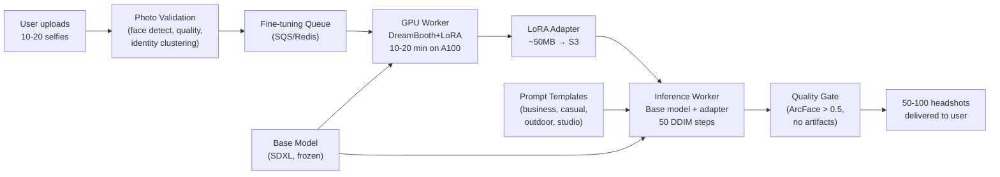

# Personalized Headshot Generation — ML System Design

## Understanding the Problem

AI headshot apps like Lensa, Remini, and HeadshotPro have created a new category: upload a handful of selfies, and receive dozens of professional-quality portraits in styles you never posed for. The technical challenge is harder than standard text-to-image generation. Stable Diffusion can generate "a person in a business suit," but it cannot generate *you* in a business suit — your specific jawline, eye shape, skin tone, and smile. Bridging from "any face" to "your face" requires per-user model adaptation, and doing that for millions of users at production scale introduces infrastructure challenges that dwarf the ML problem itself.

## Problem Framing

### Clarify the Problem

**Q:** What exactly does the system produce? Are we generating full-body images or just headshots?
**A:** Professional headshots — face and shoulders, occasionally waist-up. Think LinkedIn profile photos, corporate team pages, acting portfolios. Not full-body fashion shots.

**Q:** How many input photos does the user provide, and how many outputs do they receive?
**A:** The user uploads 10-20 selfies. The system delivers 50-100 headshots across various styles (formal business, casual, outdoor, studio lighting, artistic).

**Q:** What is the latency budget? How long can the user wait?
**A:** Users expect results within 30-60 minutes. This is an asynchronous batch job, not a real-time API. The user submits photos, goes about their day, and gets a notification when results are ready.

**Q:** How strict is the identity preservation requirement?
**A:** A stranger viewing the generated headshot should confidently say it depicts the same person as the input photos. This is the core product value — if the headshot doesn't look like you, it's useless.

**Q:** What is the scale? How many users per day?
**A:** Let's design for 100,000 users per day, with a path to 1M+. Each user requires per-user model adaptation, so this is 100K fine-tuning jobs per day.

**Q:** What are the safety requirements?
**A:** No NSFW content. No deepfake-style misuse — users must only generate headshots of themselves, not of other people (celebrities, ex-partners). GDPR-compliant data deletion on request.

### Establish a Business Objective

#### Bad Solution: Download count

Users download all generated headshots regardless of quality, then delete the ones they don't like. High downloads don't mean satisfaction. A user who downloads 50 images, keeps 2, and never returns is a failure — but download count says they loved the product. This metric is entirely disconnected from actual value delivery.

#### Good Solution: Selection rate

Track what percentage of generated headshots the user actually selects for their profile, shares, or downloads for use. A 20% selection rate (10 out of 50) is decent; below 5% indicates the system is generating low-quality or off-identity results. This measures whether the user found the output useful, not just whether they received it.

The limitation: selection rate doesn't capture identity accuracy. A user might select images that look great but don't look like them — if they use those headshots on LinkedIn and colleagues don't recognize them, the product failed even though selection rate was high.

#### Great Solution: Identity-verified satisfaction

Combine automated identity preservation score (ArcFace cosine similarity > 0.6 between generated headshots and input photos) with user satisfaction signals (selection rate, repeat purchases, NPS). A user who selects 15+ headshots AND whose selections all have ArcFace scores > 0.7 represents genuine product value. Track this alongside return rate (users who come back for another session within 6 months).

### Decide on an ML Objective

This is **subject-driven text-to-image generation**. Given reference images of a specific person and a text prompt describing the desired style, generate new images of that person in the prompted context.

The ML objective has two competing components:

1. **Identity fidelity** — generated images must look like the specific user, not just "a plausible person"
2. **Style controllability** — the system must follow style prompts (business suit, outdoor, studio lighting) while preserving identity

The concrete training objective is the DreamBooth loss with prior preservation:

```
L = L_instance + λ · L_prior

L_instance = E[||ε - ε_θ(x_t, t, c("[V] person"))||²]   ← learn the user's face
L_prior    = E[||ε - ε_θ(x_t^c, t, c("person"))||²]      ← don't forget other faces
```

where `[V]` is a rare token (e.g., "sks") associated with the specific user, and x^c are class images generated by the base model before fine-tuning.

## High Level Design



The system has three pipelines: (1) **data ingestion** validates and preprocesses uploaded photos, (2) **fine-tuning** runs DreamBooth+LoRA on a GPU worker to create a per-user adapter, (3) **inference** loads the base model + user adapter and generates headshots from a prompt template library. A quality gate filters outputs using ArcFace identity scores before delivery.

## Data and Features

### Training Data

**Per-user input data:**
- 10-20 user selfies, uploaded once per session
- Face detection (RetinaFace) extracts and aligns face crops to 512x512
- Quality filtering rejects: blurry images (Laplacian variance < 100), extreme face angles (> 30 degree yaw/pitch), face too small (< 150x150 bounding box), occluded faces
- Identity verification: ArcFace embeddings clustered with DBSCAN — if >1 cluster detected, reject with "multiple people detected"
- Diversity check: if average pairwise ArcFace similarity > 0.95, prompt user to add more varied photos (different poses, lighting)

**Class-prior images (for prior preservation loss):**
- 200-400 images generated by the base model using the prompt "a photo of a person"
- Generated once and cached — shared across all users
- These prevent catastrophic forgetting during fine-tuning

**Data augmentation (applied during fine-tuning):**
- Brightness/contrast jitter +/- 20%
- Random crop (maintaining face region)
- Do NOT use horizontal flip — faces have meaningful asymmetries, and flipping creates inconsistent orientation in generated outputs

### Features

For subject-driven generation, the "features" are the model's internal representations rather than handcrafted feature vectors.

**Identity representation:**
- Rare token `[V]` = "sks" — a token with minimal prior associations in the model's vocabulary
- The fine-tuning process teaches the model to associate "sks person" with the user's specific facial features
- This encoding lives in the adapted attention weights (LoRA matrices) and implicitly captures identity

**Style conditioning:**
- Text prompts from a curated template library: "a professional headshot of sks person in a formal business suit, studio lighting"
- Classifier-free guidance (CFG) scale controls the identity-style tradeoff: lower gamma (5-7) preserves identity more strongly; higher gamma (9-12) follows the style prompt more aggressively but risks identity drift
- Negative prompts exclude artifacts: "blurry, low quality, deformed face, extra fingers"

**Quality signals (post-generation filtering):**
- ArcFace identity score: cosine similarity between generated face embedding and mean input face embedding
- Aesthetic score: LAION-Aesthetics CLIP-based scorer (target > 6/10)
- Face detection confidence: RetinaFace must detect exactly one face with confidence > 0.9

## Modeling

### Benchmark Models

**Textual Inversion (simplest baseline):** Learn a single embedding vector v* in R^768 for the token [V], keeping all model weights frozen. Only ~768 parameters. Trains in 1-2 minutes. Works for textures and artistic styles but cannot capture complex facial identity — the 768-dimensional embedding is too low-capacity to encode fine-grained face geometry.

**Full DreamBooth (quality ceiling):** Fine-tune the entire U-Net (~860M parameters for SD 1.5, ~2.6B for SDXL) with prior preservation loss. Highest identity fidelity but requires ~3.5-5GB storage per user and 20-60 minutes of GPU time. Not practical at 100K users/day.

### Model Selection

#### Bad Solution: Textual Inversion — learn a single embedding vector

Learn a single 768-dimensional embedding v* for the token [V], keeping all model weights frozen. Only ~768 parameters to train. Fast (1-2 minutes) and extremely lightweight. But 768 dimensions cannot encode the fine-grained facial geometry that distinguishes one person from another. Textual Inversion captures rough attributes (hair color, skin tone, glasses) but fails on identity-critical features (jawline shape, eye spacing, nose bridge). Generated faces look "vaguely like" the user but wouldn't pass a friend's recognition test.

#### Good Solution: LoRA alone (without DreamBooth loss)

Inject low-rank adapter matrices into the U-Net attention layers. Train with standard diffusion loss on user photos. More capacity than Textual Inversion (2-25M parameters depending on rank), better identity capture. But without the prior preservation loss from DreamBooth, the model is prone to catastrophic forgetting — after training on 15 photos of one person, all "person" prompts generate that person's face. The model loses its ability to generate diverse faces, limiting style variety.

#### Great Solution: DreamBooth + LoRA (r=16)

Combines DreamBooth's dual-loss training (identity fidelity + prior preservation) with LoRA's parameter efficiency. The rare token [V] anchors the identity, the prior preservation loss prevents catastrophic forgetting and language drift, and LoRA constrains the update to ~12M parameters (~50MB storage). This achieves near-full-DreamBooth identity quality at 1/50th the storage cost, making per-user adaptation feasible at 100K users/day.

| Approach | Parameters | Training Time | Storage/User | Identity Quality | Scalability |
|----------|-----------|---------------|-------------|-----------------|-------------|
| Textual Inversion | ~768 | 1-2 min | ~3 KB | Moderate (textures only) | Excellent |
| LoRA (r=4-8) | 2-4M | 5-15 min | 10-50 MB | Good | Good |
| LoRA (r=16-32) | 8-25M | 10-20 min | 50-100 MB | Very good | Moderate |
| Full DreamBooth | 860M-2.6B | 20-60 min | 3.5-5 GB | Best | Poor |
| DreamBooth+LoRA | 8-25M | 10-20 min | 50-100 MB | Near-best | Good |

### Model Architecture

**Production choice: DreamBooth + LoRA (r=16)**

This combines DreamBooth's dual-loss training objective with LoRA's parameter-efficient adaptation.

**Base model:** SDXL (Stable Diffusion XL) — pretrained text-to-image diffusion model with U-Net denoiser, VAE encoder/decoder, and CLIP text encoder.

**LoRA adaptation:** Inject low-rank matrices into the Q, K, V, O projection matrices of every attention layer in the U-Net:

```
W_fine-tuned = W_0 + B · A

W_0 ∈ R^{d × k}     (frozen base weights)
B   ∈ R^{d × r}     (trainable, r=16)
A   ∈ R^{r × k}     (trainable, r=16)
```

For d=k=4096 and r=16: each adapted layer adds 2 x 16 x 4096 = 131K parameters instead of modifying 16.7M. Across ~64 attention layers, total adapter size is ~12M parameters (~50MB at FP16).

**Training loss:** DreamBooth's dual objective applied to LoRA weights only:

```
L = L_instance + λ · L_prior,    λ = 1.0

L_instance = E[||ε - ε_θ(x_t^u, t, c("sks person"))||²]
L_prior    = E[||ε - ε_θ(x_t^c, t, c("person"))||²]
```

The prior preservation loss is critical. Without it, two distinct failure modes emerge:

1. **Catastrophic forgetting:** The model can no longer generate plausible images for "a person" — all outputs look like the specific user regardless of prompt
2. **Language drift:** The token "person" in the model's cross-attention weights shifts toward user-specific features, so even prompts without the rare token produce the user's face

**Training hyperparameters:**
- Steps: 800-1200
- Learning rate: 1e-6
- Batch size: 1-2 (small dataset)
- Prior preservation lambda: 1.0
- Resolution: 512x512 or 1024x1024

**Why not higher/lower LoRA rank?**
- r=4: captures rough identity (skin tone, hair color, face shape) but misses fine-grained identity markers (distinguishing siblings). ArcFace scores typically ~0.4-0.5.
- r=16: sweet spot — captures ~70% of full-fine-tune identity quality. ArcFace scores typically ~0.6-0.7.
- r=64: ~90% of full-fine-tune quality, but 4x storage and slower training with diminishing returns.

## Inference and Evaluation

### Inference

#### Bad Solution: Cold-load base model + adapter per request

Load the full SDXL model (~7GB) and the user's LoRA adapter from S3 for every inference request, then unload when done. Model loading alone takes 30-60 seconds per request. For 100 images per user, this adds 50-100 minutes of pure I/O overhead. GPU utilization is abysmal — the GPU spends more time loading weights than generating images.

#### Good Solution: Persistent base model with LRU adapter cache

Load the base model once per GPU worker and keep it resident in memory. Cache user LoRA adapters (~50MB each) in an LRU cache on the GPU. On an A100 (80GB), after the 7GB base model, ~73GB remains for ~1,460 cached adapters. High-traffic users get instant adapter swaps; low-traffic users incur a ~200ms S3 fetch. This reduces per-user overhead from minutes to milliseconds for cached adapters.

The limitation: this still processes one user's batch sequentially. If a user needs 100 images across 10 style prompts, each prompt runs independently.

#### Great Solution: Base model + LRU cache + batched prompt execution + speculative generation

Keep the persistent base model and LRU adapter cache, then add batched inference: group multiple prompts for the same user into batches of 8-16, running them in parallel on the same GPU. This fills GPU compute lanes that single-image generation leaves idle. Add speculative over-generation: generate ~150% of the target image count (e.g., 150 images for a target of 100), then apply the quality gate. This absorbs the ~30% rejection rate without requiring re-runs. Pre-warm adapters for users whose fine-tuning jobs just completed — by the time inference starts, the adapter is already in GPU memory.

**Inference pipeline per user:**
1. Load frozen base model (SDXL, ~7GB) — loaded once per GPU worker, shared across users
2. Load user's LoRA adapter (~50MB) from S3 — ~200ms cold load time
3. For each prompt template (50-100 prompts per user):
   - Run DDIM sampling with 20-50 steps at the specified resolution
   - CFG scale gamma = 7.5 (balance identity and style)
   - Per-image generation: ~5 seconds at 1024x1024
4. Quality gate: ArcFace identity score > 0.5, face detected with confidence > 0.9, aesthetic score > 6/10
5. Deliver passing images to user (target: 50-100 out of ~120-150 generated)

**Adapter caching:** On an A100 (80GB), after loading the 7GB base model, 73GB remains for LoRA adapters. At ~50MB per adapter, the GPU can cache ~1,460 adapters simultaneously. For high-traffic users, the adapter stays warm in the LRU cache. For long-tail users, adapters are loaded from S3 on demand.

**Latency budget:** Fine-tuning (10-20 min) + inference (50 images x 5s = ~4 min) + quality filtering (~30s) = ~15-25 minutes total per user. Well within the 30-60 minute SLA.

### Evaluation

**Offline Metrics:**

| Metric | What It Measures | Target | Tool |
|--------|-----------------|--------|------|
| ArcFace cosine similarity | Identity preservation — does it look like the user? | Median > 0.6, < 10% below 0.3 | Pretrained ArcFace model |
| DINO score | Visual structural similarity (pose, texture, layout) | > 0.5 | Pretrained DINO ViT |
| CLIPScore | Text-image alignment — does the style match the prompt? | > 0.25 | Pretrained CLIP |
| FID | Distribution similarity to real professional headshots | < 50 (vs. LinkedIn headshot reference set) | Inception features |
| Aesthetic score | Perceived image quality | > 6/10 | LAION-Aesthetics |

**Important distinction: DINO vs. ArcFace.** DINO captures overall visual similarity (hair color, skin tone, general face shape, pose). ArcFace captures face identity specifically (face geometry, proportions, distinctive features). A DINO-high/ArcFace-low result means the model generates images that "look vaguely like the person" (right coloring, right general shape) but fail on specific identity markers — typically caused by prior preservation lambda being too high or LoRA rank too low.

**Online Metrics:**
- Selection rate: % of generated headshots the user actually saves/downloads
- Repeat purchase rate: % of users who return for another session
- Rejection rate: % of generated images filtered by quality gate
- A/B test: compare LoRA ranks (r=8 vs r=16 vs r=32) on selection rate and ArcFace scores
- Guardrails: monitor celebrity detection false negative rate, NSFW filter false negative rate

## Deep Dives

### 💡 Prior Preservation Loss — Preventing Two Distinct Failures

Prior preservation is often described as "preventing catastrophic forgetting," but it actually prevents two related but distinct failure modes.

**Catastrophic forgetting** is when the U-Net weights are overwritten to generate only the specific subject. After fine-tuning on John's face without prior preservation, the prompt "a photo of a person in a suit" generates John's face regardless of context. The model has lost the ability to generate diverse faces because the weights encoding "generic person" have been repurposed to encode "John specifically."

**Language drift** is subtler. The rare token `[V]` starts absorbing semantic meaning that corrupts adjacent concepts. After fine-tuning, the word "person" in the model's cross-attention weights has shifted toward John-specific features, so even prompts like "a person holding a briefcase" (without the [V] token) sometimes produce John-like features. The model's text understanding has been corrupted.

The prior preservation loss fixes both by including class-generated images ("a photo of a person" rendered by the original unfrozen model) in every training batch. This maintains the model's prior over the generic class while learning the specific subject. Lambda = 1.0 is standard, but users with very distinctive features (unusual eye color, distinctive scar) may need lower lambda to let the model learn the deviation from the average face. Diagnostic: generate both "a photo of sks person" and "a photo of a person" — if the latter starts looking like the user, lambda is too low.

### ⚠️ LoRA Rank — The Identity-Expressiveness Tradeoff

The LoRA update ΔW = B · A has rank at most r, meaning the weight update lives in a subspace of dimensionality r. For personalization, the concept of "this specific face" requires encoding a direction in weight space that deviates from the average face.

If the identity direction is low-dimensional (a face characterized by a few key features — skin tone, hair type, rough face shape), low rank (r=4-8) suffices. But complex identities with many simultaneously unusual features (distinctive glasses, beard, unusual hair color, scar) may require higher rank because each feature adds an independent dimension to the deviation.

Empirical diagnosis: train at r=4 and r=16. Compare ArcFace identity scores on held-out prompts. If r=4 shows significant identity degradation on unseen prompts while r=16 doesn't, the identity is too complex for rank 4. The diminishing returns beyond r=16 are rarely worth the 4x storage increase. For production at 100K users/day, r=16 is the sweet spot — it captures sufficient identity for >90% of users while keeping adapter storage at ~50MB.

Advanced variants like LoHa (Hadamard product of two low-rank matrices) and LoKr (Kronecker product) can improve quality by 5-10% at similar parameter counts by capturing multiplicative interactions between weight dimensions. But standard LoRA at r=16 has broader tool support and is the pragmatic production choice.

### 📊 GPU Scaling — The Infrastructure Math

At 100K users/day with 15-minute LoRA fine-tuning per user:

```
100,000 users × 15 min = 1,500,000 GPU-minutes/day
= 25,000 GPU-hours/day
= ~1,042 A100 GPUs running 24/7
```

At $3/hour per A100 (spot pricing): $75,000/day = ~$2.25M/month in fine-tuning GPU costs alone. Add inference costs (~$0.005/headshot x 100 headshots x 100K users = $50K/day).

This is why every minute shaved from fine-tuning time has enormous cost impact. Reducing LoRA rank from r=32 to r=16 might save 5 minutes per job, translating to ~$25,000/day savings at scale. The rank-quality-cost tradeoff is fundamentally an infrastructure economics decision, not just an ML quality decision.

**Queuing strategy:** Priority queue with SLA monitoring. Off-peak submissions get faster turnaround. Peak-hour users receive estimated completion times. Auto-scale cloud GPU instances based on queue depth. Use spot instances for 50-70% cost reduction with checkpoint/resume to handle interruptions.

### 🔒 Deepfake Prevention and Identity Consent

The core misuse vector: a user uploads photos of someone else (celebrity, ex-partner) and generates headshots of them without consent. The system must defend at multiple pipeline stages.

**Upload-time defense:** Run ArcFace embeddings of uploaded photos against a celebrity opt-out database. If cosine similarity exceeds threshold, block the submission. Additionally, cluster all uploaded photos using DBSCAN — if more than one identity cluster is detected, reject. A multi-identity submission (15 photos of self + 5 of someone else to blend identities) produces two distinct ArcFace clusters that DBSCAN separates cleanly.

**Output-time defense:** Run celebrity recognition on generated headshots as a second check. Run NSFW classifier on all outputs. Watermark every generated image with invisible provenance metadata (C2PA standard) linking it to the generating system and user account.

**Data deletion (GDPR compliance):** When a user requests deletion, the system must remove: input photos, aligned face crops, the LoRA adapter weights (these are an ML representation of biometric data), and all generated headshots. The adapter cannot be retained "for model improvement" — it is personal biometric data under GDPR and must be deleted within 30 days.

### 🏭 Horizontal Flip Augmentation — A Subtle Production Bug

With only 10-20 training images, augmentation matters. But horizontal flipping — standard in most computer vision — creates a specific problem for face personalization.

Most faces are not bilaterally symmetric. If 50% of training images are flipped, the model sees both the original face orientation and its mirror equally. Generated headshots then randomly produce the mirrored face — a mole on the left cheek appears on the right, the natural part of the hair switches sides. This is noticeable and breaks the "this looks like me" contract.

The fix: disable horizontal flipping for face fine-tuning entirely. Instead, rely on other augmentations (brightness jitter, random crops) and ensure diversity through varied input photos. Alternatively, align all faces to a canonical orientation during preprocessing so the model sees consistent orientation. This is a subtle failure mode that distinguishes practitioners who have actually run DreamBooth from those who have only read about it.

### 📊 Training Data Quality: Photo Diversity Requirements

The 10-20 input photos determine the quality ceiling of every generated headshot. Even the best model architecture cannot compensate for poor input data.

**What makes good input photos:** Diversity across three dimensions — (1) lighting: a mix of indoor, outdoor, natural, and artificial light, (2) angle: front-facing, slight left/right turn, slight up/down tilt, and (3) expression: neutral, smiling, serious. The model needs to learn what the user looks like across conditions, not memorize one specific photo. If all 15 photos are taken in the same room with the same lighting and expression, the model learns "this person under fluorescent light" rather than "this person."

**Face quality assessment pipeline:** Before fine-tuning, automatically score each input photo: face detection confidence (>0.9 required), face size (>150x150 pixels), sharpness (Laplacian variance >100), face angle (<30° yaw and pitch), eyes open, no heavy occlusion (sunglasses OK if <30% of photos, but not all). Reject the submission if fewer than 8 photos pass quality filters. Present the user with specific feedback: "3 photos were too blurry, 2 had extreme angles — please upload replacements."

**Demographic handling:** The base model (SDXL) was trained on a distribution skewed toward certain demographics. Fine-tuning with LoRA adapts the model to the specific user, but if the base model has weak representation of the user's demographic (e.g., darker skin tones, East Asian facial features), the adapter must work harder. Monitor ArcFace scores by user demographic — if any group shows systematically lower identity scores, the base model needs targeted improvement (additional pretraining data or a demographic-specific LoRA layer).

### 💡 Consistency and Identity Preservation Across Styles

The hardest version of identity preservation: generating the same person in dramatically different styles (business formal, casual outdoor, artistic painterly, black-and-white studio) while maintaining recognizable identity across all outputs. The user should be able to use any subset of generated headshots and be recognized as the same person.

**Style-identity decoupling challenge:** Higher CFG scale (>10) pushes the model to follow the style prompt aggressively, which means stronger attention to style tokens and weaker attention to the identity-encoding [V] token. At CFG=12, a "dramatic lighting portrait of sks person" may produce stunning composition but lose subtle identity markers (eye spacing, nose bridge shape). At CFG=5, identity is preserved but the style is bland.

**Per-style CFG tuning:** Instead of a single CFG value for all prompts, tune CFG per style category. Formal headshots (simple backgrounds, standard lighting) can use higher CFG (8-10) because style doesn't conflict with identity. Artistic styles (painterly, dramatic lighting) should use lower CFG (5-7) to prioritize identity. This per-category tuning improves selection rate by 10-15% in A/B tests.

**Cross-style identity verification:** For each user, generate one image per style category. Compute pairwise ArcFace similarity across all generated images. If any pair falls below 0.4, the model is losing identity in at least one style. Flag those styles for review and consider reducing their CFG or excluding them from that user's output set.

### 📊 Resolution Scaling: 512 vs 1024 vs SDXL

The choice of base model resolution has cascading effects on fine-tuning time, inference cost, identity quality, and output aesthetics.

**SD 1.5 at 512x512:** Fastest fine-tuning (~8 min), smallest adapters, but 512x512 headshots look unprofessional when printed or displayed at full size. Fine for social media thumbnails. ArcFace operates at 112x112 anyway, so identity metrics look the same — but human evaluators notice the resolution difference.

**SD 2.1 at 768x768:** Middle ground. Fine-tuning takes ~12 min. Output quality is noticeably better than 512, with sharper facial features and better texture rendering. But SD 2.1's CLIP encoder (OpenCLIP ViT-H) produces different style characteristics than SD 1.5 (CLIP ViT-L), and some users prefer the SD 1.5 aesthetic.

**SDXL at 1024x1024:** Highest quality output. The dual text encoder (CLIP ViT-L + OpenCLIP ViT-bigG) provides richer text understanding. But fine-tuning takes ~18-22 min (2.6B U-Net parameters vs 860M for SD 1.5), LoRA adapters are larger (~80-100MB), and inference is ~3x slower per image. At 100K users/day, the GPU cost difference between SD 1.5 and SDXL is ~$50K/day.

**Production recommendation:** SDXL for quality-premium products (professional headshot services at $29.99/session). SD 1.5 for high-volume, lower-price products ($4.99/session, social media focus). Offer SDXL as an upgrade tier.

### 🏭 Evaluation Beyond ArcFace: Human Preference and Style Appropriateness

ArcFace measures identity preservation, but a headshot can score 0.8 on ArcFace and still be unusable — bad lighting, unflattering angle, artifacts in the background, or a style that doesn't match the prompt. Comprehensive evaluation requires multiple dimensions.

**Human preference studies:** Show 5 raters a user's input photos alongside 10 generated headshots. Ask: "Which generated images look most like this person?" and "Which would you use as a professional headshot?" The gap between these two ratings reveals the identity-aesthetics tradeoff — an image that perfectly captures identity but has poor composition is recognized but not selected.

**Style appropriateness scoring:** Train a lightweight classifier on (prompt, image) pairs labeled by human raters as "style matches prompt" vs "style doesn't match." For example, a prompt saying "casual outdoor" that generates a studio-lit formal portrait is a style mismatch even if identity is perfect. Track style-match rate alongside ArcFace to ensure the model follows both identity and style instructions.

**Artifact detection:** Common DreamBooth artifacts include: extra fingers/hands, distorted ears, asymmetric eyes, background bleeding into face region, and "uncanny valley" skin texture. Train a lightweight artifact detector on human-labeled examples. Images that pass ArcFace but fail artifact detection should be filtered before delivery. The artifact rate is the most diagnostic metric for fine-tuning quality — increasing training steps reduces artifacts up to a point, then overfitting increases them again.

### 💡 Model Compression for Cost Reduction

At $75K/day in fine-tuning GPU costs, any efficiency improvement has massive economic impact. Model compression directly reduces per-user compute time.

**Quantized fine-tuning (QLoRA):** Fine-tune with the base model weights quantized to 4-bit NormalFloat (NF4). The LoRA adapter weights remain in FP16 for gradient precision. Memory usage drops from ~14GB (FP16) to ~5GB (4-bit), enabling fine-tuning on cheaper GPUs (A10G instead of A100, saving ~60% on GPU costs). Quality degradation is <2% on ArcFace identity scores — nearly undetectable.

**Fewer diffusion steps:** DDIM with 50 steps is standard but often excessive for headshot generation. Distilled models (LCM-LoRA, SDXL-Turbo) can generate acceptable quality in 4-8 steps — a 6-12x speedup per image. For the inference stage (50 images per user at 5s each = 250s), reducing to 8 steps cuts inference to ~40s. Fine-tuning can also use fewer steps during the denoising loss computation, though this requires careful learning rate adjustment.

**Adapter merging for popular styles:** If 80% of users request the same 5 style categories, pre-merge style-specific LoRA layers (trained on style examples) with the base model. At inference time, only the user identity adapter needs loading — the style knowledge is baked into the base. This eliminates the need for style-specific prompt engineering and reduces the prompt-following burden on the CFG mechanism.

## What is Expected at Each Level?

### Mid-Level Engineer

A mid-level candidate should correctly identify this as a subject-driven generation problem requiring per-user adaptation of a pretrained diffusion model. They should be able to describe the three personalization methods (Textual Inversion, DreamBooth, LoRA) and articulate why plain text-to-image generation ("a 35-year-old woman with brown hair") cannot capture a specific identity. They should propose ArcFace or a similar face recognition metric for evaluating identity preservation, and recognize that the system is asynchronous (queue-based fine-tuning, not real-time).

### Senior Engineer

A senior candidate proactively distinguishes catastrophic forgetting from language drift and explains why prior preservation loss addresses both. They calculate LoRA parameter counts for different ranks and make a principled recommendation (r=16 as the sweet spot) based on the identity-expressiveness tradeoff. They design the full async pipeline — upload validation, fine-tuning queue, adapter storage, inference with adapter hot-loading — and can estimate per-user compute costs ($0.50-2.00 for fine-tuning, $0.005 per headshot). They distinguish DINO (visual similarity) from ArcFace (face identity) and interpret what a DINO-high/ArcFace-low result means diagnostically.

### Staff Engineer

A Staff candidate recognizes that at 100K users/day, the primary challenge is infrastructure economics, not model architecture. They perform the GPU scaling calculation (1,000+ A100s, $75K+/day) and connect LoRA rank selection to cost impact ($25K/day savings from reducing training time by 5 minutes). They identify the horizontal flip augmentation bug without prompting. They design multi-layer deepfake prevention (upload-time celebrity matching, ArcFace clustering for multi-identity attacks, output-time watermarking, GDPR-compliant deletion of adapter weights as biometric data). They think about platform-level decisions — whether user LoRA adapters should be portable across apps, consent architecture for biometric identity, and the privacy implications of storing ML representations of faces.

## References

- Ruiz et al., "DreamBooth: Fine Tuning Text-to-Image Diffusion Models for Subject-Driven Generation" (2022)
- Hu et al., "LoRA: Low-Rank Adaptation of Large Language Models" (2021)
- Gal et al., "An Image is Worth One Word: Personalizing Text-to-Image Generation using Textual Inversion" (2022)
- Deng et al., "ArcFace: Additive Angular Margin Loss for Deep Face Recognition" (2019)
- Caron et al., "Emerging Properties in Self-Supervised Vision Transformers (DINO)" (2021)
