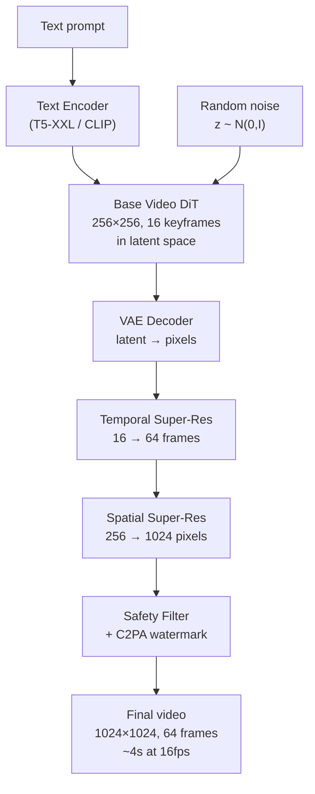

# Text-to-Video Generation — ML System Design

## Understanding the Problem

Text-to-video generation is the most computationally demanding generative AI task currently deployed in production. Systems like OpenAI's Sora, Meta's Movie Gen, Google's Veo, and Runway's Gen-3 take a text prompt — "a golden retriever puppy playing in autumn leaves" — and produce a smooth, realistic video clip where the puppy jumps, leaves fly, and the camera tracks the action. Every frame must be individually photorealistic AND temporally consistent with every other frame. A single 4-second clip at 720p contains ~110 million pixels — 120x more data than one image. This makes video generation the "final boss" of generative AI: everything that is hard about image generation becomes 100x harder when you add the temporal dimension.

## Problem Framing

### Clarify the Problem

**Q:** What is the target video duration and resolution?
**A:** Consumer-grade product: 4-8 second clips at 512x512 to 720p resolution, 24fps. Professional tier could extend to 15 seconds at 1080p, but let's start with the consumer target.

**Q:** How long can users wait for results?
**A:** Video generation takes 30-300 seconds depending on length and resolution. This is an asynchronous job — the user submits a prompt, receives an estimated completion time, and gets notified when the video is ready. Not real-time.

**Q:** What is the most important quality dimension?
**A:** Temporal consistency. A video where a dog's fur changes color between frames, or where objects teleport, is completely unusable — even if each individual frame looks photorealistic. Consistency trumps per-frame quality.

**Q:** What input modalities do we support?
**A:** Text-only for the initial product. Future extensions include text + reference image (generate a video that looks like this scene) and text + reference video (generate a variation of this clip).

**Q:** What is the data situation?
**A:** Image-text pairs: ~5 billion available (LAION, etc.). Video-text pairs: ~100 million at best, with low caption quality. High-quality, well-captioned videos: maybe a few million. This 50x data scarcity shapes the entire training strategy.

**Q:** What are the safety constraints?
**A:** No NSFW content. No deepfake-style generation of real people without consent. All generated videos must carry C2PA provenance watermarks. Synthetic video is significantly more dangerous for misinformation than synthetic images because realistic motion is more cognitively persuasive.

### Establish a Business Objective

#### Bad Solution: Generation count

Users generate many videos experimentally, most of which they discard. High generation volume doesn't indicate the system is producing useful content. A user who generates 50 videos and downloads zero is a churn risk, not a success.

#### Good Solution: Share/download rate

Track the percentage of generated videos that users actually download, share, or use in downstream applications. A 15-20% download rate (download 3 out of 20 generated clips) indicates the system produces usable content. This directly measures whether the output is valuable enough to keep.

The limitation: download rate is influenced by prompt quality, not just model quality. A user who writes vague prompts gets poor results and low download rate, but the model may be fine — the user needs prompting guidance, not a better model.

#### Great Solution: Quality-adjusted engagement

Combine automated quality signals (FVD score, temporal consistency score, CLIP text-video alignment) with user behavior (download rate, re-generation rate, subscription retention). A user who downloads 5+ clips per session, rarely re-generates the same prompt, and maintains their subscription for 3+ months is extracting genuine value. Track this alongside per-prompt cost efficiency to ensure the business is sustainable at ~$0.50 per video generation.

### Decide on an ML Objective

This is **conditional video generation via latent diffusion**. Given a text prompt c, generate a video V ∈ R^{T×H×W×3} that is: temporally consistent (no flickering, identity drift, or physics violations), text-aligned (matches the prompt description), and visually high-quality (each frame is photorealistic).

The training objective extends image diffusion to video:

```
L = E_{t,z_0,ε,c} [||ε - ε_θ(z_t, t, c)||²]
```

where z ∈ R^{T'×h×w×C} is the compressed video latent from a spatiotemporal VAE, c is the text conditioning (T5/CLIP embedding), and ε is the noise to be predicted. This is mathematically identical to image diffusion — the model must predict spatially AND temporally coherent noise across the entire video latent.

## High Level Design



The system uses a **cascade pipeline** — no production system generates high-resolution, long-duration video in a single pass. The base model focuses on semantic content and coherent motion at low resolution. The temporal super-resolution model interpolates between keyframes to increase frame rate. The spatial super-resolution model upscales each frame to the target resolution. Each model is independently simpler (and cheaper) than doing everything at once.

## Data and Features

### Training Data

**Major datasets:**
- *WebVid-10M:* 10M video-text pairs from stock video websites. High text-video alignment (professional descriptions) but limited diversity (stock photo aesthetic)
- *HD-VILA-100M:* 100M HD video clips from YouTube with metadata-derived text
- *Panda-70M:* 70M video-caption pairs, re-captioned by video-language models for higher-quality descriptions
- *InternVid:* 234M video-text pairs with quality filtering

**Video-specific preprocessing pipeline:**

1. **Scene cut detection:** A single YouTube clip often contains multiple scene changes (jump cuts, camera switches). Training on multi-scene clips teaches the model that objects can teleport between frames. Use TransNetV2/PySceneDetect to detect scene boundaries; keep only clips without scene cuts within the training window.

2. **Optical flow quality filtering:** Compute optical flow (RAFT) between consecutive frames. Filter out static clips (near-zero flow — don't teach motion), blur/flicker clips (high flow variance — corrupted quality), and extremely fast motion (motion blur degrades training signal).

3. **Synthetic captioning:** Stock video metadata captions are often just titles or tags, not frame-level descriptions. Run a video-language model (Video-LLaVA, CogVLM-Video) to generate dense captions describing: scene content, camera motion (pan left, zoom in, static), action dynamics (running, jumping, rotating), and temporal progression (first... then... finally...). Caption quality directly bounds text conditioning quality.

4. **Resolution bucketing:** Group training clips by aspect ratio and resolution. Train with multi-resolution batches to teach aspect-ratio awareness and avoid stretching/squishing artifacts.

5. **Temporal standardization:** Downsample all training videos to a fixed frame rate (e.g., 16fps or 24fps). Store as VAE-encoded latent codes rather than raw pixels to reduce storage and I/O.

### Features

**Text conditioning:**
- T5-XXL or CLIP text encoder converts the prompt into dense embeddings
- These embeddings are injected via cross-attention at every DiT block
- Caption quality is critical — detailed descriptions of motion, camera, and temporal dynamics produce much better results than short captions

**Diffusion conditioning:**
- Timestep t injected via Adaptive Layer Normalization (AdaLN) — the model knows how noisy the current input is
- Classifier-free guidance (CFG) at inference: `ε̃ = ε_uncond + γ · (ε_cond - ε_uncond)`, with gamma typically 7-9 for video

**Positional encoding:**
- 3D Rotary Position Embedding (RoPE) extended to spacetime: embedding dimension split into three groups for (t, h, w) coordinates
- Enables the model to understand each token's position in both space and time

## Modeling

### Benchmark Models

**Independent frame generation (naive baseline):** Run a text-to-image model (Stable Diffusion) 120 times with the same prompt and different seeds. Each frame is photorealistic, but the result is unwatchable — objects teleport, faces morph, physics is violated. This makes the case for why temporal modeling is fundamental, not optional.

**Temporal inflation of 2D model (strong baseline):** Take a pretrained image diffusion U-Net, extend 2D convolutions to pseudo-3D (2D spatial conv + 1D temporal conv per frame), and add temporal attention layers between spatial attention blocks. Initialize temporal weights from identity transformations so the model starts by treating frames independently, then learns temporal dynamics. This is computationally efficient and leverages strong image priors, but pseudo-3D convolutions cannot capture joint spatiotemporal patterns (e.g., an object moving diagonally while changing color).

### Model Selection

#### Bad Solution: Inflated 2D U-Net with temporal layers

Take a pretrained image diffusion U-Net, extend 2D convolutions to pseudo-3D (2D spatial + 1D temporal), and add temporal attention layers. This is the cheapest path to video generation because it reuses existing image model weights. But pseudo-3D convolutions cannot capture joint spatiotemporal patterns (an object moving diagonally while changing color), and the U-Net's fixed resolution and limited attention range constrain video quality and diversity. Scaling up the U-Net architecture hits diminishing returns faster than Transformers.

#### Good Solution: Video DiT with factorized attention

A Transformer-based diffusion model with separate spatial and temporal attention layers. Spatial attention handles per-frame quality (same as image DiT), temporal attention handles cross-frame consistency. 4-16x cheaper than full 3D attention. Produces high-quality videos with good temporal consistency for simple motions. But factorized attention can't model cross-frame spatial interactions — when the camera pans, the same object appears at different spatial positions across frames, and factorized temporal attention (which only connects the same position across frames) can't track it.

#### Great Solution: Video DiT with full 3D attention + cascade pipeline

Full 3D spatiotemporal attention captures all interactions between any two tokens across space and time. Combined with a cascade pipeline (base model at low resolution → temporal super-resolution → spatial super-resolution), this achieves the best quality while keeping each individual model tractable. The base model focuses on semantic content and motion coherence; the super-resolution models focus on visual detail. This is the architecture behind Sora and Movie Gen.

| Approach | Architecture | Quality | Compute | Scaling | Used By |
|----------|-------------|---------|---------|---------|---------|
| Inflated U-Net | CNN + temporal layers | Good | Moderate | Limited | Make-A-Video, AnimateDiff |
| Video DiT (factorized attn) | Transformer, spatial+temporal | Very good | High | Good | CogVideoX, Runway Gen-2 |
| Video DiT (full 3D attn) | Transformer, full spacetime | Best | Very high | Best | Sora, Movie Gen |
| Cascade pipeline | Base + temporal SR + spatial SR | Best practical | High total, each model simpler | Good | Imagen Video, Sora |

### Model Architecture

**Production choice: Video DiT with cascade pipeline**

**Spatiotemporal VAE (compression):**

A video-aware VAE compresses the raw video both spatially (8x per dimension) and temporally (4-8x):

```
Raw:        T×H×W×3       (e.g., 120×512×512×3 = 94M pixels for 5s@24fps)
Compressed: T'×h×w×C      (e.g., 30×64×64×4 = 500K values)
Compression: ~190×
```

The spatial compression uses the same approach as image VAEs. The temporal compression is new — neighboring frames share substantial information (frame 1 and frame 2 of a talking head are ~95% identical), so temporal compression is highly effective for slow/moderate motion. Aggressive temporal compression (32x+) fails for fast motion because the content changes too rapidly between compressed frames — the Nyquist limit constrains how much temporal compression is feasible.

Training loss: L_recon + L_perceptual (LPIPS) + L_adversarial + L_KL

**Video DiT (denoising backbone):**

The core model is a Diffusion Transformer operating on 3D spacetime patches:

```
Video latent: (T'=15, h=64, w=64)
3D patch size: (p_t=2, p_h=4, p_w=4)
Num tokens: (15/2) × (64/4) × (64/4) = 7 × 16 × 16 ≈ 1,792 tokens
```

Each token is a flattened 3D cube projected to d_model. A single DiT block:

```
1. LayerNorm → Spatial Self-Attention (patches within same frame)
2. LayerNorm → Temporal Self-Attention (same spatial position across frames)
3. LayerNorm → Cross-Attention (attend to text embeddings from T5/CLIP)
4. LayerNorm → Feed-Forward Network
5. AdaLN (inject diffusion timestep t)
× 28-48 blocks
```

**Factorized vs. full 3D attention tradeoff:**

Full 3D attention (each token attends to all N spacetime tokens): O(N²) FLOPs per layer. For N=1,792 tokens: ~3.2M attention pairs per head per layer. Captures all spatiotemporal dependencies, including cross-frame spatial interactions.

Factorized attention (spatial within frame + temporal across frames): O((H'×W')² × T') spatial + O(T'² × H'×W') temporal. Roughly 4-8x cheaper but loses direct cross-frame spatial interactions — it cannot model "object at position (h1,w1) in frame 1 interacts with object at (h2,w2) in frame 5" in a single attention operation.

Production models use factorized attention for consumer-speed generation (Runway Gen-2, AnimateDiff) and full 3D attention for quality-first generation (Sora at the cost of minutes per clip).

**Joint image-video training:**

To compensate for the 50x scarcity of video-text data vs. image-text data, the model trains on a mix of both:
- Images treated as single-frame videos (T=1)
- Video clips as full temporal sequences (T=16+)

Images provide diverse visual content and fine-grained quality signal to the spatial attention layers. Videos teach temporal dynamics to the temporal attention layers. However, images contribute zero gradient to temporal attention weights (T=1 means nothing to attend to temporally), so temporal quality depends entirely on the scarcer video data.

## Inference and Evaluation

### Inference

**Cascade inference pipeline:**

1. **Base model** generates 256×256, 16 keyframes in latent space via 50-step DDIM with CFG (gamma=7.5)
2. **VAE decoder** converts latent to pixels — 16 low-resolution keyframes
3. **Temporal super-resolution** interpolates 16→64 frames (4x) using a lightweight frame interpolation model
4. **Spatial super-resolution** upscales 256→1024 pixels (4x) per frame using a video-aware super-resolution diffusion model
5. **Safety filter** + C2PA watermark embedding

**Compute requirements:**

A 5-second 512×512 video at 24fps requires:
- Video latent: ~60MB after CausalVAE compression
- Video DiT activations during 50-step DDIM: ~70GB with a 7B parameter model
- Practical requirement: 4-8× A100/H100 GPUs per generation
- Generation time: 30-90 seconds for consumer-grade, minutes to hours for Sora-quality

**Async serving architecture:**

Video generation cannot be served interactively (30-300 second generation time):
1. User submits prompt → receives job_id and ETA
2. Job enters priority queue → assigned to GPU cluster node
3. Generation runs (30-300s)
4. Completed video stored in S3 → push notification to user
5. User downloads via pre-signed URL

**Progressive preview (temporal streaming):**

To reduce perceived latency, generate and stream frames progressively:
- Generate keyframes first (frames 1, 6, 12, 18, 24) using fewer diffusion steps
- Stream low-quality preview frames within ~5 seconds
- Continue generating full-quality video
- Update client with final video when complete

**Cost per video:**

At $2/hour per A100 and 8 A100s per 5-second video for 2 minutes: ~$0.53 per video. At a $1.99 product price: ~3.75x gross compute margin before infrastructure overhead.

### Evaluation

**Offline Metrics:**

| Metric | What It Measures | How It Works | Target |
|--------|-----------------|-------------|--------|
| FVD (Fréchet Video Distance) | Overall video quality + temporal dynamics | Fréchet distance in I3D feature space (captures motion) | < 200 (excellent), < 500 (good) |
| Per-frame FID | Individual frame realism | Fréchet distance in Inception feature space | < 30 |
| CLIPScore (frame-averaged) | Text-video alignment | CLIP cosine similarity averaged across frames | > 0.25 |
| Warping error | Temporal consistency | LPIPS between flow-warped frame t and actual frame t+1 | < 0.10 |
| DINO cosine similarity | Subject consistency | DINO feature similarity between consecutive frames | > 0.90 |

**FVD vs. FID — a critical distinction:** FID uses Inception features (single-frame CNN) and measures per-frame quality only. FVD uses I3D features (3D CNN trained on Kinetics action recognition) and captures both spatial appearance AND temporal dynamics. A flickering video will produce different I3D features from a temporally smooth video, even if frame-by-frame FID is identical. However, FVD has blind spots: I3D is trained on human action recognition, so it's insensitive to physical plausibility of non-human motion (water flowing sideways), fine-grained object consistency, and semantic accuracy.

**Human evaluation (the gold standard):**
- Elo ratings from side-by-side comparisons (A vs. B, which video is better?)
- Motion quality: do objects move with realistic physics?
- Temporal coherence: does the scene remain consistent? (same object, same lighting, no flickering)
- Prompt following (temporal): does the described motion ("camera pans left") occur correctly?
- VBench: multi-dimensional benchmark covering 16+ aspects (subject consistency, motion smoothness, aesthetic quality, temporal flickering)

**Online Metrics:**
- Download/share rate per generated video
- Re-generation rate (low is good — user was satisfied on first try)
- A/B test cascade configurations (base resolution, SR model, number of diffusion steps)
- Guardrails: deepfake detection false negative rate, watermark persistence after video re-encoding

## Deep Dives

### ⚠️ Temporal Consistency — The Core Challenge

Temporal consistency failures come in three severity levels, each requiring different detection and mitigation.

**Hard discontinuities** are the most obvious: a person's shirt changes color between frame 47 and frame 48, or an object teleports. Detection: compute DINO feature cosine similarity between consecutive frames — a sudden drop below threshold flags a discontinuity. Also compute optical flow warping error: warp frame t by estimated optical flow to predict frame t+1, then measure LPIPS between the prediction and reality. High warping error = the temporal change is inconsistent with predicted motion.

**Flickering** is subtler: textures, lighting, or colors shift rapidly between frames even when no motion is occurring, producing an unpleasant shimmering effect. Root causes: (1) insufficient temporal attention range — if the attention window is too narrow (w_t=2), frames outside the window don't influence each other, allowing independent mode variation; (2) high-frequency components in the diffusion process — denoising steps at early timesteps (high noise) are mostly independent per frame, and if the total number of steps is too few, fine details don't have enough iterations to become temporally consistent; (3) VAE chunk boundary artifacts — the VAE encodes groups of frames together, and consistency across chunk boundaries may be poor.

**Physics violations** are the hardest: temporally smooth, flicker-free video where objects defy gravity, pass through each other, or move at impossible speeds. The model has learned statistical correlations from training videos but has no explicit physics model. Sora has learned trajectory statistics of common objects (balls roll, people walk) and general camera motion styles, but it has not reliably learned conservation laws, causal physical chains, or long-horizon physical consistency. This is a fundamental limitation of statistical learning — more data and bigger models improve the statistical approximation but cannot guarantee physical correctness.

### 📊 Factorized vs. Full 3D Attention — The FLOPs Reality

For a video with T=16 frames and H×W = 16×16 latent spatial tokens per frame (N = 4,096 total tokens):

**Full 3D attention:** Each token attends to all 4,096 tokens. FLOPs per layer ≈ 2 × N² × D = 2 × 4096² × 1024 ≈ 34 GFLOPs. Across 24 layers: ~816 GFLOPs just for attention.

**Factorized attention:** Spatial (within each frame): 16 frames × 2 × 256² × 1024 ≈ 2.1 GFLOPs. Temporal (each position across frames): 256 positions × 2 × 16² × 1024 ≈ 134 MFLOPs. Total: ~2.2 GFLOPs — roughly **16x cheaper** than full 3D.

What factorized attention loses: it cannot directly capture cross-frame spatial interactions. Specific failure cases: (1) **complex occlusion** — an object disappears behind another and reappears at a different spatial position; factorized temporal attention only tracks the same (h,w) position across frames and cannot follow the position change; (2) **camera motion** — panning/zooming causes every pixel's temporal trajectory to change, so factorized temporal attention at each fixed (h,w) sees a different object at each timestep; (3) **object interactions** — two objects at different positions interact (a ball hitting a wall) and factorized attention at the ball's position doesn't see the wall's temporal context.

A practical compromise: **sliding window attention** with a few global tokens. Each spatial position attends to a local temporal window (w_t=4-8 frames) for efficiency, while a small set of global tokens attend to all frames for long-range consistency. This sits between factorized (cheapest) and full 3D (best quality).

### 💡 Joint Image-Video Training — Why Images Help and Where They Stop

Joint training treats images as single-frame videos (T=1) and mixes them with video clips in each training batch. Movie Gen (Meta, 2024) found this outperforms video-only training at the same total training steps.

**Why images help:** (1) 50x more data — 5B+ image-text pairs vs. ~100M video clips provide much greater visual diversity; (2) spatial quality — images teach the spatial attention layers fine-grained visual quality, textures, and scene composition; (3) concept coverage — rare visual concepts (specific art styles, unusual animals, complex scenes) appear in image data but rarely in video.

**Where images stop helping:** (1) images contribute zero gradient to temporal attention weights (T=1 means nothing to attend to temporally), so temporal quality depends entirely on the scarcer video data; (2) distribution mismatch — high-quality photos have a different look from video frames (slightly blurry from motion, compressed, different aspect ratios), and aggressive image pretraining may shift the model toward unnatural video characteristics; (3) diminishing returns — at some scale of video data, additional images improve the model less than additional video.

**Gradient conflict:** During video training, temporal attention builds temporal consistency. But image gradients to spatial layers may shift the shared feature representation in ways that make temporal coherence harder. Mitigation: use separate normalization parameters for spatial vs. temporal layers, and gradually shift the training mix from image-heavy to video-heavy (curriculum strategy).

### 🏭 Scaling — Sora Cannot Generate 60 Seconds in One Pass

Sora's reported 60-second 1080p videos cannot be generated in a single attention window. The math: a 60-second video at 24fps = 1,440 frames. With 4x temporal compression → 360 latent frames. At 1080p with 8x spatial compression → 135×240 spatial = 32,400 spatial positions. Total tokens: 360 × 32,400 ≈ 11.7 million. Full 3D attention on 11.7M tokens: N² ≈ 1.4 × 10¹⁴ attention pairs per layer — completely intractable.

In practice, long videos are generated via: (1) **cascade pipeline** — generate low-resolution keyframes, then upsample spatially and temporally; (2) **sliding window generation** — generate the video in overlapping temporal chunks (e.g., 4-second windows with 1-second overlap), with cross-window identity anchoring to maintain consistency; (3) **autoregressive extension** — generate the first 4 seconds, condition the next 4 seconds on the last few frames of the previous chunk.

Each approach has tradeoffs. Cascade separates concerns but compounds errors across stages. Sliding window maintains consistency within chunks but can drift across long sequences. Autoregressive extension naturally handles arbitrary length but is slow (each chunk requires full generation) and tends toward semantic drift (the 60th second may not match the original prompt).

### 🔒 Safety — Video Deepfakes Are More Dangerous Than Image Deepfakes

Synthetic video carries uniquely high misinformation risk. A 10-second video of a public figure making a fabricated statement is far more persuasive than a still image because temporal consistency and realistic motion are processed by human cognition as strong evidence of authenticity.

**Multi-layer defense:**

1. **Input filtering:** Block prompts requesting specific real people (named entity detection). Block prompts describing violent, explicit, or deceptive scenarios.
2. **Output watermarking:** Every generated video must carry both (a) C2PA provenance metadata in the file header (links to generating system, timestamp, prompt) and (b) invisible steganographic watermark embedded in the pixel data (survives re-encoding, cropping, screenshot). Both must be present.
3. **Output content filtering:** Run NSFW classifier, face recognition against public figure database, and violence detection on generated video before delivery.
4. **Detection tools:** Make video deepfake detection tools publicly available so downstream platforms can identify AI-generated content even if watermarks are stripped.
5. **Rate limiting and abuse monitoring:** Track per-user generation patterns. Flag accounts generating large volumes of videos featuring faces (potential deepfake farm).

### 📊 Training Data Quality: The Video-Specific Preprocessing Challenge

Video training data requires far more preprocessing than image data. A raw YouTube clip is not ready for training — it contains scene cuts, watermarks, static segments, and captions that describe the video title rather than the visual content.

**Scene cut detection is essential.** A 30-second YouTube clip may contain 5+ scene cuts (jump cuts, camera switches, transition effects). If the model trains on a clip spanning a scene cut, it learns that objects can teleport and scenes can change instantly — exactly the failure mode we're trying to prevent. TransNetV2 or PySceneDetect detects scene boundaries; each training clip must come from a single continuous shot.

**Optical flow filtering removes degenerate clips.** Using RAFT (or RAFT-Stereo), compute dense optical flow between consecutive frames. Filter three failure modes: (1) near-zero flow clips (static footage — teach the model nothing about motion), (2) extreme flow clips (rapid camera shake, motion blur — corrupt the quality signal), (3) inconsistent flow (artifacts from video compression causing false motion). The target distribution is moderate, physically plausible motion.

**Synthetic captioning determines conditioning quality.** Stock video metadata captions are often just titles ("Sunset Beach B-Roll") rather than dense temporal descriptions ("golden sunlight glints off calm ocean waves as the camera slowly pans right, revealing a pier in the distance"). Re-captioning with a video-language model (Video-LLaVA, CogVLM-Video) dramatically improves text conditioning. Include three types of description: scene content (what objects are present), motion dynamics (how things are moving), and camera behavior (static, pan, zoom, dolly).

### 🏭 Temporal Super-Resolution: Frame Interpolation

The base model generates keyframes (e.g., 16 frames for 4 seconds). To reach the target frame rate (24fps = 96 frames for 4 seconds), a temporal super-resolution model interpolates between keyframes.

#### Bad Solution: Linear interpolation between keyframes

Blend adjacent keyframes linearly: `frame_t = (1-α) × frame_k + α × frame_{k+1}`. Simple and fast but produces ghosting — moving objects appear transparent and doubled at intermediate positions. Any motion faster than a slow drift produces clearly visible artifacts.

#### Good Solution: Optical flow-based interpolation (RIFE, AMT)

Estimate optical flow between keyframes, then warp each keyframe to the target intermediate timestamp using the estimated flow. RIFE runs at real-time speeds on GPU and produces clean interpolations for moderate motion. The limitation: flow estimation fails on occlusion boundaries (when objects reveal previously hidden regions) and on fast/complex motion (multiple objects moving in different directions).

#### Great Solution: Diffusion-based temporal super-resolution

Train a diffusion model conditioned on keyframes to generate intermediate frames. The model learns the temporal distribution between given keyframes rather than relying on explicit flow estimation. This handles occlusion, complex motion, and appearance changes (flickering lights, changing expressions) that flow-based methods cannot. The downside is compute cost — each intermediate frame requires 20-50 denoising steps vs. a single forward pass for flow-based methods.

### 📊 Evaluation Beyond FVD: Multi-Dimensional Video Quality

FVD (Fréchet Video Distance) is the standard automated metric, but it has critical blind spots that make it insufficient as a sole evaluation metric.

**FVD limitations:** FVD uses I3D features trained on Kinetics (human action recognition). It captures whether generated motion "looks like human actions" but is insensitive to: (1) physical plausibility of non-human motion (water flowing sideways, smoke defying gravity), (2) fine-grained object consistency (a person's eye color changing between frames), (3) text-video alignment (FVD measures distribution quality, not whether the video matches the prompt), (4) aesthetic quality within individual frames.

**VBench (multi-dimensional benchmark):** Evaluates 16+ dimensions independently: subject consistency (DINO similarity across frames), motion smoothness (flow consistency), aesthetic quality (LAION-Aesthetics per frame), temporal flickering (pixel variance in static regions), spatial quality (FID per frame), text-video alignment (CLIPScore), and more. Each dimension provides a separate score, revealing which aspects of video quality the model excels or struggles at.

**Human Elo evaluation:** The gold standard for overall video quality comparison. Show human raters two videos side by side (from different models or configurations) and ask which is better. Compute Elo ratings across thousands of comparisons per model. This captures holistic quality that no automated metric fully captures — the human judgment integrates visual quality, temporal coherence, prompt following, and aesthetic appeal simultaneously.

**Warping error for temporal consistency:** Compute optical flow from frame t to t+1, warp frame t by the flow, and measure LPIPS distance between the warped frame and the actual frame t+1. Low warping error means the temporal changes are consistent with predicted motion — a key signal for flickering and identity drift detection.

### 🏭 Video VAE Temporal Compression Limits: The Nyquist Argument

The spatiotemporal VAE compresses video along both spatial and temporal dimensions. Spatial compression (8x per axis) is well-understood from image VAEs. Temporal compression is fundamentally different because it involves the Nyquist sampling constraint.

**The Nyquist limit for video:** A signal with maximum frequency f must be sampled at 2f to avoid aliasing (information loss). For video, "frequency" is how fast the scene changes. A talking head changes slowly (~1-2 Hz) — 4-8x temporal compression preserves all motion information. A fast action scene (boxing, explosions) changes rapidly (~10+ Hz) — the same compression discards motion details, producing temporal aliasing (jerky, teleporting motion) in reconstruction.

**Adaptive temporal compression:** Instead of a fixed compression ratio, use content-aware temporal compression: compute optical flow magnitude per frame, and use higher temporal sampling (lower compression) for fast-motion segments and lower sampling (higher compression) for slow/static segments. This optimizes the token budget toward frames that carry the most temporal information.

**The fundamental tradeoff:** Higher temporal compression → fewer tokens → cheaper and faster generation. Lower temporal compression → more tokens → better motion fidelity but O(N²) attention cost increases quadratically. For consumer products (4-second clips with moderate motion), 4x temporal compression is the sweet spot. For professional products requiring fast-motion fidelity, 2x compression is necessary despite the 4x increase in token count.

### 🔄 Long Video Generation: Autoregressive Extension

The base model generates 4-8 seconds of video in a single pass. Users want 30-60 second clips. Extending beyond the model's temporal context window requires autoregressive or hierarchical approaches.

**Sliding window with overlap:** Generate the first 4-second chunk. Use the last 1-2 seconds as conditioning for the next chunk (noised to the appropriate diffusion timestep, providing a starting point). Generate the second chunk conditioned on the overlap region. Repeat until the target duration is reached. Overlap regions provide temporal continuity but can accumulate artifacts at chunk boundaries.

**Semantic drift is the primary failure mode.** By the 8th chunk (32 seconds in), the generated content may have drifted significantly from the original prompt. The text conditioning remains constant, but the visual content evolves through the conditioning chain. A prompt about "a dog running in a park" may gradually shift to "a dog standing near a tree" as each chunk's conditioning nudges the scene toward a stable equilibrium (static is easier for the model than sustained motion).

**Mitigation strategies:** (1) Re-inject the text prompt at full strength for each chunk (not just the overlap conditioning). (2) Use a global consistency model — extract key object embeddings from the first chunk and use them as additional conditioning for all subsequent chunks. (3) Hierarchical generation — first generate a low-resolution, low-frame-rate version of the full 60-second video (establishing global structure and motion trajectory), then upscale each segment independently. This ensures the overall narrative arc matches the prompt, even if individual segments are generated separately.

**Practical limit:** Current production systems generate up to ~15 seconds reliably. Beyond 30 seconds, semantic drift, temporal inconsistency, and accumulated artifacts make the output quality unpredictable. This is an active research frontier.

## What is Expected at Each Level?

### Mid-Level Engineer

A mid-level candidate should recognize that video generation is fundamentally harder than image generation because of temporal consistency — generating N independent frames fails catastrophically. They should describe the basic latent diffusion framework extended to video (compress with VAE, denoise with a model conditioned on text, decode), understand that a cascade pipeline (low-res → temporal SR → spatial SR) is necessary because nobody generates 1080p 60fps video in one shot, and mention FVD as the primary automated metric for video quality. They should know that video-text data is much scarcer than image-text data.

### Senior Engineer

A senior candidate explains the factorized spatial+temporal attention architecture and can articulate what it captures vs. what it misses compared to full 3D attention. They describe the spatiotemporal VAE's role in compressing the video before diffusion and understand why temporal compression is harder than spatial compression (fast motion violates the assumption of temporal redundancy). They design the async serving infrastructure (GPU cluster, job queue, progressive preview streaming) and estimate per-video compute costs (~$0.50 on 8x A100s). They distinguish FVD from FID (I3D captures temporal dynamics, Inception does not) and identify temporal flickering, identity drift, and physics violations as distinct failure modes with different detection approaches.

### Staff Engineer

A Staff candidate performs the FLOPs calculation for factorized vs. full 3D attention (16x cost difference) and connects this to specific video content types where factorized fails (occlusion, camera motion, object interactions). They recognize that Sora's 60-second videos cannot be generated in a single attention window and derive the memory constraint that makes this impossible (~11.7M tokens, ~10¹⁴ attention pairs). They explain the image-video gradient conflict in joint training (images contribute zero gradient to temporal layers, may shift spatial features in ways that hurt temporal consistency). They identify physical plausibility as a fundamental limitation of statistical learning — more data and bigger models improve the approximation but cannot guarantee physical correctness. They design tiered safety policies for different use cases (consumer social media vs. advertising vs. film studio) with appropriate tradeoffs between restriction and creative freedom.

## References

- OpenAI, "Sora: Video generation models as world simulators" (2024)
- Meta, "Movie Gen: A Cast of Media Foundation Models" (2024)
- Peebles & Xie, "Scalable Diffusion Models with Transformers (DiT)" (2023)
- Ho et al., "Imagen Video: High Definition Video Generation with Diffusion Models" (2022)
- Singer et al., "Make-A-Video: Text-to-Video Generation without Text-Video Data" (2022)
- Ho et al., "Video Diffusion Models" (2022)
- Huang et al., "VBench: Comprehensive Benchmark Suite for Video Generative Models" (2023)
- Unterthiner et al., "Towards Accurate Generative Models of Video: A New Metric & Challenges (FVD)" (2018)
